# CDN

## CDN是什么

对于`数字和文本类型`的数据，比方说名字和电话号码相关的信息。我们需要有个地方存起来。

我们通常会用`mysql数据库`去存。


当我们需要重新将这一数据取出的时候，就需要去读mysql数据库。

但因为mysql的数据是存在磁盘上的，单台实例，读性能到差不多5kqps就已经很不错了。

看起来还凑合，但对于稍微大一点的系统，就稍微有点捉急了。

为了提升点性能，我们在mysql之前再加一层内存做缓存层，比如常说的redis，读数据优先到内存里读，读不到才到mysql里读，大大减少了读mysql的次数。有了这套组合拳，读性能轻松上万qps。


好了，到这里，我们说的都是我们平时比较容易接触的开发场景。

但如果现在我要处理的，`不再是上面提到的文本类数据，而是图片数据`。

比如，每次刷某音听到有人翻唱蔡健雅的《letting go》的时候，我都忍不住想发同一张在评论区 并配文"还是忘不了"。

那么问题来了。

**这张图片数据应该存在哪？又该从哪里读？**

我们回过头去看mysql和redis的场景，无非就是**存储层加缓存层**。


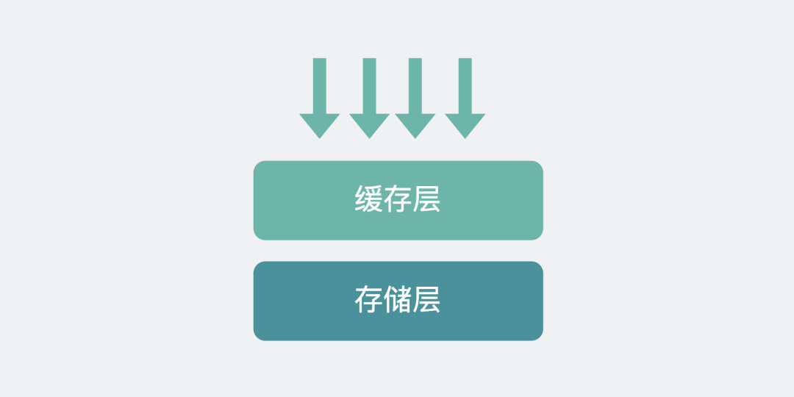
对于图片这样的**文件对象**，**存储层**不太可能再用mysql，应该改用专业的**对象存储**，比如亚马逊的`S3`（Amazon Simple Storage Service，注意后面是三个S开头的单词，所以叫s3），或者阿里云的**oss**（Object Storage Service）。下面的内容，我们就用比较常见的oss去做解释。

而**缓存层**，也不能继续用redis了，需要改成使用`CDN`（**C**ontent **D**elivery **N**etwork，内容分发网络）。

**可以将CDN简单理解为对象存储对应的缓存层。**


现在就可以回答上面的提问，对用户来说，这张图片数据存在了**对象存储**那，当有需要的时候，会从**CDN**那被读出来。

## CDN的工作原理
有了CDN和对象存储之后，现在我们来看下他们之间是怎么工作的。

我们平时看到的图片，可以右键复制查看它的URL。

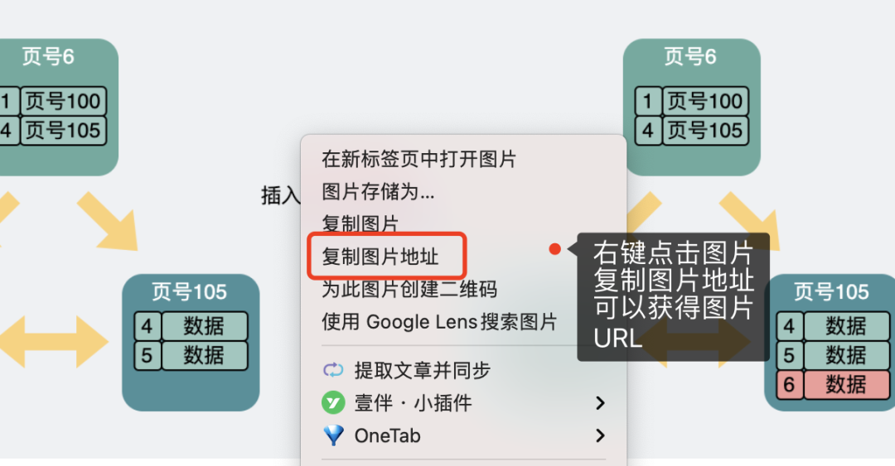

会发现图片的URL长这样。
```bash
https://cdn.xiaobaidebug.top/1667106197000.png
```
其中前面的`cdn.xiaobaidebug.top`就是`CDN`的域名，后面的`1667106197000.png`是图片的路径名。

当我们在浏览器输入这个URL就会发起HTTP GET请求，然后经历以下过程。


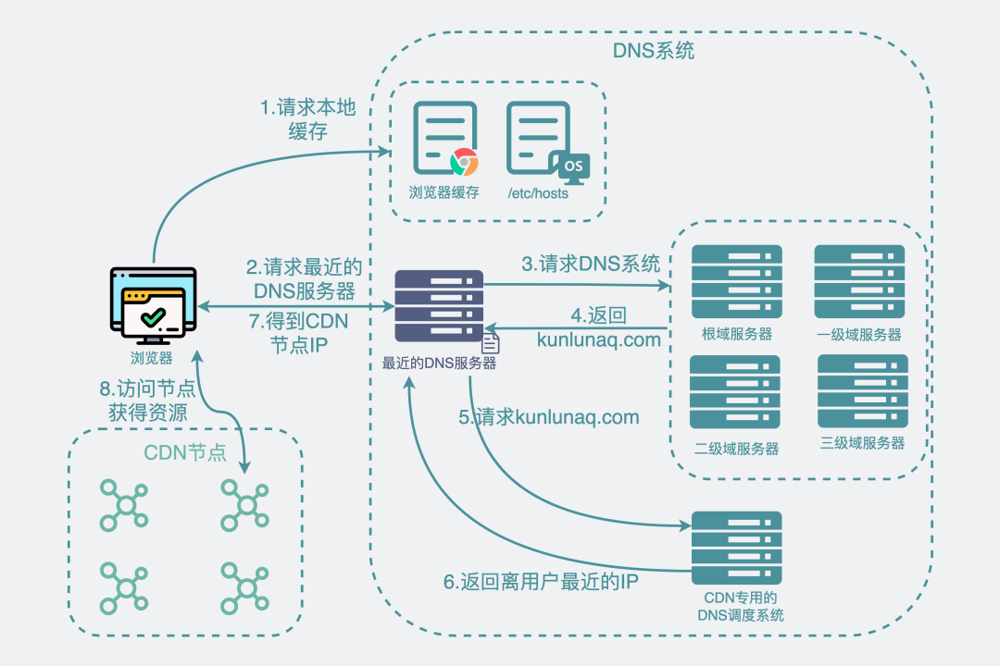
**第一阶段:** 你的电脑会先通过DNS协议获得`cdn.xiaobaidebug.top`这个域名对应的IP。

• step1和step2：先查看浏览器缓存，再看操作系统里的`/etc/hosts`缓存，如果都没有，就会去询问最近的DNS服务器（比如你房间里的家用路由器）。最近的DNS服务器上有没有对应的缓存，如果有则返回。

• step3：如果最近的DNS服务器上没有对应的缓存，就会去查询根域，一级域，二级域，三级域服务器。

• step4：然后，最近的DNS服务器会得到这个`cdn.xiaobaidebug.top`域名的别名（CNAME），比如`cdn.xiaobaidebug.top.w.kunlunaq.com`。

• `kunlunaq.com`是阿里CDN专用的DNS调度系统。

• step5到step7：此时**最近的DNS服务器**会去请求这个`kunlunaq.com`，然后返回一个**离你最近的IP地址**返回给你。

**第二阶段:** 对应上图里的step8。浏览器拿着这个IP去访问**cdn节点**，然后，cdn节点返回数据。

上面第一阶段流程里，提到了很多新的名词，比如`CNAME，根域，一级域`啥的，它们在之前写的 「DNS中有哪些值得学习的优秀设计」有很详细的描述，如果不了解的话可以去看下。


我们知道**DNS的目的就是通过域名去获得IP地址。**

但这只是它的众多功能之一。

DNS消息有很多种类型，其中**A类型**，就是用域名去查域名对应的IP地址。而**CNAME类型**，则是用域名去查这个域名的**别名**。

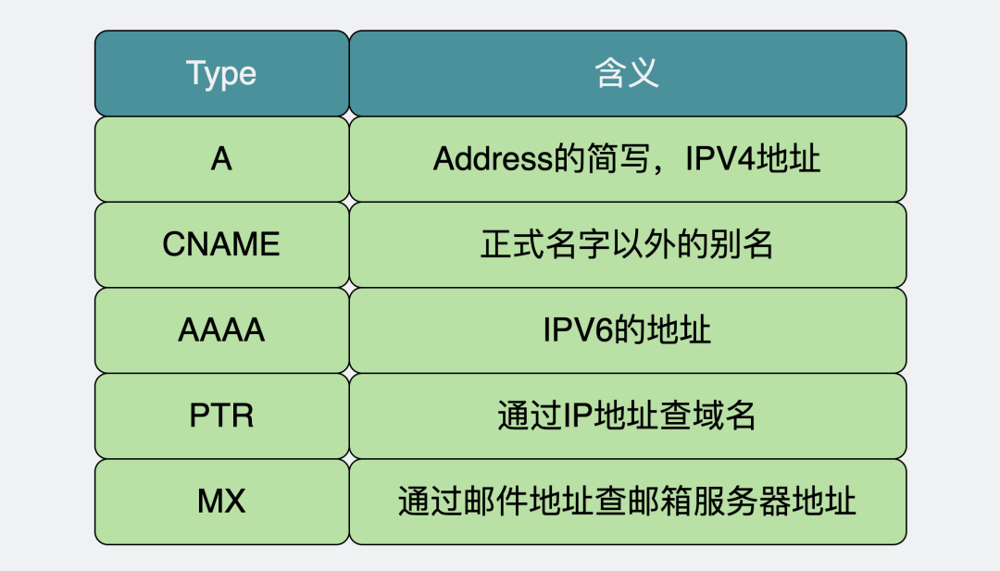
对于**普通域名**，DNS解析后一般就能直接得到域名对应的IP 地址（又叫`A类型记录`，A指Address）。

比如下面，我用`dig`命令发出DNS请求并打印过程数据。

```sh
$ dig +trace xiaobaidebug.top
;; ANSWER SECTION:
xiaobaidebug.top. 600 IN A 47.102.221.141
```

可以看到`xiaobaidebug.top`直接解析得到对应的IP地址`47.102.221.141`。

但对于**cdn域名**，一波查询下来，先得到的却是一条CNAME的记录`xx.kunlunaq.com`，然后dig这个`xx.kunlunaq.com`才能得到对应的`IP地址`。

```bash
$ dig +trace cdn.xiaobaidebug.top
cdn.xiaobaidebug.top. 600 IN CNAME cdn.xiaobaidebug.top.w.kunlunaq.com.

$ dig +trace cdn.xiaobaidebug.top.w.kunlunaq.com
cdn.xiaobaidebug.top.w.kunlunaq.com. 300 IN A 122.228.7.243
cdn.xiaobaidebug.top.w.kunlunaq.com. 300 IN A 122.228.7.241
cdn.xiaobaidebug.top.w.kunlunaq.com. 300 IN A 122.228.7.244
cdn.xiaobaidebug.top.w.kunlunaq.com. 300 IN A 122.228.7.249
cdn.xiaobaidebug.top.w.kunlunaq.com. 300 IN A 122.228.7.248
cdn.xiaobaidebug.top.w.kunlunaq.com. 300 IN A 122.228.7.242
cdn.xiaobaidebug.top.w.kunlunaq.com. 300 IN A 122.228.7.250
cdn.xiaobaidebug.top.w.kunlunaq.com. 300 IN A 122.228.7.251
```
看到这里，问题就又来了。

> 为什么要加个CNAME那么麻烦？


CNAME里指向的，其实是**CDN专用的DNS域名服务器**，它对整个DNS体系来说，只是其中一台小小的DNS域名服务器，**看起来就跟其他域名服务器一样，平平无奇**。DNS请求也会正常打入这个服务器里。

但当请求真正打到它上面的时候，它的特别之处就体现出来了，当查询请求打入域名服务器时，**普通的DNS域名服务器**返回域名对应的部分IP就够了，但CDN专用的**DNS域名服务器**却会要求返回离调用方"**最近的**"服务器IP。

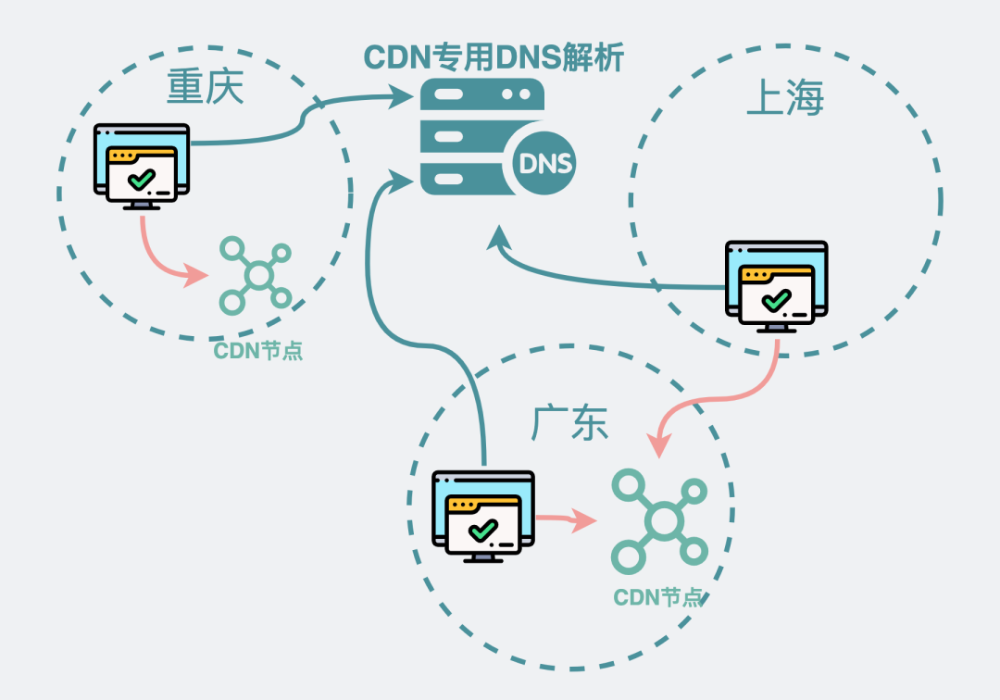


> 怎么知道哪个服务器IP里调用方最近？

可以看到"最近"这个词其实是加了**双引号**的。

**CDN专用的DNS域名服务器**其实是CDN提供商提供的，比如阿里云当然知道自己的的**CDN节点**有哪些，以及这些CDN服务器目前的负载情况和响应延时甚至权重啥的，并且也能知道调用方的IP地址是什么，可以通过调用方的IP知道它所属的运营商以及大概所在地，根据条件筛选出**最合适**的CDN服务器，这就是所谓的"**最近**"。

举个例子。假设地理位置最近的CDN机房流量较多，响应较慢，但地理位置远一些的服务器却能更好的响应当前请求，那按理说**可能**会选择地理位置**远一些**的那台CDN服务器。

也就是说，选出来的服务器**不一定在地理位置最近**，但一定是当前**最合适**的服务器。


## 回源是什么
上面的图片URL，是`https://cdn域名/图片地址.png`的形式。

也就是说这张图片是访问CDN拿到的。

那么，**直接访问对象存储能不能拿到图片数据并展示？**

比如像下面这样。

```
https://oss域名/图片地址.png
```

这就像问，不走redis，直接从mysql中能不能读取到文本数据并展示一样。

**当然能。**

我之前放在博客里的图片就是这么干的。

但这样成本更高，这里的**成本**，可以指**性能成本**，也可以指**调用成本**。看下下面这个图。

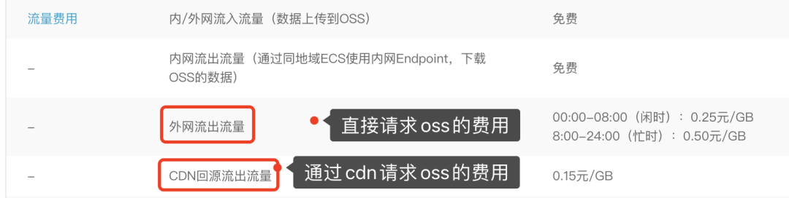

可以看到直接请求oss的费用差不多是通过cdn请求oss的两倍，考虑到家境贫寒，同时也为了让博客获取图片的速度更快，我就接入了CDN。

但看到这里，问题又又来了。

上面的截图里，红框里有个词叫"**回源**"。

**回源是什么？**

当我们访问`https://cdn域名/图片地址.png`时，请求会打到cdn服务器上面。

但cdn服务器本质上就是一层缓存，并不是数据源，**对象存储才是数据源**。

**第一次**访问cdn获取某张图片时，大概率在cdn里并没有这张图片的数据，因此需要**回**到数据**源**那去取出这份图片数据。然后再放到cdn上。下次再次访问cdn时，只要缓存不过期，就能命中缓存直接返回，这就不需要再回源。

于是访问的过程就变成了下面这样。

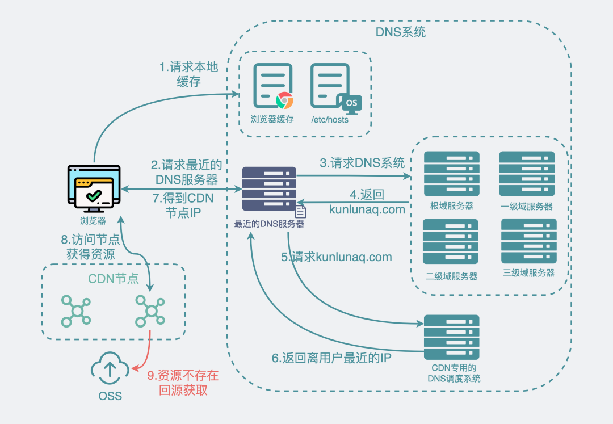


**那还有哪些情况会发生回源呢？**

除了上面提到的cdn上拿不到数据会回源站外，还有cdn上的**缓存过期失效了**也会导致回源站。

另外，就算有缓存，且缓存不过期，也可以通过cdn提供的**开放接口来触发主动回源**，但这个我们比较少机会能接触到。


另外，回源这个事情，其实用户是**感知不到**的，因为用户去读图片的时候，只能知道自己读到了还是读不到。

同样是**读到了**，还细分为是**从cdn那直接读的**，还是**cdn回源读对象存储之后返回的**。

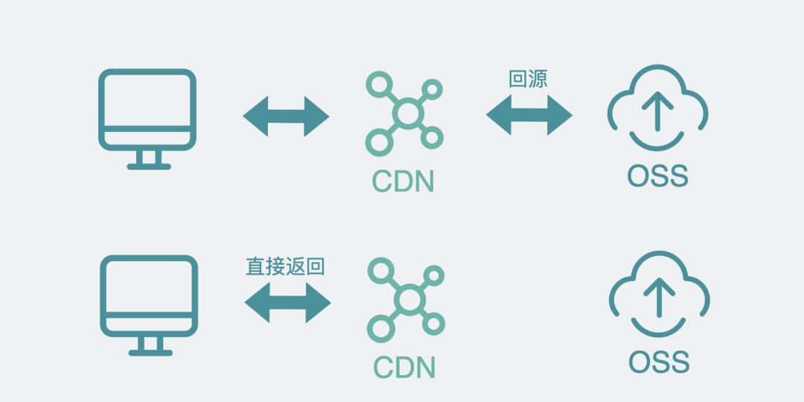

那么，**我们有办法判断是否发生过回源吗？**

有。我们接着往下看。


## 怎么判断是否发生回源
我们以某里云的对象存储和CDN为例。

假设我要请求下面这张图`https://cdn.xiaobaidebug.top/image/image-20220404094549469.png`

为了更方便的查看响应数据的`http header`，我们可以用上`postman`。

通过GET方法去请求图片数据。

然后通过下面的`tab`切换查看`response header`信息。


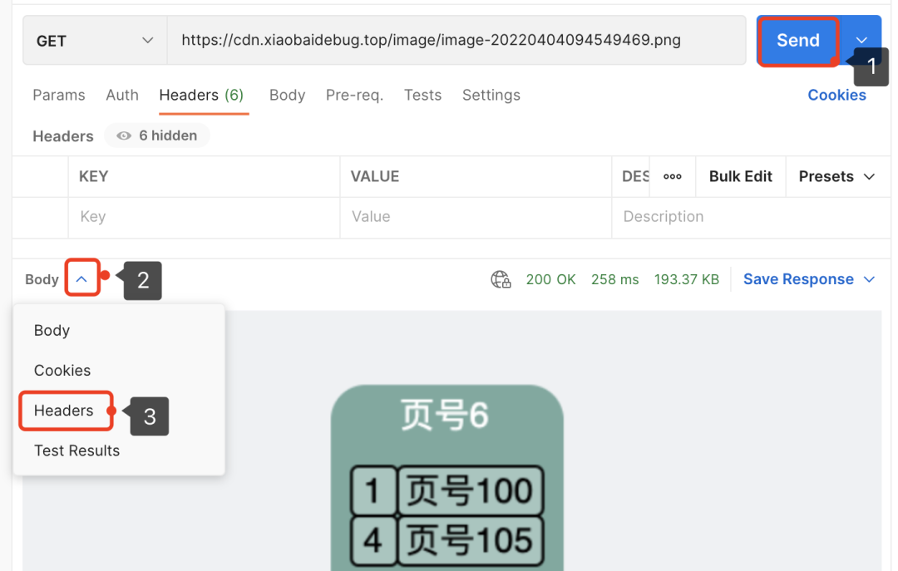

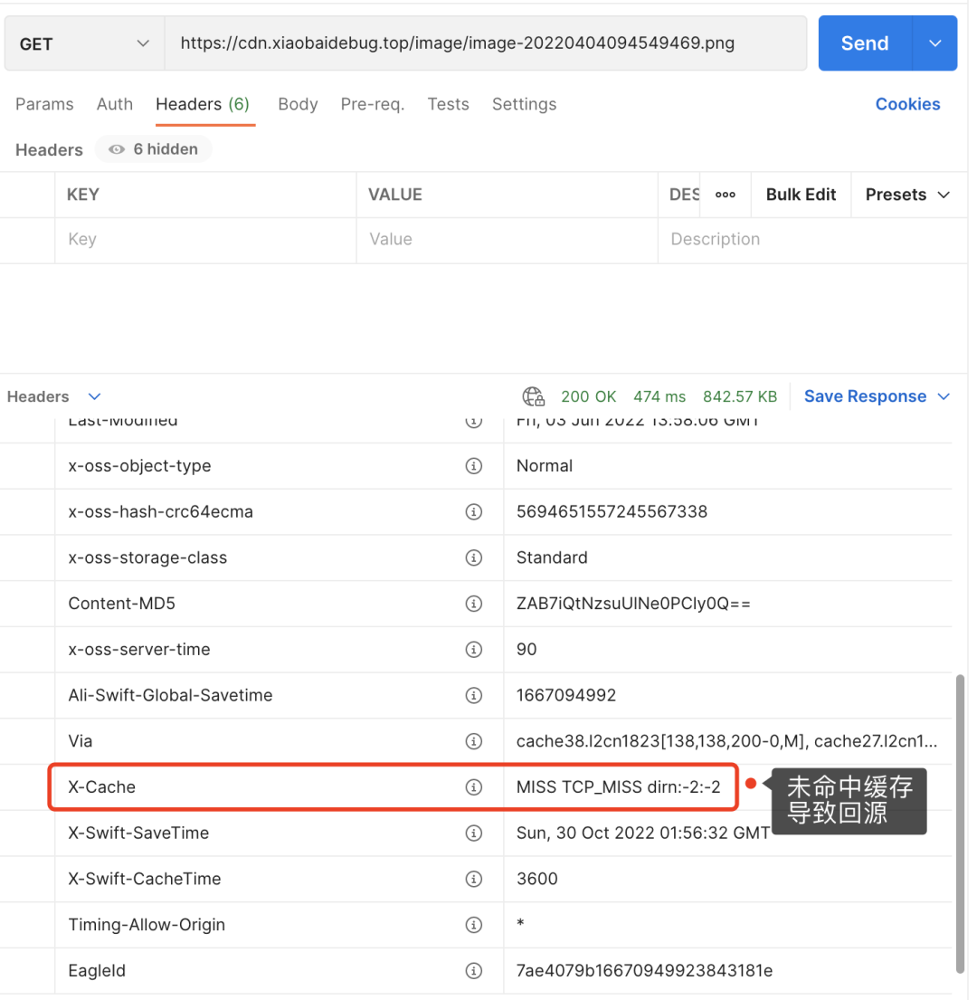

此时查看`response header`下的`X-Cache`的值是 `MISS TCP_MISS`。意思是未命中缓存导致CDN回源查oss，拿到数据后再返回。

那此时CDN里肯定是有这张图片的缓存了。我们可以试着**再执行**一次 GET 方法获取图片。


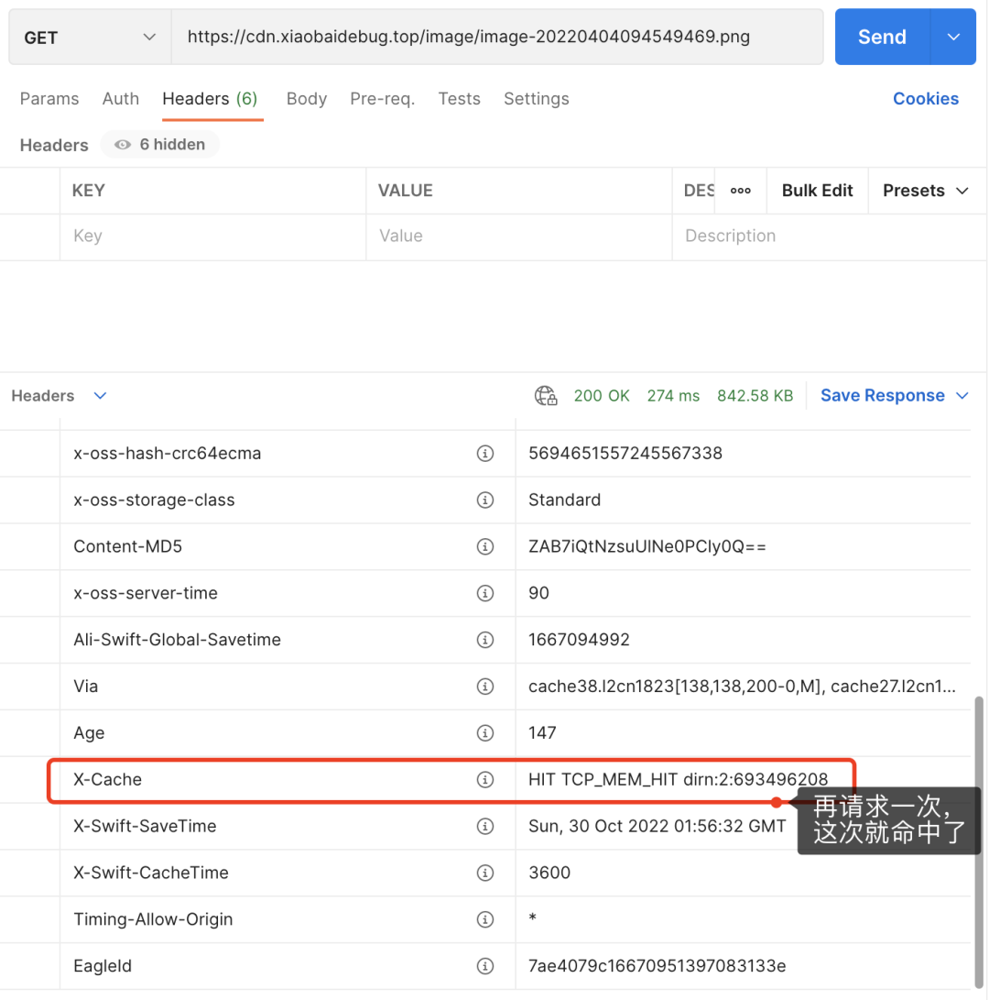
`X-Cache`的值就变成了 `HIT TCP_MEM_HIT`，这就是命中缓存了。

这个是某里云的做法，其他比如腾某云啥的，也都大差不差，几乎都可以从`response header`里找到相关的信息。

## 用了CDN一定比不用的更快吗？

看到这里我们就可以回答文章开头的问题了。

如果没有接入CDN，直接访问源站，流程是这样的。


但如果接入了CDN，且CDN上没有缓存数据，那就会触发回源。


相当于在原来的流程上还多了一层CDN的调用流程。

也就是，用了CDN时，**未命中CDN缓存**导致**回源**，就会比不用的时候更慢。

未命中缓存，可能是**cdn里压根就没这一数据**，也可能是**曾经有这条数据但后来过期失效了**。

这两种情况都正常，**大部分时候并不需要做任何处理**。

但对于极个别场景，我们可能需要做些优化。比如你们源站数据有大版本更新，就像**更换cdn域名**啥的，那在上线的那一刻用户全用新cdn域名去请求图片啥的，新CDN节点基本上百分百触发回源，严重的时候甚至可能会拖垮对象存储。这时候你可能需要提前将热点数据筛选出来，利用工具预先请求一波，让CDN加载上热数据缓存。比如某里云上的CDN就有这样的"**刷新预热**"功能。


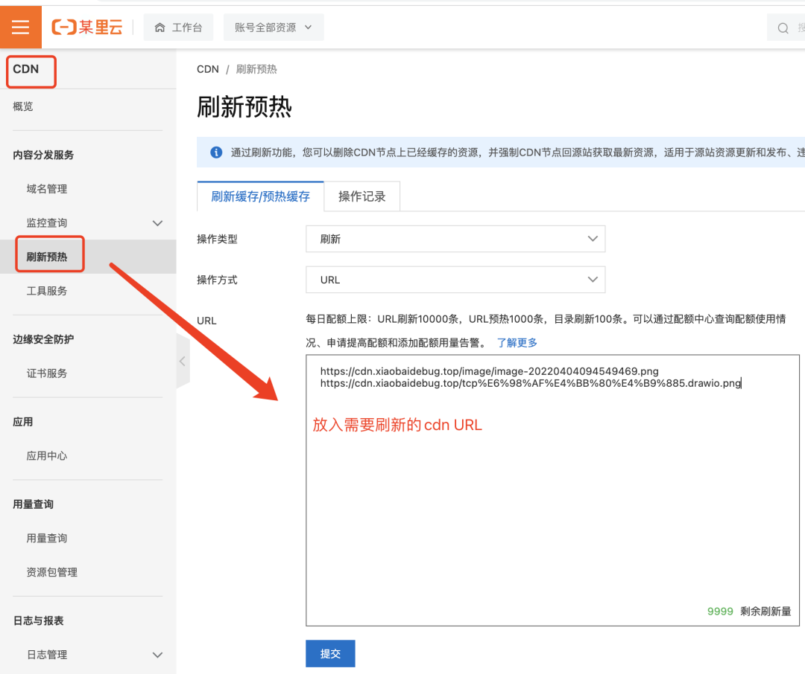
当然也可以通过**灰度发布**的模式，先让少量用户体验新功能，让这些用户把cdn"热"起来，然后再逐步放开流量。

还有就是**曾经有这条数据但后来过期失效了**，对于热点数据，可以适当提高一下cdn数据的**缓存时间**。


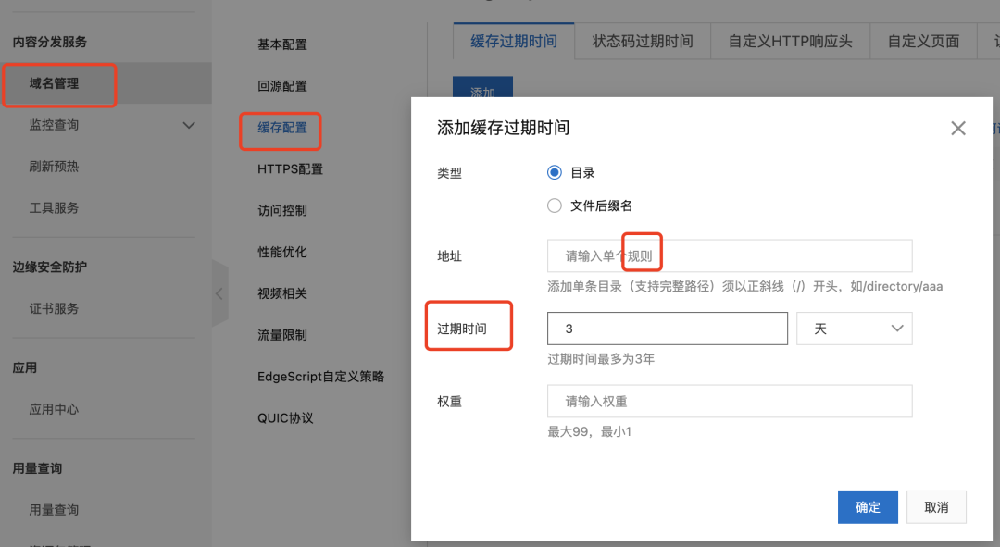

## 什么情况下不应该使用CDN？
从上面的描述看下来，CDN最大的优势在于，对于来自世界各地的用户，它可以**就近分配CDN节点**获取数据，并且**多次重复获取同一个文件**数据的时候，有缓存加速的作用。

这对于网页图片这样的场景，是再合适不过了。因为底层用的是**对象存储**，也就是说，只要是文件对象，比如**视频**啥的，都可以用这套流程接入cdn做加速。比如平时刷的某音某手短视频就是这么干的。

那反过来想想，问题就来了。

**什么情况下不应该使用CDN？**

如果你有一个公司**内网**的服务，并且服务请求的图片等文件不太可能被**多次重复调用**，这时候其实没必要使用CDN。

注意上面两个**加粗**了的关键点。

• **内网服务**，是为了保证你是了解服务的请求来源的，也能拿到对象存储的**读权限**，并且如果你的对象存储也是公司内部的，那大概率跟你的服务已经在**同一个机房**里，这已经**很近了**。接入CDN也享受不到"就近分配CDN节点"所带来的好处。

• 图片或其他文件**不太可能被多次重复使用**，如果接入了CDN，那你每次去访问CDN获取图片的时候，CDN节点上大概率没有你要的数据，相当于每次都需要**回源**到对象存储去取一把。那接入CDN相当于给自己加了一层代理，多一层代理，就多一层耗时。

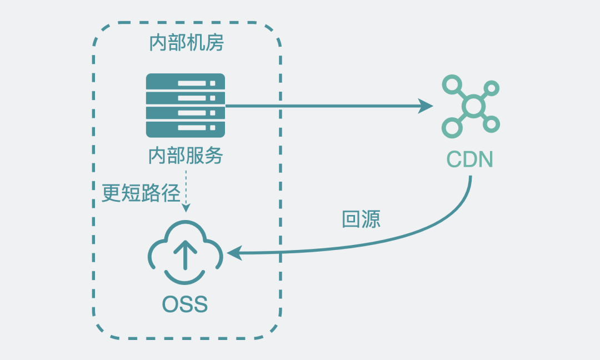

关于上面的第二点，如果你需要一个明确的指标去说服自己，那我可以给你一个。从上面的介绍内容，我们知道，可以通过cdn响应的http header中的`X-Cache`字段，看到一个请求是否触发过回源，统计次数，再除以总的请求数，就能得到回源的比例，比如回源比例高达90%，那还接啥cdn。

## 总结

:::info

• 对于文本类数据我们习惯用mysql做存储，redis做缓存。但属于文件类数据，比如视频图片，则需要使用oss等做对象存储，cdn做缓存。

• 用了CDN如果发生回源，那实际上会比不用的时候更慢一些。

• CDN最大的优势在于，对于来自世界各地的用户，它可以**就近分配CDN**节点获取数据，并且**多次重复获取同一个文件**数据的时候，有缓存加速的作用。如果你的服务和对象存储都在内网，并且文件数据也不太会有重复使用的可能性，那其实没必要接入cdn。

:::


