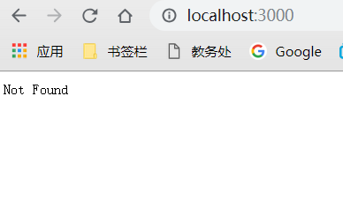
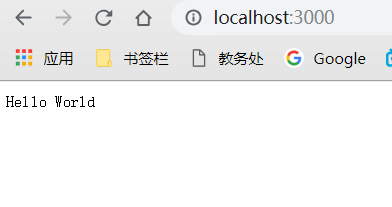
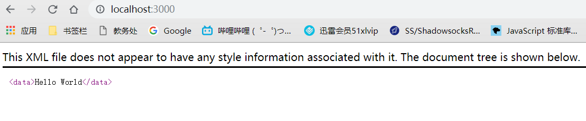
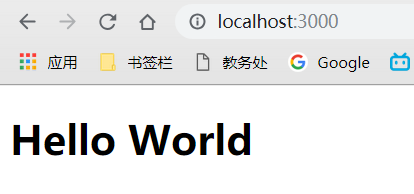
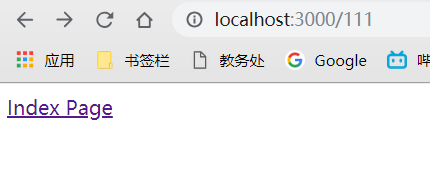
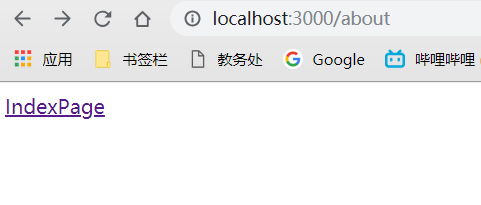

# Koa

## koa访问mysql数据库操作

### koa基本知识

koa依赖co, 最新版基于promise实现.我们使用koa的时候都是通过use添加一个中间件，router也是一个个中间件，我们看一下use都做了什么？

```javascript
app.use = function(fn){
    this.middleware.push(fn);
    return this;
};
```

它只是将参数保存起来，然后返回引用，最后由co完成调用，因此要求中间件中的异步调用都使用Promise形式。

### 实现方法一（co-mysql）

mysql库是以回调形式实现的，而koa中间件要求Promise形式，经过搜索，发现了co-mysql和mysql-co，这两个库的思路差不多，mysql-co封装度更高，并使用速度更快的mysql2，而co-mysql更简单，只是将mysql.query封装成Promise形式。下面是基于co-mysql的写法

```javascript
var wrapper = require('co-mysql'),
    mysql = require('mysql');
var options = {
    host : 'localhost',
    port : 3306 ,
    database : 'test',
    user: 'root',
    password : 'rootroot'
};

var pool = mysql.createPool(options),
    p = wrapper(pool);

//...
var rows = yield p.query('SELECT 1');
yield this.render('index', {
    title: rows[0].fieldName
});
//...
})();
```

### 实现方法二（promisify-node）

找到promisify-node库，可以将库整体转化为Promise形式，示例代码如下：

```javascript
var promisify = require("promisify-node");
var db = promisify("myDbHelper");
//...
var rows = yield db.getById('tableName', {id:1});
yield this.render('index', {
    title: rows[0].fieldName
});
//...
```

### 实现方法三（thunkify、thunkify-wrap）

看tj/co说明的Yieldables部分说明如下：
The yieldable objects currently supported are:

- promises
- thunks (functions)
- array (parallel execution)
- objects (parallel execution)
- generators (delegation)
- generator functions (delegation)

因此使用thunkify也能够完成封装，thunkify-wrap是一个增强版的thunkify，不过看说明，这种方法在未来的发展中可能会被淘汰，大概的使用如下：

```javascript
var genify = require('thunkify-wrap').genify;
var db = genify("myDbHelper");
//...
var rows = yield db.getById('tableName', {id:1});
yield this.render('index', {
    title: rows[0].fieldName
});
//...
```

### 实现方法四（直接方法）

直接改造原来express下的代码为Promise形式，参考了co-mysql，并仔细学习了Promise相关知识，完成了已有代码的改造，代码及说明如下：
dbHelper.js

```javascript
var config = require('./dbconfig');

var options = {
    'host': config.db_host,
    'port': config.db_port,
    'database': config.db_name,
    'user': config.db_user,
    'password': config.db_passwd
}

var mysql = require('mysql');
var pool = mysql.createPool(options);

//内部对mysql的封装，执行sql语句
function execQuery(sql, values, callback) {
    var errinfo;
    pool.getConnection(function(err, connection) {
        if (err) {
            errinfo = 'DB-获取数据库连接异常！';
            throw errinfo;
        } else {
            var querys = connection.query(sql, values, function(err, rows) {
                release(connection);
                if (err) {
                    errinfo = 'DB-SQL语句执行错误:' + err;
                    callback(err);
                } else {
                    callback(null,rows);        //注意：第一个参数必须为null
                }
            });
        }
    });
}

function release(connection) {
    try {
        connection.release(function(error) {
            if (error) {
                console.log('DB-关闭数据库连接异常！');
            }
        });
    } catch (err) {}
}
//对外接口返回Promise函数形式
exports.getById = function(tablename, id){
    return new Promise(function(resolve, reject){
        var values = {id:id};
        var sql = 'select * from ?? where ?';
        execQuery(sql,[tablename, values], function(err, rows){
            if(err){
                reject(err);
            }else{
                resolve(rows);
            }
        })
    });
}
```

routes/index.js

```javascript
var db = require("../dbHelper");
//...
var rows = yield db.getById('tableName', {id:1});
yield this.render('index', {
    title: rows[0].fieldName
});
//...
```

### 小结

koa框架以co库为核心组织，很好的用generator来解决了回调函数问题。进行Promise接口形式包装的时候，要注意：回调函数要完全符合其要求的形式：

```javascript
function(err, rows){
    if(err){
        reject(err);
    }else{
        resolve(rows);
    }
})
```

## 中间件

### koa-router

路由是Web框架必不可少的基础功能, koa.js为了保持自身的精简, 并没有像Express.js自带了路由功能, 因此koa-router做了很好的补充, 作为koa星数最多的中间件, koa-router提供了全面的路由功能, 比如类似Express的app.get/post/put的写法, URL命名参数,、路由参数、支持加载多个中间件、嵌套路由等。其他可选的路由中间件：`koa-route`, `koa-joi-router`,`koa-trie-router`

### koa-bodyparser

koa.js并没有内置Request Body的解析器, 当我们需要解析请求体时需要加载额外的中间件, 官方提供的koa-bodyparser是个很不错的选择, 支持x-www-form-urlencoded, application/json等格式的请求体, 但不支持form-data的请求体, 需要借助`formidable`这个库, 也可以直接使用`koa-body`或`koa-better-body`

### koa-views

koa-views对需要进行视图模板其渲染的应用是个不可缺少的中间件, 支持ejs,nunjucks等众多模板引擎.

### koa-static

Node.js除了处理动态请求, 也可以用作类似Nginx的静态文件服务, 在本地开发时特别方便, 可用于加载前端文件或后端Fake数据, 可结合`koa-compress`和`koa-mount`使用.

### koa-session

HTTP是无状态协议, 为了保持用户状态, 我们一般使用Session会话, koa-session提供了这样的功能, 既支持将会话信息存储在本地Cookie, 也支持存储在Redis, MongoDB这样的外部存储设备.

### koa-jwt

随着网站前后端分离方案的流行, 越来越多的网站从Session Base转为使用Token Base, JWT(Json Web Tokens)作为一个开放的标准被很多网站采用, koa-jwt这个中间件使用JWT认证HTTP请求.

### koa-helmet

网络安全得到越来越多的重视, helmet通过增加如Strict-Transport-Security, X-Frame-Options, X-Frame-Options等HTTP头提高Express应用程序的安全性, koa-helmet为koa程序提供了类似的功能, 参考Node.js安全清单.

### koa-logger

koa-logger提供了输出请求日志的功能, 包括请求的url、状态码、响应时间、响应体大小等信息， 对于调试和追踪应用程序特别有帮助，`koa-bunyan-logger`提供了更丰富的功能.

### koa-convert

对于比较老的使用Generate函数的koa中间件(<koa2), 官方提供了一个灵活的工具可以将他们转为基于Promise的中间件供Koa2使用, 同样也可以将新的基于Promise的中间件转为旧式的Generate中间件.

## Koa准备工作

学习网站

<http://www.ruanyifeng.com/blog/2017/08/koa.html#comment-text>

检查Node版本, Koa必须使用7.6以上的版本. 如果版本低, 要先升级Node.

```
$ node -v
v10.15.1
```

克隆配套的示例库

```
$ git clone https://github.com/ruanyf/koa-demos.git
```

进入示例库, 安装依赖.

```
$ cd koa-demos
$ npm install
```

示例都在demos目录下面

## 基本用法

### 架设HTTP服务

只要三行代码, 就可以用Koa架设一个HTTP服务.

```javascript
const Koa = require('Koa');
const app = new Koa();
app.listen(3000);
```

运行脚本

```
node 01.js
```

访问http://127.0.0.1:3000.页面显示"Not Found", 表示没有发现任何内容. 这是因为我们并没有告诉Koa应该显示什么内容.



### Context对象

Koa提供一个Context对象, 表示一次对话的上下文(包括HTTP请求和HTTP回复). 通过加工这个对象, 就可以控制返回给用户的内容.

`Context.response.body`属性就是发送给用户的内容.

```javascript
const Koa = require('Koa');
const app = new Koa();
const main = ctx=>{
    ctx.response.body='Hello World';
}
app.use(main);
app.listen(3000);
```

`main`函数用来设置`ctx.response.body`.使用`app.use`方法加载`main`函数.

`ctx.response`代表HTTP Response,`ctx.request`代表HTTP Request.

运行这个demo

```
node 02.js
```

http://127.0.0.1:3000, 现在就可以看到"Hello World"



### HTTP Response的类型

Koa默认的返回数据类型是`text/plain`, 如果想返回其他类型的内容, 可以先用`ctx.request.accepts`判断一下, 客户端希望接受什么样的数据类型(根据HTTP Request的Accept字段), 然后使用`ctx.response.type`指定返回类型.

```javascript
const Koa = require('Koa');
const app = new Koa();
const main = ctx =>{
    if(ctx.request.accepts('xml')){
        ctx.response.type='xml';
        ctx.response.body='<data>Hello World</data>';
    }else if(ctx.request.accepts('json')){
        ctx.response.type='json';
        ctx.response.body={data:'Hello World'};
    }else if(ctx.request.accepts('html')){
        ctx.response.type='html';
        ctx.response.body='<p>Hello World</p>';
    }else{
        ctx.response.type='text';
        ctx.response.body='Hello World';
    }
}
app.use(main);
app.listen(3000);
```

运行这个demo

```
node 03.js
```

访问http://127.0.0.1:3000, 看到的就是XML文档了



### 网页模板

实际开发中, 返回给用户的网页往往都写成模板文件. 我们可以让Koa先读取模板文件, 然后将这个模板返回给用户. 

```javascript
const Koa = require('Koa');
const app = new Koa();
const fs = require('fs');
const main = ctx=>{
	ctx.response.type='html';
    ctx.response.body= fs.createReadStream('./template.html');
}
app.use(main);
app.listen(3000);
```

运行demo

```
node 04.js
```

访问http://127.0.0.1:3000  看到的就是模板的内容了



## 路由

### 原生路由

网站一般有多个页面, 通过`ctx.request.path`可以获取用户请求的路径, 由此实现简单的路由.

```javascript
const Koa = require('Koa');
const app = new Koa();
const main = ctx=>{
    if(ctx.request.path!='/'){
        ctx.response.type='html';
        ctx.response.body='<a href='/'>Index Page</a>';
    }else{
        ctx.response.body='Hello World';
    }
}
app.use(main);
app.listen(3000);
```

运行demo

```
node 05.js
```

访问http://127.0.0.1:3000/111    可以看到一个链接,点击是跳转到首页的



### koa-route模块

原生路由用起来不太方便, 我们可以使用封装好的`koa-route`模块.

安装

`npm i koa-route`

```javascript
const Koa = require('Koa');
const route = require('koa-route');
const app = new Koa();

const main = ctx=>{
    ctx.response.body='Hello World';
}
const about = ctx=>{
    ctx.response.type='html';
	ctx.response.body='<a href="/">IndexPage</a>';   
}
app.use(route.get('/'),main);
app.use(route.get('/about'),about);
app.listen(3000);
```

上面代码中, 根路径`/`的处理函数是`main`, `/about`路径的处理函数是`about`.

运行demo

```
node 06.js
```

访问http://127.0.0.1:3000/about



### 静态资源

如果网站提供静态资源(图片, 字体, 样式表, 脚本...), 为它们一个个写路由就很麻烦, 也没必要.`koa-static`模块封装了这部分的请求.

