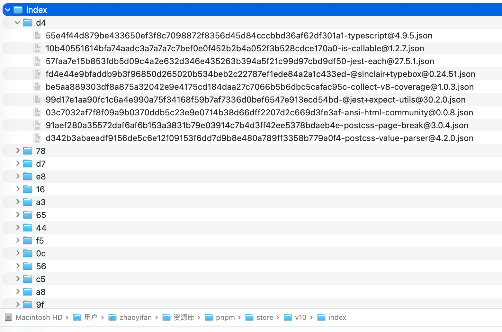
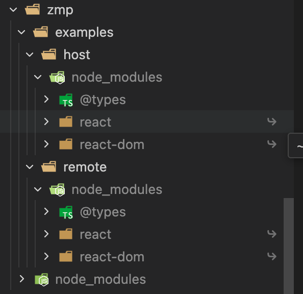

之前只知道pnpm中即使用了硬链接也使用了软连接，但是并不知道是如何在依赖中分别进行使用的什么，现在要重新梳理一下。

## 什么是 软链接

软链接它本身不包含真实数据，他就像windows中的“快捷方式”，它的内容是“指向了另一个文件的内容的字符串”。

特点：
- 删除源文件，软链接失效
- 占用控件极小（只包含一个路径）

## 什么是硬链接

硬链接是多个文件名指向磁盘上同一个真实文件内容（同一个 inode）的引用方式。
每个硬链接都被操作系统视为一个独立文件名，但它们共享完全相同的文件数据。

特点：
- 删除任意一个硬链接 → 文件仍然存在（因为还有其他引用）
- 内容真正共享，不复制文件
- 不支持跨文件系统或分区

## 为什么pnpm同时在使用硬链接和软链接呢？
硬链接：不同项目共享同一个依赖，节省磁盘空间，路径基本上在store文件夹中，`/Users/xxx/Library/pnpm/store/v10/index`，所有的项目最终都会硬链接到store文件夹。



那为什么这里不使用软连接必须使用硬链接呢？


```
store/react/index.js   （真实文件）
.pnpm/react/index.js   （硬链接指向上面）
projectA/.pnpm/react/index.js    （硬链接）
projectB/.pnpm/react/index.js    （硬链接）
```

因为在进行构建的时候，如果使用软连接，那么真实地址会直接从store开始，并不是以项目根目录进行的。

这会导致：
	1.	Node.js 真实路径 (realpath) 变成 store 路径 → 严重影响依赖
	2.	构建工具（webpack/vite）把依赖当成外部包处理 → HMR、预构建错乱
	3.	多个项目共享“同一个文件实体” → 一旦某个构建工具写入该文件，会污染全部项目
	4.	symlink 不支持“写时复制（Copy-on-write）”，无法隔离各项目

所以：文件内容只能硬链接，不能软链接。


那为什么node_modules里面使用的软链接，而不使用硬链接呢？


### 怎么能看出是硬链接还是软链接？

- 软链接有符号标记




- 硬链接没有符号标记

```
ls -l .pnpm/react@18.2.0/node_modules/react/index.js

输出
-rw-r--r--   2 user staff  2100 Jan 10 09:20 index.js

注意第2列数字“2”，表示的是一个硬链接。
```