# MongoDB

## 1.MongoDB介绍
- MongoDB是一个基于分布式文件存储的开源数据库系统
- MongoDB 将数据存储为一个文档，数据结构由键值(key=>value)对组成。MongoDB 文档类似于 JSON 对象。字段值可以包含其他文档，数组及文档数组。

Mongo数据库的优点

- 高可扩展性

- 分布式存储

- 低成本

- 结构灵活

数据库对比

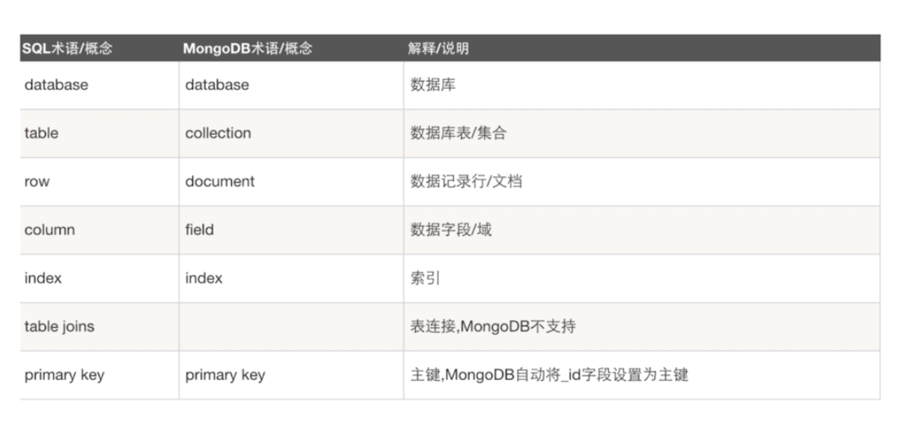


## 2.MongoDB的安装和环境搭建

### 2.1windows安装

[Windows官方安装指南](https://www.mongodb.org/downloads)


安装

下载安装包或者压缩包

添加db存储和日志存储文件夹

添加服务, 配置环境变量, 启动Mongo

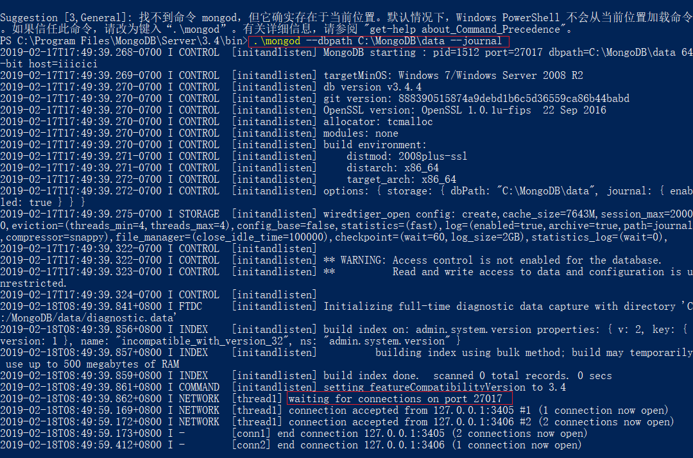

> 或者可以把配置文件写好了之后再通过命令配置

> etc文件夹下的mongo.conf文件

```
#数据库路径
dbpath=c:\MongoDB\data\
#日志输出文件路径
logpath=c:\MongoDB\logs\mongodb.log
#错误日志采用追加模式，配置这个选项后mongodb的日志会追加到现有的日志文件，而不是从新创建一个新文件
logappend=true
#启用日志文件，默认启用
journal=true
#这个选项可以过滤掉一些无用的日志信息，若需要调试使用请设置为false
quiet=false
#端口号 默认为27017
port=27017
#http配置
httpinterface=true
```


### 2.2mac安装

[Mac官方安装指南](https://docs.mongodb.com/manual/tutorial/install-mongodb-on-os-x/)

1. 先安装homebrew

   ```
   http://brew.sh/
   ```

2. 使用brew安装mongodb

   ```
   brew install mongodb
   ```

3. 再安装可视化工具 [Robomongo](https://robomongo.org/)

## 3.mongodb启动与连接

### 3.1windows启动服务器端

1. 找到mongodb安装目录，一般是`D:\Development Tools\MongoDB\bin`
2. 按下shift+鼠标右键，选择在此处打开命令窗口
3. 在除C盘外的盘符新建一个空目录，如：`D:\Mongodb\data`，就是新建一个空文件夹
4. 在命令行中输入`mongod --dbpath='[刚创建的空目录]'`，如`mongod --dbpath=D:\Mongodb\data`
5. 再按回车键

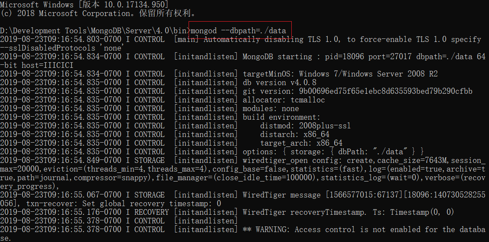

- 如果出现`waiting for connections on port 27017`就表示**启动成功**,已经在27017端口上监听了客户端的请求
- 注意：`--dbpath`后的值表示数据库文件的存储路径,而且后面的路径必须事先创建好，必须已经**存在**，否则服务开启失败
- 注意：这个命令窗体绝对**不能关**,关闭这个窗口就相当于停止了`mongodb`服务

## 4.MongoDB基本概念

- **数据库** MongoDB的单个实例可以容纳**多个**独立的数据库，比如一个学生管理系统就可以对应一个数据库实例
- **集合** 数据库是由集合组成的,一个集合用来表示一个**实体**,如学生集合
- **文档** 集合是由文档组成的，一个文档表示一条**记录**,比如一位同学张三就是一个文档

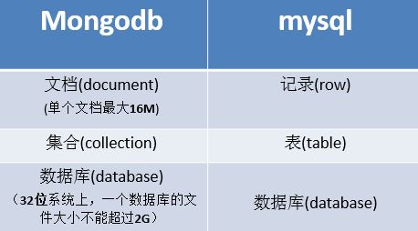

## 5.数据库操作

### 5.1使用数据库

语法：`use [database_name]`

- database_name代表数据库的名字
- 注：如果此数据库存在，则切换到此数据库下，如果此数据库还不存在也可以切过来，但是并不能立刻创建数据库

切换到`school`数据库下：`use school`

### 5.2查看所有数据库

语法：`show dbs`

- 我们刚创建的数据库`school`如果不在列表内，要显示它，我们需要向`school`数据库插入一些数据：`db.students.insert({name:'zfpx',age:1})`

### 5.3查看所有数据库

语法：`db`

- db代表的是当前的数据库，也就是school这个数据库

### 5.4删除数据库

语法：`db.dropDatabase()`

## 6.集合操作

### 6.1查看集合帮助

语法：`db.students.help()`

### 6.2查看数据库下的集合

语法：`show collections`

### 6.3创建集合

#### 6.3.1创建一个空集合

语法：`db.createCollection(collection_name)`

- collection_name集合的名称

#### 6.3.2创建集合并插入一个文档

语法：`db.collection_Name.insert(document_name)`

- document_name要插入的文档


## 7.插入文档

### 7.1insert

语法：`db.collection_name.insert(document)`

- collection_name集合的名字
- document插入的文档

> 每当插入一条新文档的时候mongodb会自动为此文档生成一个`_id`属性，`_id`一定是唯一的，用来唯一标识一个文档，`_id`也可以直接指定，但如果数据库中此集合下已经有此`_id`的话插入会失败

```
db.students.insert({_id:1,name:'zfpx',age:1});
WriteResult({"nInserted": 1})
db.students.insert({_id:1,name:'zfpx',age:1})
```

### 7.2save

语法：`db.collection_name.save(document)`

- collection_name集合的名字
- document插入的文档

> 注：如果不指定`_id`字段save()方法类似于insert()方法。如果指定`_id`字段，则会更新该`_id`的数据

```
db.students.save({_id:1,name:'zfpx',age:1});
WriteResult({ "nMatched" : 1, "nUpserted" : 0, "nModified" : 0 })
db.students.save({_id:1,name:'zfpx',age:100})
WriteResult({ "nMatched" : 1, "nUpserted" : 0, "nModified" : 1 })
```


## 8.更新文档

### 8.1语法

```
db.collection.update(
	<query>,
	<updateObj>,
	{
        upsert:<boolean>,
        multi:<boolean>
	}
)
```

### 8.2参数

- query查询条件，指定要更新符合哪些条件的文档
- update更新后的对象或指定一些更新的操作符
  - $set直接指定更新后的值
  - $inc在原基础上累加
- upsert可选，这个参数的意思是，如果不存在符合条件的记录时是否插入updateObj，默认时false，不插入
- multi可选，mongodb默认只更新找到的第一条记录，如果这个参数为true，就更新所有符合条件的记录

### 8.3upsert

将`students`集合中数据中`name`是zfpx2的值修改为zfpx22

```
> db.students.insert({_id:1,name:'zfpx1'});
WriteResult({ "nInserted" : 1 })
> db.students.update({_id:2},{name:'zfpx2'},{upsert:true});
WriteResult({ "nMatched" : 0, "nUpserted" : 1, "nModified" : 0, "_id" : 2 })
```

### 8.4multi

如果有多条name是zfpx2的数据只更新一条,如果想全部更新需要指定`{multi:true}`的参数

```
db.students.update({name:'zfpx2'},{$set:{age:10}},{multi:true});
WriteResult({ "nMatched" : 2, "nUpserted" : 0, "nModified" : 2 });
```


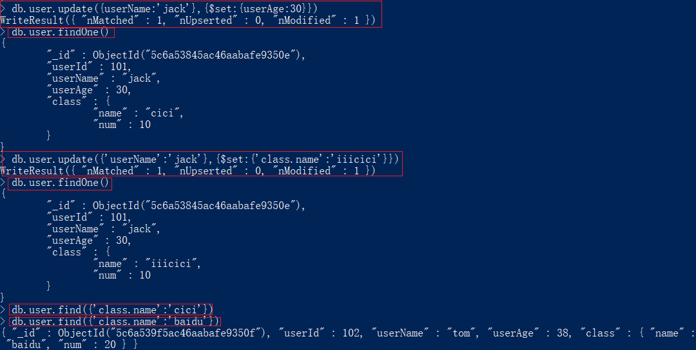

## 9.更新操作符

### 9.1$set

直接指定更新后的值

```
db.c3.update({name:'zfpx2'},{$set:{age:10}},{multi:true});
```

### 9.2$inc

在原基础上累加

```
db.c3.update({name:'zfpx2'},{$inc:{age:1}},{multi:true});
```

### 9.3$unset

删除指定的键

```
db.c3.update({name:'zfpx2'},{$unset:{age:1}},{multi:true});
```

### 9.4$push

向数组中添加元素

```
var result = db.student.update({name:'张三'},{
    $push:{"hobbys":"smoking"}
});
```

### 9.5$ne

`$ne`类似于MYSQL的 `not in` 或者`not exists`

```
db.student.update({name:'zfpx1',hobbys:{$ne:'smoking'}},{$push:{"hobbys":"smoking"}});
```

### 9.6$addToSet

向集合中添加元素

```
db.student.update({name:'zfpx1'},{$addToSet:{"hobbys":"smoking"}});
```

### 9.7$each

把数组中的元素逐个添加到集合中

```
var hobbys = ["A",'B'];
db.student.update({name:'zfpx1'},{$addToSet:{hobbys:{$each:hobbys}}});
```

### 9.8$pop

从数组中移除指定的索引中对应的元素

```
db.student.update({name:'zfpx1'},{$pop:{hobbys:1}});
```

### 9.9修改指定索引元素

```
db.c3.update({name:'zfpx1'},{$set:{"hobbys.0":"smoking2"}});
```

## 10.删除文档

### 10.1语法

```
db.collection.remove(
   <query>,
   {
     justOne: <boolean>
   }
)
```

### 10.2参数

- query：（可选）删除的文档的条件
- justOne：（可选）如果设为true或1，则只删除匹配到的多个文档中的第一个

### 10.3实例

删除worker集合里name是zfpx2的所有文档数据

```
> db.students.remove({name:'zfpx2'});
WriteResult({ "nRemoved" : 2 })
```

即使匹配多条也只删除一条

```
> db.students.remove({name:"zfpx2"},{justOne:true})
WriteResult({ "nRemoved" : 1 })
```

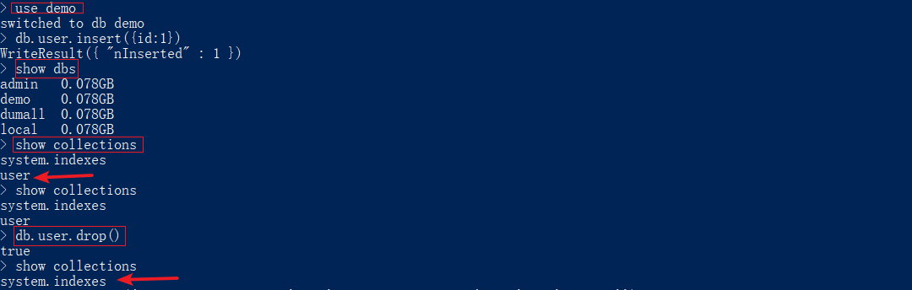

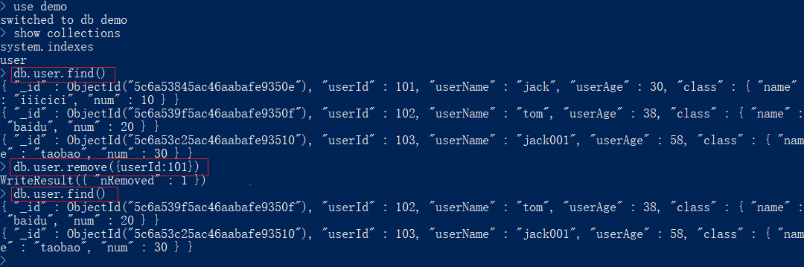

## 11.查询文档

### 11.1find

语法：`db.collection_name.find()`

参数：

collection_name集合的名字

实例：查询students下所有的文档

```
db.students.find()
```

`find().pretty()`查找并格式化数据

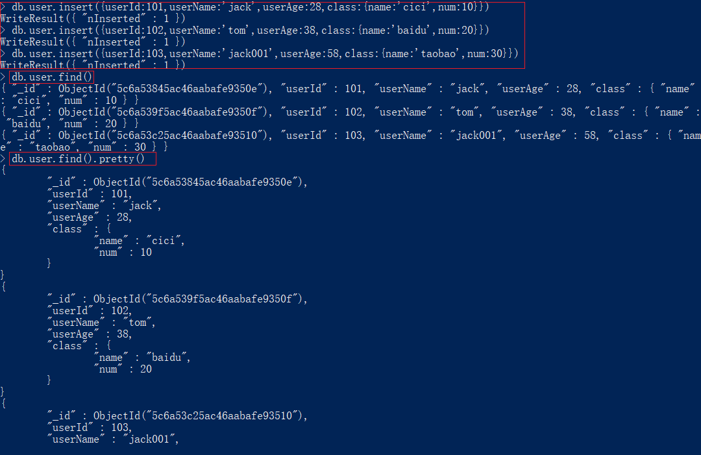

### 11.2查询指定列

语法：`db.collection_name.find({queryWhere},{key:1,key:1})`

参数列表：

- collection_name集合的名字
- queryWhere参阅查询条件操作符
- key指定要返回的列
- 1表示要显示

实例：只返回显示age列

```
> db.students.find({},{age:1})
```

### 11.3findOne

查询匹配结果的第一条数据

语法：

`db.collection_name.findOne()`

实例：

```
> db.students.findOne(
```


### 11.4$in

查询字段在某个范围内

语法：

`db.student.find({age:{$in:[30,100]}},{name:1,age:1})`

### 11.5$nin

查询字段不在某个范围内

`db.student.find({age:{$nin:[30,100]}},{name:1,age:1})`

### 11.6$not

对特定条件取反

- `db.student.find({age:{$not:{$gte:20,$lte:30}}})`

### 11.7array

对数组的查询

```
//按所有元素匹配
//let result = db.student.find({friends:[ "A", "B", "C", "D" ]});
//匹配一项 包含A的就可以
//let result = db.student.find({friends:"A"});
//$all 必须同时包含A B
//let result = db.student.find({friends:{$all:['A',"B"]}});
//$in 或者关系 ，包含A或者B
//let result = db.student.find({friends:{$in:['A',"B"]}});
//$size 按数组的长度去匹配
//let result = db.student.find({friends:{$size:4}});
//$slice 只返回数组中的某一部分
//let result = db.student.find({friends:{$size:5}},{name:1,friends:{$slice:2}});
//let result = db.student.find({friends:{$size:5}},{name:1,friends:{$slice:-2}});
$slice:["$array", [startIndex, ] length ] （startIndex可以省略，默认从0开始）
"friends" : [ "A", "B" ] }   "friends" : [ "C", "D" ]
db.stu.find({},{friends:{$slice:[0,3]}});  "friends" : [ "A", "B", "C" ]
```

### 11.8where

`db.student.find({$where:"this.age>30"},{name:1,age:1});`

### 11.9cursor

- 游标不是查询结果，而是查询的一个返回资源或者接口，通过这个接口，可以逐条读取数据

```
var result = db.student.find();

//while(result.hasNext()){
//    printjson(result.next());
//}

```

## 12.条件操作符

条件操作符用于比较两个表达式并从mongoDB集合中获取数据

### 12.1大于操作符

语法：

`db.collectoin_name.find({<key>:{$gt:<value>}})`

参数：

- collection_name集合名称
- key字段
- value值

实例：查询age大于30的数据

```
db.students.find({age:{$gt:30}})
```

### 12.2大于等于操作符

**语法**

`db.collectoin_name.find({<key>:{$gte:<value>}})`

**参数**

- collectoin_name 集合名称
- key 字段
- value 值

实例：查询age 3大于等于30 的数据

```js
db.students.find({age: {$gte: 30}}) 
```

### 12.3小于操作符

**语法**

`db.collectoin_name.find( {<key>:{$lt:<value>}})`

**参数**

- collectoin_name集合名称
- key 字段
- value 值

**实例**：查询age 小于30的数据

```js
db.students.find({age: {$lt: 30}}) 
```

### 12.4小于等于操作符

**语法**

`db.collectoin_name.find({<key>:{$lte:<value>}})`

**参数**

- collectoin_name集合名词
- key字段
- value值

实例：查询age 小于等于30的数据

```
db.students.find({age: {$lte: 30}}) 
```

### 12.5同时使用$gte和$lte

**语法**

`db.collectoin_name.find({<key>:{$gte:<value>},<key>:{$lte:<value>}})`

**参数**

- collectoin_name 集合名称
- key 字段
- value 值

**实例** 查询age 大于等于 30 并且 age 小于等于 50 的数据

```js
db.students.find({age: {$gte: 30, $lte: 50}})
```

### 12.6等于

**语法**

`db.collectoin_name.find({<key>:<value>,<key>:<value>})`

**参数**

- collectoin_name集合名词
- key字段
- value值

实例：查询age = 30的数据

```js
db.students.find({"age": 30})`
```

### 12.7使用_id进行查询

**语法**

`db.collectoin_name.find({"_id" : ObjectId("value")})`

**参数**

- value `_id`的值

**实例** 查询_id是 562af23062d5a57609133974 数据

```js
> db.students.find({_id:ObjectId("5adb666ecd738e9771638985")});
{ "_id" : ObjectId("5adb666ecd738e9771638985"), "name" : "zzzz" }
```

### 12.8查询结果集的条数

**语法**

`db.collectoin_name.find().count()`

**参数**

- collectoin_name 集合名称

**实例**

```js
db.students.find().count()
```

### 12.9正则匹配

**语法**

`db.collection_name.find({key:/value/})`

**参数**

- collectoin_name 集合名称
- key 字段
- value 值

**实例** 

查询name里包含zhang的数据

```js
db.students.find({name:/value/})
```

查询某个字段的值当中是否以另一个值开头

```js
db.students.find({name:/^zhang/})
```

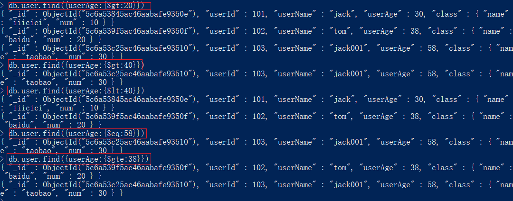

## 13.与和或

### 13.1and

find方法可以传入多个键(key)，每个键(key)以逗号隔开

**语法**

`db.collection_name.find({key1:value1, key2:value2})`

**实例** 

查询name是zfpx并且age是1的数据

```js
db.students.find({name:'zfpx',age:1})
```

### 13.2or

**语法**

```js
db.collection_name.find(
   {
      $or: [
   {key1: value1}, {key2:value2}
      ]
   }
)
```

**实例** 

查询age = 30 或者 age = 50 的数据

```js
db.students.find({$or:[{age:30},{age:50}]})
```

### 13.3and和or联用

**语法**

```js
db.collection_name.find(
   {
     key1:value1,
     key2:value2,
     $or: [
   {key1: value1},
   {key2:value2}
     ]
   }
)
```

**实例** 

查询 name是zfpx 并且 age是30 或者 age是 50 的数据

```js
db.students.find({name:'zfpx',$or:[{age:30},{age:50}]})
```

## 14.分页查询

### 14.1limit

读取指定数量的数据记录 

**语法**

`db.collectoin_name.find().limit(number)`

**参数**

- collectoin_name集合
- number读取的条数

**实例** 

查询前3条数据

```js
db.students.find().limit(3)
```

### 14.2skip

跳过指定数量的数据，skip方法同样接受一个数字参数作为跳过的记录条数 

**语法**

`db.collectoin_name.find().skip(number)`

**参数**

- collectoin_name集合
- number跳过的条数

**实例** 

查询3条以后的数据

```js
db.students.find().skip(3)
```

### 14.3skip+limit

通常用这种方式来实现分页功能 

**语法**

`db.collectoin_name.find().skip(skipNum).limit(limitNum)`

**参数**

- collectoin_name 集合名称
- skipNum 跳过的条数
- limitNum 限制返回的条数

**实例** 

查询在4-6之间的数据

```js
db.students.find().skip(3).limit(3);
```

### 14.4sort排序

sort()方法可以通过参数指定排序的字段，并使用 1 和 -1 来指定排序的方式，其中 1 为升序排列，而-1是用于降序排列。 **语法**

`db.collectoin_name.find().sort({key:1})`
`db.collectoin_name.find().sort({key:-1})`

**参数**

- collectoin_name集合
- key表示字段

**实例** 

查询出并升序排序 {age:1} age表示按那个字段排序 1表示升序

```
db.students.find().sort({age:1})
```

## 15.执行脚本

```javascript
var username = 'zfpx';
var password = '123456';
var user = { "username": username, "password": password };
var db = connect('students');//选择users数据库
var result = db.users.insert(user);
print('write ' + result);
```

```javascript
var start = Date.now();
var db = connect('students');
for (var i = 0; i < 1000; i++) {
    db.users.insert({ "username": "zfpx" + i });
}
var cost = Date.now() - start;
print('cost ' + cost + ' ms');
```

```js
var start = Date.now();
var db = connect('students');
var users = [];
for (var i = 0; i < 1000; i++) {
    users.push({ "username": "zfpx" + i });
}
db.users.insert(users);
var cost = Date.now() - start;
print('cost ' + cost + ' ms');
```

在命令行中执行

```
script>mongo 1.js
MongoDB shell version: 2.6.7
connecting to: test
connecting to: students
write WriteResult({ "nInserted" : 1 })
```

## 16.备份与导出

```
mongodump
    -- host 127.0.0.1
    -- port 27017
    -- out D:/databack/backup
    -- collection mycollection
    -- db test
    -- username
    -- password
//mongodump --host 127.0.0.1 --port 27017 --out ./backup --collection users --db students
//db.users.drop();

mongorestore
--host
--port
--username
--password

// mongorestore --host 127.0.0.1 --port 27017 ./backup
```

## 17.权限

### 17.1创建用户

- 使用`use admin`进入我们的admin库
- 使用`db.createUser`方法来创建集合

```js
db.createUser({
    user:'zfpx',
    pwd:'123456',
    customData:{
        name:'zhufengpeixun',
        email:'zhufengpeixun@126.com',
        age:9
    },
    roles:[
        {
          role:'readWrite',
          db:'school'
        },
        'read'
    ]
});
```

打开mongo服务

`mongo --config /user/local/etc/mongod/conf`

创建管理员

`db.createUser({user:"admin",pwd:"admin",roles:["root"]})`

给shoppingmall数据库创建用户

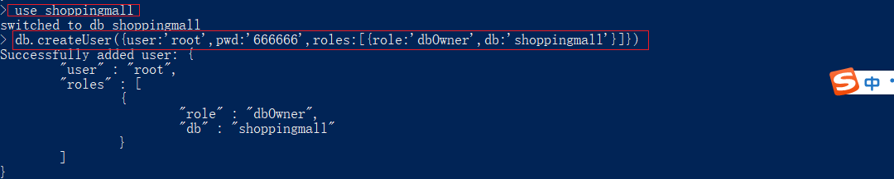

授权认证

`db.auth("","")`

返回1说明认证成功

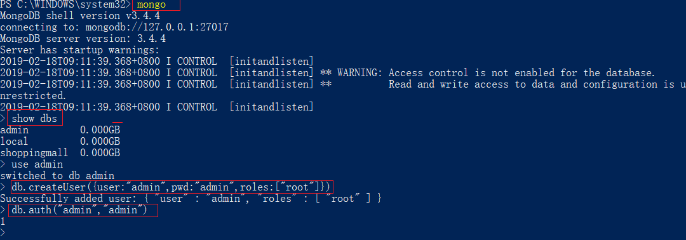

给使用的数据库添加用户

### 17.2查询用户

`db.system.users.find()`

### 17.3删除用户

`db.system.users.remove({user:'zfpx'})`

### 17.4启动数据库权限检查

`mongod --auth`
`mongo  -u zfpx -p 123456 127.0.0.1:27017/admin`

### 17.5鉴权

```
use admin;
db.auth('zfpx','zfpx');
```

- 正确返回1，如果错误返回0

## 18.索引

### 18.1准备数据

```
var db = connect('school');//选择users数据库
var users = [];
for(var i=0;i<20;i++){
    users.push({_id:i,name:'zfpx'+i});
}
print(users.length);
db.users.insert(users);
```

### 18.2打印出查询时间

```
var startTime = Date.now();
var  db = connect('school');          
var  records=db.users.find({name:"zfpx100"});
records.forEach(function(item){printjson(item)});
print(Date.now() - startTime);
```

### 18.3建立索引

```
db.users.ensureIndex({name:1});
```

## 19.附录
### mongoVue卸载

安装不上的话用msiexec命令进行安装

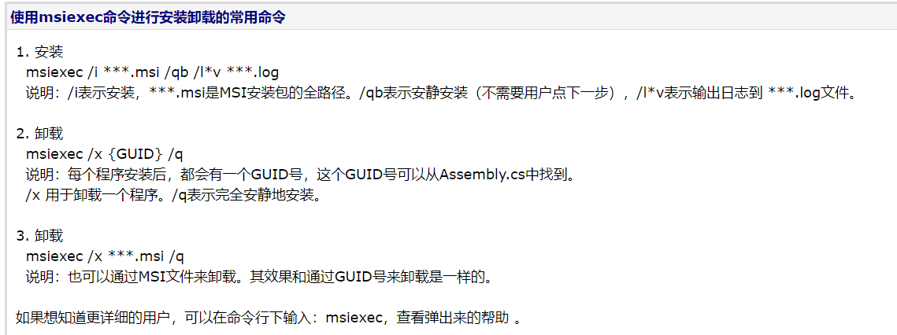

### 查看端口号对应的应用程序

`netstat -anto | findstr "[端口号]"`

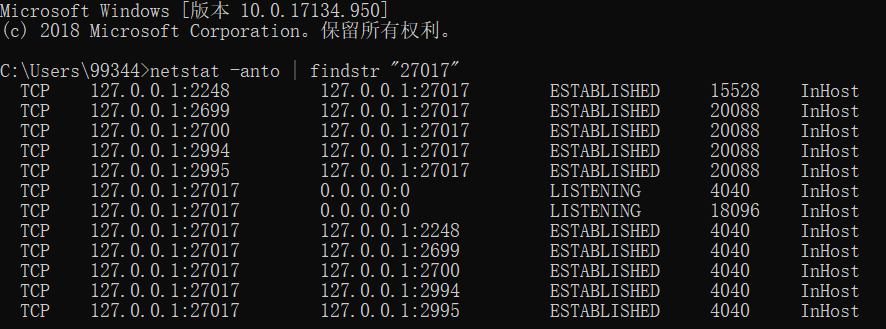

到【任务管理器】中找【详细信息】所对应的pid，就知道是哪个进程了。

### ObjectId构成

之前我们使用MySQL等关系型数据库时，主键都是设置成自增的。但在分布式环境下，这种方法就不可行了，会产生冲突。为此，MongoDB采用了一个称之为ObjectId的类型来做主键。ObjectId是一个12字节的 BSON 类型字符串。按照字节顺序，一次代表：

- 4字节：UNIX时间戳
- 3字节：表示运行MongoDB的机器
- 2字节：表示生成此_id的进程
- 3字节：由一个随机数开始的计数器生成的值

### Mongodb启动命令mongod参数说明

| 选项             | 含义                                        |
| ---------------- | ------------------------------------------- |
| --port           | 指定服务端口号，默认端口27017               |
| --logpath        | 指定MongoDB日志文件，注意是指定文件不是目录 |
| --logappend      | 使用追加的方式写日志                        |
| --dbpath         | 指定数据库路径                              |
| --directoryperdb | 设置每个数据库将被保存在一个单独的目录      |

### 集合命令

- db.students.help();

- DBCollection help

- db.students.find().help() - show DBCursor help 显示游标帮助

- db.students.count() 显示条数

- db.students.copyTo(newColl) - duplicates collection by copying all docum ents to newColl; no indexes are copied. 把一个旧集合拷贝到一个新的集合，不拷贝索引

- db.students.convertToCapped(maxBytes) - calls {convertToCapped:'students ', size:maxBytes}} command

- db.students.dataSize() 数据大小

- db.students.distinct( key ) - e.g. db.students.distinct( 'x' ) 统计唯一的key的数量

- db.students.drop() drop the collection ，删除集合

- db.students.dropIndex(index) - e.g. db.students.dropIndex( "indexName" ) 删除索引 or db.students.dropIndex( { "indexKey" : 1 } )

- db.students.dropIndexes() 删除 所有的索引

- db.students.ensureIndex(keypattern[,options]) - options is an object wit h these possible fields: name, unique, dropDups 添加索引

- db.students.reIndex()

- db.students.find([query],[fields]) - query is an optional query filter. fields is optional set of fields to return. 查找文档

  ```
       e.g. db.students.find( {x:
  ```

  77} , {name:1, x:1} )

- db.students.find(...).count() 数量

- db.students.find(...).limit(n) 限制返回的条数

- db.students.find(...).skip(n) 设置跳过的条数

- db.students.find(...).sort(...) 排序

- db.students.findOne([query]) 查找一条

- db.students.findAndModify( { update : ... , remove : bool [, query: {}, sort: {}, 'new': false] } ) 查找并且修改 更新后的值，是否删除，查询条件 排序 是否返回新值

- db.students.getDB() get DB object associated with collection 获得DB

- db.students.getPlanCache() get query plan cache associated with collecti on

- db.students.getIndexes() 获取索引

- db.students.group( { key : ..., initial: ..., reduce : ...[, cond: ...] } ) 分组统计

- db.students.insert(obj) 插入文档

- db.students.mapReduce( mapFunction , reduceFunction , ) 统计

- db.students.aggregate( [pipeline], ) - performs an agg regation on a collection; returns a cursor 聚合

- db.students.remove(query) 删除

- db.students.renameCollection( newName , ) renames the colle ction. 重命名集合

- db.students.runCommand( name , ) runs a db command with the gi ven name where the first param is the collection name

- db.students.save(obj) 保存对象

- db.students.stats() 统计信息

- db.students.storageSize() - includes free space allocated to this collec tion

- db.students.totalIndexSize() - size in bytes of all the indexes

- db.students.totalSize() - storage allocated for all data and indexes

- db.students.update(query, object[, upsert_bool, multi_bool]) - instead o f two flags, you can pass an object with fields: upsert, multi 更新

- db.students.validate( ) - SLOW

- db.students.getShardVersion() - only for use with sharding

- db.students.getShardDistribution() - prints statistics about data distri bution in the cluster

- db.students.getSplitKeysForChunks( ) - calculates split p oints over all chunks and returns splitter function

- db.students.getWriteConcern() - returns the write concern used for any o perations on this collection, inherited from server/db if set

- db.students.setWriteConcern( ) - sets the write conc ern for writes to the collection

- db.students.unsetWriteConcern( ) - unsets the write concern for writes to the collection

## 20.角色

### 20.1数据库用户角色

针对每一个数据库进行控制。

- read :提供了读取所有非系统集合，以及系统集合中的system.indexes, system.js, system.namespaces
- readWrite: 包含了所有read权限，以及修改所有非系统集合的和系统集合中的system.js的权限

### 20.2数据库管理角色

每一个数据库包含了下面的数据库管理角色。

- dbOwner：该数据库的所有者，具有该数据库的全部权限。
- dbAdmin：一些数据库对象的管理操作，但是没有数据库的读写权限。（参考：[http://docs.mongodb.org/manual/reference/built-in-roles/#dbAdmin）](http://docs.mongodb.org/manual/reference/built-in-roles/#dbAdmin%EF%BC%89)
- userAdmin：为当前用户创建、修改用户和角色。拥有userAdmin权限的用户可以将该数据库的任意权限赋予任意的用户。

### 20.3集群管理权限

- admin数据库包含了下面的角色，用户管理整个系统，而非单个数据库。这些权限包含了复制集和共享集群的管理函数。
- clusterAdmin：提供了最大的集群管理功能。相当于clusterManager, clusterMonitor, and hostManager和dropDatabase的权限组合。
- clusterManager：提供了集群和复制集管理和监控操作。拥有该权限的用户可以操作config和local数据库（即分片和复制功能）
- clusterMonitor：仅仅监控集群和复制集。
- hostManager：提供了监控和管理服务器的权限，包括shutdown节点，logrotate, repairDatabase等。 备份恢复权限：admin数据库中包含了备份恢复数据的角色。包括backup、restore等等。

### 20.4所有数据库角色

- admin数据库提供了一个mongod实例中所有数据库的权限角色：
- readAnyDatabase：具有read每一个数据库权限。但是不包括应用到集群中的数据库。
- readWriteAnyDatabase：具有readWrite每一个数据库权限。但是不包括应用到集群中的数据库。
- userAdminAnyDatabase：具有userAdmin每一个数据库权限，但是不包括应用到集群中的数据库。
- dbAdminAnyDatabase：提供了dbAdmin每一个数据库权限，但是不包括应用到集群中的数据库。

### 20.5超级管理员权限

- root: dbadmin到admin数据库、useradmin到admin数据库以及UserAdminAnyDatabase。但它不具有备份恢复、直接操作system.*集合的权限，但是拥有root权限的超级用户可以自己给自己赋予这些权限。

### 20.6备份恢复角色

backup、restore；

### 20.7内部角色

__system
