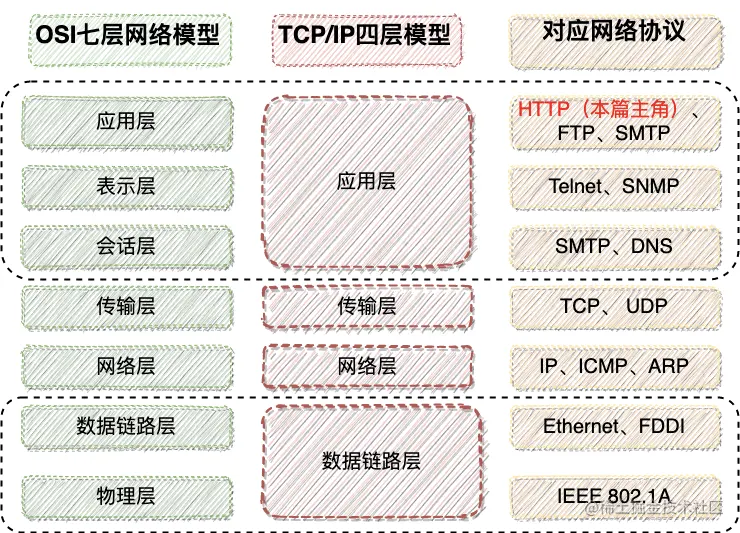
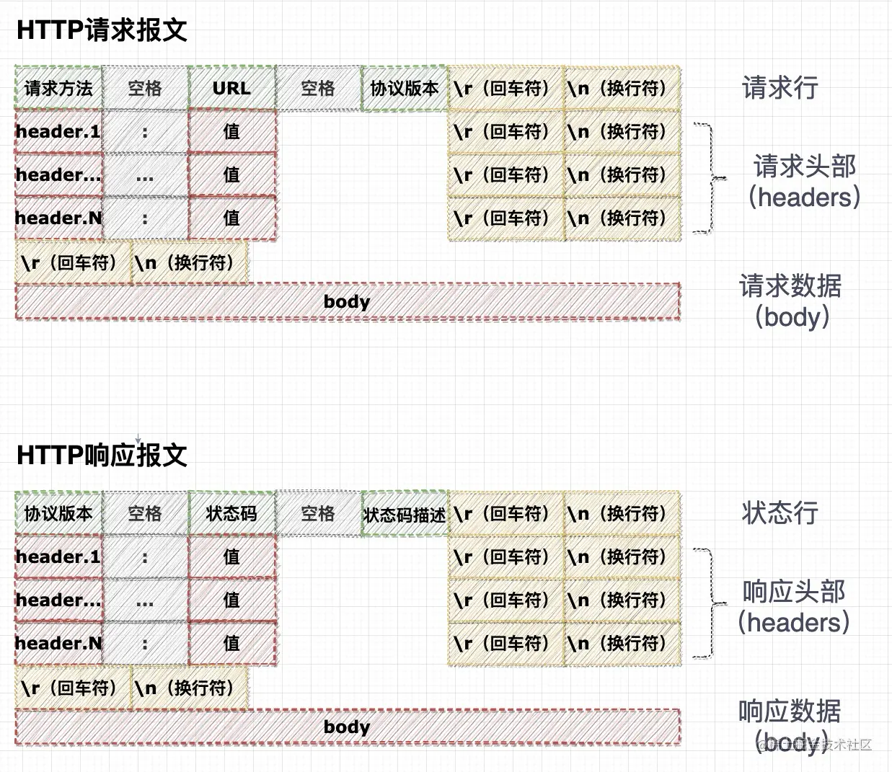
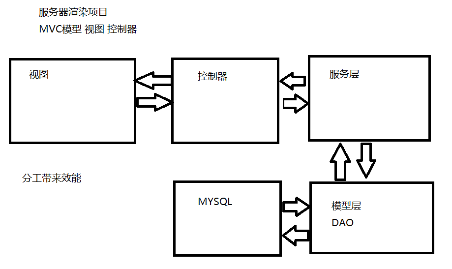
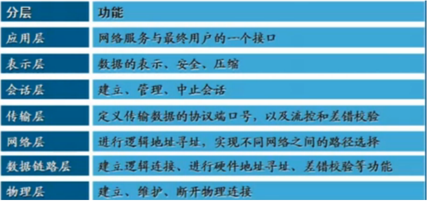
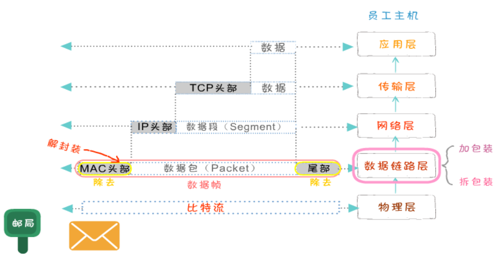

# OSI七层模型（理想化模型）

`Open System Interconnection`适用于所有网络

## 分层模型

下层是为上层提供服务的，上层提供请求和数据，下层进行处理

七层可以类比成给人写信

应用层代表写信的内容，表示层、会话层、传输层表示信的传输目标（地址、收件人），网络层是寻址、找目的地的过程，数据链路层和物理层表示真正传输的过程。

- 物理层：传输是0、1传输，可能拿0V电压代表0，5V代表1（网线、光纤、wifi等实体），为上层数据链路层提供服务通道

- 数据链路层：数据传输，需要物理层

- 网络层：找到路线到目的地（最短），不关心中间传输的错误，不可靠，可靠性需要传输层。

- 传输层：传输的过程中，每隔一个路线的节点或者一小段时间内，就向回返回一个到达的讯息，如果没有返回讯息，就会重新传递。直到到达目的地，返回一个到达目的地的讯息才算结束。**在不可靠的网络层上，传递可靠的网络数据，这就是传输层**

## 封装过程

### 不同层中的称谓：

- 数据帧（Frame）：是一种信息单位，它的起始点和目的点都是**数据链路层**。
- 数据包（Packet）：也是一种信息单位，它的起始和目的地是**网络层**。
- 段（Segment）：通常是指起始点和目的地都是**传输层**的信息单元。
- 消息（message）：是指起始点和目的地都在网络层以上（经常在**应用层**）的信息单元。

