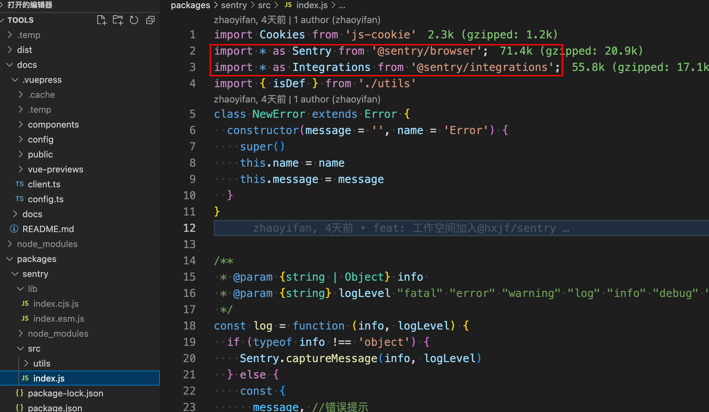
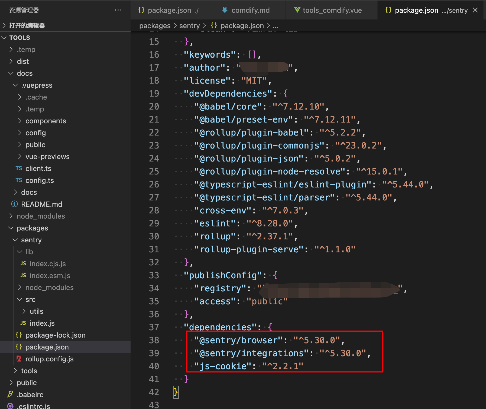

# rollup

## 封装时的注意项
> 对于外部依赖如何处理？

- 封装时不应该把外部第三方依赖打包，打包时进行排除

> rollup.config.js

```javascript
// 指出哪些模块需要被视为外部引入
external: ['@sentry/browser', '@sentry/integrations', 'js-cookie']
```

> package.json  还需要设置dependencies外部引入的模块


::: info
被引入作为第三方依赖时，
devDependencies：npm install 不会安装在项目中
dependencies：npm install 会安装在项目中
:::
