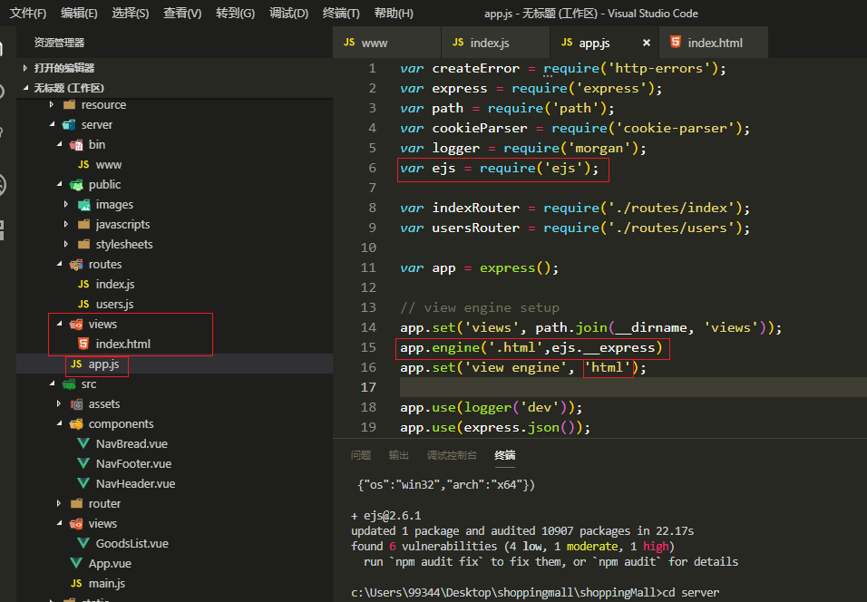
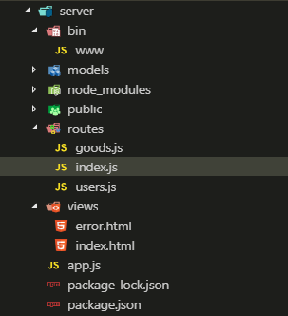
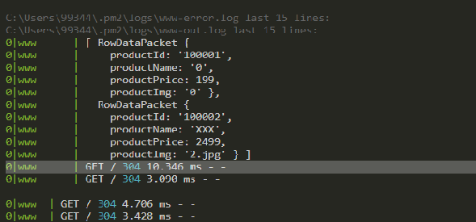
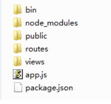
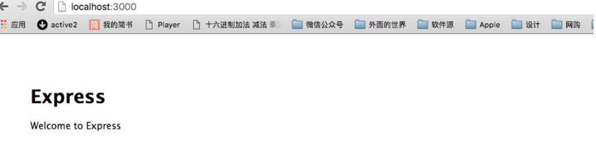
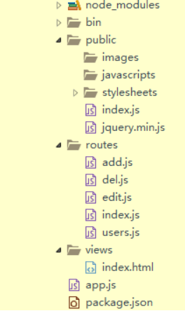

# 移动商城全栈项目记录

## Node.js基础

### Linux环境下配置Node环境

### 搭建基于Express框架的运行环境

> `npm i express-generator -g`全局安装express构建模块
>
> `express server`使用express构建一个server名字的构建文件夹
>
> 把server文件夹下的package中的配置赋值到项目外的package.json中, 再重新在项目下`npm install`, 把server文件夹下的package.json文件可以删除掉


> 不想使用.jade, 想使用html文件, 先下载ejs
>
> 在项目下安装`ejs`
>
> `npm i ejs --save`
>
> 再把server文件夹下的views文件夹下的.jade文件删除掉



## 在express中使用ejs模板

express默认使用的是jade模板引擎, 但是不是html语义特性.

如果想用html作为模板语言的话, 就要用ejs

### 安装

```
npm i ejs
```

### 修改app.js

修改app.js将view engine修改为ejs, 并将模板的后缀改为.html

```javascript
let ejs = require('ejs');
let express = require('express');
let app = express();

app.set('views', path.join(__dirname, 'views'));
app.engine('.html',ejs.__express);
app.set('view engine','html');
```

### 创建测试页面

在views文件夹中创建index.html

```html
<!DOCTYPE html>
<html lang="en">
<head>
    <meta charset="UTF-8">
    <meta name="viewport" content="width=device-width, initial-scale=1.0">
    <meta http-equiv="X-UA-Compatible" content="ie=edge">
    <title>Document</title>
</head>
<body>
    <h2>hello, Express is very Good</h2>
</body>
</html>
```



然后在routes里修改index.js

```javascript
let express = require('express');
let router = express.Router();

router.get('/',function(req,res,next){
	res.render('index',{title:'Express, Very Good'});
})
```

## pm2

PM2是Node.js应用程序的生产过程管理器，具有内置的负载平衡器。它允许您永远保持应用程序的活动状态，在不停机的情况下重新加载应用程序，并简化常见的系统管理任务。

pm2以进程的形式启动服务.

比如:

`node bin\www`

启动服务之后是不可以继续其他操作, 只能打开另一个服务窗口干其他事情

pm2是进程, 启动了之后还可以继续其他操作

### 启动

`pm2 start app.js`

### 关闭

`pm2 stop app.js`

### 查看日志

`pm2 log`



## Nodejs+Express+mysql服务端开发

### 初始化最简单express项目

新建一个目录server, 在该目录下运行`npm init`

安装express`npm i express`

新建index.js文件, 添加如下代码:

```javascript
let express = require('express');
let app = express();
app.get('/',function(req,res){
    res.send('hello, express');
});
app.listen(3000);
```

运行`node index.js`

打开浏览器访问http://127.0.0.1:3000

页面显示,hello express

### 以express命令初始化项目

#### 准备工作

- 安装Express可执行命令

`npm i express-generator -g`安装全局变量

- 初始化项目

`express server`创建express目录, server是目录名

- 执行如下命令

`cd server`进入项目根目录

`npm i`安装依赖



/bin:用来启动应用(服务器)

/public:存放静态资源目录

/routes: 路由用于确定应用程序如何响应对特定端点的客户机请求,包含一个URI(或路径)和一个特定的HTTP请求方法(GET, POST等).每个路由可以具有一个或多个处理程序函数, 这些函数在路由匹配时执行.

/views: 模板文件所在目录 文件格式为.jade

目录app.js程序main文件 这个是服务器启动的入口.

#### 启动服务器

`npm start`

或者

`node ./bin/www`

在浏览器中访问http://127.0.0.1:3000



#### 基本使用

app.js这里介绍下主要代码:

```javascript
let express= require('express');//加载express模块
let path = require('path');//路径模块
let favicon = require('serve-favicon');//请求网页的logo
let logger = require('morgan');//在控制台中, 显示req请求的信息
let cookieParser = require('cookie-parser');//这就是一个解析cookie的工具. 通过req.cookies可以去到传过来的cookie, 并把他们转成对象.
let bodyParser = require('body-parser');//node.js中间件, 用于处理JSON,Raw,Text和URL编码的数据.

//路由信息(接口地址),存放在routes的根目录
let index = require('./routes/index');
let users = require('./routes/users');
let add = require('./routes/add');
let edit = require('./routes/edit');
let del = require('./routes/del');
let app = express();

//模板开始
app.set('views',path.join(__dirname,'views'));//设置视图根目录
app.set('view engine','jade');//设置视图格式(后面会改成html格式的文件)

//载入中间件
app.use(logger('dev'));
app.use(bodyParser.json());
app.use(bodyParser.urlencoded({extended:false}));
app.use(cookieParser());
app.use(express.static(path.join(__dirname,'public')));

//配置路由, ('自定义路径', 上面设置的接口地址)
app.use('/',index);
app.use('/search',users);//查
app.use('/add',add);//增
app.use('/edit',edit);//改
app.use('/del',del);//删

// 错误处理
app.use(function(req,res,next){
	let err = new Error('Not Found');
	err.status = 404;
	next(err);
})

app.use(function(err,req,res,next){
    // set local, only providing err in development
    res.locals.message = err.message;
    res.locals.error = req.app.get('env') === 'development'?err:{};
    
    // render the error page
    res.status(err.status || 500);
    res.render('error');
});

module.exports = app;
```

定义一个路由的基本格式为:

`app.METHOD(PATH, HEADLER)`

其中:

app是express的实例

METHOD是HTTP的各种请求方法.

PATH是服务器上的路径.

HANDLER是在路由匹配时执行的函数.

以上的定义代表

在根路由(/)上(应用程序的主页)对GET请求进行响应.

以下是目录结构图:



例子中没用jade, 改用了html.


先从路由开始

index.js

```javascript
let express = require('express');
let router = express.Router();
// 编写执行代码
router.get('/',function(req,res,next){
    //使用绝对定位打开views下面的html文件
    res.sendFile("/JJ-Note/nodeTest/example/example/views"+"index.html")
});

module.exports = router;

```

再次打开add.js

```javascript
let express = require('express');
let router = express.Router();
let URL = require('url');
//加载mysql模块
let mysql = require('mysql');
//创建连接
let connection = mysql.createConnection({
    host:'loaclhost',
    user:'root',
    password:'',
    database:'shopping_mall'
})

//执行创建连接
connection.connect();

//SQL语句
let sql = 'SELECT * FROM name';
let addSql = 'INSERT INTO name(id,name,sex) VALUES(?,?,?)';

router.get('/',function(req,res,next){
    //解析请求参数
    let params = URL.parse(req.url,true).query;
    let addSqlParams = [params.id, params.name, params.sex];
    //增
    connection.query(addSql,addSqlParams,function(err,result){
        if(err){
            console.log('[SELECT ERROR] - ',err.message);
            return;
        }
        console.log(params.id);
        res.send(result);
    });
});

module.exports = router;
```
