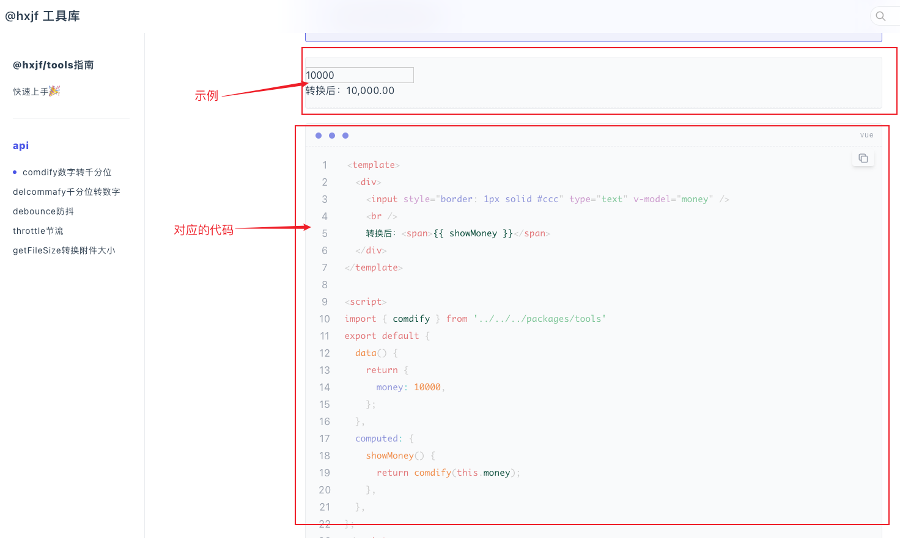
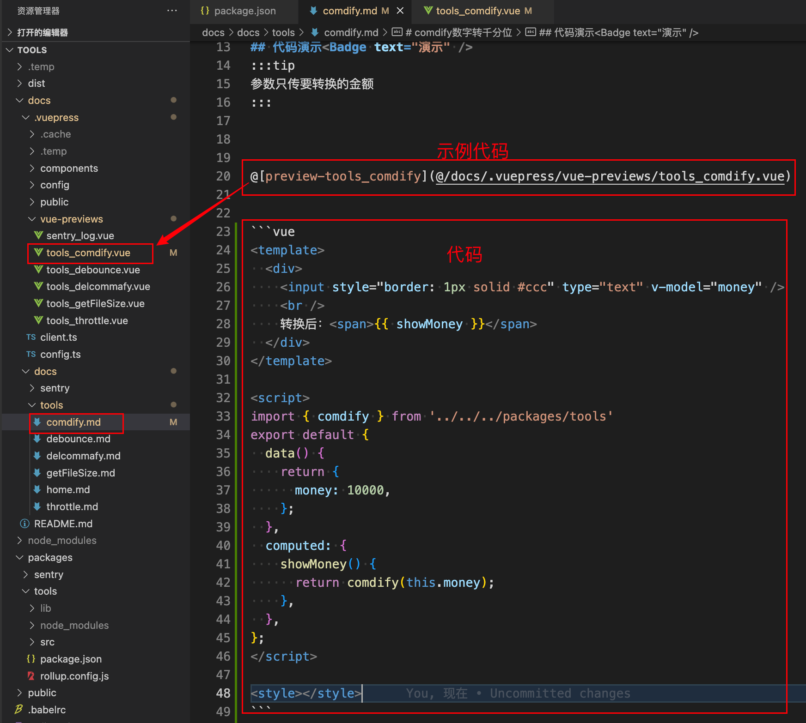
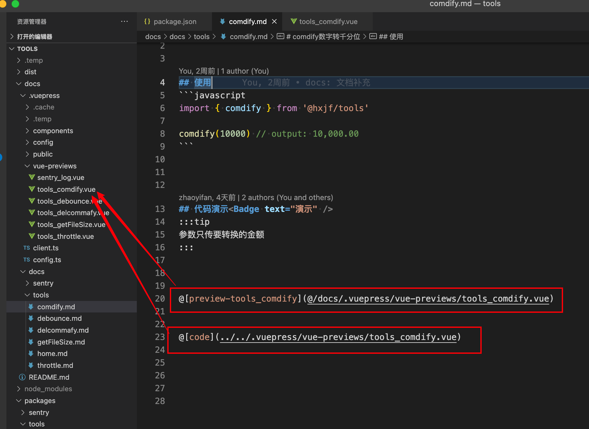
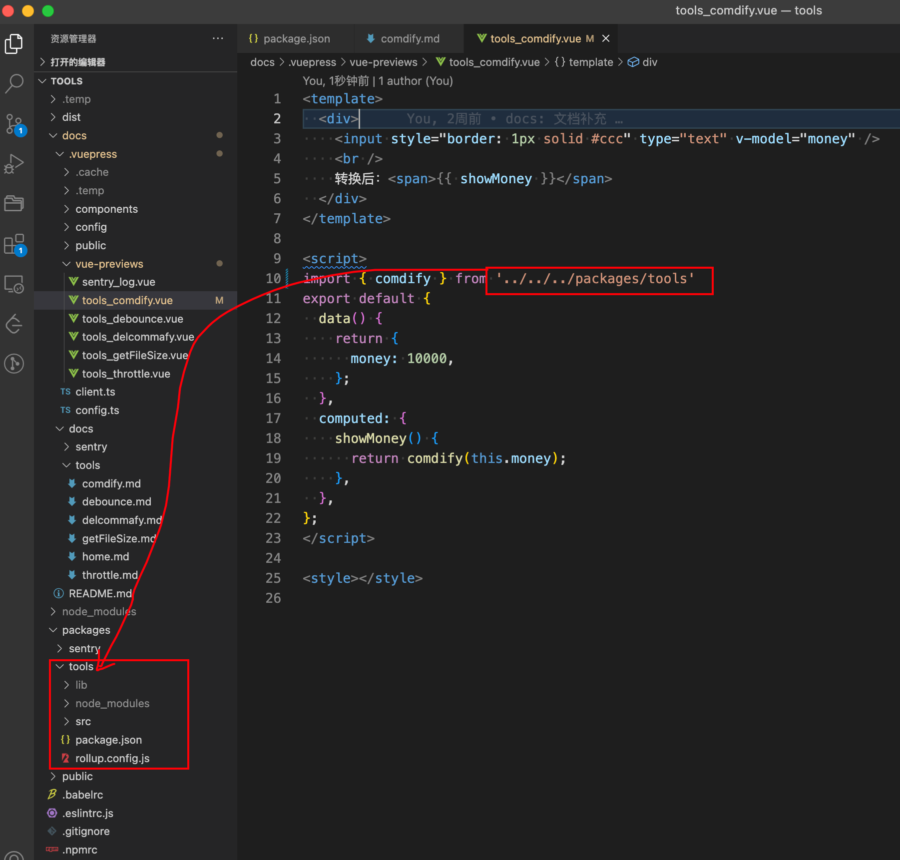
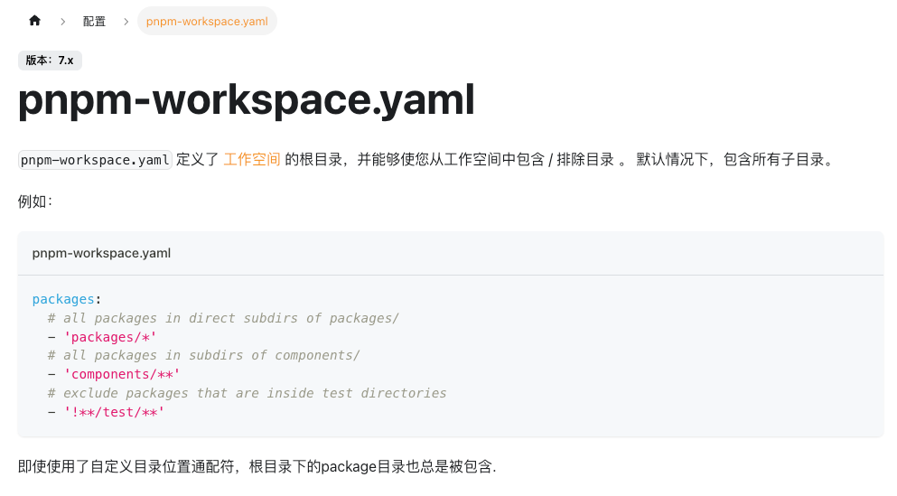
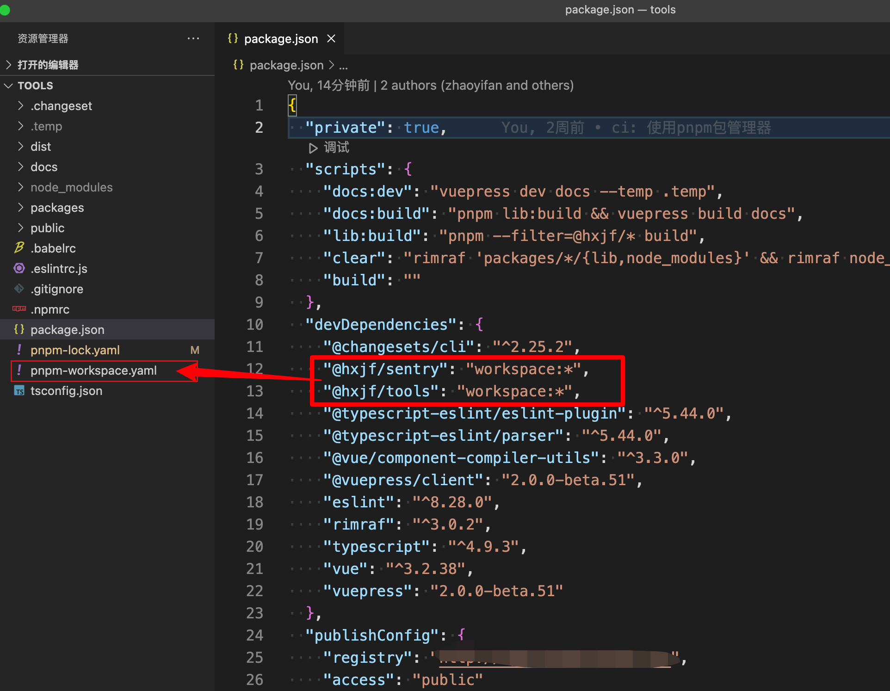
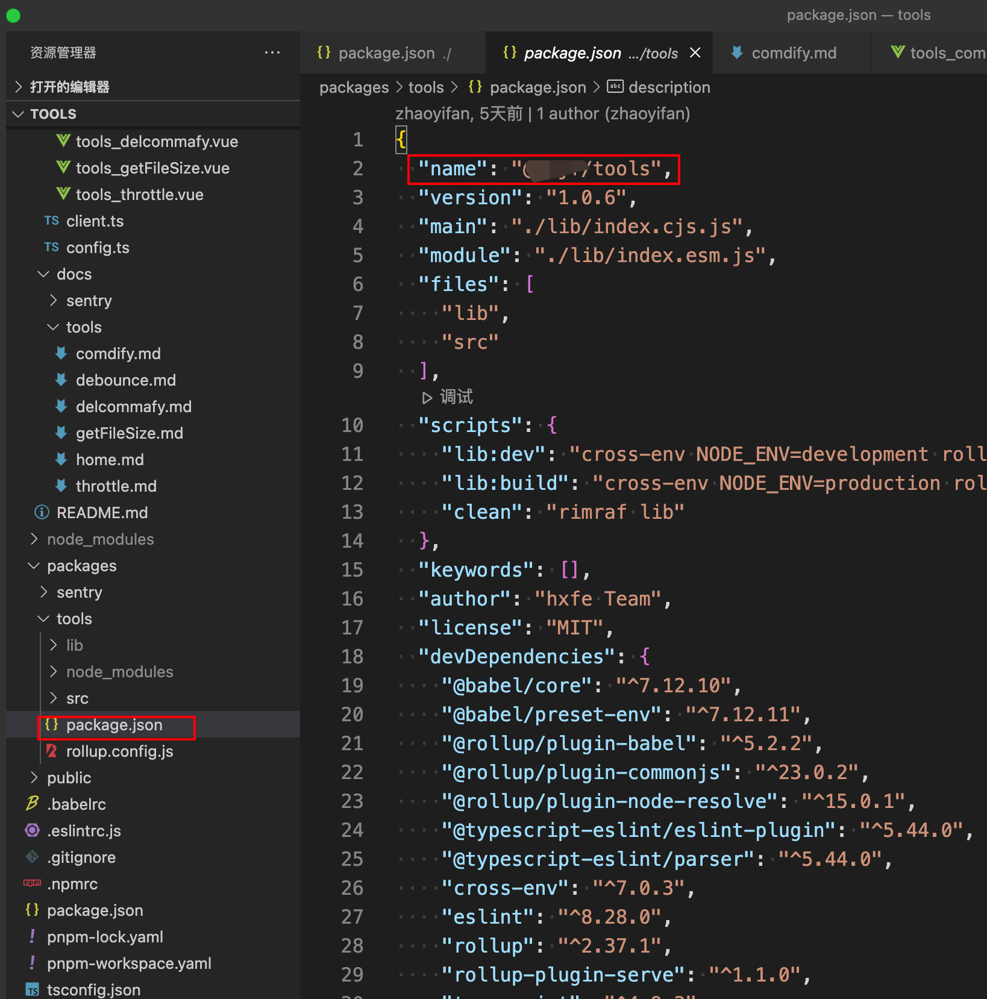
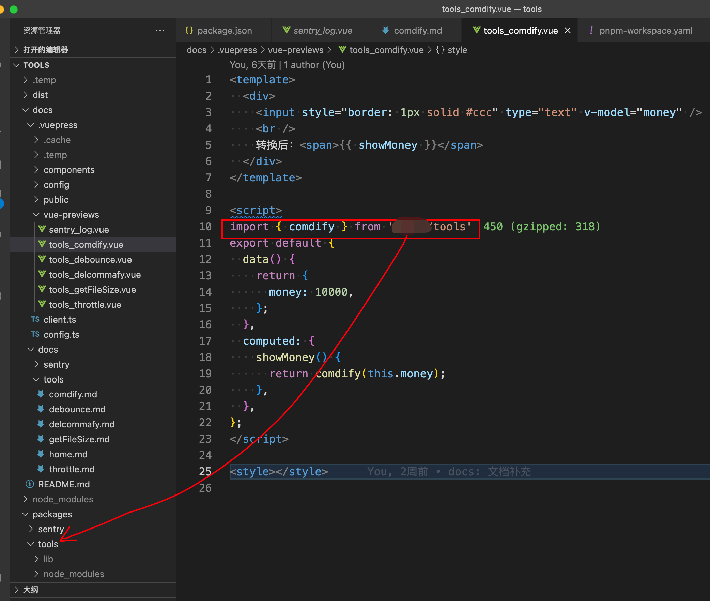

# workspace工作空间
Yarn Workspaces（工作空间/工作区，本文使用工作空间这一名称），用于在代码仓库的根目录下管理多个project的依赖。

:::info
背景：文档中需要对组件进行演示，一般让演示的示例 和 演示的代码共用一套，避免示例代码改动时，演示的代码还需要粘贴一遍，难以维护。
:::


我们可以通过插件，把示例和对应的演示代码都共用一个文件，这样只需改一个文件即可。

## 公用文件引出的问题
:::info
- 示例的引入是`import { comdify } from '../../../packages/tools'`要相对路径才可以引入到对应库的代码。
- 虽然这样可以引入到库代码，但是使用时实际上是
`import { comdify } from '@xxx/tools'`这样去引入代码，
但是也不能把包发布之后再把包install之后再做调试，因为包没有经过测试就发布了。
另一种方法就是`npm link`把包注册到全局，通过`npm link @xxx/toosl`去调试，目前只有两个包当然可以，但是如果调试的包再多，就变的难以调试及维护。
这时候就需要使用workspace工作空间。
:::


## pnpm
- performant（高性能的）npm。
  - 比其他包管理器快 2 倍；
  - 依赖只安装一次，其他项目的依赖会通过软链接指向上级依赖（不占用磁盘空间）；
  - 解决了yarn、npm[幽灵依赖](https://juejin.cn/post/7127295203177676837)的问题。
- pnpm 内置支持[工作空间](https://pnpm.io/zh/workspaces)（Workspaces）。

## Yarn
- Yarn Workspaces（工作空间/工作区，本文使用工作空间这一名称）是Yarn提供的Monorepo依赖管理机制，从Yarn 1.0开始默认支持。
  - 最常见的 monorepo 解决方案是 Lerna 和 yarn 的 workspaces 特性，基于lerna和yarn workspace的monorepo工作流。由于yarn和lerna在功能上有较多的重叠,我们采用yarn官方推荐的做法,用yarn来处理依赖问题，用lerna来处理发布问题。

## 工具的选择
- pnpm和yarn都具有工作区Workspaces的功能，目前pnpm在磁盘占用空间、下载速度、幽灵依赖处理的更好，发展迅速，选择pnpm更优。
- lerna是版本管理工具，对于版本的工作流处理方面更好，对于有版本依赖关系需要处理则需要用lerna。
:::info
对于此处的两个库之间没有依赖关系，暂时并不选择使用lerna，只需要具有workspace功能的pnpm。
:::
## Workspace 协议 (workspace:)
使用此协议时，pnpm 将拒绝解析除本地 workspace 包含的 package 之外的任何内容。 
例如：
设置为 `"@xxx/tools": "workspace:*"` 时，pnpm会从`pnpm-workspace.yaml`文件定义的工作空间去找`@xxx/tools` 这个包，如果存在那么将链接指向该包。
如果包不存在，安装将会失败，因为 `"@xxx/tools"` 不存在于此 workspace 中。
## pnpm的配置
对于workspace功能的配置

> pnpm-workspace.yaml

```yaml
packages:
  - docs
  - packages/*
```
> package.json




会把packages文件夹下的包中的name包名都注册到整个工作区中。

最后通过引用`@xxx/tools`可以链接到工作区中的tools库中，演示代码和demo代码的改动最终完成。
