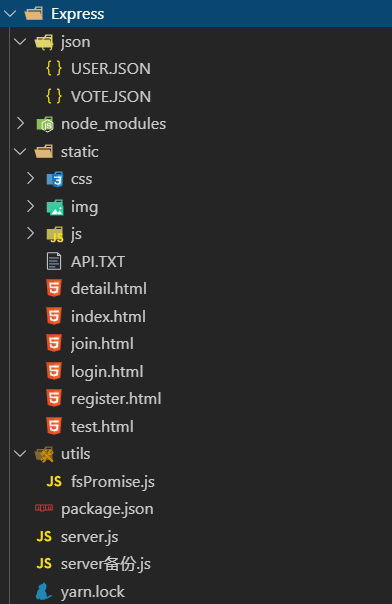

# Express

## 静态服务

```javascript
// /public资源
app.use(express.static('public'))

// /files资源
app.use(express.static('files'))

// /public/public资源
app.use('/public', express.static('public'))

// /static/public资源
app.use('/static', express.static('public'))

app.use('/static', express.static(path.join(__dirname, 'public')))
```

## 在Express中配置使用 `art-template`模板引擎

安装

```shell
npm install --save art-template
npm install --save express-art-template
```

配置:

```javascript
app.engine('art', require('express-art-template'));
```

使用:

```javascript
app.get('/', function (req, res) {
    // express 默认会去项目中的 views 目录找 index.html
    res.render('index.html', {
        title: 'hello world'
    })
})
```

如果希望修改默认的`views`视图渲染存储目录, 可以:

```javascript
// 注意:第一个参数 views 千万不要写错
app.set('views', 目录路径)
```

## 在 Express 获取表单 POST 请求体数据

在 Express 中没有内置获取表单 POST 请求体的 API, 这里我们需要使用一个第三方包: `body-parser`

安装:

```shell
npm install --save body-parser
```

配置:

```javascript
var express = require('express')
// 0. 引包
var bodyParser = require('body-parser')

var app = express()

// 配置 body-parser
// 只要加入这个配置, 则在 req 请求对象上会多出来一个属性:body
// 也就是说你就可以直接通过 req.body 来获取表单 POST 请求体数据了
app.use(bodyParser.urlencoded({ extended: false }))

app.use(bodyParser.json())
```

使用:

```javascript
app.use(function (req, res) {
    res.setHeader('Content-Type', 'text/plain')
    res.write('you posted:\n')
    // 可以通过 req.body 来获取表单 POST 请求体数据
    res.end(JSON.stringify(req.body, null, 2))
})
```

## 设计操作数据的 API 文件模块

```javasc
/** 
 * student.js
 * 数据操作文件模块
 * 职责: 操作文件中的数据, 只处理数据, 不关心业务
 */


 /** 
  * 获取所有学生列表
 */
exports.find = function () {

}

 /** 
  * 添加保存学生
 */
exports.save = function () {
    
}

 /** 
  * 更新学生信息
 */
exports.updata = function () {
    
}

 /** 
  * 删除学生信息
 */
exports.delete = function () {
    
}
```


## 提取路由模块

router.js:

```javascript
/**
 * router.js 路由模块
 * 职责:
 *      处理路由
 *      根据不同的请求方法+请求路径设置具体的请求处理函数
 * 模块职责要单一, 不要乱写
 * 我们划分模块的目的就是为了增强项目代码的可维护性
 * 提升开发效率
 */

// Express 提供了一种更好的方式
// 专门用来包装路由的
var express = require('express')

// 1. 创建一个路由容器
var router = express.Router()

// 2. 把路由挂载到 router 路由容器中
router.get('/students', function (req, res) {
    
})
router.get('/students/new', function (req, res) {
   
})
router.post('/students/new', function (req, res) {
        
})
router.get('/students/edit', function (req, res) {

})
router.post('/students/edit', function (req, res) {

})
router.get('/students/delete', function (req, res) {

})

// 3. 把router 导出
module.exports = router
```

app.js:

```javascript
var router = require('./require')

// 挂载路由
app.use(router)
```


## 初始express

```javascript
let express = require('express');
let app = express();
app.listen(8686, function () {
  console.log('server is running')
})


// 请求静态资源文件
app.use(express.static('./static'))

// api处理
app.get('/getUset',(req,res)=>{
  res.send({
    message:'ok'
  });
})
```

## express里面的中间件

- `app.use()`express里面的中间件（middleware）：在api接口请求处理之前，把一些公共的部分进行提取，中间件中就是先处理这些公共的内容，处理完成后，再继续执行接口请求即可
- `body-parser`如果是post/put请求，会把基于请求主体传递的信息预先截获
  - 如果传递的是JSON格式的字符串，基于bodyParser.json()会把它转换为JSON格式的对象
  - 如果传递的是url-encoded格式的字符串如'xxx=xxx&xxx=xxx'，会基于bodyParser.urlencoded()把它转换为对象键值对的方式
  - ...
  - 把转换后的结果挂载到req.body属性上，每个方法内置next，继续执行接口api，里面获得的req.body都是统一的
- `express-session`：这个中间件是供我们后续操作session的，基于这个中间件，我们可以设置客户端cookie的过期时间（也理解为session在服务器端存储的时间），当中间件执行完成后，会在req上挂载一个session的属性，用来操作session

- express中的req:不是原生的req，是二次处理过的
  - `req.params`存储的是路径参数信息
  - `req.path`请求的路径名称
  - `req.query`请求的问好参数信息（GET请求都是这样传递的信息）（对象）
  - `req.body`当请求的方式是POST，我们基于`body-parse`中间件处理后，会把客户端请求主体中传递的内容存放到body属性上
  - `req.session`当我们基于`express-session`中间件处理后，会把session操作放到这个属性上，基于这个属性可以操作session信息
  - `req.cookies`当我们基于`cookie-parser`中间件处理后，会把客户端传递的cookie信息存放到这个属性上
  - `req.get()`获取指定的请求头信息
  - `req.param()`基于这个方法可以把url-encoded格式字符串（或者路径参数）中的某一个属性名对应的信息获取到
- express中的res:不是原生的res，经过封装处理的，目的是为了提供一些属性和方法，可以供服务器端向客户端返回内容
  - `res.cookie()`通过此方法可以设置一些cookie信息，通过响应头set-cookie返回给客户端，客户端把返回的cookie信息种到本地
  - `res.type()`设置响应内容的MIME类型
  - `res.sendStatus()`设置返回的状态吗（它是结束响应，把状态对应的信息当做响应主体返回，我们一般都是status，然后自己来设置响应主体内容）
  - `res.set()`设置响应头
  - `res.json()`向客户端返回JSON格式的字符串，但是允许我们传递JSON对象，方法会帮我们转换为字符串然后再返回（执行此方法后会自动结束响应，也就是自动执行了res.end()）
  - `res.send-file([path])`首先把path指定的文件内容得到，然后把内容返回给客户端浏览器（完成了文件读取和响应两步操作），也会自动结束响应
  - `res.send()`想返回什么都可以（综合体）
  - `res.redirect()`响应是重定向的（状态码302）
  - `res.render()`只有页面是需要服务器渲染的时候我们才会用这个

```javascript
let express = require('express'),
  app = express();
let bodyParser = require('body-parser'),
  session = require('express-session');
app.listen(8686, function () {
  console.log('server is running')
})

// 请求静态资源文件
app.use(express.static('./static'))

app.use('/user', (req, res, next) => {
  // 请求的path地址是以'/user'开头的，例如：'/user'、'/user/add' ...
  next(); // 不执行next是无法走到下一个中间件或者请求中的（next就是执行下一个的意思，可能是下一个中间件，也有可能是下一个请求...）
  // 如果next()下面有代码，会等next执行结束才执行，next是同步的
})

app.use((req, res, next) => {
  // 所有的请求都会走这个中间件，而且中间件执行的顺序是按照书写的先后顺序执行
})

// api处理
// get请求，接收问号传参的信息，可以使用：req.query、req.param   '/xxx/:name'是路径参数param  '/xxx?name=xxx'是问号传参query
app.get('/getUser', (req, res) => {
  // 当客户端向服务端发送请求，如果请求方式是GET，请求路径是'/getUser'，就会把回调函数执行，里面有三个参数 req/res/next
  res.send({
    message: 'ok'
  });
})

// post请求，接收请求主体传递的信息，此时我们需要使用一个中间件（`body-parser`）
app.use(bodyParser.json())
app.use(bodyParser.urlencoded({ extended: true })) // false是一层，true会变深层对象

app.use(session({
  secret: 'zfpx',
  saveUninitialized: false,
  resave: false,
  cookie: { maxAge: 1000 * 60 * 60 * 24 * 30 }
}))

app.post('/register', (req, res) => {
  console.log(req.body) // 获取的是请求主体内容
  req.session.xxx = 'xxx'; // 设置session
  console.log(req.session.xxx); // 获取session
})
```

## 基于express写API处理



```javascript
let express = require('express'),
  bodyParser = require('body-parser'),
  session = require('express-session');
let { readFile, writeFile } = require('./utils/fsPromise'),
  pathDataUSER = './json/USER.json',
  pathDataVOTE = './json/VOTE.json',
  port = 8686,
  app = express();

// 创建服务
app.listen(port, () => {
  console.log(`服务创建成功，正在监听${port}端口！`);
})

// 处理API
app.use(session({
  secret: 'zfpx',
  saveUninitialized: false,
  resave: false,
  cookie: { maxAge: 1000 * 60 * 60 * 24 * 30 }
}))
app.use(bodyParser.json());
app.use(bodyParser.urlencoded({ extended: true })); // false是一层，true会变深层对象
app.use(async (req, res, next) => {
  let userData = await readFile(pathDataUSER)
  let voteData = await readFile(pathDataVOTE)
  req.userData = JSON.parse(userData);
  req.voteData = JSON.parse(voteData);
  next()
})

// 登录
app.post('/login', (req, res) => {
  // req.body请求主体传递的内容（对象）
  let { name = '', password = '' } = req.body;
  // 客户端把密码md5加密，服务器端二次加工，去掉前四个和后四个（一共32位字符），剩下的从后往前颠倒顺序（先变数组倒过来再变字符串）
  password = password.substr(4, 24).split('').reverse().join(''); // 二次加密
  let result = req.userData.find(item => (item['name'] === name || item['phone'] === name) && item['password'] === password)
  if (result) {
    // 登录成功：记录session（是否登录 & 登录用户的id）
    req.session.isLogin = true;
    req.session.userID = parseFloat(result['id']);
    res.send({
      code: 0,
      message: '登录成功'
    })
    return;
  }
  // 登录失败
  res.send({
    code: 1,
    message: '登录失败'
  })
})
// 检测是否登录
app.get('/checkLogin', (req, res) => {
  let isLogin = req.session.isLogin;
  if (isLogin) {
    res.send({
      code: 1,
      message: '已登录'
    })
    return;
  }
  res.send({
    code: 0,
    message: '未登录'
  })
})
// 退出登录
app.get('/exitLogin', (req, res) => {
  req.session.isLogin = false;
  req.session.userID = null;
  res.send({
    code: 0,
    message: '退出成功！'
  })
})
// 获取用户信息：没有传递用户id，获取当前用户的信息
app.get('/getUser', (req, res) => {
  let { userId = req.session.userID } = req.query,
    result = req.userData.find(item => item['id'] === parseFloat(userId));
  if (result) {
    res.send({
      code: 1,
      message: '获取个人信息成功',
      data: { ...result, password: null }
    })
    return;
  }
  res.send({
    code: 1,
    message: '获取个人信息失败',
    data: null
  })
})

// 处理静态资源请求
app.use(express.static('./static'));
app.use((req, res, next) => {
  res.status(404);
  res.redirect('http://www.qq.com/babygohome/')
})
```

