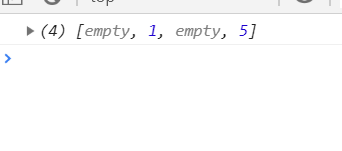
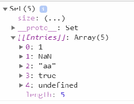

# webapi 标准api

## webapi

### FormData

#### 概述

FormData类其实是在XMLHttpRequest2级定义的, 它是为序列化表以及创建于表单格式相同的数据(当然是用于XHR传输)提供便利.

#### 构造函数

创建一个formData对象实例有几种方式

1. 创建一个空对象 实例

```javascript
var formData = new FormData();
```

此时可以调用append()方法来添加数据.

2. 使用已有的表单来初始化一个对象.

假如现在页面已经有一个表单

```html
<form action="" id="myForm" method="post">
    <input type="text" name="name">名字
    <input type="password" name="psw">密码
    <input type="submit" value="提交">
</form>
```

我们可以使用这个表单元素作为初始化参数, 来实例化一个formData对象

```javascript
// 获取页面已有的一个form表单
let form = document.getElementById('myForm');
// 用表单来初始化
let formData = new FormData(form);
// 我们可以根据name来访问表单中的字段
let name = formData.get("name");// 获取名字
let psw = formData.get("psw");// 获取密码
// 当然也可以在此基础上, 添加其他数据
formData.append("token","asd3gdf");
```

#### 操作方法

我们要明确formData里面存储的数据形式, 一对key/value组成一条数据, key是唯一的,一个key可能对应多个value. 如果是使用表单初始化, 每一个表单字段对应一条数据, 它们的HTML name属性即为key值, 它们value属性对应value值.

| key | value      |
| --- | ---------- |
| k1  | [v1,v2,v3] |
| k2  | v4         |

1. 获取值

可以通过`get(key)`和`getAll(key)`来获取对应的value.

```javascript
formData.get("name");// 获取key为name的第一个值.
formData.getAll("name");// 返回一个数组, 获取key为name的所有值
```

2. 添加数据

可以通过append(key, value)来添加数据, 如果指定的key不存在则会新增一条数据, 如果key存在, 则添加到数据的末尾

```javascript
formData.append("k1","v1");
formData.append("k1","v2");
formData.append("k1","v1");

formData.get("k1");// "v1"
formData.getAll("k1");// ["v1","v2","v1"]
```

3. 设置修改数据

通过set(key, value)来设置修改数据, 如果指定的key不存在则会新增一条, 如果存在, 则会修改对应的value值

```javascript
formData.append("k1","v1");
formData.set("k1","1");
formData.get("k1");// ["1"]
```

4. 判断是否该数据

可以通过has(key)来判断是否对应的key值

```javascript
formData.append("k1","v1");
formData.append("k2",null);

formData.has("k1");// true
formData.has("k2");// true
formData.has("k3");// false
```

5. 删除数据

通过delete(key), 来删除数据

```javascript
formData.append("k1","v1");
formData.append("k1","v2");
formData.append("k1","v1");
formData.delete("k1");

formData.getAll("k1");// []
```

6. 遍历

通过entries()来获取一个迭代器, 然后遍历所有的数据

```javascript
formData.append("k1","v1");
formData.append("k1","v2");
formData.append("k2","v1");

var i = formData.entries();

i.next(); // {done:false, value:["k1", "v1"]}
i.next(); // {done:fase, value:["k1", "v2"]}
i.next(); // {done:fase, value:["k2", "v1"]}
i.next(); // {done:true, value:undefined}
```

可以看到返回迭代器的规则

- 每调用一次next()返回一条数据, 数据的顺序由添加的顺序决定

- 返回的是一个对象, 当其done属性为true时, 说明已经遍历完所有的数据, 这个也可以作为判断的依据

- 返回的对象的value属性以数组形式存储了一对key/value, 数组下标0为key, 下标1为value, 如果一个key值对应多个value, 会变成多对key/value返回

可以通过values()方法只获取value值

#### 发送数据

我们可以通过xhr来发送数据

```javascript
let xhr = new XMLHttpRequest();
xhr.open("post","login");
xhr.setRequestHeader("Content-Type","application/x-www-form-urlencoded");
xhr.send(formData);
```

这种方式可以实现文件的异步上传


#### form标签的enctype属性

enctype就是encodetype就是编码类型的意思.

multipart/form-data是指表单数据由多部分构成, 既有文本数据, 又有文件等二进制数据.

application/x-www-form-urlencoded不是不能上传文件, 是只能上传文本格式的文件, multipart/form-data是将文件以二进制的形式上传, 这样可以实现多种类型的文件上传.


enctype属性规定在发送到服务器之前应该如何对表单数据进行编码.

默认地, 表单数据会编码为"application/x-www-form-urlencoded". 就是说, 在发送到服务器之前, 所有字符都会进行编码(空格转换为"+"加号, 特殊符号转换为ASCII HEX值)

| 值                                | 描述                                                       |
| --------------------------------- | ---------------------------------------------------------- |
| application/x-www-form-urlencoded | 在发送前编码所有字符(默认)                                 |
| multipart/form-data               | 不对字符编码. 在使用包含文件上传空间的表单时, 必须使用该值 |
| text/plain                        | 空格转换为"+"加号, 但不对特殊字符编码                      |

例子: 表单数据会在未编码的情况下发送

```html
<form action="form_action.asp" enctype="text/plain">
    <p>First name: <input type="text" name="fname" /></p>
    <p>Last name: <input type="text" name="lname" /></p>
    <input type="submit" value="Submit" />
</form>
```


### 获取节点DOM

获取当前节点的父级节点`my$("uu").parentNode`

获取当前节点的父级元素`my$("uu").parentElement`

获取当前节点的子级节点`my$("uu").childNodes`

获取当前节点的子级元素`my$("uu").children`

获取当前节点的第一个子级节点`my$("uu").firstChild`

获取当前节点的第一个子级元素`my$("uu").firstElementChild`

获取当前节点的最后一个子级节点`my$("uu").lastChild`

获取当前节点的最后一个子级元素`my$("uu").lastElementChild`

sibling:兄弟 同胞

获取当前节点的前一个兄弟节点`my$("uu").previousSibling`

获取当前节点的前一个兄弟元素`my$("uu").previousElementSibling`

获取当前节点的后一个兄弟节点`my$("uu").nextSibling`

获取当前节点的后一个兄弟元素`my$("uu").nextElementSibling`

### innerText和textContent

设置标签中的文本内容,应该使用textContent属性,谷歌,火狐支持,IE8不支持

设置标签中的文本内容,应该使用innerText属性,谷歌,火狐,IE8都支持

如果这个属性在浏览器中不支持,那么这个属性的类型是undefined

判断这个属性的类型 是不是undefined,就知道浏览器是否支持

### 三大系列:

在style 标签 中设置的样式属性获取不到

style 属性 中设置的样式属性是可以获取到的

获取元素的样式,下面的方式不可用了

console.log(my$("dv1").style.width);

console.log(my$("dv1").style.height);

以后获取元素的宽和高,应该使用offset系列来获取

#### offset系列

父级元素没有脱离文档流:

子级元素的`offsetLeft`或者`offsetTop`=父级元素margin+父级元素padding+父级元素border+自己的margin

父级元素脱离文档流:

子级元素的`offsetLeft`或者`OffsetTop`=自己的left和自己的margin

```javascript
offsetLeft/offsetTop:到左边和上边不算自己的边框

offsetWidth:获取元素的宽度(有边框)

offsetHeight:获取元素的高度(有边框)
```

##### offset系列浅析

1.offsetLeft:HTMLElement.offsetLeft(DOM对象的offsetLeft属性来获取left)是一个只读属性,**返回当前元素左上角相对于HTMLElement.offsetParent节点的左边界偏移的像素值.**
2.offsetWidth指当前元素的宽=border+padding+width;(宽含边框)
offsetHeight指当前元素的高=border+padding+height;(高含边框)

下面重点是offsetLeft和offsetTop的理解

###### 1.只有自己一个元素时

```javascript
加了定位(相对定位,绝对定位)后:
offsetLeft=left+(margin-left);
offsetTop=top+(margin-top);
没加定位后:
offsetLeft=margin-left;
offsetTop=margin-top;

不论是否定位:
offsetWidth指当前元素的宽=border+padding+width;(宽含边框)
offsetHeight指当前元素的高=border+padding+height;(高含边框)

```

###### 2.有父元素和子元素时,求子元素的offsetLeft和offsetTop

```javascript
<style>
    *{
        margin:0 ;
        padding: 0 ;
    }
    #bigdv {
        margin-left: 150px;
        margin-top: 50px;
        padding-left: 17px;
        padding-top: 23px;
        width: 300px;
        height: 300px;
        background-color: green;
        border:30px red solid;
        /*position: absolute;*/
    }
    #dv {
        margin-left: 100px;
        margin-top: 100px;
        padding-left: 13px;
        padding-top: 12px;
        width: 100px;
        height: 100px;
        background-color: pink;
        border:10px red solid;
        /*position: absolute;*/
    }
</style>
<body>
	<div id="bigdv">
		<div id="dv"></div>
	</div>
</body>
```

**分四种情况**

(1).当父元素 **没有** 定位,子元素 **没有** 定位时

包含当前dv元素的不是定位元素,那么offsetLeft或offsetTop是dv盒子外边界相对于根元素内边界的距离.(此时根元素就是body,body可能没有内外边界,暂就这么理解)

子元素#dv的:

offsetLeft=bigdv.(margin-left)+bigdv.(border-left)+bigdv.(padding-left)+dv.(margin-left)=150+30+17+100=297;

offsetTop=bigdv.(margin-top)+bigdv.(border-top)+bigdv.(padding-top)+dv.(margin-top)=50+30+23+100=203;

offsetWidth=dv.border+dv.padding+dv.width=20+13+100=133;(有左右border,左padding)

offsetHeight=dv.border+dv.padding+dv.height=20+12+100=132;

(2).当父元素 **有** 定位,子元素 **没有** 定位时

此时dv元素要相对于它的父元素,因为父元素定位了,不再相对于根元素.此时offsetLeft或offsetTop是dv盒子的外边界相对于父元素盒子的border内边界的距离.

子元素#dv的:

offsetLeft=bigdv.(padding-left)+dv.(margin-left)=17+100=117;

offsetTop=bigdv.(padding-top)+dv.(margin-top)=23+100=123;

offsetWidth=dv.border+dv.padding+dv.width=20+13+100=133;

offsetHeight=dv.border+dv.padding+dv.height=20+12+100=132;

(3).当父元素 **有** 定位,子元素 **有** 定位时

父元素相对定位还是绝对定位都不会对子元素的offset类有影响.

下面两种是子元素绝对定位的情况

**第一种情况:子元素dv没有设置left和top值.**

子元素#dv的:

offsetLeft=bigdv.(padding-left)+dv.(margin-left)=17+100=117;

offsetTop=bigdv.(padding-top)+dv.(margin-top)=23+100=123;

offsetWidth=dv.border+dv.padding+dv.width=20+13+100=133;

offsetHeight=dv.border+dv.padding+dv.height=20+12+100=132;

**第二种情况:子元素dv设置了left:10,top:10.**

```javascript
#dv {
    margin-left: 100px;
    margin-top: 100px;
    padding-left: 13px;
    padding-top: 12px;
    width: 100px;
    height: 100px;
    background-color: pink;
    border:10px red solid;
    position: absolute;
    left: 10px;
    top:10px;
}
```

子元素先定位,没有设置left的时候,父元素的padding-left还会有效果,(因为此时的left有一个默认值,默认值不是0,其实默认值就是padding-left的值).如果加了left:10,那么padding-left会失效,因为定位开始了,以left优先.top同理.

子元素#dv的:

offsetLeft=dv.left+dv.(margin-left)=10+100=110;

offsetTop=dv.top+dv.(margin-top)=10+100=110;

offsetWidth=dv.border+dv.padding+dv.width=20+13+100=133;

offsetHeight=dv.border+dv.padding+dv.height=20+12+100=132;

下面两种是子元素相对定位的情况

**第一种情况:子元素dv没有设置left和top值.**

子元素#dv的:

offsetLeft=bigdv.(padding-left)+dv.(margin-left)=17+100=117;

offsetTop=bigdv.(padding-top)+dv.(margin-top)=23+100=123;

offsetWidth=dv.border+dv.padding+dv.width=20+13+100=133;

offsetHeight=dv.border+dv.padding+dv.height=20+12+100=132;

**第二种情况:子元素dv设置了left:10,top:10.**

子元素#dv的:

offsetLeft=bigdv.(padding-left)+dv.left+dv.(margin-left)=17+10+100=127;

offsetTop=bigdv.(padding-top)+dv.top+dv.(margin-top)=23+10+100=133;

offsetWidth=dv.border+dv.padding+dv.width=133;

offsetHeight=dv.border+dv.padding+dv.height=132;

(4).当父元素 **没有** 定位,子元素 **有** 定位时

下面两种是子元素绝对定位的情况

**第一种情况:子元素dv没有设置left和top值.**

子元素#dv的:

offsetLeft=bigdv.(margin-left)+bigdv.(border-left)+bigdv.(padding-left)+dv.(margin-left)=150+30+17+100=297;

offsetTop=bigdv.(margin-top)+bigdv.(border-top)+bigdv.(padding-top)+dv.(margin-top)=50+30+23+100=203;

offsetWidth=dv.border+dv.padding+dv.width=20+13+100=133;

offsetHeight=dv.border+dv.padding+dv.height=20+12+100=132;

**第二种情况:子元素dv设置了left:10,top:10.**

子元素#dv的:

offsetLeft=dv.left+dv.(margin-left)=10+100=110;

offsetTop=dv.top+dv.(margin-top)=10+100=110;

offsetWidth=dv.border+dv.padding+dv.width=20+13+100=133;

offsetHeight=dv.border+dv.padding+dv.height=20+12+100=132;

下面两种是子元素相对定位的情况

**第一种情况:子元素dv没有设置left和top值.**

子元素#dv的:

offsetLeft=bigdv.(margin-left)+bigdv.(border-left)+bigdv.(padding-left)+dv.(margin-left)=150+30+17+100=297;

offsetTop=bigdv.(margin-top)+bigdv.(border-top)+bigdv.(padding-top)+dv.(margin-top)=50+30+23+100=203;

offsetWidth=dv.border+dv.padding+dv.width=20+13+100=133;

offsetHeight=dv.border+dv.padding+dv.height=20+12+100=132;

**第二种情况:子元素dv设置了left:10,top:10.**

子元素#dv的:

offsetLeft=bigdv.(margin-left)+bigdv.(border-left)+bigdv.(padding-left)+dv.left+dv.(margin-left)=150+30+17+10+100=307;

offsetTop=bigdv.(margin-top)+bigdv.(border-top)+bigdv.(padding-top)+dv.top+dv.(margin-top)=50+30+23+10+100=213;

offsetWidth=dv.border+dv.padding+dv.width=20+13+100=133;

offsetHeight=dv.border+dv.padding+dv.height=20+12+100=132;

#### scroll系列:卷曲

```javascript
scrollLeft:元素向左卷曲出去的距离
scrollTop:元素向上卷曲出去的距离
scrollWidth:元素中内容的实际的宽度,如果没有内容,或者内容很少,元素的宽度
scrollHeight:元素中内容的实际的高度,如果没有内容,或者内容很少,元素的高度
//时时的获取向上卷曲出去的距离的值

//div的滚动事件
my$("dv").onscroll=function () {
console.log(this.scrollTop);
};

```

##### getScroll兼容代码

body、html、window的关系

window不能用scrollLeft(没有这个属性),用pageYOffset.而且pageYOffset属性是只读的,只能获取,不能设置.
`documentElement`就是html

`documentElement`和`body`有scrollLeft这个属性.

IE6 7 8需要用`documentElement`

谷歌需要用`body`

```javascript
function getScroll(){
    return {
        left:window.pageYOffset || document.documentElement.scrollLeft || document.body.scrollLeft || 0;
        top:window.pageYOffset || document.documentElement.scrollTop || document.body.scrollTop || 0
    }
}
```

#### client系列

`clientWidth`:可视区域的宽度,没有边框

`clientHeight`:可视区域的高度,没有边框

`clientLeft`:左边框的宽度

`clientTop`:上边框的宽度

`clientX`:可视区域的横坐标

`clientY`:可视区域的纵坐标

## 标准库

### ES6

> ES6的模块自动采用严格模式, 不管你有没有在模块头部加上"use strict";

严格模式主要有以下限制:

- 变量必须声明后再使用
- 函数的参数不能有同名属性, 否则报错
- 不能使用with语句
- 不能对只读属性赋值, 否则报错

例如: 字符串中的length修改是不会改变字符串的

- 不能使用前缀0表示八进制数, 否则报错
- 不能删除不可删除的属性, 否则报错
- 不能删除变量delete prop, 会报错, 只能删除属性delete global[prop]
- eval不会在它的外层作用域引入变量
- eval和arguments不能被重新赋值
- arguments不会自动反应函数参数的变化
- 不能使用arguments.callee
- 不能使用argument.callee.caller
- 禁止this指向全局对象
- 不能使用fn.caller和fn.arguments获取函数调用的堆栈
- 增加了保留字(比如protected  static  interface)

### Array

### 数组遍历方法

- forEach

```javascript
arr = [1,2,3];
arr.forEach(function(item) {
    console.log(item);
})
```


- map
- find
- findIndex
- filter
只留下数字的数组

```javascript
let ary = [1,2,'a',1,2];
let ary1 = ary.filter((item,index)=>{
    return typeof item == "number";
});
console.log(ary1);
```
- some

只要有一个符合, 结果就是true

```javascript
let ary = [1,2,'a',1,2];
let result = ary.some((item)=>{
    return typeof item == "string"
});
console.log(result);
//=> true
```


- every

只要有一个不符合, 结果就是false

```javascript
let ary = [1,2,'a',1,2];
let result = ary.every((item)=>{
    return typeof item == "string"
});
console.log(result);
//=> false
```


- reduce

默认从左边开始   迭代

```javascript
let arr1 = [1,2,3,4,5,6];
console.log(arr1.reduce(prev,item)=>{
    return prev + item;
});
// prev    item     prev+item
//  1       2       1+2
//  1+2     3       1+2+3
//.....

```


- reduceRight

默认从右边开始

```javascript
let arr1 = [1,2,3,4,5,6];
console.log(arr1.reduceRight(prev,item)=>{
    return prev + item;
});
```


### 数组空位

数组的项中没有值, 就表示空位.

undefied和null是不是空位, [undefined, null]没有空位

arr = [,1,, 5,]

```javascript
let arr = [,1,,5,];
// 用in可以查看对象中是否有该属性, 对于数组来说它的索引可以直接查看该位置是否有值
console.log(0 in arr);//=> false
console.log(1 in arr);//=> true

arr.forEach((item)=>{
	console.log(item);
})
//=> 1 5

arr.find((item)=>{
    console.log(item);
})
//=> undefined 1 undefined 5
```

浏览器也可以显示出空位



### set和map

set和map是新的数据类型

set和数组类似 就是类数组

map和对象类似


```javascript
let set = new Set([1,1,NaN,"aa","aa",true,undefined])
console.log(set)
//=> 类数组
```



Set会自动去重, 会把相同的项删除掉, 复杂数据类型会拿地址比较, 两个NaN虽然普通比较会不相等.但是Set用了Object.is()方法, 此时NaN是相等的.

```javascript
let arr=[NaN,NaN,1,1,12,3,12,32];
console.log([...new Set(arr)]);
//=> [NaN, 1, 12, 3, 32]

console.log(Object.is(NaN,NaN));//=> true
```

set对象的方法

#### add()

### ES6的模块导入与导出

### export

export后必须跟语句，如声明、for、if等都是语句，export不能导出匿名函数，也不能导出某个已经声明的变量，如：

```javascript
export const bar = function (){}; // 合法
export bar; // 非法
export 1; // 非法
export function foo () {}; // 合法，后跟的是声明语句
export { foo }; // 合法，后面跟的{}理解为语句，就像if后面的{}一样
export { foo as bar}; // 合法
export { foo: foo }; // 非法，后面的{}被解析成对象
```

### export default

export default在整个模块中只能出现一次，后只能是具体的值，如1,2,3,再比如一个函数声明（非表达式），或者是一个类声明（与函数声明一个意思），或者匿名函数，只要是能用变量接收的都可以

```javascript
export default 1; //合法
export default function foo() {}; // 合法，因为function foo()能被变量接收， 如 var bar = function () {}
export default const bar = 1; // 非法，因为var a = const bar = 1;是不合法的
export default { foo }; // 合法，{}被理解为一个对象
export default { foo: foo } // 合法
```

导出语句只能出现在模块的顶级作用域中，不能被其他语句包括

### import

```javascript
import {x,y} from './test.js';
import * as some from './test.js'; // 命名空间导入
import './test.js';
import {default as test} from './test.js';
```

### 导入再导出

```javascript
export {some} from './test.js'
export * form './test.js'
```