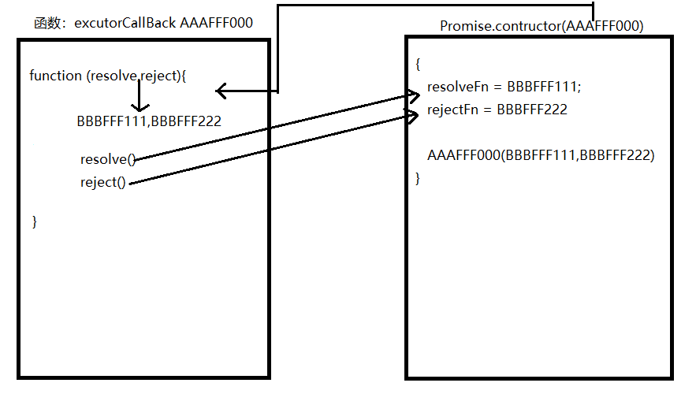
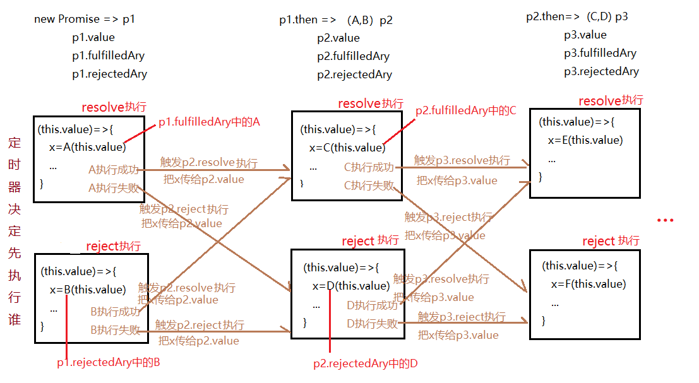

# promise A+

## promise A+规范

Promise/A+规范一共有10条规范，具体如下：


1. Promise 状态

Promise 有三种状态：pending（进行中）、fulfilled（已成功）和rejected（已失败）。

2. then 方法

Promise 必须提供 then 方法，用于注册在 Promise 状态确定后的回调函数。

3. then 方法的参数

then 方法必须接收两个函数作为参数，分别为 Promise 状态被 fulfilled 时的回调函数 onFulfilled 和 Promise 状态被 rejected 时的回调函数 onRejected。

4. then 方法的返回值

then 方法必须返回一个新的 Promise 对象，用于链式调用。

5. then 方法的调用时机

onFulfilled 和 onRejected 只有在 Promise 状态确定后才会被调用，且调用次数不超过一次。

6. then 方法的调用顺序

then 方法可以被同一个 Promise 对象多次调用，并且必须按照其注册顺序依次执行。

7. then 方法的异常处理

如果 onFulfilled 或 onRejected 抛出异常，则新的 Promise 对象必须被 rejected。

8. then 方法的参数可选

then 方法的参数 onFulfilled 和 onRejected 是可选的。

9. Promise 解决过程

Promise 解决过程是指 Promise 从初始状态开始，最终转换为 fulfilled 或 rejected 的过程。

10. Promise 解决过程的处理

Promise 解决过程中需要进行一系列的处理，包括状态转换、回调函数的调用、异常处理等。其中，then 方法的返回值需要根据 Promise 的状态和回调函数的返回值进行判断。


## 复习promise的使用

有三种状态，`pending（进行中）`、`fulfilled（已成功）`、`rejected（已失败）`

`new promise(resolve,reject)`会声明一个promise实例，执行resolve会走then方法中的第一个回调（成功），执行reject会执行then方法中的第二个回调（失败）。then方法中不论第一个回调还是第二个回调执行成功了会接着走下一个then中的第一个回调，如果报错了会走下一个then中的第二个回调。

```javascript
// 非管控异步操作
new Promise((resolve, reject) => {
  // resolve 和 reject是自己任意执行的，但是一般情况下，大家够约定成功执行resolve，失败执行reject
  // excutor函数（执行函数）中可以不管控异步操作（但是不管控异步没什么意义）
  resolve(100);
}).then(result => {
  // resolve执行的时候会触发第一个回调函数执行
  console.log(1)
  return 1000; // 会把这个值传递给下一个then中的方法，如果返回的是一个新的promise实例，则等到promise处理完成，把处理完成的结果传递给下一个then
}, reason => {
  // reject执行的时候会触发第二个回调函数执行
  console.log(2)
}).then(result => { // 需要保证then方法返回的依然是promise实例，这样才可以实现链式调用
  // 上一个then中管控的两个方法只要任何一个执行不报错，都会执行这个then中的第一个方法，如果执行报错，会执行此then中的第二个回调函数
}).catch(reason=>{
  // catch就相当于then(null,reason=>{})
})
console.log(3)
```

```javascript
// 等待所有的promise都成功执行then，反之只要有一个失败就会执行catch
Promise.all([promise1,promise2,promise3,promise4]).then();
```

## 封装基础版的promise库

**没有实现then链**




```javascript
/* promise.js */
class Promise {
  constructor(excutorCallback) {
    this.status = 'pending'
    this.value = undefined;
    this.fulfilledAry = [];
    this.rejectedAry = [];

    // 执行excutor
    let resolveFn = result => {
      let timer = setTimeout(() => {
        clearTimeout(timer);
        if (this.status !== 'pending') return;
        this.status = 'fulfilled';
        this.value = result;
        this.fulfilledAry.forEach(item => item(this.value))
      }, 0);
    }
    let rejectFn = reason => {
      let timer = setTimeout(() => {
        clearTimeout(timer);
        if (this.status !== 'pending') return;
        this.status = 'rejected';
        this.value = reason;
        this.rejectedAry.forEach(item => item(this.value))
      }, 0);

    }
    excutorCallback(resolveFn, rejectFn)
  }

  then (fulfilledCallBack, rejectedCallBack) {
    this.fulfilledAry.push(fulfilledCallBack)
    this.rejectedAry.push(rejectedCallBack)
  }
}
// commonjs规范
module.exports = Promise;
```

```javascript
/* test.js */
let Promise = require('./promise')
new Promise((resolve, reject) => {
  // resolve和reject只能执行一个，执行其中一个另一个就不会执行
  setTimeout(() => {
    Math.random() < 0.5 ? resolve(100) : reject(-100)
  }, 1000);
}).then(result => {
  console.log(result)
}, reason => {
  console.log(reason)
});

console.log(3)
```

## 异常报错按照rejected状态处理

```javascript
/* promise.js */
class Promise {
  constructor(excutorCallback) {
    this.status = 'pending'
    this.value = undefined;
    this.fulfilledAry = [];
    this.rejectedAry = [];

    // 执行excutor（异常捕获）
    let resolveFn = result => {
      let timer = setTimeout(() => {
        clearTimeout(timer);
        if (this.status !== 'pending') return;
        this.status = 'fulfilled';
        this.value = result;
        this.fulfilledAry.forEach(item => item(this.value))
      }, 0);
    }
    let rejectFn = reason => {
      let timer = setTimeout(() => {
        clearTimeout(timer);
        if (this.status !== 'pending') return;
        this.status = 'rejected';
        this.value = reason;
        this.rejectedAry.forEach(item => item(this.value))
      }, 0);
    }
    try {
      excutorCallback(resolveFn, rejectFn)
    } catch (err) {
      rejectFn(err);
    }
  }

  then (fulfilledCallBack, rejectedCallBack) {
    this.fulfilledAry.push(fulfilledCallBack)
    this.rejectedAry.push(rejectedCallBack)
  }
}
// commonjs规范
module.exports = Promise;
```

```javascript
/* test.js */
let Promise = require('./promise')
new Promise((resolve, reject) => {
  // resolve和reject只能执行一个，执行其中一个另一个就不会执行
  setTimeout(() => {
    // 定时器中不能手动抛异常
    Math.random() < 0.5 ? resolve(100) : reject(-100)
  }, 1000);
  throw new Error('ERROR');
}).then(result => {
  console.log(result)
}, reason => {
  console.log(reason)
});

console.log(3)
```

## 实现then方法的链式调用



```javascript
// promise.js
class Promise {
  constructor(excutorCallback) {
    this.status = 'pending'
    this.value = undefined;
    this.fulfilledAry = [];
    this.rejectedAry = [];

    // 执行excutor（异常捕获）
    let resolveFn = result => {
      let timer = setTimeout(() => {
        clearTimeout(timer);
        if (this.status !== 'pending') return;
        this.status = 'fulfilled';
        this.value = result;
        this.fulfilledAry.forEach(item => item(this.value))
      }, 0);
    }
    let rejectFn = reason => {
      let timer = setTimeout(() => {
        clearTimeout(timer);
        if (this.status !== 'pending') return;
        this.status = 'rejected';
        this.value = reason;
        this.rejectedAry.forEach(item => item(this.value))
      }, 0);
    }
    try {
      excutorCallback(resolveFn, rejectFn); // 返回两个回调函数，每个回调函数都需要传参
    } catch (err) {
      rejectFn(err);
    }
  }

  then (fulfilledCallBack, rejectedCallBack) {
    // 返回一个新的promise实例
    return new Promise((resolve, reject) => {
      // this从上文找是最初的promise实例，不是最新的
      this.fulfilledAry.push(() => {
        try {
          let x = fulfilledCallBack(this.value);
          // 返回的x有可能是普通值也有可能还是一个promise实例
          x instanceof Promise ? x.then(resolve, reject) : resolve(x)
        } catch (err) {
          reject(err);
        }
      })
      this.rejectedAry.push(() => {
        try {
          let x = rejectedCallBack(this.value);
          x instanceof Promise ? x.then(resolve, reject) : resolve(x)
        } catch (err) {
          reject(err);
        }
      })
    })
  }
}
// commonjs规范
module.exports = Promise;
```

```javascript
// test.js
let Promise = require('./promise')
let p1 = new Promise((resolve, reject) => {
  // resolve和reject只能执行一个，执行其中一个另一个就不会执行
  setTimeout(() => {
    // 定时器中不能手动抛异常
    Math.random() < 0.5 ? resolve(100) : reject(-100)
  }, 1000);
  // throw new Error('ERROR');
})
let p2 = p1.then(result => {
  throw new Error('@')
  return result + 100;
}, reason => {
  return reason + 100;
});
let p3 = p2.then(result => {
  console.log(p1 === p2); // false 执行then返回的是一个新的promise实例
  console.log(result)
}, reason => {
  console.log(reason)
})

console.log(3)
```

## 实现catch方法

```javascript
class Promise {
  constructor(excutorCallback) {
    this.status = 'pending'
    this.value = undefined;
    this.fulfilledAry = [];
    this.rejectedAry = [];

    // 执行excutor（异常捕获）
    let resolveFn = result => {
      let timer = setTimeout(() => {
        clearTimeout(timer);
        if (this.status !== 'pending') return;
        this.status = 'fulfilled';
        this.value = result;
        this.fulfilledAry.forEach(item => item(this.value))
      }, 0);
    }
    let rejectFn = reason => {
      let timer = setTimeout(() => {
        clearTimeout(timer);
        if (this.status !== 'pending') return;
        this.status = 'rejected';
        this.value = reason;
        this.rejectedAry.forEach(item => item(this.value))
      }, 0);
    }
    try {
      excutorCallback(resolveFn, rejectFn); // 返回两个回调函数，每个回调函数都需要传参
    } catch (err) {
      rejectFn(err);
    }
  }

  then (fulfilledCallBack, rejectedCallBack) {
    typeof fulfilledCallBack !== 'function' ? fulfilledCallBack = result => result : null;
    typeof rejectedCallBack !== 'function' ? rejectedCallBack = reason => { throw new Error(reason.message) } : null;

    // 返回一个新的promise实例
    return new Promise((resolve, reject) => {
      // this从上文找是最初的promise实例，不是最新的
      this.fulfilledAry.push(() => {
        try {
          let x = fulfilledCallBack(this.value);
          // 返回的x有可能是普通值也有可能还是一个promise实例
          x instanceof Promise ? x.then(resolve, reject) : resolve(x)
        } catch (err) {
          reject(err);
        }
      })
      this.rejectedAry.push(() => {
        try {
          let x = rejectedCallBack(this.value);
          x instanceof Promise ? x.then(resolve, reject) : resolve(x)
        } catch (err) {
          reject(err);
        }
      })
    })
  }

  catch (rejectedCallBack) {
    return this.then(null, rejectedCallBack)
  }
}
// commonjs规范
module.exports = Promise;
```

## 实现promise.all方法

```javascript
class Promise {
  constructor(excutorCallback) {
    this.status = 'pending'
    this.value = undefined;
    this.fulfilledAry = [];
    this.rejectedAry = [];

    // 执行excutor（异常捕获）
    let resolveFn = result => {
      let timer = setTimeout(() => {
        clearTimeout(timer);
        if (this.status !== 'pending') return;
        this.status = 'fulfilled';
        this.value = result;
        this.fulfilledAry.forEach(item => item(this.value))
      }, 0);
    }
    let rejectFn = reason => {
      let timer = setTimeout(() => {
        clearTimeout(timer);
        if (this.status !== 'pending') return;
        this.status = 'rejected';
        this.value = reason;
        this.rejectedAry.forEach(item => item(this.value))
      }, 0);
    }
    try {
      excutorCallback(resolveFn, rejectFn); // 返回两个回调函数，每个回调函数都需要传参
    } catch (err) {
      rejectFn(err);
    }
  }

  then (fulfilledCallBack, rejectedCallBack) {
    typeof fulfilledCallBack !== 'function' ? fulfilledCallBack = result => result : null;
    typeof rejectedCallBack !== 'function' ? rejectedCallBack = reason => { throw new Error(reason instanceof Error ? reason.message : reason) } : null;

    // 返回一个新的promise实例
    return new Promise((resolve, reject) => {
      // this从上文找是最初的promise实例，不是最新的
      this.fulfilledAry.push(() => {
        try {
          let x = fulfilledCallBack(this.value);
          // 返回的x有可能是普通值也有可能还是一个promise实例
          x instanceof Promise ? x.then(resolve, reject) : resolve(x)
        } catch (err) {
          reject(err);
        }
      })
      this.rejectedAry.push(() => {
        try {
          let x = rejectedCallBack(this.value);
          x instanceof Promise ? x.then(resolve, reject) : resolve(x)
        } catch (err) {
          reject(err);
        }
      })
    })
  }

  catch (rejectedCallBack) {
    return this.then(null, rejectedCallBack)
  }

  // 私有属性
  static all (promiseAry = []) {
    return new Promise((resolve, reject) => {
      // index：记录成功的数量 result：记录成功的结果
      let index = 0,
        result = [];
      for (let i = 0; i < promiseAry.length; i++) {
        // promiseAry[i]:每一个需要处理的promise实例
        promiseAry[i].then(val => {
          index++;
          result[i] = val; // 索引需要和promiseAry对应上，保证结果的顺序和数组顺序一致
          if (index === promiseAry.length) {
            resolve(result)
          }
        }, reject)
      }
    })
  }
}
// commonjs规范
module.exports = Promise;
```

```javascript
// test.js
let Promise = require('./6.promise')
/* let p1 = new Promise((resolve, reject) => {
  // resolve和reject只能执行一个，执行其中一个另一个就不会执行
  setTimeout(() => {
    // 定时器中不能手动抛异常
    // Math.random() < 0.5 ? resolve(100) : reject(-100)
  }, 1000);
  resolve(100)
  // throw new Error('ERROR');
})
let p2 = p1.then(result => {

  return result + 100;
});
let p3 = p2.then(result => {
  console.log(result)
  throw new Error('222')
}).catch(reason => {
  console.log(reason)
})
console.log(3) */

let p1 = new Promise((resolve, reject) => {
  setTimeout(() => {
    reject(100)
  }, 50);
})
let p2 = new Promise((resolve, reject) => {
  setTimeout(() => {
    reject(200)
  }, 10);
})
let p3 = new Promise((resolve, reject) => {
  setTimeout(() => {
    resolve(300)
  }, 80);
})
Promise.all([p1, p2, p3]).then(result => {
  // 所有的promise都成功执行，result中分别存储每一个实例返回的结果，**而且和数组中的顺序是一样的，和哪个先执行完没有关系**
  console.log(result)
}).catch(reason => {
  // 只要有一个失败，就执行这个方法，失败后不再执行后面的操作
  console.log(reason)
})
```

