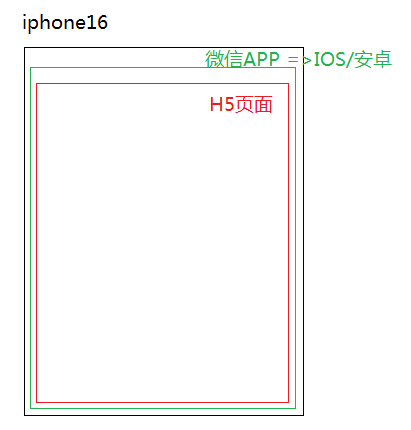

# Hybrid混合APP开发

1. 前端做的都是H5页面 WebApp
   - 运行在浏览器中
   - 移动端不仅可以运行在浏览器中，还可以运行在APP中（例如：微信、自己公司的APP中）
   - 优点：
     - 及时更新（不需要用户选择，我们只需要把服务器上的源文件更新，用户访问的永远是最新的）跨平台
   - 弊端：
     - 不是直接运行在操作系统中的，是运行在浏览器或者APP中的，所以不能直接的操作手机上的软硬件（运作模式：H5通知浏览器或者APP我们想做什么 -> 浏览器调取手机的软硬件 -> 浏览器把信息返回给H5）
     - 性能没有APP好
     - ...

2. APP不是H5,它是原生的应用NativeApp
   - IOS：object-c / swift (需要C的功底)
   - 安卓：java-native （需要JAVA功底）
   - 优点：用户把安装包下载到手机上进行安装，后期程序是直接运行在手机操作系统中的
     - 性能高
     - 可以调取手机内置的软件或者硬件（例如：调取摄像头、重力感应器、通讯录等）[前提用户需要同意才可以]
   - 弊端
     - 不能跨平台，一款产品需要两个团队开发两套不同的安装包
       - 成本大
       - 版本不统一
     - 不能及时更新
     - 苹果商店上传一款APP需要7天审核周期

3. Hybrid混合开发模式
   把传统IOS和安卓开发与H5开发结合在一起来做（微信公众号开发：把我们做的H5运行在微信APP中）

4. ReactNative ionic 微信小程序...
   
   NativeApp提供一个供H5运行的环境 "web view"（webkit内核 => 浏览器的另一种叫法）
   
   H5和APP的通信：**jsBridge模式**
   微信APP把所有H5可以调取的方法和功能都注入到webView的全局对象中
   webView有一个全局对象wx={xxx:...}
   H5运行在webView中，所以在JS中可以使用wx.xxx()完成方法的调用
