# node

## node基础概念

- 什么是node?
> 基于V8引擎(谷歌浏览器的引擎)渲染JS的工具或者环境
>   	安装node
>   	把JS代码放到node环境中执行

- 安装node
> https://nodejs.org/en/
> node安装完成后
>   	当前电脑上自动安装了npm(Node Package Manager): 一个JS模块(所有封装好可以供他人调取使用的都可以称之为模块或者包)管理的工具, 基于npm可以安装下载JS模块
>   	它会生成一个node执行的命令(可以在DOS窗口或者终端命令中执行): node xxx.js
> 如果不成功, 可以找相同电脑配置的人员, 把安装成功的node文件夹拷贝到自己的电脑上, 通过配置环境变量, 来实现node安装

- 如何在node中渲染和解析JS

> REPL模式(Read-Evaluate-Print-Loop, 输入-求值-输出-循环)
>
> 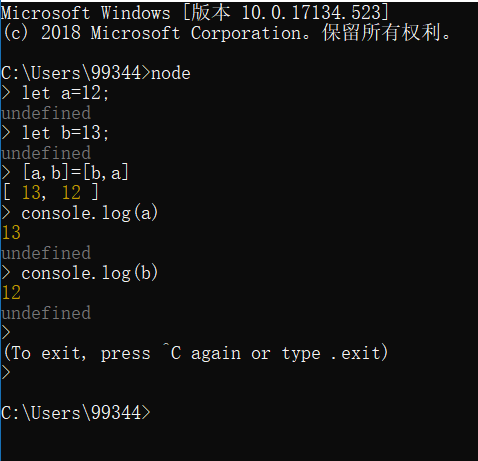
>
> 直接基于node来执行JS文件
> ​	1.在命令窗口中执行(DOS窗口 & 终端窗口)
> ​	2.WebStorm中的Terminal中也可以执行node命令
> ​	3.直接在WebStorm中执行(右键=> Run xxx.js), 这种方式可能会产生缓存(尤其是文件的目录改动后)

## node的一些特点

- 之所以把node作为后台编程语言, 是因为:

> 1. 我们可以把node安装在服务器上
> 2. 我们可以把编写的JS代码放到服务器上, 通过node来执行它(我们可以使用JS来操作服务器, 换句话说, 使用JS来实现服务器端的一些功能操作 => 其实说node是后台语言, 想要表达的是JS是后台语言"JS是一门全栈编程语言")

- node做后台的优势和特点

> 传统的后台语言: JAVA/Python/PHP/C#(.NET)...
> 1. 单线程的
> 2. 基于V8引擎渲染: 快
> 3. 异步无阻塞的I/O操作: I/O(INPUT/OUTPUT) 对文件的读写
> 4. event-driven事件驱动, 类似于发布订阅或者回调函数

- 在WebStorm中开启node内置方法的代码提示

> File-> settings -> languages & frameworks -> node.js and npm -> 开启代码提示只要点击"Enable"按钮即可(Disable是取消代码提示)

```javascript
JS运行在客户端浏览器中=>"前端"
    浏览器给JS提供了很多全局的属性和方法, 例如: window.xxx(setInterval, setTimeout, eval, alert, JSON...)
JS运行在服务器端的node中=>"后台"
    node也给JS提供很多的内置属性和方法, 例如: http, fs, url, path...等对象中都提供很多API供JS操作
```
- JS在前后端I/O操作的情况

> 前端(浏览器运行JS)是限制I/O操作的
>   	input type='file' 这种算是I/O操作, 但是需要用户手动选择(而且还仅仅是一个读取不是写入)
> node中运行JS时不需要限制I/O操作的

## npm的常规应用

- npm的应用

> 目前"工程化/自动化"开发(不一定是写后台), 都是基于node环境, 基于npm管理模块, 基于WEBPACK实现模块之间的依赖打包, 部署上线等
> 
- npm常规操作
```
npm install xxx 把模块安装到当前目录(在哪个目录下执行的命令, 这个目录就是当前目录)下
npm install xxx -g 把模块安装在全局目录下
npm uninstall xxx/ npm uninstall xxx -g
npm install xxx@xxx 安装指定版本号的模块
npm view xxx > xxx.version.txt 查看模块的历史版本信息
```
> npm的默认安装源都是在 https://www.npmjs.com/ 网站查找的, 在国内安装, 下载速度较慢, 想要下载速度快一些, 我们可以如下处理:
>
> 1. 使用淘宝镜像
```
npm install cnpm -g
cnpm install zepto
```
>   安装nrm切源工具, 基于nrm把源切换到淘宝源上

```
npm install nrm -g 
nrm ls 查看当前可用的源
nrm use xxx 使用某个源
这样处理完成后, 后期模块的管理依然基于npm即可
```
>   2. 基于yarn安装, 它也是模块管理器, 类似于npm. 但是安装管理的速度比npm快很多

```
npm install yarn -g
yarn add xxx
yarn remove xxx

使用yarn只能把模块安装到当前目录下, 不能安装到全局环境下
```
>   3. bower也是类似于npm的包管理器, 只不过它是从github下载安装

```
npm install bower -g

bower install xxx
...
```

## npm安装之配置清单和跑环境

- 在本地项目中基于npm/yarn安装第三方模块

>第一步: 在本地项目中创建一个"package.json"的文件
>作用: 把当前项目所有依赖的第三方模块信息(包含: 模块名称以及版本号的信息)都记录下来; 可以在这里配置一些可执行的命令脚本等;
>​    基于yarn会默认生成一个"配置清单", 只是信息没有手动创建的全面
>​    `npm init -y` 或者 `yarn init -y`
>​    **npm 初始化资料全, 有第三方依赖信息, 而yarn初始化不全, 不要用yarn来初始化.**
>​    **创建配置清单的时候, 项目目录中不应该出现中文和特殊符号, 这样有可能识别不了**

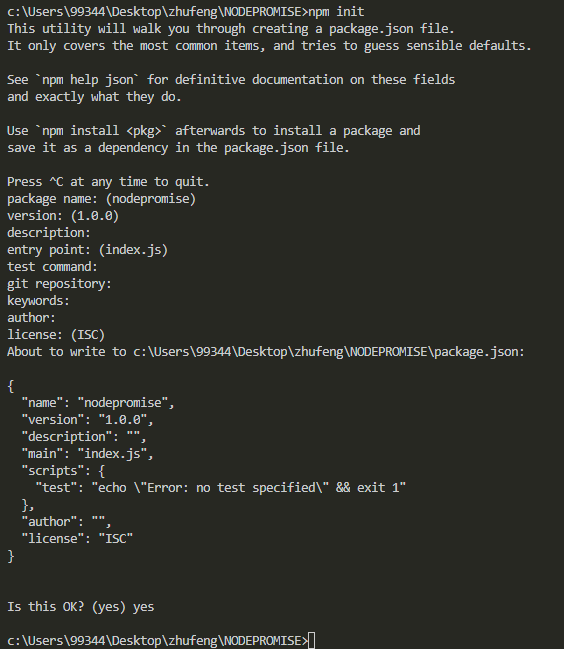

> 第二步: 安装
> ​    开发依赖: 只有在项目开发阶段依赖的第三方模块
> ​    生产依赖: 项目部署实施的时候, 也需要依赖的第三方模块

    [npm]
        npm install xxx --save 保存到配置清单的生产依赖中(默认)
                        --save-dev 保存到开发依赖中
    
    [yarn]
        yarn add xxx 默认就是保存到生产依赖中
                --dev / -D 保存到开发依赖中

> 第三步: 部署的时候"跑环境"
    不要自己一个个的安装, 只需要执行 `npm install` 或者 `yarn install` 即可, npm会自己先检测目录中是否有package.json文件, 如果有的话, 会按照文件中的配置清单依次安装
=> 开发一个项目, 我们生成一个配置清单"package.json", 当我们安装第三方模块使用的时候, 把安装的模块信息记录到配置清单中, 这样以后不管是团队协作开发还是项目部署上线, 我们都没有必要把node_modules发文件发送给别人, 只需要把配置清单传递给其他人即可, 其他人拿到配置清单后, 按照清单汇中依赖项以及版本号, 重新安装即可(重新安装: "**跑环境**")


> package.json
> 版本号前面的^是以什么开头, 就是正则表达式
```
{
    "name": "10.nodePROMISE",   // 模块名称
    "version": "1.0.0",         // 版本号
    "description": "",          // 模块的描述
    "main": "index.js",         // 当前模块的主入口文件
    "dependencies": {           // 生产依赖
        "zepto": "^1.2.0"
    },
    "devDependencies": {        // 开发依赖

    },
    "scripts": {                // 可执行脚本
        "test": "echo \"Error: no test specified\" && exit 1"
    },
    "keywords": [],
    "author": "",
    "license": "ISC"            // 监听模式
}
```

### npm查看全局安装过的包

`npm list -g --depth 0`

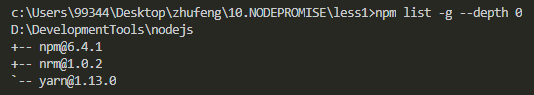

## npm安装之配置可执行命令脚本

- 安装在本地和全局的区别
> [安装在全局的特点]
> 1. 所有的项目都可以使用这个模块
>    	容易导致版本冲突
>       	安装在全局的模块, 不能基于commonjs模块规范调取使用(也就是不能在JS中通过require调取使用)
>
> [安装在本地的特点]
>
> 1. 只能当前项目使用这个模块
>    	不能直接的使用命令操作(安装在全局可以使用命令)
- 为什么安装在全局下可以使用命令
> `npm root / -g` 查看本地项目或者全局环境下, npm的安装目录
> 安装在全局目录下的模块, 但部分都会生成一个xxx.cmd的文件, 只要有这个文件, 那么xxx就是一个可执行的命令(例如: yarn.cmd => yarn 就是命令)
> nrm.cmd
```
@IF EXIST "%~dp0\node.exe" (
  "%~dp0\node.exe"  "%~dp0\node_modules\nrm\cli.js" %*
) ELSE (
  @SETLOCAL
  @SET PATHEXT=%PATHEXT:;.JS;=;%
  node  "%~dp0\node_modules\nrm\cli.js" %*
)
```
- 能否既安装在本地, 也可以使用命令操作吗?
> 1. 把模块安装在本地, 如果是支持命令操作的模块, 会在node_modules的bin中生成xxx.cmd的命令文件, 只不过这个文件无法再全局下执行.
> 2. 在package.json的scripts中配置需要执行的命令脚本
```
"scripts": {
"zyf": "lessc -v"  属性名自己设置即可, 属性值是需要执行的命令脚本, 根据需要自己编写(可以配置很多命令的)
}
```
> 3. `npm run zyf` / `yarn zyf` 这样的操作就是把配置的脚本执行
>       首先到配置清单的scripts中查找
>       找到把后面对应的属性值(执行脚本)执行
>       执行脚本的时候, 会到本地node_modules中的bin文件夹查找, 没有的话, 再向npm安装的全局目录下查找.


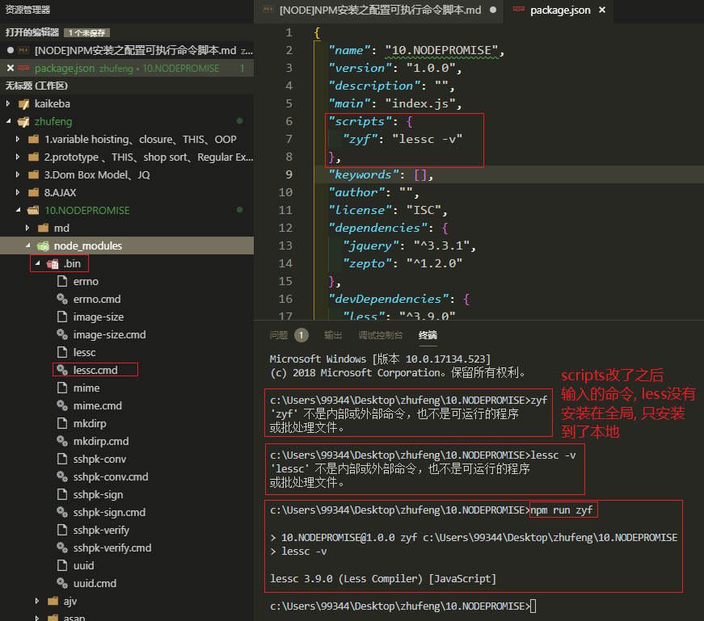

## commonjs规范
- node入门

> node本身是基于commonjs模块规范设计的, 所以模块是node的组成
>   	内置模块: node天生提供给JS调取使用的
>   	第三方模块: 别人写好的, 我们可以基于npm安装使用
>   	自定义模块: 自己创建一些模块

- commonjs模块化设计的思想(AMD/CMD/ES6 MODULE都是模块设计思想)

> 1. commonjs规定, 每一个JS都是一个单独的模块(模块是私有的: 里面设计的值和变量以及函数等都是私有的, 和其它的JS文件中的内容是不冲突的)
>
> 2. commonjs中可以允许模块中的方法互相的调用
>
> B模块中想要调取A模块中的方法
> A导出 B导入
>
> **导出**
> commonjs给每一个模块(每个JS)中都设置了内置的变量/属性/方法
> ​	module: 代表当前这个模块[object]
> ​	module.exports: 模块的这个"属性"是用来导出当前模块的属性和方法的 [object]
> ​	exports: 是内置的一个"变量", 也是用来导出当前模块属性方法的, 虽然和module.exports不是一个东西, 但是对应的值是同一个(module.exports=exports 值都是对象)
> **导入**
> require: commonjs提供的内置变量, 用来导入模块的(其实导入的就是module.exports暴露出来的东西) 导入的值也是[object]类型的

- module.exports和exports重定向的一些问题

> exports = {};
>
> 是无法导出内容的: 默认和module.exports是同一个堆内存, 但是这种操作让exports指向新的堆内存, 而module.exports不受影响
>
> **require导入的是module.exports对应的堆内存, 而不是exports的**

> 第一种情况

```javascript
// temp1.js文件
let a = 10;
let fn1 = b => {
    return a * b;
};
let fn2 = b => {
    return a - b;
};
module.exports = {//=> 重定向到自己的堆内存, 用来实现导出
    fn1: fn1
}
module.exports.fn2 = fn2;//=> 向新的堆内存中加入导出内容
exports.fn3 = 100;//=> 无法导出: 此时exports和module.exports已经不是同一个堆内存了
```

```javascript
// temp2.js文件
let temp1 = require('./temp1');
console.log(temp1.fn1(10));
console.log(temp1.fn2(10));
console.log(temp1.fn3);
```

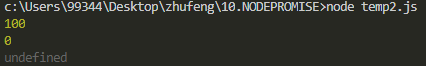

> 第二种情况

```javascript
// temp1.js文件
let a = 10;
let fn1 = b => {
    return a * b;
};
let fn2 = b => {
    return a - b;
};
exports = {
    fn1: fn1
};
module.exports.fn2 = fn2;
```

```javascript
// temp2.js文件
let temp1 = require('./temp1');
console.log(temp1.fn1(10));
console.log(temp1.fn2(10));
```

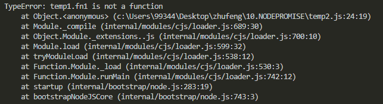

> 第三种情况

```javascript
// temp1.js文件
let a = 10;
let fn1 = b => {
    return a * b;
};
let fn2 = b => {
    return a - b;
};
module.exports = {
    fn1: fn1
};
exports.fn2 = fn2;
```

```javascript
// temp2.js文件
let temp1 = require('./temp1');
console.log(temp1.fn1(10));
console.log(temp1.fn2(10))
```

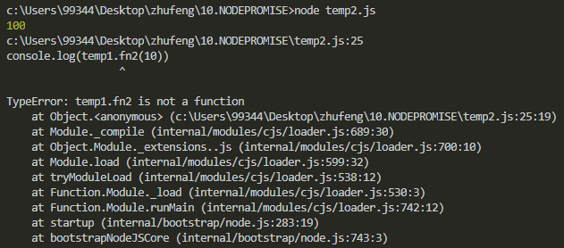

- commonjs特点

> 1. 所有代码都运行在模块作用域, 不会污染全局作用域(每一个模块都是私有的, 包括里面所有的东西也都是私有的, 不会和其他模块产生干扰)

> 2. 模块可以多次加载, 但是只会在第一次加载时运行一次, 然后运行结果就被缓存了, 以后再加载, 就直接读取缓存结果. 想要让模块再次运行, 必须清除缓存.

```javascript
// temp1.js文件.
let a = 12;
let fn = b => {
    return a * b;
}
exports.fn = fn;
```

```javascript
// temp2.js文件
let a = 13;
let fn = b => {
    return a / b;
}
let temp1 = require('./temp1');
console.log(temp1.fn(10));
temp1 = require('./temp1');//=> 没有报错, 第二次并没有把TEMP1代码执行, 因为第一次执行把导入的结果缓存了.
console.log(temp1.fn(10));
```

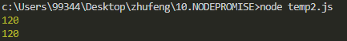

> 3. 模块加载的顺序, 按照其在代码汇总出现的顺序. commonjs规范加载模块是同步的, 也就是说, 只有加载完成, 才能执行后面的操作.

```javascript
// temp1.js文件
let a = 12;
let fn = b => {
    return a * b;
}
console.log(1);

exports.fn = fn;// 把当前模块私有的函数放到EXPORTS导出对象中(赋值给他的某一个属性), 这样在其他模块中, 可以基于REQUIRE导入进来使用 <=> module.exports.fn = fn;
console.log(2);
```

```javascript
// temp2.js文件
let a = 13;
let fn = b => {
    return a / b;
}
setTimeout(() => {
    console.log(1.5);

}, 1000);
let temp1 = require('./temp1');//=> ./特意指定是当前目录中的某个模块(.js可以省略) require导入的时候: 首先把TEMP1模块中的JS代码自上而下执行, 把exports对应的堆内存导入进来, 所以接收到的结果是一个对象(require是一个同步操作: 只有把导入的模块代码执行完成, 才可以获取值, 然后继续执行本模块下面的代码)
console.log(3);
```

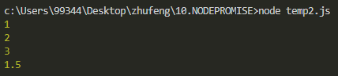

- commonjs规范和单例模式差不多

```javascript
var A = (function () {
    var a = 2;
    function fn() {
        return a * b;
    };
    return {
        fn: fn;
    }
})();
var B = (function () {
    function init() {
        var a = 3;
        A.fn(10);
    }
    return {
        init
    }
})();
B.init();
```

## commonjs练习
- 案例: A/B/C三个模块

> A中有sum方法: 实现任意数求和 
> B中有一个aug方法: 实现任意数求平均(先求和再求平均: B中用到A)
> C中调取B中的avg, 实现12,23,34,45,56,67,78,89 求平均数 

> 自己写的:

```javascript
// A.js文件
let sum = function (ary) {
    let sum = 0;
    for (let i = 0; i < ary.length; i++) {
        sum += ary[i];
    }
    return sum;
}
module.exports = {
    sum: sum
} 
```

```javascript
// B.js文件
let A = require('./A');
let avg = function () {
    let ary = Array.from(arguments);// 把类数组转为数组
    let avg = 0;
    avg = A.sum(ary) / ary.length;
    return avg;
}
module.exports = {
    avg: avg
}
```

```javascript
// C.js文件
let B = require('./B');
console.log(B.avg(12,23,34,45,56,67,78,89))
```

> 老师写的:

```javascript
// A.js
module.exports = {
    sum(...arg) {// 剩余运算符 会把传过来的值变成一个数组. 如果传过来的也是一个数组, 会把数组外面再套一层数组
        // console.log(arg)//=> [ [ 12, 23, 34, 45, 56, 67, 78, 89 ] ]
        return eval(arg.join('+'));
    }
}
```

```javascript
// B.js
let A = require('./A');
module.exports = {
    avg(...arg) {// 剩余运算符, 会把传的值变成一个数组
        // console.log(arg)//=> [ 12, 23, 34, 45, 56, 67, 78, 89 ] 
        // console.log(...arg)//=> 12 23 34 45 56 67 78 89 展开运算符
        return A.sum(...arg) / arg.length;
    }
}
```

```javascript
// C.js
let B = require('./B');
console.log(B.avg(12,23,34,45,56,67,78,89))
```

- require导入规则

> `require('./xxx')`或者`../xxx `再或者 `/xxx`, 这种都是为了导入自定义的模块, 换句话说, 想要导入自定义的模块, 必须加路径
> `require('xxx')`, 导入第三方或者内置的
> 首先到当前项目的node_modules中查找是否存在这个模块, 不存在找node提供的内置模块

> `_dirname`: 模块中这个内置变量是当前模块所在的绝对路径(具体到盘符: 物理路径 例如: E:\201802LESSON\WEEK9\0609DAY1; 相对路径: WEEK9\0609DAY1 相对于根目录的路径 相对于根目录的路径)
> `_filename`: 相对于 _dirname来讲, 多了模块名称, 例如: E:\201802LESSON\WEEK9\0609DAY1\C.js

## FS内置模块以及PROMISE文件操作库的封装
- node中的内置模块
> http://nodejs.cn/api/
### fs内置模块: 实现I/O操作

> `let fs = require('fs')`
>
> 1. `fs.mkdir` / `fs.mkdirSync`: 创建文件夹, 有Sync的是同步创建, 反之没有是异步, 想要实现无阻塞的I/O操作, 我们都是用异步操作完成要处理的事情
```javascript
let fs = require('fs');
fs.mkdir('./less', err => {
    if (err) {
        console.log(err);
        return;
    }
    console.log('ok');
})
console.log(1);
```

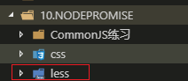

> 2. `fs.readdir` / fs.readdirSync: 读取文件目录中的内容
```javascript
let fs = require('fs');
fs.readdir('./css', (err, result) => {
    if (err) {
        console.log(err);
        return;
    }
    console.log(result);//=> 返回的结果是一个数组
})
```

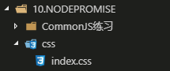

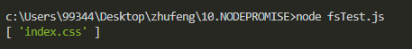

> 3. `fs.rmdir`: 删除文件夹
> 
```javascript
let fs = require('fs');
fs.rmdir('./less', err => {//=> 删除文件夹必须保证文件夹是空的
    if(err){
        console.log(err);
        return;
    }
    console.log('ok');
})
// 删除了less文件夹
```

> 4. `fs.readFile`: 读取文件中的内容
> 
```javascript
fs.readFile('./less/1.less', 'utf8', (err, result) => {
    //=> 不设置UTF-8编码格式, 读取出来的是BUFFER格式的数据, 设置后读取到的是字符串格式的数据
    if (err) {
        console.log(err);
        return;
    }
    console.log(result);
})
```

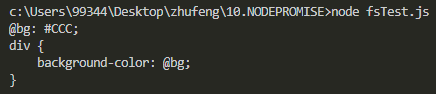
> 不设置UTF-8编码格式

```javascript
fs.readFile('./less/1.less', (err, result) => {
    if (err) {
        console.log(err);
        return;
    }
    console.log(result);
})
```

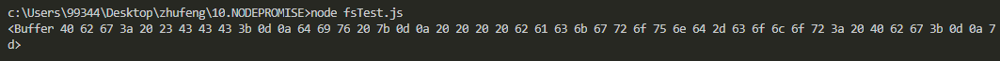
> 5. `fs.writeFile`: 向文件中写入内容(覆盖写入: 写入的新内容会替换原有的内容)
> 
> 把原来文档中的内容替换`fs.writeFile`

```javascript
fs.writeFile('./less/1.less', '哈哈', 'utf8', err => {
    if (err) {
        console.log(err);
        return;
    }
    console.log('ok');
})
```

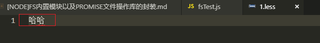
> 6. `fs.appendFile`: 追加写入新内容, 原有的内容还在
> 
> 把原来的文档后面追加内容`fs.appendFile()`

```javascript
fs.appendFile('./less/1.less', '呵呵', 'utf8', err => {
    if(err){
        console.log(err);
        return;
    }
    console.log('ok');
})
```

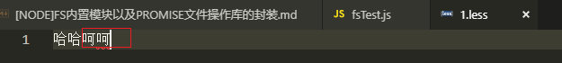

> 7. `fs.copyFile`: 拷贝文件到新的位置
> 
> 拷贝文件及文件中的内容

```javascript
fs.copyFile('./package.json', './less/111.json', err => {
    if(err){
        console.log(err);
        return;
    }
    console.log('ok');
})
```

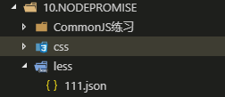

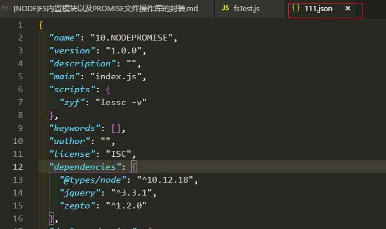

> 8. `fs.unlink`: 删除文件
> 删除具体的文件

```javascript
fs.unlink('./less/1.less', err => {
    if(err){
        console.log(err);
        return;
    }
    console.log('ok');
})
```

### path模块

> path.resolve()方法
>
> 不传参: 返回当前模块的绝对地址(不包含模块名称)
```javascript
let path = require('path');

console.log(path.resolve());//=> 返回当前模块的绝对地址(不包含模块名称): c:\Users\99344\Desktop\zhufeng\10.NODEPROMISE <=> __dirname.
```
> 传参: 可以把一个相对路径拼接在绝对路径的后面(第一个参数是绝对路径, 第二个是相对路径, 如果都是绝对路径, 以最后一个为主

```javascript
let path = require('path');
console.log(path.resolve(`${__dirname}/css`, `${__dirname}/less`));//=> c:\Users\99344\Desktop\zhufeng\10.NODEPROMISE\less
console.log(path.resolve(__dirname, 'less/tt'));//=> c:\Users\99344\Desktop\zhufeng\10.NODEPROMISE\less\tt 可以把一个相对路径拼接在绝对路径的后面(第一个参数是绝对路径, 第二个是相对路径, 如果都是绝对路径, 以最后一个为主)
```
- __dirname和path.resolve()区别

> **__dirname: 当前模块所在的绝对路径(和模块中的方法在哪执行是没有关系的)**
> **path.resolve(): 当前模块中方法在哪个模块中执行的, 那么对应的绝对路径是执行模块的绝对路径**

### Promise文件操作库的封装

> fsPromise.js文件
>
> 封装原理:

```javascript
let fs = require('fs'),
    path = require('path');

let readFile = function (pathName) {
    //=> 一般都会把传递的PATH-NAME进行处理: 以当前项目的根目录为依托, 我们只需要传递相对于根目录的相对目录地址, 程序自动生成一个绝对目录地址
    /* 
        __dirname: 当前模块所在的绝对路径(和模块中的方法在哪执行是没有关系的)
        path.resolve(): 当前模块中方法在哪个模块中执行的, 那么对应的绝对路径是执行模块的绝对路径
    */
    pathName = path.resolve(path.resolve(), pathName);
    return new Promise((resolve, reject) => {
        fs.readFile(pathName, 'UTF-8', (err, result) => {
            if (err) {
                reject(err);
                return;
            }
            resolve(result);
        });
    });
};

module.exports = {
    readFile
};

```

> fsTest.js文件
>
> 使用模块:

```javascript
let { readFile } = require('./utils/fsPromise');
readFile('less/2.css').then(result => {
    console.log(result);
});
```

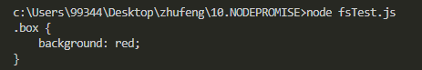

- Promise文件操作库的封装

> **封装了常用的8个方法**

> 根据每个方法的参数, 有无返回值, 返回值的个数进行封装

```javascript
let fs = require('fs'),
    path = require('path');
//=> 存储的是当前模块执行所在的绝对路径(!==__dirname)
let dirname = path.resolve();

//=> MKDIR && RMDIR && READ-DIR && READ-FILE && COPY-FILE
['mkdir', 'rmdir', 'readdir', 'readFile', 'copyFile', 'unlink'].forEach(item => {
    exports[item] = function (pathname, copypath = '') {
        pathname = path.resolve(dirname, pathname);
        copypath = path.resolve(dirname, copypath);
        return new Promise((resolve, reject) => {
            let arg = [(err, result) => {
                if (err) {
                    reject(err);
                    return;
                }
                resolve(result || '');
            }];
            item === 'readFile' ? arg.unshift('utf8') : null;
            item === 'copyFile' ? arg.unshift(copypath) : null;
            fs[item](pathname, ...arg);
        });
    };
});


//=> WRITE && APPEND
['writeFile', 'appendFile'].forEach(item => {
    exports[item] = function (pathname, content) {
        pathname = path.resolve(dirname, pathname);
        if (typeof content !== 'string') {
            //=> 写入的内容我们规定必须是字符串才可以
            content = JSON.stringify(content);
        }
        return new Promise((resolve, reject) => {
            fs[item](pathname, content, 'utf8', (err, result) => {
                if (err) {
                    reject(err);
                    return;
                }
                resolve(result || '');
            });
        });
    };
});
```
> 使用模块:

```javascript
let { readFile } = require('./utils/fsPromise');
readFile('less/1.css').then(result => {
    console.log(result);
});
```

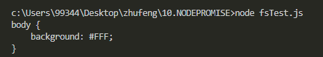

## 使用FS搞点小玩意

### 合并CSS并且压缩

> 使用Promise封装好的FS内置模块,在上面有写到.
>
> fsTest.js文件

```javascript
let { readFile, readdir, writeFile } = require('./utils/fsPromise');
// 1. 先把所有的CSS文件读取出来
readdir('less').then(result => {
    return result.filter(item => /\.CSS$/i.test(item));
}).then(result => {
    let arg = [];
    result.forEach(item => {
        arg.push(readFile(`less/${item}`));//=> 分别调取READ-FILE方法, 读取捕捉到的CSS文件, 向数组中一次增加读取各个文件的PROMISE实例
    });
    //arg=[promise1,promise2...]; 
    // Promise.all():等待数组中所有的PROMISE实例都执行成功才算成功
    return Promise.all(arg);
}).then(result => {
    //=> RESULT: 一个数组, 存放所有文件读取的内容
    result = result.join('');
    return result.replace(/( |\n|\r)/g, '');
}).then(result => {
    return writeFile('less/build.min.css', result);
}).then(() => {
    console.log('创建成功'); 
});
```

> 1.css文件

```javascript
body {
    background: #FFF;
}
```

> 2.css文件

```javascript
.box {
    background: red;
}
```

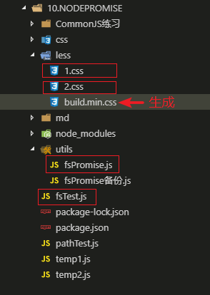

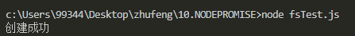

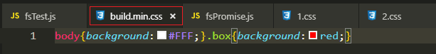

### 使用less批量化编译为css并且压缩

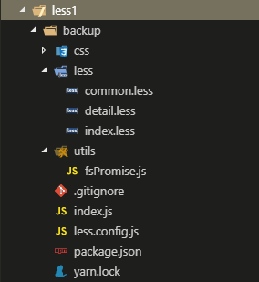

> less.config.js文件 less批量编译配置文件
>
> entry是需要编译的文件, 都写在一起, 可以一次性编译多个文件.
>
> output是对应的编译后的文件存放位置.

```javascript
//=> 需要把config放到当前项目的根目录中
let path = require('path'),
    rootPath = path.resolve();

module.exports = {
    //=> 需要编译的LESS文件
    entry: [
        `${rootPath}/less/index.less`,
        `${rootPath}/less/detail.less`
    ],
    output: [
        `${rootPath}/css/index.min.css`,
        `${rootPath}/css/detail.min.css`
    ]
}
```

> index.js文件

```javascript
let path = require('path'),
    lessc = require('less'),
    rootPath = path.resolve();
let { readFile, writeFile } = require(`./utils/fsPromise`),
    { entry, output } = require(`./less.config`);

//=> 分别读取ENTRY中对应的LESS文件中的代码
entry.forEach((item, index) => {
    readFile(item).then(result => {
        //=> 把读取的LESS代码进行编译: 编译为CSS
        lessc.render(result, { compress: true }, (err, result) => {
            if (err) return;
            let { css } = result;
            writeFile(output[index], css);
        });
    });
});
```

> detail.less文件

```less
@co: green;
.index {
    color: @co;
}
```

> index.less文件

```less
@co: red;
.index {
    color: @co;
}
```

> **编译执行index.js文件后**

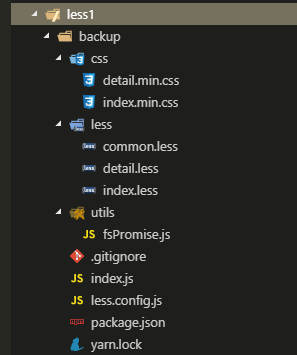

> index.min.css文件

```css
.index{color:red}
```

> detail.min.css文件

```less
.index{color:green}
```


### 使用npm上传less_zyf

> 现在npm注册一个账号`npmjs.com`网站
>
> `npm addUser`登录 用户名,密码, 邮箱
>
> **要换源为npm的源, 淘宝镜像的源是不行的, 要发布到npm上**
>
> `nrm ls`再`nrm use npm`
>
> **要注意路径不能有中文, 文件名字不能有大写**
>
> 登录之后
>
> `npm publish`发布项目到npm

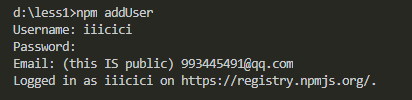

> npm上传整个文件夹
>
> 在package.json文件中把name改为less_zyf防止重名.
>
> backup文件夹是备份的意思

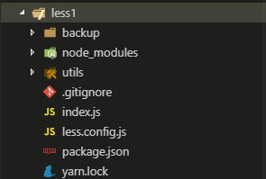

> package.json文件

```javascript
{
  "name": "less_zyf",
  "version": "1.0.0",
  "description": "",
  "main": "index.js",
  "scripts": {
    "test": "echo \"Error: no test specified\" && exit 1"
  },
  "keywords": [],
  "author": "",
  "license": "ISC",
  "dependencies": {
    "less": "^3.9.0"
  }
}
```
> index.js文件
>
> 需要把执行的内容放到一个对外的方法中, 放到exports对象中, 执行这个方法就表示模块执行了

```javascript
let path = require('path'),
    lessc = require('less'),
    rootPath = path.resolve();
let { readFile, writeFile } = require(`./utils/fsPromise`),
    { entry, output } = require(`./less.config`);
module.exports = {
    render() {
        //=> 分别读取ENTRY中对应的LESS文件中的代码
        entry.forEach((item, index) => {
            readFile(item).then(result => {
                //=> 把读取的LESS代码进行编译: 编译为CSS
                lessc.render(result, { compress: true }, (err, result) => {
                    if (err) return;
                    let { css } = result;
                    writeFile(output[index], css);
                });
            });
        });
    }
}
```


### npm下载使用less_zyf

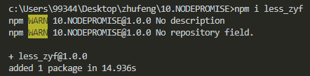

> node_modules文件夹下

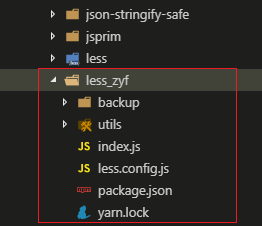

> 整个文件夹下

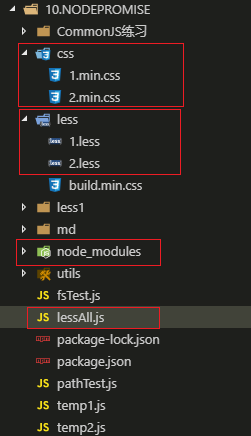


> **less_zyf模块的使用**
>
> lessAll.js文件

```javascript
let lessc = require('less_zyf');
lessc.render();
```

## 内置模块HTTP
> URL内置模块
> `url.parse(url[,flag])`: 把一个URL地址进行解析, 把地址中的每一部分按照对象键值对的方式存储起来

> HTTP内置模块
```javascript
let server = http.creatServer();//=>创建WEB服务
server.listen();//=>监听端口
```

> 注意: 基于node创建后台程序, 我们一般都创建一个server模块, 在模块中实现创建WEB服务, 和对于请求的处理(并且我们一般都会把server模块放到当前项目的根目录下)
>
> 初始化之后需要改package.json文件
>
> "main"主入口修改
>
> "scripts"添加一个命令, `npm run server`/`yarn server`使用

```javascript
{
  "name": "17HTTPmodules",
  "version": "1.0.0",
  "description": "",
  "main": "server.js",
  "scripts": {
    "server": "node server.js"
  },
  "keywords": [],
  "author": "",
  "license": "ISC"
}

```

> server.js文件


```javascript
let http = require('http'),
    url = require('url'),
    path = require('path'),
    fs = require('fs');

//=> 创建WEB服务
let port = 8686;
/* let server = http.createServer();
server.listen(); */
http.createServer(() => {
    //=> 当服务创建成功, 并且客户端向当前服务器发送了请求, 才会执行回调函数, 并且发送一次请求, 回调函数就会被触发执行一次
    console.log(`hello world!`);

}).listen(port, () => {
    //=> 当服务创建成功, 并且端口号已经监听成功后, 触发的回调函数
    console.log(`server is success, listen on ${port}!`)
});


/*
    错误分析
        listen EACCES 0.0.0.0:80
        这种错误都是因为端口号被占用了, 我们需要重新修改端口号

        当服务创建成功, 命令行中会一直存在光标闪烁, 证明服务器正在运行运行(一定要保证服务是运行的), 按CTRL+C可以结束正在运行的服务

    客户端如何向创建的服务器发送请求
        对应好协议, 域名, 端口等信息, 在浏览器中或者AJAX中发送请求即可
        http://loaclhost:8686/... 服务在当前电脑上, localhost本机域名, 也就是本机的客户端浏览器, 访问本机的服务器端程序
        http://IP:8686/...(http://192.168.3.11:8686/...) IP做域名访问, 如果是内网IP, 相同局域网下的用户可以访问这个服务, 如果是外网IP, 所有能联网的基本上都可以访问这个服务(局域网下访问, 需要互相关掉防火墙)
*/
```

> localhost方式访问


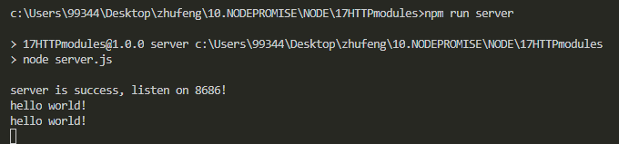

> 内网IP访问(手机也能访问成功)


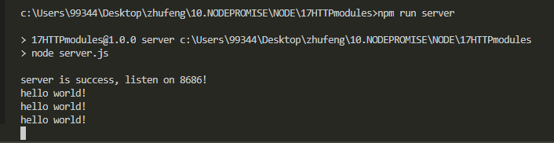

## 请求对象REQ和响应对象RES

- REQ

> REQ: REQUEST 请求对象, 包含了客户端请求的信息
>
> req.url 存储的是请求资源的路径地址及问号传参  例如: /stu/index.html?name=xxx&age=12 GET
>
> req.method 客户端请求的方式 例如: GET
>
> req.headers 客户端的请求头对象, 它是一个对象
>
> ...

> `let { url, method, headers } = req;`
>
> `console.log(url, method, headers);`
>
> 把请求的URL地址中: 路径名称 & 问号传参 分别解析出来
>
> `let {pathname, query} = url.parse(req.url, true);`
>
> `console.log(pathname, query);`

- RES

> RES: RESPONSE 响应对象, 包含了一些属性和方法, 可以让服务器端返回给客户端内容
>
> `res.write` 基于这个方法, 服务器端可以向客户端返回内容
>
> `res.end` 结束响应
>
> `res.writeHead` 重写响应头信息
>
> ...

> `res.write('hello world!');`可以不用写, 直接写在res.end中
>
> res.end('hello world!');//=> 服务器端返回给客户端的内容一般都是 STRING 或者BUFFER格式的数据
>
> res.writeHead(200, {
>
> ​    'content-type': 'text/plain;charset=utf-8;'
>
> })
>
> `res.end(JSON.stringify({ name: '哈哈' }));`

```javascript
let http = require('http'),
    url = require('url'),
    path = require('path'),
    fs = require('fs');

//=> 创建WEB服务
let port = 8686;
let handle = function handle(req, res) {
    //=> REQ: REQUEST 请求对象, 包含了客户端请求的信息
    // req.url 存储的是请求资源的路径地址及问号传参  例如: /stu/index.html?name=xxx&age=12 GET
    // req.method 客户端请求的方式 例如: GET
    // req.headers 客户端的请求头对象, 它是一个对象
    // ...
    /* let { url, method, headers } = req;
    console.log(url, method, headers); */
    //=> 把请求的URL地址中: 路径名称 & 问号传参 分别解析出来
    /* let {pathname, query} = url.parse(req.url, true);
    console.log(pathname, query); */

    //=> RES: RESPONSE 响应对象, 包含了一些属性和方法, 可以让服务器端返回给客户端内容
    // res.write 基于这个方法, 服务器端可以向客户端返回内容
    // res.end 结束响应
    // res.writeHead 重写响应头信息
    // ...
    /* res.write('hello world!'); */
    // res.end('hello world!');//=> 服务器端返回给客户端的内容一般都是 STRING 或者BUFFER格式的数据
    res.writeHead(200, {
        'content-type': 'text/plain;charset=utf-8;'
    })
    res.end(JSON.stringify({ name: '哈哈' }));

};
http.createServer(handle).listen(port, () => {
    console.log(`server is success, listen on ${port}!`)
});
```


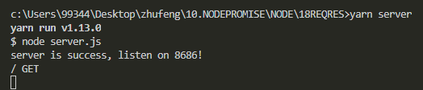


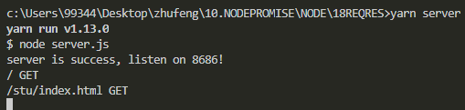

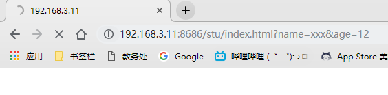

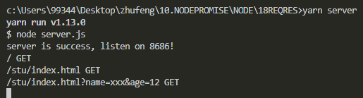

> 加了输出headers

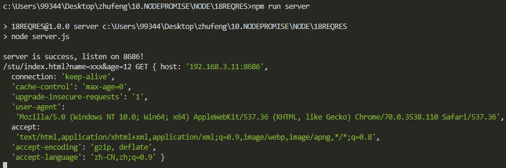

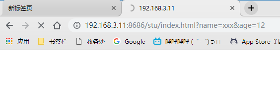

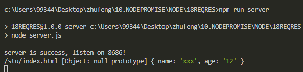
> 服务器端返回必须是字符串格式, 如果是对象必须转换成字符串格式
>
> `res.end(JSON.stringify({name: 'xxx'}));`

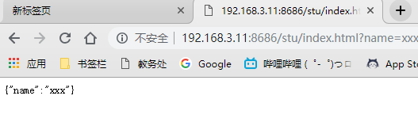

> 字符串是中文的话, 会乱码, 需要设置状态码

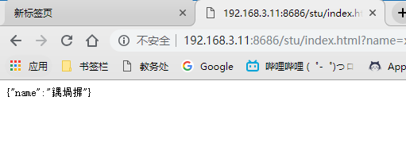

```javascript
res.writeHead(200, {
    'content-type': 'text/plain;charset=utf-8;'
})
res.end(JSON.stringify({ name: '哈哈' }));
```


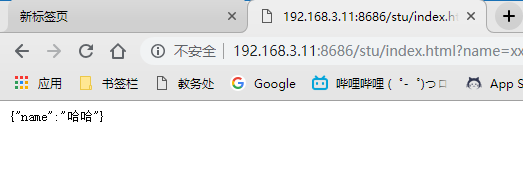

## 创建静态资源服务器

> 服务器上可能有一堆项目代码, 这堆项目代码中既可能有服务器端的程序代码, 也有可能有客户端的项目代码, 而客户端程序代码我们一般都放到static这个文件夹中
>
> static
>  都是服务器端需要返回给客户端, 由客户端浏览器渲染和解析的(前端项目:包括页面,css,js,图片等)
> server.js
>  都是需要在服务器端基于node执行的(后端项目: 一般只有JS)
>
>  我们创建的WEB服务需要处理两类请求:
>            1. 静态资源文件的请求处理: 想要文件
>            2. API接口的请求处理: 想要数据
>                       区别: 第一类请求的地址中有后缀名, 第二类没有后缀


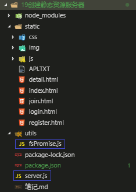

> server.js文件

```javascript
let http = require('http'),
    url = require('url'),
    path = require('path'),
    fs = require('fs');
let { readFile } = require('./utils/fsPromise'),
    mime = require('mime');
//=> 创建WEB服务
let port = 8686;
let handle = function handle(req, res) {
    //=> 客户端请求资源文件(PATH-NAME), 服务器端都是到STATIC文件夹中进行读取, 也是根据客户端请求的路径名称读取的, 服务器端基于FS读取文件中内容的时候, 直接加上"./static"即可
    let { method, headers: requestHeaders } = req,
        { pathname, query } = url.parse(req.url, true),
        pathREG = /\.([a-z0-9]+)$/i;

    //=> 静态资源文件处理
    if (pathREG.test(pathname)) {
        readFile(`./static${pathname}`).then(result => {
            //=>读取成功: 根据请求资源文件的类型, 设置响应内容的MIME
            let suffix = pathREG.exec(pathname)[1];
            res.writeHead(200, {
                'content-type': `${mime.getType(suffix)};charset=utf-8;`
            });
            res.end(result);
        }).catch(error => {
            //=>读取失败:最可能由于文件不存在而读取失败(也就是客户端请求的地址是错误的, 我们应该响应的内容是404)
            res.writeHead(404, { 'content-type': 'text/plain;charset=utf-8;' });
            res.end('NOT FOUND!');
        });
        return;
    }

};
http.createServer(handle).listen(port, () => {
    console.log(`server is success, listen on ${port}!`)
});

```

> fsPromise.js文件

```javascript
let fs = require('fs'),
    path = require('path');
//=> 存储的是当前模块执行所在的绝对路径(!==__dirname)
let dirname = path.resolve();

//=> MKDIR && RMDIR && READ-DIR && READ-FILE && COPY-FILE
['mkdir', 'rmdir', 'readdir', 'readFile', 'copyFile', 'unlink'].forEach(item => {
    exports[item] = function (pathname, copypath = '') {
        pathname = path.resolve(dirname, pathname);
        copypath = path.resolve(dirname, copypath);
        return new Promise((resolve, reject) => {
            let arg = [(err, result) => {
                if (err) {
                    reject(err);
                    return;
                }
                resolve(result || '');
            }];
            if (item === 'readFile') {
                //=> 非图片或者音视频等富媒体资源设置UTF-8
                if (!/(JPG|JPEG|PNG|GIF|SVG|ICO|BMP|EOT|TTF|WOFF|MP#|MP4|OGG|WAV|M4A|WMV|AVI)$/i.test(pathname)) {
                    arg.unshift('utf8');
                }
            }
            item === 'copyFile' ? arg.unshift(copypath) : null;
            fs[item](pathname, ...arg);
        });
    };
});


//=> WRITE && APPEND
['writeFile', 'appendFile'].forEach(item => {
    exports[item] = function (pathname, content) {
        pathname = path.resolve(dirname, pathname);
        if (typeof content !== 'string') {
            //=> 写入的内容我们规定必须是字符串才可以
            content = JSON.stringify(content);
        }
        return new Promise((resolve, reject) => {
            fs[item](pathname, content, 'utf8', (err, result) => {
                if (err) {
                    reject(err);
                    return;
                }
                resolve(result || '');
            });
        });
    };
})
```

## API接口的请求处理(获取指定用户信息)


## API接口的请求处理(POST请求处理)


## 专题汇总-JS中的同步异步(宏任务和微任务)


## process的一点知识

```javascript
// node中独有的异步操作API
// 它也是定时器，但是它不设置时间，但是它也是异步编程（宏任务），它会在所有其他定时器之前执行
// 可以理解setImmediate相当于0毫秒
setTimeout(() => {
  console.log(1)
}, 0)

setImmediate(() => {
  console.log(2)
})
//=> 1 2
```

```javascript
// process.nextTick：把当前任务放到主栈最后执行（当主栈执行完，先执行nextTick，再到等待队列中找）
process.nextTick(() => {
  console.log(2);
});
setTimeout(() => {
  console.log(1)
}, 10);
let i = 0;
while (i < 9999999) {
  i++;
}
console.log(3);
// => 3 2 1
```

```javascript
// 如果在监听端口号下面的代码出现大量的占时间的代码，监听端口的代码在等待队列，由于主栈都没有执行完。访问该端口号会没有反应。
let http = require('http')
http.createServer((req, res) => {
  res.end('ok');
}).listen(8888, () => {
  console.log('success')
})

function computed () {
  let i = 0;
  while (i < 99999999) {
    i++;
  }
}
process.nextTick(computed)
```

`process.env.NODE_ENV`：全局环境变量

用途：真实项目中，我们项目基于webpack打包配置的时候，往往需要区分不同环境下的不同操作，例如有 开发环境、测试环境、生产环境...而我们一般都是基于环境变量来区分打包配置的！

安装`cross-env`兼容所有操作系统

```json
/* package.json */
{
  "name": "23-process",
  "version": "1.0.0",
  "description": "",
  "main": "4-async-process.js",
  "scripts": {
    "dev": "cross-env NODE_ENV=dev node index.js",
    "pro": "cross-env NODE_ENV=pro node index.js",
    "test": "cross-env NODE_ENV=test node index.js"
  },
  "keywords": [],
  "author": "",
  "license": "ISC",
  "dependencies": {
    "cross-env": "^6.0.3"
  }
}

```

```javascript
let ENV = process.env.NODE_ENV;
if (ENV === 'dev') {
    console.log('我是开发环境')
}
if (ENV === 'pro') {
    console.log('我是生产环境')
}
if (ENV === 'test') {
    console.log('我是测试环境')
}
```


# 其他

## 编辑器插件和配置备份神器--setting sync

> 首先在vscode插件中心安装 `setting-sync` 这个插件。

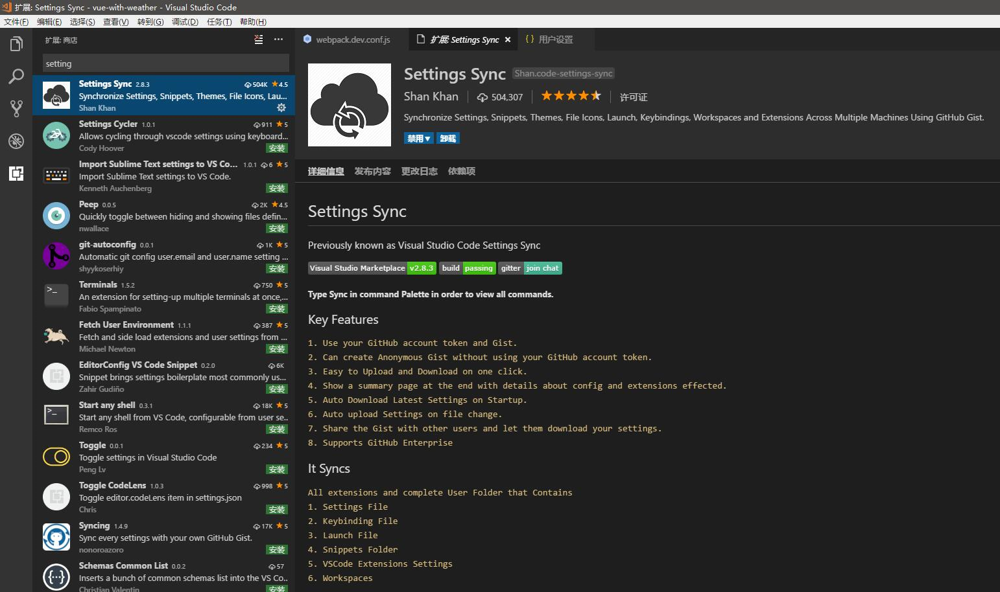

> 然后登陆GitHub进入你的 `Settings\Developer settings` 界面，点击 `Generate new token`。

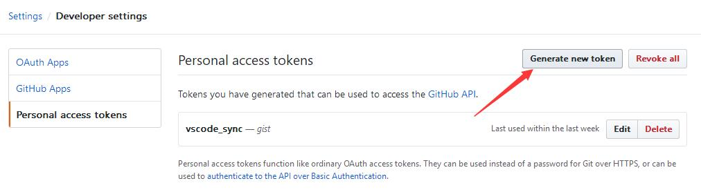

> 按照下图进行设置。


> 点击 `Generate token` 进行生成，复制该字符串。

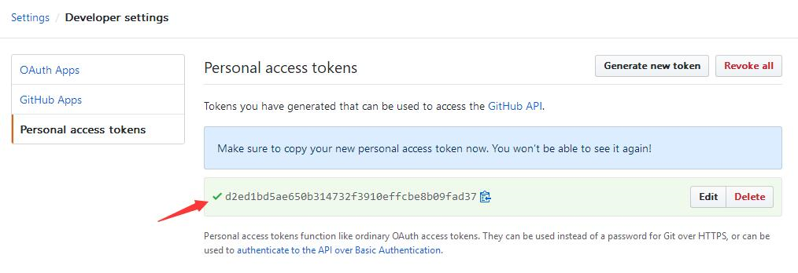

> 回到vscode，在任意界面按 `Alt + Shift + U`，在对话框中输出刚才复制的 `token`。


```
GitHub Token: 8b043912fe107452ceafce920c4298dfedaf4093
GitHub Gist: 1fa641053091a9778ba857e4bfb8709d
```

