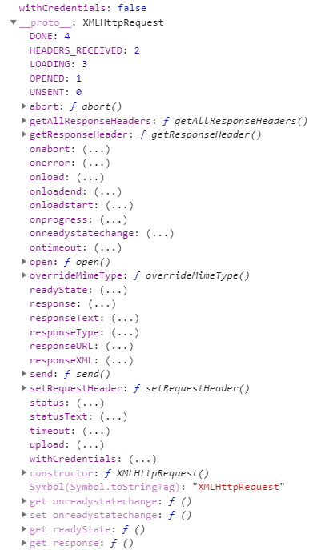
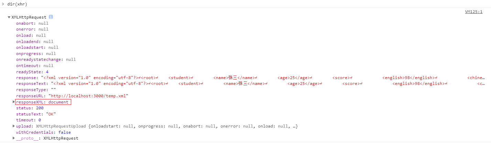
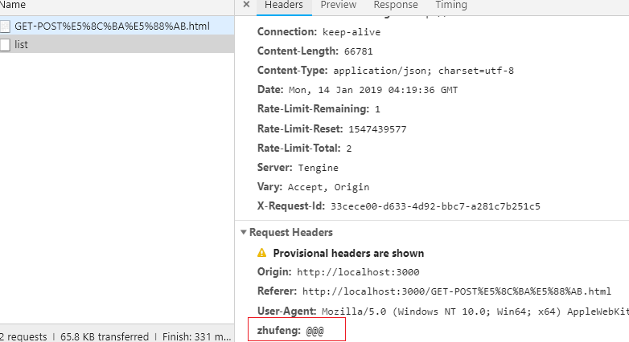
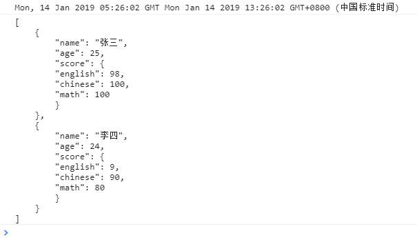
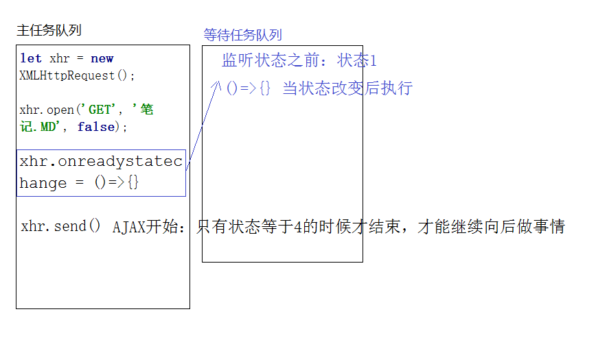

# AJAX

## AJAX

- 1. async javascript and xml(异步的 js 和 xml)

在 ajax 中的异步不是我们理解的同步异步编程, 而是泛指"局部刷新", 但是我们在以后的 ajax 请求中尽可能使用异步获取数据(因为异步数据获取不会阻塞下面代码的执行)

xml 是一种文件格式(我们可以把 HTML 理解为 XML 的一种): 可扩展的标记语言, 它的作用是用自己扩展的一些语义标签来存储一些数据和内容, 这样存储的好处是清晰的展示出数据的结构.

很久以前, AJAX 刚刚兴起的时候, 客户端从服务器端获取数据, 服务器为了清晰的表达数据结构, 都是返回 XML 格式的内容, 当下, 我们获取的数据一般都是 JSON 格式的内容, JSON 相对于 XML 来说, 也能清晰表达数据结构, 而且访问里面数据的时候操作起来比 XML 更简便

但是现在某些项目中, 服务器返回给客户端的数据不单纯是数据, 而是数据和需要展示的结构拼接好的结果(类似于我们自己做的字符串拼接), 换句话说, 是服务器端把数据和结构拼接好返回给我们, 此时返回的数据格式一般都是 XML 格式的字符串

```xml
<?xml version="1.0" encoding="utf-8"?>
<root>
    <student>
        <name>张三</name>
        <age>25</age>
        <score>
            <english>98</english>
            <chinese>100</chinese>
            <math>100</math>
        </score>
    </student>
    <student>
        <name>李四</name>
        <age>24</age>
        <score>
            <english>8</english>
            <chinese>90</chinese>
            <math>80</math>
        </score>
    </student>
</root>
```

```json
[
  {
    "name": "张三",
    "age": 25,
    "score": {
      "english": 98,
      "chinese": 100,
      "math": 100
    }
  },
  {
    "name": "李四",
    "age": 24,
    "score": {
      "english": 9,
      "chinese": 90,
      "math": 80
    }
  }
]
```

- 2. AJAX 操作

1. 创建 AJAX 实例: IE6 中是不兼容的, 使用的是 new ActiveXObject 来实现的
   `let xhr = new XMLHttpRequest();`

2. 打开请求: 发送请求之前的一些配置项
   a. HTTP METHOD 请求方式 GET/DELETE/HEAD/OPTIONS/TRACE/CONNECT/POST/PUT
   b. URL 项服务器端发送请求的 API(Application Programming Interface) 接口地址
   c. ASYNC: 设置 AJAX 请求的同步异步, 默认是异步(写 true 也是异步), false 是同步, 项目中都是用异步编程, 防止阻塞后续代码执行
   d. USER-NAME/USER-PASS: 用户名和密码, 一般不用
   `xhr.open([HTTP METHOD], [URL], [ASYNC], [USER-NAME], [USER-PASS]);`

3. 事件监听: 一般监听的都是 READY-STATE-CHANGE
   事件(AJAX 状态改变事件)，基于这个事件可以获取服务器返回的响应头相应主体内容

```javascript
xhr.onreadystatechange = () => {
  if (xhr.readyState === 4 && xhr.status === 200) {
    xhr.responseText;
  }
};
```

4. 发送 AJAX 请求: 从这步开始, 当前 AJAX 任务开始, 如果 AJAX 是同步的, 后续代码不会执行, 要等到 AJAX 状态成功后再执行, 反之异步不会
   `xhr.send([请求主体内容]);`

- 3. 关于 HTTP 请求方式的一点学习

所有的请求都可以给服务器端传递内容, 也都可以从服务器端获取内容

`GET`: 从服务器端获取数据(给的少拿得多)

`POST`: 向服务器端推送数据(给的多拿得少)

`DELETE`: 删除服务器端的某些内容(一般是删除一些文件)

`PUT`: 向服务器上存放一些内容(一般也是存放文件)

`HEAD`: 只想获取服务器返回的响应头信息, 不要响应主体中的内容

`OPTIONS`: 一般使用它向服务器发送一个探测性请求, 如果服务器端返回信息了, 说明当前客户端和服务器端建立了连接, 我们可以继续执行其他请求了(TRACE 是干这件事的, 但是 axios 这个 AJAX 类库在基于 cross domain 进行跨域请求的时候, 就是先发送 OPTIONS 请求进行探测尝试, 如果能连通服务器, 才会继续发送其它的请求)

### GET 和 POST 的区别

- 4. GET vs POST

[传递给服务器信息的方式不一样]
GET 是基于 URL 地址"问号传参"的方式把信息传递给服务器, POST 是基于"请求主体"把信息传递给服务器

```javascript
// GET "问号传参"
let xhr = new XMLHttpRequest();
xhr.open(
  "GET",
  "https://www.easy-mock.com/mock/5b0412beda8a195fb0978627/temp/list?id=1000&lx=2000"
);
xhr.onreadystatechange = () => {
  if (xhr.readyState === 4 && xhr.status === 200) {
    console.log(JSON.parse(xhr.responseText));
  }
};

// POST "请求主体"
let xhr = new XMLHttpRequest();
xhr.open(
  "GET",
  "https://www.easy-mock.com/mock/5b0412beda8a195fb0978627/temp/list"
);
xhr.onreadystatechange = () => {
  if (xhr.readyState === 4 && xhr.status === 200) {
    console.log(JSON.parse(xhr.responseText));
  }
};
xhr.send(JSON.stringify({ id: 1000, lx: 2000 })); //=> 请求主体中传递给服务的是JSON格式的字符串, 但是真实项目中常用的是URL-ENCODE格式的字符串"id=1000&lx=2000"
```

```javascript
// GET
xhr.open("GET", "/temp/list?xxx=xxx&xxx=xxx");
// POST
xhr.send("xxx=xxx&xxx=xxx");
```

GET 一般应用于拿(给服务器的会少一些), 而 POST 给服务器的很多, 如果 POST 是基于问号传参方式来处理会出现一些问题: URL 会拼接很长, 浏览器对于 URL 的长度有最大限度(谷歌 8KB 火狐 7KB IE2KB...), 超过的部分浏览器就会把它截掉了.

所以 GET 请求可以基于 URL 传参, 而 POST 都是使用请求主体传递(请求主体理论上是没有限制的, 真实项目中我们会自己做大小限制, 防止上传过大信息导致请求迟迟完不成)

[GET 不安全, POST 相对安全]
因为 GET 是基于"问号传参"把信息传递给服务器的, 容易被骇客进行 URL 劫持, POST 是基于请求主体传递的, 相对来说不好被劫持; 所以登录, 注册等设计安全性的交互操作, 我们都应该用 POST 请求.

[GET 会产生不可控制的缓存, POST 不会]
不可控: 不是想要就要, 想不要就不要的, 这是浏览器自主记忆的缓存, 我们无法基于 JS 控制, 真实项目中我们都会把这个缓存干掉.
GET 请求产生缓存是因为: 连续多次向相同的地址(并且传递的参数信息也是相同的)发送请求, 浏览器会把之前获取的数据从缓存中拿到返回, 导致无法获取服务器最新的数据(POST 不会)

解决方案:
保证每次请求的地址不完全一致: 在每一个请求的末尾追加一个随机数即可(使用\_作为属性名就是不想和其它的属性名冲突)

```javascript
xhr.open("GET", `temp/list?lx=1000&_=${Math.random()}`);
```

### AJAX 状态和 HTTP 网络状态码

- 5. AJAX 状态(READY-STATE)

0: UNSENT 刚开始创建 XHR, 还没有发送

1: OPENED 已经执行了 OPEN 这个操作

2: HEADERS_RECEIVED 已经发送 AJAX 请求(AJAX 任务开始), 响应头信息已经被客户端接收了(响应头中包含了: 服务器的时间, 返回的 HTTP 状态码...)

3: LOADING 响应主体内容正在返回

4: DONE 响应主体内容已经被客户端接收

- 6. HTTP 网络状态码(STATUS)

根据状态码能够清楚的反应出当前交互的结果及原因
`200`: OK 成功(只能证明服务器成功返回信息了, 但是信息不一定是你业务需要的)
`301`: Moved Permanently 永久转移(永久重定向)
域名更改, 访问原始域名重定向到新的域名
例如: 京东域名www.360buy.com 状态是 301 永久指向www.jd.com
`302`: Move temporarily 临时转移(临时重定向是 307)
例如: 访问京东用 HTTP 协议访问, 但会临时重定向 HTTPS 协议访问.
网站现在是基于 HTTPS 协议运作的, 如果访问的是 HTTP 协议, 会基于 307 重定向到 HTTPS 协议上
302 一般用作服务器负载均衡: 当一台服务器达到最大并发数的时候, 会把后续访问的用户临时转移到其它的服务器机组上处理
偶尔真实项目中会把所有的图片放到单独的服务器上"图片处理服务器", 这样减少主服务器的压力, 当用户向主服务器访问图片的时候, 主服务器都把它转移到图片服务器上处理

`304` Not Modified 设置缓存

对于不经常更新的资源文件, 例如: css/js/html/img 等, 服务器会结合客户端设置 304 缓存, 第一次加载过这些资源就缓存到客户端了, 下次再获取的时候, 是从缓存中获取; 如果资源更新了, 服务器端会通过最后修改时间来强制让客户端从服务器重新拉取: 基于 CTRL+F5 强制刷新页面, 304 做的缓存就没有用了.

`400` Bad Request 请求参数错误
`401` Unauthorized 无权限访问
`404` Not Found 找不到资源(地址不存在)
`413` Request Entity Too Large 和服务器交互的内容资源超过服务器最大限制

`500` Internal Server Error 未知的服务器错误
`503` Service Unavailable 服务器超负荷

### AJAX 中常用的属性和方法




- 7.关于 XHR 的属性和方法

`xhr.response` 响应主体内容
`xhr.responseText` 响应主体的内容是字符串(JSON 或者 XML 格式字符串都可以)
`xhr.responseXML` 响应主体的内容是 XML 文档

`xhr.readyState` 存有 XMLHttpRequest 的状态。从 0 到 4 发生变化。0: 请求未初始化 1: 服务器连接已建立 2: 请求已接收 3: 请求处理中 4: 请求已完成，且响应已就绪

`xhr.status` 返回的 HTTP 状态码
`xhr.statusText` 状态码的描述

`xhr.timeout` 设置请求超时的时间
`xhr.withCredentials` 是否允许跨域(FALSE 是不允许)

`xhr.abort()` 强制中断 AJAX 请求
`xhr.getAllResponseHeaders()` 获取所有响应头信息
`xhr.getResponseHeader([key])` 获取 KEY 对应的响应头信息, 例如: xhr.getResponseHeader('date')就是在获取响应头中的服务器时间

`xhr.open()` 打开 URL 请求
`xhr.overrideMimeType()` 重写 MIME 类型
`xhr.send()` 发送 AJAX 请求
`xhr.setRequestHeader()` 设置请求头

`xhr.responseText`: 字符串

`xhr.responseXML`: XML 文档

```javascript
let xhr = new XMLHttpRequest();
xhr.open("GET", "temp.xml");
xhr.send();
```



`xhr.timeout`: 设置请求的时间

`xhr.ontimeout`: 设置请求超时后提示, 请求超时会执行 ontimeout 函数

```javascript
let xhr = new XMLHttpRequest();
xhr.open(
  "GET",
  "https://www.easy-mock.com/mock/5b0412beda8a195fb0978627/temp/list"
);
// 设置请求的时间
xhr.timeout = 200;
// 设置请求超时后提示
xhr.ontimeout = () => {
  console.log("请求超时, 请稍后重试");
};
xhr.onreadystatechange = () => {
  if (xhr.readyState === 4 && xhr.status === 200) {
    console.log(JSON.parse(xhr.responseText));
  }
};
xhr.send(null);
```


`xhr.onabort`: 强制中断 AJAX 请求

在请求没结束之前, 中断就可以.

在请求已经结束了之后, 中断不会执行 onabort 函数.

```javascript
let xhr = new XMLHttpRequest();
xhr.open(
  "GET",
  "https://www.easy-mock.com/mock/5b0412beda8a195fb0978627/temp/list"
);
xhr.timeout = 200; // 设置请求的时间
// 设置请求超时后提示
xhr.ontimeout = () => {
  console.log("请求超时, 请稍后重试");
  xhr.onabort();
};
xhr.onabort = () => {
  console.log("当前请求已经被强制中断");
};
xhr.onreadystatechange = () => {
  if (xhr.readyState === 4 && xhr.status === 200) {
    console.log(JSON.parse(xhr.responseText));
  }
};
xhr.send(null);
// 也可以用下面的方式来测试
// setTimeout(() => {
//     xhr.onabort();
// }, 1000);
```


`xhr.setRequestHeader`: 设置的请求头信息不能出现中文而且必须在 OPENED 之后才可以设置成功.

```javascript
let xhr = new XMLHttpRequest();
xhr.open(
  "GET",
  "https://www.easy-mock.com/mock/5b0412beda8a195fb0978627/temp/list"
);
// 设置的请求头信息不能出现中文而且必须在OPENED之后才可以设置成功.
xhr.setRequestHeader("zhufeng", "@@@");
xhr.onreadystatechange = () => {
  if (xhr.readyState === 4 && xhr.status === 200) {
    console.log(JSON.parse(xhr.responseText));
  }
};
xhr.send(null);
```



`new Date()`获取当前客户端时间
`new Date(时间字符串)` 把指定的时间字符串格式化为标准的北京时间(不再是字符串了, 而是 DATE 类的实例, 也是标准的时间格式数据)

```javascript
let xhr = new XMLHttpRequest();
xhr.open("GET", "temp.json");
xhr.onreadystatechange = () => {
  // 证明服务器已经返回内容了(HTTP请求成功)
  if (!/^(2|3)\d{2}$/.test(xhr.status)) return;
  if (xhr.readyState === 2) {
    // 响应头信息已经回来了
    let time = xhr.getResponseHeader("date"); // 获取的结果是格林尼治时间, 而且是字符串
    console.log(time, new Date(time));
  }
  if (xhr.readyState === 4) {
    console.log(xhr.responseText);
  }
};
xhr.send(null);
```



### AJAX 中的同步异步

> new XMLHttpRequest()状态是 0,
>
> xhr.open()状态变为 1.
>
> 响应头返回变为 2,
>
> 响应主体正在返回变为 3,
>
> 响应主体返回变为 4

- 异步: send 和 onreadystatechange(监听状态改变事件)位置前后都不影响

异步操作: 执行 send 后, 有一个线程是去请求数据, 主栈会空闲下来

```javascript
let xhr = new XMLHttpRequest();
xhr.open("GET", "temp.json", true); // 异步
xhr.onreadystatechange = () => {
  // 监听的是AJAX"改变事件": 设置监听之前有一个状态, 当后续的状态和设置之前的状态不相同, 才会触发这个事件
  if (xhr.readyState === 2) {
    console.log(1);
  }
  if (xhr.readyState === 4) {
    console.log(2);
  }
};
xhr.send(); // 发送AJAX请求: 不论是同步还是异步, 执行了send()才证明AJAX任务开始
// 执行send后, 有一个线程是去请求数据, 主栈会空闲下来
console.log(3);
// 等主任务队列都执行完之后, 状态每改变一次, 等待区的onreadystatechange就会到主栈中执行一次
//=> 3 1 2
```

```javascript
let xhr = new XMLHttpRequest();
xhr.open("GET", "temp.json", true);
xhr.send(); // AJAX任务开始(异步)
// 执行send后, 有一个线程是去请求数据, 主栈会空闲下来
// 此时事件绑定前状态是1
xhr.onreadystatechange = () => {
  if (xhr.readyState === 2) {
    console.log(1);
  }
  if (xhr.readyState === 4) {
    console.log(2);
  }
};
console.log(3);
//=> 3 1 2
```

- 同步

同步时, 当执行 xhr.send，就表示 AJAX 请求发出, 任务开始. 只要当前 AJAX 请求这件事没有完成, 什么都不能做, AJAX 任务结束后才出栈.

情景一：onreadystatechange 在前, send 在后, 监听事件可以监听到 2, 3 状态, 但是不执行. 当主任务队列执行结束, 此时状态是 4, 监听事件可以监听到 4 状态并执行

```javascript
let xhr = new XMLHttpRequest();
xhr.open("GET", "temp.json", false);
xhr.onreadystatechange = () => {
  //=> 监听前的状态是1
  if (xhr.readyState === 2) {
    console.log(1);
  }
  if (xhr.readyState === 4) {
    console.log(2);
  }
};
xhr.send(); //=> 任务开始(同步: 只要当前AJAX请求这件事没有完成, 什么都不能做)
console.log(3);
//=> 2 3  当AJAX任务开始, 由于是同步编程, 主任务队列在状态没有变成4(任务结束)之前一直被这件事占用着, 其它事情都做不了(当服务器把响应头返回的时候, 状态为2, 触发了事件readystatechange, 但是由于主任务队列没有完成, 被占用着, 绑定的方法也无法执行... 所以只有状态为4的时候, 此时也只能监听到变为4的状态了, 也就是主任务队列执行结束后才执行reaystatechange这个方法)
```



情景二：onreadystatechange 在后, send 在前. 当 send 执行完后, 此时的状态已经是 4 了, 监听状态不会监听到状态的改变了.

第一行`let xhr = new XMLHttpRequest()`代码进栈, 执行完出栈

第二行`xhr.open`进栈, 执行完出栈.

第三行`xhr.send`进栈, 但是不会出栈, 会等待 AJAX 任务执行结束才会出栈, 出栈时的状态已经为 4 了

第四行是状态监听代码, 会进入等待栈, 等待状态改变的时候才会执行, 但是状态不再改变, 所以不会执行了

所以, AJAX 同步请求的时候, 监听状态要在 send 之前, 否则什么都监听不到

```javascript
let xhr = new XMLHttpRequest();
xhr.open("GET", "temp.json", false);
xhr.send(); //=> 开始请求(状态不为4, 其它事都做不了)
//=> 事件绑定前状态已经是4了
xhr.onreadystatechange = () => {
  //=> 状态改变才会触发, 放到等待区的时候状态已经为4了, 不会再改变了, 所以不会执行这个方法(什么都不会输出)
  if (xhr.readyState === 2) {
    console.log(1);
  }
  if (xhr.readyState === 4) {
    console.log(2);
  }
};
console.log(3);
//=> 3
```

## 封装 AJAX 库

> 封装 AJAX 库

```javascript
(function () {
  function AJAX(options) {
    return new init(options);
  }

  let init = function init(options = {}) {
    // INIT PARAM
    let {
      url,
      method = "GET",
      data = null,
      dataType = "JSON",
      async = true,
      cache = true,
      success,
      error,
    } = options;

    // MOUNT: 把配置项挂载到实例上
    [
      "url",
      "method",
      "data",
      "dataType",
      "async",
      "cache",
      "success",
      "error",
    ].forEach((item) => {
      this[item] = eval(item);
    });

    // SEND: 发送AJAX请求
    this.sendAjax();
  };
  AJAX.prototype = {
    constructor: AJAX,
    init,
    // 发送AJAX请求
    sendAjax() {
      this.handleData();
      this.handleCache();
      // SEND
      let { method, url, async, error, success, data } = this,
        xhr = new XMLHttpRequest();
      xhr.open(method, url, async);
      xhr.onreadystatechange = () => {
        if (xhr.readyState === 4) {
          // ERROR
          if (!/^(2|3)\d{2}$/.test(xhr.status)) {
            error && error(xhr.statusText, xhr);
            return;
          }
          // SUCCESS
          let result = this.handleDataType(xhr);
          success && success(result, xhr);
        }
      };
      xhr.send(data);
    },

    // 处理DATA-TYPE
    handleDataType(xhr) {
      let dataType = this.dataType.toUpperCase(),
        result = xhr.responseText;
      switch (dataType) {
        case "TEXT":
          break;
        case "JSON":
          result = JSON.parse(result);
          break;
        case "XML":
          result = xhr.responseXML;
          break;
      }
      return result;
    },
    // 处理CACHE
    handleCache() {
      let { url, method, cache } = this;
      if (/^GET$/i.test(method) && cache === false) {
        // URL末尾追加时间辍
        // 字符串加时间格式, 时间格式会自动变为毫秒
        url += `${this.check()}_=${+new Date()}`;
        this.url = url;
      }
    },
    // 处理DATA
    handleData() {
      let { data, method } = this;
      if (!data) return;
      // 如果是object对象, 我们把它转换为x-www-form-urlencoded这种模式, 方便后期传递给服务器
      if (typeof data === "object") {
        let str = ``;
        for (let key in data) {
          if (data.hasOwnProperty(key)) {
            str += `${key}=${data[key]}&`;
          }
        }
        data = str.substring(0, str.length - 1);
      }

      // 根据请求方式不一样, 传递给服务器的方式也不同
      if (/^(GET|DELETE|HEAD|TRACE|OPTIONS)$/i.test(method)) {
        this.url += `${this.check()}${data}`;
        this.data = null;
        return;
      }
      // POST系列
      this.data = data;
    },
    check() {
      return this.url.indexOf("?") > -1 ? "&" : "?";
    },
  };
  init.prototype = AJAX.prototype;
  window.ajax = AJAX;
})(window);
```

> html 文件

```html
<script>
  ajax({
    url: "https://www.easy-mock.com/mock/5b0412beda8a195fb0978627/temp/list",
    method: "GET",
    data: {
      name: "赵一凡",
      age: 28,
    },
    cache: true,
    success: (result, xhr) => {
      console.log(result);
    },
    error: (result, xhr) => {
      console.log(result);
    },
  });
</script>
```

## 基于 PROMISE 解决回调地狱问题

### PROMISE

Promise 是 ES6 中新增加的内置类：目的是为了管理异步操作的

1. `new Promise()`创建类的一个实例, 每一个实例都可以管理一个异步操作
   必须传递一个回调函数进去(回调函数中管理你的异步操作), 不传递会报错
   回调函数中会有两个参数
   `resolve`: 异步操作成功做的事情(代指成功后的事件队列 => 成功后要做的所有的事情都存放到成功这个事件队列中)
   `reject`: 异步操作失败做的事情(代指失败后的事件队列)
   `new Promise()`的时候立即把回调函数执行了(Promise 是同步的)
2. 基于`Promise.prototype.then`方法(还有 catch/finally 两个方法)向成功队列和失败队列中依次加入需要处理的事情
3. 如果是多个 then 调用, 不是像我们想象的依次把增加的方法执行
   异步操作成功或者失败, 先把第一个 then 中的方法执行, 每当执行一个 THEN 会返回一个新的 Promise 实例, 这个实例管控的是第一个 then 中方法执行的是成功还是失败

```javascript
let promise1 = new Promise((resolve, reject) => {
  $.ajax({
    url: "json/data.json",
    success(result) {
      resolve(result);
    },
    error(msg) {
      reject(msg);
    },
  });
});
promise1
  .then(
    (result) => {
      console.log("then1 OK", result);
    },
    (msg) => {
      console.log("then1 NO", msg);
    }
  )
  .then(
    (result) => {
      console.log("then2 OK", result);
    },
    (msg) => {
      console.log("then2 NO", msg);
    }
  );
```

建议不要使用 THEN 中的第二个参数（这样看起来很乱），而是建议我们使用 Promise.prototype.catch 来管理失败的情况

```javascript
let promise1 = new Promise((resolve, reject) => {
  $.ajax({
    url: "json/data2.json",
    success(result) {
      resolve(result);
    },
    error(msg) {
      reject("no");
    },
  });
});
promise1
  .then((result) => {
    console.log("THEN1 OK", result);
    100();
    return 100;
  })
  .catch((msg) => {
    // 第一个CATCH
    // 1. 异步请求失败会执行它
    // 2. 第一个THEN方法失败也会执行它
    console.log("catch1", msg);
  })
  .then((result) => {
    console.log("then2 OK", result);
  })
  .catch((msg) => {
    console.log("catch2", msg);
  });
```

**总结**

`then`、`catch`、`finally`算一组，不管执行哪个方法，都会返回新的 promise 实例
then 是管控上一个 promise 实例的成功还是失败
catch 也是管控上一个 promise 实例的成功还是失败，还管控自己 then 兄弟的成功还是失败
finally 不管谁成功还是失败，反正自己都得执行

```javascript
let A = function A() {
  return new Promise((resolve) => {
    setTimeout(() => {
      resolve();
    }, 1000);
  });
};
let B = function B() {
  return new Promise((resolve) => {
    setTimeout(() => {
      resolve();
    }, 1000);
  });
};

let promise = A();
promise
  .then(() => {
    console.log(1);
    return B(); // 如果方法中返回的是一个具体值, 而是执行中没有错误异常, 会立即执行下一个THEN中的方法(不写return 也是返回了具体值: undefined), 但是如果返回的是一个PROMISE实例(并且管控了一个异步操作), 只能等PROMISE完成, 把成功后的结果当做具体的值返回, 才能进入下一个函数执行
  })
  .then(() => {
    console.log(2);
  });
```

### js 中的异常捕获

js 中的异常捕获（目的：把抛出异常的错误捕获到，不让其阻断浏览器的继续执行）

try 报错才会执行 catch 中的代码

finally 不管 try 中的代码成功还是失败都会执行

```javascript
try {
  // 正常执行的JS代码(可能会报错);
  1(); // 报错, 失败
} catch (e) {
  // TRY中的代码报错了会执行CATCH
} finally {
  // 不管TRY中的代码成功还是失败都会执行
}
```

### 解决回调地狱问题

- 普通 jquery 解决回调地狱

```javascript
$.ajax({
  url: "https://www.easy-mock.com/mock/5b0412beda8a195fb0978627/temp/list",
  success: (result) => {
    $.ajax({
      url: "https://www.easy-mock.com/mock/5b0412beda8a195fb0978627/temp/info",
      success: (result) => {
        $.ajax({
          url: "https://www.easy-mock.com/mock/5b0412beda8a195fb0978627/temp/add",
          method: "POST",
          success: (result) => {},
        });
      },
    });
  },
});
```

- 基于发布订阅解决回调地狱问题

```javascript
let $plan = $.Callbacks(),
  $planB = $.Callbacks();
$.ajax({
  url: "https://www.easy-mock.com/mock/5b0412beda8a195fb0978627/temp/list",
  success: (result) => {
    $plan.fire(result);
  },
});

$plan.add((result) => {
  $.ajax({
    url: "https://www.easy-mock.com/mock/5b0412beda8a195fb0978627/temp/info",
    success: (result) => {
      $planB.fire(result);
    },
  });
});

$planB.add((result) => {});
```

- 基于 PROMISE 解决回调地狱问题

```javascript
let queryA = function queryA() {
  return new Promise((resolve) => {
    $.ajax({
      url: "https://www.easy-mock.com/mock/5b0412beda8a195fb0978627/temp/list",
      success: resolve,
    });
  });
};
let queryB = function queryB() {
  return new Promise((resolve) => {
    $.ajax({
      url: "https://www.easy-mock.com/mock/5b0412beda8a195fb0978627/temp/info",
      success: resolve,
    });
  });
};
let queryC = function queryC() {
  return new Promise((resolve) => {
    $.ajax({
      url: "https://www.easy-mock.com/mock/5b0412beda8a195fb0978627/temp/add",
      method: "POST",
      success: resolve,
    });
  });
};

let promise = queryA();
promise
  .then((result) => {
    console.log("A", result);
    return queryB(); // 上一个THEN中函数手动返回一个新的PROMISE实例(管控了一个异步操作), 下一个THEN会等上一个THEN中的异步成功后再执行
  })
  .then((result) => {
    console.log("B", result);
    return queryC();
  })
  .then((result) => {
    console.log("C", result);
  });
```
