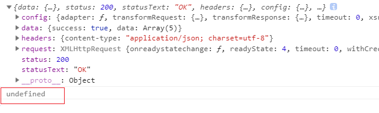
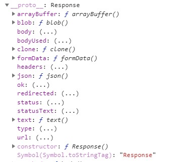
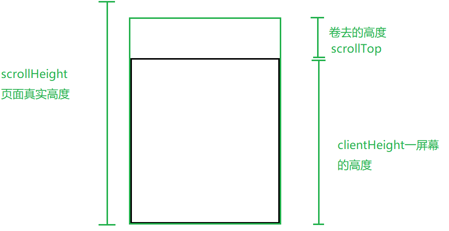

# axios

## axios的基础语法

axios: 它是一个类库, 基于PROMISE管理的AJAX库.

1. 提供了对应请求方式的方法(例如: get/post/head/delete/put/option...)

​	`axios.get()`向服务器发送一个请求, 基于的是GET方式

​	...

2. 支持的参数配置

`axios.get(url[,config])`

`axios.delete(url[,config])`

`axios.head(url[,config])`

`axios.post(url[,data[,config]])`

`axios.put(url[,data[,config]])`

`axios.patch(url[,data[,config]])`


axios不是一个类, 因为原型上没有方法和属性. 只是一个普通函数, 把函数当做一个对象, 对象里面有很多方法

3. 基于GET或者POST方法发请求, 返回的结果都是PROMISE实例

### 向服务器发起请求

- 发送一个get请求

`axios.get(url[,config])`

问号传参的方式

```javascript
axios.get('http://localhost:3000/', {
    params: {//=> GET请求中, 会把PARAMS中的键值对拼接成URLENCODE格式的字符串, 然后以问号传递参数的方式, 传递给服务器, 类似于JQ-AJAX中的DATA(或者自己基于URL后面拼接也可以, 不用PARAMS)
        name: 'zhufeng',
        age: 9
    }
});
```


- 发送一个post请求

`axios.post(url[,data[,config]])`

这样发送一个post请求, 会发送一个RAW格式(JSON格式的字符串)

不是www-form-urlencoded格式, 是RAW格式(也就是JSON格式的字符串)

项目当中最常用的是www-form-urlencoded格式

```javascript
axios.post('http://localhost:3000/', {
    //=> 配置项中传递的内容都相当于基于请求主题传递给服务器, 但是传递给服务器的内容格式是RAW(也就是JSON格式的字符串), 不是X-WWW-FORM-URLENCODED
    name: 'zhufeng',
    age: 9
});
```


### 发送数据之后获取服务端返回的数据

- get请求 请求成功

如果直接在请求地址传递参数, 请求地址是带参数的, 同时config中的url显示问号传参的, 但是config中是没有params属性的.

如果在params中传递参数, 那么请求地址其实也是带参数的, 但是config中的url不显示问号传参的, config中的params是可以看到传参的.


```javascript
let promise = axios.get('https://www.easy-mock.com/mock/5cb165067aab7f78650d2087/example/proxy',{
    params: {
        lx: 12
    }
});
promise.then(result => {
    console.log(result);//服务器返回的不是直接传递回的数据, 而是一个对象
    /* 
            config: 基于axios发送请求的时候做的配置项(当前向服务器发送请求所使用的配置项)
            data: 从服务器获取的响应主体内容
            headers: 响应头信息
            request: 创建的AJAX实例(发送请求创建的)
            status: 状态码
            statusTest: 状态码的描述

            */
})
```


传递的params参数在config配置项中


- get请求 请求失败, 请求地址故意错误

```javascript
let promise = axios.get('https://www.easy-mock.com/mock/5cb165067aab7f78650d2087/example/proxy2',{
    params: {
        lx: 12
    }
});
promise.then(result => {
    console.log(result);//服务器返回的不是直接传递回的数据, 而是一个对象
    /* 
            config: 基于axios发送请求的时候做的配置项(当前向服务器发送请求所使用的配置项)
            data: 从服务器获取的响应主体内容
            headers: 响应头信息
            request: 创建的AJAX实例(发送请求创建的)
            status: 状态码
            statusTest: 状态码的描述

            */
}).catch(msg=>{
    console.log(msg);//=> 请求失败的原因

})
```


- post请求 请求成功

```javascript
let promise = axios.post('https://www.easy-mock.com/mock/5cb165067aab7f78650d2087/example/mock', {
    name: 'cici',
    age: 9
});
promise.then(result => {
    console.log(result);

}).catch(msg => {
    console.log(msg);

})
```


config中的data: 通过请求主体向服务器传递的内容, 是一个JSON格式的字符串

- post请求 请求失败  请求地址故意错误

```javascript
let promise = axios.post('https://www.easy-mock.com/mock/5cb165067aab7f78650d2087/example/mock2', {
    name: 'cici',
    age: 9
});
promise.then(result => {
    console.log(result);
}).catch(msg => {
    console.log(msg);
})
```


- head请求 请求成功

head请求只有响应头, 没有响应主体, 所以result对象中的data是空

```javascript
let promise = axios.head('package.json');
promise.then(result=>{
    console.log(result);
}).catch(msg=>{
    console.log(msg);
})
```


### 实际用法

1. 

```javascript
axios.get('https://www.easy-mock.com/mock/5cb165067aab7f78650d2087/example/proxy').then(result => {
    let { data } = result;
    console.log(data);
    console.log(data.data[0]);

}).catch(msg => {
    console.log(msg)
})
```

> proxy


> 结果


2. 通过promise可以发送完一个请求之后再发送一个请求, 解决了回调地狱的问题

在第一个then里面, 当异步请求发起之后, 并且请求成功执行result才会执行下一个then

return 可以有两种, 一种是返回具体值. 另一种是发起地址请求.

如果第一个then里面, return 的是一个具体值, 则下一个then中的result就是这个具体值

```javascript
axios.get('https://www.easy-mock.com/mock/5cb165067aab7f78650d2087/example/proxy').then(result => {
    let { data } = result;
    console.log(data);
    return axios.post('https://www.easy-mock.com/mock/5cb165067aab7f78650d2087/example/add');
}).then(result => {
    let { data } = result;
    console.log(data);

})
```

> add


> proxy


> 结果


## axios的请求合并以及参数配置

### 请求合并

 A和B同时成功才进行下一步(请求合并)

1. 设置全局变量接收A的结果

```javascript
let result = null;
axios.get('A').then(resultA => {
    return axios.get('B');
}).then(resultB => {
    //=> A和B都成功执行: RESULT-B是B成功后的结果
    //=> 全局RESULT是 A的结果
})
```

2. 通过axios提供的all方法

all源码

```javascript
axios.all = function all(promise){
    return Promise.all(promise);
};
```

all方法的使用:

```javascript
// sendAry存放三个AJAX请求的PROMISE实例
let sendAry = [
    axios.get('https://www.easy-mock.com/mock/5cb165067aab7f78650d2087/example/proxy'),
    axios.get('https://www.easy-mock.com/mock/5cb165067aab7f78650d2087/example/query'),
    axios.post('https://www.easy-mock.com/mock/5cb165067aab7f78650d2087/example/add')
];
//=> 三个请求都完成才做一些事情(可以基于all方法实现)
axios.all(sendAry).then(result => {
    console.log(result);//=> 是一个数组, 分别存储每一个请求的结果

});
```


### 分别操作 请求合并返回的数据

1. 已知返回的数据是一个数组, 可以利用解构进行拆分

```javascript
let sendAry = [
    axios.get('https://www.easy-mock.com/mock/5cb165067aab7f78650d2087/example/proxy'),
    axios.get('https://www.easy-mock.com/mock/5cb165067aab7f78650d2087/example/query'),
    axios.post('https://www.easy-mock.com/mock/5cb165067aab7f78650d2087/example/add')
];
axios.all(sendAry).then(result => {
    let [resA, resB, resC] = result;// 数组解构
});
```

2. axios提供了spread方法, 使用spread方法进行返回数据的操作

spread方法源码

```javascript
function spread (callback){
    return function wrap(arr){
        return callback.apply(null, arr);
    }
}
//使用
let wrap = axios.spread(() => {
    
})
```

使用:

```javascript
axios.all(sendAry).then(axios.spread((resA, resB, resC)=>{
    // RES-A/-B/-C分别代表三次请求的结果
    // 原理是JS中的柯理化函数
}));
```

### 参数配置

#### 尽量是公有的参数

- `axios.defaults.baseURL`: 服务器不变的地址

```javascript
//=> 初始化一些常用的配置项
axios.defaults.baseURL = 'https://www.easy-mock.com/mock/5cb165067aab7f78650d2087/example';
axios.get('/proxy').then((result) => {
    console.log(result);
})
```

- `axios.defaults.validateStatus`: 验证返回的状态码

```javascript
axios.defaults.baseURL = 'https://www.easy-mock.com/mock/5cb165067aab7f78650d2087/example';
axios.defaults.validateStatus = function validateStatus(status){
    //=> 自定义成功失败规则: RESOLVE / REJECT (默认规则: 状态码以2开头算作成功)
    return /^(2|3)\d{2}$/.test(status);
}
// 使用
axios.get('/proxy').then((result)=>{
    console.log(result);
})
```


如果把状态码4开头也算作成功, 错误报4开头的也算成功

```javascript
axios.defaults.baseURL = 'https://www.easy-mock.com/mock/5cb165067aab7f78650d2087/example',
axios.defaults.validateStatus = function validateStatus(status){
    return /^(2|3|4)\d{2}$/.test(status);
}
axios.get('/proxy2').then((result)=>{
    console.log(result);
})
```


#### 尽量是私有的参数

- `axios.defaults.timeout`: 设置超时时间 (设置为私有因为每个请求的时间不一样,要分别设置超时时间)

```javascript
axios.defaults.timeout = 5000;
```

- `axios.defaults.headers`: 设置自定义请求头 (最好不要把每个请求的请求头传递数据都是一样的)

result中的headers是响应头信息

```javascript
axios.defaults.baseURL = 'https://www.easy-mock.com/mock/5cb165067aab7f78650d2087/example'
axios.defaults.headers = {//=> 自定义请求头
    name: 'iiicici'
}
axios.get('/proxy').then((result)=>{
    
})
```


- `axios.defaults.params`: GET传参(最好不要把每个请求的请求头传递数据都是一样的)

```javascript
axios.defaults.params={}
```

GET私有传递参数:

```javascript
axios.defaults.baseURL='https://www.easy-mock.com/mock/5cb165067aab7f78650d2087/example';
axios.get('/proxy',{
    params:{
        name:'iiicici'
    },
    headers:{
        xxx:'xxx'
    }
}).then((result)=>{
    console.log(result)
})
```


- `axios.defaults.data`: POST传参(最好不要把每个请求的请求头传递数据都是一样的)

```
axios.defaults.data={}
```

POST私有传递参数:

```javascript
// POST发起请求顺便传递参数
axios.defaults.baseURL='https://www.easy-mock.com/mock/5cb165067aab7f78650d2087/example';
axios.post('/mock',{//=> POST传参
    name:'iiicici'
},{
    headers:{//=> 设置配置信息, 设置headers信息
        xxx:'xxx'
    }
}).then((result) => {
    console.log(result);
})
```


- `axios.defaults.headers['Content-Type'] `: 设置在请求中基于请求主体向服务器发送内容的格式, 默认是RAW, 项目中常用的是URL-ENCODED格式

`axios.defaults.transformRequest`: 设置请求数据为urlencoded格式

```javascript
axios.defaults.baseURL='https://www.easy-mock.com/mock/5cb165067aab7f78650d2087/example';
//设置请求头中Content-Type
axios.defaults.headers['Content-Type']='application/x-www-form-urlencoded';
//设置请求的数据为urlencoded格式
axios.defaults.transformRequest = data => {
    //=> data: 就是请求主体中需要传递给服务器的内容
    let str = ``;
    for(let attr in data){
        if(data.hasOwnProperty(attr)){
            str += `${attr}=${data[attr]}&`;
        }
    }
    str = str.substring(0, str.length-1);
    return str;
};
axios.interceptors.response.use(result=>{
    return result;
},error=>{
    
});
axios.post('/mock',{
    lx: 12,
    sex: 1
}).then(result => {
    console.log(result);
})
```

未改变之前: 是RAW, 也就是JSON格式的字符串


改变之后: 手动设置为urlencoded格式


- `axios.interceptors.response.use(function success(result){},function error(err){})`

设置响应拦截器: 分别在响应成功和失败的时候做一些拦截处理(在执行成功后设定的方法之前, 先会执行拦截器中的方法)

1. 下面的成功执行内的参数是响应拦截器的返回值.如果没有返回值, 则参数是undefined

```javascript
axios.defaults.baseURL='https://www.easy-mock.com/mock/5cb165067aab7f78650d2087/example';
axios.interceptors.response.use(function success(result){
    console.log(result);// 没有返回值, 下面的成功执行的参数是函数的返回值.如果没有返回值, 则参数是undefined
}, function error(err){
    
});
axios.get('/proxy',{
    params:{
        name:'iiicici'
    } 
}).then((result)=>{
   console.log(result); 
});
```



2. 如果响应拦截器直接是返回的result中的data, 也就是 响应主体内容. 那么执行成功中的参数全是响应主体.

```javascript
//项目中常用的两个
axios.defaults.baseURL='https://www.easy-mock.com/mock/5cb165067aab7f78650d2087/example';
axios.interceptors.response.use(result => result.data);
axios.get('/proxy',{
    params:{
        name:'iiicici'
    }
}).then((result)=>{
    console.log(result);
}).catch((error)=>{
    console.log(error);
})

```


#### 常用的参数配置

```javascript
axios.defaults.baseURL='...';
axios.interceptors.reponse.use(result => result.data);
axios.defaults.validateStatus = status => /^(2|3)\d{2}$/.test(status);// 默认是只以2开头的算是成功
```


# FETCH中的基础语法

## 基础语法

FETCH不是AJAX, 它诞生的目的是为了代替AJAX, 它是JS中内置的API: 基于FETCH可以实现客户端和服务器端的信息通信

1. FETCH是ES2018规范中新增的API, 所以浏览器的支持度不是特别好(可以基于BABEL的最新语法解析包, 把其进行解析, 最后还是解析成AJAX), 想要兼容性好一些, 需要使用`fetch polyfill`
2. 使用FETCH发送请求

GET/HEAD等请求不能设置BODY, 只能在地址问号传参传递数据

不管服务器返回的状态是多少, FETCH都不认为是失败(哪怕是4或者5开头的状态码), 都执行的是THEN方法(需要我们自己进行异常抛出处理)

- get发送请求成功

```javascript
fetch('https://www.easy-mock.com/mock/5cb165067aab7f78650d2087/example/proxy', {
    method: 'GET',
    headers: {
        //=> 设置请求头
        'Content-Type': 'x-www-form-urlencoded'
    },
    credentials: 'include'//=> 不管同源还是跨域请求都带着COOKIE信息
}).then(result => {
    console.log(result);
    /* 
            headers:{} 包含响应头信息
            redirected: false 是否重定向
            status: 状态码
            statusText: 状态码描述
            type: 类型 跨域还是不跨域
            	arrayBuffer()
                blob()
                json()
                text()
                ...
                基于这些方法可以快速的把从服务器获取的结果找到
             */
});
```

请求easy-mock地址




请求本地的1.json


- get发送请求失败

```javascript
fetch('https://www.easy-mock.com/mock/5cb165067aab7f78650d2087/example/proxy2', {
    method: 'GET',
    headers: {
        'Content-Type': 'x-www-form-urlencoded'
    },
    credentials: 'include'//=> 不管同源还是跨域请求都带着COOKIE信息
}).then(result => {
    console.log(result);
});
```


- post请求

传递参数只能在body中设置字符串, 不能设置对象形式的参数

```javascript
fetch('https://www.easy-mock.com/mock/5cb165067aab7f78650d2087/example/mock', {
    method: 'post',
    body: "name=iiicic&age=1"//=> body中只支持字符串(GET请求还无法设置body,只能在地址中设置参数)
}).then(result => {
    let { status } = result;
    if (/^(4|5)\d{2}$/.test(status)) {
        throw new Error('query data is error!')
        return;
    }
    return result.json();

}).then(result => {
    console.log(result)
}).catch(msg => {
    console.log(msg);
})
```


## 实际用法

因为不论是请求成功还是失败都执行then, 所以要自己获取状态码进行判断.

- 请求错误

```javascript
fetch('https://www.easy-mock.com/mock/5cb165067aab7f78650d2087/example/proxy2').then(result=>{
    // 把状态码解构出来
    let {status} = result;
    if(/^(4|5)\d{2}$/.test(status)){
        throw new Error('query data is error!');
        return;
    }
    return result.json();
    // 如果成功的话走then, 如果抛出异常的话走catch
}).then(result=>{
    console.log(result);
}).catch(msg=>{
    console.log(msg);
});
```


- 请求成功

```javascript
fetch('https://www.easy-mock.com/mock/5cb165067aab7f78650d2087/example/proxy').then(result=>{
    let {status} = result;
    if(/^(4|5)\d{2}$/.test(status)){
        throw new Error('query data is error!')
        return;
    }
    return retult.json();
}).then(result=>{
    console.log(result);
}).catch(msg=>{
    console.log(msg);
})
```


# 基于PROMISE封装属于自己的AJAX库


# [京东投票]

## 项目概述

1. 打开项目

`$ yarn install / $ npm install`: 跑环境(把项目依赖的插件进行安装)
`$ node admin.js`: 启服务(把自己的计算机作为服务器,)

2. API.TXT: API接口文档

真实项目中, 后台开发人员会给前端开发人员提供一个技术文档(接口文档), 文档中描述了前端需要调取后台的某些接口实现的某些功能, 并且标注了请求的地址、请求方式、传递给服务器的内容、以及服务器返回的结果等信息

这就是前后端分离： 前端开发这不需要考虑后台是基于什么技术怎么实现的， 我们只需要按照API文档中提供的信息， 去发送请求传递内容即可，这样就可以获取我们需要的数据（API文档就是约束前端和后台的规范文档）

## 跑通数据获取的逻辑

### 面试题

> 有一万条数据, 想让其绑定到页面中, 怎么做好一些?

```
1. 文档碎片: 遍历数据, 把对应的数据和结构都添加到文档碎片中, 在把文档碎片插入到页面中(优势: 减少了DOM的回流 => 基于字符串拼接也可以)
2. 虚拟DOM: 类似于REACT框架, 基于虚拟DOM以及DIFF算法, 也可以优化数据绑定
3. 其实从本质来讲怎么做都不是最好的, 我们不应该出现1万条这种大数据量的绑定
	因为
	从服务器获取1万条消耗很多时间
	页面渲染1万条也会消耗很多时间
```

#### 异步数据加载(分页加载)

[需要服务器端做支持]

1. 客户端向服务器端发送一个GET请求, 传递给服务器: 每页展示的条数, 当前要展示的页数等信息, 例如传递的是 ?limit=20&page=1(每页展示20条, 当前展示第一页)
2. 服务器接收到请求后, 在所有的数据中把 第一页的20条数据 返回给客户端
3. 当用户下拉加载更多或者点击第二页等页码按钮等时候, 重复第一步, 把对应要展示的页码传递给服务器, 服务器返回对应页码中的数据
4. ...

```javascript
let matchRender = (function ($) {
    let $userList = $('.userList'),
        $wrapper = $userList.find('ul'),
        $tip = $userList.find('.tip'),
        $headerBox = $('.headerBox'),
        $searchBtn = $headerBox.find('.searchBtn');


    let limit = 10,//=> 每页展示的数量
        page = 1,//=> 当前是第几页
        pageNum = 1,//=> 总页数
        total = 0,//=> 总条数
        search = '',//=> 搜索的内容
        isRun = false;//是否正在加载最新的数据

    //=> QUERY-DATA:获取数据
    let queryData = function queryData() {
        axios.get('/getMathchList', {
            params: {
                limit,
                page,
                search
            }
        }).then(result => {
            pageNum = parseFloat(result['pageNum']);
            total = parseFloat(result['total']);
            return result;
        }).then(bindHTML);
    }

    //=> BIND-HTML:数据绑定
    let bindHTML = function bindHTML(result) {
        let { code, list = [] } = result;
        if (parseFloat(code) !== 0) {
            //=> 获取数据失败:这个失败不是服务器返回失败,而是获取的数据不是我们最终想要的而已,非状态码的失败
            $wrapper.css('display', 'none');
            $tip.css('display', 'block');
            isRun = false;
            return;
        }
        //=> 成功绑定数据
        $wrapper.css('display', 'block');
        $tip.css('display', 'none');
        let $frg = $(document.createDocumentFragment());
        list.forEach((item, index) => {
            let { id, name, picture, sex, matchId, slogan, voteNum, isVote } = item;
            /* 从列表点击跳转到详情页面:我们把用户的ID通过问号传递参数的方式传递给详情页面(?userId=xxx),到详情页面我们只需要获取到这个ID,然后根据传递ID不同展示不同的信息即可 */
            $frg.append(`<li>
                <a href="detail.html?userId=${id}">
                    
                    <p class="title">
                        <span>${name}</span>
                        |
                        <span>编号 #${matchId}</span>
                    </p>
                    <p class="slogan">${slogan}</p>
                </a>
                <div class="vote">
                    <span class="voteNum">${voteNum}</span>
                    ${parseFloat(isVote) === 0 ? `<a href="javascript:;" class="voteBtn">投他一票</a>` : ``}
                </div>
            </li>`);
        });
        $wrapper.append($frg);
        $frg = null;

        //=>最新数据加载完成
        isRun = false;
    }
    return {
        init: function init() {
            //=> 开始展示第一页的内容
            queryData();
            //=> 下拉加载更多数据
            $(window).on('scroll', () => {
                let {
                    clientHeight,
                    scrollTop,
                    scrollHeight
                } = document.documentElement;

                if (clientHeight + scrollTop + 200 >= scrollHeight) {
                    //页面即将到达底部:加载更多数据
                    //=>正在加载中是不允许加载新数据的
                    if (isRun) return;//=>如果isRun已经为true了,就跳出判断,不进行数据加载
                    if (page >= pageNum) return;
                    isRun = true;
                    page++;
                    queryData();
                }
            })

            //=> 点击搜索
            $searchBtn.tap(() => {
                if (isRun) return;
                isRun = true;
                search = $searchBtn.prev('input').val().trim();
                //=> 还要把之前ul中的内容清空,然后展示最新搜索的信息即可
                $wrapper.html('');
                page = 1;
                queryData();
            });
        }
    }
})(Zepto);
matchRender.init();
```


## 首页数据的下拉加载和搜索

### EventTarget.addEventListener()

> 方法将指定的监听器注册到 `EventTarget`上，当该对象触发指定的事件时，指定的回调函数就会被执行。 事件目标可以是一个文档上的元素 `Element`,`Document`和`Window`或者任何其他支持事件的对象 (比如 `XMLHttpRequest`)。

> `addEventListener()`的工作原理是将实现`EventListener`的函数或对象添加到调用它的`EventTarget`上的指定事件类型的事件侦听器列表中。

- 语法

`target.addEventListener(type, listener[, options]);`
`target.addEventListener(type, listener[, useCapture]);`
`target.addEventListener(type, listener[, useCapture, wantsUntrusted]); `

参数:

type: 表示监听事件类型的字符串。

listener: 当所监听的事件类型触发时，会接收到一个事件通知（实现了 `Event` 接口的对象）对象。listener 必须是一个实现了 EventListener接口的对象，或者是一个函数。

options (可选):一个指定有关 `listener `属性的可选参数**对象**。可用的选项如下：

- `capture`:  Boolean，表示 `listener` 会在该类型的事件捕获阶段传播到该 `EventTarget` 时触发。
- `once`:  Boolean，表示 listener 在添加之后最多只调用一次。如果是true，listener会在其被调用之后自动移除。
- `passive`: Boolean，设置为true时，表示 `listener` 永远不会调用 preventDefault()。如果 listener 仍然调用了这个函数，客户端将会忽略它并抛出一个控制台警告。
- `mozSystemGroup`: 只能在 XBL 或者是 Firefox' chrome 使用，这是个 Boolean，表示 `listener `被添加到 system group。

- `useCapture`  可选

  `Boolean`，在DOM树中，注册了listener的元素， 是否要先于它下面的EventTarget，调用该listener。 当userCapture(设为true) 时，沿着DOM树向上冒泡的事件，不会触发listener。当一个元素嵌套了另一个元素，并且两个元素都对同一事件注册了一个处理函数时，所发生的事件冒泡和事件捕获是两种不同的事件传播方式。事件传播模式决定了元素以哪个顺序接收事件。进一步的解释可以查看 事件流 及 JavaScript Event order文档。 如果没有指定， `useCapture` 默认为 false 。 

**注意:** 对于事件目标上的事件监听器来说，事件会处于“目标阶段”，而不是冒泡阶段或者捕获阶段。在目标阶段的事件会触发该元素（即事件目标）上的所有监听器，而不在乎这个监听器到底在注册时`useCapture` 参数值是true还是false。

**注意:** `useCapture`  仅仅在现代浏览器最近的几个版本中是可选的。 例如 Firefox 6以前的版本都不是可选的。为了能够提供更广泛的支持，你应该提供这个参数。

wantsUntrusted:如果为 `true `, 则事件处理程序会接收网页自定义的事件。此参数只适用于 Gecko（chrome的默认值为true，其他常规网页的默认值为false），主要用于附加组件的代码和浏览器本身。

返回值

`undefined`.

### 下拉加载



`scrollTop + clientHeight + 200 >= scrollHeight`

逻辑:

一屏幕的高度加上卷上去的高度如果快达到页面真实高度就要加载数据

在上一页数据没加载完之前,下一页加载数据不会触发

在所有数据加载完成之后,最后一次下拉数据不会触发加载数据请求

代码:

```js
let matchRender = (function ($) {
    let limit = 10,//=> 每页展示的数量
        page = 1,//=> 当前是第几页
        pageNum = 1,//=> 总页数
        total = 0,//=> 总条数
        search = '',//=> 搜索的内容
        isRun = false;//是否正在加载最新的数据

    //=> QUERY-DATA:获取数据
    let queryData = function queryData() {
        axios.get('/getMathchList', {
            params: {
                limit,
                page,
                search
            }
        }).then(result => {
            pageNum = parseFloat(result['pageNum']);
            total = parseFloat(result['total']);
            return result;
        }).then(bindHTML);
    }

    //=> BIND-HTML:数据绑定
    let bindHTML = function bindHTML(result) {
        let { code, list = [] } = result;
        if (parseFloat(code) !== 0) {

        }
        //=> 成功绑定数据
        $wrapper.css('display', 'block');
        $tip.css('display', 'none');
        let $frg = $(document.createDocumentFragment());
        list.forEach((item, index) => {

        });
        $wrapper.append($frg);
        $frg = null;

        //=>最新数据加载完成
        isRun = false;
    }
    return {
        init: function init() {
            //=> 开始展示第一页的内容
            queryData();
            //=> 下拉加载更多数据
            $(window).on('scroll', () => {
                let {
                    clientHeight,
                    scrollTop,
                    scrollHeight
                } = document.documentElement;

                if (clientHeight + scrollTop + 200 >= scrollHeight) {
                    //页面即将到达底部:加载更多数据
                    //=>正在加载中是不允许加载新数据的
                    if (isRun) return;//=>如果isRun已经为true了,就跳出判断,不进行数据加载
                    if (page >= pageNum) return;
                    isRun = true;
                    page++;
                    queryData();
                }
            })
        }
    }
})(Zepto);
matchRender.init();
```

### 搜索

- 逻辑

> 点击搜索
>
> 获取输入框中的搜索内容
>
> 想服务器传输搜索内容的请求
>
> 需要把原来展示的内容数据清空,否则搜索返回的数据会追加到原来的数据之后
>
> 把返回的数据绑定到ul标签下
>
> 当搜索没有完成的时候,再次点击搜索按钮是不会重复发起请求的

```javascript
let matchRender = (function ($) {
    let $userList = $('.userList'),
        $wrapper = $userList.find('ul'),
        $tip = $userList.find('.tip'),
        $headerBox = $('.headerBox'),
        $searchBtn = $headerBox.find('.searchBtn');


    let limit = 10,//=> 每页展示的数量
        page = 1,//=> 当前是第几页
        pageNum = 1,//=> 总页数
        total = 0,//=> 总条数
        search = '',//=> 搜索的内容
        isRun = false;//是否正在加载最新的数据

    //=> QUERY-DATA:获取数据
    let queryData = function queryData() {
        axios.get('/getMathchList', {
            params: {
                limit,
                page,
                search
            }
        }).then(result => {
            pageNum = parseFloat(result['pageNum']);
            total = parseFloat(result['total']);
            return result;
        }).then(bindHTML);
    }

    //=> BIND-HTML:数据绑定
    let bindHTML = function bindHTML(result) {
        let { code, list = [] } = result;
        if (parseFloat(code) !== 0) {

        }
        //=> 成功绑定数据
        $wrapper.css('display', 'block');
        $tip.css('display', 'none');
        let $frg = $(document.createDocumentFragment());
        list.forEach((item, index) => {

        });
        $wrapper.append($frg);
        $frg = null;

        //=>最新数据加载完成
        isRun = false;
    }
    return {
        init: function init() {
            //=> 开始展示第一页的内容
            queryData();
            //=> 下拉加载更多数据
            $(window).on('scroll', () => {
                let {
                    clientHeight,
                    scrollTop,
                    scrollHeight
                } = document.documentElement;

                if (clientHeight + scrollTop + 200 >= scrollHeight) {
                    //页面即将到达底部:加载更多数据
                    //=>正在加载中是不允许加载新数据的
                    if (isRun) return;//=>如果isRun已经为true了,就跳出判断,不进行数据加载
                    if (page >= pageNum) return;
                    isRun = true;
                    page++;
                    queryData();
                }
            })

            //=> 点击搜索
            /* 
            点击按钮触发函数
            获取输入框中的内容
            开始执行搜索
            如果开始执行搜索,再搜索出结果之前,再点击搜索不可用
            此时搜索出的结果放到了展示数据的后面,需要把展示数据清空,把搜索出的结果重新绑定到ul下
            */
            
            $searchBtn.tap(() => {
                if (isRun) return;
                isRun = true;
                search = $searchBtn.prev('input').val().trim();
                //=> 还要把之前ul中的内容清空,然后展示最新搜索的信息即可
                $wrapper.html('');
                page = 1;
                queryData();
            });
        }
    }
})(Zepto);
matchRender.init();
```


## 导航插件的构建


## 登录页面


## token的意义和用法

### uuid库生成token值

```javascript
const guid = require('uuid/v4');

token=guid().replace(/\-/g,'');
```

### token的来源

当客户端多次向服务器端请求数据时, 服务器就需要多次从数据库中查询用户名和密码并进行对比, 判断用户名和密码是否正确, 并作出相应提示. 但这样无疑会增加服务器端的运行压力, 是否可以有一种方式只需要验证用户就是之前的用户而不需要每次在客户端请求数据时都需要查询数据库判断用户名和密码是否正确. 在这种请求下, 引入了token来解决服务器端多次访问数据库问题.

- 什么是Token?
  Token是服务器端生成的一串字符串, 作为客户端进行请求时辨别客户身份的一个个令牌. 当用户第一次登录后, 服务器生成一个token便将此token返回给客户端, 以后客户端只需带上这个token前来请求数据即可, 无需再次带上用户名和密码.

- 使用Token的目的
  Token的目的是为了验证用户登录情况以及减轻服务器的压力, 减少频繁的查询数据库, 使服务器更加健壮.

### Token的运用流程

1. 当用户首次登录成功之后, 服务器端就会生成一个token值, 这个值,会在服务器保存token值(保存在数据库中),再将这个token值返回给客户端.
2. 客户端拿到token值之后, 进行保存(保存位置由服务器端设置).
3. 以后客户端再次发送网络请求(一般不是登录请求)的时候, 就会将这个token值附带到参数中发送给服务器.
4. 服务器接收到客户端的请求之后, 会取出token值与保存在本地(数据库)中的token值进行比较.
5. 如果两个token值相同, 说明用户登录成功过! 当前用户处于登录状态.
6. 如果没有这个token值, 没有登录成功.
7. 如果token值不同: 说明原来的登录信息已经失效, 让用户重新登录.
8. Django Rest framework中JWT的使用稍有差异,这里不做详细说明.
