# Vue介绍

- vue是一个渐进式框架
- vue全家桶：vuejs+vue-router+vuex+axios

## 库和框架

- 库：将代码集合成一个产品，库是我们调用中的方法实现自己的功能。
- 框架：为解决一类问题而开发的产品，框架是我们再指定的位置编写好代码，框架帮我们调用，框架是库的升级版。

## vue的特点

- 核心只关注视图层
- 易学，轻量，灵活的特点
- 适用于移动端项目
- 渐进式框架

## 渐进式的理解

- 声明式渲染（无需关心如何实现）
- 组件系统
- 客户端路由（vue-router）
- 大规模状态管理（vuex）
- 构建工具（vue-cli）

## vue的两个核心

响应的数据变化

- 当数据发生改变，视图会自动更新，不需要操作DOM

组合的视图组件

- ui页面映射为组件树
- 划分组件可维护、可复用、可测试

## MVC与MVVM

### MVC

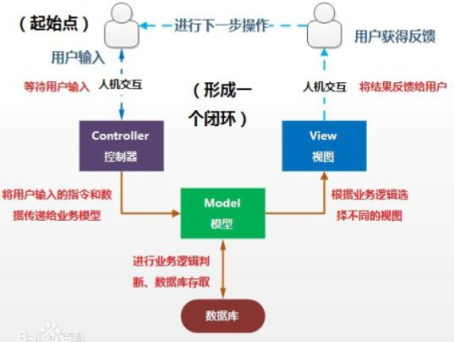

- MVC——数据、表现、行为分离
- model数据，view视图，controller控制器
- MVC是单向的

### MVVM

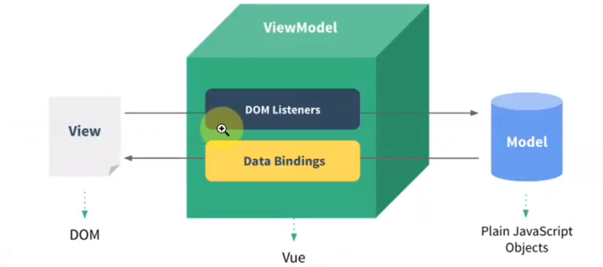

- model数据，view视图，viewModel视图模型
- MVVM是双向的
- MVVM模式的框架：vue、angular

## 兼容性

​	因为vue中用了es5的Object.defineProperty语法，这个方法没有低版本的替代方法，所以vue不支持IE8及以下版本。

## 声明式和命令式

- 自己写for是循环就是命令式（命令其按照自己的方式得到结果）
- 生命式：利用数组的方法forEach(我们想要的式循环，内部帮我们去做)

# vue语法

## vm对象

```html
<!DOCTYPE html>
<html lang="en">

    <head>
        <meta charset="UTF-8">
        <meta name="viewport" content="width=device-width, initial-scale=1.0">
        <meta http-equiv="X-UA-Compatible" content="ie=edge">
        <title>Document</title>
        <script src="vue.js"></script>
    </head>

    <body>
        <div id="app">
            hi
        </div>
    </body>
    <script>

        let vm = new Vue({ // vm就是viewModel
            el: '#app', // 挂载到的元素(querySelector)
            data: { // 用于存放数据,不能放方法,因为data中的this指向的是window
                msg: 'hello', // 可以通过vm.msg取到对应的内容
                arr: [1, 2, 3]
            },
            template: `<h1>{{msg}}</h1>` // 把el所对应的元素替换成template中的内容

        });

        // vm实例对象上的方法
        vm.$watch('msg', function (newVal, oldVal) {
            // msg一变,就会触发回调函数
            console.log(newVal, oldVal);
        });

        // 数据更新是异步的,会放到一个缓存队列中,等到最后更新一次
        vm.msg = 'xxx'; // 数据变化后更新视图的操作是异步之心的
        vm.msg = 'world'; // 更改两次msg,只会触发一次watch

        vm.$nextTick(() => {// 如果不使用$nextTick, vm.$el.innerHTML中的内容则是hello
            console.log(vm.$el.innerHTML);//=> world (vue挂载到的DOM元素中的内容)
            console.log(vm.$options); // 向vm实例传的参数有哪些 {data, el, template...}

        })

    </script>

</html>
```

## moustache模板语法

- `{{}}`中可以放运算、取值、三元
- `{{}}`只能写在标签内，不能写在属性中。在属性中要使用`v-bind`
  - 错误写法：``
- 只要在模板中使用了数据，就必须在vm实例上声明

```html
<body>
    <div id="app">
        {{msg}}<br>
        {{flag==true?'正确':'错误'}}<br>
        {{ {a:1,b:2} }}<br>
        {{msg+'xxx'}}

    </div>
    <script src="vue.js"></script>
    <script>
        let vm = new Vue({
            el: '#app',
            data: {
                msg: 'hello world', // 可以通过vm.msg取到对应的内容
                flag: true
            }
        });
        setTimeout(function () {
            vm.msg = '你好世界'; // 双向绑定: 数据变化会影响视图更新
        }, 3000);
    </script>
</body>
```

## 响应式数据变化

### 响应式的原理

- 响应式就是：当数据发生改变，视图会自动更新，不需要手动操作DOM
- 其原理就是：循环data中的数据，一次增加getter和setter方法
- 但是data对象中没有的项不会被增加getter和setter，也就不具有双向绑定的特性，如下：

```javascript
<div id="app">
    <span>{{aaa}}</span>
<span>{{obj.xxx}}</span>
</div>
<script src="vue.js"></script>
<script>    
    let vm = new Vue({
        el: '#app',
        data: {
            // data中没有初始化aaa
            obj: {} // data的obj中没有初始化obj.xxx
            // 这样就会导致视图中的aaa和obj.xxx不会随着数据的变化进行自动更新
        }
    })
// 以下两条语句也就不会使视图更新
vm.aaa = 1111;
vm.obj.xxx = 2222;
</script>
```

- 所以，使用变量时，一定要先初始化，否则新加的属性不会导致页面渲染
- 要在`data`中先初始化视图中用到的对象，才可以使其具有响应式，如下：

```javascript
let vm = new Vue({
    el:'#app',
    data:{
        aaa: '', // 初始化aaa属性
        obj: {xxx: ''} // 初始化obj中xxx属性
    }
})
```

### 数据响应的简易实现

```javascript

```


## 指令（14个）

指令(directive)--补充了html的属性

- v-bind

动态地绑定一个或多个特性，或一个组件 prop 到表达式。

`v-bind:`

可以用于任何属性

可以直接简写成`:`

```html
<script src="vue.js"></script>
<div id="div1">
    <strong v-bind:title="age+'岁'">{{name}}</strong>
</div>
<script>
    let vm = new Vue({
        el:'#div1',
        data:{
            age: 18,
            name: 'iiicici'
        }
    })
</script>
```

class,style属性有另外的写法

`v-bind:class=""`和`v-bind:style=""`可以接收**字符串**和**数组**

`class_array: ['aa', 'bb', 'v', 'cc']`

`class_str: 'aa bb cc active'`

```html
<div id="div1">
    
    <div :class="class_array"></div>
    <div :class="class_str"></div>
</div>

<script>
    let vm = new Vue({
        el: '#div1',
        data: {
            url: 'https://ss1.baidu.com/6ONXsjip0QIZ8tyhnq/it/u=3101490607,4089794115&fm=58&bpow=400&bpoh=660',
            class_array: ['aa', 'bb', 'v', 'cc'],
            class_str: 'aa bb cc active'
        }
    })
</script>
```


`style_str: 'width:200px;height:200px;background:yellow'`

`style_json: { width: '200px', background: 'green', height: '200px' }`

```html
<div id="div1">
    <div v-bind:style="style_str"></div>
</div>
<script>
    let vm = new Vue({
        el: '#div1',
        data: {
            style_str: 'width:200px;height:200px;background:yellow',
            style_json: { width: '200px', background: 'green', height: '200px' }
        }
    })
</script>
```

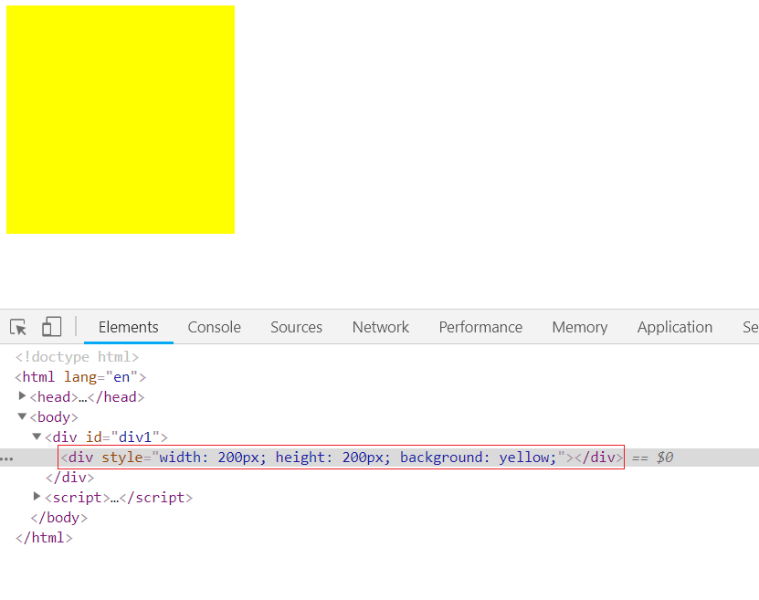


- v-model

实现表单输入和应用状态之间的双向绑定

`v-model`数据双向绑定

数据(data)和input之间双向绑定

输入组件才能使用

v-model进来的数据, 都是字符串

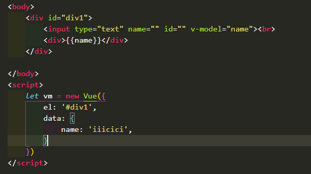

```html
<body>
    <div id="div1">
        <input type="text" name="" id="" v-model="n1">+
        <input type="text" name="" id="" v-model="n2">=
        <span>{{sum()}}</span>
    </div>
    <script>
        let vm = new Vue({
            el: '#div1',
            data: {
                n1: 0,
                n2: 10,
            },
            methods: {
                sum() {
                    return parseInt(this.n1)+parseInt(this.n2);
                }
            }
        })
    </script>
</body>
```

- v-text

`v-text`直接输出html代码

```html
<body>
    <div id="div1">
        <div v-text="str"></div>
        <!-- <div>{{str}}</div> 和这样写效果一样, 这样里面还可以加别的内容-->
    </div>
    <script>
        let vm = new Vue({
            el: '#div1',
            data: {
                str: '<p>11月26日，一段题为“张家口经开区国土局局长接访时玩手机”的视频在网络平台流传。</p>',
            }
        })
    </script>
</body>
```


- v-html

`v-html`innerHTML

```html
<body>
    <div id="div1">
        <div v-html="str"></div>
    </div>
    <script>
        let vm = new Vue({
            el: '#div1',
            data: {
                str: '<p>11月26日，一段题为“张家口经开区国土局局长接访时玩手机”的视频在网络平台流传。</p>',
            }
        })
    </script>
</body>
```


- v-on

`v-on:click="fn(x,x,x...)"`

简写：`@click="fn(x,x,x...)"`

```html
<body>
    <div id="div1">
        <span>{{a}}</span>
        <input type="button" value="+1" v-on:click="sum(3)">
        <!--<input type="button" value="+1" @click="sum(3)"> 简写方式-->
    </div>
    <script>
        let vm = new Vue({
            el: '#div1',
            data: {
                a: 1,
            },
            methods: {
                sum(b) {
                    this.a += b;
                }
            }
        })
    </script>
</body>
```

- v-show

`v-show`：用的display属性

```html
<style>
    .box {
        width: 300px;
        height: 300px;
        background-color: #ccc;
    }
</style>
<script src="vue.js"></script>
<div id="div1">
    <input type="button" value="显示隐藏" @click="commit()">
    <div class="box" v-show="a"></div>
</div>
<script>
    let vm = new Vue({
        el: '#div1',
        data: {
            a: true,
        },
        methods: {
            commit() {
                this.a = !this.a;
            }
        }
    })
</script>
```

显示


隐藏

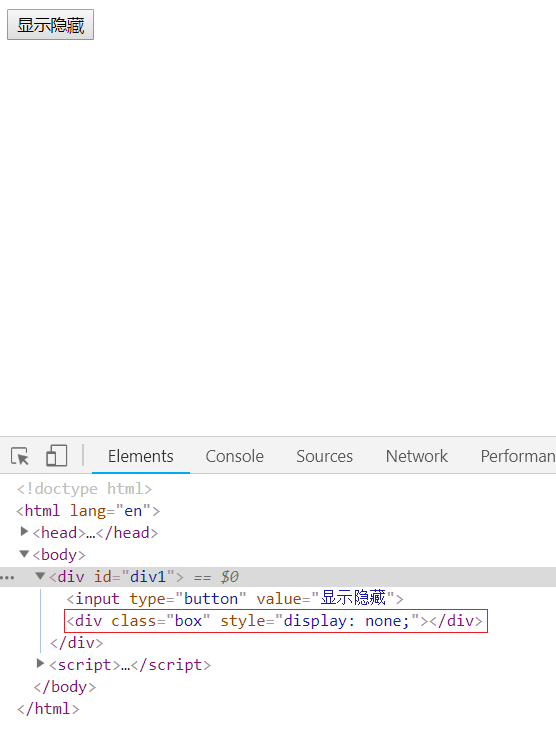

- v-if

`v-if`删除元素

```html
<style>
    .box {
        width: 300px;
        height: 300px;
        background-color: #ccc;
    }
</style>
<script src="vue.js"></script>
<div id="div1">
    <input type="button" value="显示隐藏" @click="commit()">
    <div class="box" v-if="a"></div>
</div>
<script>
    let vm = new Vue({
        el: '#div1',
        data: {
            a: true,
        },
        methods: {
            commit() {
                this.a = !this.a;
            }
        }

    })
</script>
```

显示

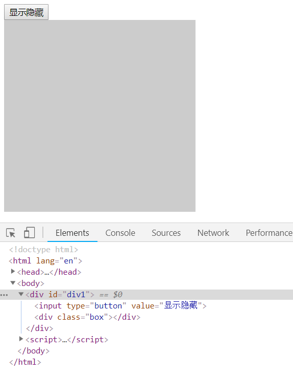

隐藏, 会直接删除元素

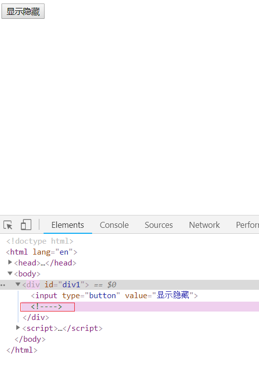

- v-for
  - 数组循环  `v-for="item,index in array"`

    ```html
    <div id="div1">
        <ul>
            <li v-for="a in users">{{a.name}},{{a.password}}</li>
        </ul>
    </div>
    <script>
        let vm = new Vue({
            el: '#div1',
            data: {
                users: [
                    { name: 'blue', password: '123456' },
                    { name: 'zhangsan', password: '11111' },
                    { name: 'iiicici', password: '666666' }
                ]
            }
        });
    </script>
    ```

    

  - json循环 `v-for="val,key in json"`

    ```html
    <div id="div1">
        <ul>
            <li v-for="user,index in users">{{index}}.用户名:{{user.name}},密码:{{user.password}}</li>
        </ul>
    </div>
    <script>
        let vm = new Vue({
            el: '#div1',
            data: {
                users: [
                    { name: 'blue', password: '123456' },
                    { name: 'zhangsan', password: '11111' },
                    { name: 'iiicici', password: '666666' }
                ]
            }
        });
    </script>
    ```

    

    ```html
    <div id="div1">
        <ul>
            <li v-for="val,name in style">{{name}}:{{val}}</li>
        </ul>
    </div>
    <script>
        let vm = new Vue({
            el: '#div1',
            data: {
                style: {
                    width: '200px',
                    height: '300px'
                }
            }
        })
    </script>
    ```

    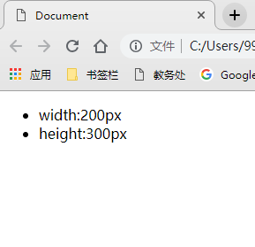

    `:key`属性

    不能重复

    不能变

    ```html
    <div id="div1">
        <ul>
            <li v-for="user in users" :key="user.id">用户名:{{user.name}},密码:{{user.password}}</li>
        </ul>
    </div>
    <script>
        let vm = new Vue({
            el: '#div1',
            data: {
                users: [
                    { id: 1, name: 'blue', password: '1111' },
                    { id: 2, name: 'aaa', password: '2222' },
                    { id: 3, name: 'cici', password: '3333' }
                ]
            }
        })
    </script>
    ```

    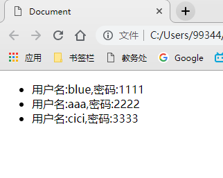
  - 字符串循环 `v-for="char,index in str"`

    ```html
    <div id="div1">
        <ul>
            <li v-for="s in str">
                {{s}}
            </li>
        </ul>
    </div>
    <script>
        let vm = new Vue({
            el: '#div1',
            data: {
                str:'sghjkl'
            }
        })
    </script>
    ```

    
    
  - 数字循环 `v-for="i in num"`

    ```html
    <div id="div1">
        <ul>
            <li v-for="i in 10">
                {{i}}
            </li>
        </ul>
    </div>
    <script>
        let vm = new Vue({
            el: '#div1',
            data: {
    
            }
        })
    </script>
    ```

    

- v-cloak

```html
<script src="vue.js" charset="utf-8"></script>
<style media="screen">
    *[v-cloak] {display:none}
</style>
</head>
<body>
    <div id="div1" v-cloak>
        {{a}}, {{b}}
    </div>
</body>
<script src="1.php" charset="utf-8"></script>
<script>
    let vm=new Vue({
        el: '#div1',
        data: {
            a: 12, b: 5
        }
    });
</script>
```

```php
#1.php
<?php
sleep(3);
?>
```

三秒钟之前是{{a}},{{b}}这种效果

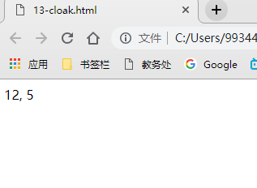

## 数据同步

```html
<body>
    <div id="div1">
        姓名：{{name}}<br>
        年龄：{{age}}
    </div>
</body>
<script>
    let el=document.getElementById('div1');
    let template=el.innerHTML;
    let _data={
        name: 'blue',
        age: 18
    };
    let data=new Proxy(_data, {
        set(obj, name, value){
            //alert(`有人视图设置 ${name}=>${value}`);
            obj[name]=value;

            //数据变了
            //console.log('数据变了');
            render();
        }
    });
    render();

    function render(){
        el.innerHTML=template.replace(/\{\{\w+\}\}/g, str=>{
            str=str.substring(2, str.length-2);
            return _data[str];
        });
    }
</script>
```

## 双向绑定

```html
<body>
    <div id="div1">
        <input type="text" v-model="name"><br>
        姓名：{{name}}<br>
        年龄：{{age}}
    </div>
</body>
<script>
    let el=document.getElementById('div1');

    let template=el.innerHTML;

    let _data={
        name: 'blue',
        age: 18
    };

    let data=new Proxy(_data, {
        set(obj, name, value){
            //alert(`有人视图设置 ${name}=>${value}`);
            obj[name]=value;

            //数据变了
            //console.log('数据变了');
            render();
        }
    });

    render();

    function render(){
        //渲染
        el.innerHTML=template.replace(/\{\{\w+\}\}/g, str=>{
            str=str.substring(2, str.length-2);

            return _data[str];
        });

        //找所有的v-model
        Array.from(el.getElementsByTagName('input'))
            .filter(ele=>ele.getAttribute('v-model'))
            .forEach(input=>{
            let name=input.getAttribute('v-model');
            input.value=_data[name];

            input.oninput=function (){
                data[name]=this.value;
            };
        });
    }
</script>
```

## 虚拟DOM--json

```html
<ul>
  <li>
    <h2></h2>
    <p></p>
  </li>
</ul>
```

> 用json写--虚拟DOM

```json
{
    tag: 'ul',
    child: [
        {tag: 'li', child: [
            ...
        ]}
    ]
}
```

## $ref的基本使用

1. 使用在一般标签上

```html
<div id="app">
    <input ref="count" type="text" v-model="active.name" required name="name" value="">
</div>
```

这样在vue中我们可以使用`$ref`来获取DOM节点, 进行一些DOM操作

示例: 控制input输入框的文字个数

```javascript
new Vue({
    el:'#app',
    data:{
        active:{'name':''}
    },
    watch:{
        active:{
            handler: function (){
                var _this=this;
                var _sum=4;//字数限制为4个
                _this.$ref.count.setAttribute('maxlength',_sum);
            },
            deep:true
        }
    }
})
```

2. 使用在子组件上, 可以用来获取子组件的属性值, 假设子组件里面有一个属性news

```html
<div id="app">
    <hdnews ref="hdnews"></hdnews>
    <hdinfo ref="hdinfo"></hdinfo>
</div>
```

```javascript
new Vue({
    el:'#app',
    mounted:function(){
        console.log(this.$ref.hdnews.news);
        console.log(this.$ref.hdinfo.news);
    }
})
```

## vue-router

### 基本概念

- 容器

`<router-view></router-view>`

- 路由表

```javascript
let router = new VueRouter({
    routes:[
        {path,component},
        {path,component},
        {path,component},
        ...
    ]
});
```

- 添加到vm对象

```javascript
new Vue({
    el,data,...,
    router:router
})
```

 例子：

```html
<script src="vue.js"></script>
<script src="vue-router.js"></script>

<div id="div1">
    <router-link to="/a">页面1</router-link>
    <router-link to="/b">页面2</router-link>
    <router-link to="/c">页面3</router-link>
    <div>文字</div>
    <router-view></router-view>
</div>
<script>
    //路由表
    let router = new VueRouter({
        routes: [
            {
                path: '/a',
                component: { template: '<div>aaaa</div>' }
            },
            {
                path: '/b',
                component: { template: '<div>bbbbb</div>' }
            },
            {
                path: '/c',
                component: { template: '<div>cccc</div>' }
            }
        ]
    });

    let vm = new Vue({
        el: '#div1',
        data: {},
        router:router
    });
</script>
```


- `router-link`相当于a标签

- 为什么要加#号？


防止页面刷新, 便于收藏, 便于后退

```javascript
/* 
* 未添加 mode: http://localhost:8080/#/login    默认hash   
  使用a标签跳转<a href="#/Product">产品</a>  
* 添加 mode为history: http://localhost:8080/login   
  使用a标签跳转<a href="/Product">产品</a>  
* */
mode: 'history', // 一共两种historyhash  默认是hash 
```


- 选中之后会有额外class

`router-link-exact-active`和 `router-link-active`

可以用这个class来做一些选中的事情

```html
<script src="vue.js"></script>
<script src="vue-router.js"></script>
<style>
    .links {
        overflow: hidden;
    }
    .links .nav {
        color: #ccc;
    }
    .links .router-link-active {
        color: black;
    }
</style>
<div id="div1">
    <div class="links">
        <router-link class="nav" to="/a">页面a</router-link>
        <router-link class="nav" to="/b">页面b</router-link>
        <router-link class="nav" to="/c">页面c</router-link>
    </div>
    文字
    <router-view></router-view>
</div>

<script>
    let router = new VueRouter({
        routes: [
            { path: '/a', component: { template: '<div>aaaaa</div>' } },
            { path: '/b', component: { template: '<div>bbbbb</div>' } },
            { path: '/c', component: { template: '<div>ccccc</div>' } }
        ]
    })
    let vm = new Vue({
        el: '#div1',
        data: {

        },
        router: router
    })
</script>
```


`$route`表示的是当前的路由

```html
<style>
    .links {
        overflow: hidden;
    }

    .links .nav {
        color: #ccc;
    }

    .links .router-link-active {
        color: black;
    }
</style>


<div id="div1">
    <div class="links">
        <router-link class="nav" to="/news/58">页面a</router-link>
    </div>
    文字
    <router-view></router-view>
</div>

<script>
    let router = new VueRouter({
        routes: [
            {
                path: '/news/:id',
                name: 'news',
                component: { template: '<div>新闻:{{$route.params.id}}</div>' }
            }
        ]
    })
    let vm = new Vue({
        el: '#div1',
        data: {

        },
        router: router
    })
</script>
```


### 跳转的两种方式及规则

`<router-link to="/xxx/xxx">`一般配合path使用

`<router-link :to="{name='',params={}}">`一般配合name使用

路由跳转如果符合条件的有两个, 具体跳转规则：两个都符合的话, 哪个在前面就跳转哪个

```html
<div id="div1">
    <div class="links">
        <router-link class="nav" to="/news/aaa">页面</router-link>
    </div>
    <router-view></router-view>
</div>

<script>
    let router = new VueRouter({
        routes: [
            {
                path: '/news/aaa',
                component: { template: '<div>页面aaa</div>' }
            },
            {
                path: '/news/:id',
                component: { template: '<div>页面:id</div>' }
            },

        ]
    })
    let vm = new Vue({
        el: '#div1',
        data: {},
        router: router
    })
</script>
```


### 路由传递参数

1. `<router-link to="/aa/123"></router-link>`会显示在地址栏，**在path地址中传参会到params对象中**

   ```
   {
   path:'/aa/:id',
   name: 'aa',
   component: aa,
   }
   ```

   地址：`http://localhost:8080/#/aa/123`
   路由参数
   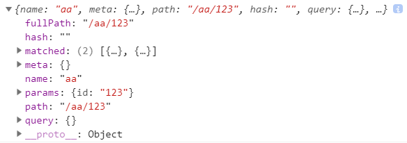

2. **通过params传参只能和name搭配使用，params不能和path一起使用**

   - 不想把params参数显示到地址栏中
     `<router-link :to="{name:'aa',params:{id:123}}"></router-link>`

     ```
     {
     path:'/aa',
     name: 'aa',
     component: aa,
     },
     ```
     地址：`http://localhost:8080/#/aa`
     路由参数
     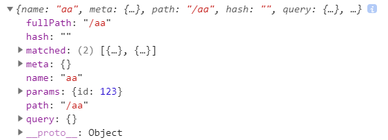

   - 把params参数显示在地址栏中
     `<router-link :to="{name:'aa',params:{id:123,lx:5}}"></router-link>`

     ```
     {
     path:'/aa/:id&:lx',
     name: 'aa',
     component: aa,
     },
     ```

     地址：`http://localhost:8080/#/aa/123&5`

     路由参数

     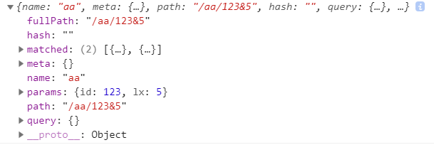

3. `<router-link :to="{path:'/aa',query:{id:123}}"></router-link>`query参数会显示在地址栏，就是问号传参
   `<router-link :to="{name:'aa',query:{id:123}}"></router-link>`**使用query传参的情况下name和path是一样的**

   ```
   {
   path:'/aa',
   name: 'aa',
   component: aa,
   },
   ```

   地址：`http://localhost:8080/#/aa?id=123`

   路由参数
   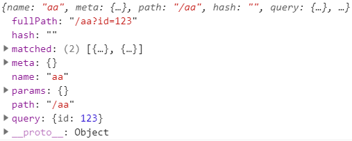

4. `<router-link :to="{path:'/aa/111',params:{id:5},query:{name:'admin',pwd:'123456'}}"></router-link>`**params和path同时存在，params失效。就算path不传参、params传参，也不起效果。所以，并不是path的传参覆盖了params的传参。是params传参只能和name搭配。**

   ```
   {
   path:'/aa/:id',
   name: 'aa',
   component: aa,
   },
   ```

   地址：`http://localhost:8080/#/aa/111?name=admin&pwd=123456`
   路由参数

   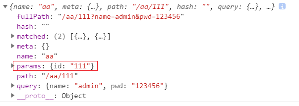


### 命名路由

一般带`name`属性的都是大型路由

```
new VueRouter({
 routes:[
     {path,component},
     {path,name,component}
 ]
})
```


获取路由信息:`$route`

JS控制路由跳转:`$router`：`this.$router.push(string|object);`

为什么叫push?

history是一个栈

监视路由

- watch：操作简单, 但是只能看不能干预（不推荐）

- "路由守卫"：既能看也能干预

### 多任务视图

```html
<body>
    <div id="div1">
        <router-link to="/">首页</router-link>
        <router-link to="/news">新闻</router-link>
        <router-view name="header"></router-view>
        <router-view></router-view>
        <router-view name="footer"></router-view>
    </div>
</body>
<script>
    const headerCmp = { template: '<div>顶部</div>' };
    const indexCmp = { template: '<div>首页</div>' };
    const newsCmp = { template: '<div>新闻</div>' };
    const footerCmp = { template: '<div>底部</div>' };
    let router = new VueRouter({
        routes: [
            {
                path: '/',
                name: 'index',
                components: {
                    default: indexCmp,
                    header: headerCmp,
                    footer: footerCmp
                }
            },
            {
                path: '/news',
                name: 'news',
                components: {
                    default: newsCmp,
                    header: headerCmp,
                    footer: footerCmp
                }
            }
        ]
    });
    let vm = new Vue({
        el: '#div1',
        data: {},
        router
    })
</script>
```

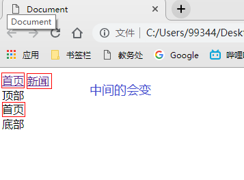

### 路由的钩子

```javascript
<template>
  <div class="index">
    <el-container>
      <el-aside width="200px">
        <Aside />
      </el-aside>
      <el-container>
        <el-header>
          <Header />
        </el-header>
        <el-main class="centerMain">
          <transition name="slide-fade">
            <router-view></router-view>
          </transition>
          <router-view name="footer"></router-view>
        </el-main>
      </el-container>
    </el-container>
  </div>
</template>
<script>
import Header from './components/header'
import Aside from './components/aside'
export default {
  // 路由进入之前
  beforeRouteEnter (to, from, next) { // 通常用来做页面的权限
    console.log(this); // 外面是拿不到this的
    next(vm => { // 这个next方法会在组件渲染完毕之后调用
      console.log(vm); // 可以拿到this
    })
  },
  // 路由离开之前
  beforeRouteLeave (to, from, next) {
    next()
  },
  name: 'App',
  components: {
    Header,
    Aside
  },
  mounted () {
  }
}
</script>
<style scoped>
.index /deep/ .el-header,
.el-footer {
  padding: 0;
}
.centerMain {
  min-height: calc(100vh - 60px);
}
</style>
```


## v1和v2区别

V1.0组件

```
new Vue({
    components:{
        
    }
});

Vue.component('xxx',{
    data(){
        
    },
    template:,
    method:{
        
    }
})
```

v2.0组件

```

```

## 组件之间的通信

子组件:

```vue
<template>
    <div>
        <div>xxxxxxxxxxxx</div>
        <button :style="style">
            <slot/>
        </button>
        <div>xxxxxxxxxxxx</div>
    </div>
</template>

<script>
export default {
    data() {
        return {
            style: `width: 100px; height: 50px; background: ${this.color}; color: ${this.textColor}`
        }
    },
    props: ['color', 'textColor']
}
</script>

<style>
</style>
```

父组件:

```vue
<template>
	<zyf-button color='green' textColor='white'>你好</zyf-button> 
</template>
```

### 1.土办法

- 父级找子级

在子级标签上加ref属性

父级用`this.$refs`

父组件：

```javascript
// parent.js
import Vue from 'vue';
import Child from './child';

export default Vue.component('parent', {
    methods:{
        fn(){
            // this.$refs.c1.num++;
            this.$refs.c1.a();
        }
    },
    template: `
        <div>
            <div>
            	父级
            	<input type="button" value="+1" @click="fn()" />
            </div>
            <child ref="c1"/>
        </div>
        `
})
```

子组件：

```js
// child.js
import Vue from 'vue';

export default Vue.component('child', {
    data() {
        return { num: 0 };
    },
    methods:{
        a(){
            this.num++
        }
    },
    template: `
<div>子级:{{num}}</div>
`
})
```

- 子级找父级

父级加:`parent="this"`, 

子级注册`props:['parent']`, 用`this.parent.xxx`

父组件：

```js
// parent.js
import Vue from 'vue';
import Child from './child';
export default Vue.component('parent', {
    data() {
        return { num: 0 }
    },
    methods: {
        add() {
            this.num += 5;
        }
    },
    template: `
        <div>
            <div>
            父级: {{num}}
            </div>

            <Child :parent="this"/>
        </div>
        `
})
```

子组件：

```js
// child.js
import Vue from 'vue';

export default Vue.component('child', {
    props: ['parent'],
    data() {
        return {};
    },
    methods: {
        fn() {
            //this.parent.num++;
            this.parent.add();
        }
    },
    template: `
        <div>
            子级
            <input type="button" value="+1" @click="fn()" />
        </div>
        `
})
```

- 组件事件

常用:

`$emit`

`$on`

```js
// parent.js
import Vue from 'vue';
import Child from './child';

export default Vue.component('parent', {
    data() {
        return {}
    },
    methods: {
        fn() {
            this.$refs.c1.$emit('add_num', 7);
        }
    },
    template: `
<div>
<div>
父级
<input type="button" value="+1" @click="fn()" />
</div>

<child ref="c1"/>
</div>
`
})
```

```js
// child.js
import Vue from 'vue';

export default Vue.component('child', {
    data() {
        return { num: 0 };
    },
    methods: {
    },
    template: `
<div>
子级:{{num}}
</div>
`,
    created() {
        this.$on('add_num', function (n) {
            this.num += n;
        })
    }
})
```

不常用:

`$off`

`$once`

### 2.vuex


- state--存储,数据
- mutation--修改数据, 追踪: 同步
- action--封装: 组合; 异步
- mutations负责修改state
- 好处: 全局, 统一, 单一

- 能解决的问题:

1. 数据跨组件共享

2. 防止数据意外修改

3. 调试, 测试

- 安装

`npm i vue`

- 使用的三个步骤

```js
// vuex 1.引入
import Vuex from 'vuex';

// vuex 2.声明store对象
//strict:true只在开发模式为true,生产模式为false.通过深度对象比较来做检查,复杂的状态执行会非常慢
const store = new Vuex.Store({
  // strict: true,
  strict: ProcessingInstruction.env.NODE_ENV != 'production', //严格模式: 防止直接修改state
  state: { a: 12, b: 5 },//核心:数据
  mutations: {},
  actions: {},
  getters: {},
  modules: {}
})

// vuex 3.挂载到vue
Vue.use(Vuex);

// 4.写进new Vue()中
new Vue({
    el:'#app',
    store
})
```

- 小案例

可以直接用mutations中的方法, 不用经过actions, 只不过actions是对mutations的封装.

如果想直接使用mutations中的方法, 用下面这种方式

`$store.commit('[mutation_name]',payload)`

主入口:

```js
const store = new Vuex.Store({
  // strict: true,
  strict: process.env.NODE_ENV != 'production', //严格模式: 防止直接修改state
  state: { a: 12, b: 5 },//核心:数据
  mutations: {
    add(state,n){
      state.a+=n;
    }
  },
  actions: {},
  getters: {},
  modules: {}
})
```

视图层:

```vue
<template>
  <div>
    <input type="button" value="+5" @click="fn()">
  </div>
</template>
<script>
export default {
  name: "cmp1",
  methods: {
    fn() {
      //核心
      this.$store.commit("add", 5);
    }
  }
};
</script>
```

- 用actions 修改state数据

`$store.dispatch('[action_name]', payload);`

视图层

```vue
<script>
export default {
    name: "cmp1",
    methods: {
        fn() {
            // this.$store.commit("add", 5);
            this.$store.dispatch("add", 7);
        }
    }
};
</script>
```

主入口

```js
const store = new Vuex.Store({
    // strict: true,
    strict: process.env.NODE_ENV != 'production', //严格模式: 防止直接修改state
    state: { a: 12, b: 5 },//核心:数据
    mutations: {
        add(state, n) {
            state.a += n;
        }
    },
    actions: {
        add(context, n) {
            context.commit('add', n);
        }
    },
    getters: {},
    modules: {}
})
```

- state是一个存放数据的json

- mutation其实是一个函数, 一般认为是对一个操作的封装

修改数据唯一合法的地方

一个mutation可以改多个state

```
mutation(state,arg){
    state.a+=xx;
    state.b+='xxx';
}
```

- action也是一个函数

同一个action,可以修改很多mutation

比如购买一个商品会更改购买状态, 钱包的钱, 积分等等.

```javascript
action(context,arg){
	context.commit('mutation',arg);
}
```

- 操作getters经常在computed里面.

在computed里既可以读又可以修改.

读取就用getters读取.写入就是对action的调用

```javascript
computed: {
        count: {
            get() {
                return this.$store.getters.count;
            },
            set(value) {
                this.$store.dispatch('set_a', value - 5);
                this.$store.dispatch('set_b', 5);
            }
        }
    }
```

computed不用频繁的更新, 读取服务器上数据的时候, 这个特性更好用

- 批量增加getters上的方法给computed用

vue辅助方法:

`mapState`  把state映射成computed  注意: mapState情况下, 只是简单的想获取数据, 不需要数据之间有运算, 就可以使用mapState.

`mapActions`  把actions映射成methods

`mapMutations`把mutations映射成methods

`mapGetters`  把getters映射成computed  注意:mapGetters, 数据之间还需要封装一层等等, 就可以使用mapGetters

```javascript
import Vue from 'vue'
import Vuex from 'vuex'
Vue.use(Vuex)
const store = new Vuex.Store({
  // strict: ProcessingInstruction.env.NODE_ENV != 'production', // 严格模式防止直接改state
  state: { // 类似data
    count: 15,
    b: {
      a: 1
    }
  },
  mutations: { // 类似 methods
    add (state, value) {
      state.count = state.count + value;
    }
  },
  actions: { // 类似 async methods
    minus (context, value) {
      // context = {state, commit}
      setTimeout(() => {
        context.commit('add', -10)
      }, 2000);

    }
  },
  getters: { // 类似computed
    countGetters (state) {
      return state.count % 3 == 0 ? '可被3整除' : '不可被3整除';
    }
  },
  modules: {}
})

export default store;
```


```javascript
<template>
  <div>
    {{c}} {{a}}
    {{this.$store.getters.countGetters}}
    {{countGetters}}
    <br>
    <button @click="minus">点击两秒之后-10</button>
  </div>
</template>

<script>
import { mapState, mapGetters, mapMutations, mapActions } from 'vuex'
export default {
  name: 'Home',
  components: {
  },
  props: {},
  data () {
    return {
      
    }
  },
  watch: {},
  computed: {
    /* count: function () {
      return this.$store.state.count;
    }, */
    //和在computed中把state的变量改变成计算属性同理，方法中得使用数组，
    ...mapState(['count']),
    // 如果需要把state中的变量改名就用对象mapState({'c':'count'})
    ...mapState({ 'c': 'count' }),
    // 3.函数形式 用来获取对象中的属性
    ...mapState({ a: state => state.b.a }),
    // this.$store.getters 同样有三种方式
    ...mapGetters(['countGetters'])
  },
  methods: {
    // mapActions和mapMutations都是方法，传参可以使用对象或者数组。
    ...mapActions(['minusActions']),
    minus () {
      this.minusActions();
    }
  },
  created () { },
  mounted () { }
}
</script>
<style lang="" scoped>
</style>
```

## vue2.0

需要装`vue-loader`和`vue-style-loader`和`vue-html-loader`和`vue-template-compiler`

- `vue-loader`的作用
  - 解析vue文件

- `vue-style-loader`的作用
  - 解析vue文件中style中的部分
  - 把src文件夹下css文件夹下的css文件自动引入到vue文件中的style里, 合并处理

- `vue-html-loader`的作用
  - 解析vue文件中的template标签中的html
- `vue-template-compiler`
  - 把vue文件中的template部分交给`vue-html-loader`处理
  - 把vue文件中的style部分交给`vue-style-loader`处理
  - 文件中的script部分不需要处理, 本身就可以处理

如果css需要用less,还需要安装`less`和`less-loader`

请求工具：fetch 和 axios 和 vue-resource选其中一个

## vue-cli启动器(脚手架)

命令行`vue list`

可以看到vue的模板, 但并不是全部


browserify和browserify-simple一般不用

pwa是和vue配的一个框架

simple搭的是简易的目录结构, 基本不用

大部分用webpack, webpack-simple是简易的, 不用

可以到github上搜vue template,可以找到更多的模板

初始化一个项目 `vue init webpack [projectname]`


## 测试类型

有三大类

- 单元测试(最重要)
  以某一个模块, 或是某一个文件, 或是某一个函数
  单独测试一个东西
  过一段时间测一下

- 集成测试
  把几个库组合起来看会不会出现问题, 集成测试是在单元测试之后的
  测试周期更长

- 压力测试
  程序写完了, 就快发布了, 用工具在压力比较大的情况下进行测试

- 回归测试
  把库修改了之后放回原来的仓库的时候, 进行测试, 确保没有问题

# 原理

## vue响应式数据变化

```javascript
// vue的特点 如果是对象会使用Object.defineProperty
// 会把数组的方法重写

function render() {
    console.log('模拟视图渲染');
}

// let obj = {
//     name: 'jw',
//     location: { x: 100, y: 100 }
// }

let obj = [1, 2, 3];

let methods = ['pop', 'shift', 'unshift', 'sort', 'reverse', 'splice', 'push'];

// 先获取到原来的原型上的方法
let arrayProto = Array.prototype;
// 创建一个自己的原型 并且重写methods这些方法
let proto = Object.create(arrayProto);

methods.forEach(method => {
    proto[method] = function () { // AOP 面向切片编程
        render();
        arrayProto[method].call(this, ...arguments);
    }
})

function observer(obj) { // 把所有的属性定义成set/get的方式
    if (Array.isArray(obj)) {
        obj.__proto__ = proto;
        return;
    }
    if (typeof obj == 'object') {
        for (let key in obj) {
            defineReactive(obj, key, obj[key]);
        }
    }
}
function defineReactive(data, key, value) {// 定义响应式数据变化、数据劫持
    observer(value);// 对象中的属性还是一个对象
    Object.defineProperty(data, key, {
        get() {
            return value;
        },
        set(newValue) {
            observer(newValue); // 数据重写后也是一个对象
            if (newValue !== value) {
                render();
                value = newValue;

            }
        }
    })
}
observer(obj);
// obj.location.x = 200;
// obj.location = {// 数据重写后也是一个对象
//     x: 110,
//     y: 222
// }

/* 如果想给对象增加一个不存在的属性 */
// 用$set效率更高，可以直接对新增的属性渲染，而重写对象会把对象中的属性全部重新渲染
//  1) vue中 如果给对象新增属性 是不会被监控的 可以用 vm.$set 
//  2）也可以用obj.location ={...obj.location, a:1}

// obj.aa = 100;
function $set(data, key, value) {
    if(Array.isArray(data)){
        return data.splice(key,1,value);
    }
    defineReactive(data, key, value);
}

// $set(obj, 'a', 1);
// obj.a = 100;
// console.log(obj.a);

$set(obj,0,100);// 不支持数组的长度变化，也不支持数组的内容发生变化，必须通过上面的方法来触发更新，或者替换成一个新的数组
console.log(obj);
```

### vue3：proxy方式的响应式数据变化

```javascript
// 使用proxy来实现数据的响应式变化
// 可以支持数组，而且不用区分是对象还是数组
// 兼容性 vue 3.0 会采用如果支持proxy  不支持就还是Object.defineProperty
function render() {
    console.log('模拟视图的更新')
}

let obj = {
    name: 'jw',
    age: { age: 100 },
    arr: []
}
let handler = {
    get(target, key) {
        // 如果取的值是对象就在这个对象进行数据劫持
        if (typeof target[key] == 'object' && target[key] !== null) {
            return new Proxy(target[key], handler)
        }
        return Reflect.get(target, key);
    },
    set(target, key, value) {
        if(key === 'length') return true;// 防止数组长度改变，length的属性值变化也会触发视图更新
        render();
        return Reflect.set(target, key, value);
    }
}

let proxy = new Proxy(obj, handler);
// Object.defineProperty proxy 像墙 中间层
proxy.age.age = 200;
console.log(proxy.age.age);
proxy.arr.push(123);
proxy.arr[0]=100;
console.log(proxy.arr)


```

## 数据绑定

```html
<body>
    <!-- mustache 小胡子语法 可以做运算 取值 输出 三元 不能写js语法-->
    <!-- 只要使用vue的数据就需要先声明 再使用 -->
    <div id="app">
        输出：{{msg}} {{1+1}} {{info.a}}
        对象：{{info}} {{ {} }}
        三元：{{flag?1:2}}
        函数：{{ (function(){return 100})() }}
        模板字符串：{{msg+'123'}}
    </div>
    <script src="./node_modules/vue/dist/vue.js"></script>
    <script>
        let vm = new Vue({
            // el: '#app',
            data: {
                info: {},
                msg: 'hello',
                flag: true
            }
        });
        vm.$mount('#app')
        // 1.vm.$el 指代的就是当前的元素
        // 2.vm.$nextTick 延迟执行 DOM操作时必备
        // 3.vm.$watch 监控数据变化
        // 4.vm.$data 当前数据对象
        // 5.vm.$options 所有的选项
        // 6.vm.$set
        // 7.vm.$mount 挂载  单元测试 在内存中挂载vue实例 此时只能用$mount属性

        // 可以观察某个数据 发生变化后触发此函数
        vm.$watch('msg',function (newValue,oldValue){//DOM更新时异步的，会一起更改完才被监听
            console.log(newValue,oldValue)
        })

        vm.msg = 'zf';
        vm.msg = 'xxx'; // DOM更新是异步的
        vm.$nextTick(function(){
            console.log(vm.$el.innerHTML);

        })

    </script>
</body>
```

## vue指令应用

```html

<body>
    <!-- v-for 指令：v-开头 有特定功能的 操作DOM元素-->
    <!-- 数据都需要循环来操作 {} string 最主要：[] 5  -->
    <!-- for(let a of arr) -->
    <!-- vue 2.5+ 版本要求循环的时候 必须增加key属性 为了做domdiff -->
    <!-- v-bind动态绑定属性 所有的指令中的值 都是我们的变量，如果要是字符串需要加双引号-->
    <!-- template vue自带的标签 无意义的标签 template上不能增加key属性 需要给真实的元素添加key-->
    <!-- v-if / v-else / v-show -->
    <!-- v-on 绑定事件 可以简写成@符号 并且事件参数是$event -->
    <div id="app">
        <!-- 对象 -->
        <template v-for="(a,index) in arr">
            <!-- 多个元素 需要区分名称 而且可以使用模板字符串 -->
            <li :key="index+'_1'" :a="index+'_1'">
                {{a}} {{index}}
            </li>
            <li :key=`${index}_2` :a=`${index}_2`>
                {{a}} {{index}}
            </li>
        </template>

        <!-- 数组 -->
        <template v-for="(value, key) in {a:1}">
            <!-- 多个元素 需要区分名称 而且可以使用模板字符串 -->
            <li>
                {{value}} {{key}}
            </li>
        </template>
        <!-- 数字 -->
        <template v-for="(value, key) in 5">
            <!-- 多个元素 需要区分名称 而且可以使用模板字符串 -->
            <li>
                {{value}} {{key}}
            </li>
        </template>
        <!-- v-if v-show区别 if处理DOM是否增加到页面上 show是style的操作 (show 不支持template写法) -->

        <div v-if="false">
            你好
        </div>
        <div v-else>
            不好
        </div>

        <div v-show="false">你好</div>
        <div v-show="true">不好</div>
        {{flag}}<button v-on:click="fn($event)">切换</button>
        <!-- 尽量不要给动态的数据 不要用key来渲染 可能会导致浪费性能-->
        <!-- [香蕉,苹果,橘子] 点击 翻转 -->
        <!-- 循环的时候最好给一个唯一标识 更改数据以后 索引一样 内容不一样 会重新渲染-->
        <!-- 
        <li x>香蕉</li> <li j>橘子</li>
        <li p>苹果</li> <li p>苹果</li>
        <li j>橘子</li> <li x>香蕉</li> 
        -->

        <!-- 输入框复用 加入不同的key就会重新渲染 -->
        <div v-if="flag">
            <label>珠峰</label>
            <input type="text" key="1">
        </div>
        <div v-else="flag">
            <label>姜文</label>
            <input type="text" key="2">
        </div>
        <button @click="fn">切换</button>

        <!-- 只渲染一次 渲染后会产生缓存 下次更新时 会直接从缓存中获取 v-once 可以有效的防止重新渲染-->
        <div v-once>{{flag}}</div>
        <!-- innerHTML 会导致 xss攻击 防止xss攻击 就不要把用户输入的内容直接显示出来-->
        <!-- 比如输入 找不到图片报错会弹框-->
        <input type="text" :value="element" @input="(e)=>{element=e.target.value}">
        <!-- 语法糖 -->
        <input type="text" v-model="element">
        <div v-html="element"></div>
    </div>
    <script src="./node_modules/vue/dist/vue.js"></script>
    <script>
        // 所有的数据 都会合并到vm的实例上 但是会被data覆盖掉 不要声明相同的名字
        let vm = new Vue({
            el: '#app',
            data: {
                arr: [1, 2, 3],
                flag: true,
                // fn: 123,
                element: '<h1>hello</h1>'
            },
            methods: {
                fn(e) {
                    console.log(this);
                    this.flag = !this.flag;
                }
            }
        })
    </script>
</body>
```

## v-model绑定表单元素

```html
<body>
    <div id="app">
        <!-- v-model 是把value值绑定给元素 并且添加input事件 -->
        <!-- v-bind 只是动态绑定属性 -->
        <!-- v-model 可以放到任何地方 -->
        <input type="text" v-model="msg">
        <input type="text" :value="msg" @input="change($event)">
        {{msg}}
        <br>

        <!-- 复选框有两个值 true/false -->
        <input type="checkbox" v-model="check">{{check}}
        <br>

        <!-- 多个爱好 [] checkbox 需要给value的值 多个的时候-->
        <input type="checkbox" v-model="checks" value="游泳">
        <input type="checkbox" v-model="checks" value="健身">
        <input type="checkbox" v-model="checks" value="吃饭"> {{checks}}
        <br>

        <!-- 实现radio的分组 也是通过这个v-model -->
        男<input type="radio" value="男" v-model="gender">
        女<input type="radio" value="女" v-model="gender">
        <br>

        <!-- select 选择一个-->
        <select v-model="select">
            <option value="111" key="111" disabled>请选择</option>
            <option v-for="o in options" :key="o.id" :value="o.id">{{o.title}}</option>
        </select>
        {{select}}
        <br>
        <!-- select 选择多个 multiple多选属性 选择要按ctrl-->
        <select v-model="select1" multiple>
            <option value="111" key="111" disabled>请选择</option>
            <option v-for="o in options" :key="o.id" :value="o.id">{{o.title}}</option>
        </select>
        {{select1}}
        <br>

        <!-- textarea -> input v-model -->
    </div>
    <script src="./node_modules/vue/dist/vue.js"></script>
    <script>
        let vm = new Vue({
            el: '#app',
            data: {
                msg: 'hello',
                check: true,
                checks: [],
                gender: '男',
                select: '111',
                select1: [],
                options: [
                    { title: '数学', id: 1 },
                    { title: '语文', id: 2 },
                    { title: '英语', id: 3 },
                ]
            },
            methods: {
                change(e) {
                    this.msg = e.target.value;
                }
            }
        })
    </script>
</body>
```

## vue的指令和过滤器

### 自定义指令

```html
<body>
    <!-- 指令的作用 操作dom 有特定功能 -->
    <!-- 自定义指令 -->
    <style>
        .content {
            background-color: red;
            height: 100px;
            width: 100px;
        }
    </style>
    <div id="app">
        <div v-color="'red'">
            xxx
        </div>
        <!-- popover -->
        <div v-click-outside="hide">
            <input type="text" @focus="show">
            <div class="content" type="text" v-if="isShow">
                content
                <button>点我</button>
            </div>
        </div>
        <!-- 获取焦点的指令 -->
        <input type="text" v-focus="xxx">
    </div>
    <script src="./node_modules/vue/dist/vue.js"></script>
    <script>
        // 全局指令 不需要每个组件都引用 只需要全局引用下即可
        Vue.directive('color', function (el, bingdings, vnode) { // context
            el.style.border = `1px solid ${bingdings.value}`
            // console.log(this);// window
        });
        let vm = new Vue({
            el: '#app',
            // 图片懒加载  v-scroll都是用指令实现
            directives: {
                // 指令也有生命周期，五个周期
                focus: {// 默认调用的方法是bind和update
                    bind(el) {
                        console.log('el绑定到页面上执行');
                    },
                    inserted(el) { // 这个元素插入到了页面中 执行的钩子
                        el.focus()
                    },
                    // 所有的数据发生变化 都会重新执行
                    update(el) { // 依赖的数据发生变化 会触发此方法
                        console.log(el)
                    }
                },
                'click-outside'(el, bingdings, vnode) {
                    // 绑定给document  捕获到事件发生在谁身上
                    document.addEventListener('click', (e) => {
                        // 如果当前元素内的不管的 点击外面就隐藏content标签

                        if (!el.contains(e.target)) {// e.target 点哪个标签就是哪个标签
                            vnode.context[bingdings.expression]();// vnode.context包含了所有的vue方法 bingdings.expression指令等于的变量hide  将hide方法执行
                        }
                    })
                }
            },
            data: {
                xxx: 'hello',
                isShow: false,
            },
            methods: {
                show() {
                    this.isShow = true;
                },
                hide() {
                    this.isShow = false;
                }
            }
        })
    </script>
</body>
```

### 过滤器

```html
<body>
    <!-- 指令的作用 操作dom 有特定功能 -->
    <!-- 自定义指令 -->
    <style>
        .content {
            background-color: red;
            height: 100px;
            width: 100px;
        }
    </style>
    <div id="app">
        <!-- | 管道符 用来过滤的 -->
        {{xx | toUpper(3)}}
    </div>
    <script src="./node_modules/vue/dist/vue.js"></script>
    <!-- 需要对展现的数据进行包装 但是不能改变原来的数据 hello -->
    <!-- 过滤器和指令都是没有this指向的 -->
    <script>
        Vue.filter('toUpper', function (value, count = 1) {
            // 过滤器函数收到xx的值作为第一个参数
            return value.slice(0, count).toUpperCase() + value.slice(count);
        });
        let vm = new Vue({
            el: '#app',
            data: {
                xx: 'hello'
            },
            methods: {
            }
        })
    </script>
</body>
```

## computed/watch和computed/method

```html
<body>
    <div id="app">
        <!-- {{firstName + lastName}} -->
        <!-- 如果在外部改变xx的值 会重新渲染视图 getName会重新执行一次 getName执行是多余的 所以才会用到computed -->
        <!-- 标签中不允许{{xxx()}} 带()，如果带()，就把xxx变成计算属性或者过滤器 -->
        {{fullName}} {{xx}}
    </div>
    <script src="./node_modules/vue/dist/vue.js"></script>
    <script>
        // computed 和 method的区别  method没缓存 computed有缓存
        // computed 和 watch的区别 watch能异步 computed不能异步
        // 什么时候用watch、computed 如果是简单的事件 数据变化发送调用接口就用watch。如果是计算一个值的结果 就用computed
        let vm = new Vue({
            el: '#app',
            data: {
                firstName: '姜',
                lastName: '文',
                xx: '123',
                fullName: ''
            },
            watch: { // vm.$watch
                firstName: { // 写成对象的目的 为了可以传递参数 immediate deep {a:{a:'1'}}
                    handler(newVal, oldVal) {
                        setTimeout(() => {
                            this.fullName = this.firstName + this.lastName;
                        }, 1000)
                    },
                    immediate: true, // 视图渲染首先会立即执行一遍
                    deep: true // 只要属性发生变化 就会触发此函数 默认只监控一层 使用递归消耗性能
                },
                lastName: {
                    handler(newVal, oldVal) {
                        this.fullName = this.firstName + this.lastName;
                    },
                    immediate: true

                }
                /* firstName(newVal, oldVal) {
                    this.fullName = this.firstName + this.lastName;
                },
                lastName(newVal, oldVal) {
                    this.fullName = this.firstName + this.lastName;
                } */
            },
            // computed 他是基于 Object.defineProperty  getter / setter
            // 计算属性，不是一个方法，被调用时不加()
            // vuex 我们希望通过vuex来实现双向绑定 （全选，多选）
            // computed: {// computed会有缓存 如果以来的数据不发生变化 不会重新执行方法
            //     // computed对象下的属性也是vm下的属性，可以直接this.getName
            //     getName: {
            //         /* console.log('刷新了');
            //         return this.firstName + this.lastName; */
            //         get() {
            //             console.log('刷新了');
            //             return this.firstName + this.lastName;
            //         },
            //         set(val) {
            //             this.xx = val;
            //         }
            //     }
            // },
            /* methods: {
                getName() {
                    console.log('刷新了');
                    return this.firstName + this.lastName;
                }
            } */
        })

    </script>
</body>
```

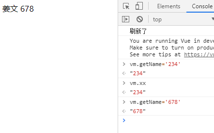

## vue的动画应用

### 单个元素动画

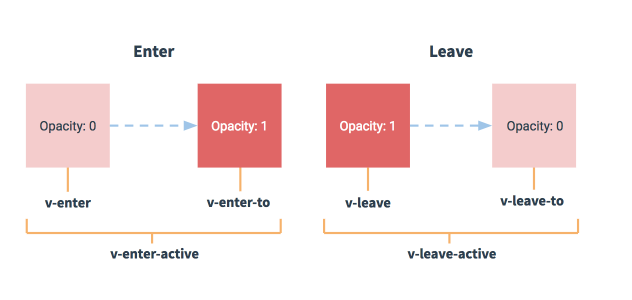

- `npm i animate.css`
- `npm i velocity-animate@beta`

```html
<link rel="stylesheet" href="./node_modules/animate.css/animate.css">
</head>

<body>
    <style>
        .box {
            width: 100px;
            height: 100px;
            background-color: red;
            /* opacity: 0.2 */
        }

        /* 1.transition标签 vue自带的动画 */
        /* 改名：在transition标签中加name v-就变成了 name属性值- */
        .fade-enter {
            opacity: 0
        }

        .fade-enter-active,
        .fade-leave-active {
            transition: opacity 1s linear;
        }

        /* 默认从当前状态变化 */
        /* .v-leave {
            opacity: 1
        } */
        .fade-leave-to {
            opacity: 0
        }

        /* 2. animate.css库 */
        /* .bounce-enter-active {
            animation: bounceIn 1s ease-in
        }

        .bounce-leave-active {
            animation: bounceOut 1s ease-out
        } */
    </style>
    <div id="app">
        <button @click="isShow=!isShow">点击</button>
        <!-- 1. -->
        <!-- 
        <transition name="fade">
            <div class="box" v-show="isShow">content</div>
        </transition> 
        -->
        <!-- 2.animate.css库 name="bounce" 可以指定动画名字 -->
        <!-- 
        <transition name="bounce">
            <div class="box animated" v-show="isShow">content</div>
        </transition> 
        -->
        <!-- 3.animate.css库 可以指定进入和离开的动画类名 -->
        <!-- 
        <transition 
            enter-active-class="bounceIn"
            leave-active-class="bounceOut"
        >
            <div class="box animated" v-show="isShow">content</div>
        </transition>
        -->
        <!-- 4.使用js写动画 -->
        <!-- 
        <transition @before-enter="beforeEnter" @enter="enter" @after-enter="afterEnter">
            <div class="box animated" v-show="isShow">content</div>
        </transition> 
        -->
        <!-- 5.使用velocity.js -->
        <transition @before-enter="beforeEnter" @enter="enter" @after-enter="afterEnter" @leave="leave">
            <div class="box animated" v-show="isShow">content</div>
        </transition>
    </div>
    <script src="./node_modules/vue/dist/vue.js"></script>
    <script src="./node_modules/velocity-animate/velocity.js"></script>
    <script>
        // 常见能触发动画的操作 v-if v-show v-for 路由切换
        // css 添加动画 animation transition
        // js 添加动画 自带的钩子 velocity库
        // 动画分为 单个动画和多个动画
        let vm = new Vue({
            el: '#app',
            data: {
                isShow: false,
            },
            methods: {
                // 4.
                /* beforeEnter(el) {
                    el.style.color = "purple"
                },
                enter(el, done) {
                    setTimeout(() => {
                        el.style.color = "yellow";
                    }, 1000)
                    setTimeout(() => {
                        done();
                    }, 2000)
                },
                afterEnter(el) {
                    el.style.color = "blue"
                } */
                // 5.使用velocity.js
                beforeEnter(el) {
                    el.style.opacity = 0;
                    el.style.color = "purple"
                },
                enter(el, done) {
                    Velocity(el, { opacity: 1 }, { duration: 1000, complete: done });
                },
                afterEnter(el) {
                    el.style.color = "blue"
                },
                leave(el, done) {
                    // 在离开的时候 还需要自己手动重置回去
                    Velocity(el, { opacity: 0 }, { duration: 1000, complete: done })
                }
            }
        })
    </script>
</body>
```

### 多个元素动画

```html
<body>
    <style>
        .box {
            width: 100px;
            height: 100px;
            background-color: red;
            /* opacity: 0.2 */
        }

        .fade-enter {
            opacity: 0
        }

        .fade-enter-active,
        .fade-leave-active {
            transition: opacity 1s linear;
        }

        /* 默认从当前状态变化 */
        /* .v-leave {
            opacity: 1
        } */
        .fade-leave-to {
            opacity: 0
        }

    </style>
    <div id="app">
        <input type="text" v-model="filter">
        <transition-group name="fade">
            <div class="box" v-if="isShow" v-for="(d,index) in computedData" :key="d.title">{{d.title}}</div>
        </transition-group>

    </div>
    <script src="./node_modules/vue/dist/vue.js"></script>
    <script src="./node_modules/velocity-animate/velocity.js"></script>
    <script>
        let vm = new Vue({
            el: '#app',
            data: {
                isShow: true,
                filter:'',
                dataList: [
                    { title: '标题1' },
                    { title: '标题2' },
                    { title: '标题3' },
                    { title: '标题4' },
                ]
            },
            methods: {
            },
            computed: {
                computedData() {
                    return this.dataList.filter(item=>{
                        // item 当前循环的每一项，看一下是否包含filter属性 如果包含就留下
                        return item.title.includes(this.filter)
                    });
                }
            }
        })
    </script>
</body>
```

## 组件的应用

### 生命周期

- 组件的通信：七八种方式

props

events事件

parent

children

ref

eventBus

vuex

- render方法：扩展组件element-ui  iview render方法的使用

```html
<body>
    <div id="app">{{ a }}</div>
    <script src="./node_modules/vue/dist/vue.js"></script>
    <script>
      let vm = new Vue({
        // el: '#app',
        data: {
          a: 'hello'
        },
        methods: {
          bbb: function() {}
        },
        // template:`<p ref="aaa"><span>aaa</span></p>`,
        beforeCreate() {
          // debugger;
          // 钩子函数 在new Vue的时候 会最先调用这个钩子 一般不会做太多功能，底层中可以做一些链（给一些生命周期加属性，可以给实例上挂属性，所有的地方都有这个属性）
          console.log(this) // 会初始化自己的生命周期，事件方法 $on $emit
          console.log(this.$el) // undefined 无法获取真实dom元素的
        },
        created() {
          // 响应式的数据变化观察 this.$el
          // debugger
          console.log(this) // undefined dom元素还没有真正替换到页面上，无法获取真实dom元素的
        },
        // template: `<div>222</div>`, // vue-cli
        /* render(createElement) { // 像react，虚拟dom 就是一个对象
        // <div on:click="xxx" id="1"></div>
        return createElement('div', {
          attrs: {
            id: 1
          },
          on: {
            click(){
              alert(1)
            }
          }
        }, 'hello');
      }, */
        /* beforeMount() { // 这个方法基本用不到，检测有没有template属性，有的话会把这个 template 渲染成一个render函数
        console.log('beforeMount')
      }, */
        mounted() {
          // 唯一的区别 这个里面可以获取真实的元素 this.$el
          // 最好在mounted中发送ajax，因为可以获取DOM元素。不要在created中发送Ajax
          // 在mounted使用DOM会有问题
          this.a = 'world'
          // console.log(this.$el.innerHTML) //=> hello
          this.$nextTick(() => {
            // $nextTick() 原理是 promise.then, setImmediate, MutationObserver, setTimeout这些方法都是异步的，把回调函数放到这些方法中做延迟
            console.log(this.$el.innerHTML) // 只要操作DOM 就增加$nextTick()
          })
        },
        // beforeUpdate() { // 在更新之前再做一次修改
        //   this.a = '140';s'd
        // },
        // updated() { // 不能再修改值了，这个钩子不要更改数据， 如果需要监控数据更改用watch
        //   console.log('更新后')
        //   // this.a = '500' // 会无限循环
        //   console.log(this.a) //=> 140
        // },
        // 当组件销毁的时候会触发，路由切换的时候，手动销毁的时候
        /* beforeDestroy() {
        console.log('销毁前'); // 一般情况下 用来清除定时器 移除绑定的方法事件
      }, */
        /* destroyed() {
          console.log('销毁后')
        } */
      })
      // activeted ...
      // vm.$destroy(); // 手动销毁。属性、数据、响应式的数据变化去掉，不会影响DOM的渲染
    </script>
  </body>
```

### 全局组件

```javascript
<body>
  <div id="app">
    <my-button/>
    <!-- 上面这种是不符合 w3c规范的，如果多次使用只会出现第一次 hr img br才符合自闭合 -->
    <my-button :info="xxx"></my-button>
  </div>
  <script src="./node_modules/vue/dist/vue.js"></script>
  <!-- 组件的类型：全局组件 局部组件 函数式组件 异步组件 -->
  <!-- 为什么要有组件：复用，方便维护，拆分方便，每个组件间作用域是隔离的，组件间互不干扰，组件间的数据传递，组件就是一个自定义的标签，可以代表一些特定的功能。主要封装 css html js .vue文件 -->
  <script>
    // 数据来源 data props
    // 全局组件 在任何组件中可以直接使用，而且不需要引入，在组件的模板中用
    Vue.component('my-button',{// 每个组件都有自己的生命周期
      props:['info'],
      data(){ // 组件的数据必须市函数类型
        return {msg:'点我啊'} // 保证数据不会互相影响 所以通过一个函数返回一个唯一的对象
      },
      template:`<button>点我</button>`
    })
    let vm = new Vue({ // 根实例的数据必须是对象类型，但是自定义的组件必须是函数类型
      el: '#app',
      data: {
        xxx:'试试'
      }
    })
    // 父组件传递给子组件通过属性传递
  </script>
</body>
```

### 局部组件、props、$attrs批量传值

```javascript
<body>
    <div id="app">
      <my-button :info="xxx" a="1" b="2" c="3"></my-button>
    </div>
    <script src="./node_modules/vue/dist/vue.js"></script>
    <script>
      let vm = new Vue({
        el: '#app',
        data: {
          xxx: '试试'
        },
        components: {
          'my-button': {
            inheritAttrs: false, // 不在DOM上显示传递的属性，否则没有接收到的属性都会在DOM上充当属性
            props: ['info'],
            data() {
              return { msg: '点我啊' }
            },
            // this.$attrs 表示所有没有被用到的属性，可以批量传递属性
            mounted() {
              console.log(this.$attrs)
            },
            template: '<button>{{info}}-<my v-bind="$attrs"></my></button>',
            components: {
              my: {
                props: ['a', 'b', 'c'],
                template: '<span>{{a}}{{b}}{{c}}</span>',
                mounted() {
                  console.log(this.$attrs)
                }
              }
            }
          }
        }
      })
    </script>
  </body>
```

### 子传父$emit

```html
<body>
  <div id="app">
    <!-- .native 修饰符 相当于给组件的模板最外层添加事件 -->
    <!-- <my-button @click.native="show2"></my-button> -->
    <my-button @click="show2" @mouseup="show1"></my-button>
  </div>
  <script src="./node_modules/vue/dist/vue.js"></script>
  <script>
    Vue.component('my-button',{
      data(){
        return {msg:'点我啊'}
      },
      // this.$attrs (v-bind) this.$listeners (v-on)
      // 一个个传递方法
      // template:`<div><button @mouseup="$listeners.mouseup" @click="$listeners.click">{{msg}}</button></div>`,
      // 把事件整体传入 事件必须是存在的事件
      // template: `<div><button v-on="$listeners">{{msg}}</button></div>`,
      // 触发自己身上的click事件
      template: `<div><button @click="$emit('click')">{{msg}}</button></div>`,
      

    })
    let vm = new Vue({
      el: '#app',
      methods:{
        show1(){
          console.log('父亲111')
        },
        show2(){
          console.log('父亲222')
        }
      }
    })
  </script>
</body>
```

### $props传值验证

```html
<body>
    <div id="app">
      <my-button :msg="1" :arr="[1,2,3]" username="zhufeng"></my-button>
    </div>
    <script src="./node_modules/vue/dist/vue.js"></script>
    <script>
      Vue.component('my-button', {
        props: {
          msg: {
            // required和default冲突，必填就没有默认值
            type: Number, // 校验类型
            default: 100
            // required:true
          },
          arr: {
            // 对象和数组默认值必须通过函数返回
            type: Array,
            default: () => [1, 2, 3]
          },
          username: {
            type: String,
            validator(value) { // 参数是自己的值，如果不符合验证会报错
              return value.length == 7
            }
          }
        },
        template: `<div><button>{{msg}}{{arr}}</button></div>`
      })
      let vm = new Vue({
        el: '#app',
        methods: {}
      })
    </script>
  </body>
```

## ssr

安装模块

`npm i webpack webpack-cli babel-loader @babel/preset-env vue vue-template-compiler vue-loader vue-style-loader css-loader`

- `webpack` `webpack-cli` `webpack-dev-server` webpack需要的
- `babel-loader` `@babel/preset-env` `@babel/core`处理es6语法
- `vue` `vue-template-compiler` `vue-loader`处理编译vue的
- `vue-style-loader` `css-loader`处理样式
- `html-webpack-plugin`处理html
- `webpack-merge` 合并webpack配置 configuerWebpack

## 插件的编写message