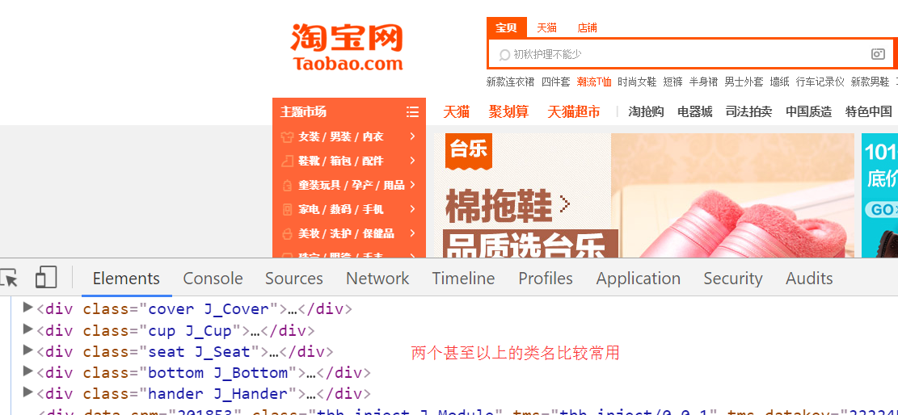
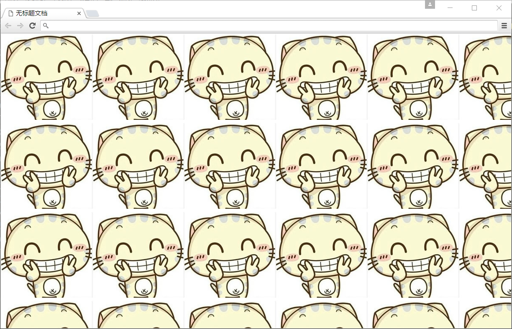
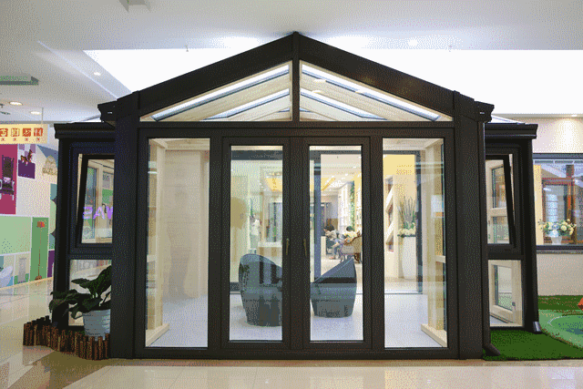
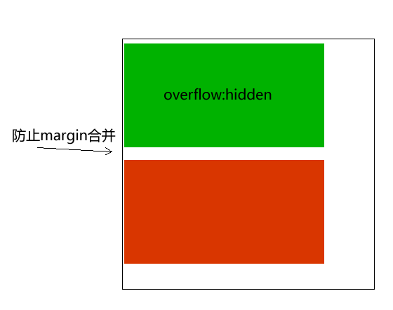

## CSS初识

CSS(Cascading Style Sheets)    美化样式

CSS通常称为CSS样式表或层叠样式表（级联样式表），主要用于设置HTML页面中的文本内容（字体、大小、对齐方式等）、图片的外形（宽高、边框样式、边距等）以及版面的布局等外观显示样式。

CSS以HTML为基础，提供了丰富的功能，如字体、颜色、背景的控制及整体排版等，而且还可以针对不同的浏览器设置不同的样式。

## CSS引入方式（四种）

### 内部样式表(嵌入式)

将CSS样式表放到head中用`<style>`标签包裹起来

基本语法格式如下：

```html
<head>
    ...
    <style type="text/css">
        ...此处写CSS样式
    </style>
</head>
```

语法中，style标签一般位于head标签中title标签之后，也可以把他放在HTML文档的任何地方。

type="text/css"  在html5中可以省略， 写上也比较符合规范， 所以这个地方可以写也可以省略。

### 行内式（内联样式）

内联样式，又有人称行内样式、行间样式、内嵌样式。是通过标签的style属性来设置元素的样式，其基本语法格式如下：

```html
<标签名 style="属性1:属性值1; 属性2:属性值2; 属性3:属性值3;"> 内容 </标签名>
```

语法中style是标签的属性，实际上任何HTML标签都拥有style属性，用来设置行内式。其中属性和值的书写规范与CSS样式规则相同，行内式只对其所在的标签及嵌套在其中的子标签起作用。


### 外部样式表（外链式）

链接式引入：将一个独立的.css文件引入到HTML文件中，使用`<link>`标记写在`<head>`标记中。 链接式会以网页文件主体装载前装载CSS文件。

其基本语法格式如下：

```html
<head>
  <link href="CSS文件的路径"  rel="stylesheet" />
</head>
```

注意：  link 是个单标签!

该语法中，link标签需要放在head头部标签中，并且必须指定link标签的三个属性，具体如下：

```
href：定义所链接外部样式表文件的URL，可以是相对路径，也可以是绝对路径。
type：定义所链接文档的类型，在这里需要指定为“text/css”，表示链接的外部文件为CSS样式表。
rel：定义当前文档与被链接文档之间的关系，在这里需要指定为“stylesheet”，表示被链接的文档是一个样式表文件。
```

### 导入方式

导入式：   将一个独立的.css文件引入HTML文件中，导入式使用@import 引入外部CSS文件，`<style>`标记也是写在`<head>`标记中。 导入式会在整个网页装载完后再装载CSS文件。

```html
<head>
    ...
    <style type="text/css">
        @import "My.css"; 此处注意.css文件的路径
    </style>
</head>
```


### 三种样式表总结（位置）

| 样式表     | 优点                     | 缺点                     | 使用情况       | 控制范围           |
| ---------- | ------------------------ | ------------------------ | -------------- | ------------------ |
| 行内样式表 | 书写方便，权重高         | 没有实现样式和结构相分离 | 较少           | 控制一个标签（少） |
| 内部样式表 | 部分结构和样式相分离     | 没有彻底分离             | 较多           | 控制一个页面（中） |
| 外部样式表 | 完全实现结构和样式相分离 | 需要引入                 | 最多，强烈推荐 | 控制整个站点（多） |

## CSS样式规则

使用HTML时，需要遵从一定的规范。CSS亦如此，要想熟练地使用CSS对网页进行修饰，首先需要了解CSS样式规则，具体格式如下：                                          


在上面的样式规则中:

1.选择器用于指定CSS样式作用的HTML对象，花括号内是对该对象设置的具体样式。
2.属性和属性值以“键值对”的形式出现。
3.属性是对指定的对象设置的样式属性，例如字体大小、文本颜色等。
4.属性和属性值之间用英文“:”连接。
5.多个“键值对”之间用英文“;”进行区分。
可以用段落 和 表格的对齐的演示。

## CSS基础选择器

### 标签选择器（元素选择器）

标签选择器是指用HTML标签名称作为选择器，按标签名称分类，为页面中某一类标签指定统一的CSS样式。

其基本语法格式如下：

```
标签名{属性1:属性值1; 属性2:属性值2; 属性3:属性值3; }  或者
元素名{属性1:属性值1; 属性2:属性值2; 属性3:属性值3; }
```

标签选择器最大的优点是能快速为页面中同类型的标签统一样式，同时这也是他的缺点，不能设计差异化样式。

### 类选择器

类选择器使用“.”（英文点号）进行标识，后面紧跟类名

其基本语法格式如下：

```
.类名{属性1:属性值1; 属性2:属性值2; 属性3:属性值3; }
```

类选择器最大的优势是可以为元素对象定义单独或相同的样式。 可以选择一个或者多个标签。

> 小技巧：
>
> 1.长名称或词组可以使用中横线来为选择器命名。
> 2.不建议使用“\_”下划线来命名CSS选择器。
> 浏览器兼容问题 (比如使用_tips的选择器命名，在IE6是无效的)
> 能良好区分JavaScript变量命名(js变量命名是用“\_”)
> 3.不要纯数字、中文等命名， 尽量使用英文字母来表示。

命名规范：  见附件（Web前端开发规范手册.doc）

命名是我们通俗约定的，但是没有规定必须用这些常用的命名。

### 多类名选择器

我们可以给标签指定多个类名，从而达到更多的选择目的。



> 注意：
>
> 1. 样式显示效果跟HTML元素中的类名先后顺序没有关系,受CSS样式书写的上下顺序有关。
> 2. 各个类名中间用空格隔开。

多类名选择器在后期布局比较复杂的情况下，还是较多使用的。

```html
<div class="pink fontWeight font20">亚瑟</div>
<div class="font20">刘备</div>
<div class="font14 pink">安其拉</div>
<div class="font14">貂蝉</div>
```

### id选择器

id选择器使用“#”进行标识，后面紧跟id名

其基本语法格式如下：

```
#id名{属性1:属性值1; 属性2:属性值2; 属性3:属性值3; }
```

该语法中，id名即为HTML元素的id属性值，大多数HTML元素都可以定义id属性，元素的id值是唯一的，只能对应于文档中某一个具体的元素。

用法基本和类选择器相同。

### id选择器和类选择器区别

W3C标准规定，在同一个页面内，不允许有相同名字的id对象出现，但是允许相同名字的class。

类选择器（class） 好比人的名字，  是可以多次重复使用的， 比如  张伟  王伟  李伟  李娜

id选择器     好比人的身份证号码，  全中国是唯一的， 不得重复。 只能使用一次。

**id选择器和类选择器最大的不同在于 使用次数上。**

### 通配符选择器

通配符   选择器用“*”号表示，他是所有选择器中作用范围最广的，能匹配页面中所有的元素。其基本语法格式如下：

```
* { 属性1:属性值1; 属性2:属性值2; 属性3:属性值3; }
```

例如下面的代码，使用通配符选择器定义CSS样式，清除所有HTML标记的默认边距。

```css
* {
  margin: 0;                    /* 定义外边距*/
  padding: 0;                   /* 定义内边距*/
}
```

## CSS字体属性(Font)

### font-size:字号参数

font-size属性用于设置字号，该属性的值可以使用相对长度单位，也可以使用绝对长度单位。其中，相对长度单位比较常用，推荐使用像素单位px，绝对长度单位使用较少。具体如下：


### font-family:字体名称

font-family属性用于设置字体。网页中常用的字体有宋体、微软雅黑、黑体等，例如将网页中所有段落文本的字体设置为微软雅黑，可以使用如下CSS样式代码：

```css
p{ font-family:"微软雅黑";}
```

可以同时指定多个字体，中间以逗号隔开，表示如果浏览器不支持第一个字体，则会尝试下一个，直到找到合适的字体。

> 注意：
>
> 1. 现在网页中普遍使用14px+。
> 2. 尽量使用偶数的数字字号。ie6等老式浏览器支持奇数会有bug。
> 3. 各种字体之间必须使用英文状态下的逗号隔开。
> 4. 中文字体需要加英文状态下的引号，英文字体一般不需要加引号。当需要设置英文字体时，英文字体名必须位于中文字体名之前。
> 5. 当字体名称包含两个以上分开的单词是，用“”把该字体名称括起来。例如font-family: "Times New Roman";。
> 6. 尽量使用系统默认字体，保证在任何用户的浏览器中都能正确显示。

### CSS Unicode字体

在 CSS 中设置字体名称，直接写中文是可以的。但是在文件编码（GB2312、UTF-8 等）不匹配时会产生乱码的错误。xp 系统不支持 类似微软雅黑的中文。

方案一： 你可以使用英文来替代。 比如 font-family:"Microsoft Yahei"。

方案二： 在 CSS 直接使用 Unicode 编码来写字体名称可以避免这些错误。使用 Unicode 写中文字体名称，浏览器是可以正确的解析的。
font-family: "\5FAE\8F6F\96C5\9ED1"，表示设置字体为“微软雅黑”。


可以通过escape()  来测试属于什么字体。

| 字体名称    | 英文名称        | Unicode 编码         |
| ----------- | --------------- | -------------------- |
| 宋体        | SimSun          | \5B8B\4F53           |
| 新宋体      | NSimSun         | \65B0\5B8B\4F53      |
| 黑体        | SimHei          | \9ED1\4F53           |
| 微软雅黑    | Microsoft YaHei | \5FAE\8F6F\96C5\9ED1 |
| 楷体_GB2312 | KaiTi_GB2312    | \6977\4F53_GB2312    |
| 隶书        | LiSu            | \96B6\4E66           |
| 幼园        | YouYuan         | \5E7C\5706           |
| 华文细黑    | STXihei         | \534E\6587\7EC6\9ED1 |
| 细明体      | MingLiU         | \7EC6\660E\4F53      |
| 新细明体    | PMingLiU        | \65B0\7EC6\660E\4F53 |

为了照顾不同电脑的字体安装问题，我们尽量只使用宋体和微软雅黑中文字体

### font-weight:字体粗细

字体加粗除了用 b  和 strong 标签之外，可以使用CSS 来实现，但是CSS 是没有语义的。

font-weight属性用于定义字体的粗细，

其可用属性值：

normal 默认值

bold 粗体

bolder 特粗体

lighter 细体

100~900（100的整数倍）

> 注意:
>
> 数字 400 等价于 normal，而 700 等价于 bold。  但是我们更喜欢用数字来表示。 

### font-style:倾斜字的名称

字体倾斜除了用 i  和 em 标签之外，可以使用CSS 来实现，但是CSS 是没有语义的。

font-style属性用于定义字体风格，如设置斜体、倾斜或正常字体。

可用属性值如下：

normal：默认值，浏览器会显示标准的字体样式。

italic：浏览器会显示斜体的字体样式。

oblique：浏览器会显示倾斜的字体样式。

> 注意：
>
> 平时我们很少给文字加斜体，反而喜欢给斜体标签（em，i）改为普通模式。

### font:综合设置字体样式 (重点)

在一个声明中设置所有字体属性

其基本语法格式如下：

```css
选择器{font: font-style  font-weight  font-size/line-height  font-family;}
```

使用font属性时，必须按上面语法格式中的顺序书写，不能更换顺序，各个属性以空格隔开。

注意：其中不需要设置的属性可以省略（取默认值），但必须保留font-size和font-family属性，否则font属性将不起作用。

## CSS文本属性(Text)

### color:文本颜色

color属性用于定义文本的颜色，其取值方式有如下3种：

1.颜色值为颜色名称的颜色，如red，green，blue等。

2.十六进制，如#FF0000，#FF6600，#29D794等。实际工作中，十六进制是最常用的定义颜色的方式。

3.RGB代码，如红色可以表示为rgb(255,0,0)或rgb(100%,0%,0%)。

需要注意的是，如果使用RGB代码的百分比颜色值，取值为0时也不能省略百分号，必须写为0%。如果三组数,每组都的两个数字都是一样的,可以省略写成一个.eg:#FF0000,写成#F00

### line-height:行高

line-height是行高，也可以定义行间距

line-height 与 font-size 的计算值之差（在 CSS 中成为“行间距”）分为两半，分别加到一个文本行内容的顶部和底部。可以包含这些内容的最小框就是行框。

line-height常用的属性值单位有三种，分别为像素px，相对值em和百分比%，实际工作中使用最多的是像素px

### text-align:水平对齐方式

用于设置文本内容的水平对齐，相当于html中的align对齐属性。

如果 direction 属性是 ltr，则默认值是 left；如果 direction 是 rtl，则为 right。

其可用属性值如下：

left：左对齐（默认值）

right：右对齐

center：居中对齐

是让盒子里面的内容水平居中， 而不是让盒子居中对齐

### text-indent:缩进距离

text-indent属性用于设置首行文本的缩进，其属性值可为不同单位的数值、em字符宽度的倍数、或相对于浏览器窗口宽度的百分比%，允许使用负值, 建议使用em作为设置单位。

1em 就是一个字的宽度   如果是汉字的段落， 1em 就是一个汉字的宽度

### text-decoration 文本的装饰

text-decoration   通常我们用于给链接修改装饰效果

| 值           | 描述                                          |
| ------------ | --------------------------------------------- |
| none         | 默认。定义标准的文本。                        |
| underline    | 定义文本下的一条线。下划线 也是我们链接自带的 |
| overline     | 定义文本上的一条线。                          |
| line-through | 定义穿过文本下的一条线。                      |
|              |                                               |

## CSS复合选择器

复合选择器是由两个或多个基础选择器，通过不同的方式组合而成的,目的是为了可以选择更准确更精细的目标元素标签。

### 交集选择器

交集选择器由两个选择器构成，其中第一个为标签选择器，第二个为class选择器，两个选择器之间不能有空格，如h3.special。


**记忆技巧：**

交集选择器 是 并且的意思。  即...又...的意思

```
比如：   p.one   选择的是： 类名为 .one  的 段落标签。  
```

用的相对来说比较少，不太建议使用。

### 并集选择器

并集选择器（CSS选择器分组）是各个选择器通过<strong style="color:#f00">逗号</strong>连接而成的，任何形式的选择器（包括标签选择器、class类选择器id选择器等），都可以作为并集选择器的一部分。如果某些选择器定义的样式完全相同，或部分相同，就可以利用并集选择器为它们定义相同的CSS样式。


记忆技巧：

并集选择器  和 的意思，  就是说，只要逗号隔开的，所有选择器都会执行后面样式。

```
比如  .one, p , #test {color: #F00;}  表示   .one 和 p  和 #test 这三个选择器都会执行颜色为红色。  通常用于集体声明。
```

### 后代选择器

后代选择器又称为包含选择器，用来选择元素或元素组的后代，其写法就是把外层标签写在前面，内层标签写在后面，中间用空格分隔。当标签发生嵌套时，内层标签就成为外层标签的后代。


子孙后代都可以这么选择。 或者说，它能选择任何包含在内 的标签。 

### 子元素选择器

子元素选择器只能选择作为某元素子元素的元素。其写法就是把父级标签写在前面，子级标签写在后面，中间跟一个 &gt; 进行连接，注意，符号左右两侧各保留一个空格。


白话：  这里的子 指的是 亲儿子  不包含孙子 重孙子之类。

```
 比如：  .demo > h3 {color: red;}   说明  h3 一定是demo 亲儿子。  demo 元素包含着h3。
```

### 伪类选择器

  伪类选择器用于向某些选择器添加特殊的效果。比如给链接添加特殊效果， 比如可以选择 第1个，第n个元素。

类  .one  

伪类 :link

#### 链接伪类选择器

- :link      /* 未访问的链接 */
- :visited   /* 已访问的链接 */
- :hover     /* 鼠标移动到链接上 */
- :active    /* 选定的链接 */

   注意:他们的顺序尽量不要颠倒  按照  lvha 的顺序。   love   hate  爱上了讨厌 记忆法    或者   lv 包包 非常 hao 

```css
a {   /* a是标签选择器  所有的链接 */
			font-weight: 700;
			font-size: 16px;
			color: gray;
		}
a:hover {   /* :hover 是链接伪类选择器 鼠标经过 */
			color: red; /*  鼠标经过的时候，由原来的 灰色 变成了红色 */
}
```


## CSS注释

```
CSS规则是使用     /*  需要注释的内容  */  进行注释的，即在需要注释的内容前使用 “/*” 标记开始注释，在内容的结尾使用 “*/”结束。
```

   例如：

```css
p {
  font-size: 14px;                 /* 所有的字体是14像素大小*/
}
```

## sublime快捷方式

sublime可以快速提高我们代码的书写方式

1. 生成标签 直接输入标签名 按tab键即可   比如  div   然后tab 键， 就可以生成 <div></div>
2. 如果想要生成多个相同标签  加上 * 就可以了 比如   div*3  就可以快速生成3个div
3. 如果有父子级关系的标签，可以用 >  比如   ul > li就可以了
4. 如果有兄弟关系的标签，用  +  就可以了 比如 div+p  
5. 如果生成带有类名或者id名字的，  直接写  .demo  或者  #two   tab 键就可以了

## 标签显示模式（display）

标签的类型(显示模式)

HTML标签一般分为块标签和行内标签两种类型，它们也称块元素和行内元素。具体如下：

### 块级元素(block-level)

每个块元素通常都会独自占据一整行或多整行，可以对其设置宽度、高度、对齐等属性，常用于网页布局和网页结构的搭建。 霸道

常见的块元素有`<h1>~<h6>、<p>、<div>、<ul>、<ol>、<li>`等，其中`<div>`标签是最典型的块元素。

  块级元素的特点：

（1）总是从新行开始

（2）高度，行高、外边距以及内边距都可以控制。

（3）宽度默认是容器的100%

（4）可以容纳内联元素和其他块元素。

### 行内元素(inline-level)

行内元素（内联元素）不占有独立的区域，仅仅靠自身的字体大小和图像尺寸来支撑结构，一般不可以设置宽度、高度、对齐等属性，常用于控制页面中文本的样式。

常见的行内元素有`<a>、<strong>、<b>、<em>、<i>、<del>、<s>、<ins>、<u>、<span>`等，其中`<span>`标签最典型的行内元素。

行内元素的特点：

（1）和相邻行内元素在一行上。

（2）高、宽无效，但水平方向的padding和margin可以设置，垂直方向的无效。

（3）默认宽度就是它本身内容的宽度。

（4）行内元素只能容纳文本或则其他行内元素。（a特殊 a里面可以放块级元素 ）

注意：

1. 只有 文字才 能组成段落  因此 p  里面不能放块级元素，同理还有这些标签h1,h2,h3,h4,h5,h6,dt，他们都是文字类块级标签，里面不能放其他块级元素。
2. 链接里面不能再放链接。
3. a里面可以放块级元素

### 块级元素和行内元素区别

块级元素的特点：
（1）总是从新行开始
（2）高度，行高、外边距以及内边距都可以控制。
（3）宽度默认是容器的100%
（4）可以容纳内联元素和其他块元素。

行内元素的特点：
（1）和相邻行内元素在一行上。
（2）高、宽无效，但水平方向的padding和margin可以设置，垂直方向的无效。
（3）默认宽度就是它本身内容的宽度。
（4）行内元素只能容纳文本或则其他行内元素。

### 行内块元素（inline-block）

在行内元素中有几个特殊的标签——``、`<input />`、`<td>`，可以对它们设置宽高和对齐属性，有些资料可能会称它们为行内块元素。

行内块元素的特点：
（1）和相邻行内元素（行内块）在一行上,但是之间会有空白缝隙。
（2）默认宽度就是它本身内容的宽度。
（3）高度，行高、外边距以及内边距都可以控制。


### 标签显示模式转换 display

块转行内：display:inline;

行内转块：display:block;

块、行内元素转换为行内块： display: inline-block;

## CSS书写规范

### 空格规范

【强制】 选择器 与 { 之间必须包含空格。

示例： .selector { }

【强制】 属性名 与之后的 : 之间不允许包含空格， : 与 属性值 之间必须包含空格。

示例：

font-size: 12px;

### 选择器规范

【强制】 当一个 rule 包含多个 selector 时，每个选择器声明必须独占一行。

示例：

```css
/* good */
.post,
.page,
.comment {
    line-height: 1.5;
}


/* bad */
.post, .page, .comment {
    line-height: 1.5;
}
```

【建议】 选择器的嵌套层级应不大于 3 级，位置靠后的限定条件应尽可能精确。

示例：

```css
/* good */
#username input {}
.comment .avatar {}

/* bad */
.page .header .login #username input {}
.comment div * {}
```

### 属性规范

【强制】 属性定义必须另起一行。

示例：

```css
/* good */
.selector {
    margin: 0;
    padding: 0;
}

/* bad */
.selector { margin: 0; padding: 0; }

```

【强制】 属性定义后必须以分号结尾。

示例：

```css
/* good */
.selector {
    margin: 0;
}

/* bad */
.selector {
    margin: 0
}

```

## 行高的测量


行高我们利用最多的一个地方是： 可以让一行文本在盒子中垂直居中对齐。

做法就是： 文字的行高等于盒子的高度。

这里情况些许复杂，开始学习，我们可以先从简单地方入手学会。


上距离和下距离总是相等的，因此文字看上去是垂直居中的。

如果 行高 等 height 高度  文字会 垂直居中

如果行高 大于 高度   文字会 偏下 

如果行高小于高度   文字会  偏上 

例子:

```html
<style>
    * {
        padding: 0;
        margin: 0;
    }
    div {

        height: 200px;
        font-size: 16px;
        line-height: 0px;
        background-color: pink;
    }
    /*  为什么当行高变成0的时候，文字会落在上边框一半位置？
    行高:基线和基线的距离
    行间距=行高-字体大小
    行间距=(line-height)-(font-size)
    当字体大小为16px,行高也为16px时,
    行间距=16px-16px=0px,上下两行紧挨

    当字体大小为16px,行高为0px时,
    行间距=0px-16px=-16px,第一行文字是以盒子上边框为第一行的上一行的基线,
    第一行文字的上一行是虚拟的,假如有一行,上边框是这个虚拟行的基线.
    行间距为0,第一行和它的上一行基线0距离,也就是两行文字重叠.从整体看起来,所有行都在向上移动.
    */
</style>
</head>
<body>
    <div>行高的小例子 how old are you<br />
        行高变成0的时候 my english is good<br />
        测试 my english is good</div>

</body>
```

## CSS 三大特性

层叠 继承  优先级 是我们学习CSS 必须掌握的三个特性。

### CSS层叠性

所谓层叠性是指多种CSS样式的叠加。

是浏览器处理冲突的一个能力,如果一个属性通过两个相同选择器设置到同一个元素上，那么这个时候一个属性就会将另一个属性层叠掉

比如先给某个标签指定了内部文字颜色为红色，接着又指定了颜色为蓝色，此时出现一个标签指定了相同样式不同值的情况，这就是样式冲突。  就近原则

一般情况下，如果出现样式冲突，则会按照CSS书写的顺序，以最后的样式为准。

1. 样式冲突，遵循的原则是就近原则。 那个样式离着结构近，就执行那个样式。
2. 样式不冲突，不会层叠

### CSS继承性

所谓继承性是指书写CSS样式表时，子标签会继承父标签的某些样式，如文本颜色和字号。想要设置一个可继承的属性，只需将它应用于父元素即可。

简单的理解就是：  子承父业。

注意：

恰当地使用继承可以简化代码，降低CSS样式的复杂性。子元素可以继承父元素的样式（text-，font-，line-这些元素开头的都可以继承，以及color属性）

### CSS优先级

定义CSS样式时，经常出现两个或更多规则应用在同一元素上，这时就会出现优先级的问题。

在考虑权重时，初学者还需要注意一些特殊的情况，具体如下：

继承样式的权重为0。即在嵌套结构中，不管父元素样式的权重多大，被子元素继承时，他的权重都为0，也就是说子元素定义的样式会覆盖继承来的样式。

行内样式优先。应用style属性的元素，其行内样式的权重非常高，可以理解为远大于100。总之，他拥有比上面提高的选择器都大的优先级。

权重相同时，CSS遵循就近原则。也就是说靠近元素的样式具有最大的优先级，或者说排在最后的样式优先级最大。

CSS定义了一个!important命令，该命令被赋予最大的优先级。也就是说不管权重如何以及样式位置的远近，!important都具有最大优先级。


#### CSS特殊性（Specificity）

关于CSS权重，我们需要一套计算公式来去计算，这个就是 CSS Specificity，我们称为CSS 特性或称非凡性，它是一个衡量CSS值优先级的一个标准 具体规范入如下：

specificity用一个四位的数 字串(CSS2是三位)来表示，更像四个级别，值从左到右，左面的最大，一级大于一级，数位之间没有进制，级别之间不可超越。 

| 继承或者* 的贡献值           | 0,0,0,0  |
| ---------------------------- | -------- |
| 每个元素（标签）贡献值为     | 0,0,0,1  |
| 每个类，伪类贡献值为         | 0,0,1,0  |
| 每个ID贡献值为               | 0,1,0,0  |
| 每个行内样式贡献值           | 1,0,0,0  |
| 每个!important贡献值  重要的 | ∞ 无穷大 |

权重是可以叠加的

 比如的例子：

```
div ul  li   ------>      0,0,0,3

.nav ul li   ------>      0,0,1,2

a:hover      -----—>      0,0,1,1

.nav a       ------>      0,0,1,1   

#nav p       ----->       0,1,0,1
```

​    注意： 

1.数位之间没有进制 比如说： 0,0,0,5 + 0,0,0,5 =0,0,0,10 而不是 0,0, 1, 0， 所以不会存在10个div能赶上一个类选择器的情况。

1. 继承的 权重是 0  

总结优先级：

1. 使用了 !important声明的规则。

2. 内嵌在 HTML 元素的 style属性里面的声明。

3. 使用了 ID 选择器的规则。

4. 使用了类选择器、属性选择器、伪元素和伪类选择器的规则。

5. 使用了元素选择器的规则。

6. 只包含一个通用选择器的规则。

7. 同一类选择器则遵循就近原则。

总结：权重是优先级的算法，层叠是优先级的表现


## CSS 背景(background)

CSS 可以添加背景颜色和背景图片，以及来进行图片设置。

| 属性                                                        | 描述                                         |
| ----------------------------------------------------------- | -------------------------------------------- |
| background-image                                            | 背景图片地址                                 |
| background-repeat                                           | 是否平铺                                     |
| background-position                                         | 背景位置                                     |
| background-attachment                                       | 背景固定还是滚动                             |
| background-color                                            | 背景颜色                                     |
| background:背景颜色 背景图片地址 背景平铺 背景滚动 背景位置 | 简写属性，作用是将背景属性设置在一个声明中。 |

### background-image

语法： 

```css
background-image : none | url('URL')
```

参数： 

none : 　无背景图（默认的）
url : 　使用绝对或相对地址指定背景图像 

background-image 属性允许指定一个图片展示在背景中（只有CSS3才可以多背景）可以和 background-color 连用。 如果图片不重复地话，图片覆盖不到地地方都会被背景色填充。 如果有背景图片平铺，则会覆盖背景颜色。

小技巧：  我们提倡背景图片后面的地址，url不要加引号。

### background-repeat

语法： 

```css
background-repeat : repeat | no-repeat | repeat-x | repeat-y 
```

参数： 

repeat : 　背景图像在纵向和横向上平铺（默认的）

no-repeat : 　背景图像不平铺

repeat-x : 　背景图像在横向上平铺

repeat-y : 　背景图像在纵向平铺 

设置背景图片时，默认把图片在水平和垂直方向平铺以铺满整个元素。

repeat-x : 　背景图像在横向上平铺  


repeat-y : 　背景图像在纵向平铺 


设置背景图片时，默认把图片在水平和垂直方向平铺以铺满整个元素。



### background-position

语法： 

```css
background-position : length || length

background-position : position || position 
```

参数： 

length : 　百分数 | 由浮点数字和单位标识符组成的长度值。请参阅长度单位 
position : 　top | center | bottom | left | center | right 

说明： 

设置或检索对象的背景图像位置。必须先指定background-image属性。默认值为：(0% 0%)。
如果只指定了一个值，该值将用于横坐标。纵坐标将默认为50%。第二个值将用于纵坐标。

注意：

1. position 后面是x坐标和y坐标。 可以使用方位名词或者 精确单位。
2. 如果和精确单位和方位名字混合使用，则必须是x坐标在前，y坐标后面。比如 background-position: 15px top;   则 15px 一定是  x坐标   top是 y坐标。

实际工作用的最多的，就是背景图片居中对齐了。

### background-attachment

语法： 

```css
background-attachment : scroll | fixed 
```

参数： 

scroll : 　背景图像是随对象内容滚动
fixed : 　背景图像固定 

说明： 

设置或检索背景图像是随对象内容滚动还是固定的。

### background

background属性的值的书写顺序官方并没有强制标准的。为了可读性，建议大家如下写：

background:背景颜色 背景图片地址 背景平铺 背景滚动 背景位置

```css
background: transparent url(image.jpg) repeat-y  scroll 50% 0 ;
```

### 背景透明(CSS3)

CSS3支持背景半透明的写法语法格式是:

```css
background: rgba(0,0,0,0.3);
```

 最后一个参数是alpha 透明度  取值范围 0~1之间

 注意：  背景半透明是指盒子背景半透明， 盒子里面的内容不收影响。

## 盒子模型（CSS重点）

CSS三大模块：  盒子模型 、 浮动 、 定位，其余的都是细节。

所谓盒子模型就是把HTML页面中的元素看作是一个矩形的盒子，也就是一个盛装内容的容器。每个矩形都由元素的内容、内边距（padding）、边框（border）和外边距（margin）组成。

### 看透网页布局的本质

看透网页布局的本质：  把网页元素比如文字图片等等，放入盒子里面，然后利用CSS摆放盒子的过程，就是网页布局。


CSS 其实没有太多逻辑可言 ， 类似我们小时候玩的积木,我们可以自由的，随意的摆放出我们想要的效果。

### 盒子模型（Box Model）

这里略过 老旧的ie盒子模型（IE6以下）


所有的文档元素（标签）都会生成一个矩形框，我们成为元素框（element box），它描述了一个文档元素再网页布局汇总所占的位置大小。因此，<strong style="color: #f00;">每个盒子除了有自己大小和位置外，还影响着其他盒子的大小和位置。</strong>


### 盒子边框（border）

语法： 

```css
border : border-width || border-style || border-color 
```

边框属性—设置边框样式（border-style）

边框样式用于定义页面中边框的风格，常用属性值如下：

```
none：没有边框即忽略所有边框的宽度（默认值）

solid：边框为单实线(最为常用的)

dashed：边框为虚线  

dotted：边框为点线

double：边框为双实线

```

#### 盒子边框写法总结表

|              |                                                              |                                                              |
| ------------ | ------------------------------------------------------------ | ------------------------------------------------------------ |
| 设置内容     | 样式属性                                                     | 常用属性值                                                   |
| 上边框       | border-top-style:样式; border-top-width:宽度;border-top-color:颜色;border-top:宽度 样式 颜色; |                                                              |
| 下边框       | border-bottom-style:样式;border- bottom-width:宽度;border- bottom-color:颜色;border-bottom:宽度 样式 颜色; |                                                              |
| 左边框       | border-left-style:样式; border-left-width:宽度;border-left-color:颜色;border-left:宽度 样式 颜色; |                                                              |
| 右边框       | border-right-style:样式;border-right-width:宽度;border-right-color:颜色;border-right:宽度 样式 颜色; |                                                              |
| 样式综合设置 | border-style:上边 [右边 下边 左边];                          | none无（默认）、solid单实线、dashed虚线、dotted点线、double双实线 |
| 宽度综合设置 | border-width:上边 [右边 下边 左边];                          | 像素值                                                       |
| 颜色综合设置 | border-color:上边 [右边 下边 左边];                          | 颜色值、#十六进制、rgb(r,g,b)、rgb(r%,g%,b%)                 |
| 边框综合设置 | border:四边宽度 四边样式 四边颜色;                           |                                                              |

```css
border-top: 1px solid red; /*上边框*/
border-bottom: 2px solid green; /*下边框*/
border-left: 1px solid blue;
border-right: 5px solid pink;

border: 1px solid red;
```

#### 表格的细线边框

以前学过的html表格边框很粗，这里只需要CSS一句话就可以美观起来。

table{ border-collapse:collapse; }  collapse 单词是合并的意思

border-collapse:collapse; 表示相邻边框合并在一起。

### 内边距（padding）

padding属性用于设置内边距。  是指 边框与内容之间的距离。

padding-top:上内边距

padding-right:右内边距

padding-bottom:下内边距

padding-left:左内边距

注意：  后面跟几个数值表示的意思是不一样的。

| 值的个数 | 表达意思                                                     |
| -------- | ------------------------------------------------------------ |
| 1个值    | padding：上下左右边距 比如padding: 3px; 表示上下左右都是3像素 |
| 2个值    | padding: 上下边距 左右边距 比如 padding: 3px 5px; 表示 上下3像素 左右 5像素 |
| 3个值    | padding：上边距 左右边距 下边距 比如 padding: 3px 5px 10px; 表示 上是3像素 左右是5像素 下是10像素 |
| 4个值    | padding:上内边距 右内边距 下内边距 左内边距 比如: padding: 3px 5px 10px 15px; 表示 上3px 右是5px 下 10px 左15px 顺时针 |

### 外边距（margin）

margin属性用于设置外边距。  设置外边距会在元素之间创建“空白”， 这段空白通常不能放置其他内容。

margin-top:上外边距

margin-right:右外边距

margin-bottom:下外边距

margin-left:上外边距

margin:上外边距 右外边距  下外边距  左外边

取值顺序跟内边距相同。

#### 外边距实现盒子水平居中

可以让一个盒子实现水平居中，需要满足以下两个条件：

1. 必须是块级元素。     
2. 盒子必须指定了宽度（width）

然后就给**左右的外边距都设置为auto**，就可使块级元素水平居中。

实际工作中常用这种方式进行网页布局，示例代码如下：

```css
.header{ width:960px; margin:0 auto;}
```

#### 文字盒子居中

1. 文字水平居中是  text-align: center
2. 盒子水平居中  左右margin 改为 auto 

```css
text-align: center; /*  文字居中水平 */
margin: 10px auto;  /* 盒子水平居中  左右margin 改为 auto 就阔以了 */
```

#### 图片和背景区别

1. 插入图片 我们用的最多 比如产品展示类
2. 背景图片我们一般用于小图标背景 或者 超大背景图片

```css
section img {
    width: 200px;/* 插入图片更改大小 width 和 height */
    height: 210px;
    margin-top: 30px;  /* 插入图片更改位置 可以用margin 或padding  盒模型 */
    margin-left: 50px; /* 插入当图片也是一个盒子 */
}

aside {
    width: 400px;
    height: 400px;
    border: 1px solid purple;
    background: #fff url(images/sun.jpg) no-repeat;

    background-size: 200px 210px; /*  背景图片更改大小只能用 background-size */
    background-position: 30px 50px; /* 背景图片更该位置 我用 background-position */
}
```

#### 清除元素的默认内外边距

为了更方便地控制网页中的元素，制作网页时，可使用如下代码清除元素的默认内外边距： 

```css
* {
   padding:0;         /* 清除内边距 */
   margin:0;          /* 清除外边距 */
}
```

注意：  行内元素是只有左右外边距的，是没有上下外边距的。 内边距，在ie6等低版本浏览器也会有问题。

我们尽量不要给行内元素指定上下的内外边距就好了。

## 外边距合并

使用margin定义块元素的垂直外边距时，可能会出现外边距的合并。

### 相邻块元素垂直外边距的合并

当上下相邻的两个块元素相遇时，如果上面的元素有下外边距margin-bottom，下面的元素有上外边距margin-top，则他们之间的垂直间距不是margin-bottom与margin-top之和，而是两者中的较大者。这种现象被称为相邻块元素垂直外边距的合并（也称外边距塌陷）。


解决方案：  避免就好了。

### 嵌套块元素垂直外边距的合并

对于两个嵌套关系的块元素，如果父元素没有上内边距及边框，则父元素的上外边距会与子元素的上外边距发生合并，合并后的外边距为两者中的较大者，即使父元素的上外边距为0，也会发生合并。


解决方案：

1. 可以为父元素定义1像素的上边框或上内边距。
2. 可以为父元素添加overflow:hidden。

### content宽度和高度

使用宽度属性width和高度属性height可以对盒子的大小进行控制。

width和height的属性值可以为不同单位的数值或相对于父元素的百分比%，实际工作中最常用的是像素值。

大多数浏览器，如Firefox、IE6及以上版本都采用了W3C规范，符合CSS规范的盒子模型的总宽度和总高度的计算原则是：

```
/*外盒尺寸计算（元素空间尺寸）*/
Element空间高度 = content height + padding + border + margin
Element 空间宽度 = content width + padding + border + margin
/*内盒尺寸计算（元素实际大小）*/
Element Height = content height + padding + border （Height为内容高度）
Element Width = content width + padding + border （Width为内容宽度）
```

注意：

1、宽度属性width和高度属性height仅适用于块级元素，对行内元素无效（ img 标签和 input除外）。

2、计算盒子模型的总高度时，还应考虑上下两个盒子垂直外边距合并的情况。

3、**如果一个盒子会和父亲一样宽 占满父亲的宽度， 如果此盒子没有给定宽度 则padding 不会影响本盒子大小**。

### 盒子模型布局稳定性

开始学习盒子模型，同学们最大的困惑就是， 分不清内外边距的使用，什么情况下使用内边距，什么情况下使用外边距？

答案是：  其实他们大部分情况下是可以混用的。  就是说，你用内边距也可以，用外边距也可以。 你觉得哪个方便，就用哪个。

但是，总有一个最好用的吧，我们根据稳定性来分，建议如下：

按照 优先使用  宽度 （width）  其次 使用内边距（padding）    再次  外边距（margin）。   

`width  >  padding  >  margin   `

原因：

1. margin 会有外边距合并 还有 ie6下面margin 加倍的bug（讨厌）所以最后使用。
2. padding  会影响盒子大小， 需要进行加减计算（麻烦） 其次使用。
3. width   没有问题,我们经常使用宽度剩余法 高度剩余法来做。

### 圆角边框(CSS3)

从此以后，我们的世界不只有矩形。radius 半径（距离）

语法格式：

```css
border-radius: 50%;   让一个正方形  变成圆圈
```

### 盒子阴影(CSS3)

语法格式：

```css
box-shadow:水平阴影 垂直阴影 模糊距离（虚实）  阴影尺寸（影子大小）  阴影颜色  内/外阴影；
```


1. 前两个属性是必须写的。其余的可以省略。
2. 外阴影 (outset) 但是不能写    默认      想要内阴影  inset 

```css
div {
    width: 200px;
    height: 200px;
    border: 10px solid red;
    /* box-shadow: 5px 5px 3px 4px rgba(0, 0, 0, .4);  */
    /* box-shadow:水平位置 垂直位置 模糊距离 阴影尺寸（影子大小） 阴影颜色  内/外阴影； */
    box-shadow: 0 15px 30px  rgba(0, 0, 0, .4);

}
```

## 浮动(float)

### 普通流(normal flow)

这个单词很多人翻译为 文档流 ， 字面翻译  普通流 或者标准流都可以。

前面我们说过，网页布局的核心，就是用CSS来摆放盒子位置。如何把盒子摆放到合适的位置？  

CSS的定位机制有3种：普通流（标准流）、浮动和定位。

html语言当中另外一个相当重要的概念----------标准流！或者普通流。普通流实际上就是一个网页内标签元素正常从上到下，从左到右排列顺序的意思，比如块级元素会独占一行，行内元素会按顺序依次前后排列；按照这种大前提的布局排列之下绝对不会出现例外的情况叫做普通流布局。

### 浮动(float)

浮动最早是用来控制图片，以便达到其他元素（特别是文字）实现“环绕”图片的效果。


后来，我们发现浮动有个很有意思的事情：就是让任何盒子可以一行排列,因此我们就慢慢的偏离主题，用浮动的特性来布局了。（CSS3已经我们真正意义上的网页布局，具体CSS3我们会详细解释）


### 什么是浮动

元素的浮动是指设置了浮动属性的元素会脱离标准标准流的控制，移动到其父元素中指定位置的过程。

在CSS中，通过float属性来定义浮动，其基本语法格式如下：

`选择器{float:属性值;}`

| 属性值 | 描述                 |
| ------ | -------------------- |
| left   | 元素向左浮动         |
| right  | 元素向右浮动         |
| none   | 元素不浮动（默认值） |

### 浮动详细内幕特性

浮动脱离标准流，====脱标==== 不占位置，会影响标准流。浮动只有左右浮动。

1. 浮动首先创建包含块的概念（包裹）。就是说， 浮动的元素总是找理它最近的父级元素对齐。但是不会超出内边距的范围。 

    


2.一个父盒子里面的子盒子，如果其中一个子级有浮动的，则其他子级都需要浮动。这样才能一行对齐显示。

3.元素添加浮动后，元素会具有行内块元素的特性。元素的大小完全取决于定义的大小或者默认的内容多少浮动根据元素书写的位置来显示相应的浮动。


总结：

浮动的目的就是为了让多个块级元素同一行上显示。  最核心的关键点就是   怎么排列的， 是否占有位置

float      浮 漏 特   

浮：    加了浮动的元素盒子是浮起来的，漂浮在其他的标准流盒子上面。
漏：    加了浮动的盒子，不占位置的，它浮起来了，它原来的位置漏 给了标准流的盒子。
特：    特别注意，首先浮动的盒子需要和标准流的父级搭配使用， 其次 特别的注意浮动可以使元素显示模式体现为行内块特性。

## 版心和布局流程

阅读报纸时容易发现，虽然报纸中的内容很多，但是经过合理地排版，版面依然清晰、易读。同样，在制作网页时，要想使页面结构清晰、有条理，也需要对网页进行“排版”。

“版心”(可视区) 是指网页中主体内容所在的区域。一般在浏览器窗口中水平居中显示，常见的宽度值为960px、980px、1000px、1200px等。

### 布局流程

为了提高网页制作的效率，布局时通常需要遵守一定的布局流程，具体如下：

1、确定页面的版心（可视区）。

2、分析页面中的行模块，以及每个行模块中的列模块。

3、制作HTML结构 。

4、CSS初始化，然后开始运用盒子模型的原理，通过DIV+CSS布局来控制网页的各个模块。

一列固定宽度且居中


### 两列左窄右宽型


比如小米    <a href="http://www.mi.com" target="_blank"> 小米官网 </a>

### 通栏平均分布型


比如锤子    <a href="http://www.smartisan.com/" target="_blank"> 锤子官网 </a>

## 清除浮动

### 为什么要清除浮动

我们前面说过，浮动本质是用来做一些文字混排效果的，但是被我们拿来做布局用，则会有很多的问题出现， 但是，你不能说浮动不好

由于浮动元素不再占用原文档流的位置，所以它会对后面的元素排版产生影响，为了解决这些问题，此时就需要在该元素中清除浮动。

准确地说，并不是清除浮动，而是**清除浮动后造成的影响**

### 清除浮动本质

清除浮动主要为了解决父级元素因为子级浮动引起内部高度为0 的问题。


### 清除浮动的方法

其实本质叫做闭合浮动更好一些, 记住，清除浮动就是把浮动的盒子圈到里面，让父盒子闭合出口和入口不让他们出来影响其他元素。

在CSS中，clear属性用于清除浮动，其基本语法格式如下：

`选择器{clear:both;}`

| 属性值 | 描述                                       |
| ------ | ------------------------------------------ |
| left   | 不允许左侧有浮动元素（清除左侧浮动的影响） |
| right  | 不允许右侧有浮动元素（清除右侧浮动的影响） |
| both   | 同时清除左右两侧浮动的影响                 |

#### 额外标签法

额外标签法是W3C推荐的做法是通过在浮动元素末尾添加一个空的标签

例如 

`<div style="clear:both"></div>`，或者其他标签br等亦可。

优点： 通俗易懂，书写方便

缺点： 添加许多无意义的标签，结构化较差。

#### 父级添加overflow属性方法

可以通过触发BFC的方式，可以实现清除浮动效果。

可以给父级添加： `overflow为 hidden|auto|scroll`  都可以实现。

优点：  代码简洁

缺点：  内容增多时候容易造成不会自动换行导致内容被隐藏掉，无法显示需要溢出的元素。

#### 使用after伪元素清除浮动

**:after 方式为额外标签法的升级版，好处是不用单独加标签了** 

使用方法：

```css
.clearfix:after {  content: ""; display: block; height: 0; clear: both; visibility: hidden;  }   

.clearfix {*zoom: 1;}   /* IE6、7 专有 */
```

优点： 符合闭合浮动思想  结构语义化正确

缺点： 由于IE6-7不支持:after，使用 zoom:1触发 hasLayout。

代表网站： 百度、淘宝网、网易等


注意： content:""   尽量不带点

#### 使用before和after双伪元素清除浮动

使用方法：

```css
.clearfix:before,.clearfix:after { 
    content:"";
    display:table;  /* 这句话可以出发BFC BFC可以清除浮动,BFC我们后面讲 */
}
.clearfix:after {
    clear:both;
}
.clearfix {
    *zoom:1;
}
```

优点：  代码更简洁

缺点：  由于IE6-7不支持:after，使用 zoom:1触发 hasLayout。

代表网站： 小米、腾讯等

##  定位(position)

background-position   背景定位

### 元素的定位属性

元素的定位属性主要包括定位模式和边偏移两部分。

1、边偏移

| 边偏移属性 | 描述                                           |
| ---------- | ---------------------------------------------- |
| top        | 顶端偏移量，定义元素相对于其父元素上边线的距离 |
| bottom     | 底部偏移量，定义元素相对于其父元素下边线的距离 |
| left       | 左侧偏移量，定义元素相对于其父元素左边线的距离 |
| right      | 右侧偏移量，定义元素相对于其父元素右边线的距离 |

2、定位模式(定位的分类)

在CSS中，position属性用于定义元素的定位模式，其基本语法格式如下：

`选择器{position:属性值;}`

position属性的常用值

| 值       | 描述                                             |
| -------- | ------------------------------------------------ |
| static   | 自动定位（默认定位方式）                         |
| relative | 相对定位，相对于其原文档流的位置进行定位         |
| absolute | 绝对定位，相对于其上一个已经定位的父元素进行定位 |
| fixed    | 固定定位，相对于浏览器窗口进行定位               |

### 静态定位(static)

静态定位是所有元素的默认定位方式，当position属性的取值为static时，可以将元素定位于静态位置。 所谓静态位置就是各个元素在HTML文档流中默认的位置。

在静态定位状态下，无法通过边偏移属性（top、bottom、left或right）来改变元素的位置。

静态定位唯一的用处：  就是 取消定位。 

### 相对定位relative(自恋型)

相对定位是将元素相对于它在标准流中的位置进行定位，当position属性的取值为relative时，可以将元素定位于相对位置。

对元素设置相对定位后，可以通过边偏移属性改变元素的位置，但是它在文档流中的位置仍然保留。如下图所示，即是一个相对定位的效果展示：


注意：   

1. 相对定位最重要的一点是，它可以通过边偏移移动位置，但是原来的所占的位置，继续占有。
2. 其次，每次移动的位置，是以自己的左上角为基点移动（相对于自己来移动位置）

就是说，相对定位的盒子仍在标准流中，它后面的盒子仍以标准流方式对待它。（相对定位不脱标）

如果说浮动的主要目的是 让多个块级元素一行显示，那么定位的主要价值就是 移动位置，让盒子到我们想要的位置上去。

### 绝对定位absolute (拼爹型)

当position属性的取值为absolute时，可以将元素的定位模式设置为绝对定位。

注意：

如果文档可滚动，绝对定位元素会随着它滚动，因为元素最终会相对于正常流的某一部分定位。

绝对定位最重要的一点是，它可以通过边偏移移动位置，但是它完全脱标，完全不占位置。

#### 父级没有定位

若所有父元素都没有定位，以浏览器当前屏幕为准对齐(document文档)。


#### 父级有定位

绝对定位是将元素依据最近的已经定位（绝对、固定或相对定位）的父元素（祖先）进行定位。 


#### 子绝父相

这句话的意思是 子级是绝对定位的话， 父级要用相对定位。

首先， 我们说下， 绝对定位是将元素依据最近的已经定位绝对、固定或相对定位）的父元素（祖先）进行定位。

就是说， 子级是绝对定位，父亲只要是定位即可（不管父亲是绝对定位还是相对定位，甚至是固定定位都可以），就是说， 子绝父绝，子绝父相都是正确的。

但是，在我们网页布局的时候， 最常说的 子绝父相是怎么来的呢？ 请看如下图：


所以，我们可以得出如下结论：

因为子级是绝对定位，不会占有位置，可以放到父盒子里面的任何一个地方。

父盒子布局时，需要占有位置，因此父亲只能是 相对定位. 

### 固定定位fixed(认死理型)

固定定位是绝对定位的一种特殊形式，类似于 正方形是一个特殊的 矩形。它以浏览器窗口作为参照物来定义网页元素。当position属性的取值为fixed时，即可将元素的定位模式设置为固定定位。

当对元素设置固定定位后，它将脱离标准文档流的控制，始终依据浏览器窗口来定义自己的显示位置。不管浏览器滚动条如何滚动也不管浏览器窗口的大小如何变化，该元素都会始终显示在浏览器窗口的固定位置。

固定定位有两点：

1. 固定定位的元素跟父亲没有任何关系，只认浏览器。
2. 固定定位完全脱标，不占有位置，不随着滚动条滚动。

ie6等低版本浏览器不支持固定定位。

### 叠放次序（z-index）

当对多个元素同时设置定位时，定位元素之间有可能会发生重叠。


在CSS中，要想调整重叠定位元素的堆叠顺序，可以对定位元素应用z-index层叠等级属性，其取值可为正整数、负整数和0。

比如：  z-index: 2;

注意：

1. z-index的默认属性值是0，取值越大，定位元素在层叠元素中越居上。
2. 如果取值相同，则根据书写顺序，后来居上。
3. 后面数字一定不能加单位。
4. 只有相对定位，绝对定位，固定定位有此属性，其余标准流，浮动，静态定位都无此属性，亦不可指定此属性。

## 四种定位总结

| 定位模式         | 是否脱标占有位置     | 是否可以使用边偏移 | 移动位置基准                     |
| ---------------- | -------------------- | ------------------ | -------------------------------- |
| 静态static       | 不脱标，正常模式     | 不可以             | 正常模式                         |
| 相对定位relative | 脱标，占有位置       | 可以               | 相对自身位置移动（自恋型）       |
| 绝对定位absolute | 完全脱标，不占有位置 | 可以               | 相对于定位父级移动位置（拼爹型） |
| 固定定位fixed    | 完全脱标，不占有位置 | 可以               | 相对于浏览器移动位置（认死理型） |

## 定位模式转换

跟 浮动一样， 元素添加了 绝对定位和固定定位之后， 元素模式也会发生转换， 都转换为 行内块模式， 

行内块 的宽度和高度 跟内容有关系.

**因此 比如 行内元素 如果添加了 绝对定位或者 固定定位后 浮动后，可以不用转换模式，直接给高度和宽度就可以了**

## CSS高级技巧

### 元素的显示与隐藏

在CSS中有三个显示和隐藏的单词比较常见，我们要区分开，他们分别是 display visibility 和 overflow。

#### display 显示

display 设置或检索对象是否及如何显示。

display : none 隐藏对象 与它相反的是 display:block 除了转换为块级元素之外，同时还有显示元素的意思。

特点： 隐藏之后，不再保留位置。

#### visibility 可见性

设置或检索是否显示对象。

visible : 　对象可视

hidden : 　对象隐藏

特点： 隐藏之后，继续保留原有位置。

#### overflow 溢出

检索或设置当对象的内容超过其指定高度及宽度时如何管理内容。

visible : 　不剪切内容也不添加滚动条。

auto : 　 超出自动显示滚动条，不超出不显示滚动条

hidden : 　不显示超过对象尺寸的内容，超出的部分隐藏掉

scroll : 　不管超出内容否，总是显示滚动条

### CSS用户界面样式

所谓的界面样式，就是更改一些用户操作样式， 比如 更改用户的鼠标样式， 表单轮廓等。但是比如滚动条的样式改动受到了很多浏览器的抵制，因此我们就放弃了。 防止表单域拖拽

#### 鼠标样式cursor

 设置或检索在对象上移动的鼠标指针采用何种系统预定义的光标形状。 

```html
cursor :  default  小白 | pointer  小手  | move  移动  |  text  文本
```

 鼠标放我身上查看效果哦：

```html
<ul>
    <li style="cursor:default">我是小白</li>
    <li style="cursor:pointer">我是小手</li>
    <li style="cursor:move">我是移动</li>
    <li style="cursor:text">我是文本</li>
</ul>
```

 尽量不要用hand  因为 火狐不支持     pointer ie6以上都支持的尽量用

#### 轮廓 outline

 是绘制于元素周围的一条线，位于边框边缘的外围，可起到突出元素的作用。

```css
outline : outline-color ||outline-style || outline-width 
```

但是我们都不关心可以设置多少，我们平时都是去掉的。

最直接的写法是 ：  outline: 0;   或者  outline: none;

```html
<input  type="text"  style="outline: 0;"/>
```

#### 防止拖拽文本域resize

`resize：none`    这个单词可以防止 火狐 谷歌等浏览器随意的拖动 文本域。

右下角可以拖拽： 

<textarea></textarea>
右下角不可以拖拽： 

```html
<textarea  style="resize: none;"></textarea>
```

### vertical-align 垂直对齐

以前我们讲过让带有宽度的块级元素居中对齐，是margin: 0 auto;

以前我们还讲过让文字居中对齐，是 text-align: center;

vertical-align 垂直对齐， 这个看上去很美好的一个属性， 实际有着不可捉摸的脾气。


```css
vertical-align : baseline |top |middle |bottom 
```

设置或检索对象内容的垂直对其方式。 

vertical-align 不影响块级元素中的内容对齐，它只针对于 行内元素或者行内块元素，特别是行内块元素， **通常用来控制图片/表单与文字的对齐**。


#### 图片、表单和文字对齐

所以我们知道，我们可以通过vertical-align 控制图片和文字的垂直关系了。 默认的图片会和文字基线对齐。

#### 去除图片底侧空白缝隙

有个很重要特性你要记住： 图片或者表单等行内块元素，他的底线会和父级盒子的基线对齐。这样会造成一个问题，就是图片底侧会有一个空白缝隙。

解决的方法就是：  

1. 给img vertical-align:middle | top等等。  让图片不要和基线对齐。
2. 
3. 给img 添加 display：block; 转换为块级元素就不会存在问题了。

## 溢出的文字隐藏

### white-space

white-space设置或检索对象内文本显示方式。通常我们使用于强制一行显示内容 

normal :默认处理方式
nowrap :强制在同一行内显示所有文本，直到文本结束或者遭遇br标签对象才换行。

可以处理中文

### text-overflow 文字溢出

`text-overflow : clip | ellipsis`

设置或检索是否使用一个省略标记（...）标示对象内文本的溢出

clip : 不显示省略标记（...），而是简单的裁切 

ellipsis :当对象内文本溢出时显示省略标记（...）

注意一定要首先强制一行内显示，再次和overflow属性  搭配使用

## CSS精灵技术（sprite）  雪碧图

### 精灵技术产生的背景


图所示为网页的请求原理图，当用户访问一个网站时，需要向服务器发送请求，网页上的每张图像都要经过一次请求才能展现给用户。

然而，一个网页中往往会应用很多小的背景图像作为修饰，当网页中的图像过多时，服务器就会频繁地接受和发送请求，这将大大降低页面的加载速度。为了有效地减少服务器接受和发送请求的次数，提高页面的加载速度，出现了CSS精灵技术（也称CSS Sprites、CSS雪碧）。

#### 精灵技术本质

简单地说，CSS精灵是一种处理网页背景图像的方式。它将一个页面涉及到的所有零星背景图像都集中到一张大图中去，然后将大图应用于网页，这样，当用户访问该页面时，只需向服务发送一次请求，网页中的背景图像即可全部展示出来。通常情况下，这个由很多小的背景图像合成的大图被称为精灵图（雪碧图），如下图所示为京东网站中的一个精灵图。


#### 精灵技术的使用

CSS 精灵其实是将网页中的一些背景图像整合到一张大图中（精灵图），然而，各个网页元素通常只需要精灵图中不同位置的某个小图，要想精确定位到精灵图中的某个小图，就需要使用CSS的background-image、background-repeat和background-position属性进行背景定位，其中最关键的是使用background-position属性精确地定位。

#### 制作精灵图

CSS 精灵其实是将网页中的一些背景图像整合到一张大图中（精灵图），那我们要做的，就是把小图拼合成一张大图。

大部分情况下，精灵图都是网页美工做。

我们精灵图上放的都是小的装饰性质的背景图片。 插入图片不能往上放。
我们精灵图的宽度取决于最宽的那个背景。
我们可以横向摆放也可以纵向摆放，但是每个图片之间，间隔至少隔开偶数像素合适。
在我们精灵图的最低端，留一片空隙，方便我们以后添加其他精灵图。

结束语：小公司，背景图片很少的情况，没有必要使用精灵技术，维护成本太高。 如果是背景图片比较多，可以建议使用精灵技术。

## 滑动门

先来体会下现实中的滑动门,或者你可以叫做推拉门：



### 滑动门出现的背景

制作网页时，为了美观，常常需要为网页元素设置特殊形状的背景，比如微信导航栏，有凸起和凹下去的感觉，最大的问题是里面的字数不一样多


为了使各种特殊形状的背景能够自适应元素中文本内容的多少，出现了CSS滑动门技术。它从新的角度构建页面，使各种特殊形状的背景能够自由拉伸滑动，以适应元素内部的文本内容，可用性更强。 最常见于各种导航栏的滑动门。

### 核心技术

核心技术就是利用CSS精灵（主要是背景位置）和盒子padding撑开宽度, 以便能适应不同字数的导航栏。

一般的经典布局都是这样的：

```html
<li>
    <a href="#">
        <span>导航栏内容</span>
    </a>
</li>
```

总结： 

1. a 设置 背景左侧，padding撑开合适宽度。    
2. span 设置背景右侧， padding撑开合适宽度 剩下由文字继续撑开宽度。
3. 之所以a包含span就是因为 整个导航都是可以点击的。

## web字体

### 字体格式

不同浏览器所支持的字体格式是不一样的，我们有必要了解一下有关字体格式的知识。

1、TureType(.ttf)格式

.ttf字体是Windows和Mac的最常见的字体，是一种RAW格式，支持这种字体的浏览器有IE9+、Firefox3.5+、Chrome4+、Safari3+、Opera10+、iOS Mobile、Safari4.2+；

2、OpenType(.otf)格式

.otf字体被认为是一种原始的字体格式，其内置在TureType的基础上，支持这种字体的浏览器有Firefox3.5+、Chrome4.0+、Safari3.1+、Opera10.0+、iOS Mobile、Safari4.2+；

3、Web Open Font Format(.woff)格式

woff字体是Web字体中最佳格式，他是一个开放的TrueType/OpenType的压缩版本，同时也支持元数据包的分离，支持这种字体的浏览器有IE9+、Firefox3.5+、Chrome6+、Safari3.6+、Opera11.1+；

4、Embedded Open Type(.eot)格式

.eot字体是IE专用字体，可以从TrueType创建此格式字体，支持这种字体的浏览器有IE4+；

5、SVG(.svg)格式

.svg字体是基于SVG字体渲染的一种格式，支持这种字体的浏览器有Chrome4+、Safari3.1+、Opera10.0+、iOS Mobile Safari3.2+；

了解了上面的知识后，我们就需要为不同的浏览器准备不同格式的字体，通常我们会通过字体生成工具帮我们生成各种格式的字体，因此无需过于在意字体格式间的区别差异。

## 字体图标

图片是有诸多优点的，但是缺点很明显，比如图片不但增加了总文件的大小，还增加了很多额外的"http请求"，这都会大大降低网页的性能的。更重要的是图片不能很好的进行“缩放”，因为图片放大和缩小会失真。 我们后面会学习移动端响应式，很多情况下希望我们的图标是可以缩放的。此时，一个非常重要的技术出现了，额不是出现了，是以前就有，是被重新"宠幸" 这就是字体图标（iconfont).

### 字体图标优点

可以做出跟图片一样可以做的事情,改变透明度、旋转度等
但是本质其实是文字，可以很随意的改变颜色、产生阴影、透明效果等等...
本身体积更小，但携带的信息并没有削减。
几乎支持所有的浏览器
移动端设备必备良药...

### 字体图标使用流程

总体来说，字体图标按照如下流程：


#### 设计字体图标

假如图标是我们公司单独设计，那就需要第一步了，这个属于UI设计人员的工作， 他们在 illustrator 或 Sketch 这类矢量图形软件里创建 icon图标， 比如下图：


之后保存为svg格式，然后给我们前端人员就好了。 

其实第一步，我们不需要关心，只需要给我们这些图标就可以了，如果图标是大众的，网上本来就有的，可以直接跳过第一步，进入第三步。

#### 上传生成字体包

   当UI设计人员给我们svg文件的时候，我们需要转换成我们页面能使用的字体文件， 而且需要生成的是兼容性的适合各个浏览器的。

​    推荐网站： http://icomoon.io

**icomoon字库**

IcoMoon成立于2011年，推出的第一个自定义图标字体生成器，它允许用户选择他们所需要的图标，使它们成一字型。 内容种类繁多，非常全面，唯一的遗憾是国外服务器，打开网速较慢。

   推荐网站： http://www.iconfont.cn/

**阿里icon font字库**

http://www.iconfont.cn/

这个是阿里妈妈M2UX的一个icon font字体图标字库，包含了淘宝图标库和阿里妈妈图标库。可以使用AI制作图标上传生成。 一个字，免费，免费！！

**fontello**

[http://fontello.com/](http://fontello.com/)

在线定制你自己的icon font字体图标字库，也可以直接从GitHub下载整个图标集，该项目也是开源的。

**Font-Awesome**

[http://fortawesome.github.io/Font-Awesome/](http://fortawesome.github.io/Font-Awesome/)

这是我最喜欢的字库之一了，更新比较快。目前已经有369个图标了。

**Glyphicon Halflings**

[http://glyphicons.com/](http://glyphicons.com/)

这个字体图标可以在Bootstrap下免费使用。自带了200多个图标。

**Icons8**

[https://icons8.com/](https://icons8.com/)

提供PNG免费下载，像素大能到500px


#### 下载兼容字体包

刚才上传完毕， 网站会给我们把UI做的svg图片转换为我们的字体格式， 然后下载下来就好了

当然，我们不需要自己专门的图标，是想网上找几个图标使用，以上2步可以直接省略了， 直接到刚才的网站上找喜欢的下载使用吧。


#### 字体引入到HTML

得到压缩包之后，最后一步，是最重要的一步了， 就是字体文件已经有了，我们需要引入到我们页面中。

1. 首先把 以下4个文件放入到 fonts文件夹里面。 通俗的做法

   

   ##### 第一步：在样式里面声明字体： 告诉别人我们自己定义的字体

   ```css
   @font-face {
       font-family: 'icomoon';
       src:  url('fonts/icomoon.eot?7kkyc2');
       src:  url('fonts/icomoon.eot?7kkyc2#iefix') format('embedded-opentype'),
           url('fonts/icomoon.ttf?7kkyc2') format('truetype'),
           url('fonts/icomoon.woff?7kkyc2') format('woff'),
           url('fonts/icomoon.svg?7kkyc2#icomoon') format('svg');
       font-weight: normal;
       font-style: normal;
   }
   ```

   ##### 第二步：给盒子使用字体

   ```css
   span {
       font-family: "icomoon";
   }
   ```

   ##### 第三步：盒子里面添加结构

   ```css
   span::before {
       content: "\e900";
   }
   或者  
   <span></span>  
   ```

   ### 追加新图标到原来库里面

   如果工作中，原来的字体图标不够用了，我们需要添加新的字体图标，但是原来的不能删除，继续使用，此时我们需要这样做

   把压缩包里面的selection.json 从新上传，然后，选中自己想要新的图标，从新下载压缩包，替换原来文件即可。

   

## BFC(块级格式化上下文)

BFC(Block formatting context)

直译为"块级格式化上下文"。

### 元素的显示模式

我们前面讲过 元素的显示模式 display。 

分为 块级元素   行内元素  行内块元素 ，其实，它还有很多其他显示模式。


### 那些元素会具有BFC的条件

不是所有的元素模式都能产生BFC，w3c 规范： 

display 属性为 block, list-item, table 的元素，会产生BFC.

大家有么有发现这个三个都是用来布局最为合理的元素，因为他们就是用来可视化布局。

注意其他的，display属性，比如 line 等等，他们创建的是 IFC ，我们暂且不研究。

这个BFC 有着具体的布局特性： 


有宽度和高度 ， 有 外边距margin  有内边距padding 有边框 border。


### 什么情况下可以让元素产生BFC

以上盒子具有BFC条件了，就是说有资质了，但是怎样触发才会产生BFC，从而创造这个封闭的环境呢？ 

在好比，你光有资质还不行，你需要一定额外效果才能出发的武学潜力，要么你掉到悬崖下面，捡到了一本九阴真经，要么你学习葵花宝典，欲练此功必先....


同样，要给这些元素添加如下属性就可以触发BFC。

-float属性不为none

-position为absolute或fixed

-display为inline-block, table-cell, table-caption, flex, inline-flex

-overflow不为visible。

### BFC元素所具有的特性

BFC布局规则特性：

1.在BFC中，盒子从顶端开始垂直地一个接一个地排列.

2.盒子垂直方向的距离由margin决定。属于同一个BFC的两个相邻盒子的margin会发生重叠

3.在BFC中，每一个盒子的左外边缘（margin-left）会触碰到容器的左边缘(border-left)（对于从右到左的格式来说，则触碰到右边缘）。

1. BFC的区域不会与浮动盒子产生交集，而是紧贴浮动边缘。
2. 计算BFC的高度时，自然也会检测浮动或者定位的盒子高度。

它是一个独立的渲染区域，只有Block-level box参与， 它规定了内部的Block-level Box如何布局，并且与这个区域外部毫不相干。

白话文： 孩子在家里愿意怎么折腾都行，但是出了家门口，你就的乖乖的，不能影响外面的任何人。

### BFC的主要用途

BFC能用来做什么？

(1) 清除元素内部浮动

只要把父元素设为BFC就可以清理子元素的浮动了，最常见的用法就是在父元素上设置overflow: hidden样式，对于IE6加上zoom:1就可以了。

主要用到 

```
计算BFC的高度时，自然也会检测浮动或者定位的盒子高度。

```


(2) 解决外边距合并问题

外边距合并的问题。

主要用到 

```
盒子垂直方向的距离由margin决定。属于同一个BFC的两个相邻盒子的margin会发生重叠

```

属于同一个BFC的两个相邻盒子的margin会发生重叠，那么我们创建不属于同一个BFC，就不会发生margin重叠了。



(3) 制作右侧自适应的盒子问题

主要用到 

普通流体元素BFC后，为了和浮动元素不产生任何交集，顺着浮动边缘形成自己的封闭上下文


### BFC 总结

BFC就是页面上的一个隔离的独立容器，容器里面的子元素不会影响到外面的元素。反之也如此。包括浮动，和外边距合并等等，因此，有了这个特性，我们布局的时候就不会出现意外情况了。

## 优雅降级和渐进增强

什么是渐进增强（progressive enhancement）、优雅降级（graceful degradation）呢？

渐进增强 progressive enhancement：

针对低版本浏览器进行构建页面，保证最基本的功能，然后再针对高级浏览器进行效果、交互等改进和追加功能达到更好的用户体验。

 类似 爬山，由低出往高处爬

  

  <b>优雅降级 graceful degradation：</b>

一开始就构建完整的功能，然后再针对低版本浏览器进行兼容。

类似蹦极，由高处往低处下落


区别：渐进增强是向上兼容，优雅降级是向下兼容。

个人建议： 现在互联网发展很快， 连微软公司都抛弃了ie浏览器，转而支持 edge这样的高版本浏览器，我们很多情况下没有必要再时刻想着低版本浏览器了，而是一开始就构建完整的效果，根据实际情况，修补低版本浏览器问题。

## 浏览器前缀

| 浏览器前缀 | 浏览器                                 |
| ---------- | -------------------------------------- |
| -webkit-   | Google Chrome, Safari, Android Browser |
| -moz-      | Firefox                                |
| -o-        | Opera                                  |
| -ms-       | Internet Explorer, Edge                |
| -khtml-    | Konqueror                              |


后面我们会有 常用的解决H5和C3 的兼容解决文件， 我们这里暂且不涉及。

## 背景渐变

在线性渐变过程中，颜色沿着一条直线过渡：从左侧到右侧、从右侧到左侧、从顶部到底部、从底部到顶部或着沿任何任意轴。如果你曾使用过制作图件，比如说Photoshop，你对线性渐变并不会陌生。

兼容性问题很严重，我们这里之讲解线性渐变

语法格式： 

```css
background:-webkit-linear-gradient(渐变的起始位置， 起始颜色， 结束颜色)；
```

```css
background:-webkit-linear-gradient(渐变的起始位置， 颜色 位置， 颜色位置....)；
```

## 背景缩放(CSS3)

通过background-size设置背景图片的尺寸，就像我们设置img的尺寸一样，在移动Web开发中做屏幕适配应用非常广泛。

其参数设置如下：

a) 可以设置长度单位(px)或百分比（设置百分比时，参照盒子的宽高）

b) 设置为cover时，会自动调整缩放比例，保证图片始终填充满背景区域，如有溢出部分则会被隐藏。我们平时用的cover 最多

c) 设置为contain会自动调整缩放比例，保证图片始终完整显示在背景区域。

```css
background-image: url('images/gyt.jpg');
			background-size: 300px 100px;
			/* background-size: contain; */
			/* background-size: cover; */
```

## 多背景(CSS3)

以逗号分隔可以设置多背景，可用于自适应布局  做法就是 用逗号隔开就好了。

- 一个元素可以设置多重背景图像。 
- 每组属性间使用逗号分隔。 
- 如果设置的多重背景图之间存在着交集（即存在着重叠关系），前面的背景图会覆盖在后面的背景图之上。
- 为了避免背景色将图像盖住，背景色通常都定义在最后一组上，

```css
background:url(test1.jpg) no-repeat scroll 10px 20px/50px 60px  ,
url(test1.jpg) no-repeat scroll 10px 20px/70px 90px ,
url(test1.jpg) no-repeat scroll 10px 20px/110px 130px c #aaa;
```

## css盒子模型

css盒子模型又称框模型(Box Model), 包含了元素内容(content), 内边距(padding), 边框(border), 外边距(margin)几个要素.


### box-sizing属性

box-sizing属性是用户界面属性里的一种

`box-sizing: content-box|padding-box|border-box|inherit`

- content-box: 默认值, 可以使设置的宽度和高度应用到元素的内容框. 盒子的width只包含内容

- border-box: 设置的width值其实是除margin之外的border+padding+element的总宽度.盒子的width包含border+padding+内容

即总宽度=margin+width

- inherit: 规定应从父元素继承box-sizing属性的值

关于border-box的使用:

一个box宽度为100%, 又想要两边有内边距, 这时候用就比较好

全局设置border-box很好, 首先它符合直觉, 其次它可以省去一次又一次的加加减减, 它还有一个关键作用--让有边框的盒子正常使用百分比宽度

## @import和link引入样式的区别

1. 从属关系区别

`@import`是 CSS 提供的语法规则，只有导入样式表的作用；`link`是HTML提供的标签，不仅可以加载 CSS 文件，还可以定义 RSS、rel 连接属性等。

2. 加载顺序区别

加载页面时，`link`标签引入的 CSS 被同时加载；`@import`引入的 CSS 将在页面加载完毕后被加载。

3. 兼容性区别

`@import`是 CSS2.1 才有的语法，故只可在 IE5+ 才能识别；`link`标签作为 HTML 元素，不存在兼容性问题。

4. DOM可控性区别

可以通过 JS 操作 DOM ，插入`link`标签来改变样式；由于DOM方法是基于文档的，无法使用`@import`的方式插入样式。

引入：

```css
@import url("green.css");
div {
  background-color: blue;
}
```

```html
<head>
    <style>
        @import url("./green.css");
    </style>
    <link rel="stylesheet" href="./blue.css" />
</head>
<body>
    <div style="width:50px;height:50px;"></div>
</body>
```

虽然@import会在页面执行结束后加载，但是如果写在普通样式之前，还是会被后面的覆盖，并不是说最后加载会把其他渲染好的样式覆盖掉。

实际上，浏览器渲染的动作一般会执行多次的。最后一次渲染，一定是基于之前加载过的所有样式整合后渲染树进行绘制页面的，已经被渲染过的页面元素，也会被重新渲染。

那么我们就可以把@import这种导入 CSS 文件的方式理解成一种替换，CSS 解析引擎在对一个 CSS 文件进行解析时，如在文件顶部遇到@import，将被替换为该@import导入的 CSS 文件中的全部样式。

@import引入的样式会被层叠掉。其虽然后被加载，却会在加载完毕后置于样式表顶部，最终渲染时自然会被下面的同名样式层叠。

# 面试题

1. li标签转成了inline-block, 默认的li与li之间会产生空白间隔,是什么引起的?怎么解决?


```html
<head>
    <style>
        * {
            margin: 0;
            padding: 0;
        }
        ul li {
            list-style-type: none;
            width: 10%;
            height: 150px;
            display: inline-block;
        }
        .part1 {
            background-color: red;
        }
        .part2 {
            background-color: blue;
        }
        .part3 {
            background-color: yellow;
        }
        .part4 {
            background-color: black;
        }
    </style>
</head>

<body>
    <ul>
        <li class="part1">1</li>
        <li class="part2">2</li>
        <li class="part3">3</li>
        <li class="part4">4</li>

    </ul>
</body>
```

这是因为浏览器的默认行为是把inline元素间的空白字符(空格换行tab)渲染成一个空格, 也就是我们上面的代码`<li>`换行后会产生换行字符,而他会变成一个空格, 当然空格就占用一个字符的宽度.

解决方法:

因为是li换行导致的, 那就把li代码全部写在一排

```html
<ul>
    <li class="part1">1</li><li class="part2">2</li><li class="part3">3</li><li class="part4">4</li>

</ul>
```

2. 行内元素有哪些？块级元素有哪些？ 空(void)元素有那些？

行内元素: a, span, b, strong, i, em,

块级元素: div, ul, li, h1~h6,

行内块: input, img, textarea, td

空元素: 没有内容的HTML元素, br, hr, meta, link, input, img
