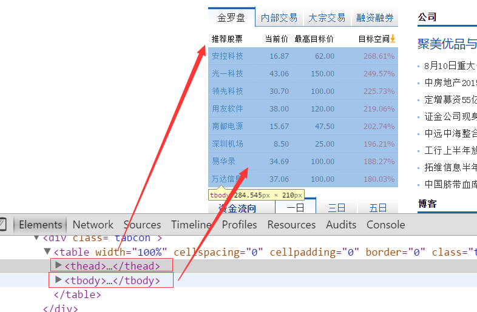

# HTML
## 浏览器内核

浏览器内核分为两个部分: 渲染引擎(layout engineer或Rendering Engine)和js引擎

渲染引擎: (主要渲染html 和css).获得网页的内容(html xml 图像等),再读取css整理,计算网页的显示方式,然后输出到显示器,内核不同渲染出来的效果不同.

js引擎:解析javascript语言,执行javascript语言来实现网页动态效果.

#### 内核分类:

- trident内核(IE):

IE内核

双核浏览器的其中一核是Trident,称这一内核为"兼容模式"

代表:IE  傲游  世界之窗浏览器  Avant  腾讯TT  猎豹安全浏览器  360极速浏览器  百度浏览器

window10发布后,加了新浏览器Edge,Edge有新内核EdgeHTML.

- Gecko(firefox)

Moailla FireFox使用.  该浏览器内核代码公开,可开发程度高,全时间程序员都可以为其编写代码.近年来没落,更新频繁,打开速度慢.猪一样的队友flash,神一样的对手chrome.

- webkit(Safari)

Safari是苹果公司开发的浏览器,内核是webkit.

代表浏览器:傲游浏览器3  Apple Safari(win/mac/iphone/ipad)  Symbian手机浏览器  Android默认浏览器

- Chromium/Blink(chrome)

在Chromium项目中研发Blink渲染引擎(浏览器核心),内置于chrome浏览器中,Blink是Webkit分支.

大部分国产浏览器最新版采用Blink内核,二次开发的.

- Presto(Opera)

Presto(已经废弃)是opera浏览器已被废弃的内核,最新的opera浏览器用的是Blink的内核.


了解:

移动端的浏览器内核主要说内置浏览器的内核.

Android手机而言,使用率最高的是Webkit内核,大部分国产浏览器宣称自己的内核,实际上市webkit的二次开发.

ios是Safari浏览器

WP7平台自带浏览器内核是IE的Trident内核.

## Web标准

浏览器内核不同,工作原理,解析不同.开发者常常需要开发多版本.

通过web标准--->各种内核的浏览器--->展示统一的内容

#### web标准的好处:

1.让web开发前进更广阔

2.内容能被更广泛的设备访问

3.更容易被搜索引擎搜索

4.降低网站流量费用

5.使网站更易于维护

6.提高页面浏览速度

#### web标准构成

web标准不是一个标准,是由W3C和其他标准化组织制定的一系列标准的集合.

主要包括结构(structure) ,表现(Presentation),行为(Behavior)三个方面.

结构标准:结构用于对网页元素进行整理和分类.html

表现标准:表现用于设置网页元素的板式,颜色,大小等外观样式.css

行为标准:行为是指网页模型的定义及交互的编写.js

## 文档类型

`<!DOCTYPE>`标签位于文档的最前面,用于向浏览器说明当前文档使用哪种html或xhtml标准规范,必须在开头处使用.


## 字符集

utf-8是目前最常用的字符集编码方式,常用的字符集编码方式还有gbk和gb2312.

gb2312简单中文 包括6763个汉字

BIG5 繁体中文  港澳台等用

GBK包含全部中文字符 是gb2312的扩展,加入对繁体字的支持,兼容gb2312

utf-8则包含全世界所有国家需要用到的字符

注意:以后统统使用utf-8字符集,就可以避免出现字符集不同意二引起乱码的情况了.

## html常用标签

#### 标题标签:

注意:h1标签因为重要,尽量少用,一般h1是给logo使用或者页面中最重要的标题信息.

#### 水平线标签:

```
<hr />是单标签
```

#### div span标签:

div span是没有语义的,是网页布局主要的两个盒子.

#### 文格式化标签:

```
<b></b><strong></strong>   文字粗体
<i></i><em></em>    文字斜体
<s></s><del></del>   删除线
<u></u><ins></ins>   下划线
```

b i s u没有强调的意思   strong  em  del  ins 语义更强烈

#### 标签属性:

1.属性之间不分先后顺序,标签名与属性,属性与属性之间均以空格分开.

2.任何标签的属性都有默认值,省略该属性则取默认值.

采取 键值对 的格式 key="value"的格式

#### 图像标签img:

```
src          图像的路径
alt          图像不能显示时的替换文本
title        鼠标悬停时显示的内容
width        设置图像的宽度
height		设置图像的高度
border		设置图像边框的宽度
```

#### 链接标签:

anchor的缩写  `<a>文本或图像</a>`

```
href=""   跳转目标
target=""   目标窗口的弹出方式 self默认 blank在新窗口打开
```

注意:

(1).外部链接:加http://

(2).内部链接:直接链接内部名称 

```
<a href="index.html">首页</a>
```

(3).没有确定链接目标   href="#"

(4).文本,图像,表格,音频,视频都可以链接

##### 锚点定位:

```
<a href="#two">
<h3 id="two">第2集</h3>
```

##### base标签:

base可以设置整体链接的打开状态

base写在`<head></head>`之间

把所有链接都默认添加target="_blank";

```
<head>
<base target="_blank />
</head>
```

#### 特殊字符标签:

```html
&nbsp; 空格
&lt;  <
&gt;  >
&copy;  版权
&reg;   注册商标
```

####  注释标签:

`<!-- 注释语句 -->` 

## 定位

**第一种情况:只有自己一个元素(div),父元素就是body.**

此时div绝对定位:

距离左边界的距离=(margin-left)+left.

(和自己是否有margin-left无关,只看父元素是否有padding-left)

此时div相对定位:

距离左边界的距离=(margin-left)+left.

**第二种情况:有两个div嵌套,根元素时body**

```html
<div id="bigdv">
	<div id="dv"></div>
</div>
```

有一种情形是父元素定位,子元素绝对定位时.

子元素先定位,没有设置left的时候,父元素的padding-left还会有效果,(因为此时的left有一个默认值,默认值不是0,其实默认值就是padding-left的值).如果加了left:10,那么padding-left会失效,因为定位开始了,以left优先.top同理.

因为子元素绝对定位如果加了left或top  是以最近的定位了的外层元素的border内边界为基准来偏移的.(偏移的区域包含了padding和文字区)

## 路径

### 相对路径

以引用文件之网页所在位置为参考基础，而建立出的目录路径。因此，当保存于不同目录的网页引用同一个文件时，所使用的路径将不相同，故称之为相对路径。

1. 图像文件和HTML文件位于同一文件夹：只需输入图像文件的名称即可，如&lt;img src="logo.gif" /&gt;。
2. 图像文件位于HTML文件的下一级文件夹：输入文件夹名和文件名，之间用“/”隔开，如&lt;img src="img/img01/logo.gif" /&gt;。
3. 图像文件位于HTML文件的上一级文件夹：在文件名之前加入“../” ，如果是上两级，则需要使用 “../ ../”，以此类推，如&lt;img src="../logo.gif" /&gt;。

### 绝对路径

“D:\web\img\logo.gif”，或完整的网络地址，例如“<http://www.itcast.cn/images/logo.gif>”。

## 列表标签

### 无序列表 ul

无序列表的各个列表项之间没有顺序级别之分，是并列的。其基本语法格式如下：

```html
<ul>
  <li>列表项1</li>
  <li>列表项2</li>
  <li>列表项3</li>
  ......
</ul>
```

注意：

```
 1. <ul></ul>中只能嵌套<li></li>，直接在<ul></ul>标签中输入其他标签或者文字的做法是不被允许的。
 2. <li>与</li>之间相当于一个容器，可以容纳所有元素。
 3. 无序列表会带有自己样式属性
```

### 有序列表 ol

有序列表即为有排列顺序的列表，其各个列表项按照一定的顺序排列定义，有序列表的基本语法格式如下：

```html
<ol>
  <li>列表项1</li>
  <li>列表项2</li>
  <li>列表项3</li>
  ......
</ol>
```

  所有特性基本与ul 一致。  

  但是实际工作中， 较少用 ol

### 自定义列表

定义列表常用于对术语或名词进行解释和描述，定义列表的列表项前没有任何项目符号。其基本语法如下：

```html
<dl>
  <dt>名词1</dt>
  <dd>名词1解释1</dd>
  <dd>名词1解释2</dd>
  ...
  <dt>名词2</dt>
  <dd>名词2解释1</dd>
  <dd>名词2解释2</dd>
  ...
</dl>
```

##  表格 table

### 创建表格

在HTML网页中，要想创建表格，就需要使用表格相关的标签。创建表格的基本语法格式如下：

```html
<table>
  <tr>
    <td>单元格内的文字</td>
    ...
  </tr>
  ...
</table>
```

注意：

`<tr></tr>`中只能嵌套`<td></td>`

`<td></td>`标签，他就像一个容器，可以容纳所有的元素

### 表格属性


三参为0    border  cellpadding  cellspacing  为  0

### 表头标签

表头单元格一般位于表格的第一行或第一列，其文本加粗居中，如下图所示，即为设置了表头的表格。设置表头非常简单，只需用表头标签&lt;th&gt;</th&gt;替代相应的单元格标签&lt;td&gt;</td&gt;即可。 

 

### 表格结构

```
在使用表格进行布局时，可以将表格划分为头部、主体和页脚（页脚因为有兼容性问题，我们不在赘述），具体 如下所示：

<thead></thead>：用于定义表格的头部。

必须位于<table></table> 标签中，一般包含网页的logo和导航等头部信息。


<tbody></tbody>：用于定义表格的主体。

位于<table></table>标签中，一般包含网页中除头部和底部之外的其他内容。
```



例子:

```html
<table border="1">
  <thead>
    <tr>
      <th>Month</th>
      <th>Savings</th>
    </tr>
  </thead>

  <tfoot>
    <tr>
      <td>Sum</td>
      <td>$180</td>
    </tr>
  </tfoot>

  <tbody>
    <tr>
      <td>January</td>
      <td>$100</td>
    </tr>
    <tr>
      <td>February</td>
      <td>$80</td>
    </tr>
  </tbody>
</table>
```

### 表格标题

**表格的标题： caption**

**定义和用法**

caption 元素定义表格标题。

```html
<table>
   <caption>我是表格标题</caption>
</table>
```

caption 标签必须紧随 table 标签之后。

只存在 表格里面

只能对每个表格定义一个标题。通常这个标题会被居中于表格之上。

### 合并单元格

跨行合并：rowspan    跨列合并：colspan   都是给单元格td用的

合并单元格的思想：

​     将多个内容合并的时候，就会有多余的东西，把它删除。    例如 把 3个 td 合并成一个， 那就多余了2个，需要删除。

​     公式：  删除的个数  =  合并的个数  - 1   

   合并的顺序 先上 后下   先左  后右

1. 先确定是跨行还是跨列合并
2. 根据 先上 后下   先左  后右的原则找到目标单元格 
3. 删除单元格   删除的个数  =  合并的个数  - 1  

### 总结表格

1. 表格提供了HTML 中定义表格式数据的方法。
2. 表格中由行中的单元格组成。
3. 表格中没有列元素，列的个数取决于行的单元格个数。
4. 表格不要纠结于外观，那是CSS 的作用。

## 表单标签

在HTML中，一个完整的表单通常由表单控件（也称为表单元素）、提示信息和表单域3个部分构成。


  表单控件：

​       包含了具体的表单功能项，如单行文本输入框、密码输入框、复选框、提交按钮、重置按钮等。

  提示信息：

​        一个表单中通常还需要包含一些说明性的文字，提示用户进行填写和操作。

  表单域：  

​      他相当于一个容器，用来容纳所有的表单控件和提示信息，可以通过他定义处理表单数据所用程序的url地址，以及数据提交到服务器的方法。如果不定义表单域，表单中的数据就无法传送到后台服务器。

### input 控件

input 输入的意思 

在上面的语法中，&lt;input /&gt;标签为单标签，type属性为其最基本的属性  类型 ，其取值有多种，用于指定不同的控件类型。除了type属性之外，&lt;input /&gt;标签还可以定义很多其他的属性，其常用属性如下表所示。

type  说明了属于那种表单

radio  如果是一组，我们必须给他们命名相同的名字 name   这样就可以多个选其中的一个


### label标签

label 标签为 input 元素定义标注（标签）。

作用：  用于绑定一个表单元素, 当点击label标签的时候, 被绑定的表单元素就会获得输入焦点

for 属性规定 label 与哪个表单元素绑定。

```html
<label for="male">Male</label>
<input type="radio" name="sex" id="male" value="male">
```

### textarea控件(文本域)

textarea 文本域

如果需要输入大量的信息，就需要用到&lt;textarea&gt;&lt;/textarea&gt;标签。通过textarea控件可以轻松地创建多行文本输入框，其基本语法格式如下：

```html
<textarea cols="每行中的字符数" rows="显示的行数">
  文本内容
</textarea>
```

### 下拉菜单

使用select控件定义下拉菜单的基本语法格式如下     select 选择

```html
<select>
  <option>选项1</option>
  <option>选项2</option>
  <option>选项3</option>
  ...
</select>
```

注意：

1.&lt;select&gt;</select&gt;中至少应包含一对&lt;option></option&gt;。

2.在option 中定义selected =" selected "时，当前项即为默认选中项。

### 表单域

在HTML中，form标签被用于定义表单域，即创建一个表单，以实现用户信息的收集和传递，form中的所有内容都会被提交给服务器。创建表单的基本语法格式如下：

```html
<form action="url地址" method="提交方式" name="表单名称">
  各种表单控件
</form>
```

常用属性：

1. Action
   在表单收集到信息后，需要将信息传递给服务器进行处理，action属性用于指定接收并处理表单数据的服务器程序的url地址。
2. method
   用于设置表单数据的提交方式，其取值为get或post。
3. name
   用于指定表单的名称，以区分同一个页面中的多个表单。

注意：  每个表单都应该有自己表单域。
