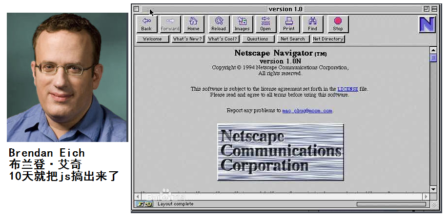
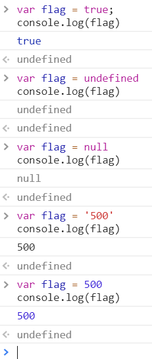
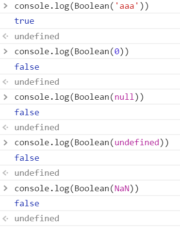

# JavaScript

## windows中常用的快捷键

- win+R快速运行:
  - calc运行计算器
  - mspaint运行画图工具
  - notepad运行记事本
  - services.msc打开服务

## JavaScript介绍

- JavaScript是什么

Netscape在最初将其脚本语言命名为LiveScript，后来Netscape在与Sun合作之后将其改名为JavaScript。JavaScript最初受Java启发而开始设计的，目的之一就是“看上去像Java”，因此语法上有类似之处，一些名称和命名规范也借自Java。JavaScript与Java名称上的近似，是当时Netscape为了营销考虑与Sun微系统达成协议的结果。



- JavaScript现在的意义(应用场景)

网页特效

服务端开发(Node.js)

命令行工具(Node.js)

桌面程序(Electron)

App(Cordova)

控制硬件-物联网(Ruff)

游戏开发(cocos2d-js)

## JavaScript的组成

### ECMAScript

ECMA 欧洲计算机制造联合会

网景：JavaScript

微软：JScript

定义了JavaScript的语法规范  

JavaScript的核心，描述了语言的基本语法和数据类型，ECMAScript是一套标准，定义了一种语言的标准与具体实现无关

### BOM - 浏览器对象模型

一套操作浏览器功能的API

通过BOM可以操作浏览器窗口，比如：弹出框、控制浏览器跳转、获取分辨率等

### DOM - 文档对象模型

一套操作页面元素的API

DOM可以把HTML看做是文档树，通过DOM提供的API可以对树上的节点进行操作

## 变量

- var声明变量

```javascript
var age;
```

- 变量的赋值

```javascript
var age;
age = 18;
```

- 同时声明多个变量

```javascript
var age, name, sex;
age = 10;
name = 'zs';
```

- 同时声明多个变量并赋值

```javascript
var age = 10, name = 'zs';
```

- 变量在内存中的存储

```javascript
var age = 18;
```


- 变量的命名规则和规范

- 规则 - 必须遵守的，不遵守会报错
  - 由字母、数字、下划线、$符号组成，不能以数字开头
  - 不能是关键字和保留字，例如：for、while。
  - 区分大小写
- 规范 - 建议遵守的，不遵守不会报错
  - 变量名必须有意义
  - 遵守驼峰命名法。首字母小写，后面单词的首字母需要大写。例如：userName、userPassword

## 数据类型

### 简单数据类型

Number、String、Boolean、Undefined、Null

#### Number类型

- 数值字面量：数值的固定值的表示法

  110 1024  60.5

- 进制

```
十进制
	var num = 9;
	进行算数计算时，八进制和十六进制表示的数值最终都将被转换成十进制数值。
十六进制
	var num = 0xA;
	数字序列范围：0~9以及A~F
八进制
    var num1 = 07;   // 对应十进制的7
    var num2 = 019;  // 对应十进制的19
    var num3 = 08;   // 对应十进制的8
    数字序列范围：0~7
    如果字面值中的数值超出了范围，那么前导零将被忽略，后面的数值将被当作十进制数值解析
```

- 浮点数
  - 浮点数的精度问题

```
浮点数
	var n = 5e-324;   // 科学计数法  5乘以10的-324次方  
浮点数值的最高精度是 17 位小数，但在进行算术计算时其精确度远远不如整数
   var result = 0.1 + 0.2;    // 结果不是 0.3，而是：0.30000000000000004
   console.log(0.07 * 100);
   不要判断两个浮点数是否相等
```

- 数值范围

```
最小值：Number.MIN_VALUE，这个值为： 5e-324
最大值：Number.MAX_VALUE，这个值为： 1.7976931348623157e+308
无穷大：Infinity
无穷小：-Infinity
```

- 数值判断
  - NaN：not a number
    - NaN 与任何值都不相等，包括他本身
  - isNaN: is not a number

#### String类型

'abc'   "abc"

- 字符串字面量

  '程序猿'，'程序媛', "黑马程序猿"

  

  思考：如何打印以下字符串。
  我是一个"正直"的人 
  我很喜欢"黑马'程序猿'"

- 转义符

  

- 字符串长度

  length属性用来获取字符串的长度

  ```javascript
  var str = '黑马程序猿 Hello World';
  console.log(str.length);
  ```

- 字符串拼接

  字符串拼接使用 + 连接

  ```javascript
  console.log(11 + 11);
  console.log('hello' + ' world');
  console.log('100' + '100');
  console.log('11' + 11);
  console.log('male:' + true);
  ```

  1. 两边只要有一个是字符串，那么+就是字符串拼接功能
  2. 两边如果都是数字，那么就是算术功能。

#### Boolean类型

- Boolean字面量：  true和false，区分大小写
- 计算机内部存储：true为1，false为0

#### Undefined和Null

undefined表示一个声明了没有赋值的变量，变量只声明的时候值默认是undefined

null表示一个空，变量的值如果想为null，必须手动设置

### 复杂数据类型

Object

### 获取变量的类型

`typeof`

```javascript
var age = 18;
console.log(typeof age);  // 'number'
```

### 字面量

在源代码中一个固定值的表示法.

数值字面量: 8,  9, 10

字符串字面量: '黑马程序员', "大前端"

布尔字面量: true, false

## 数据类型转换
如何使用谷歌浏览器,快速的查看数据类型?
字符串的颜色是黑色的, 数值类型是蓝色的, 布尔类型也是蓝色的, undefined和 null 是灰色的


- 转成字符串类型

`toString()`

```javascript
var num = 5
console.log(num.toString())
```

`String()`

```javascript
//String()函数存在的意义: 有些值没有toString(), 这个时候可以使用String(). 比如: undefined和null
```

**拼接字符串方式**

num + "", 当 + 两边一个操作符是字符串类型, 一个操作符是其它类型的时候, 会先把其它类型转换成字符串再进行字符串拼接, 返回字符串.

- 转成数值类型

  `Number()`
  Number()可以把任意值转换成数值, 如果要转换的字符串中有一个不是数值的字符, 返回NaN

  parseInt()

```javascript
var num1 = parseInt("12.3abc"); // 返回12, 如果第一个字符是数字会解析直到遇到非数字结束
var num2 = parseInt("abc123"); // 返回NaN, 如果第一个字符不是数字或者符号就返回NaN
```

`parseFloat()`

```javascript
parseFloat()把字符串转换成浮点数
parseFloat()和parseInt非常相似, 不同之处在于parseFloat会解析第一个. (点) 遇到第二个 . 或者非数字结束
console.log(parseFloat('12.3.4')) //12.3
	如果解析的内容里只有整数, 则解析成整数
```
`+, -0等运算`

```javascript
var str = '500'
console.log(+str);	//取正
console.log(-str);	//取负
console.log(str - 0);
```
- 转换成布尔类型

`Boolean()`
0 ''(空字符串) null undefined NaN 会转换成false 其他都会转换成true


## 操作符
运算符 operator
5 + 6
表达式由 操作数 和 操作符 组成, 会有一个结果

- 算术运算符

```
+ - * / %
```
- 一元运算符
  一元运算符: 只有一个操作符的运算符
  二元运算符: 两个操作数的运算符 5 + 6 
  ++ 自身加1
  -- 自身减1

  - 前置++

    ```javascript
    var num1 = 5;
    ++ num1;
    
    var num2 = 6;
    console.log(num1 + ++ num2);	//13
    ```

  - 后置++

- 逻辑运算符(布尔运算符)

&& 与 两个操作数同时为true, 结果为true, 否则都是false
|| 或 两个操作数有一个为true, 结果为true, 否则为false
!  非  取反

- 关系运算符(比较运算符)

```
<   >   >=   <=   ==  !=   ===  !==
```
```javascript
==与===的区别: ==只进行值的比较, ===类型和值同时相等, 则相等
var result = '55' == 55;	// true
var result = '55' === 55;	// false 值相等,类型不相等
var result = 55 ===55;	     // true
```
- 赋值运算符

=  +=  -=  *=  /=  %=
```javascript
var num = 0;
num += 5;	//相当于 num = num + 5;
```
- 运算符的优先级

```
优先级从高到低
	1. () 优先级最高
	2. 一元运算符 ++ -- !
	3. 算数运算符 先 * / % 后 + -
	4. 关系运算符 > >= < <=
	5. 相等运算符 == != === !==
	6. 逻辑运算符 先&& 后||
	7. 赋值运算符 =   +=   -=   *=   /=   %=
```
```javascript
// 练习1：
4 >= 6 || '人' != '阿凡达' && !(12 * 2 == 144) && true
//true

// 练习2：
var num = 10;
//true
5 == num / 2 && (2 + 2 * num).toString() === '22'
```
## 表达式和语句
### 表达式
> 一个表达式可以产生一个值, 有可能是运算、函数调用、有可能是字面量.表达式可以放在任何需要值的地方.
###语句
> 语句可以理解为一个行为, 循环语句和判断语句就是典型的语句. 一个程序有很多歌语句组成,一般情况下用 ; 分割一个一个的语句
## 流程控制
程序的三种基本结构
- 顺序结构

从上到下执行的代码就是顺序结构
**程序默认就是由上到下顺序执行的**
- 分支结构

根据不同的情况,之星对应的代码

- 循环结构

循环结构: 重复做一件事情

## 分支结构

- if语句

语法结构
```javascript
if (/* 条件表达式 */) {
  // 执行语句
}

if (/* 条件表达式 */){
  // 成立执行语句
} else {
  // 否则执行语句
}

if (/* 条件1 */){
  // 成立执行语句
} else if (/* 条件2 */){
  // 成立执行语句
} else if (/* 条件3 */){
  // 成立执行语句
} else {
  // 最后默认执行语句
}
```

- 三元运算符

表达式1 ? 表达式2 : 表达式3
是对 if...else 语句的一种简化写法
表达式1 为 true 则执行 表达式2
表达式1 为 false 则执行 表达式3

- switch语句

语法结构
```javascript
switch (expression) {
  case 常量1:
    语句;
    break;
  case 常量2:
    语句;
    break;
  case 常量3:
    语句;
    break;
  …
  case 常量n:
    语句;
    break;
  default:
    语句;
    break;
}
```

```
break可以省略, 如果省略, 代码会继续执行下一个case
switch 语句在比较值时使用的是全等操作符, 因此不会发生类型转换.
(例如, 字符串 '10' 不等于数值 10)
```

## 布尔类型的隐式转换
流程控制语句会把后面的值隐式转换成布尔类型
```
转换为 true	非空字符串	非0数字	true	任何对象
转换为false	空字符串	0	false	null	undefined	
```

```javascript
// 结果是什么?
var a = !!'123';	//true
```

案例

```javascript
var message;
// 会自动把message转换成false
if (message) {     
  // todo...
}
//因为
var message;
console.log(message);	//undefined
```

## 循环结构

在 javascript 中, 循环语句有三种, while, do...while, for 循环

- while语句

基本语法:
```javascript
// 当循环条件为 true 时, 执行循环体.
// 当循环条件为 false 时, 结束循环.
while (循环条件) {
    //循环体
}
```
```javascript
// 算 1 - 100 之间所有数的和
// 初始化变量
var i = 1;
var sum = 0;
//判断条件
while (i <= 100) {
    // 循环体
    sum += i;
    i++;
}
console.log(sum);
```

- do...while语句

> do...while 循环和 while 循环非常想, 二者经常可以相互替代, 但是 do..while 的特点是不管条件成不成立, 都会执行一次

基础语法

```javascript
do {
    //循环体
} while (循环条件);
```

代码示例:

```javascript
var i = 1;
var sum = 0;
do {
    sum += i;//循环体
    i++;
} while (i <= 100);//循环条件
```

- for语句

> while 和 do...while 一般用来解决无法确定次数的循环. for循环一般在循环次数确定的时候比较方便

for循环语法

```javascript
// for循环的表达式之间用的是 ; 号隔开的
for (初始化表达式1; 判断表达式2; 自增表达式3) {
    // 循环体4
}
```

执行顺序: 1243 --- 243 ---- 243(直到循环条件变成false)

1. 初始化表达式
2. 判断表达式
3. 自增表达式
4. 循环体

- continue和break

> break: 立即跳出整个循环, 即循环结束, 开始执行循环后面的内容
>
> continue: 立即跳出当前循环, 继续下一次循环 (跳到i++之前一步)

## 数组

数组的定义

通过字面量创建数组

```javascript
// 创建一个空数组
var arr1 = [];
// 创建一个包含3个数值的数组, 多个数组项以逗号隔开
var arr2 = [1, 3, 4];
// 创建一个包含2个字符串的数组
var arr3 = ['a', 'c'];

// 可以通过数组的length属性获取数组的长度
console.log(arr3.length);
// 可以设置length 属性改变数组中元素的个数
arr3.length = 0;
```

获取数组元素

数组的取值

```javascript
// 格式: 数组名[下标]  下标又称索引
// 功能: 获取数组对应下标的那个值, 如果下标不存在, 则返回undefined.
var arr = ['red', 'green', 'blue'];
arr[0]; // red
arr[2]; // blue
arr[3]; // 这个数组的最大下标为2, 因此返回undefined
```

数组中新增元素

数组的赋值

```javascript
// 格式: 数组名[下标/索引] = 值;
// 如果下标又对应的值, 会把原来的值覆盖, 如果下标不存在, 会给数组新增一个元素.
var arr = ['red', 'green', 'blue'];
// 把red 替换成了 yellow
arr[0] = 'yellow';
// 给数组新增加了一个 pink 的值
arr[3] = 'pink';
```

## 函数

函数的返回值

返回值详解:

​	如果函数没有显式的使用 return 语句, 那么函数有默认的返回值: undefined

​	如果函数使用 return 语句, 那么跟在 return 后面的值, 就成了函数的返回值

​	如果函数使用 return 语句, 但是 return 后面没有任何值, 那么函数的返回值也是: undefined

​	函数使用 return 语句后, 这个函数会在执行完 return 语句之后停止并立即退出, **也就是说 return 后面的所有其他代码都不会再执行.**

推荐的做法是要么让函数始终都返回一个值, 要么永远都不要返回值.

# 面试题

- 简述同步和异步 阻塞和非阻塞的区别

**同步与异步**

同步和异步关注的是**消息通信机制** (synchronous communication/ asynchronous communication)
所谓同步，就是在发出一个调用时，在没有得到结果之前，该*调用*就不返回。但是一旦调用返回，就得到返回值了。
换句话说，就是由*调用者*主动等待这个*调用*的结果。

而异步则是相反，**调用在发出之后，这个调用就直接返回了，所以没有返回结果**。换句话说，当一个异步过程调用发出后，调用者不会立刻得到结果。而是在*调用*发出后，*被调用者*通过状态、通知来通知调用者，或通过回调函数处理这个调用。

典型的异步编程模型比如Node.js

举个通俗的例子：
你打电话问书店老板有没有《分布式系统》这本书，如果是同步通信机制，书店老板会说，你稍等，”我查一下"，然后开始查啊查，等查好了（可能是5秒，也可能是一天）告诉你结果（返回结果）。
而异步通信机制，书店老板直接告诉你我查一下啊，查好了打电话给你，然后直接挂电话了（不返回结果）。然后查好了，他会主动打电话给你。在这里老板通过“回电”这种方式来回调。

**阻塞与非阻塞**

阻塞和非阻塞关注的是**程序在等待调用结果（消息，返回值）时的状态.**

阻塞调用是指调用结果返回之前，当前线程会被挂起。调用线程只有在得到结果之后才会返回。
非阻塞调用指在不能立刻得到结果之前，该调用不会阻塞当前线程。

还是上面的例子，
你打电话问书店老板有没有《分布式系统》这本书，

你如果是阻塞式调用，你只有固定电话，你会一直把自己“挂起”，守在电话旁直到得到这本书有没有的结果，

如果是非阻塞式调用，你有手机，你不管老板有没有告诉你，你自己先一边去玩了， 当然你也要时不时看下手机老板有没有打电话来返回结果。
在这里阻塞与非阻塞与是否同步异步无关。跟老板通过什么方式回答你结果无关。

**其他例子**

同步阻塞：你打电话问老板有没有某书，老板去查，在老板给你结果之前，你一直拿着电话等待老板给你结果，你此时什么也干不了。

同步非阻塞：你打电话过去后，在老板给你结果之前，你拿着电话等待老板给你结果，但是你拿着电话等的时候可以干一些其他事，比如嗑瓜子。

异步阻塞：你打电话过去后，老板去查，你挂掉电话，等待老板给你打电话通知你，这是异步，你挂了电话后还是啥也干不了，只能一直等着老板给你打电话告诉你结果，这是阻塞。

异步非阻塞：你打电话过去后，你就挂了电话，然后你就想干嘛干嘛去。只用时不时去看看老板给你打电话没。


