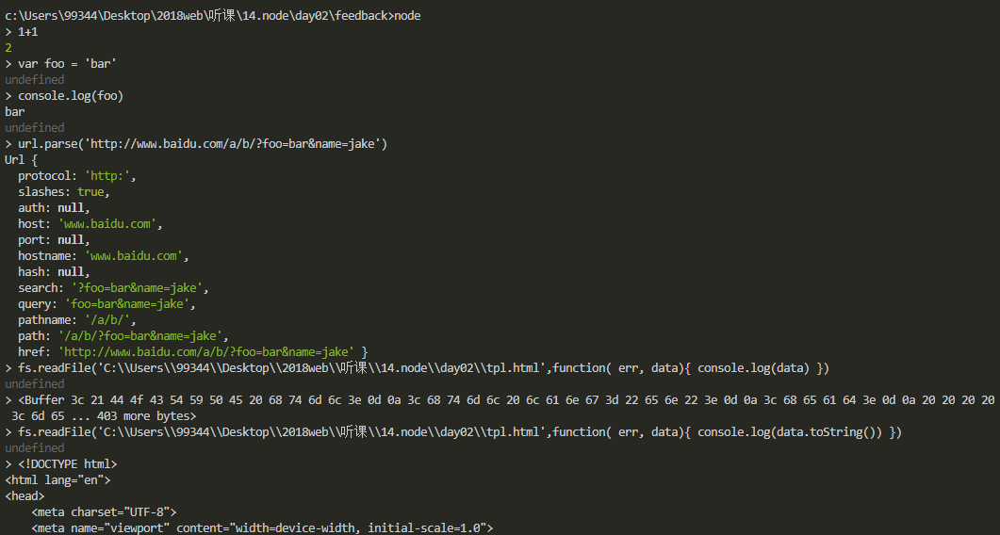
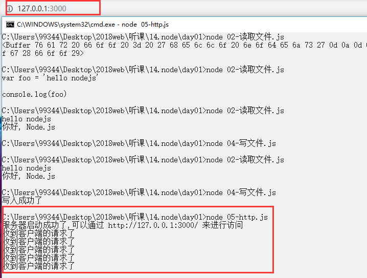
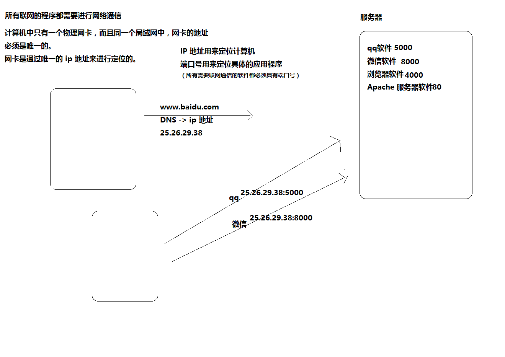

## node.js介绍

### node.js是什么?

node.js是技术, 不是后台的语言

安装了node 之后,开始菜单的 node.js 中 Node.js 进程和浏览器的 Console 一样

菜单的 Node.js command prompt 是 Node 命令行窗口

服务器端:java php Python Ruby .Net C# Node.js

官网nodejs.org有三点定义:

1.Node.js® is a JavaScript runtime built on [Chrome's V8 JavaScript engine](https://developers.google.com/v8/).

翻译:

- node.js不是一门语言,node.js不是库,不是框架,node.js是一个JavaScript运行时环境,简单点来讲就是Node.js可以解析和执行JavaScript代码.

- 以前只有浏览器可以解析执行JavaScript代码

- 也就是说现在的JavaScript可以完全脱离浏览器来运行,一切都归功于:Node.js

`浏览器中的JavaScript:`

- EcmaScript   基本的语法,if,var function Object Array
- BOM
- DOM

`Node.js中的JavaScript`

- 没有BOM,DOM
- EcmaScript 基本的JavaScript语法部分
- 在Node中 为JavaScript执行环境提供了一些服务器级别的操作API
  - 例如文件读写
  - 网络服务的构建
  - 网络通信
  - http服务器
  - 等处理..

构建在Chrome的V8引擎执行

- 代码只是具有特定个数的字符串而已
- 引擎可以认识它,引擎可以帮你去解析和执行
- Google Chrome的V8引擎室目前公认的解析执行Javascrtpt代码最快的
- Node.js的作者把Google Chrome中的V8引擎移植了出来,开发了一个独立的JavaScript运行时环境.

2.Node.js uses an event-driven,non-blacking I/O model that makes It lightweight and efficient.

翻译:

- event-driven 事件驱动
- non-blocking I/O model非阻塞IO模型(异步)
- lightweight and efficient轻量和高效

3.Node.js'package ecosytem, npm, is the largest ecosystem of open source libraries in the world.

翻译:

- npm是世界上最大的开源库生态系统
- 绝大多数JavaScript相关的包都存放在npm上,这样做的目的是为了让开发人员更方便的去下载使用.
- `npm install jquery`

### Node.js能做什么

- Web服务器后台

- 命令行工具

  - npm(node)

  - git(c语言)

  - hexo(node)
  - ...

- 对于前端开发工程师来讲,接触node最多的是它的命令行工具
  - 自己写的很少,主要是使用别人开发的:
  - webpack
  - gulp
  - npm

### 能学到什么:

- B/S变成模型
  - Browser - Server
  - back-end
  - 任何服务端技术这种BS编程模型都是一样,和语言无关
  - Node知识作为我们学习BS变成模型的一个工具而已
- 模块化编程
  - `@import(文件路径)`
  - 以前认知的JavaScript只能通过`script`标签来加载
  - 在Node中可以像`@import()`一样来引用加载JavaScript脚本文件
  - Node常用API
  - 异步编程
    - 回调函数
    - Promise
    - async
    - generator
  - Express Web开发框架
  - EcmaScript 6
    - 只是一个新语法
  - 学习Node不仅会帮助打开服务器端黑盒子,还会学习以后的高级内容
    - Vue.js
    - React
    - angular

## 核心模块

### fs-文件系统

1. fs.readFileSync()是同步读取

2. fs.readFile()是异步读取

fs.readFile(path[, options], callback)

- `path` string | Buffer | URL | integer 文件名或文件描述符。
- `options` Object | string
  - `encoding`  string | null 默认为 `null`。
  - `flag`  string详见[支持的 flag](http://nodejs.cn/s/JjbY8n)。默认为 `'r'`。
- `callback` Function
  - `err` Error
  - `data`  string | Buffer

异步地读取文件的内容。

```js
fs.readFile('/etc/passwd', (err, data) => {
  if (err) throw err;
  console.log(data);
});
```

`callback` 有两个参数 `(err, data)`，其中 `data` 是文件的内容。

如果没有指定 `encoding`，则返回原始的 buffer。

如果 `options` 是一个字符串，则指定字符编码：

```js
fs.readFile('/etc/passwd', 'utf8', callback);
```

> node.js 中通常操作都有同步和异步, 同步操作会阻塞进程, 导致代码不往下面继续执行, 建议使用异步版本

3. 读取失败抛出异常:

```javascript
fs.readFile('文件路径', function (err, data) {
    if (err) throw err; //抛出错误, 后面的代码不会执行
})
```

4. 读取文件会自动创建Buffer缓存,把文件内容存到缓存中,以十六进制的形式存储.

若想转回字符串

```javascript
const data = fs.readFileSync('./笔记.md')
console.log('同步读取', data.toString())
// data.toString()
```

### Buffer-内存

1. 就是内存的地址,每个内存地址都有编号,相当于内存中的内存地址

2. buffer是全局模块.用buffer不用require

3. 文件流中读取系统会自动创建Buffer.

4. 如果想要自己创建:

Buffer.alloc(size[, fill[, encoding]])


> `size`  integer 新建的 `Buffer` 的长度。
>
> `fill`  string | Buffer | integer 预填充 `Buffer` 的值。默认为 `0`。
>
> `encoding` string 如果 `fill` 是字符串，则指定 `fill` 的字符编码。默认为 `'utf8'`。

创建一个大小为 size **字节**的 Buffer。 如果 fill 为 undefined，则用 0 填充 Buffer。

```javascript
const buf1 = Buffer.alloc(10);
console.log(buf1);
// <Buffer 00 00 00 00 00 00 00 00 00 00>

const buf1 = Buffer.alloc(10, 10);
console.log(buf1);
// <Buffer 0a 0a 0a 0a 0a 0a 0a 0a 0a 0a>
```

Buffer.from(array) 使用字节数组 `array` 创建 `Buffer`。

>  `array` integer

```javascript
// 输入的如果是十进制的话, 会把十进制转成十六进制
const buf2 = Buffer.from([01, 02, 13])
console.log(buf2)
// <Buffer 01 02 0d>

// 输入的直接是十六进制会直接输出
const buf3 = Buffer.from([0x62, 0x75, 0x66, 0x66, 0x65, 0x72]);
console.log(buf3)
//<Buffer 62 75 66 66 65 72>
```

Buffer.from(string[, encoding]) 创建一个包含 `string` 的 `Buffer`。

`string` string 要编码的字符串。

`encoding` string `string` 的字符编码。默认为 `'utf8'`。

注意: 转二进制的编码格式默认是utf8,如果编码格式为scii, 中文转换为二进制就会编码有错误, 虽然二进制看不出结果.然后输出的时候用toString(),toString()方法有隐式转换编码格式默认使用utf8.可以手动更改.

```javascript
const buf4 = Buffer.from('hello node.js中文')
console.log(buf4.toString())
// 输出: hello node.js中文

const buf4 = Buffer.from('hello node.js中文', 'ascii')
console.log(buf4)
// 输出: <Buffer 68 65 6c 6c 6f 20 6e 6f 64 65 2e 6a 73 2d 87>

const buf4 = Buffer.from('hello node.js中文', 'ascii')
console.log(buf4.toString())
// hello node.js-�       

const buf5 = Buffer.from('this is a tést');
const buf6 = Buffer.from('7468697320697320612074c3a97374', 'hex');

console.log(buf5.toString());
// 输出: this is a tést
console.log(buf6.toString());
// 输出: this is a tést
console.log(buf5.toString('ascii'));
// 输出: this is a tC)st
```

5. 不是缓存, 是内存. 不会自动消失, 除非关闭服务器, 会清除占用的内存.

### Stream-数据流

## 起步

### 安装Node环境

- 查看当前是否有node

cmd->>node --version   可以查看版本号

- 下载:https://nodejs.org/en/download/
  - LTS版本:long time support长期支持版本,稳定版
  - current版本:体验版,最新特性版
  - 别的版本就点download里,选别的平台的版本
- 安装
  - 如果已经安装过,继续安装就会把原来的旧版本覆盖,进行升级
  - 傻瓜式一路`next`
- 确认Node环境是否安装成功
  - 打开命令行,输入`node --version`
  - 或者`node -v`
- 环境变量

### REPL

- read 读取
- eval 执行
- print 输出
- loop 循环

在终端输入人`node`命令直接敲回车,退出是ctrl+c两次



这个环境的作用只是用来帮助做一些辅助测试,例如在里面可以直接使用node中的核心模块而不需要require 加载.

### Hello World

#### 解析执行JavaScript

1.创建编写JavaSCript脚本文件

2.打开终端,定位到脚本文件所属目录

3.输入`node 文件名`执行对应的文件

注意:

文件名不要使用`node.js`来命名,也就是说除了`node`这个名字随便起(会直接打开文件),最好也不要用中文

用`cmd`、`Git Bash`、`cld` 都可以、在js文件目录按shift+鼠标右键、或者在sublime中装terminal插件

`cls`清屏

#### 读写文件

文件读取:

```javascript
//浏览器中的JavaScript是没有文件操作的能力的
//但是Node中的JavaSCript具有文件操作的能力的

//fs 是file-System 的简写,就是文件系统 意思
//在Node中想文件操作,必须引入fs核心模块
//fs这个核心模块提供了所有文件相关的API
//例如:fs.readFile就是读取文件的

var fs = require('fs');

//2.读取文件
//第一个参数是要读取的文件路径
//第二个参数是一个回调函数
//      error
//          如果读取成功,error 是 null
//          如果读取失败,error 是 错误对象
//      data
//          如果读取成功,data 是 读到的数据
//          如果读取失败,data 是 undefined没有数据
fs.readFile('./data/hello.txt', function(error,data){
    //console.log(data)
    //<Buffer 76 61 72 20 66 6f 6f 20 3d 20 27 68 65 6c 6c 6f 20 6e 6f 64 65 6a 73 27 0d 0a 0d 0a 63 6f 6e 73 6f 6c 65 2e 6c 6f 67 28 66 6f 6f 29>
    //文件中存储的其实都是二进制数据 0 1 
    //这里为什么看到的不是0 1 ?是因为二进制转成了16进制了
    //但是无论是二进制还是16进制,人都不认识
    //需要用toString方法把其转为我们能认识的字符
    //console.log(data.toString());

   

    //读文件需要判断error是否有错误发生

    if(error){
        console.log('读取文件失败了')
    }else {
        console.log(data.toString())
    }
})
```

文件写入

```javascript
var fs = require('fs')

//第一个参数:文件路径
//第二个参数:文件内容
//第三个参数:回调函数
//      回调函数只有一个参数error

//      成功: 
//          error 是 null
//      失败:
//          error就是错误对象
fs.writeFile('./data/你好.md', '大家好,我是Node.js', function(error){
    //console.log(error);
    if(error){
        //如果文件名有特殊符号,会写入失败
        console.log('写入失败');
    }else {
        //如果文件有,会覆盖原来的
        console.log('写入成功了');
        
    }
})
```

#### http

很傻的服务器:

```javascript
//可以使用Node非常轻松的构建一个Web服务器
//Node中专门提供了一个核心模块:http
//http模块就是帮你创建编写服务器的

//1.加载http核心模块
var http = require('http')

//2.使用http.createServer() 方法创建一个Web服务器
//返回一个 Server 实例
var server = http.createServer()

//3.服务器要干嘛?
//提供服务: 对 数据 的服务
//发请求
//接收请求
//处理请求
//给个反馈(发送响应)

//注册 request 请求事件
//当客户端请求过来,会自动触发服务器的request请求时间,然后执行第二个参数,回调处理
server.on('request', function(){
    console.log('收到客户端的请求了');

})

//4.绑定端口号,启动服务器
server.listen(3000, function(){
    console.log('服务器启动成功了,可以通过 http://127.0.0.1:3000/ 来进行访问');
    
})
```




关闭服务器:ctrl + c

http+fs:

```javascript
// 1. 导入 http 模块
const http = require('http')
// 2. 引入文件系统 file system 模块
const fs = require('fs')

const server = http.createServer((req, res) => {
    // 该回调函数在每次收到请求时调用
    // req指请求对象
    // res 指响应对象
    //使用 res.wirteHead() 设置响应头    
    const url = req.url;
    const method = req.method;
    if (url === '/' && method === 'GET') {
        // 异步读取首页文件
        fs.readFile('./index.html', (err, data) => {
            if (err) {
                // 错误处理
                res.writeHead(500, {
                    'Content-Type': 'text/plain'
                })
                // 返回页面数据
                res.end('500, Server Internal Error')
                return; //服务器错误就不会向下继续执行
            }
            // 设置响应头
            res.writeHead(200, {
                'Content-Type': 'text/html'
            })
            // 返回页面数据
            res.end(data)  
            
        })
        
    }
    
})

// 监听指定端口
server.listen(3000);
```

## Node中的JavaScript

- EcmaScript
  - 没有 DOM, BOM
  - 变量
  - 方法
  - 数据类型
  - 内置对象
  - Array
  - Object
  - Date
  - Math
- 模块系统
  - 在Node中没有全局作用域的概念
  - 在Node中,只能通过require方法来加载执行多个JavaScript脚本文件
  - require加载只能是执行其中的代码,文件与文件之间由于是模块作用域,所以不会有污染的问题
    - 模块完全是封闭的
    - 外部无法访问内部
    - 内部也无法访问外部
  - 模块作用域固然带来了一些好处,可以加载执行多个文件,完全可以避免变量命名冲突污染的问题
  - 但是某些情况下,模块与模块是需要进行通信的
  - 在每一个模块中,都提供了一个对象:`exports`
  - 该对象默认是一个空对象
  - 你要做的就是把需要被外部访问使用的成员手动的挂在到`exports`接口对象中
  - 然后谁来`require`这个模块,谁就可以得到模块内部的`exports`接口对象
  - 还有其他的一些规则,后面总结,以及如何在项目中使用这种编程方式,会通过后面的案例来处理
- 第三方模块
- 用户自定义模块

### 核心模块

​	核心模块是由Node提供的一个个的的具名的模块,它们都有自己特殊的名称标识,例如:

- fs文件操作模块

- http网络服务构建模块

- os操作系统信息模块

- path 路径处理模块

- ...

  所有核心模块在使用的时候都必须手动的先使用`require`方法来加载,然后才可以使用,例如

- `var fs = require('fs')`


Node 为 JavaScript提供了很多服务器级别的API,这些API绝大多数都被包装到一个具名的核心模块中了.

例如文件操作的`fs`核心模块,http服务构建的`http`模块,`path`路径操作模块,`os`操作系统信息模块....

以后只要是核心模块,就必须:

```javascript
var fs = require('fs')
var http = require('http')
```

### 用户自定义模块


### 第三方模块

- 第三方模块的标识就是第三方模块的名称 (不可能有第三方模块和核心模块名字一致)
- 主要通过 npm 安装
  + 开发人员可以把写好的框架, 库发布到 npm 上
  + 使用者在使用的时候就可以很方便的通过 npm 来下载

- 使用方式: `var 名字 = require('npm install 的那个包名')`
- node_modules
- node_modules/express
- node_modules/express/package.json
- node_modules/express/package.json 里面的main
- 如果 package.json 或者 package.json main 不成立, 则查找备选项: index.js
- 如果以上条件都不成立, 则继续进入上一级目录中的 node_modules 按照上面的规则继续查找
- 如果直到当前文件模块所属磁盘根目录都找不到, 最后报错: `can not find module xxx`
- 在Node中使用 art-template 模板引擎
  + 安装
  + 加载
  + template.render()

## Web服务器开发

### ip 地址和端口号

- ip地址用来定位计算机
- 端口号用来定位具体的应用程序
- 一切需要联网通信的软件都会占用一个端口号
- 端口号的范围在0-65536之间
- 在计算机中有一些默认端口号,最好不要去使用
  - 例如http服务的80
- 我们在开发过程中使用一些简单好记的就可以了,例如3000, 5000等没什么含义的
- 可以同时开启多个服务,但一定要确保不同服务占用的端口号不一致
- 在一台计算机中同一个端口号,同一时间只能被同一个程序占用



查看自己电脑的ip地址:cmd ->>ipconfig-->>以太网适配器 以太网 中的  IPv4 地址:

### Content-Type

```javascript
// 响应头
res.writeHead(500, {
    'Content-Type': 'text/plain'
})
```

常见值: 

html页面: 'text/html'

json数据: 'application/json'

纯文本: 'text/plain'

- 服务器最好把每次相应的数据是什么内容类型都告诉客户端,而且要正确的告诉
- 不同的资源对应的Content-Type是不一样的,具体参照:https://www.oschina.net/


- 对于不同的文本类型的数据,最好都加上编码,目的是为了防止中文解析乱码问题

### 通过网络发送文件

- 发送的并不是文件,本质上来讲发送的是文件的内容
- 当浏览器收到服务器相应内容之后,就会根据你的Content-Type进行对应的解析处理


## 服务端渲染

- 在服务端使用模板引擎
- 模板引擎最早诞生于服务端,后来才发展到了前端

**服务端和客户端的模板引擎:**

- 服务端渲染不利于 SEO 搜索引擎优化
- 服务端渲染是可以被爬虫抓取到的, 客户端异步渲染是很难被爬虫抓取的
- 所以你会发现真正的网站既不是纯异步也不是纯服务端渲染出来的
- 而是两者结合来做的
- 例如京东的商品列表就采用的是服务端渲染,目的是为了 SEO 搜索引擎优化
- 而它的商品评论列表为了用户体验,而且也不需要SEO优化,所以采用是客户端渲染

**客户端渲染和服务端渲染的区别**

- 最少两次请求,发起 ajax 在客户端使用模板引擎渲染.
- 客户端拿到的是服务端已经渲染好的

服务端渲染:


客户端渲染:


## 如何解析请求路径中的查询字符串

-  url.parse()

## 如何在 Node 实现服务器重定向

- header('location')
  - 301 永久重定向 浏览器会记住
    - a.com  b.com
    - a 浏览器不会请求 a 了
    - 直接去跳到 b 了
    - 例子: www.sina.com会直接跳到www.sina.com.cn,域名其实是.com.cn的,访问www.sina.com会先找缓存有没有到.com.cn的,如果有缓存就不会下载,会直接加载缓存跳到.com.cn.
  - 302 临时重定向 浏览器不记忆
    - a.com  b.com
    - a.com 还会请求 a
    - a 告诉浏览器你往 b

## npm

全称`node package manager`

### npm 命令行工具

npm 的第二层含义就是一个命令行工具, 只要你安装了 node 就已经安装了 npm

npm也有版本这个概念

可以通过在命令行中输入:

```
npm --version
```

升级 npm(自己升级自己)

```
npm install --global npm
```

### 常用命令

- npm init [--yes]               中括号表示可选项,写的话就去掉中括号只写里面的内容

  **npm init -y, 不是npm i -y, 切记**

  - npm init -y 可以跳过向导,快速生成    -y 是 --yes的简写

- npm install

  - 一次性把 dependencies 选项中的依赖项全部安装

- npm install 包名
  - 只下载
  - npm i 包名

- npm install --save 包名             --save在包名的前面后面都可以
  - 下载并且保存依赖项(package.json 文件中的 dependencies 选项)
  - npm i -S 包名    (大s)

- npm uninstall 包名
  - 只删除, 如果有依赖项会依然保存
  - npm un 包名

- npm uninstall --save 包名
  - 删除的同时也会把依赖信息也去除
  - npm un -S 包名

- npm help

  - 查看使用帮助

- npm 命令 --help
  - 查看指定命令的使用帮助
  - 例如忘记了 uninstall 命令的简写了,可以输入`npm uninstall --help`来查看使用帮助

- 在npm中安装固定的版本号package，只需要在其后加 ‘@版本号’

```shell
npm install  --save  esri-loader@1.0.0
```

### 解决npm被墙问题

npm 存储包文件的服务器在国外, 有时候会被墙, 速度很慢

http://npm.taobao.org/ 淘宝的开发团队把 npm 在国内做了一个备份

安装淘宝的 cnpm:

```shell
# 在任意目录执行都可以
# --global 表示安装到全局,而非当前目录
# --global 不能省略, 否则不管用
npm install --global cnpm
```

接下来你安装包的时候把之前的`npm`替换成`cnpm`

例子:

```shell
# 这里还是走国外的 npm 服务器,速度比较慢
npm install jquery

# .使用 cnpm 就会通过淘宝的服务器来下载 jquery
cnpm install jquery
```

如果不想安装`cnpm`又想使用淘宝的的服务器来下载:

```shell
npm install jquery --registry=http://registry.npm.taobao.org
```

但是每一次手动这样加参数很麻烦,所以我们可以把这个选项加入配置文件中:

```shell
npm config set registry http://registry.npm.taobao.org

# 查看 npm 配置信息
npm config list
```

只要经过了上面命令的配置,则你以后所有的`npm install`都会默认通过淘宝的服务器来下载.

## package.json

 我们建议每一个项目都有一个`package.json`文件(包描述文件, 就像产品说明一样).

- `npm init`会出来package.json文件
```
c:\Users\99344\Desktop\2018web\study\14.node\day03>npm init
This utility will walk you through creating a package.json file.
It only covers the most common items, and tries to guess sensible defaults.

See `npm help json` for definitive documentation on these fields
and exactly what they do.

Use `npm install <pkg>` afterwards to install a package and
save it as a dependency in the package.json file.

Press ^C at any time to quit.
package name: (day03)
version: (1.0.0)
description:
entry point: (index.js)
test command:
git repository:
keywords:
author:
license: (ISC)
About to write to c:\Users\99344\Desktop\2018web\study\14.node\day03\package.json:

{
  "name": "day03",
  "version": "1.0.0",
  "description": "",
  "main": "index.js",
  "dependencies": {},
  "devDependencies": {},
  "scripts": {
    "test": "echo \"Error: no test specified\" && exit 1"
  },
  "author": "",
  "license": "ISC"
}


Is this OK? (yes) yes
```


- `npm i --save jquery` i 和 install都可以,还有加了--save会在package.json文件有记录
- 建议执行 `npm install 包名`的时候都加上`--save`这个选项, 目的是用来保存依赖项信息
- 如果`node_modules`删除了也不用担心,只需要:`npm install`就会自动把`package,.json`中的`dependencies`中所有的依赖项都下载回来

对于目前来讲,最有用的是那个`dependencies`选项, 可以用来帮我们保存第三方包的依赖信息


## Node中的模块系统

使用 Node 编写应用程序主要就是在使用:

- EcmaScript语言
  - 和浏览器不一样,在Node中没有 BOM,DOM
- 核心模块
  - 文件操作的 fs
  - http 服务的 http
  - url路径操作模块
  - path 路径处理模块
  - os 操作系统信息
- 第三方模块
  - art-template
  - bootstrap虽然是从npm上安装的,但不是服务于node的,是服务于客户端的
  - 必须通过npm来下载才可以使用
- 咱们自己写的模块
  - 自己创建的文件

### 什么是模块化

- 文件作用域
- 通信规则
  - 加载 require
  - 导出 

### CommonJS模块规范

在 Node 中的 JavaScript还有一个很重要的概念: 模块系统.

- 模块作用域
- 使用require方法用来加载模块
- 使用exports接口对象用来导出模块中的成员

#### 加载`require`

语法:

```javascript
var 自定义变量名称= require('模块')
```

两个作用:

- 执行被加载模块中的代码
- 得到被加载模块中的`exports`导出接口对象

#### 导出`exports`

- Node 中是模块作用域, 默认文件中所有的成员只在当前文件模块有效
- 对于希望可以被其它模块访问的成员,我们就需要把这些公开的成员都挂载到`exports`接口对象中就可以了

导出多个成员(必须在对象中):

```java
exports.a = 123
exports.b = 'hello'
exports.c = function(){
    console.log('ccc')
}
exports.d = {
    foo: 'bar'
}
```

导出单个成员(拿到的就是:函数,字符串):

```javascript
module.exports = 'hello'

module.exports = function(){
    
}
```

以下情况会覆盖:

```javascript
module.exports = 'hello'

//以这个为准, 后者会覆盖前者
module.exports = fuction () {
    return x + y
}
```

也可以这样来导出多个成员

```javascript
module.exports = {
    add: function(){
        return x + y
    },
    str: 'hello'
}
```

#### require 方法加载规则

> [深入浅出Node.js (三) : 深入Node.js的模块机制](https://www.infoq.cn/article/nodejs-module-mechanism)
>
> 如果想要了解更多底层细节,可以自行参考: 《深入浅出 Node.js》中的模块系统 章节

- 核心模块
  - 模块名
- 第三方模块
  - 模块名
- 用户自己写的
  - 路径
- 优先从缓存加载
- 判断模块标识
  - 核心模块
  - 第三方模块
  - 自己写的模块

```javascript
blog
	a 
    	node_modules
    b
    	main.js
b中的main.js不会找到a中的 node_modules
```

```
blog
	a 
		node_modules
			art-template
		foo.js
	b
		../a/foo.js
		a 中的第三方包是不能通过 require('art-template') 方式来加载
		require('../a/node_modules/art-template/index.js')可以用路径的方式加载在a路径下的第三方包
```

```javascript
// 如果是非路径形式的模块标识
//路径形式的模块
// ./ 当前目录,不可省略
// ../ 上一级目录, 不可省略
// /xxx 几乎不用
// d:/a/foo.js 几乎不用
// 首位的 / 在这里标识的是当前文件模块所属磁盘根路径
// .js后缀名可以省略
// require('./foo.js')


// 核心模块的本质也是文件
// 在github上可以看到
// 核心模块文件已经被编译到了二进制文件中了,我们只需要按照名字来加载就可以了
// require('fs)
// require('http')

// 第三方模块
// 凡是第三方模块都必须通过 npm 来下载
// 使用的时候就可以通过 require('包名') 的方式来进行加载才可以使用
// 不可能有任何一个第三方包的核心模块的名字是一样的
// 既不是核心模块也不是路径形式的模块
//      先找到当前文件所属目录中的 node_modules 目录
//      node_modules/art-template
//      node_modules/art-template/package.json 文件
//      node_modules/art-template/package.json 文件中的main 属性
//      main 属性中就记录了 art-template 的入口模块
//      然后加载使用这个第三方包
//      实际上最终加载的还是文件

// 如果 package.json 文件不存在或者 main 指定的入口模块也没有
// 则 node 会自动找该目录下的index.js
// 也就是说 index.js 会作为一个默认备选项,加载包a,以上两种情况发生,会加载index.js


// 如果以上所有的一个条件都不成立,则会进入上一级目录中的 node_modules 目录查找
// 如果上一级还没有,则继续往上上一级查找
// ...
// 如果直到当前磁盘根目录还找不到, 最后报错:
//   can not find module xxx

// var template = require('art-template')


//加载自己创建的包a,模拟第三方包的规则,只要输入了包名,会进入a这个包,然后进入package.json,里面的main
//指向了foo.js,最终还是会加载到foo.js,虽然一开始加载的是创建的包a
require('a')

// 注意: 我们一个项目有且只有一个 node_modules, 放在项目根目录中,这样的话项目中所有的子目录中的代码都可以加载到第三方包
// 不会出现有多个 node_modules


// 模块查找机制
//      优先从缓存加载
//      核心模块
//      路径形式的文件模块
//      第三方模块
//          node_modules/art-template
//          node_modules/art-template/package.json
//          node_modules/art-template/package.json/main
//          index.js 备选项
//          进入上一级目录找 node_modules
//          按照这个规则一次往上找, 知道磁盘根目录还找不到, 最后报错: Can not find moudle xxx
//      一个项目有且仅有一个 node_modules 而且是存放到目录的根目录
```

## 其他

### 代码风格

为了约定大家的代码风格,所以在社区中诞生了一些比较规范的代码风格规范:

- [JavaScript Standard Style](https://standardjs.com/)用的人多
- [Airbnb JavaScript Style](https://github.com/lin-123/javascript) 更严谨

**不论采用哪种风格,无分号在这三种情况是需要加分号的**:

```javascript
function say() {
    console.log('hello world');
    
}

//如果不加分号的话.
//TypeError: say(...) is not a function      
say()

//分号写在这里,如果写在say();这里的话,可能say();后面还会继续写代码,还要继续加分号
// ;(function () {
//     console.log('hello');
    
// })()


// ;['苹果', '香蕉'].forEach(function (item) {
//     console.log(item);
    
// })


// ` 是 EcmaScript 6中新增的一种字符串包裹方式, 叫做: 末班字符串
//  它支持换行和非常方便拼接变量
// var foo = `
// 大家好
// hello            床前明月光
// world
// hhh`
// console.log(foo)


;`hello`.toString()


//当你采用了无分号的代码风格的时候后,只需要注意以下情况就不会有上面的问题了
//      当一行代码是以:
//      (
//      [
//      `
//      开头的时候,则在前面补上一个分号用以避免一些语法解析错误.
//  所以你会发现在一些第三方的代码中能够看到以上来就以一个 ; 开头.
//  结论:
//      无论你的代码是否有分号,都建议如果一行代码是以 ( [ ` 开头的,则最好都在其前面补上一个分号.
//      有些人还喜欢玩一些花哨的东西,例如! # $ ,也和分号有一样的作用,但不推荐使用    !`hello`.toString()
```

### 软件开发版本

设计到软件工程学:

- x.x.x
  - 0.0.1
  - 0.0.2
  - 1.1.5
  - 1.9.2
  - 2( 新增功能比较多,甚至可能去除了某些功能).5(加入了新功能).0(修复bug, 提升性能)
  - 大版本
  - 一般是这些客户端软件,技术框架开发者比较理解的多
  - 做网站很少涉及到版本的概念,网站的目的就是快

### 文件操作路径和模块路径

文件操作路径

```javascript
// 在操作文件的相对路径中
// ./data/a.txt 相对于当前文件
// data/a.txt   相对于当前文件
// /data/a.txt  绝对路径, 当前文件模块所处磁盘根目录
// c:/xx/xx...  绝对路径
// fs.readFile('/data/a.txt', function (err, data) {
//     // 如果找文件以 / 开头,会到存储该文件的根目录去寻找
//     console.log(err);
//     // { [Error: ENOENT: no such file or directory, open 'c:\data\a.txt']
//     // errno: -4058,
//     // code: 'ENOENT',
//     // syscall: 'open',
//     // path: 'c:\\data\\a.txt' }
    
//         if (err) {
//             return console.log('读取失败');
            
//         }
// })
```

模块操作路径:

```
// 相对路径
// require('./data/foo.js')

// 这里如果忽略了. 则也是磁盘根目录 是绝对路径
require('/data/foo.js')

// 在模块加载中, 相对路径中的 ./ 不能省略
// Error: Cannot find module 'data/foo.js'
// require('data/foo.js')

```

### nodemon

我们这里可以使用一个第三方命令行工具, `nodemon` 来帮我们解决频繁修改代码重启服务器问题/

`nodemon` 是一个基于Node.js 开发的一个第三方命令行工具, 我们使用的时候需要独立安装:

```shell
# 在任意目录执行该命令都可以
# 也就是说, 所有需要 --global 来安装的包都可以在任意目录运行
npm install --global nodemon
```

安装完毕之后, 使用:

```shell
# 原来
node app.js

# 使用 nodemon
nodemon app.js
```

只要是通过`nodemon app.js`启动的服务, 则它会监视你的文件变化, 当文件发生变化的时候, 自动帮你重启服务器.
