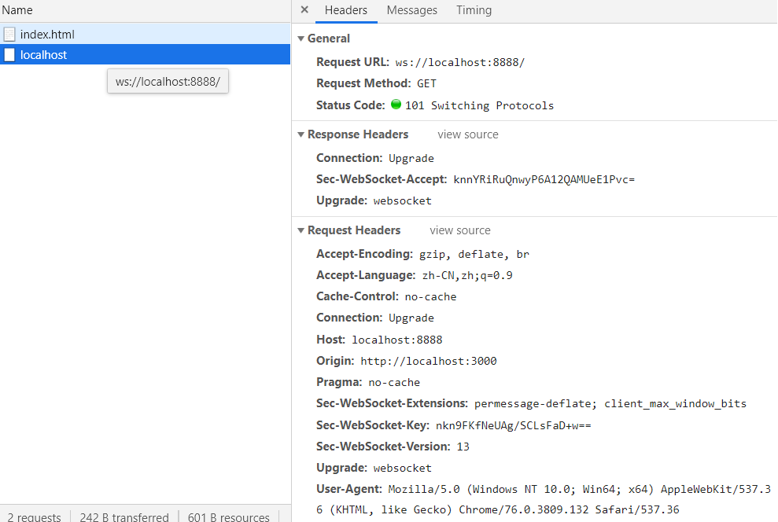

# 传输的方式

## 应用场景： 

聊天 弹幕 股票 客服系统 游戏 canvas版的你画我猜

## HTTP协议

应用层协议，基于TCP协议。

### 轮询

缺点：一个客户端每秒请求一次，多个客户端的请求量太大，服务器负载大

```html
<div id="clock"></div>
<script>
    let clock = document.querySelector("#clock")
    // 轮询 每秒向服务器发送请求一次
    setInterval(() => {
        let xhr = new XMLHttpRequest()
        xhr.open("GET", "/clock", true)
        xhr.onreadystatechange = function() {
            if (xhr.readyState == 4 && xhr.status == 200) {
                console.log(xhr.responseText)
                clock.innerHTML = xhr.responseText
            }
        }
        xhr.send()
    }, 1000)
</script>
```

```javascript
let express = require('express')
let app = express();

app.use(express.static(__dirname));

app.get('/clock', function (req, res) {
  res.send(new Date().toLocaleString())
})

app.listen(8000, function () {
  console.log('server is running')
})
```

### 长轮询

默认http超时时间大概是2分钟，如果在两分钟没响应就会自动断开，当然也可以自行设置超时时间。

http没有重连机制的，这样断开会出现问题。

数据回来之后再发请求，服务器做等待处理。

```html
<div id="clock"></div>
<script>
    let clock = document.querySelector("#clock")
    // 长轮询
    function send() {
        let xhr = new XMLHttpRequest()
        xhr.open("GET", "/clock", true)
        xhr.onreadystatechange = function() {
            if (xhr.readyState == 4 && xhr.status == 200) {
                console.log(xhr.responseText)
                clock.innerHTML = xhr.responseText
                send(); // 什么时候数据回来了，再发起下一次请求
            }
        }
        xhr.send()
    }
    send();
</script>
```

```javascript
let express = require('express')
let app = express();

app.use(express.static(__dirname));

app.get('/clock', function (req, res) {
    let $timer = setInterval(() => {
        let date = new Date();
        let seconds = date.getSeconds();
        if (seconds % 5 === 0) {
            res.send(date.toLocaleString())
            clearInterval($timer)
        }
    }, 1000);
})

app.listen(8000, function () {
    console.log('server is running')
})
```

### iframe流

iframe向服务端请求，服务端一直write，不end。虽然可以持续拿到数据，但是这个请求并没有断开，页面会出现持续加载，体验很不友好。

```html
<div id="clock" style="height:200px;border:1px solid #ccc;"></div>
<iframe src="/clock" frameborder="0"></iframe>
<script>
    function setTime(ts) {
        document.querySelector("#clock").innerHTML = ts;
    }
</script>
```

```javascript
let express = require('express')
let app = express();

app.use(express.static(__dirname));

app.get('/clock', function (req, res) {
  res.header('Content-Type', 'text/html')
  // 向客户端发送一段js脚本
  // parent就是页面中的window，使用parent就可以使用外面定义的方法和变量了
  // send是写入并关闭（write和end两个方法），放在定时器中并不会每秒做出响应
  setInterval(() => {
    // 此时用send就不行了，只能写（write）不能关闭（end）,一直做出响应，永远不断开
    res.write(`
      <script>
        console.log(parent)
        parent.setTime("${new Date().toLocaleString()}")
      </script>
    `)
  }, 1000);
})

app.listen(8000, function () {
  console.log('server is running')
})

```

### EventSource流

**不能跨域**。

标签页不会出现持续加载的不友好体验，同时比轮询和长轮询减少了请求次数，中间的连接是持续的，不会中断。轮询和长轮询会持续发请求。

webpack中的热更新用的就是EventSource，每次改变源码不需要手动刷新页面，会自动把代码更改的部分替换掉原来的部分。

```html
<div id="clock"></div>
<script>
    let eventSource = new EventSource("/clock")
    let clock = document.querySelector("#clock")
    // 监听服务器发过来的消息
    // 事件名是服务器自定义的
    eventSource.onopen = function(event) {
        console.log(event)
        let message = event.data
        clock.innerHTML = message
    }
    // 监听连接请求失败的错误事件
    eventSource.onerror = function() {}
</script>
```

```javascript
let express = require('express')
let app = express();

let counter = 0;
app.use(express.static(__dirname));

app.get('/clock', function (req, res) {
    res.header('Content-Type','text/event-stream')
    let $timer = setInterval(() => {
        // 最后要加\n\n代表结束
        res.write(`id:${counter++}\nevent:open\ndata:${new Date().toLocaleString()}\n\n`)
    }, 1000);
    // 每次刷新页面会断开连接，再次连接。但定时器没有销毁，id传出的值会counter++多次，几个定时器就会累加几次。所以要销毁。
    // close事件：当服务器关闭时触发。
    res.on('close',function(){
        clearInterval($timer)
    })
})

app.listen(8000, function () {
    console.log('server is running')
})
```

## websocket

应用层协议，它基于TCP传输协议，并复用HTTP的握手通道。和HTTP是并行的关系。

优势：

- 支持双向通信，实时性更强。
- 更好的二进制支持。
- 较少的控制开销。连接创建后，ws客户端、服务端进行交换数据交换时，协议控制的数据包头部比较小。
- **可以跨域**

### 简单实现：利用`ws`启动一个websocket服务器

安装：`npm i ws`

```javascript
let express = require('express')
let app = express()
app.use(express.static(__dirname))

app.listen(3000)

let WebSockerServer = require('ws').Server;
// 起服务的端口号和websocket的端口号不能一样。跨域是肯定的，websocket本身也是支持跨域的。
let server = new WebSockerServer({ port: 8888 })
// socket 插座
// 监听连接
server.on('connection', function (socket) {
    console.log('2.服务器端监听到了客户端的连接')
    // 监听客户端发过来的消息
    socket.on('message', function (message) {
        console.log('4.服务端接收客户端连接过来的消息', message)
        // 发送消息
        socket.send('5.服务器说：' + message)
    })
})
```

```html
<script>
    let socket = new WebSocket("ws://localhost:8888")
    socket.onopen = function() {
        console.log("1.客户端将连接服务器")
        socket.send("3.客户端说")
    }
    socket.onmessage = function(event) {
        console.log("6." + event.data)
    }
</script>
```



`http状态码101`：切换协议成功。用websocket向服务器发请求第一次仍然是http协议，但请求到达服务器会切换到websocket协议。目前出现101只有websocket了。

Request Headers：

- Connection: Upgrade 连接的协议要升级
- Upgrade: websocket 要升级成websocket协议
- Sec-WebSocket-Version: 13 要升级的websocket协议的版本号
- Sec-WebSocket-Key: nkn9FKfNeUAg/SCLsFaD+w== 通过websocket协议传递key给websocket服务器，服务器通过固定的算法响应一个key，如果响应回的key是浏览器想要的，那就切换协议成功。

Response Headers：

- Connection: Upgrade 连接的协议要升级
- Upgrade: websocket 要升级成的协议
- Sec-WebSocket-Accept: knnYRiRuQnwyP6A12QAMUeE1Pvc= 响应的key，浏览器识别之后，就会升级成websocket协议，没有识别就会升级协议失败。

### 手写websocket服务器

- 浏览器识别websocket服务器生成key的算法过程

按照sha1算法，把初始key和'258EAFA5-E914-47DA-95CA-C5AB0DC85B11'字符串拼接进行base64转换，生成新的key

```javascript
let key = 'nkn9FKfNeUAg/SCLsFaD+w==';
// 'knnYRiRuQnwyP6A12QAMUeE1Pvc='; // 看结果是否是该key
const CODE = '258EAFA5-E914-47DA-95CA-C5AB0DC85B11';
let crypto = require('crypto');
let result = crypto.createHash('sha1').update(key + CODE).digest('base64');
console.log(result);
```

要知道TCP协议，TCP协议的握手过程

```html
<script>
    let socket = new WebSocket("ws://localhost:9999")
    socket.onopen = function() {
        console.log("1.客户端将连接服务器")
        socket.send("3.客户端说")
    }
    socket.onmessage = function(event) {
        console.log("6." + event.data)
    }
</script>
```

起服务

```javascript
let express = require('express')
let app = express()
app.use(express.static(__dirname))

app.listen(3000)
```

另起一个websocket服务

```javascript
// 启动一个TCP协议的服务器 模拟握手
// 复用了HTTP的过程
let net = require('net')
const CODE = '258EAFA5-E914-47DA-95CA-C5AB0DC85B11';
let crypto = require('crypto');
let server = net.createServer(function (socket) {
    // once来自于EventEmitter
    // on 每次都会执行
    // once 只会执行一次
    socket.once('data', function (data) {
        data = data.toString();
        if (data.match(/Connection: Upgrade/)) {
            let rows = data.split('\r\n'); // 拆分成数组
            rows = rows.slice(1, -2); // 数组截取
            let headers = {};
            rows.reduce((memo, item) => {
                let [key, value] = item.split(': '); // 数组中的每一项都有: 冒号空格，将其前后拆分成key,value
                memo[key] = value;
                return memo;
            }, headers)
            console.log(headers);
            if (headers['Sec-WebSocket-Version'] == '13') {
                let SecWebSocketKey = headers['Sec-WebSocket-Key'];
                let SecWebSocketAccept = crypto.createHash('sha1').update(SecWebSocketKey + CODE).digest('base64');
                let response = [
                    'HTTP/1.1 101 Switching Protocols',
                    'Upgrade: websocket',
                    'Connection: Upgrade',
                    `Sec-WebSocket-Accept: ${SecWebSocketAccept}`,
                    '\r\n'
                ].join('\r\n'); // 响应字符串
                socket.write(response);
                // 后面所有的格式都是基于websocket协议的
                socket.on('data', function (buffers) { // data默认是一个Buffer
                    let fin = buffers[0] & 0b10000000 == 0b10000000; // 结束位是true还是false
                    let opcode = buffers[0] & 0b00001111; // 操作码
                    let isMask = buffers[1] & 010000000 == 0b10000000; // 是否进行了掩码
                    let payloadLength = buffers[1] & 0b0111111; // 后七位全是1
                    let mask = buffers.slice(2, 6); // 掩码键
                    let payload = buffers.slice(6); // 携带的真实数据
                    unmask(payload, mask); // 对数据进行反掩码
                    // payload = [h,e,l,l,o]
                    let response = Buffer.alloc(2 + payloadLength);
                    response[0] = 0b10000000 | opcode;
                    response[1] = payloadLength;
                    payload.copy(response, 2);
                    console.log(response);
                    socket.write(response);
                })
            }
        }
    })
});
function unmask (payload, mask) {
    for (let i = 0; i < payload.length; i++) {
        payload[i] ^= mask[i % 4];
    }
}
server.listen(9999);


/*
【请求行】
GET ws://localhost:8888/ HTTP/1.1 \r\n
【请求头】
Connection: Upgrade\r\n
Upgrade: websocket\r\n
Sec-WebSocket-Version: 13\r\n
Sec-WebSocket-Key: nkn9FKfNeUAg/SCLsFaD+w==\r\n
\r\n
【无请求体】：因为没有请求体 有两个空行就结束了
 */
/*
【响应行】
HTTP/1.1 101 Switching Protocols\r\n
【响应头】
Upgrade: websocket\r\n
Connection: Upgrade\r\n
Sec-WebSocket-Accept: knnYRiRuQnwyP6A12QAMUeE1Pvc=\r\n
【无响应体】
*/
```

## socket.io

IE9才出现websocket，为了做兼容，socket.io做处理了。

`socket.io`是一个WebSocket库，包括了客户端的js和服务器端的nodejs，它的目标是构建可以在不同浏览器和移动设备上使用的实时应用。

### socket.io的特点

- 易用性：socket.io封装了服务端和客户端，使用起来非常简单方便。
- 跨平台：socket.io支持跨平台，这就意味着你有了更多的选择，可以在自己喜欢的平台下开发实时应用。
- 自适应：它回自动根据浏览器从WebSocket、AJAX长轮询、iframe流等等各种方式中选择最佳的方式来实现网络实时应用，非常方便和人性化，而且支持的浏览器最低达IE5.5。

### 初步使用

#### 安装部署

使用npm安装socket.io

```javascript
$ npm install socket.io
```

#### 启动服务

创建 `app.js` 文件

```javascript
var express = require('express');
var path = require('path');
var app = express();

app.get('/', function (req, res) {
    res.sendFile(path.resolve('index.html'));
});

var server = require('http').createServer(app);
var io = require('socket.io')(server);

io.on('connection', function (socket) {
    console.log('客户端已经连接');
    socket.on('message', function (msg) {
        console.log(msg);
        socket.send('sever:' + msg);
    });
});
server.listen(80);
```

#### 客户端引用

服务端运行后会在根目录动态生成socket.io的客户端js文件 客户端可以通过固定路径`/socket.io/socket.io.js`添加引用
客户端加载socket.io文件后会得到一个全局的对象io
`connect`函数可以接受一个`url`参数，url可以socket服务的http完整地址，也可以是相对路径，如果省略则表示默认连接当前路径

创建index.html文件

```html
<script src="/socket.io/socket.io.js"></script>
<script>
 window.onload = function(){
    const socket = io.connect('/');
    //监听与服务器端的连接成功事件
    socket.on('connect',function(){
        console.log('连接成功');
    });
    //监听与服务器端断开连接事件
    socket.on('disconnect',function(){
       console.log('断开连接');
    });
 };
</script>
```

#### 发送消息

成功建立连接后，我们可以通过`socket`对象的`send`函数来互相发送消息 修改index.html

```javascript
var socket = io.connect('/');
socket.on('connect',function(){
   //客户端连接成功后发送消息'welcome'
   socket.send('welcome');
});
//客户端收到服务器发过来的消息后触发
socket.on('message',function(message){
   console.log(message);
});
```

修改app.js

```javascript
var io = require('scoket.io')(server);
io.on('connection',function(socket){
  //向客户端发送消息
  socket.send('欢迎光临');
  //接收到客户端发过来的消息时触发
  socket.on('message',function(data){
      console.log(data);
  });
});
```

### 深入分析

#### send方法

- `send`函数只是`emit`的封装
- `node_modules\socket.io\lib\socket.js`源码

```javascript
function send(){
  var args = toArray(arguments);
  args.unshift('message');
  this.emit.apply(this, args);
  return this;
}
```

`emit`函数有两个参数

- 第一个参数是自定义的事件名称,发送方发送什么类型的事件名称,接收方就可以通过对应的事件名称来监听接收
- 第二个参数是要发送的数据

#### 服务端事件

| 事件名称   | 含义                   |
| ---------- | ---------------------- |
| connection | 客户端成功连接到服务器 |
| message    | 接收到客户端发送的消息 |
| disconnect | 客户端断开连接         |
| error      | 监听错误               |

#### 客户端事件

| 事件名称   | 含义                   |
| ---------- | ---------------------- |
| connect    | 成功连接到服务器       |
| message    | 接收到服务器发送的消息 |
| disconnect | 客户端断开连接         |
| error      | 监听错误               |

### 划分命名空间

#### 服务器端划分命名空间

- 可以把服务分成多个命名空间，默认`/`,不同空间内不能通信

```javascript
io.on('connection', function (socket) {
    //向客户端发送消息 
    socket.send('/ 欢迎光临'); //接收到客户端发过来的消息时触发 
    socket.on('message', function (data) {
        console.log('/' + data);
    });
});
io.of('/news').on('connection', function (socket) { //向客户端发送消息 
    socket.send('/news 欢迎光临');
    //接收到客户端发过来的消息时触发
    socket.on('message', function (data) {
        console.log('/news ' + data);
    });
});
```

#### 客户端连接命名空间

```javascript
window.onload = function(){
    var socket = io.connect('/');
    //监听与服务器端的连接成功事件
    socket.on('connect',function(){
        console.log('连接成功');
        socket.send('welcome');
    });
    socket.on('message',function(message){
        console.log(message);
    });
    //监听与服务器端断开连接事件
    socket.on('disconnect',function(){
        console.log('断开连接');
    });

    var news_socket = io.connect('/news');
    //监听与服务器端的连接成功事件
    news_socket.on('connect',function(){
        console.log('连接成功');
        socket.send('welcome');
    });
    news_socket.on('message',function(message){
        console.log(message);
    });
    //监听与服务器端断开连接事件
    news_socket.on('disconnect',function(){
        console.log('断开连接');
    });
};
```

### 房间

- 可以把一个命名空间分成多个房间，一个客户端可以同时进入多个房间。
- 如果在大厅里广播 ，那么所有在大厅里的客户端和任何房间内的客户端都能收到消息。
- 所有在房间里的广播和通信都不会影响到房间以外的客户端

#### 进入房间

```javascript
socket.join('chat');//进入chat房间
```

#### 离开房间

```javascript
socket.leave('chat');//离开chat房间
```

### 全局广播

广播就是向多个客户端都发送消息

#### 向大厅和所有人房间内的人广播

```javascript
io.emit('message','全局广播');
```

#### 向除了自己外的所有人广播

```javascript
socket.broadcast.emit('message', msg);
socket.broadcast.emit('message', msg);
```

### 房间内的广播

#### 向房间内广播（包含自己）

从服务器的角度来提交事件,提交者会包含在内

```js
//2. 向myroom广播一个事件，在此房间内包括自己在内的所有客户端都会收到消息
io.in('myroom').emit('message', msg);
io.of('/news').in('myRoom').emit('message',msg);
```

#### 向房间内广播（排除自己）

从客户端的角度来提交事件,提交者会排除在外

```js
//2. 向myroom广播一个事件，在此房间内除了自己外的所有客户端都会收到消息
socket.broadcast.to('myroom').emit('message', msg);
socket.broadcast.to('myroom').emit('message', msg);
```

#### 获取房间列表

```javascript
io.sockets.adapter.rooms
```

#### 获取房间内的客户id值

取得进入房间内所对应的所有sockets的hash值，它便是拿到的`socket.id`

```js
let roomSockets = io.sockets.adapter.rooms[room].sockets;
```

## 聊天室

- 创建客户端与服务端的websocket通信连接
- 客户端与服务端相互发送消息
- 添加用户名
- 添加私聊
- 进入/离开房间聊天
- 历史消息

index.html

```html
<head>
    <title>聊天室</title>
    <link
          rel="stylesheet"
          href="https://cdn.jsdelivr.net/npm/bootstrap@3.3.7/dist/css/bootstrap.min.css"
          integrity="sha384-BVYiiSIFeK1dGmJRAkycuHAHRg32OmUcww7on3RYdg4Va+PmSTsz/K68vbdEjh4u"
          crossorigin="anonymous"
          />
    <style>
        .user {
            color: green;
            cursor: pointer;
        }
    </style>
</head>

<body>
    <div class="container" style="margin-top:30px;">
        <div class="row">
            <div class="panel panel-default">
                <div class="panel-heading">
                    <h2 class="text-center">欢迎光临聊天室</h2>
                    <div class="row">
                        <div class="col-xs-6 text-center">
                            <button
                                    class="btn btn-danger"
                                    id="joinRed"
                                    onclick="join('Red')"
                                    >
                                进入红房间
                            </button>
                            <button
                                    style="display:none;"
                                    class="btn btn-danger"
                                    id="leaveRed"
                                    onclick="leave('Red')"
                                    >
                                离开红房间
                            </button>
                        </div>
                        <div class="col-xs-6 text-center">
                            <button
                                    class="btn btn-success"
                                    id="joinGreen"
                                    onclick="join('Green')"
                                    >
                                进入绿房间
                            </button>
                            <button
                                    style="display:none;"
                                    class="btn btn-success"
                                    id="leaveGreen"
                                    onclick="leave('Green')"
                                    >
                                离开绿房间
                            </button>
                        </div>
                    </div>
                </div>
                <div class="panel-body">
                    <ul
                        style="height:300px;overflow-y: scroll;"
                        onclick="clickUser(event)"
                        class="list-group"
                        id="messageList"
                        ></ul>
                </div>
                <div class="panel-footer">
                    <div class="row">
                        <div class="col-md-10">
                            <input
                                   id="textMsg"
                                   onkeyup="handleKeyUp(event)"
                                   type="text"
                                   class="form-control"
                                   />
                        </div>
                        <div class="col-md-2">
                            <button
                                    onclick="sendMsg()"
                                    id="sendBtn"
                                    class="btn btn-primary"
                                    >
                                发言
                            </button>
                        </div>
                    </div>
                </div>
            </div>
        </div>
    </div>
    <script src="/socket.io/socket.io.js"></script>
    <script src="https://cdn.bootcss.com/moment.js/2.24.0/moment.js"></script>
    <script src="https://cdn.bootcss.com/moment.js/2.24.0/locale/zh-cn.js"></script>
    <script>
        let textMsg = document.querySelector("#textMsg")
        let sendBtn = document.querySelector("#sendBtn")
        let messageList = document.querySelector("#messageList")

        // let socket = io("/"); 这样也可以
        let socket = io.connect("/")
        /* 监听服务器connect连接事件 */
        socket.on("connect", function() {
            /* 连接成功之后，给服务器发送一个getAllMessages事件，用于获取历史记录 */
            socket.emit("getAllMessages")
        })

        socket.on("allMessages", function(messages) {
            let html = messages
            .map(
                msgObj => `<li class="list-group-item">${getMessage(msgObj)}</li>`
            )
            .join("")
            messageList.innerHTML = html
            messageList.scrollTop =
                messageList.scrollHeight - messageList.clientHeight // 聊天内容在底端(ul元素的高度-ul可视区域的高就是顶部翻去的高度)
        })
        function getMessage(msgObj) {
            return `<span class="user">${msgObj.username}</span>:${
            msgObj.content
        }<span class="pull-right">${moment(msgObj.createAt).fromNow()}</span>`
        }
        socket.on("message", function(msgObj) {
            let li = document.createElement("li")
            li.innerHTML = getMessage(msgObj)
            li.className = "list-group-item"
            messageList.appendChild(li)
            messageList.scrollTop =
                messageList.scrollHeight - messageList.clientHeight
        })
        /* socket.on("disconnect", function () {
      console.log('断开连接')
    }) */
        function handleKeyUp(event) {
            if (event.keyCode == 13) {
                sendMsg()
            }
        }
        // 点击发送或者回车发送消息
        function sendMsg() {
            let content = textMsg.value
            if (content.trim()) {
                // send也相当于emit('message',content)
                /* 给服务器监听的message事件发送消息内容 */
                socket.send(content)
                textMsg.value = ""
            } else {
                alert("消息不能为空")
            }
        }
        // 点击人名可以发起私聊
        function clickUser(event) {
            // 事件委托 从外向内
            if (event.target.className == "user") {
                // 把@[人名] 写入输入框中，发送消息会带入@[人名]，服务器进行判断解析，进行私聊
                textMsg.value = `@${event.target.innerText} `
            }
        }

        // 加入房间点击事件
        function join(roomName) {
            /* 发送给服务器join事件，让我的服务器端的socket进入到某个房间内 */
            socket.emit("join", roomName)
        }

        /* 监听服务器joined事件，加入房间，切换按钮变化 */
        socket.on("joined", function(roomName) {
            let joinBtn = document.querySelector("#join" + roomName)
            let leaveBtn = document.querySelector("#leave" + roomName)
            joinBtn.style.display = "none"
            leaveBtn.style.display = "inline-block"
        })

        // 离开房间点击事件
        function leave(roomName) {
            /* 发送给服务器leave事件，在服务器中把房间名删除，并且把用户的socket退出某个房间 */
            socket.emit("leave", roomName)
        }
        /* 监听服务器leaved事件，离开房间。要把按钮切换回来 */
        socket.on('leaved',function(roomName){
            let joinBtn = document.querySelector("#join" + roomName)
            let leaveBtn = document.querySelector("#leave" + roomName)
            joinBtn.style.display = "inline-block"
            leaveBtn.style.display = "none"
        })
    </script>
</body>
```

app.js

```js
let express = require('express');
let app = express();
app.use(express.static(__dirname));
let { Message } = require('./db');
let server = require('http').createServer(app);
let io = require('socket.io')(server);
let SYSTEM = '系统';
let sockets = {};
// io.of('/').on() 默认命名空间就是/，不写就是默认
/* 监听客户端的连接事件，当客户端连接上来后，执行回调函数 */
io.on('connection', async function (socket) {
    let username;
    let rooms = []; // 代表此客户端进入的所有房间

    /* 监听getAllMessages事件，客户端要获得聊天记录 */
    socket.on('getAllMessages', async function () {
        // 从MongDB数据库中把数据取出
        let messages = await Message.find().sort({ createAt: -1 }).limit(10);
        messages.reverse();
        /* 给客户端发送allMessages事件，并把之前的聊天记录返回 */
        socket.emit('allMessages', messages)
    })

    /* 监听客户端的join事件，触发后将该用户的socket加入到指定的房间名 */
    socket.on('join', function (roomName) {
        // 获取房间名在房间数组中的索引，没有返回-1
        let index = rooms.indexOf(roomName);
        if (index == -1) {
            rooms.push(roomName);
            socket.join(roomName);
            socket.emit('joined', roomName);
        }
    })

    /* 监听客户端离开房间leave事件 */
    socket.on('leave', function (roomName) {
        let index = rooms.indexOf(roomName);
        if (index != -1) {
            rooms.splice(index, 1) // 在数组中删除这个房间名
            socket.leave(roomName); // leave是socket提供的方法
            /* 给客户端发送事件 */
            socket.emit('leaved', roomName)
        }
    })

    /* 监听客户端message事件的消息 */
    socket.on('message', async function (content) {
        // 全体广播io.emit
        if (username) { // 已经在聊天室中
            let result = content.match(/@([^ ]+) (.+)/);
            if (result) { // 私聊
                let toUser = result[1];
                let toContent = result[2];
                let toSocket = sockets[toUser];
                toSocket && toSocket.emit('message', getMsg(toContent, username))
            } else { // 公聊
                // 如果在大厅说话，则所有的人都能听到，包括其他大厅的人和所有房间的人
                let savedMessage = await Message.create(getMsg(content, username));
                if (rooms.length > 0) {
                    // 循环所有的房间
                    rooms.forEach(room => {
                        io.in(room).emit('message', savedMessage)
                    })
                } else {
                    io.emit('message', savedMessage)
                }
            }
        } else { // 第一次进入聊天 设置名字
            let hasSocket = sockets[content];
            if (hasSocket) { // 防止名字冲突
                socket.emit('message', getMsg(`${content}已经被占用，请换一个用户名吧`))
            } else { // 设置名字 并保存名字和socket
                username = content; // 把这个消息的内容设置为当前用户的用户名
                // 把用户名和对应的socket对象进行关联
                sockets[username] = socket;
                // socket.broadcast.emit 除了自己告诉其他人
                socket.broadcast.emit('message', getMsg(`${username}加入聊天室`))
            }
        }
    })
})

server.listen(4000);
function getMsg (content, username = SYSTEM) {
    return { username, content, createAt: new Date() }
}
```

db.js

```js
let mongoose = require('mongoose');
let conn = mongoose.createConnection('mongodb://localhost/chat', { useNewUrlParser: true, useUnifiedTopology: true }); // 端口号不写默认27017
let MessageSchema = new mongoose.Schema({
    username: String,
    content: String,
    createAt: { type: Date, default: Date.now }
});
let Message = conn.model('Message', MessageSchema);
module.exports = { Message }
```

