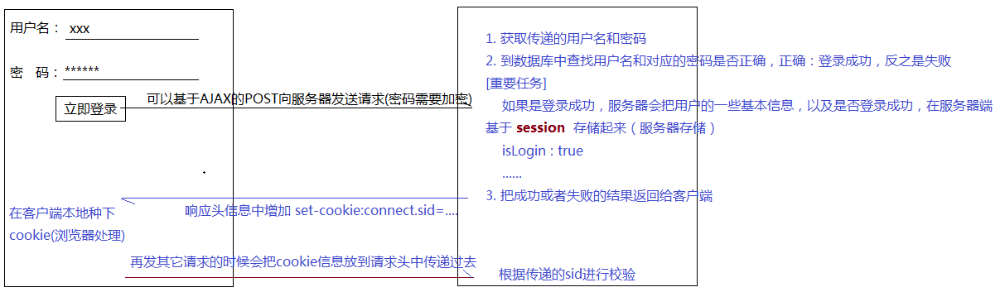
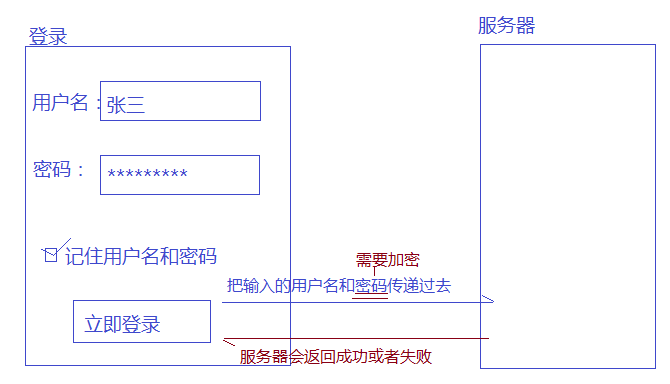
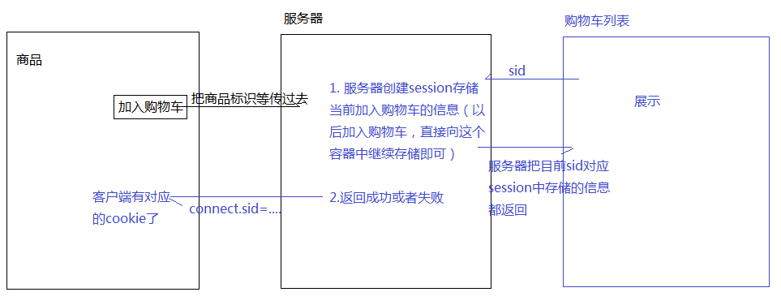

# 存储方案

## 本地存储和服务器存储

### 本地存储

本地存储：把一些信息存储到客户端本地（主要目的有很多，其中有一个就是实现多页面之间的信息共享）

- 离线缓存：`xxx.manifest`H5处理离线缓存还是存在一些硬伤的，所以真是项目中一般还是传统的native app来完成这件事情

- `localStorage`/`sessionStorage`：H5中新增加的API，基于这个API可以把一些数据缓存到客户端本地（常用）

- `IndexedDB`/`webSQL`：本地数据库存储
- `Cookie`：本地信息存储（常用）
- `CacheStorage`/`ApplicationCache`：本地缓存存储
- ...

### session和cookie的关联

1. session是服务器存储，cookie是客户端存储
2. 在服务器端建立session之后，服务器和当前客户端之间会建立一个唯一的标识（sessionID/sid），而本次存储的session信息都存放到对应的sid下（目的是为了区分不同客户端都在服务器上建立session信息，后期查找的时候，可以找到自己当初建立的）
3. 当服务器端把一些成功或者失败的结果返回给客户端的时候，在响应头信息中会增加set-cookie（客户端的cookie）字段，把connect.sid存储到客户端的cookie信息中
   `set-cookie:connect.sid=s%3A065ap33FesyPQUQD0nszBFmXkW6c9EXJ.c%2FnxNtN6d%2F9Mv0oNvur51u3zK4vtIvzYSz%2BRrIDOdQw; Path=/; Expires=Tue, 17 Jul 2018 03:11:54 GMT; HttpOnly`
   `HttpOnly`规定当前的cookie信息只能获取使用,但是不能修改
4. 当客户端在向服务器发送任何请求的时候，在请求头中，都会把Cookie信息带上，传递给服务器（包含了之前存储的connect.sid信息）
   `Cookie:...;connect.sid=s%3A065ap33FesyPQUQD0nszBFmXkW6c9EXJ.c%2FnxNtN6d%2F9Mv0oNvur51u3zK4vtIvzYSz%2BRrlDOdQw`

### 应用场景

#### 页面之间信息的通信

**知识点**：

- 本地存储都是存储到当前浏览器指定的地方
  在谷歌浏览器中存储的信息，在IE浏览器中获取不到，**本地存储信息无法跨浏览器进行传输**

- 存储的信息是按照域来管理的
  访问京东网站，把信息都存储到了jd.com中，其他域的网站中是无法直接获取这些信息的，**本地存储不能直接跨域访问**

**场景**：

- 登录/注册

真实项目中的登录注册，是基于session服务器存储的登录信息，而不是本地存储（因为本地存储不安全：明文存储，直接在浏览器的控制台就可以看到）



- 记住用户名和密码（或者自动登录）
  如果登录成功：

  1. 把用户名和密码（经过加密的）存储到客户端本地
  2. 登录成功可能会跳转到其他页面
  3. 以后重新打开这个网站，首先看一下本地存储的信息中是否有用户名和密码，如果有（记住用户名和密码功能在），直接拿本地的信息向服务器发送请求，完成登录操作（类似于登录页面点击登录按钮）。成功该干嘛干嘛，如果拿本地存储的信息模拟登录失败，就跳转到登录页，重新登录即可。
  4. 重新打开登录页面，我们需要先从本地把信息获取到，把信息存放到对应的文本框中...

  

- 有A、B两个页面，A页面中有一个列表，点击列表中的每一项，跳转到B页面（详情页面），在B页面需要知道点击的是A中的哪条数据，从而展示不同的信息
  **解决方案**：URL问号传参：'B.html?xxx=xxx'进入到B页面，首先把传递的参数获取到，根据传递的不同，我们从服务器端获取不同的数据，从而展示不同的内容，获取：`window.location.search`
  **前提**：需要A中的某个操作可以跳转到B页面，此时才可以问号传参
- 比如加入购物车，再进入购物车之前，可以在商品页面把商品加入购物车，在没有进入购物车页面之前，添加商品的信息是存储到浏览器中的，进入购物车页面之后，购物车页面从浏览器中获取数据。
  
  以上是未登录状态，如果是登录状态
  未登录状态下加入购物车的信息（session中存储），在登录后，都要先保存到数据库中，然后再把session信息清除
  数据库 shopList数据表
  id userId productId count ...
  1    102         304         1      ...
  ...
  数据库存储的目的是为了实现购物信息的跨平台共享
- 跳转到其他页面，返回上级页面的时候停留在之前最后一次点击的位置

#### 做一些性能优化

把一些不经常改变的数据，在第一次从服务器端获取到之后，存储到客户端本地（记录一个存储时间），假设我们设置有效存储期是10分钟，那么10分钟以内，我们刷新页面，就不用再向服务器发送请求了，直接从本地数据中获取展示即可：超过10分钟，重新想服务器发送请求，请求回来最新数据参考第一次，也一样存储到本地中...

- 减轻服务器压力
- 对于不经常更新的数据我们可以吧存储周期设置的长一些，有助于页面第二次渲染的时候，加快渲染的速度（移动端经常做这些事情）

## localStorage和cookie

真实项目中使用本地存储来完成一些需求的情况不是很多，一般都是基于服务器的session或者数据库存储完成的（服务器的session和本地的cookie是有关联的）。

如果不考虑兼容，就像基于本地存储来完成一些事情，那么一般都是用localStorage的（尤其是移动端开发）

### localStorage

特点：

1. 不兼容IE8及以下
2. 有存储限制，一个源下最多只能存储5MB左右
3. 本地永久存储，只要不手动删除，永远存储在本地。但是我们可以基于API，`removeItem/clear`手动清除一些自己想要删除的信息
4. 杀毒软件或者浏览器的垃圾清理暂时不会清除localStorage（谷歌浏览器会清除localStorage等信息）
5. 在隐私或者无痕浏览模式下，是记录localStorage的
6. localStorage和服务器没有任何关系

用法：

`localStorage.setItem([key],[value])`：[value]必须是字符串格式的（即使写的不是字符串，也会默认转换为字符串）

`localStorage.getItem([key])`：通过属性名获取存储的信息

`localStorage.removeItem([key])`：删除指定的存储信息

`localStorage.clear()`：清除当前域下存储的所有信息

`localStorage.key(0)`：基于索引获取指定的key名

### cookie

特点：

1. 兼容所有的浏览器
2. 有存储的大小限制，一般一个源（一个域）只能存储4KB内容，一个中文汉字2B，英文字母或者数字1B。
3. 有过期时间，我们可以自己手动设置这个时间
4. 杀毒软件或者浏览器的垃圾清理都可能会把cookie信息强制清除掉
5. 在隐私或者无痕浏览模式下，是不记录cookie的
6. cookie不是严格的本地存储，因为要和服务器之间来回传输

用法：

`document.cookie=''`：设置cookie

cookie封装的js库

删除cookie的原理，就是把过期时间设置为现在时间之前，就会自动删除。

```javascript
let cookie = (function () {
    let setValue = (name, value, expires = (new Date(new Date().getTime() + (1000 * 60 * 60 * 24))), path = '/', domain = '') => {
        document.cookie = `${name}=${escape(value)};expires=${expires.toGMTString()};path=${path};domain=${domain}`;
    };

    let getValue = name => {
        let cookieInfo = document.cookie,
            reg = new RegExp(`(?:^| )${name}=([^;]*)(?:;|$)`),
            ary = cookieInfo.match(reg);
        return ary ? unescape(ary[1]) : null;
    };

    let removeValue = (name, path = '/', domain = '') => {
        let value = getValue(name);
        if (value) {
            document.cookie = `${name}= ;path=${path};domain=${domain};expires=Fri,02-Jan-1970 00:00:00 GMT`;
        }
    };

    return {
        set: setValue,
        get: getValue,
        remove: removeValue
    }
})();
```

## sessionStorage

sessionStorage和session没有任何关系，是两种东西。

sessionStorage和localStorage差不多。localStorage是永久存储，sessionStorage是临时存储，浏览器关闭就清除了。