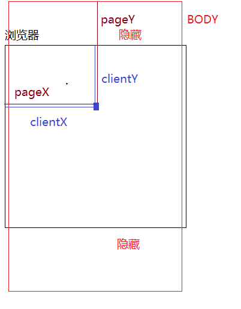

# 事件和事件委托

## 事件的理论基础

【DOM事件】

window也可以理解为DOM，window.onload指页面元素加载结束执行的行为，也相当于DOM

- 1、什么是事件

事件就是一件事情或者一个行为（对于元素来说，它的很多事件都是天生自带的），只要我们去操作这个元素，就会触发这些行为

“事件就是元素天生自带的行为，我们操作元素，就会触发相关的事件行为“

- 2、事件绑定：给元素天生自带的事件行为绑定方法，当事件触发，会把对应的方法执行
- 3、元素天生自带的事件有哪些？
  - [鼠标事件]
    - click：点击（PC端是点击，移动端的click代表单击。**移动端使用click会有300ms延迟的问题**。只要按下去就是点击，单击是一段时间内只能点一下。因为还有双击。）
    - dblclick：双击
    - mouseover：鼠标经过
    - mouseout：鼠标移出
    - mouseenter：鼠标进入
    - mouseleave：鼠标离开
    - mousemove：鼠标移动
    - mousedown：鼠标按下（鼠标左右键都起作用，它是按下就触发，click是按下抬起才会触发，而且 是先把down和up触发，才会触发click）
    - mousewheel：鼠标滚轮滚动
    - ...
  - [键盘事件]
    - keydown：键盘按下
    - keyup：键盘抬起
    - keypress：和keydown类似，只不过keydown返回的是 键盘码，keypress返回的是ASCII码值
    - input：由于 PC端有实体物理键盘，可以监听到键盘的按下和抬起，但是移动端是虚拟的键盘，所以keydown和keyup再大部分手机上都没有，我们使用input事件统一代替他们（内容改变事件）
  - [表单元素常用的事件]
    - focus：获取焦点
    - blur：失去焦点
    - change：内容改变
    - ...
  - [其他常用事件]
    - load：加载完成
    - unload：页面关闭
    - beforeunload：页面关闭之前
    - scroll：滚动条滚动事件
    - size：大小改变事件 `window.onsize=function(){}当浏览器窗口大小发生改变，会触发这个事件，执行对应的事情`
    - ...
  - [移动端手指事件] touch单手指操作模型、gesture多手指操作模型
    - touchstart：手指按下
    - touchmove：手指移动
    - touchend：手指离开
    - touchcancel：因为意外情况导致手指操作取消
    - gesturestart：手指按下
    - gesturechange：手指改变
    - gestureend：手指离开
    - ...
  - [H5中的audio/video音视频事件]
    - canplay：可以播放（播放过程中可能出现由于资源没有加载完成，导致的卡顿）
    - canplaythrough：资源加载完成，可以正常无障碍播放
    - ...

## 事件对象中常用的属性

事件绑定：

- DOM0级事件绑定
  - `[element].onxxx=function(){}`
- DOM2级事件绑定
  - `[element].addEventListener('xxx',function(){},false)`第三个参数是冒泡还是捕获阶段
  - `[element].attachEvent('onxxx',function(){})`IE6~8

目的：给当前元素的某个事件绑定方法（不管是基于DOM0还是DOM2），都是为了触发元素的相关行为的时候，能做点事情（也就是把绑定的方法执行）；”不仅把方法执行了，而且浏览器还给方法传递了一个实参信息值 ==> 这个值就是事件对象“

```html
<div id="box"></div>
<input type="text" id="textInp">
<script>
    let oBox = document.getElementById('box')
    // 定义一个形参ev用来接收方法执行的时候，浏览器传递的信息值（事件对象：MouseEvent鼠标事件对象、KeyboardEvent键盘事件对象、Event普通时间对象...）
    // 事件对象中记录了很多属性名和属性值，这些信息中包含了当前操作的基础信息，例如：鼠标点击位置的X/Y轴坐标，鼠标点击的是谁（事件源）等信息
    oBox.onclick = function(ev){
        console.log(ev);//MouseEvent鼠标事件对象
    }
    let textInp = document.getElementById('textInp')
    textInp.onkeydown = function (ev){
        console.log(ev);//KeyboardEvent键盘事件对象
    }
    window.onload=function(ev){
        console.log(ev);//Event普通事件对象
    }
</script>
```

事件对象常用的属性：

- [MouseEvent]
  - ev.target 事件源（操作的是哪个元素）
  - ev.clientX / ev.clientY 当前鼠标触发点距离当前窗口左上角的X/Y轴坐标
  - ev.pageX / ev.pageY 当前鼠标触发点距离BODY（第一屏幕）左上角的X / Y轴坐标
  - ev.preventDefault()  阻止默认行为
  - ev.stopPropagation()  阻止事件的冒泡传播
  - ev.type  当前事件类型（click）



- [KeyboardEvent]

  - ev.code  当前按键'keyE' 键盘按E键

  - ev.key  当前按键'e'

  - ev.which / ev.keyCode  当前按键的键盘码（IE用keyCode获取，火狐和Opera用的是which，谷歌两个都可以）

    ```
    let code = ev.which || ev.keyCode；// 兼容这么写
    ```

    - 常用的键盘码
      - 左-上-右-下：37-38-39-40
      - 回退Backspace：8
      - Enter：13
      - Space：32
      - Delete：46
      - Shift：16
      - Alt：18
      - Ctrl：17
      - ESC：27
      - F1~F12：112~123
      - 横向数字键0~9：48~57
      - 大小写都是a~z：65~90

  - ev.type  当前事件类型（keydown）

## 事件对象的兼容问题


## 默认行为及阻止


## 事件传播机制（很重要）


## mouseenter和mouseover的区别


## 【京东放大镜】结构样式和移动比例原理分析


## 【京东放大镜】基于JQ实现具体的功能


## 鼠标跟随实战案例


## 事件委托


## 分类导航


## 放大镜第二种写法-基于原生实现（左右盒子不同的宽度）


## 基于事件委托实现无限级折叠菜单