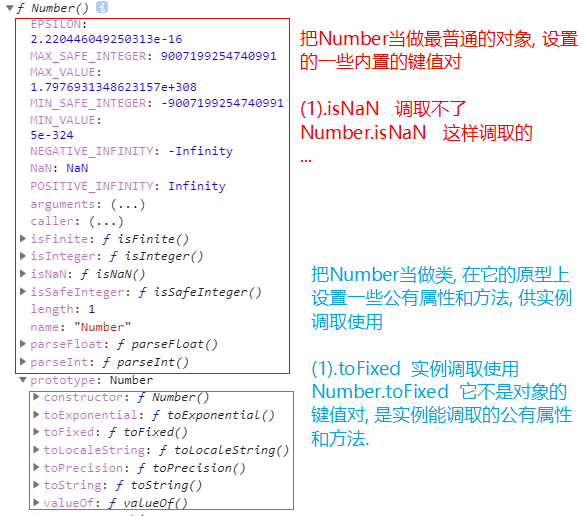
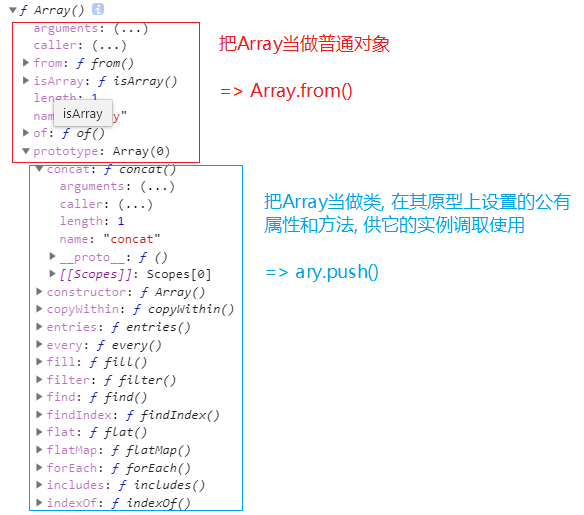
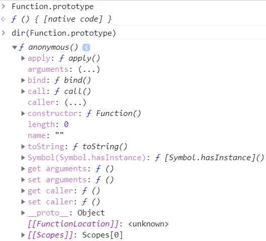

# 原型和THIS深入

## 原型深入-函数的三种角色

- 函数有三种角色:

> 1. 普通函数
>
>     堆栈内存释放
>
>     作用域链
>
> 2. 类
>
>     prototype: 原型
>
>     \__proto__: 原型链
>
>     实例
>
> 3. 普通对象
>
>     和普通的一个obj没啥区别, 就是对键值对的增删改查
>
>  关系: 三种角色间没有必然关系

```javascript
function Fn() {
    var n = 10;
    this.m = 100;
}
Fn.prototype.aa = function () {
    console.log('aa');
    
};
Fn.bb = function () {
    console.log('bb');
    
};
// 普通函数
// Fn(); // this: window  有一个私有变量n  和原型以及属性bb没有关系

// 构造函数执行
// var f = new Fn;
// console.log(f.n);//=> undefined n是私有变量和实例没有关系
// console.log(f.m);//=> 100 实例的私有属性
// f.aa();// 实例通过__proto__找到Fn.prototype上的方法
// console.log(f.bb);//=> undefined bb是把Fn当做一个普通对象设置的属性而已, 和实例等没有任何关系

// 普通对象
// Fn.bb();
```

- Number的两种角色
```javascript
console.dir(Number)
```



- Array的两种角色



- JQ类库中对象的键值对和原型写法

> JQ这个类库中提供了很多的方法, 其中有一部分是写在原型上的, 有一部分是把它当做普通对象来设置的

```javascript
~function () {
    function jQuery() {
        //...
        return [JQ实例]
    }
    jQuery.prototype.animate = function () {}
    //...
    jQuery.ajax = function () {}
    //...
    window.jQuery = window.$ = jQuery;
}();
$().ajax();//=> 调取不了
$().animate();//=> 这样可以调取
$.ajax();//=> 直接的对象键值对操作
$.animate();//=> 对象上没有animate这个属性, 这个属性在和实例相关的原型上
```

## 原型深入-基于阿里的面试题理解函数的三种角色

- 阿里超经典面试题（有难度)

```javascript
function Foo() {
    getName = function () {
        console.log(1);
    };
    return this;
}
Foo.getName = function () {
    console.log(2);
};
Foo.prototype.getName = function () {
    console.log(3);
};
var getName = function () {
    console.log(4);
};
function getName() {
    console.log(5);
}

Foo.getName();
getName();
Foo().getName();
getName();
new Foo.getName();
new Foo().getName();
new new Foo().getName();
```

> 解析

```javascript
function Foo() {
    getName = function () {
        console.log(1);
    };
    return this;
}
Foo.getName = function () {
    console.log(2);
};
Foo.prototype.getName = function () {
    console.log(3);
};
var getName = function () {
    console.log(4);
};
function getName() {
    console.log(5);
}

Foo.getName();//=> 2  把Foo当做一个对象, 找Foo的私有方法执行
getName();//=> 4  执行全局下的getName
Foo().getName();//=> 1  先把Foo当做普通函数执行, 执行返回的结果再调取getName执行
getName();//=> 1  执行的依然是全局下的getName
new Foo.getName();//=> 2  A:(Foo.getName) => new A()
new Foo().getName();//=> 3  B:new Foo() => B.getName()
new new Foo().getName();//=> 3  C:new Foo() => new C[Foo实例].getName() => D:C.getName => new D()(先计算new Foo()创建一个实例f, 然后new f.getName(), 先找到f.getName, 再把这个函数new一下, 最后其实相当于把f.getName当做一个类, 返回这个类的一个实例)
```


- 运算符优先级

> 19中的  成员访问(.) 比 18中的  new(无参数列表)  优先级高


## 原型深入-原型链机制最终版(Function)

```javascript
function Fn() {
    this.n = 100;
}
Fn.prototype.getN = function () {
    console.log(this.n);
    
};
Fn.AA = 200;
var f = new Fn();
```


> Object类中的代码字符串看不到, 一般会写"native code"(原生代码)
> Object下的属性有`definedProperty`,用来监听一个对象中属性变化的   
>
> 所有的数字都是Number类的实例, 所有的字符串都是String类的实例, true/false是Boolean类的实例, null是Null类的实例, undefined是Undefined类的实例, 对象是Object类的实例, 只要是一个函数, 永远就是内置Function这个类的实例
> 虽然Object.prototype在控制台看不到有\__proto__属性, 但是确实存在的
```javascript
console.dir(Object.prototype.__proto__);//=> null 属性有,但是看不到, 值确实是null
console.dir(Object.prototype.aaaa);//=> undefined 属性没有的话是undefined
```
```javascript
console.log(Function.prototype === Function.__proto__);//=> true
console.log(Object.prototype.hasOwnProperty === Object.hasOwnProperty);//=> true
console.log(Object.prototype.hasOwnProperty === Object.__proto__.__proto__.hasOwnProperty);//=> true 
//Object也可以使用prototype中的hasOwnProperty属性, Object通过__proto__属性找到所属类Function的prototype属性, 此时没有hasOwnProperty方法, 再继续向上查找, 通过prototype属性中的__proto__属性找到所属类Object中的prototype属性中的hasOwnProperty方法.
```


- Function.prototype

> Function.prototype其实是函数, 名字是anonymous的匿名函数
>
> 在老版本浏览器中这个函数原来叫做empty
>
> 整个js中的匿名, 派生都是和这个函数有关系的
>
> 虽然是个函数, 但是没有prototype, 和普通的原型对象一模一样

```javascript
console.log(Function.prototype);//=> ƒ () { [native code] }
console.dir(Function.prototype);//=> ƒ anonymous()
```




## 原型深入-深入理解原型和call

- 用来改变某一个函数中this关键字指向

>  call
>  apply
>  bind

```javascript
let name = "珠峰";
let fn = function () {
    console.log(this.name);
    
}
let obj = {
    name: "OBJ",
    fn: fn
};
let oo = {name: "OO"};
// fn();//=> this: window "珠峰"
// obj.fn();//=> this: obj "OBJ"
```

- call的原理

> [fn].call([this], [param]...)
> ​     fn.call: 当前实例(函数FN)通过原型链的查找机制, 找到Function.prototype上的call方法
>
> ​     	 => function call(){[native code]}(是原生方法)
> ​     fn.call(): 把找到的call方法执行
>
> ​     当call方法执行的时候, 内部处理了一些事情
> ​         => 首先把要操作函数中的this关键字变为CALL方法第一个传递的实参值
> ​         => 把CALL方法第二个及第二个以后的实参获取到
> ​         => 把要操作的函数执行, 并且把第二个以后的传递进来的实参传给函数

```javascript
let name = "珠峰";
let fn = function () {
    console.log(this.name);
    
}
let obj = {
    name: "OBJ",
    fn: fn
};
let oo = {name: "OO"};
fn.call(oo);//=> this:oo
fn.call(obj, 10, 20, 30);//=> this:obj
```

- 模拟call方法的实现(粗略)

```javascript
let name = "珠峰";
let fn = function () {
    console.log(this.name);
    
}
let obj = {
    name: "OBJ",
    fn: fn
};
let oo = {name: "OO"};
Function.prototype.call = function () {
    let param1 = argument[0],
        paramOther = [];//把arg中除了第一个以外的实参获取
    // this: fn 当前要操作的函数(函数类的一个实例)
    
    // 把fn中的this关键字修改为param1(就相当于把call中的this关键字中的this关键字修改为param1, 因为call中的this是fn)
    

    // 把fn执行, 把paramOther分别传递给fn
    // this(paramOther)  粗略的写
};
fn.call(obj)
```

> call.call(obj)解析

```javascript
let sum = function (a, b) {
    console.log(this);
    
}
let opt = {n: 20};

sum.call(opt, 20, 30);//=> call执行 call中的this是sum, 把this(call中的)中的"this关键字"改为opt, 把this(call中的)执行, 把20, 30传递给它 => sum中的this是opt a=20 b=30

sum.call.call(opt)
//1. sum.call 找到Function.prototype.call方法(也是一个函数, 也是函数类的一个实例, 也可以继续调用call/apply等方法) => A(函数)
//2. A.call(opt)  继续找到原型上的call方法, 把call方法执行, 把call中的this关键字指向为opt, 然后把A执行

```

- 例题

```javascript
Function.prototype.call = function callAA() {
    // 1.把this(fn)中的"this关键字"修改为第一个参数值(obj)
    // 2.把this(fn)执行, 把第二个及以后接收的参数值传递给函数(10, 20)
    // this(10, 20)
}
fn.call(obj, 10, 20)

function fn1() {
    console.log(1);
    
}
function fn2() {
    console.log(2);
    
}
fn1.call(fn2);//=> 1
//=> 找到CALL-AA把它执行, CALL-AA中的this是fn1, 第一个参数传递的是fn2, 把fn2传递给this(call中的)中的this, 但是fn1中没有this, 所以就没有传this这一步骤. => 下一步是执行call中的this, 实际上就是把fn1执行 
fn1.call.call(fn2);//=> 2
//=> 找到callAA让它执行, callAA中的this是fn1.call, 把callAA中的this中的this改为fn2(callAA中有this, 肯定修改了), 然后把callAA中的this执行, 实际上执行的是fn1.callAA(另一个), 把接收到第二个及以后的参数传递给callAA, 没有参数传递, 所以直接执行fn1.callAA. => 先找到callAA, 把它执行, 此时它中的this是fn2, 先把this中的this修改为第一个参数, 但没有参数, 实际上让fn2中的this变成了undefined, 再执行callAA中的this(fn2). 
Function.prototype.call(fn1);// 无任何输出
//=> 先找到callAA把它执行, 它中的this是Function.prototype. 然后把Function.prototype中的this修改为fn1, 再把Function.prototype执行, Function.prototype是一个匿名函数也是一个空函数, 执行没有任何输出
Function.prototype.call.call(fn1);//=> 1
//=> 先找到callAA让它执行, 它中的this是Function.prototype.call. 然后把Function.prototype.call中的this修改为fn1, 再把Function.prototype.call执行. => callAA执行, 现在的this是fn1, 其实就是让fn1执行. 
```

> call.call.call()实质
>
> 1. 因为 fn1.call===Function.prototype.call
>
> Function.prototype.call.call(fn1)<==> fn1.call.call(fn2)
>
> 2. 因为fn1.call.call.call.call===Function.prototype.call

```javascript
fn1.call.call.call.call.call(fn2);
// call执行,把fn1.call.call.call.call中的this改为fn2, 把fn1.call.call.call.call执行. => 再call执行, 此时this是fn2, 把fn2中的this改为undefined, 执行fn2.
// 其实call有两个及两个以上的时候, call只执行两次就结束了, 因为第一次call执行中, 改变后一个call的this指向, 然后再让后一个call执行, 后一个call中的this已经被前一个call执行的时候指定了, 而且后一个call参数一定为undefined, 不能重新指定this的指向.所以call只会执行两次
```

## 原型深入-call,apply,bind三者的区别

- call中的细节

> call中的细节
> ​     1. 非严格模式下("use strict"), 如果参数不传, 或者第一个传递的是null/undefined, this都指向window
> ​     2. 严格模式下, 第一个参数是谁, this就指向谁(包括null/undefined), 不传this是undefined

```javascript
let fn = function (a, b){
    console.log(this, a, b);
 
}
let obj = {name: "obj"};
//非严格模式下
fn.call(obj, 10, 20);//=> this:obj a=10 b=20
fn.call(10, 20);//=> this:10 a=20 b=undefined
fn.call();//=> this:window a=undefined b=undefined
fn.call(null);//=> this:window
fn.call(undefined);//=> this:window
```

- apply

> apply: 和call基本上一模一样, 唯一区别在于传参方式
> ​     fn.call(obj, 10, 20)
> ​     fn.apply(obj, [10, 20]) apply把需要传递给fn的参数放到一个数组(或者类数组)中传递进去, 虽然写的是一个数组, 但是也相当于给fn一个个的传递

- bind

> bind: 语法和call一模一样, 唯一的区别在于立即执行还是等待执行
> ​     fn.call(obj,10,20) 改变fn中的this, 并且把fn立即执行
> ​     fn.bind(obj,10,20) 改变fn中的this, 此时的fn并没有执行(不兼容IE6~8, 目前已经不用考虑IE6~8)

- call和bind的区别实例

> document.onclick = fn;点击时执行
> document.onclick = fn();绑定时已获得fn执行的返回值, 点击时再做操作

```javascript
let fn = function (a, b){
    console.log(this);
    
}
let obj = {name: "obj"};
document.onclick = fn;// 把fn绑定给点击事件, 点击的时候执行fn
document.onclick = fn();// 在绑定的时候, 先把fn执行, 把执行的返回值(undefined)绑定给事件, 当点击的时候执行的是undefined
```
> 需求: 点击的时候执行fn, 让fn中的this是obj
```javascript
let fn = function (a, b){
    console.log(this);
    
}
let obj = {name: "obj"};
document.onclick = fn;// this:obj
document.onclick = fn.call(obj);// 虽然this确实改为obj了, 但是绑定的时候就把fn执行了(call是立即执行函数), 点击的时候执行的是fn的返回值undefined
document.onclick = fn.bind(obj);// bind属于把fn中的this预处理为obj, 此时fn没有执行, 当点击的时候才会把fn执行
```

## 原型深入-基于apply获取数组中的最大值

> 需求一: 获取数组中的最大值(最小值)
> ​     1. 基于Math.max完成
> ​     2. 给数组先排序(由大到小排序), 第一项就是最大值
> ​     3. 假设法:假设第一个值是最大值, 一次遍历数组中后面的每一项, 和假设的值进行比较, 如果比假设的值要大, 把当前项赋值给max..

### Math.max方法

> Math.max()中只能传递数字,如下:
>
> Math.max(12, 13, 14, 23, 24, 13, 15, 12);
>
> ary是数组的情况下:
>
> Math.max(ary);//=> NaN

- 基于apply的特征

> 利用了apply的一个特征: 虽然放的是一个数组, 但是执行方法的时候, 也是把数组中的每一项一个个的传递给函数

```javascript
let ary = [12, 13, 14, 23, 24, 13, 15, 12];
console.log(Math.max.apply(null, ary));
// apply中的第一个参数不重要, 传递什么都可以, 这里传递的是null
```

- 基于eval转换字符串为js表达式

> 前引:
>
> [12,13,14].toString();//=> "12,13,14"
>
> eval("12,13,14");//=> 14
>
> ​    1.eval: 把字符串转换为js表达式
>
> ​        eval("1+2")//=> 3
>
> ​    2.括号表达式(小括号的应用)
>
> ​        用小括号包起来, 里面有很多项(每一项用逗号分隔), 最后只获取最后一项的内容(但是会把其它的项也都过一遍)

```javascript
(function () {

console.log(1);

}, function () {

console.log(2);

})();//=> 2

let a=1===1?(12,23,14):null;//=> 14
```

> 不建议大家过多使用括号表达式, 因为会改变this

```javascript
let fn = function(){console.log(this);}

    let obj = {fn:fn};

    // (fn, obj.fn)();//=> 执行的是第二个obj.fn, 但是方法中的this是window而不是obj

    (obj.fn)();//=> this:obj
```

> eval("12,13,14") 输出确实是12,13,14.  但是外面还有一个小括号, 导致最终只输出了最后一项14
>
> 不过只要使eval()中只有一项, 就会把字符串转换成js表达式
>
> 就像eval("Math.max(12, 13, 14, 23, 24, 13, 15, 12)"); 这样是可以完成的

```javascript
// 最终如下
let ary = [12, 13, 14, 23, 24, 13, 15, 12];
console.log(eval("Math.max(" + ary.toString() + ")"));
```

### 排序法

```javascript
let ary = [12, 13, 14, 23, 24, 13, 15, 12];
let max = ary.sort(function(a,b){
    return b-a;
})[0];
console.log(max);
```

### 假设法

```javascript
let ary = [12, 13, 14, 23, 24, 13, 15, 12];
let max = ary[0];
for (let i = 0; i < ary.length; i++) {
    let item = ary[i];
    item > max ? max = item : null;
}
console.log(max);
```

### 基于ES6中的...展开运算符

```javascript
let ary = [12, 13, 14, 23, 24, 13, 15, 12];
let max = Math.max(...ary);
console.log(max)
```

## ES6-数组和对象的解构赋值

> 解构赋值: 按照一个数据值的结构, 快速解析获取到其中的内容
>
> ​	真实项目中一般都是针对于数组或者对象进行解构赋值

### 数组解构赋值

> 原始做法

```javascript
let ary = [12, 23, 34];
let a = ary[0],
    b = ary[1],
    c = ary[2];
```

- 让等号左边出现和右边相同的数据结构, 左边可以创建一些变量快速获取到右边对应位置的值(解构赋值)

```javascript
let ary = [12, 23, 34];
let [a, b, c] = ary;
console.log(a, b, c);//=> 12 23 34
```

> 只取第一项

```javascript
let [a] = ary;
console.log(a);
```

> 只取最后一项

```javascript
let [, , c] = ary;
console.log(c);
```

> 只取第一项和最后一项

```javascript
let [a, , c] = ary;
console.log(a, c);
```

>  获取第一项, 把剩下的项作为一个数组返回
> ...在此处称之为剩余运算符: 除了前面以外的项, 都放在一个数组中


```javascript
let ary = [12, 23, 34, 45, 56];
let [a, ...b] = ary;
console.log(a, b);//=> 12 [23, 34, 45, 56]
```

> 剩余运算符只能处于解构中最后的位置

```javascript
let [a, ...b, c] = ary;//=> Uncaught SyntaxError: Rest element must be last element 
```

- 在解构的时候可以给变量设置默认值: 对应解构中有值, 就设置不了. 没有值, 才可以设置.

> 如果当前变量对应解构中的这一项没有值, 变量用默认值undefined, 可以设置初始值.

```javascript
let ary = [12];
let [a, b] = ary;//=>
console.log(a, b)//=> 12 undefined

let [a, b = 0] = ary;
console.log(a, b)//=> 12 0
```

> 如果变量对应解构中的这一项有值, 那么设置初始值也没有用.如果解构中的值是null, 那么还是null. 如果解构中的值是undefined, 那么就会是设置的初始值.

```javascript
let ary = [12];
let [a, b = 0] = ary;
console.log(a, b)//=> 12 0

let ary = [12, null];
let [a, b = 0] = ary;
console.log(a, b)//=> 12 null

let ary = [12, undefined];
let [a, b = 0] = ary;
console.log(a, b)//=> 12 0
```

- a&b互换位置

> let a = 12,
> ​    b = 13;

```javascript
// 第一种
let c = a;
a = b;
b = c;
console.log(a, b);

// 第二种
a = a + b;
b = a - b;
a = a - b;
console.log(a, b);

// 第三种
[a, b] = [b, a];// [13, 12]
console.log(a, b);
```

###  对象解构赋值

- 对象解构赋值默认情况下要求: 左侧变量名和对象中的属性名一致才可以

```javascript
let obj = {name: 'xxx', age: 25, sex: 0};
let { name, age } = obj;
console.log(name, age);//=> xxx 25

let { sex } = obj;
console.log(sex);//=> 0
```

> 给解构的属性名起别名作为我们使用的变量(起别名之后, 原始名字就不可用了)

```javascript
let obj = {name: 'xxx', age: 25, sex: 0};
let {age: ageAA} = obj;
console.log(age);//=>Uncaught ReferenceError: age is not defined
console.log(ageAA);//=> 25
```

> 获取一个不存在的属性会undefined

```javascript
let obj = {name: 'xxx', age: 25, sex: 0};
let {friend: friendAA} = obj;
console.log(friend);//=> Uncaught ReferenceError: friend is not defined
console.log(friendAA);//=> undefined
```

> 给不存在的属性设置默认值

```javascript
let obj = {name: 'xxx', age: 25, sex: 0};
let {friend = 0} = obj;
console.log(friend);//=> 0
```

> 给一个`有值的属性`修改值是不可以的, 有值的话就获取, 并不会修改原有的值.
>
> 没有这个属性的话, 就会初始化这个属性.

```javascript
let obj = {name: 'xxx', age: 25, sex: 0};
let {age = 0} = obj;
console.log(age);//=> 25
```

- 实际运用

> 把传递的对象解构了(不传递值, 默认赋值为空对象: 现在传递对象或者不传递对象, 形参接收到的都是对象), 解构的时候, 可以把传递进来对象中, 如果某个属性不存在, 我们赋值默认值

```javascript
// *函数形参赋值默认值
let fn = function ({
    name = '珠峰',
    age = 0,
    sex = '女'
} = {}) {
    console.log(name, age, sex);
};

// 其实是这样写的,上面是把两步操作合成了一步
// let fn = function (option = {}) {
//     // 解构
//     let {
//         name = 'xxx',
//         age = 25
//     } = option
// }
```

> 传入一个对象, 对传入的对象进行解构, 不走"={}"这一步, 传入的是什么就照{name = '珠峰',age = 0,sex = '女'} 这样进行解构 

```javascript
fn({
    name: 'xxx',
    age: 25
});
```

> 如果没有实参, 函数会自己创建一个空对象, 把空对象进行解构, 空对象什么属性都没有, 解构就相当于固定初始化了变量而已.

```javascript
fn();
```

- 数组和对象解构赋值的综合运用

> 令a = 'xxx', b=12, c=[23, 34, 45]

```javascript
let value = { name: 'xxx', age: 25, score: [12, 23, 34, 45] };
let { name: a, score: [b, ...c] } = value;
console.log(a, b, c);
```

## ES6-剩余和展开运算符

- "..."在ES6语法中, 三个点有三种含义

>   1. 剩余运算符
>   2. 拓展运算符
>   3. 展开运算符: 把数组(对象/类数组)中的每一项展开 xxx,xxx,xxx...
>
>   剩余运算符是在新的对象前面"..."
>
>   展开运算符是在已知的数组变量和对象变量前面"..."

### 剩余运算符

> 获取传递值中的第一个和剩下的

```javascript
function fn(context, ...arg) {
    console.log(context, arg);
    //=> 这里的arg是一个数组 / arguments是类数组
}
let obj = {};
fn(obj, 10, 20, 30);
```
> 传递几个实参, arg中就存储多少个, 此时的arg和arguments一样的, 区别arg是一个数组, arguments是一个类数组

```javascript
function sum(...arg) {
    
}
```
### 拓展运算符

**也可以理解为是剩余运算符**

> 和ary.slice(0)效果一样, 从0开始截取, 相当于克隆

```javascript
let ary = [12, 23, 34];
let [...arg] = ary;
console.log(...arg);//=> 12 23 34
console.log(arg);//=> [12, 23, 34]
```
### 展开运算符

- 数组

```javascript
let ary = [12, 23, 34];
Math.max(...ary);//=> Math.max(12,23,34)
let fn = function (a, b, c) {
    console.log(a, b, c);
}
fn(ary);//=> a:ary b:undefined c:undefined
fn(...ary);//=> fn(12,23,34) 把数组中的每一项分别传递给一个函数, 此时我们使用展开运算符把数组展开即可
```
```javascript
let ary = [12,23]
let newAry = [...ary, 100];//=> [12, 23, 100]
let newAry = [...ary, 100, ...ary];//=> [12, 23, 100, 12, 23]
```

- 对象

```javascript
let obj = { name: 'xxx', age: 20 };
let newObj = { ...obj, sex: 0 };//=>{name: 'xxx', age: 20 ,sex; 0} 把原有对象展开(克隆)放到新对象中
```

## 原型深入-把类数组转为数组

> 编写一个方法fn, 实现任意数求平均数(去除数字中的最大和最小, 然后再算平均数, 保留小数点后面两位)

### 初始写法:

```javascript
let fn = function () {
    //=> arguments:类数组(不能直接调取数组原型上的方法)
    //1. 先给arguments排序(不能直接使用sort方法), 把排序后的值去掉首尾(去掉最大值和最小值)
    //2. 把剩下的值求和, 除以总长度, 求出平均值(保留小数点后两位)
    let ary = [];
    // 将arguments类数组转为数组
    for (let i = 0; i < arguments.length; i++) {
        ary.push(arguments[i]);
    }
    // 给ary排序
    ary.sort(function (a, b) {
        return a - b;
    });
    // 去掉ary首尾
    ary.pop();
    ary.shift();
    // 求ary总和
    let total = 0;
    for (let i = 0; i < ary.length; i++) {
        total += ary[i];
    }
    // 保留小数点后两位
    return (total / ary.length).toFixed(2);
}
console.log(fn(10, 9.8, 9.5, 8.7, 8.8, 8, 9.2, 8.9));
```

### [].slice.call(arguments)方法

> 重写数组的slice方法, 实现: ary.slice(0)相当于把ary克隆一份新数组
>
> slice(不写0也是从0开始)

```javascript
Array.prototype.mySlice = function () {
    let newAry = [];
    for(let i = 0; i<this.length; i++){
        newAry.push(this[i])
    }

    // // 将arguments类数组转为数组 与  重写的slice方法做比较
    // for (let i = 0; i < arguments.length; i++) {
    //     ary.push(arguments[i]);
    // }
    return newAry;
};
let ary = [12, 23, 34];
ary.mySlice();//=> [12,23,34]
```

- 类数组(字符串)使用数组的方法

> ​	把arguments类数组转换为数组ary(把类数组用数组的slice方法克隆一份一模一样的, 最后存储到数组中)
>
> ​	**把内置的slice方法执行 Array.prototype.slice() / [].slice()...**
>
> ​	slice方法中的this是.前面的数组, 把this指向改为arguments, 这意味着数组无论是空数组还是非空数组都无所谓, this已经改为了arguments类数组了. 这样就解决了类数组不能调用数组中slice方法的问题了
>
> ​	类数组借用数组原型上的方法执行, 实现相关的操作
>
> ​	**前提: `类数组`和数组类似, 都有length和索引(`字符串`也符合这个前提, 所以也可以这样做).**
>
> ​	**对象不能使用call方法, 因为对象中没有length属性, 在splice执行中, 有this.length, 对象会报错**
>
> ```javascript
> // 借用sort给arguments排序, 除此之外其他的很多数组的方法都可以被arg借用
> [].sort.call(arguments, function (a, b) {
>     return a - b;
> })
> ```

```javascript
let fn = function () {
    let ary = [].slice.call(arguments);
    
    ary.sort(function (a, b) {
        return a - b;
    }).pop();
    ary.shift();

    // 使用eval使字符串转换为js表达式, 求和并保留小数点后两位
    return (eval(ary.join('+')) / ary.length).toFixed(2);
}
console.log(fn(10, 9.8, 9.5, 8.7, 8.8, 8, 9.2, 8.9));
```

## 原型深入-基于ES6的方式把类数组转换为数组

> 把类数组转换为数组的方法:
>
> 1. 展开运算符
> 2. 利用Array.from()
> 3. 利用剩余运算符(最简单)

- 利用展开运算符

```javascript
let fn = function () {
    let ary = [...arguments];// 把类数组转换为数组
    ary.sort(function (a, b) {
        return a - b;
    }).pop();
    ary.shift();
    return (eval(ary.join('+')) / ary.length).toFixed(2);
}
```

- 利用Array.from()

```javascript
let fn = function () {
    let ary = Array.from(arguments);// 把类数组转换为数组
    ary.sort(function (a, b) {
        return a - b;
    }).pop();
    ary.shift();
    return (eval(ary.join('+')) / ary.length).toFixed(2);
}
```

- 利用剩余运算符(最简单)

```javascript
let fn = function (...ary) {
    ary.sort(function (a, b) {
        return a - b;
    }).pop();
    ary.shift();
    return (eval(ary.join('+')) / ary.length).toFixed(2);
}
```

## ES6-箭头函数

> ES6接触到: let const 解构赋值 (...)的三个作用

- 普通函数和箭头函数的区别

```javascript
let fn = function (x, y) {
};
// ES6
let fn = (x, y) => {
}
```

- 箭头函数的细节

> 只有一个形参, 可以省略小括号

```javascript
let fn = x => {
    
}
fn(10);
```

> 如果函数体中只有一句操作, 并且是return, 我们可以省略大括号(给形参设置默认值)

```javascript
let fn = (x = 0, y = 0) => x + y;
console.log(fn(10, 20));
```

> 嵌套函数

```javascript
let fn = x => y => x + y;
// 对应的旧版函数如下
var fn = function fn(x) {
    return function (y) {
        return x + y;
    };
};
```

- 箭头函数与普通函数的区别

> 1. 箭头函数中没有arguments

```javascript
let fn = (...arg) => {
    // console.log(arguments);//=> Uncaught ReferenceError: arguments is not defined
    console.log(arg);//=> 可以使用剩余运算符代替, 而且arg是一个数组
};
fn(10, 20, 30, 40);
```

> 2. 箭头函数中没有自己的执行主体(this), 它的this都是继承上下文中的this

> 题: obj.fn()中的this是obj  如果想让obj.fn执行, this也是window,该如何处理?

```javascript
let obj = {
    fn: (function () {
        //this:window
        return function () {
            console.log(this);
        }
    })()
};
obj.fn();
```

> 原始写法和箭头函数中的this比较:
>
> **原始写法: **
>
> 第一种

```javascript
let obj = {
    fn: (function () {
        //this:window
        return function () {
            console.log(this);
        }
    })()
};
obj.fn.call(window);//=> this: window
```

> 第二种

```javascript
let obj = {
    fn: (function () {
        //this:window
        let _this = this;//=> window
        return function () {
            console.log(_this);//=> this只是一个变量, 不是私有的, 找上级作用域中的
        }
    })()
};
obj.fn();
```

> **箭头函数写法**

```javascript
let obj = {
    fn: (function () {
        return () => {
            console.log(this);
        }
    })()
};
obj.fn();//=> this:window 箭头函数执行和是否有点, 点前面是谁都没有关系了, 因为它没有自己的执行主体(this), 在箭头函数中使用到的this都是直接找上下文中的this来使用
```

