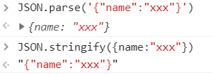
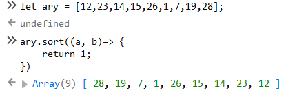
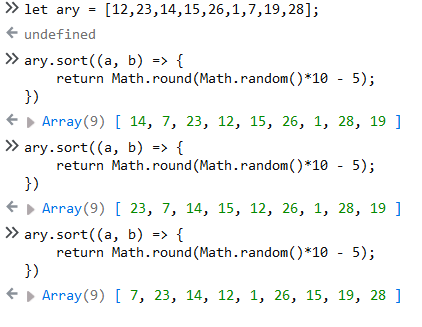
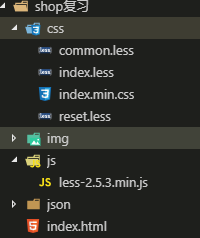

# 商城排序

## 基于AJAX获取数据

- 获取数据和实现数据绑定流程

> 真实项目中, 页面中大部分数据都不是写死的, 而是动态绑定的
> ​     A: 从服务器端获取到数据(基于AJAX/JSONP等技术, 通过服务器端提供的数据API接口地址, 把数据请求回来)
> ​     B: 把获取的数据进行解析
> ​     C: 把数据绑定在HTML页面中(数据绑定): ES6中的模板字符串

- AJAX和JSONP的区别:

> AJAX: 同源策略请求(即不在同一个域名下的资源就不能够互相访问)
> JSONP: 跨域策略请求(非同源策略请求)

- 从服务器端获取到数据

```javascript
// json/product.js文件
let productData = null;
let xhr = new XMLHttpRequest();//=> 创建AJAX实例
xhr.open('GET', 'json/product.json', false);//=> 打开一个请求的地址(一般地址都是服务器提供好的, 会给我们一个API接口文档), 最后一个参数是设置同步还是异步(false: 同步 true: 异步), 真实项目中最常使用的是异步
xhr.onreadystatechange = () => {
    if (xhr.readyState === 4 && xhr.status === 200){
        productData = xhr.responseText;
    }
};

xhr.send(null);
console.log(productData);
```

```json
// json/product.json文件
[
  {
    "id": 1,
    "title": "HUAWEI Mate 10 4GB+64GB 全网通版（亮黑色）",
    "price": 3899,
    "time": "2017-03-15",
    "hot": 198,
    "img": "img/1.jpg"
  }
  //...
]
```

## 把获取的JSON字符串转换为对象

- json格式

> json格式: json不是一种数据类型, 而是一种数据格式, 只要把对象的属性名用双引号括起来, 此时的对象就不再称之为普通对象, 而是叫做json格式的对象

- 获取的数据是字符串

> 获取的结果是一个字符串:"json格式的字符串", 我们此时需要把获取的字符串转换为对象
>
> 从服务器端获取的数据格式一般都是JSON格式的(大部分都是json格式字符串)

- `json格式的字符串` 与 `对象`互相转换

> window对象提供了JSON属性: window.JSON
>
>           1. parse: 把JSON格式的字符串转换为对象
>           2. stringify: 把对象转换为JSON格式的字符串
>         用法:
>          window.JSON.parse()
>          JSON.parse()   省略window



- 从服务器端获取到数据并且把字符串数据转换为对象

```javascript
let productData = null;
let xhr = new XMLHttpRequest();
xhr.open('GET', 'json/product.json', false);
xhr.onreadystatechange = () => {
    if (xhr.readyState === 4 && xhr.status === 200){
        productData = xhr.responseText;
    }
};
xhr.send(null);

//=> 把字符串数据转换为对象
productData = JSON.parse(productData);
console.log(productData);
```

## 基于ES6模板字符串完成数据绑定

- 数据绑定(DOM数据绑定): 


> 依托获取的数据, 把页面中需要展示的数据和解构都搞出来, 然后把创建好的数据和结构放到页面指定容器中

- 数据绑定的方法

> 1.字符串拼接
> ​     传统字符串拼接

```javascript
let list = document.getElementById('list');
let str = '';
for(let i = 0; i< productData.length; i++) {
    let item = productData[i];
    str += '<li><a href="javascript:;">';
    str += '';
    str += '<p>'+ item.title +'</p>';
    str += '<span>￥'+ item.price +'</span>';
    str += '</a></li>';
}
list.innerHTML = str;
```

> ​     ES6模板字符串拼接
> ​     模板引擎: 原理也是字符串拼接

```javascript
let list = document.getElementById('list');
let str = ``;// ES6模板字符串
for(let i =0; i < productData.length; i++) {
    let {
        img = 'img/1.jpg',//=> 没有返回img, 我们用默认图占位
        title,
        price
    } = productData[i];

    str += `<li><a href="javascript:;">
            
            <p>${title}</p>
            <span>${price}</span>
            </a></li>`;
}
list.innerHTML = str;
```

> 2.动态创建DOM
> ​     createElement
> ​     appendChild
> ​     弊端: 操作起来太麻烦, 而且性能消耗更大(DOM回流)

```javascript
let list = document.getElementById('list');
for (let i = 0; i<productData.length; i++) {
    let item = productData[i];
    let oLi = document.createElement('li');
    //li标签中再加a标签...
    list.appendChild(oLi);
}
```

## 按照价格升序排序

- 获取数据, 转为对象, 数据绑定

```javascript
let listBox = document.getElementById('list'),
    headerBox = document.getElementById('header'),
    linkList = headerBox.getElementsByTagName('a'),
    productList = listBox.getElementsByTagName('li');//=> 在元素绑定前, 我们获取容器中元素,得到一个空的元素集合, 元素数据绑定后, 我们不需要重新获取, DOM的映射机制会帮我们把新增加的元素映射到之前获取的空集合中, 让其变为有元素的集合.

~function () {
    //=> ajax
    let productData = null,
        xhr = new XMLHttpRequest;
    xhr.open('GET', 'json/product.json', false);
    xhr.onreadystatechange = () => {
        xhr.readyState === 4 && xhr.status === 200 ? productData = xhr.responseText : null;

        // format data (格式化数据)
        productData ? productData = JSON.parse(productData) : null;
    };
    xhr.send(null);

    let str = ``;
    for (let i = 0; i < productData.length; i++) {
        let {
            title,
            img,
            price,
            hot,
            time
        } = productData[i];
        // 自定义属性
        str += `
        <li data-price="${price}"
            data-hot= "${hot}"
            data-time = "${time}">
        <a href="javascript:;">
            
            <p>${title}</p>
            <span>￥${price}</span>
        </a></li>    
        `;
    }
    listBox.innerHTML = str;
}();

```

- 按照价格升序排序

```javascript
//=> HANDLE CLICK
~function () {
    let sortList = () => {
        // 1.2.基于getElementsBysTagName获取的元素集合是一个类数组, 不能直接使用数组中的sort方法(先把它转换为数组, 然后再排序)
        let productAry = [].slice.call(productList);

        // 3.基于sort方法给所有的li按照其价格进行排序
        productAry.sort((a, b) => {
            let aP = a.getAttribute('data-price'),
                bP = b.getAttribute('data-price');
            return aP - bP;
        })

        // 4.按照排好序的数组, 我们把li重新增加到页面中
        for (let i = 0; i < productAry.length; i++) {
            let curLi = productAry[i];
            listBox.appendChild(curLi);//=> appendChild: 向容器的末尾追加新元素, 但是页面中不是20个, 还是原有的10个, 只不过顺序改变了, 这是为什么?
        }

    }
    linkList[1].onclick = function () {
        sortList();
    };
}();
```
- 细节
> 1. getElementsByTagName()获取元素集合是类数组, 转为数组后才能用sort()方法
> 2. 类数组转数组: 
>
> let productAry = [].slice.call(productList);
>
> 用这种借用slice方式操作元素集合或者节点集合, 在IE6~8中不兼容. 但是用这种方式操作arguments, 所有浏览器都兼容.
>
> 3. 基于sort方法给所有的li按照其价格进行排序
>
> ```javascript
> productAry.sort((a, b) => {
>     //=> a: 数组中的当前项
>     //=> b: 数组中的下一项
> 
>     // return a - b;//数组当前项减去下一项, 如果返回的值大于零, 则a,b交换位置, 否则小于等于零什么都不做
> 
>     //=> A是当前li, B是下一个li, 我们应该获取出每个li的价格, 让价格相减从而实现排序(首先数据绑定的时候, 我们可以把后面需要用到的"价格/日期/销量"等先存储到li的自定义属性上[在解构中显示, 后期只能基于getAttribute这种模式获取到], 后期需要用到这个值的时候, 我们基于自定义属性获取到即可)
>     let aP = a.getAttribute('data-price'),
>     bP = b.getAttribute('data-price');
>     return aP - bP;
> })
> ```
>
> 4. 按照排好序的数组, 我们把li重新增加到页面中
>
> appendChild在追加元素对象的时候, 如果这个元素之前容器中已经存在, 此时不是克隆一份新的追加到末尾, 而是把原有的元素移动到末尾位置.

- 自定义属性编程思想

> 凡是在后面的某项操作当中, 需要用到当前元素的某个信息值, 这个值在前面可以得到, 此时在前面把后面需要用到的值全都存储在当前元素的自定义属性中, 后面用到的时候, 就从自定义属性上获取, 这种方式叫做自定义属性编程思想.
>
> 好处: 只要在自定义属性中保存了值, 这些值不受任何作用域环境干扰,不管后面在哪操作, 做什么操作, 都可以拿到这些值.

- 对sort()方法的理解, return 只看是否大于或者小于等于零

> 不管a-b, 还是b-a,只要是大于零, 则a,b交换位置, 否则小于等于零什么都不做
>
> 所以, 才有的 升序 用a-b, 降序 用b-a

> return 1;表示一直大于0, 每次当前项和后一项都要换位置, 最终会前后对调
>
> 题:

```javascript
let ary = [12,23,14,15,26,1,7,19,28];
ary.sort((a, b)=> {
    return 1;
})
```

>使用新版chrome使用sort, 上面的代码ary没有对调. Firefox可以.



- 面试题(把当前数组随机打乱)

```javascript
let ary = [12,23,14,15,26,1,7,19,28];
ary.sort((a, b) => {
    return Math.round(Math.random()*10 - 5);//-5~5随机一个数
})
```

> 原理: 基于sort排序, 每一次随机返回一个大于零或者小于等于零的值, 从而随机决定是否交换位置
>
> 使用chrome, 有一些问题, 用firefox没问题

\

## 简述DOM映射机制

- DOM的映射机制

> 1. 页面中的HTML元素, 和js中通过相关方法获取到的元素集合或者元素对象存在映射关系(一个改另外一个会跟着自动修改)
>
> 2. xxx.style.color='red' : 把xxx元素对象对应堆内存中的style属性下的color属性值修改为'red'(本质操作的是js堆内存), 但是由于DOM映射关系, 页面中的标签和xxx元素对象是绑在一起的, 我们修改元素对象空间的值, 页面中的元素会按照最新的值进行渲染.
>
> 3. 在元素绑定前, 我们获取容器中元素,得到一个空的元素集合, 元素数据绑定后, 我们不需要重新获取, DOM的映射机制会帮我们把新增加的元素映射到之前获取的空集合中, 让其变为有元素的集合.(querySelectorAll()获取的集合是静态集合[staticNodeList], 不存在上述所谓的映射机制, 所以基于这种办法, 数据绑定完成后需要重新获取一次才可以)
>
> 4. appendChild()在追加元素对象的时候, 如果这个元素之前容器中已经存在, 此时不是克隆一份新的追加到末尾, 而是把原有的元素移动到末尾位置.

## 按照价格升降序切换

> 操作价格a标签, 设置一个自定义属性flag=-1, 每次点击由1~-1来回切换, 通过this来控制sortList方法中的sort方法中返回值是a-b还是b-a

```javascript
//=> HANDLE CLICK
~function () {

    let sortList = function () {
        //=> this:当前操作的a标签(用call修改了this指向)
        let productAry = [].slice.call(productList);

        /* let _this = this;
        productAry.sort(function () {
            //this: window
            _this.flag
        }); */
        productAry.sort((a, b) => {
            //=> this:当前操作的a标签
            let aP = a.getAttribute('data-price'),
                bP = b.getAttribute('data-price');
            return (aP - bP) * this.flag;
        });
        for (let i = 0; i < productAry.length; i++) {
            let curLi = productAry[i];
            listBox.appendChild(curLi);
        }

    }

    linkList[1].flag = -1;
    linkList[1].onclick = function () {
        //=> this: 当前操作的a标签(价格a标签)
        this.flag *= -1;//=> 每次点击可以让flag的值从1~-1来回切换(第一次点击变为1, 第二次点击变为-1...)
        sortList.call(this);//=> 执行sortList, 让方法中的this关键字改为操作的a标签(箭头函数虽然很强大, 但是不可以乱用, 尤其是在需要改变函数中的this情况下, 箭头函数中的this不受管控, 都是默认继承上下文的, 我们用call也改不了)
    };


}();
```

- 箭头函数与普通函数的巧妙结合

> 箭头函数没有arguments的映射, this也只能看上下文.
>
> 在需要函数中的this是函数执行点前面的对象, 就用普通函数的办法.
>
> 在需要函数中的this是上级作用域中this所指的对象, 就用箭头函数的办法

## 实现多列升降序切换

> 1. 给每一个a标签循环绑定点击事件, 并加入自定义属性index记录a标签的索引, 用来判断点击的是按什么升降序.
>
> 2. 上架时间是字符串, 不能直接相减. 需要把上架时间的`-`用正则表达式去掉, 纯数字的字符串可以相减, 就可以进行时间排序了.

```javascript
//=> HANDLE CLICK
~function () {

    let sortList = function () {
        //=>this: 点击的a标签
        let productAry = [].slice.call(productList);
        productAry.sort((a, b) => {
            let aInn,
                bInn;
            switch (this.index) {
                case 0:
                    aInn = a.getAttribute('data-time').replace(/-/g, '');
                    bInn = b.getAttribute('data-time').replace(/-/g, '');
                    break;
                case 1:
                    aInn = a.getAttribute('data-price');
                    bInn = b.getAttribute('data-price');
                    break;
                case 2:
                    aInn = a.getAttribute('data-hot');
                    bInn = b.getAttribute('data-hot');
                    break;
                
            }
            return (aInn - bInn) * this.flag;
        });
        for (let i = 0; i < productAry.length; i++) {
            let curLi = productAry[i];
            listBox.appendChild(curLi);
        }

    }
    
    //=> 给每一个link都绑定点击切换
    for(let i =0;i<linkList.length;i++){
        let curLink = linkList[i];
        curLink.index = i;//=> 设置自定义属性存储a的索引
        curLink.flag = -1;//=> 每一个a标签上都有一个flag属性, 能够在点击的时候实现1~-1之间的切换, 点击都要执行sortList, 同时方法中的this也都改为当前点击的a标签
        curLink.onclick = function () {
            this.flag *= -1;
            sortList.call(this);
        };
    }
}();
```

## 解决多列切换中的一点BUG

> 1. 把按上架时间, 热度, 价格排序的代码重新优化
>
> 2. BUG: 点击上架时间, 再点击价格, 再点击时间, 应该时间还是按照初始的升序排列. 但是a标签的flag没有进行初始化为-1, 导致再次点击上架时间是按照降序排列的.

```javascript
//=> HANDLE CLICK
~function () {

    let sortList = function () {
        let { index: _index, flag: _flag } = this,
            productAry = [].slice.call(productList);
        productAry.sort((a, b) => {
            let ary = ['data-time', 'data-price', 'data-hot'];
            let aInn = a.getAttribute(ary[_index]),
                bInn = b.getAttribute(ary[_index]);
            if (_index === 0) {
                aInn = aInn.replace(/-/g, '');
                bInn = bInn.replace(/-/g, '');
            }
            return (aInn - bInn) * _flag;
        });
        for (let i = 0; i < productAry.length; i++) {
            let curLi = productAry[i];
            listBox.appendChild(curLi);
        }

    }

    for (let i = 0; i < linkList.length; i++) {
        let curLink = linkList[i];
        curLink.index = i;
        curLink.flag = -1;
        curLink.onclick = function () {
            //=> 点击当前的a标签, 我们需要让其余的a标签的flag回归原始值-1, 这样下一次再点击某一个a标签, 还是从-1开始乘, 变为1, 也就是从升序开始的
            for (let j = 0; j < linkList.length; j++) {
                let item = linkList[j];
                if (item !== this) {
                    item.flag = -1;
                }
            }
            this.flag *= -1;
            sortList.call(this);
        };
    }
}();
```

## 如何学习和练习项目案例

> 在纸上写思路, 照着思路敲对应的模块

- 商城排序思路

> 0. 获取当前页面中需要操作的元素
>
>    ​    A: 需要获取的元素有: list/header/header中所有的a/list中所有的li
>
>    ​    B: 注意DOM映射, 不能使用querySelectorAll
>
> 1. 获取数据进行数据绑定
>
>    ​    A: 发送AJAX请求
>
>    ​        创建一个变量用来存储获取的值
>
>    ​        创建AJAX的一个实例
>
>    ​        打开一个请求链接
>
>    ​        ...
>
>    ​    B: 把获取的JSON字符串转为对象
>
>    ​    C: 基于ES6模板字符串把需要动态展示的内容拼接, 最后存储到容器中
>
>    ​        循环获取的数据
>
>    ​        把每一项都获取到, 然后解构赋值
>
>    ​        字符串拼接
>
>    ​        给li设置三个自定义属性存储 价格/日期/热度
>
> 2. 点击操作
>
>    ​    A: 循环给所有的A绑定点击事件
>
>    ​        给每一个设置index/flag自定义属性, 存储索引和-1
>
>    ​        绑定点击事件
>
>    ​            除了当前这个li, 其余li都让其flag=-1
>
>    ​            让当前li的flag乘等于-1
>
>    ​            执行sortList方法, 把this改成当前点击的A
>
>    ​    B: 编写一个sortList方法(需要改变this不能使用箭头函数)
>
>    ​        把获取的li类数组转换为数组
>
>    ​        把数组进行排序
>
>    ​            先根据点击的A的索引获取到需要排序的项
>
>    ​            获取对应项中的内容(从自定义属性中获取)
>
>    ​            日期需要把'-'去掉再进行减法运算
>
>    ​            通过相减, 获取一个>0或者<=0的值, 让获取的值乘以flag
>
>    ​        把排好序的数组中的每一项依次加入到容器的末尾(其实是把原有li移动位置, 这是DOM映射)

# 商城复习

## 基于LESS实现样式



- HTML文件

> 1. 真实项目中我们经常使用a标签做一些点击的按钮
>
>    因为a标签可以移入有效果 :hover伪类选择器, a标签: hover伪类兼容所有的浏览器
>    a标签的href属性存储的是点击需要跳转的页面, 或者是#xxx, 这个是hash定位
>    如果只想让其作为一个普通的按钮, 我们需要阻止a标签点击跳转的默认行为 
>
>    \<a href="javascript::"></a>
>
> 2. 开发环境需要用less.js文件来动态展示css效果
>
>    \<link rel="stylesheet/less" href="css/index.less">
>    \<script src="js/less-2.5.3.min.js">\</script>
>
> 3. 生产环境需要用npm装好全局less
>
>    lessc index.less index.min.css -x (第一个文件是需要编译的文件名, 第二个是需要生成css的文件名)
>
>    来由less文件生成编译好后的css文件
>
>    link由调用less文件改为css文件

```html
<head>
    <!-- import less(development [DEV] 开发环境) -->
    <!-- <link rel="stylesheet/less" href="css/index.less">
    <script src="js/less-2.5.3.min.js"></script> -->
    
    <!-- import css (product [PRO] 生产环境)-->
    <link rel="stylesheet" href="css/index.min.css">
</head>
<body>
<div class="container">
        <header class="headerBox">
            <span>排序:</span>
            <a href="javascript:;">上架时间</a>
            <a href="javascript:;">价格</a>
            <a href="javascript:;">热销</a>
        </header>
        <ul class="productBox clearfix">
            <li>
                <a href="#">
                    
                    <p title="华为畅享7 Plus 4GB+64GB 全网通高配版（香槟金）">华为畅享7 Plus 4GB+64GB 全网通高配版（香槟金）</p>
                    <span>￥1699</span>
                    <span>2018-01-01</span>
                    <span>2</span>
                </a>
            </li>
            
        </ul>
    </div>
    <a href="javascript:;"></a>
<body>
```

- css文件
> common.less文件

```less
@con-bg: #fff;
@text-black: #555;
@text-gray: #999;
@text-active: #E01D20;

// transition方法浏览器不兼容
.transition(@property:all,@duration:1s,@timing-function:linear,@delay:0s) {
    -webkit-transition: @arguments;// 谷歌
    -moz-transition: @arguments;// 火狐
    -ms-transition: @arguments;// IE
    -o-transition: @arguments;// 欧朋
    transition: @arguments;
}
```
> index.less文件
>
> 1. reset是清空默认样式的, 不仅需要导入进来使用, 最后需要和我们写的css一起编译, 放到浏览器中渲染解析才可以
>
> 2. common中存放的一般都是公用的变量或者方法, 只需要调取使用即可, 编译的时候不需要编译这些内容, 所以用reference修饰一下
>
> 3. @import导入的时候最好都是导入less文件, 这样可以在编译这个less的时候, 把所有的less编译到一个css中, 实现css的合并和压缩
>
> 4. CSS3新盒子模型: 我们设置的width是盒子最后的宽度, 包括(边框, padding, 内容宽度) 
>
>    box-sizing: border-box;
>    width: 232px;
>
>    此时不论padding和border怎么改, 盒子的宽度232px不变, 只会影响内容区
>
> 5. 子元素浮动, 子元素的高度不能撑开父元素(脱离文档流). 
>
>    解决: 清除子元素浮动对父元素的影响 => clear: both
>
>    或者给父元素加一个clearfix类
>
>    ```css
>    .clearfix:after{display:block;height:0;content:"";clear:both}
>    ```
>
> 6. 使用inline-block会把标签之间的空格和换行当做元素占位, 导致元素之间有间隙. 解决: 让父元素的font-size: 0
>
>    display: inline-block;
>
> 7. transparent是透明色
>
>    border: 3px solid transparent;
>
> 8. a span:nth-child(1) 不是所有span中的第一个, 它是A子元素中的第一个而且还得是span标签.
>    a span:nth-of-type(1) 先按照span标签分组, 获取分组中的第一个
>
> 9. transition方法浏览器不兼容

```less
@import "reset.less";// less后缀可以不加
@import (reference) "common";

html, body {
    background: #f4f4f4;
    overflow-x: hidden; 
}

.container {
    margin: 20px auto;
    width: 1200px;
}

.headerBox {
    @H: 50px;
    @F: 14px;
    height: @H;
    line-height: @H;
    background: @con-bg;
    font-size: 0;

    span {
        display: inline-block;/* 使用inline-block会把标签之间的空格和换行当做元素占位, 导致元素之间有间隙. 解决: 让父元素的font-size: 0 */
        width: 90px;
        text-align: center;
        height: @H;
        line-height: @H;
        font-size: @F;
        color: @text-black;
    }

    a {
        display: inline-block;
        padding: 0 15px;
        height: @H;
        line-height: @H;
        font-size: @F;
        color: @text-gray;

        &:hover {/* a:hover */
            color: @text-active;
        }
    }
    
}

.productBox {
    margin: 20px 0 0 0;
    overflow: hidden;

    li {
        float: left;/* 子元素浮动, 子元素的高度不能撑开父元素(脱离文档流). 解决: 清除子元素浮动对父元素的影响 => clear: both*/
        margin-right: 10px;
        margin-bottom: 10px;
        background: @con-bg;
        &:nth-child(5n) {
            margin-right: 0px;
        }

        a {
            display: block;
            box-sizing: border-box;/* CSS3新盒子模型: 我们设置的width是盒子最后的宽度, 包括(边框, padding, 内容宽度) */
            width: 232px;
            padding: 0 16px;
            border: 3px solid transparent;/* transparent是透明色 */
            .transition(@duration: .2s);/* transition方法不兼容 */

            &:hover {
                border-color: @text-active;
            }
            img {
                display: block;
                width: 100%;
                height: 194px;
            }
            p {
                color: @text-gray;
                font-size: 14px;
                height: 40px;
                line-height: 20px;
                overflow: hidden;
            }
            span {
                display: block;
                line-height: 20px;
                font-size: 12px;
                color: @text-black;

                &:nth-of-type(1) {
                    // a span:nth-child(1) 不是所有span中的第一个, 它是A子元素中的第一个而且还得是span标签.
                    // a span:nth-of-type(1) 先按照span标签分组, 获取分组中的第一个
                    color: @text-active;
                    font-weight: bold;
                }
            }
        }
    }
}
```

> reset.less文件

```less
body,h1,h2,h3,h4,h5,h6,hr,p,blockquote,dl,dt,dd,ul,ol,li,button,input,textarea,th,td{margin:0;padding:0}body{font-size:12px;font-style:normal;font-family:"\5FAE\8F6F\96C5\9ED1",Helvetica,sans-serif}small{font-size:12px}h1{font-size:18px}h2{font-size:16px}h3{font-size:14px}h4,h5,h6{font-size:100%}ul,ol{list-style:none}a{text-decoration:none;background-color:transparent}a:hover,a:active{outline-width:0;text-decoration:none}table{border-collapse:collapse;border-spacing:0}hr{border:0;height:1px}img{border-style:none}img:not([src]){display:none}svg:not(:root){overflow:hidden}html{-webkit-touch-callout:none;-webkit-text-size-adjust:100%}input,textarea,button,a{-webkit-tap-highlight-color:rgba(0,0,0,0)}article,aside,details,figcaption,figure,footer,header,main,menu,nav,section,summary{display:block}audio,canvas,progress,video{display:inline-block}audio:not([controls]),video:not([controls]){display:none;height:0}progress{vertical-align:baseline}mark{background-color:#ff0;color:#000}sub,sup{position:relative;font-size:75%;line-height:0;vertical-align:baseline}sub{bottom:-0.25em}sup{top:-0.5em}button,input,select,textarea{font-size:100%;outline:0}button,input{overflow:visible}button,select{text-transform:none}textarea{overflow:auto}button,html [type="button"],[type="reset"],[type="submit"]{-webkit-appearance:button}button::-moz-focus-inner,[type="button"]::-moz-focus-inner,[type="reset"]::-moz-focus-inner,[type="submit"]::-moz-focus-inner{border-style:none;padding:0}button:-moz-focusring,[type="button"]:-moz-focusring,[type="reset"]:-moz-focusring,[type="submit"]:-moz-focusring{outline:1px dotted ButtonText}[type="checkbox"],[type="radio"]{box-sizing:border-box;padding:0}[type="number"]::-webkit-inner-spin-button,[type="number"]::-webkit-outer-spin-button{height:auto}[type="search"]{-webkit-appearance:textfield;outline-offset:-2px}[type="search"]::-webkit-search-cancel-button,[type="search"]::-webkit-search-decoration{-webkit-appearance:none}::-webkit-input-placeholder{color:inherit;opacity:.54}::-webkit-file-upload-button{-webkit-appearance:button;font:inherit}.clearfix:after{display:block;height:0;content:"";clear:both}
```

## 高级单例模式框架结构

- 基于高级单例模式完成业务逻辑开发

> 自执行函数形成的私有作用域不销毁("闭包")
>
> 1. 里面的方法和变量等和外界不冲突(保护)
> 2. 里面创建的值也不会销毁(保存)

```javascript
let productRender = (function () {
    
    //=> GET-DATA: 基于AJAX从服务器端获取数据
    let getData = function () {

    }
    //=> BIND-HTML: 完成数据绑定(基于ES^模板字符串)
    let bindHTML = function () {

    }

    return {
        init: function () {
            // init是当前模块的入口, 想要实现完整的业务逻辑, 我们执行init即可, 在init中, 我们根据具体的业务需求, 规划哪些方法先, 哪些方法后执行, init相当于当前模块的指挥官.("命令设计模式")
            getData();
            bindHTML();
        }
    }
})();
productRender.init();
```

## 数据获取和绑定
- forEach: 数组中的方法, 用来遍历数组中每一项内容的

> ary.forEach((item, index) => {})
> item: 当前遍历数组中这一项的值
> index: 当前遍历这一项的索引
> 数组中有多少项, 我们这个函数就被执行多少次, 保证数组中的每一项都可以得到遍历

```javascript
let ary = [12, 23, 34];
ary.forEach((item, index) => {
    console.log(item, index);
    //=> 12 0
    //   23 1
    //   34 2
})
```

- index.js文件

> 使用数组的forEach方法来循环绑定

```javascript
let productRender = (function () {
    let productData = null,
        productBox = document.getElementById("productBox");

    //=> GET-DATA: 基于AJAX从服务器端获取数据
    let getData = function () {
        let xhr = new XMLHttpRequest;
        xhr.open('GET', 'json/product.json', false);
        xhr.onreadystatechange = function () {
            if (xhr.readyState === 4 && xhr.status === 200) {
                productData = JSON.parse(xhr.responseText);//=>把从服务器获取的JSON字符串转换为对象, 方便后续操作
            }
        };
        xhr.send(null);
    };
    //=> BIND-HTML: 完成数据绑定(基于ES6模板字符串)
    let bindHTML = function () {
        let str = ``;
        productData.forEach(({title, price, hot, time, img}, index) => {
            // let {title, price, hot, time, img} = item; 直接放到形参中解构
            //=> ES6模板字符串中出现的${}里面存放的是JS代码(包含需要动态绑定数据的JS变量的值)
            str += `<li>
                        <a href="#">
                            
                            <p title="${title}">${title}</p>
                            <span>￥${price}</span>
                            <span>时间: ${time}</span>
                            <span>热度: ${hot}</span>
                        </a>
                    </li>`
        });
        productBox.innerHTML = str;
    };

    return {
        init: function () {
            getData();
            bindHTML();
        }
    }
})();
productRender.init();
```

## 学习DOM映射和告别DOM映射

> 1. 基于querySelectorAll获取到的节点集合不存在DOM映射机制(绑定完成后需要重新的获取元素才可以)
>
>    productList = document.querySelectorAll('li');
>
> 2. 因为一开始li并没有, 获取li的时候是空的, 虽然用getElementsByTagName('li')通过DOM映射机制可以获取到之后绑定了数据的li对象.
>
>    为了符合逻辑习惯, 尽量不要使用getElementsByTagName来获取, 在一开始获取li时, 知道获取不到, 所以直接productList = null;
>
>    在绑定数据了之后, 再进行获取li, 此时不论getElementsByTagName还是querySelector获取都可以.
>
>    querySelector获取数据不兼容IE6 7 8, 但是现在不用考虑IE6 7 8 的兼容性, 可以随意使用.
>
>    **尽量不要使用DOM映射机制, 对逻辑习惯有影响**

```javascript
let productRender = (function () {
    let productData = null,
        productBox = document.querySelector('.productBox'),
        headerBox = document.querySelector('.headerBox'),
        linkList = headerBox.querySelectorAll('a'),
        productList = null;

    //=> GET-DATA: 基于AJAX从服务器端获取数据
    let getData = function () {
        let xhr = new XMLHttpRequest;
        xhr.open('GET', 'json/product.json', false);
        xhr.onreadystatechange = function () {
            if (xhr.readyState === 4 && xhr.status === 200) {
                productData = JSON.parse(xhr.responseText);
            }
        };
        xhr.send(null);
    };
    //=> BIND-HTML: 完成数据绑定(基于ES6模板字符串)
    let bindHTML = function () {
        let str = ``;
        productData.forEach(({title, price, hot, time, img}, index) => {
            str += `<li>
                        <a href="#">
                            
                            <p title="${title}">${title}</p>
                            <span>￥${price}</span>
                            <span>时间: ${time}</span>
                            <span>热度: ${hot}</span>
                        </a>
                    </li>`
        });
        productBox.innerHTML = str;
        productList = document.querySelectorAll('li');
    };

    return {
        init: function () {
            getData();
            bindHTML();
        }
    }
})();
productRender.init();
```

## 完成事件绑定的逻辑

> 给productList进行排序(依据点击列的不同进行排序)
>
> 排好序后追加到productBox中
>
> 点击切换升降序要给linkList加自定义属性flag=-1
>
> [].sort.call(productList, (a, b)=> {})方法执行不了, sort不允许类数组, 所以把productList提前转为了数组, 再用的sort方法.

```javascript
let productRender = (function () {
    let productData = null,
        productBox = document.querySelector('.productBox'),
        headerBox = document.querySelector('.headerBox'),
        linkList = headerBox.querySelectorAll('a'),
        productList = null;

    //=> GET-DATA: 基于AJAX从服务器端获取数据
    let getData = function () {
        let xhr = new XMLHttpRequest;
        xhr.open('GET', 'json/product.json', false);
        xhr.onreadystatechange = function () {
            if (xhr.readyState === 4 && xhr.status === 200) {
                productData = JSON.parse(xhr.responseText);
            }
        };
        xhr.send(null);
    };
    //=> BIND-HTML: 完成数据绑定(基于ES6模板字符串)
    let bindHTML = function () {
        let str = ``;
        productData.forEach(({ title, price, hot, time, img }, index) => {
            str += `<li data-time="${time}" data-hot="${hot}" data-price="${price}">
                        <a href="#">
                            
                            <p title="${title}">${title}</p>
                            <span>￥${price}</span>
                            <span>时间: ${time}</span>
                            <span>热度: ${hot}</span>
                        </a>
                    </li>`
        });
        productBox.innerHTML = str;
        productList = document.querySelectorAll('li');
    };

    //=> BIND-CLICK: 给三个排序标签绑定点击事件
    let bindClick = function () {
        [].forEach.call(linkList, (curlink, index) => {
            //=> 循环三次, 执行三次这个方法, 每一次执行都会形成一个闭包, 每一个闭包中保存了当前这个A对应的索引indes
            curlink.flag = -1;
            curlink.onclick = function () {
                //1. 给productList进行排序(依据点击列的不同进行排序)

                //=> 点击的时候需要获取每一个li的价格/热度等信息, 此时我们可以在绑定的时候, 把这些信息存储到自定义属性上, 点击的时候根据自定义属性获取即可

                curlink.flag *= -1;

                //A: 根据点击li的索引,索引是谁按照谁排序
                let ary = ['data-time', 'data-price', 'data-hot'];
                productList = [].slice.call(productList);
                productList.sort((a, b) => {
                    let aInn = a.getAttribute(ary[index]);
                    let bInn = b.getAttribute(ary[index]);
                    if (index === 0) {//=> 对于日期来说, 需要去除字符串之间的'-',才能实现数学相减
                        aInn = aInn.replace(/-/g, '');
                        bInn = bInn.replace(/-/g, '');
                    }
                    return (aInn - bInn) * this.flag;
                });


                //2. 按照最新顺序依次添加到容器中
                productList.forEach(curList => {
                    productBox.appendChild(curList);
                });
            }
        });


    };

    return {
        init: function () {
            getData();
            bindHTML();
            bindClick();
        }
    }
})();
productRender.init();
```

## 由数据绑定引发的DOM性能优化

> index.js文件

```javascript
let productRender = (function () {
    let productData = null,
        productBox = document.querySelector('.productBox'),
        headerBox = document.querySelector('.headerBox'),
        linkList = headerBox.querySelectorAll('a'),
        productList = null;

    //=> GET-DATA: 基于AJAX从服务器端获取数据
    let getData = function () {
        let xhr = new XMLHttpRequest;
        xhr.open('GET', 'json/product.json', false);
        xhr.onreadystatechange = function () {
            if (xhr.readyState === 4 && xhr.status === 200) {
                productData = JSON.parse(xhr.responseText);
            }
        };
        xhr.send(null);
    };

    //=> BIND-HTML: 完成数据绑定(基于ES6模板字符串)
    let bindHTML = function () {
        let str = ``;
        productData.forEach(({ title, price, hot, time, img }, index) => {
            str += `<li data-time="${time}" data-hot="${hot}" data-price="${price}">
                        <a href="#">
                            
                            <p title="${title}">${title}</p>
                            <span>￥${price}</span>
                            <span>时间: ${time}</span>
                            <span>热度: ${hot}</span>
                        </a>
                    </li>`
        });
        productBox.innerHTML = str;
        productList = document.querySelectorAll('li');
    };

    //=> BIND-CLICK: 给三个排序标签绑定点击事件
    let bindClick = function () {
        [].forEach.call(linkList, (curlink, index) => {
            curlink.flag = -1;
            curlink.onclick = function () {
                curlink.flag *= -1;
                let ary = ['data-time', 'data-price', 'data-hot'];
                productList = [].slice.call(productList);
                productList.sort((a, b) => {
                    let aInn = a.getAttribute(ary[index]);
                    let bInn = b.getAttribute(ary[index]);
                    if (index === 0) {
                        aInn = aInn.replace(/-/g, '');
                        bInn = bInn.replace(/-/g, '');
                    }
                    return (aInn - bInn) * this.flag;
                });

                //=> 基于文档碎片减少DOM回流
                let frg = new document.createDocumentFragment();
                productList.forEach(curList => {
                    frg.appendChild(curList);
                });
                productBox.appendChild(frg);
                frg = null;
            }
        });
    };

    return {
        init: function () {
            getData();
            bindHTML();
            bindClick();
        }
    }
})();
productRender.init();
```

### DOM的回流(reflow)和重绘(repaint)

- 浏览器加载页面步骤:

> 1. 计算DOM结构(DOM tree)
>
> 2. 加载css
>
> 3. 生成渲染树(render tree), 渲染树是和样式相关的
>
> 4. 浏览器基于GPU(显卡)开始按照render tree画页面
>
- 重绘: 当某一个DOM元素样式更改(位置没变只是样式更改, 例如: 颜色变为红色..)浏览器会重新渲染这个元素 
>```javascript
>box.style.color = 'red'
>//... 还有一些其他代码
>box.style.fontSize = '16px'
>```
>
>上面的操作触发了两次重绘, 性能上有所消耗, 真实项目中为了优化这个性能, 我们最好一次性把需要修改的样式搞定, 例如:
>
>```javascript
>.xxx {
>    color: 'red',
>    fontSize: '16px'
>}
>box.className = 'xxx'
>```
- 回流: 当DOM元素的结构或者位置发生改变(删除, 增加, 改变位置, 改变大小...)都会引发回流, 所谓回流, 就是浏览器抛弃原有计算的机构和样式, 重新进行DOM TREE 或者 RENDER TREE, 非常非常非常...消耗性能

### 分离读写

> [引发两次回流]

```js
box.style.top = '100px';
console.log(box.style.top);//=> '100px'
box.style.left = '100px';
```

> [引发一次回流]

```javascript
box.style.top = '100px';
box.style.left = '100px';
console.log(box.style.top);//=> '100px'
```

### 数据绑定的方式

> 1. 字符串拼接
>
> ​        普通字符串拼接
>
> ​        ES6模板字符串
>
> ​        模板引擎
>
> 2.  DOM操作 

- 动态创建DOM的方式(DOM操作)

> 外层容器基于createElement完成, 容器中的具体内容可以基于创建DOM完成, 也可以基于字符串拼接完成
>
> **这种方式的弊端: 因为循环十次, 每一次都改变了原有的DOM结构, 引发浏览器的十次回流**

```javascript
let data = [
    {
      "id": 1,
      "title": "HUAWEI Mate 10 4GB+64GB 全网通版（亮黑色）",
      "price": 3899,
      "time": "2017-03-15",
      "hot": 198,
      "img": "img/1.jpg"
    }
]
data.forEach((item, index) => {
    let curLi = document.createElement('li');
    curLi.innerHTML = `<a href="#">
        
        <p title="华为畅享7 Plus 4GB+64GB 全网通高配版（香槟金）">华为畅享7 Plus 4GB+64GB 全网通高配版（香槟金）</p>
        <span>￥1699</span>
        <span>2018-01-01</span>
        <span>2</span>
    </a>`;
    document.querySelector('.productBox').appendChild(curLi);
});
```

> **解决办法**: 基于文档碎片(虚拟内容中开辟的一个容器)可以解决这个问题: 每当创建一个li, 我们首先把它存放到文档碎片中(千万不要放到页面中, 避免回流), 当我们把需要的元素都创建完成, 并且都添加到文档碎片中, 再统一把文档碎片放到页面中(只会引发一次回流操作)

```javascript
let frg = document.createDocumentFragment();//=> 创建文档碎片容器
data.forEach((item, index) => {
    let curLi = document.createElement('li');
    curLi.innerHTML = `<a href="#">
        
        <p title="华为畅享7 Plus 4GB+64GB 全网通高配版（香槟金）">华为畅享7 Plus 4GB+64GB 全网通高配版（香槟金）</p>
        <span>￥1699</span>
        <span>2018-01-01</span>
        <span>2</span>
    </a>`;
    frg.appendChild(curLi);
});
document.querySelector('.productBox').appendChild(frg);//=> 把文档碎片中的内容, 统一存放到页面中
frg = null;
```

- 字符串拼接-ES6模板字符串

> `+=str`是把原有容器中的结构都以字符串的方式获取到, 然后和新的str字符串拼接, 最后统一再插入到原有的容器中.    
>
> `=str`是用新的字符串替换原有的结构
>
> **实际上, ES6字符串拼接不如操作Fragment/appendChild这种方式, 因为Fragment是直接保存的DOM对象, 而ES6中保存的是字符串, 需要先把字符串转换为DOM对象.**
>
> 只引发一次DOM回流

```javascript
let str = ``;
productData.forEach(({ title, price, hot, time, img }, index) => {
    str += `<li>
    <a href="#">
        
        <p title="华为畅享7 Plus 4GB+64GB 全网通高配版（香槟金）">华为畅享7 Plus 4GB+64GB 全网通高配版（香槟金）</p>
        <span>￥1699</span>
        <span>2018-01-01</span>
        <span>2</span>
    </a>
</li>`
});
document.querySelector('.productBox').innerHTML = str;// 只引发一次DOM回流
```

# No 'Access-Control-Allow-Origin' Ajax跨域访问解决方案

No 'Access-Control-Allow-Origin' header is present on the requested resource.

当使用ajax访问远程服务器时，请求失败，浏览器报如上错误。这是出于安全的考虑，默认禁止跨域访问导致的。

一、什么是跨域访问

举个栗子：在A网站中，我们希望使用Ajax来获得B网站中的特定内容。如果A网站与B网站不在同一个域中，那么就出现了跨域访问问题。你可以理解为两个域名之间不能跨过域名来发送请求或者请求数据，否则就是不安全的。跨域访问违反了同源策略，同源策略的详细信息可以点击如下链接：Same-origin_policy； 
总而言之，同源策略规定，浏览器的ajax只能访问跟它的HTML页面同源（相同域名或IP）的资源。

二、解决方案

常用的解决方案有两种，可以分为客户端解决方案和服务器端解决方案。

## 使用代理解决跨域问题的原理

为了安全着想浏览器会设置同源安全策略

即不在同一个域名下的资源就不能够互相访问

要解决这个问题方法有很多 ，但大致分为两类：

1 是服务端进行设置默认允许某些域名跨域访问

2 从客户端入手想办法绕开同源安全策略

主要介绍从客户端入手，用代理的方式实现跨域访问的原理

举个例子：

用node起了一个localhost:8080的服务器

那么在这个服务器下访问的网页也就是默认在8080这个域下面

假设服务端所在的域是www.njc.com

这样通过ajax发送请求的话

由客户端直接传过去的就是一个域名为localhost：8080的请求

而服务端所在的域是 www.nj1c.com

域名不同 跨域请求失败

把例子放下；

到这里可以看出跨不跨域实际上是由客户端(浏览器)来告诉服务器的

这也就为实现跨域访问提供了实现的基础

通过一些方法设置代理，在请求发送(接收)之前加入中间层，

将不同的域名转换成相同的

就解决了跨域的问题

依旧以上面的栗子：

客户端发送请求时

不直接到服务器

而是先到代理的中间层

在这里将 localhost:8080 的这个域名装换为 www.nj1c.com，

再将请求发送到服务器

这样在服务器端收到的请求就是使用的www.nj1c.com域名

同理，当服务器返回数据的时候，也是先到代理的中间层

将 www.nj1c.com 转换成 localhost:8080；

这样在客户端也是在相同域名下访问的了


## 代理和反向代理

A 找 B 直接沟通，这就等于没有什么代理；

然而中间夹一个传话的 C，C 就是代理了，A 通过 C 把信息传递给 B，然后 C 再把 B 的反馈转达给 A。

在这个过程中，A 知道沟通的直接目标是 B，只不过由于各种原因无法直接和 B 面对面，需要中间人 C，这就是所谓“正向代理”，其实我们很少说正向代理，在英文原文里，这个叫 Forward Proxy，一般就直接叫代理，你翻译成“转交代理”或“传达代理”都比“正向代理”强，然而没必要，因为代理这个词的本意就是如此。

另外一种情况则是：A 并不知道 B 的存在，它只知道找 C 就可以得到想要的回复，对于 A 来说有没有 B 或者有多少个 B、D、E、F……都不重要，只要有 C 就够了。而 C 则根据情况去获取反馈然后响应给 A。

这种就叫反向代理了。理解其中的区别不要从“正反”两个反义方向词上做文章，英文里的 Forward 和 Reverse 并不是一对反义词，Forward 和 Backward 才是，然而 Reverse 和 Backward 并不是一个意思……所以说技术书籍资料还就是得看原文的啊。

### 例子

Forward Proxy（代理）

我想访问 www.google.com，然而大家都知道它被墙了，我没法直接访问它。于是我连接了一个 VPN 服务并设定其为本地 HTTP 访问的代理（比如说在 Mac 下勾选“通过 VPN 连接发送所有流量），然后我再访问 www.google.com，此时我的请求被该 VPN 服务代理了，它帮我访问了 www.google.com 然后把结果返回给我。

1. 这个例子是代理的一种应用场景，但并非代表代理只能用于这个
2. 最重要的特征是我知道 www.google.com 的存在，而且我访问的网址也的确是 www.google.com，只不过我的访问请求经由了 VPN 代理来转交，同样响应也是如此
3. 在本例中，代理是透明的，用户有可能不知道它的存在（通常是知道的，只不过代理的设置可能不是他自己来做）

Reverse Proxy（反向代理）

我有一个 Nginx 服务部署在 www.mysite.com 的 80 端口，用户访问它就可以看见我做的网站；在我的网站中有一些 Ajax 请求去获取 JSON 数据，然而提供这些数据的 API Service 部署在服务器上的 8000 端口，该端口由于防火墙的阻挠使得用户无法直接访问到。

于是我重新配置了 Nginx，让它把所有经由 :80/api/ 的访问请求都代理给 localhost:8000，然后把响应返回给原始的请求方（即：Origin Host），这就是反向代理。现在我的用户可以正常访问 www.mysite.com 啦。

1. 同上，这是反向代理的一种应用场景，但并非代表它只能这样用
2. 最重要的特征是我的用户压根不知道 localhost:8000 这个服务的存在，并且即使知道也访问不到——开 VPN 也访问不到，这是俩码事！
3. 对于用户来讲，唯一的“对话”方只有 www.mysite.com（80 端口），他们不知道也不必知道后面发生了什么