# 练习题延伸

## [01~05]

- 1.

```javascript
console.log(a); 
var a=12; 
function fn(){
    console.log(a); 
    var a=13;   
}
fn();   
console.log(a);

/*
 A、undefined  12 13             
 B、undefined undefined 12   
 C、undefined undefined 13         
 D、有程序报错
*/
//=> B
```
- 2.

```javascript
console.log(a); 
var a=12;
function fn(){
    console.log(a);
    a=13;
}
fn();
console.log(a);

/*
 A、undefined  12 13             
 B、undefined undefined 12   
 C、undefined undefined 13         
 D、有程序报错
*/
//=> A
```
- 3.

```javascript
console.log(a);
a=12;
function fn(){
    console.log(a);
    a=13;   
}
fn();
console.log(a);

/*
 A、undefined  12 13             
 B、undefined undefined 12   
 C、undefined undefined 13         
 D、有程序报错
*/
//=> D
```
- 4.

```javascript
var foo=1; 
function bar(){
    if(!foo){
        var foo=10; 
    }
    console.log(foo); 
}
bar();

/*
 A、1     
 B、10     
 C、undefined    
 D、报错
*/
//=> 10
```
> 解析:

```javascript
/**
 * 变量提升:
 *  var foo;
 *  bar aaafff000;
 */
var foo=1; 
function bar(){
    /**
     * 形参赋值: 无
     * 变量提升:
     *      var foo; (不管条件是否成立, 都要进行变量提升, 新浏览器中对于判断体中的函数只是提前声明)
     */
    if(!foo){//=> !undefined => true
        var foo=10; 
    }
    console.log(foo); 
}
bar();
//=> 10
```
- 5.

```javascript
var n=0; 
function a(){
    var n=10; 
    function b(){
        n++; 
        console.log(n); 
    }
    b();
    return b; 
}
var c=a();
c(); 
console.log(n);


/*
 A、1 1 1   
 B、11 11 0  
 C、11 12 0  
 D、11 12 12
*/
//=> C
```

> 解析:

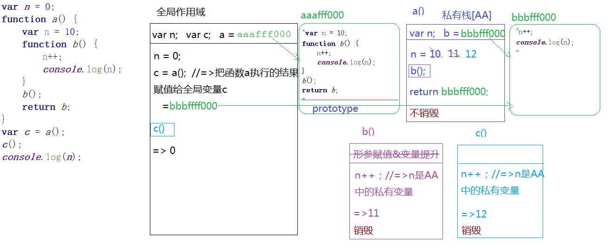

## [06~08]js中的严格模式和ARG的映射机制

- 6.

```javascript
var a=10,b=11,c=12;
function test(a){
     a=1;
     var b=2;
     c=3;
}
test(10);
console.log(a);  
console.log(b);   
console.log(c);

/*
 A、1 11 3   
 B、10 11 12  
 C、1 2 3   
 D、10 11 3
*/
//=> D
```
- 7.

```javascript
if(!("a" in window)){
   var a=1;
}
console.log(a);

/*
A、1   
B、undefined   
C、报错   
D、以上答案都不对
*/
```
> 解析

```javascript
/**
 * 变量提升:
 *      var a; 不管条件是否成立都要进行变量提升, 在全局作用域下声明的变量, 也相当于给window设置了一个对象的属性, 而且两者之间建立了映射的机制<=> window.a=undefined;
 */
if(!("a" in window)){//=> 'a' in window =>true
   var a=1;
}
console.log(a);
```

- 8.

```javascript
var a=4;
function b(x,y,a) {    
     console.log(a); 
     arguments[2]=10;       
     console.log(a); 
}
a=b(1,2,3);   
console.log(a); 

/*
 A、3  3  4   
 B、3  10  4   
 C、3  10  10   
 D、3  10  undefined
*/
```
> 解析

```javascript
var a=4;
function b(x,y,a) {
    /**
     * 形参赋值: x = 1 y = 2 a = 3
     * 变量提升
     */
     console.log(a);//=> 3
     arguments[2] = 10;//=> 把传递的第三个实参值修改为10, 此时第三个形参变量a也会受到影响
     console.log(a);//=> 10
}
a=b(1,2,3);//=> a=b执行的结果 => a = undefined [b函数中并没有编写return, 所以默认函数的返回值是undefined]

console.log(a); 
```

#### arguments映射机制

- arguments: 函数内置的实参集合, 不管是否设置形参, 传递的实参值在这个集合中都存在
> arguments
> {
>  0: 1
>  1: 2
>  2: 3
>  length: 3
>  callee: 函数本身
>  ...
> }
>
> **在js非严格模式下**, 函数中的形参变量和arguments存在映射机制(映射: 互相之间影响)
>  第一个形参变量值修改为100, 那么arg[0]的值也跟着修改为100
>  arg[1]的值修改为200, 那么第二个形参变量y的值也会跟着变为200
>  ...

- 同类题

> arguments 和形参之间的映射是以arguments 的索引为基础完成的, arguments 中有这个索引, 浏览器会完成和对应形参变量中的映射机制搭建, 如果形参比arguments 中个数多, 那么多出来的形参是无法和arguments 中对应的索引建立关联的

```javascript
function fn (x, y) {
    /**
     * 形参
     *  x = 10
     *  y = undefined y也是私有变量, 不是没赋值, 而是赋值为undefined
     * 
     * arg
     *  0: 10
     *  length: 1
     * 
     */
    var arg = arguments;
    arg[0] = 100;
    console.log(x);//=> 100
    y = 200;
    console.log(arg[1]);//=> undefined
}
fn(10);
```

> arguments和形参的映射机制建立在函数执行后形参赋值的一瞬间, 此时能建立映射机制的建立映射机制, 不能建立起来的, 以后不管怎么操作都无法再建立了

```javascript
function fn (x, y) {
    var arg = arguments;
    arg[0] = 100;
    console.log(x);//=> 100
    console.log(y);//=> undefined
    arg[1] = 20;
    console.log(arg);
    //=> 0: 100
    //	 1: 20
    console.log(y);//=> undefined
    y = 400;
    console.log(arg[1]);//=> 20
    //=> arguments和形参的映射机制建立在函数执行后形参赋值的一瞬间, 此时能建立映射机制的建立映射机制, 不能建立起来的, 以后不管怎么操作都无法再建立了
}
fn(10);
```

#### js严格模式

- 在当前作用域的"第一行" 添加 "use strict" 即可, 这样在当前作用域中就开启了js的严格模式(不常用)

> 整个js都开启了严格模式(只对当前这个js文件中的代码生效, 下一个js文件需要开启严格模式, 第一行还需要再次编写), 真实项目中, 我们一般都会把所有js文件合并压缩为一个导入到页面中

```javascript
"use strict";
```

- 只在当前作用域中使用严格模式(常用)

```javascript
function fn () {
    "use strict";
}
```

> 工作的时候, 如果有的人不按严格模式, 有的人按严格模式写,就要在当前作用域中使用严格模式, 因为后期js文件合并要互不影响.

```javascript
~function () {
    "use strict";
    //...
}();
```

```javascript
~function () {
    
}();
```

> 合并

```javascript
~function () {
    "use strict";
    //...
}();
~function () {
    
}();
```

- 严格模式和非严格模式的区别

> 1. 在严格模式下不支持使用 arguments.callee/ arguments.callee.caller   (报错: Uncaught TypeError: 'caller', 'callee', and 'arguments' properties may not be accessed on strict mode functions or the arguments objects for calls to them)
> 2. 在严格模式下arguments和形参没有映射机制
> 3. 在严格模式下不允许给一个对象设置重复属性名的: "obj={n:10,n:20}"
> 4. 在严格模式下, 函数执行, 如果没有明确指定执行的主体(函数前面没有点), 不再像非严格模式下一样, 统一都交给window, 而是让this指向 undefined, 代表没有执行主体: " 严格模式下, 有执行主体this就指向谁, 没有执行主体, this就是undefined"(高程717页有汇总, 不全)

```javascript
// 非严格模式
~function () {
    // function fn (x) {
    //     arguments[0] = 100;
    //     console.log(x);//=> 100 存在映射机制
    // }
    // fn(10);

    // var obj = {
    //     n: 10,
    //     n: 20
    // };
    // console.log(obj.n);

    function fn () {
        console.log(this);//=> window
    }
    fn();
    
}();
// 严格模式
~function () {
    "use strict";
    // function fn (x) {
    //     arguments[0] = 100;
    //     console.log(x);//=> 10 不存在映射机制
    // }
    // fn(10);

    // var obj = {
    //     n: 10,
    //     n: 20
    // };
    // console.log(obj.n);

    function fn () {
        console.log(this);//=> undefined
    }
    fn();
}();
```

## [09]逻辑或和逻辑与

- 9.

```javascript
var foo='hello'; 
(function(foo){
   console.log(foo);
   var foo=foo||'world';
   console.log(foo);
})(foo);
console.log(foo);

/*
 A、hello hello hello   
 B、undefined world  hello   
 C、hello world world   
 D、以上答案都不正确
*/
//=> A
```
- 解析:

```javascript
var foo = 'hello';
(function (foo) {
    /**
     * 形参赋值: foo = 'hello'
     * 变量提升: var foo;(这一步省略: 因为在私有作用域中已经有foo这个变量了, 浏览器不会重新声明重复的变量)
     */
    console.log(foo);//=> hello
    var foo = foo || 'world';//=> 'hello' || 'world' => foo = hello
    console.log(foo);//=> hello
})(foo);// 把全局下的foo的值作为实参传递给函数的形参 => 'hello'
console.log(foo);//=> hello
```
### 在条件判断中使用

> 条件中的&&: 两个条件都成立, 整体判断条件才会成立
>
> 条件中的||: 只要有一个条件成立, 整体判断条件就成立

```javascript
if (1===1 && 2===2) {
    
}
```

### 在赋值操作中使用

> "A || B": 先验证A的真假, 为真结果是A, 为假结果是B
>
> "A && B": 先验证A的真假, 为真结果是B, 为假结果是A

```javascript
var a = 1 || 2;
console.log(a);//=> 1

console.log(1 && 2);//=> 2
console.log(1 && 0);//=> 0
console.log(1 && false);//=> false
console.log(0 || 1);//=> 1
```

- 逻辑或 || 的应用

> "给形参赋值默认值": 验证传递的参数值, 如果没有传递实参, 让其默认值为零
>
> 可以使用:
>
> if (x === undefined) {
> ​    x = 0;
> }
> // '=='的话会出现问题, 因为 null == undefined成立.
>
> 也可以使用:
>
> if (typeof x === 'undefined') {
> ​    x = 0;
> }.
>
> 也可以使用:(更常用, 不严谨)
>
> x = x || 0;

```javascript
function fn (x) {
    x = x || 0;//=> 如果x没传递值, x=undefined => x = undefined || 0
    // 这种赋值的方式没有上面if判断严谨,if这种是没传递值才会赋值默认值, ||这种是不传值或者传递的值是假, 都让它等于零(实际开发用的最多)
}
```

- 逻辑与 && 的应用

> 验证有没有传函数, 验证其执行不执行
>
> 可以使用:
>
> if (typeof callback==='function'){
> ​	callback();
> }
>
> 也可以使用:
>
> callback && callback();   (常用, 不严谨)

```javascript
function fn (callback) {
    
    callback && callback();//=> 上面if判断的简写版(不严谨): 默认callback要不然就传函数, 要不然就不传
}
fn(function () {});
```

### &&和||混合应用模式

> 优先级: 逻辑与的优先级高于逻辑或

```javascript
console.log(0 || 1 && 2 || 0 || 3 && 2 || 1);
// 0 || 2 || 0 || 2 || 1
// 2 || 0 || 2 || 1
// 2 || 2 || 1
// 2 || 1
// 2
```

### 逻辑或的实战应用

- 形参赋值默认初始化(初始化形参)

> 在ES6 新语法规范中可以直接给形参设置默认值

```javascript
function fn (x = 0) {
	// 如果x没有传递值, 默认值是零, 一旦传递值, 不管传递的是什么, 都是按照传递的值处理的.(除了undefined.传递undefined, 浏览器也是按照没有传递值处理的)
}
fn();//=> 0
fn(null);//=> null
fn(undefined);//=> 0 


```


## [10]有关堆栈内存释放

- 10.

```javascript
var a=9; 
function fn(){ 
    a=0;       
    return function(b){ 
        return b+a++; 
    }    
}
var f=fn();
console.log(f(5));
console.log(fn()(5));
console.log(f(5));
console.log(a);

/*
 A、6 6 7 2   
 B、5 6 7 3   
 C、5 5 6 3   
 D、以上答案都不正确 
*/
//=> D   5 5 6 2
```

- 解析

> 1. 只要是return返回的就不销毁吗?
>
> 如果return的是一个基本数据类型, 返回就销毁
>
> 如果return的是一个引用数据类型, 返回不能销毁, 因为传递的是地址, 地址内的东西被其它地方占用.
>
> 2. bbbfff000中和bbbfff111中出现 形参: b, 是不存在的, 为了好理解写上的.堆内存中实际只有代码字符串.

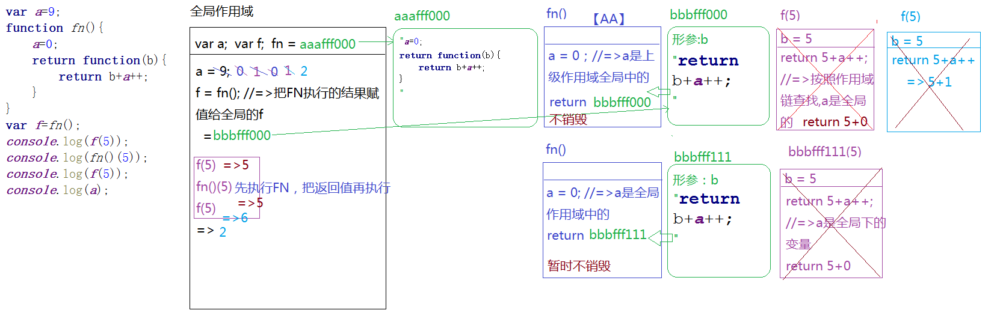

## [11~13]

- 11.

```javascript
var ary=[1,2,3,4];
function fn(ary){
    ary[0]=0;    
    ary=[0];    
    ary[0]=100;    
    return ary; 
}
var res=fn(ary);    
console.log(ary);    
console.log(res);
```
- 解析
> **私有变量和全局变量没有直接关系, 但是会存在间接关系, 全局变量给函数赋值了地址, 都操作的同一个空间. 函数在形成了一个闭包后, 会切断私有变量和全局变量的干扰, 当这种切断是切断的直接干扰,仍然会有间接的干扰**
```javascript
/**
 * 变量提升:
 *  var ary;
 *  fn = aaafff111;
 *  var res;
 */
var ary = [1, 2, 3, 4];//=> ary = bbbfff111[ary全局变量] [0, 2, 3, 4]
function fn(ary) {
    /**
     * 形参赋值: ary = bbbfff111 [ary是私有变量]
     */
    ary[0] = 0;
    ary = [0];//=> ary = bbbfff222  [0(100)]
    ary[0] = 100;
    return ary;//=> bbbfff222
}
var res = fn(ary);//res = fn(bbbfff111) = bbbfff222
console.log(ary);//=>[0, 2, 3, 4]
console.log(res);//=> [100]

//=> [0, 2, 3, 4]
//	 [100]
```
- 12.

```javascript
function fn(i) {
    return function (n) {
        console.log(n + (i++));
    }
}
var f = fn(10);
f(20);
fn(20)(40);
fn(30)(50);
f(30);
```
> 解析

```javascript
/**
 * 变量提升:
 * fn = aaafff111;
 * var f;
 */
function fn(i) {
    /**
     * 第一次aaafff111执行:
     * i = 10;(11)
     * return bbbfff111
     */
    /**
     * 第二次aaafff111执行:
     * i = 20;(21)
     * return bbbfff222
     */
    /**
     * 第三次aaafff111执行:
     * i = 30;(31)
     * return bbbfff333;
     */
    return function (n) {
        /**
         * 第一次bbbfff111执行:
         * n = 20
         * => 20 + (i++)=20 + 10=30
         */
        /**
         * 第二次bbbfff222执行:
         * n = 40;
         * => 40 + (i++)=40 + 20=60
         */
        /**
         * 第三次bbbfff333执行:
         * n = 50;
         * => 50 + (i++)=50 + 30=80
         */
        /**
         * 第四次bbbfff111执行:
         * n = 30;
         * => 30 + (i++)= 30 +11=41
         */
        console.log(n + (i++));
    }
}
var f = fn(10);
f(20);//=> 30
fn(20)(40);//=> 60
fn(30)(50);//=> 80
f(30);//=> 41
//=> 30  60  80  41
```

- 13.

```javascript
var i = 10;
function fn() {
    return function (n) {
        console.log(n + (++i));
    }
}
var f = fn();
f(20);//=> 31
fn()(20);//=> 32
fn()(30);//=> 43
f(30);//=> 44
//=> 31 32 43 44
```

## [14]堆栈内存和this混合应用

- 14.

```javascript
var num = 10;
var obj = {num: 20};
obj.fn = (function (num) {
    this.num = num * 3;
    num++;
    return function (n) {
        this.num += n;
        num++;
        console.log(num);
    }
})(obj.num);
var fn = obj.fn;
fn(5);
obj.fn(10);
console.log(num, obj.num);
```

> 解析:

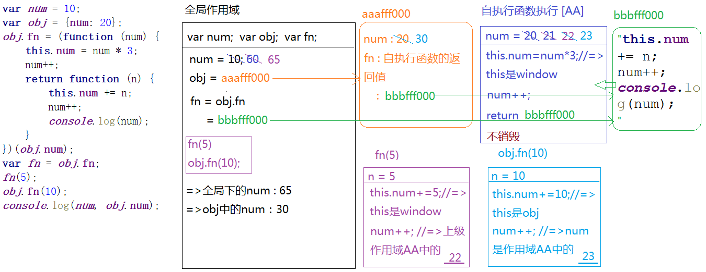

- 改题目

```javascript
var num = 10,  
    obj = {num: 20};
obj.fn = (function (num) { 
    num = this.num + 10;
    this.num = num + 10;
    return function () {
        this.num += ++num;
    }
})(num);
var fn = obj.fn;
fn();
obj.fn();
console.log(num, obj.num);
//=> 51 42
```

> 解析

```javascript
/*
 * 变量提升：
 *   var num;
 *   var obj;
 *   var fn;
 */
var num = 10,
    obj = {num: 20};//=>obj=aaafff000   =>{num:20,fn:bbbfff000}
obj.fn = (function (num) {
    /*
     * num=10
     * this->window
     */
    num = this.num + 10;//=>num=20 (21) (22)
    this.num = num + 10;//=>window.num=30

    return function () {//=>bbbfff000
        /*
         * fn()
         *   this->window
         *   window.num+= ++num; //=>window.num=51
         */
        /*
         * obj.fn()
         *   this->obj
         *   obj.num+= ++num; //=>obj.num=42
         */
        this.num += ++num;
    }
})(num);
var fn = obj.fn;//=>fn=bbbfff000
fn();
obj.fn();
console.log(num, obj.num);
```

## [15]构造函数和原型链的运行机制

- 1 和 new Number(1) 

> 区别
> ​	前面是一个基本数据类型值
>
> ​	后面是一个引用数据类型值（对象）
> 相同点：	
>
> ​	都是Number这个类的实例

- 函数类型 和 对象类型

> 函数类型
>
> ​	普通函数
>
> ​	构造函数(类: 内置类和自己创建的类)
>
> 对象类型:
>
> ​	普通对象
>
> ​	Math \ JSON ...
>
> ​	类的实例
>
> ​	prototype 或者 \__proto__
>
> ​	arguments或者 元素集合等类数组
>
> ​	函数也是一种对象
>
> ​	...
>
> ​	=> 万物皆对象

- 原型和原型链汇总

> 1. 每一个函数(类)都有一个prototype(原型)属性, 属性值是一个对象: 这个对象中存储了当前类供实例调取使用的公有属性和方法
> 2. 在"浏览器默认"给原型开辟的堆内存中有一个属性constructor: 存储的是当前类本身
> 3. 每一个对象(实例)都有一个\__proto__(原型链)属性, 这个属性指向当前实例所属类的原型(不确定所属的类, 都指向Object.prototype)

- 15.

```javascript
function Fn() {
    this.x = 100;
    this.y = 200;
    this.getX = function () {
        console.log(this.x);
    }
}
Fn.prototype.getX = function () {
    console.log(this.x);
};
Fn.prototype.getY = function () {
    console.log(this.y);
};
var f1 = new Fn;
var f2 = new Fn;
console.log(f1.getX === f2.getX);//=> false
console.log(f1.getY === f2.getY);//=> true
console.log(f1.__proto__.getY === Fn.prototype.getY);//=> true
console.log(f1.__proto__.getX === f2.getX);//=> false
console.log(f1.getX === Fn.prototype.getX);//=> false
console.log(f1.constructor);// Fn (f1通过__proto__属性向上查找所属类的prototype属性有 constructor属性)
console.log(Fn.prototype.__proto__.constructor);//=> Object
f1.getX();//=> this:f1   100
f1.__proto__.getX();//=> this:f1.__proto__   => console.log(f1.__proto__.x) => undefined  (向Object.prototype查找也没有y属性)
f2.getY();//=> this:f2 => console.log(f2.y) => 200
Fn.prototype.getY();//=> this:Fn.prototype => console.log(Fn.prototype.y) => undefined  (向Object.prototype查找也没有y属性)
```

- 展开理解

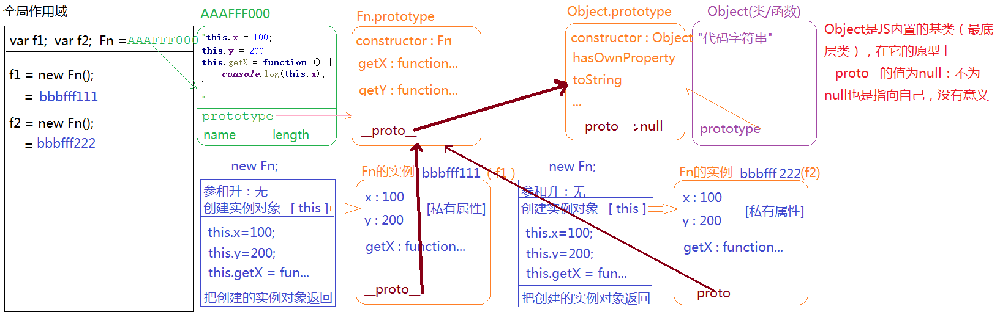

> 函数存储在堆内存中, 不仅有代码字符串, 还有prototype, name, length属性
>
> length属性: 函数参数的个数
>
> name属性: 函数的名字
>
> 但这两个属性没什么用

```javascript
function Fn() {
    this.x = 100;
    this.y = 200;
    this.getX = function () {
        console.log(this.x);
    }
}
```


```javascript
function Fn(a, b, c) {
    this.x = 100;
    this.y = 200;
    this.getX = function () {
        console.log(this.x);
    }
}
```

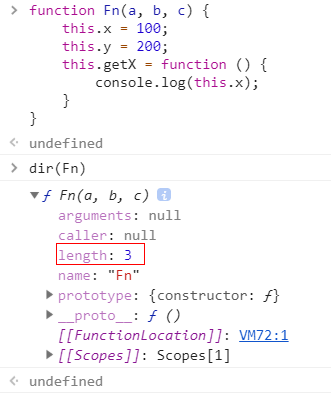

## [16]基于闭包解决循环绑定

- 16.

> 以下代码的功能是要实现为5个input按钮循环绑定click点击事件，绑定完成后点击1、2、3、4、5五个按钮分别会alert输出0、1、2、3、4五个字符。（腾讯）
>
> 1. 请问如下代码是否能实现？
> 2. 如果不能实现那么现在的效果是什么样的？
> 3. 应该做怎样的修改才能达到我们想要的效果，并说明原理？
```html
<div id="btnBox">
    <input type="button" value="button_1" />
    <input type="button" value="button_2" />
    <input type="button" value="button_3" />
    <input type="button" value="button_4" />
    <input type="button" value="button_5" />
</div>
```
```javascript
var btnBox=document.getElementById('btnBox'),
    inputs=btnBox.getElementsByTagName('input');
var l=inputs.length;
for(var i=0;i<l; i++){
    inputs[i].onclick = function () {
        alert(i);
    }
}
```

> 1. 为啥不行?
>
> 不能实现, 事件绑定是"异步编程", 当触发点击行为, 绑定的方法执行的时候, 外层循环已经结束; 方法执行产生私有作用域, 用到变量i, 不是私有的变量, 按照"作用域链"的查找机制, 找到的是全局下的i (此时全局的i已经成为循环最后一次的结果3)
>
> 2. 如何解决?
>
> 自定义属性
>
> 闭包
>
> ES6

- 闭包解决

```javascript
var btnBox=document.getElementById('btnBox'),
    inputs=btnBox.getElementsByTagName('input');
for(var i=0; i < inputs.length; i++){
    inputs[i].onclick = (function (i) {
        return function () {
            alert(i);
        }
    })(i)
}
```

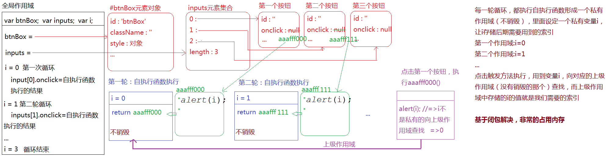

- ES6解决

> Es6和闭包的机制类似, ES6中使用LET创建变量, 会形成块级作用域, 当前案例中, 每一轮循环都会有一个子级的块级作用域, 把后续需要用到的索引i实现存储到自己的作用域中

```javascript
for (let i = 0; i < inputs.length; i++) {
    inputs[i].onclick = function () {
        alert(i);
    }
}
/*步骤:
{
    i = 0;
    inputs[i].onclick = function () {
        alert(i);
    }
}
{
    i = 1;
    inputs[i].onclick = function () {
        alert(i);
    }
}
...
*/
```

## [17]有关this的两道面试题

- 17.

> 用友面试题
>
> (1)

```javascript
var fullName = 'language';
var obj = {
    fullName: 'javascript',
    prop: {
        getFullName: function () {
            return this.fullName;
        }
    }
};
console.log(obj.prop.getFullName());// undefined (obj 中的fullName 是属性, 不是变量)
var test = obj.prop.getFullName;
console.log(test());//'language'
//=> undefined
//=> 'language'
```

(2)

```javascript
var name = 'window';
var Tom = {
    name: "Tom",
    show: function () {
        console.log(this.name);
    },
    wait: function () {
        var fun = this.show;
        fun();
    }
};
Tom.wait();
//=> 'window'
```

- 总结

> 1. 元素绑定事件, 方法中的this是当前操作的元素
> 2. 方法名前面是否有点, 有点, 点前面是谁this就是谁, 没有this是window(严格模式下是undefined)
> 3. 构造函数执行, 方法体中的this是当前类的一个实例

## [18]关于原型重定向问题

- 18.

> 腾讯面试

```javascript
function fun() {
    this.a = 0;
    this.b = function () {
        alert(this.a);
    }
}
fun.prototype = {
    b: function () {
        this.a = 20;
        alert(this.a);
    },
    c: function () {
        this.a = 30;
        alert(this.a)
    }
}
var my_fun = new fun();
my_fun.b();
my_fun.c();
//=> 0  30
```


> 解析

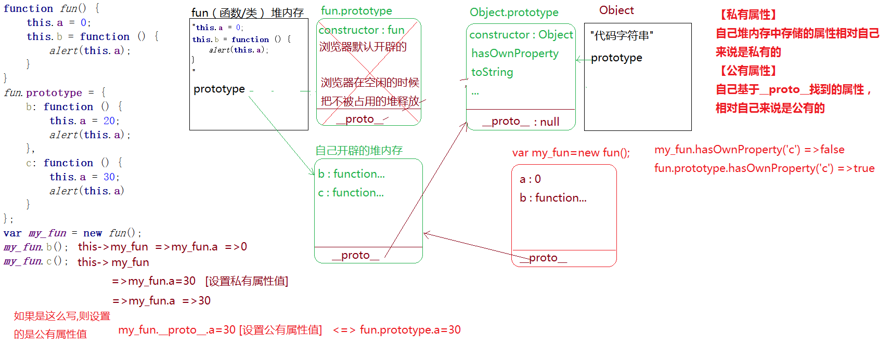

- 在实际项目 基于面向对象开发的时候(构造原型设计模式), 我们根据需要, 很多时候回重定向类的原型(让类的原型指向自己开辟的堆内存)
> [存在的问题]
>
> 1. 自己开辟的堆内存中没有constructor属性, 导致类的原型构造函数缺失(解决: 自己手动在堆内存中增加constructor属性)
>
> 下图: 如果不手动添加constructor属性, 则输出重定向的prototype中的constructor属性会指向Object基类.

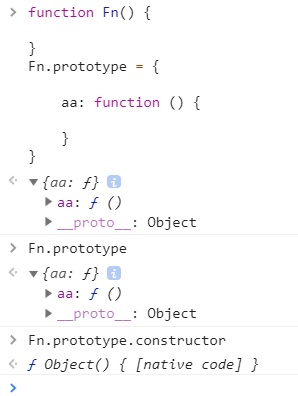


> 2. 当原型重定向后, 浏览器默认开辟的那个原型堆内存会被释放掉, 如果之前已经存储了一些方法或者属性, 这些东西都会丢失(所以: **内置类的原型不允许重定向到自己开辟的堆内存, 因为内置类原型上自带很多属性方法, 重定向后都没了, 这样是不被允许的,内置类原型保护**)
>

```javascript
// 需要用到重定向的实例:
function Fn() {

}
//=> 当我们需要给类的原型批量设置属性和方法的时候, 一般都是让原型重定向到自己创建的对象中 
Fn.prototype.aa = function () {

}
Fn.prototype.bb = function () {

}
Fn.prototype.cc = function () {

}
Fn.prototype.dd = 10;
// 这样写太繁琐, 才会重定向, 增加属性的时候直接添加进去, 但需要手动加入constructor, 如果不手动加的话, constructor会指向Object
Fn.prototype = {
    constructor: Fn,
    aa: function () {

    }
}
```
- 私有属性和公有属性的相对性

> [私有属性]
> 自己堆内存中存储的属性性对于自己来说是私有的
> [公有属性]
> 自己基于__proto__找到的属性, 相对于自己来说是公有的

## [19]关于原型重定向综合练习

- 19.

```javascript
function Fn() {
    var n = 10;
    this.m = 20;
    this.aa = function () {
        console.log(this.m);
    }
}
Fn.prototype.bb = function () {
    console.log(this.n);
}
var f1 = new Fn;
Fn.prototype = {
    aa: function() {
    console.log(this.m + 10);
}
};
var f2 = new Fn;
console.log(f1.constructor);// Fn
console.log(f2.constructor);// Object
f1.bb();// undefined
f1.aa();// 20
f2.bb();// 报错  (f2.bb是undefined  undefined() 执行会报错)
f2.aa();// 20
f2.__proto__.aa();//=> undefined+10 => NaN
```

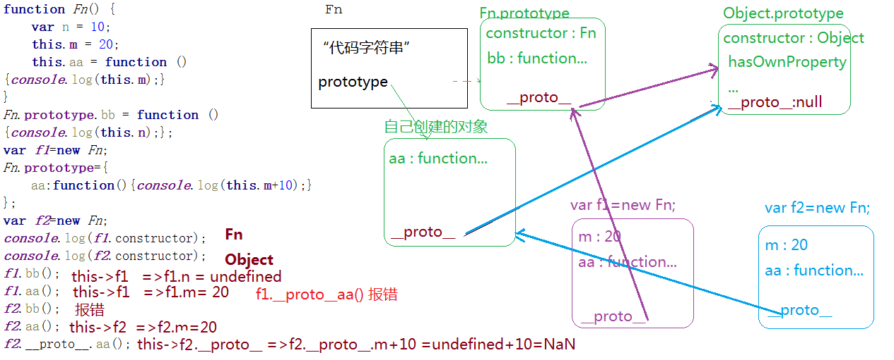

## [20]数组去重引发的基于内置类原型扩展方法, 并且实现链式调用


- 5.
> 如何实现数组去重？（乐视TV）
- 初始版本

> [12, 13, 13, 13, 12, 13, 14]//=> 依次遍历数组中的每一项, 让每一项的值作为对象的属性名和属性值(属性值存啥都可以), 每一次存储之前验证当前对象中是否已经存在这个属性(in/hasOwnProperty/属性值不是undefined...), 如果有这个属性了, 说明当前项在数组中已经存在了, 我们把当前项在原有数组中移出即可, 如果不存在, 存储到对象中即可

```javascript
function unique(ary) {
    var obj = {};
    for(var i = 0; i < ary.length; i++){
        var item = ary[i];
        if (obj.hasOwnProperty(item)) {
            ary.splice(i, 1);
            i--;
            continue;
        }
        obj[item] = item;
    }
}
```
- 数组和对象中[]的区别
> 数组ary, ary[i]中的i是索引, ary[i]整体是i索引对应的项.
> 对象obj, obj[i]中的i是属性, obj[i]整体是i属性对应的属性值.

- 优化
> 1. 优化一: 不使用splice删除(删除当前项, 后面索引移动位置, 如果后面有很多项, 导致性能消耗较大)
>    解决: 把最后一项替换成当前项, 在把最后一项删除即可(会改变原有数组的顺序, 如果不改变顺序的去重, 不能使用该方法)
>
> 2. 优化二: obj = null;// obj没用后手动释放一下, 节约内存, obj没有被外面占用, 即使不手动释放, 栈内存释放后, 浏览器检测, obj指向的堆内存也会被浏览器自动释放, 手动是为了释放快一点.
> 3. 注意: unique不用手动销毁, 栈内存不自动销毁的前提是内部变量被外部占用. 但是unique函数中ary变量并没有被占用, 函数执行完会自动销毁栈内存. 这是因为ary传递的不是值, 是内存地址, 在unique函数中修改的ary, 实际上就是修改的全局变量ary. 函数执行完毕又把地址返回, 无论让res接收或者不接收都与私有作用域无关, 这个地址一直代表的是全局作用域旁的堆内存.

```javascript
function unique(ary) {
    var obj = {};
    for(var i = 0; i < ary.length; i++){
        var item = ary[i];
        if (obj.hasOwnProperty(item)) {
            ary[i] = ary[ary.length - 1];// 优化一
            ary.pop();// 删除最后一项 或者使用 ary.length--
            i--;
            continue;
        }
        obj[item] = item;
    }
     
    obj = null;//=> 优化二
    return ary;
}
var ary = [1,5,4,6,5,4,5,4,4,5,6,1,2,3,4,5,6,2,5,2,3];
var res = unique(ary);
console.log(res)
```
- 为什么ary.sort可以执行: 

> 因为sort是array.prototype上的内置的属性方法, 而ary是它的一个实例, 可以基于__proto__找到原型上的这个方法, 然后调取使用
```javascript
var ary = [12, 13, 45, 123, 4, 65, 65, 45, 4];
ary.sort(function (a, b) {
    return a - b;
});
```
- 基于内置类的原型扩展方法, 供它的实例调取使用
> 1. 我们增加的方法最好设置"my"前缀(前缀是什么自己定), 防止把内置方法重写
> 2. 指向的匿名函数建议写名字, 要和变量名一样
>   Array.prototype.myUnique指向匿名函数, 如果写成命名函数也可以, 但没什么用, 就是为了和内置方法显示一样.

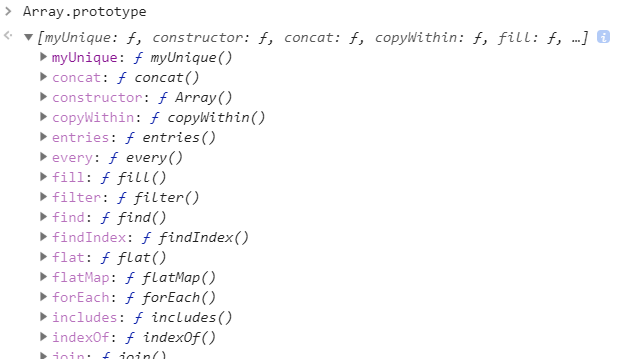

- this指向问题
> 下面三个虽然都是ary执行相同的方法, 但是this的指向都变了, 不过后两个种几乎不用
```javascript
ary.myUnique();//=> this: ary
ary.__proto__.myUnique();//=> this: ary.__proto__(IE浏览器中屏蔽了我们对__proto__的操作) 这种方式很少用
Array.prototype.myUnique();//=> this: Array.prototype 这种方式很少用
```
- 再次优化

```javascript
Array.prototype.myUnique = function myUnique() {
    //=> 方法中的this一般都是当前类的实例(也就是我们要操作的数组)
    //=> 操作this相当于操作ary, 方法执行完成会改变原有数组
    var obj = {};
    for (var i = 0; i < this.length; i++){
        var item = this[i];
        obj.hasOwnProperty(item) ? (this[i] = this[this.length - 1], this.length--, i--) : obj[item] = item;
    }
    obj = null;
}
ary.myUnique();//=> this:ary 此时方法执行完成的返回值是undefined(原有数组改变)
console.log(ary);
```
- js中的链式写法
> 保证每一个方法执行返回的结果依然是当前类的实例, 这样就可以继续调取方法使用了
```javascript
// 执行sort返回排序后的数组(也是array的一个实例), 执行reverse返回的也是一个数组, 执行pop返回的是删除的那一项(不是数组)
var ary = [12, 13, 45, 123, 4, 65, 65, 45, 4];
ary.sort(function (a,b) {
    return a-b;
}).reverse().pop();

ary.sort(function (a,b) {
    return a-b;
}).reverse().pop().reverse();// 报错

ary.sort(function (a,b) {
    return a-b;
}).reverse().slice(2, 7).join('+').split('+').toString().substr(2).toUpperCase();
// slice: 数组截取, 返回数组.  join: 数组每一项中间加东西, 返回字符串.  split: 把字符串带有东西的去掉, 返回数组.
```
- 最终版
```javascript
Array.prototype.myUnique = function myUnique() {
    var obj = {};
    for (var i = 0; i < this.length; i++){
        var item = this[i];
        obj.hasOwnProperty(item) ? (this[i] = this[this.length - 1], this.length--, i--) : obj[item] = item;
    }
    obj = null;
    return this;
}

// 返回一个数组中的最大值
var max = ary.myUnique().sort(function (a,b) {
    return a-b;
}).pop();
```
- 解决了很多问题:
> 1. 用对象键值对的方式来减少for循环导致的循环次数过多,内存消耗过大问题
> 2. 在对象键值对的方式里解决数组塌陷问题
> 3. 用splice删除后面每一项向前移位的问题
> 4. 手动释放堆内存优化问题
> 5. 扩展到内置类的原型上, 实例可以点出来
> 6. 通过return this还可以使用链式写法


- 思考题
> 让下面的运算成立, res=6
> var n =5;
> var res = n.plus(3).minus(2);
> console.log(res)
```javascript
~function (pro) {
    pro.plus = function plus(val) {
        val === undefined ? val = 0 : true;
        val ? val : 0;
        return this + Number(val);
    }
    pro.minus = function minus(val) {
        val === undefined ? val = 0 : true;
        return this - Number(val);
    }
}(Number.prototype)
var n = 5;
var res = n.plus(3).minus(2);
console.log(res);//=> 6
```

## [其余随性题]闭包和团队协作开发

- document.parentNode 和 document.parentnode 的区别？（腾讯）

```javascript
document.parentNode => null
document.parentnode => undefined
```
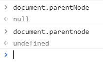

- 怎么规避多人开发函数重名的问题？（百度搜索）
> 答: 
  三大种: 
  单例: 把实现当前模块的方法和属性放在同一个命名空间下
  模块化思想  
  (AMD  CMD  CommonJS)

- JavaScript如何实现面向对象中的继承？ （百度移动）
> 答: 原型继承  call继承  混合继承 冒充对象继承  寄生组合式继承  class基于extends继承(ES6)  周氏继承法

- 你理解的闭包作用是什么，优缺点？（乐视）
> 答: 开放性的题, 需要自己整理出专题

- 趣味题（乐视） 
> 有这样一个村庄，村里的每一个丈夫都背着妻子偷情，村里的每个妻子都知道除了自己丈夫以外的男人偷情，村里有一个规定，如果妻子知道自己的丈夫偷情必须当天处决。有一天村里的女头领说村里有一个丈夫偷情，接下来会发生什么？

> 答: 随性题自己怎么认为怎么答, 智商题还是需要网上查一下


