# 工欲善其事必先利其器

## NODE安装
官网:https://nodejs.org/zh-cn/ 
- 推荐使用LTS稳定版本，把安装包下载下来后，直接一路下一步安装即可（最好把它安装到C盘 [默认盘符] ，记好安装目录）

> 1. 如果安装不了，我们可以把别人安装完成的内容拷贝过来，通过修改环境变量完成安装
> 高级系统设置 -> 环境变量 -> 系统变量 -> Path，把原有的变量值备份一份，在原有的基础上增加node的安装目录即可


>  2. 验证安装是否成功
>      WIN + R  => 打开运行窗口 => 输入cmd => 打开DOS窗口
>      在DOS窗口中，输入 node -v / node --version / npm -v 能出现版本号，则代表安装成功，不能出现版本号，提示node不是内部或者外部命令的，遵循第一步配置环境变量即可

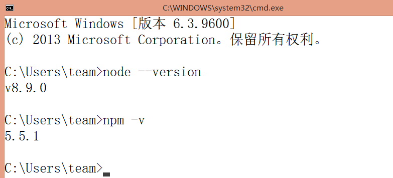


## NODE基础概念
- node并不是一门语言，它是一个工具或者环境

- 特点: 

> 基于V8引擎（webkit）渲染和解析JS的
单线程
无阻塞I/O操作
事件驱动
...

之所以把node称之为服务器端语言，是因为node给予JS操作服务器的能力：我们在服务器端安装node，只用js完成服务器端需要处理的一些事情，最后把写好的js代码交给node环境运行即可

### 在node环境中把JS代码执行 

- REPL命令（Read-Evaluate-Print-Loop：输入-求值-输出-循环）  

> 1. Node.js command prompt窗口打开只输入一个node,回车, 就和浏览器F12的console一样.(不常用)

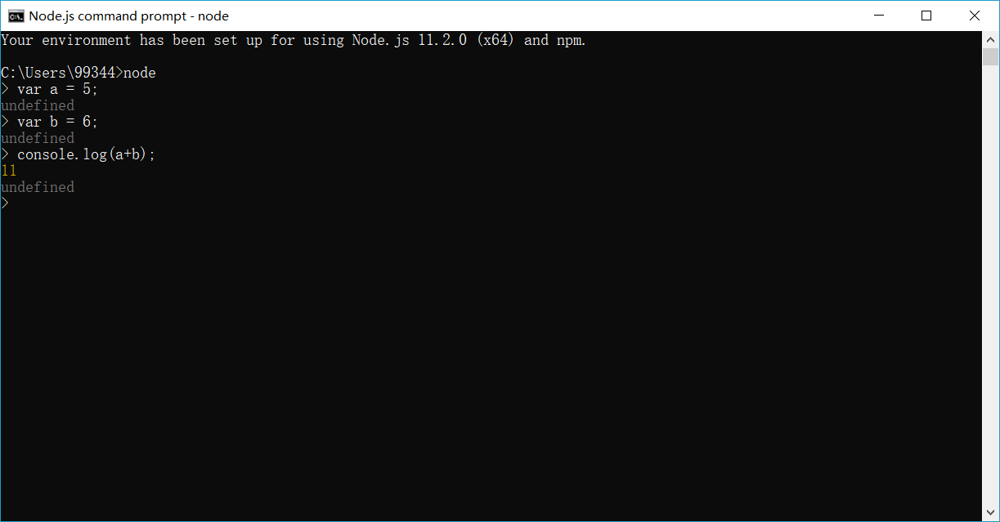

> 2. 在运行cmd中窗口输入node, 和Node.js command prompt窗口输入node效果一样.(不常用)

- 基于 node xxx.js 命令执行

> 基于node命令执行，我们需要先找到当前文件所在的文件夹，然后在这个目录下打开DOS窗口，在窗口中执行 node xxx.js，这样就相当于在node环境下把JS文件中的代码执行了
> 如何在当前文件目录中打开DOS窗口

> 1. 基于DOS命令中的“cd”一层层进入
>

> 2. 在当前目录地址栏中输入cmd，快速在当前目录打开
>

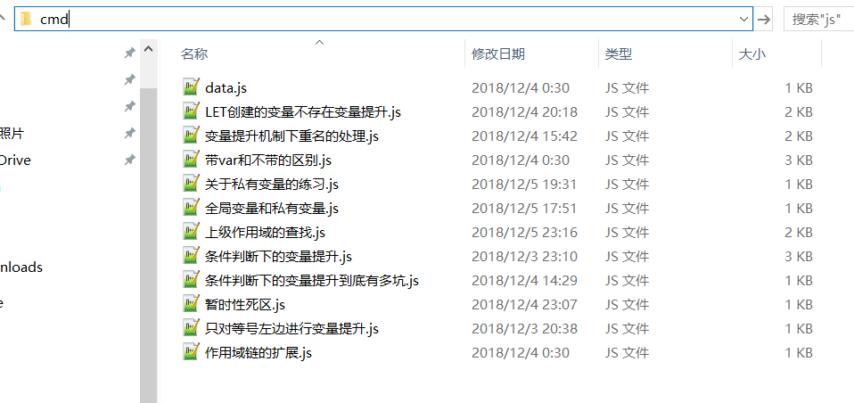

> 3. shift+鼠标右键，在此处打开命令窗口
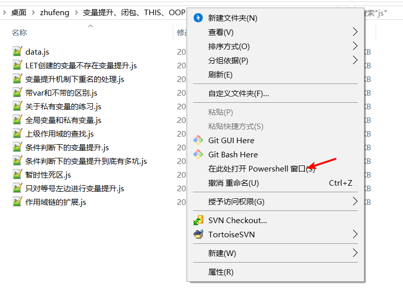

- 基于WB(webstrom)这类编辑工具直接执行
> 在WB中配置node环境
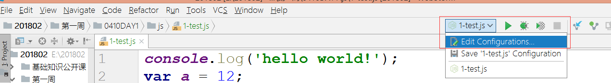
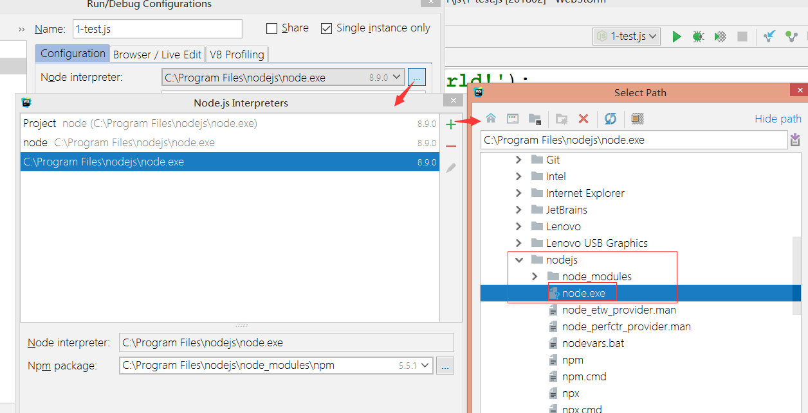

## 扫盲：常用的DOS命令

`ping www.baidu.com`: 测三次出结果

`ping www.baidu.com -t`：测试网速
`Ctrl+c`：结束当前正在运行的操作
`exit`：退出当前窗口
`ipconfig -all`：查看当前电脑的 物理地址/IP地址/子网掩码/DNS等信息
`cls`：清屏
`cd`：进入到指定的文件目录（windows电脑需要先进入到对应的磁盘 `E:`）
`cd ../`：返回上级目录
`cd ./`：当前目录
`cd /`：根目录
`dir`：查看当前目录下所有的文件    linux用`ls`
`mkdir`：创建文件夹

`rmdir xxx`：删除文件夹

`copy con xxx.xx`：创建文件并且给文件中输入内容，输入完成后，用Ctrl+c结束并保存
`del xxx.xx`：删除文件     linux用`rm`

## npm模块管理

### 安装npm

- 安装完成node后，基本上自带npm模块管理器

### 使用npm下载

- 需要一个第三方（别人写的）模块、插件、类库或者框架等，需要提前下载安装才可以使用

> 1. 百度搜索，找到下载地址，然后基于浏览器下载即可（资源比较混乱，不好搜索）

> 2. 也可以基于npm等第三方包管理器下载（yarn / bower ... 都是第三方模块管理器） npm下载的资源都是在https://www.npmjs.com/ 中下载的
>    `npm install xxx`：把资源或者第三方模块下载到当前目录下
>    `npm install xxx -g (--global)`：把资源或者第三方模块安装到全局环境下（目的：以后可以基于命令来操作一些事情）
>    `npm uninstall xxx / npm uninstall xxx -g`：从本地或者全局卸载

- 基于npm安装的一些细节点：

> 需要连网（基于npm是从国外服务器上下载资源，所以下载速度较慢）
>
> 下载成功后，当前目录中多增加一个 node_modules文件夹，在这个文件夹中找到我们安装的模块
>
> 一般来说，下载下来的内容包含源码和最后供开发者使用的压缩版本

### npm下载慢问题

- 解决下载慢的问题
> 1. **基于nrm切换到国内下载源（一般是淘宝镜像）**
>     首先安装nrm，而且是把它安装到全局环境下（因为我们需要使用命令）
>     npm install nrm -g

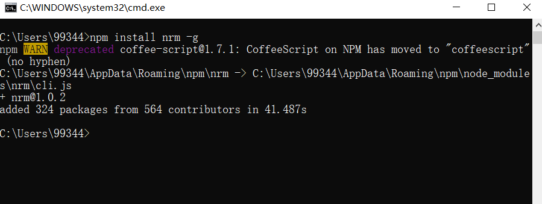

>   安装完成后，我们可以使用 nrm 命令
>   `nrm ls` 查看当前可用源

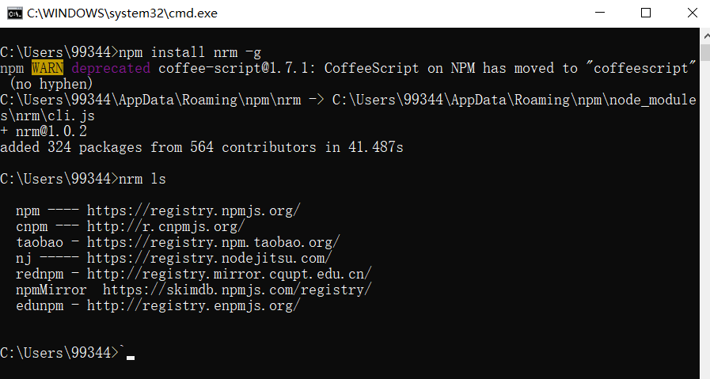

>   `nrm use xxx` 使用某个源

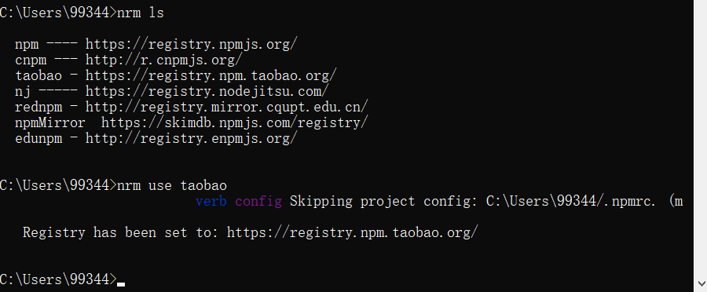

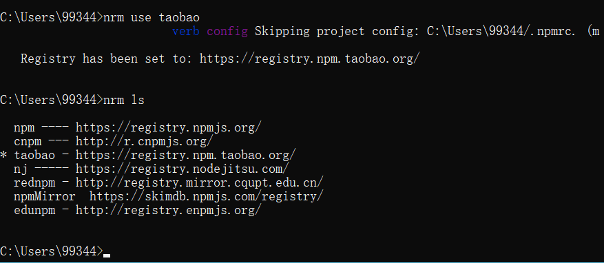

>   使用哪个源, 哪个源前面有`*`号标识
>
>   **切完源，还是基于npm安装操作**


> 2. **可以基于yarn来安装管理**(另一个模块管理器)
>     首先还是需要先安装yarn，安装到全局，然后基于yarn安装我们需要的模块
>     npm install yarn -g

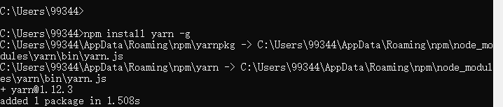

> 基于yarn安装（只能安装在本地，不能安装到全局, yarn本身是全局的, 但是它安装的东西不能是全局的）
> yarn add xxx
> yarn remove xxx

> 3. **基于cnpm淘宝镜像来处理**(另一个模块管理器)

- 解决安装版本的问题

> 首先查看当前模块的历史版本信息
> `npm view jquery > aa.json` ：把当前模块的历史信息输出到具体的某个文件中（文件名自己随便起的）(好像不行了)
>
> `npm view jquery versions`: npm 查看模块全部版本

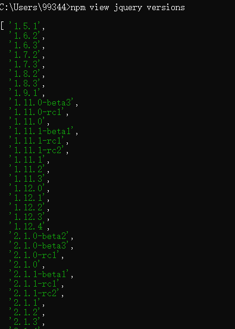

> 安装指定的版本模块
> `yarn add jquery@1.11.3`：npm和yarn都是这样来指定安装具体版本模块的


## git的基础知识
### 集中式版本控制系统

>集中式开发：是将项目集中存放在中央服务器中，在工作的时候，大家只在自己电脑上操作，从同一个地方下载最新版本，然后开始工作，做完的工作再提交给中央服务器保存。这种方式需要联网，现在云开发就是这样的处理方式。
>
>`svn`：在git诞生前就已经存在的版本控制系统，不过它是“集中式”管理

### 分布式版本控制系统

> 分布式开发：只要提供一台电脑作为版本集中存的服务器放就够了，但这个服务器的作用仅仅是用来方便“交换”大家的修改，没有它也一样干活，只是交换修改不方便而已。而每一台电脑有各自独立的开发环境，不需要联网，本地直接运行，相对集中式安全系数高很多。
>
> `git`：是分布式版本管理系统 

- git是一个分布式代码版本管理控制系统

> 记录当前产品代码的所有版本信息（历史修改信息）,而且方便快速回退到某一个具体的版本
>
> 方便团队协作开发，能够检测代码冲突，能够合并代码等
>
> (linux作者开发的, linux系统初期 有一个和svn同样的系统版本管理工具, 为linux社区做服务, 后来这个版本管理工具的作者和linux的作者有了矛盾, linux作者用了三年的事件开发了git)

### 集中式和分布式的区别

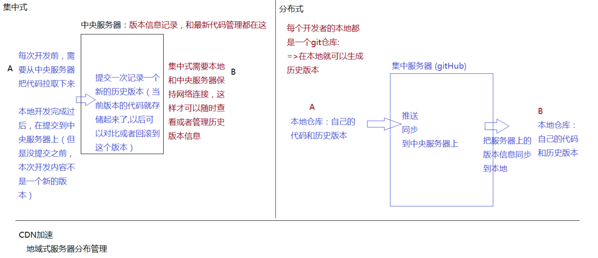
- git 和 svn 的区别

> 1. 传输方式上
>
>    git 是以数据流的形式上传下载(传输速率快)
>
>    svn 是正常形式的上传下载
>
> 2. 集中式和分布式的区别

## git的工作管理和基础操作

### windows git安装

> windows下载使用很多Linux/Unix的工具时, 需要cygwin这样的模拟环境, git也一样, cygwin的安装和配置都比较复杂. 不过有人已经把模拟环境和git都打包好了,叫做msysgit, 只需要下载一个单独的exe安装程序安装即可.
>
> msysgit 是windows版的Git, 官网(http://git-scm.com).

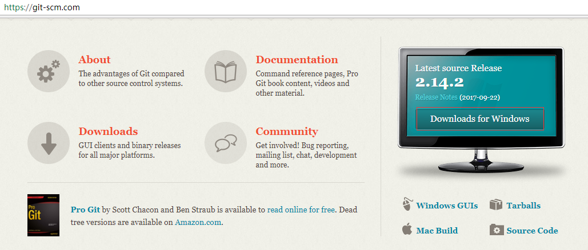

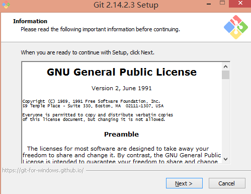

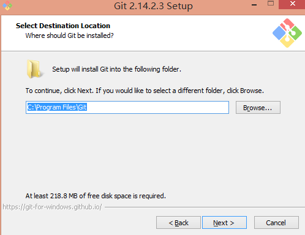

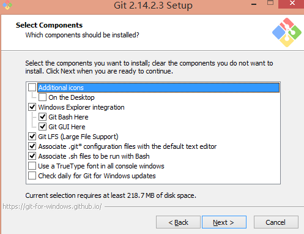

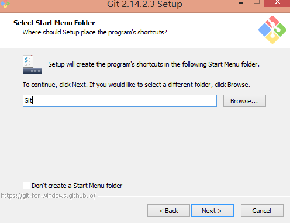

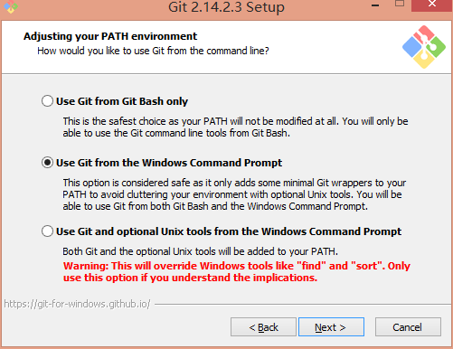

> 第一个是只能使用右键 Git Bash 运行git 命令
>
> 第二个是可以在cmd 里面使用git 命令
>
> 第三个是可以在cmd 里面使用git 命令 和Unix系统的命令(可以勾选)

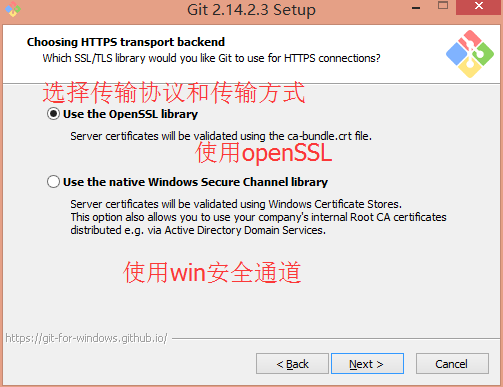

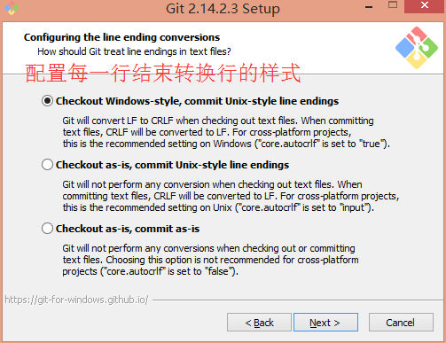

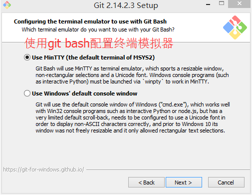

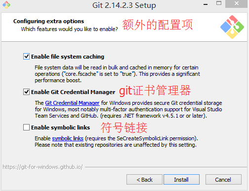

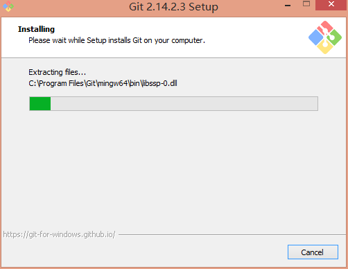

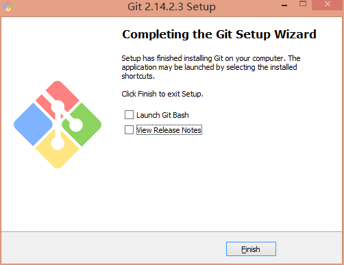

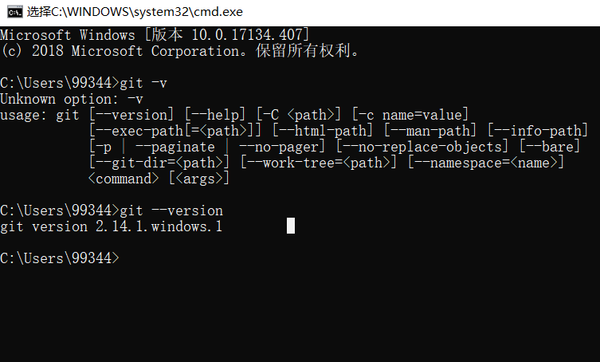

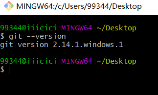

> 检查安装是否成功

### mac git安装

- 两种办法

> 1、安装 homebrew ，然后通过homebrew安装Git。先打开网站 <http://brew.sh/>。 拷贝对应脚本到终端下安装homebrew，然后在终端执行`brew install git`的命令。

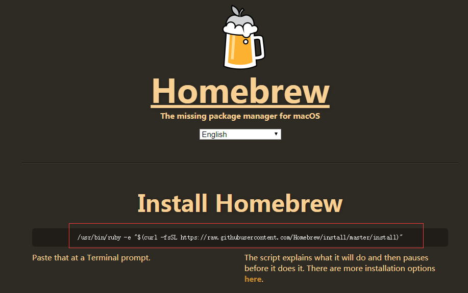

> 2. 直接从 AppStore 安装Xcode，Xcode集成了Git，不过默认没有安装，你需要运行Xcode，选择菜单“Xcode”->“Preferences”，在弹出窗口中找到“Downloads”，选择“Command Line Tools”，点“Install”就可以完成安装了。

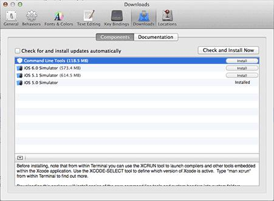

### 创建git仓库

- 在git配置一些基础信息

> 初次使用git，先在本地配置一些基础信息, 初次使用是没有user.name 和 user.email
>
> \$在Git Bash Here里面就有, 不用自己写. 在DOS窗口下也不用写 \$, 直接执行即可.
>
> git 是不支持简写的
>
> $ git config -l    (字母L)
>
> 查看用户名和邮箱地址：
>
> `$ git config user.name`
>
> `$ git config user.email`
>
> 修改用户名和邮箱地址：
>
> `$ git config --global user.name "xxx"`
>
> `$ git config --global user.email  "xxx"`
> 建议大家配置的用户名和邮箱和gitHub保持一致（这样以后在本地向gitHub推送内容的时候，能够展示出是谁推荐的）


- 创建git仓库

> 1. `git init`
>
>    会在当前目录中创建一个空的仓库，文件目录中生成一个 “.git” 的隐藏文件，这个文件很重要，我们本地仓库的版本信息等都存储在这里

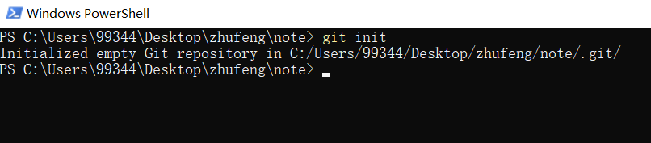

>2. .gitignore 文件的创建
>    在当前目录（git仓库根目录）创建一个 “.gitignore” 文件，这个文件中存储了当git提交的时候所忽略的文件
>
>  可以基于WB创建（new -> file -> 新建文件没有文件名只有后缀的.gitignore）
>  可以基于linux命令 `$ touch .gitignore` （mac终端、git bash、或者集成了linux的dos，可以使用linux命令）

- .gitignore 文件中需要忽略的文件或文件夹, 这些文件或文件夹不会提交

> \# 是 注释 没什么意义
>
> /  是指根目录, /converage 和 /build  指根目录的 coverage 和 build 文件夹不提交 
>
> node_modules 文件夹不提交
>
> \# misc 下指的是 mac 里面有时候会生成这些文件, 这些文件也不提交
>
> \# npm or yarn  指 npm  和  yarn  安装出错生成的文件, 这些文件也不提交
>
> \# webStorm  指 用webStrom 打开项目的时候会生成 .idea 文件夹, 这个文件夹也不提交

```
# dependencies
node_modules

# testing
/coverage

# production
/build

# misc
.DS_Store
.env.local
.env.development.local
.env.test.local
.env.production.local

# npm or yarn
npm-debug.log*
yarn-debug.log*
yarn-error.log*

# webStorm
.idea
```

## GIT工作原理及操作

当我们在本地创建一个git仓库后，我们可以基于这个仓库管理我们的代码

- git的工作流程

> 每一个git仓库都划分为三个区域: 
>
> 工作区：编辑代码的地方
>
> 暂存区：临时存储要生成版本代码的地方
>
> 历史区：存储的是生成的每一个版本代码

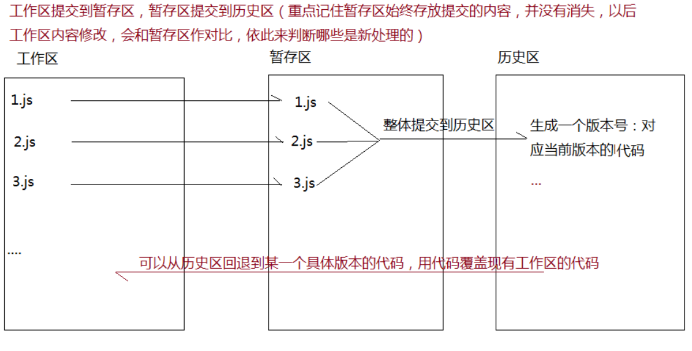

- 工作区提交到暂存区

> `$ git status`
> 查看代码或者文件的状态（当前处于哪个区域）:  
>
> 红色（当前处于工作区，还没有提交到暂存区）
>
> 绿色（当前处于暂存区，还没有提交到历史区）
>
> 如果没有文件，代表三个区域代码已经同步，历史版本也在历史区生成了

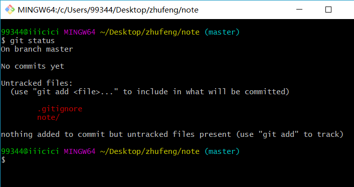

> `$ git add [filename]`
>
> 可以单独提交一个文件
>
> 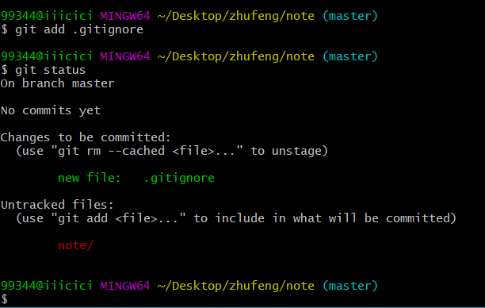
>
> `$ git add .` 
>
> `$ git add -A`
> 把当前工作区中所有最新修改的文件，都提交到暂存区
> 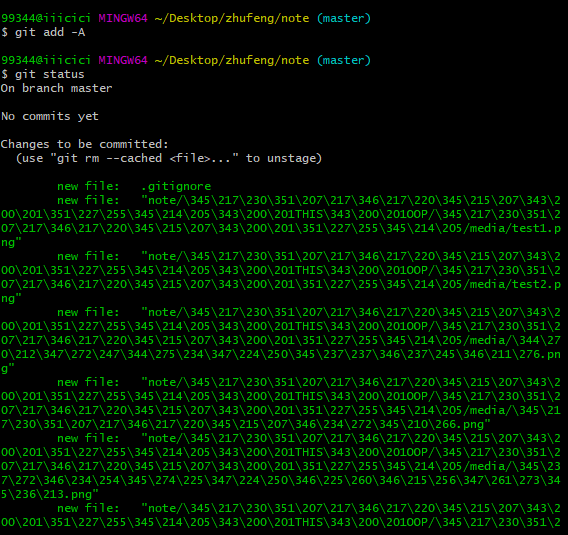

- 暂存区到历史区

> **不推荐 麻烦**
>
> `$ git commit`
> 这样执行后，会弹出一个提交文本输入界面，需要我们编写本次提交到历史区，给当前版本编写的备注信息
>
> 先按 i 进入编辑插入模式
> 输入备注信息
> 按ESC
> 输入“ :wq ” 保存并退出(write quit)
>
> (可以不写备注,直接 esc        :wq 退出)

> **推荐**
>
> `$ git commit -m'自己需要编写的备注信息'`(-m后面可以加空格)
>
> 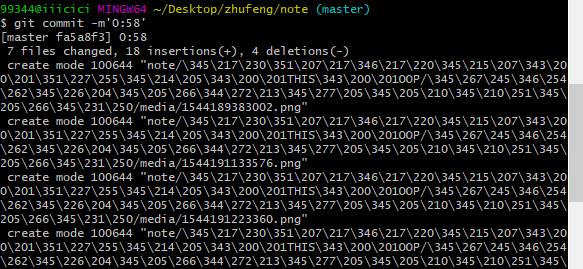
>
> `$ git log`
> 查看当前历史区提交的记录（查看版本信息）
>
> 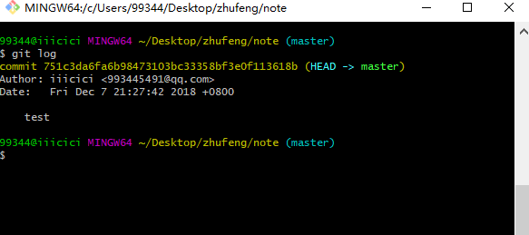

> 不推荐,因为github有图形化界面, 更直观.
>
> `$ git diff`
> 工作区 VS 暂存区
>
> `$ git diff master`
> 工作区 VS 历史区（master分支）
>
> `$ git diff --cached`
> 暂存区 VS 历史区

## git和gitHub同步

### 建立关联

- 让本地的git仓库和远程仓库建立关联(一般本地仓库只和一个远程仓库关联)

> `$ git remote -v`
> 查看所有的关联信息

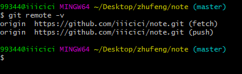

> `$ git remote add xxx [远程仓库git地址]`
>
> 常使用github的HTTPS地址
>
> 建立关联

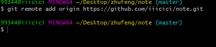

> `$ git remote remove xxx`
> 移除关联
>
> 我们远程仓库关联在一起的名字默认是：origin，当然自己可以随意修改

### 拉取推送github信息

- 把本地的信息推送到远程仓库上，或者从远程仓库上拉取最新的信息到本地仓库

> 我们本地推送和拉取的信息，既有代码也有版本信息，所以说与其说是推送和拉取，不如说是和远程仓库保持信息的同步

> 在推送之前，我们都应该先拉取
> `$ git pull origin master`
>
> （origin这个名字就是和远程仓库关联的这个名字，以自己设置的为主）
> 从远程仓库的master分支拉取最新的信息
>
> 该图是新new repository 的, 里面是空的, 所以pull会没有东西

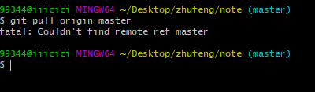

> `$ git push origin master`
> 把自己本地信息推送到远程仓库的master分支下, 第一次push需要填写github的账号和密码.

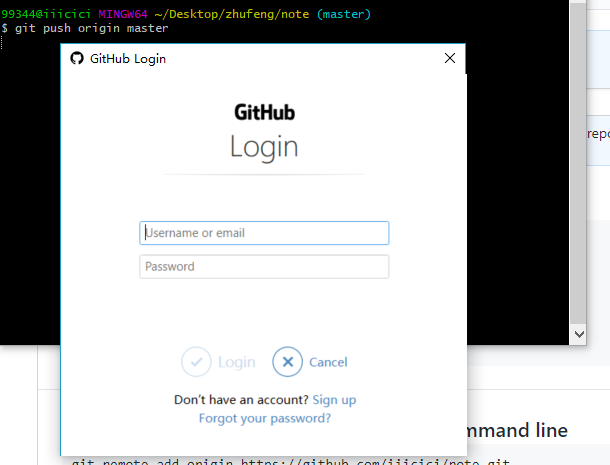


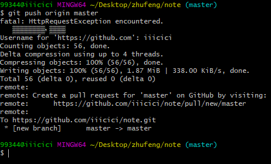

> 如果电脑有自主记忆的过程, 就不需要输入账号和密码. 否则每push一次就输入一次账号和密码.

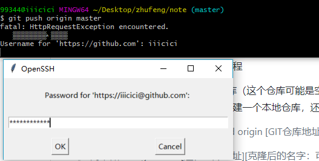

### 真实开发流程

- 以上是操作知识点，真实项目开发流程

> 1. LEADER会首先创建一个远程仓库（这个仓库可能是空的，也可能是包含了项目需要的基础的结构信息）
>
> LEADER 会直接在github上 New repository, 先创建一个新仓库, 可能还再加一些基础的结构信息


> 2. 作为开发者，我们需要在本地创建一个本地仓库，还需要让当前本地的仓库和远程仓库保持关联, 或者直接克隆github上的远程仓库, 克隆到本地.

> 原始做法：
> git init 
> git remote add origin [GIT仓库地址]

> 简单做法：
> git clone [远程仓库地址]   \[克隆后的名字：可以不设置，默认是仓库名]

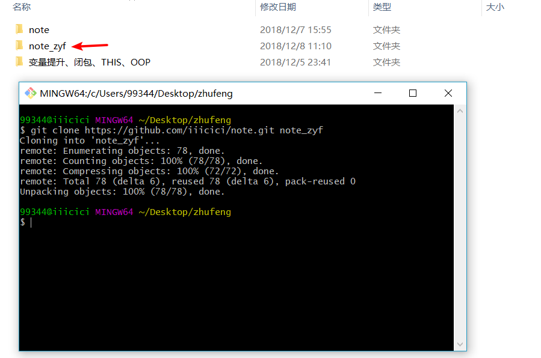

> 自动创建好本地仓库, 并且和远程仓库关联了

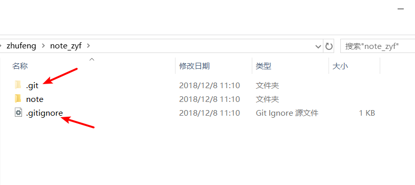

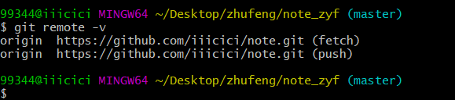

> 3. 在本地开发产品，需要同步的时候，我们首先把工作区内容在本地仓库中放到历史区，生成版本信息（git add . / git commit -m''），在把本地历史区的信息推送到远程仓库上（git pull / git push）

> 4. 在团队协作开发的时候，LEADER会在自己的gitHub账号下创建一个远程仓库，那么团队其他成员在向这个远程仓库推送信息的时候，使用自己的账号是没有推送权限的，我们需要把当前这个远程仓库，在github中创建工作群组，让更多人用自己的账号也有操作权限
>
> 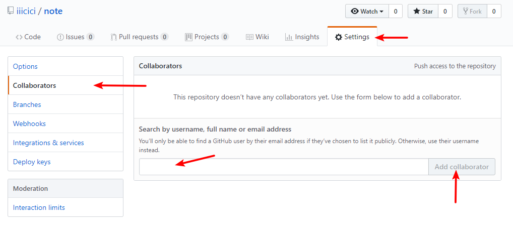
>
> 邀请之后有取消邀请字样
>
> 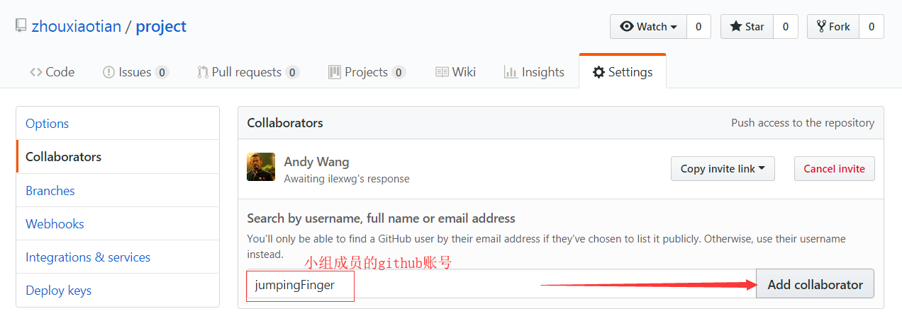
>  小组成员在自己的邮箱中收到一封邀请邮件，需要确认同意
>  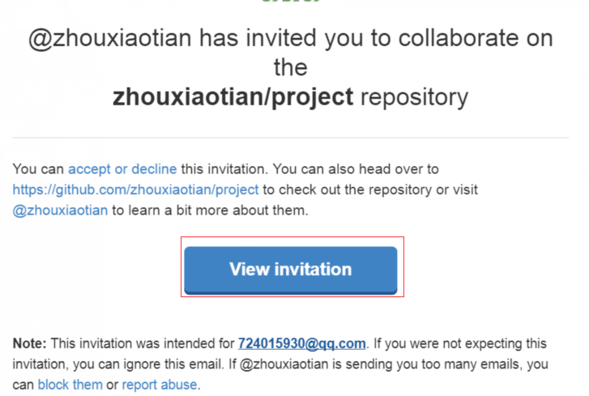

> 这样就是加入成功了

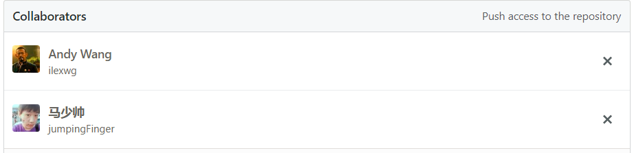

