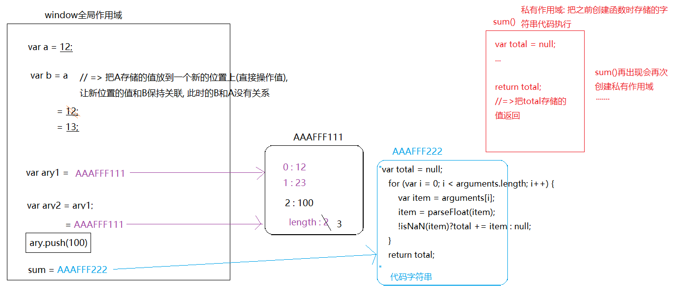
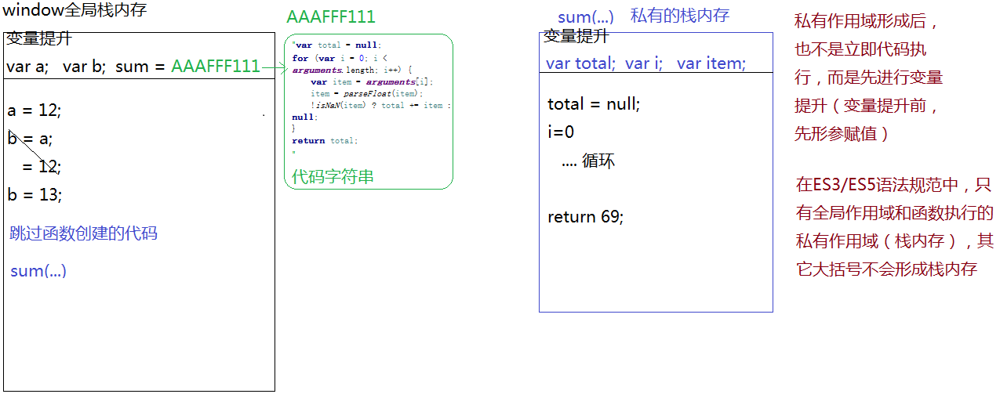
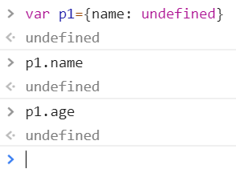
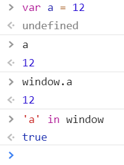
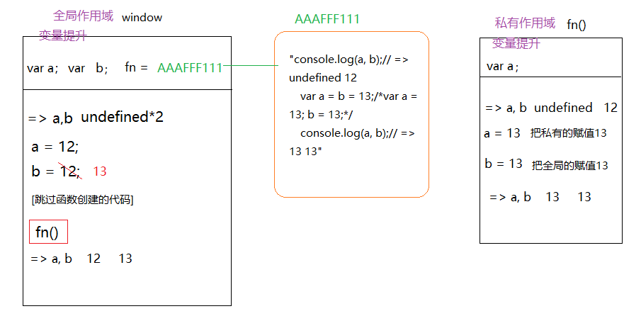
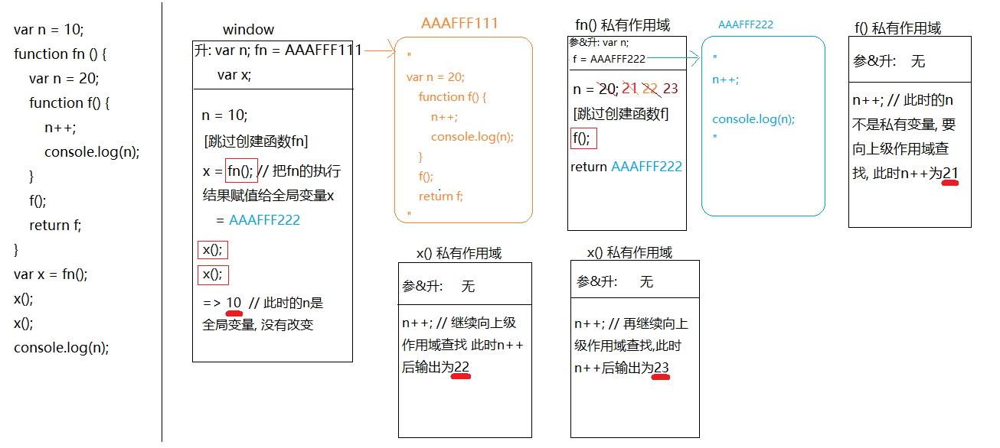
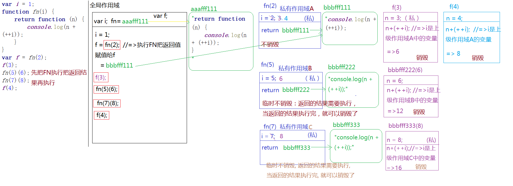
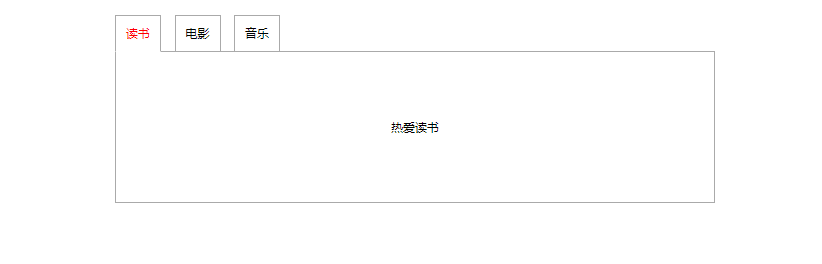

# 变量提升、闭包

## JS数据渲染机制及内存堆栈

基本数据类型: 存储在全局作用域中

引用数据类型: 引用类型需要开辟新的内存空间, 存储在内存中

```javascript
// 数字是基本类型或者是值类型
// 基本类型存储在全局作用域中
/**
 * 流程:
 * 1. 先声明一个变量a, 没有赋值 (默认值是 undefined)
 * 2. 在当前作用域中开辟一个位置存储12这个值
 * 3. 让变量a 和 12关联在一起 (定义: 赋值)
 */
var a = 12;
var b = a; 
b = 13;
console.log(a)


// 引用类型需要开辟新的内存空间
// 引用类型是按照引用地址  对空间的指针来操作的
var ary1 = [12, 23]
var ary2 = ary1
ary2.push(100)
console.log(ary1)
```




### 栈内存

- 定义: 栈内存在函数中定义的一些基本类型的变量和对象的引用变量都在函数的栈内存中分配。

>  全局作用域, 私有作用域.  代码执行环境, 所有基本类型值开辟了位置进行存储.

- 栈内存(作用域)作用:

> 1. 提供一个供JS代码自上而下执行的环境 (代码都是在栈中执行的) 也称执行栈
> 2. 由于基本数据类型值比较简单, 他们都是直接在栈内存中开辟一个位置, 把值直接存储进去的

- 当栈内存被销毁, 存储的那些基本值也跟着销毁了

### 堆内存

- 定义: 堆内存是区别于栈区、全局数据区和代码区的另一个内存区域。堆允许程序在运行时动态地申请某个大小的内存空间。

> 创建对象创建函数时,开辟内存空间,目的存键值对和代码字符串.

- 堆内存作用:

> 1. 存储引用类型值的(对象: 键值对  函数:  代码字符串)

- 当前堆内存释放销毁, 那么这个引用值彻底没了

- 堆内存的释放: 当堆内存没有被任何的变量或者其它东西所占用, 浏览器会在空闲的时候, 自主的进行内存回收, 把所有不被占用堆内存销毁掉(谷歌浏览器)

```javascript
ary1 = null
ary2 = null
sum = null
// xxx = null
// 通过空对象指针null可以让原始变量(或者其他东西)谁都不指向,那么原有被占用的堆内存就没有被变量占用了, 浏览器空闲时会销毁它
```


### 前端js内存回收机制

- IE浏览器: 把每个堆内存有计数器计数, 当没有数据类型指向堆内存的时候, 堆内存就会被销毁.

注意: IE有时会内存计数记乱, 称之为内存泄漏.

- 谷歌浏览器: 每间隔一段时间查找每个堆内存, 没有被占用的就会被销毁.

## 变量提升机制

- 定义: 当栈内存(作用域)形成之后, JS代码自上而下执行之前, 浏览器首先会把所有带`var`和`function` 的关键词提前"声明"或"定义", 这种预先处理机制称之为"变量提升"

> 带`var`的关键词提前"声明".带`function` 的关键词提前"声明" 和"定义"

```javascript
console.log(a) //输出: undefined
var a = 12
```

```javascript
var a = 12;
var b = a;
b = 13;
console.log(a)

// 变量提升后, 会直接跳过创建函数的代码
function sum() {
    var total = null;
    for (var i = 0; i < arguments.length; i++) {
        var item = arguments[i];
        item = parseFloat(item);
        !isNaN(item)?total += item : null;
    }
    return total;
}
console.log(sum(12, 23, '34', 'AA'));
```




> 全局作用域中:
>
> 声明(declare): var a     (默认值 undefined)
>
> 定义(defined): a = 12     (定义就是赋值操作)
>
> 在变量提升阶段:
>
> 带`var`的只声明未定义 
>
> 带`function`的声明和赋值都完成了
>
>
>
> 变量提升只发生在当前作用域(例如: 开始加载页面的时候只对全局作用域下的进行提升, 因为此时函数中存储的都是字符串而已,就是函数中的变量不会提升)
>
> 在全局作用域下声明的变量或者函数是"全局变量", 同理, 在私有作用域下声明的变量是"私有变量".  [带`var`/`function`的才是声明]
>
>  
>
> 浏览器很懒, 做过的事情不会重复执行第二遍, 也就是, 当代码执行遇到创建函数这部分代码后, 直接跳过即可,因为在提升阶段就已经完成函数的赋值操作了
>
>  
>
> 在私有作用域中:
>
> 私有作用域形成后, 也不是立即执行代码, 而是先进行变量提升 (变量提升前, 先形参赋值)
>
> 在ES3/ES5 语法规范中, 只有全局作用域和函数执行的私有作用域(栈内存), 才能形成栈内存, 其它大括号{}不会形成栈内存.如: if 或者 循环 不会形成栈内存
>
> 闭包的形成: 函数内部形成了私有作用域, 保护私有变量与外部的联系,这就形成了闭包

## 带var和不带的区别

### 全局作用域

- 加var

>  声明了属性没有赋值,或者 没有声明属性.
>  输出这个属性都是 undefined


> 那怎么知道undefined是因为声明了属性没有赋值, 还是因为没有声明这个属性呢?
>
> in: 检测某个属性是否隶属于这个对象
> 

> 在全局作用域下声明一个变量, 也相当于给window全局对象设置了一个属性, 变量的值就是属性值(私有作用域中声明的私有变量和window没关系)
```javascript
console.log(a) //=> undefined
console.log(window.a)  //=> undefined
console.log('a' in window) //=> true  在变量提升阶段, 在全局作用域中声明了一个变量a, 此时就已经把 a 当做属性赋值给window了, 只不过此时还没有给a赋值,默认值undefined
var a = 12; // 全局变量值修改, window 的属性值也跟着修改
console.log(a) //=> 12   全局变量 a
console.log(window.a) //=> 12 window的一个属性 a
```
```javascript
a = 13;
console.log(window.a) // => 13
```
```javascript
window.a = 14
console.log(a) // => 14
```
>  **全局变量和window中的属性存在"映射机制"**


- 不加var
> 不加 var 的本质是window的属性
> 声明了没赋值, 或者没声明, 输出都是undefined,不会报错是针对 对象中的属性而言.
> 如果一个变量既不是全局变量又不是window下的属性,输出这个变量会报错.
```javascript
// console.log(a); //=> Uncaught ReferenceError: a is not defined 先看a是否是全局变量,不是的话再看a是否是window下的属性.既不是全局变量,也不是window的属性,最后按全局变量处理,直接报错
console.log(window.a) //=> undefined  没有声明过a属性
console.log('a' in window) //=> false
a = 12 // => window.a = 12
console.log(a) //=> 12 先看是否是全局变量, 不是的话再看a是否是window下的属性.最后是window下的属性,直接输出window的a属性值
console.log(window.a) //=> 12 直接是window下a属性值
```

### 私有作用域
- 加var 和不加var
> 1. 带var 的在私有作用域变量提升阶段, 都声明为私有变量, 和外界没有任何的关系
>
> 2. 不带var 不是私有变量, 会向它的上级作用域查找, 看是否为上级的变量, 不是的话, 继续向上查找, 一直找到window为止
>
> (我们把这种查找机制称为: "作用域链"), 也就是我们在私有作用域中操作的这个非私有变量, 是一直操作别人的
```javascript
var a = 12,b = 12;// var a = 12; var b = 12;
var a = b = 13;// var a = 13; b = 13;
```
```javascript
console.log(a, b);//=> undefined undefined
var a = 12, b = 12;
function fn () {
    console.log(a, b);//=> undefined 12
    var a = b = 13;/*var a = 13; b = 13;*/
    console.log(a, b);//=> 13 13
}
fn();
console.log(a, b);//=> 12 13
```


## 作用域链的扩展

- 私有作用域中变量向上层作用域寻找,直到window下的属性也没有这个变量会怎么样?

> 如果找到window 也没有这个变量, 则相当于给window设置了一个属性b.

```javascript
function fn() {
    // 变量提升: 无
    // console.log(b);//=> Uncaught ReferenceError: b is not defined
    b = 13;
    console.log('b' in window); //=>true 在作用域链查找的过程中, 如果找到window 也没有这个变量, 则相当于给window设置了一个属性b.
    console.log(b);//=> 13
}
fn();
console.log(b)//=> 13
```

> 这里的b既可以看成是window的属性b, 也可以看成是全局变量b.
> 这正是ES3/ES5 的缺陷, 模棱两可.到了ES6出现了let.

```javascript
window.b = 12;
console.log(b);// => 12
```

- ES6的let

```javascript
let a = 12;
console.log(a);//=> 12
console.log(window.a);//=> undefined
```

## 只对等号左边变量提升

- 只对等号左边进行变量提升

> 普通的函数变量提升之后,自上而下执行时会直接跳过函数代码.
>
> 函数表达式在变量提升之后, 因为只有声明, 在自上而下执行代码时不会跳过,会把函数值赋值给只声明的函数名.

- 用函数表达式更优, 因为定义一个函数后, 在函数代码后调用函数符合习惯.

```javascript
/**
 * 变量提升:
 *      var fn;           只对等号左边进行变量提升
 *      sum = AAAFFF111;
 */
sum();//=> 2

// fn();//=> Uncaught TypeError: fn is not a function 类型错误  fn现在是undefinded, undefinded不是函数, 不能执行, 会报错

// 匿名函数之函数表达式
var fn = function () {
    console.log(1);
};// 代码执行到此处会把函数值赋值给fn

fn();//=> 1

// 普通函数
function sum () {
    console.log(2);
}
```

## 条件判断下的变量提升

- 在当前作用域下, 不管条件是否成立都要进行变量提升

> 带var 的只声明
> 带function 的在老版本浏览器渲染机制下, 声明和定义都处理, 但是为了迎合ES6中的块级作用域, 新版浏览器对于函数 (在条件判断中的函数), 不管条件是否成立, 都只是先声明, 没有定义, 类似var

### 在条件判断中的变量

```javascript
console.log(a);//=> undefinded
if (1 === 2) {
    var a = 12;
}
console.log(a);//=> undefinded
```
```javascript
/**
 * 变量提升
 *      var a; 在全局作用域下声明的全局变量也相当于给win设置了一个属性window.a = undefinded
 */
console.log(a);//=> undefinded
if ('a' in window) {// 在全局作用域下声明的全局变量也相当于给win设置了一个属性window.a = undefinded. 所以条件成立
    var a = 100;
}
console.log(a);//=> 100
```

### 在条件判断中的函数

> 面试题:

```javascript
f = function () {return true;};
g = function () {return false;};
~function () {
    if (g() && [] == ![]) {
        f = function () {return false;};
        function g() {return true;}
    }
}();
console.log(f());
console.log(g());
```

- 自执行匿名函数

>  常见格式：
>
>  (function(){
>
>  })();
>
>  解释：包围函数(function(){ /* code */ })的第一对括号向脚本返回未命名的函数，随后一对空括号立即执行返回的未命名函数，括号内为匿名函数的参数。
>
>  作用：可以用它创建命名空间，只要把自己的所有代码都写在这个特殊的函数包装内，那么外部就不能访问，除非你允许（变量前加上window，这样该函数后变量就成为全局）。各JavaScript库的代码也基本上是这种组织形式。
>
>  总结一下，执行函数的作用主要为匿名和自动执行，代码在被解释时就已经在运行了。

**写法总结：**

```javascript
(function(){ /* code */ }());
!function(){ /* code */ }();
~function(){ /* code */ }();
-function(){ /* code */ }();
+function(){ /* code */ }();
```

- [] == ![]解析:

> ! 的优先级要大于==的，所以先运算右边
>
> 给数组取反 ![],  空数组转成boolean是true,
> 只有 `NaN` `undefinded` `null` `0` `空字符串`  这五个为false
> 所以 [] 是true, ![] 是 false.
>
> [] == false, 对象和布尔比较, 需要都转换成数字
> 0 == 0,结果是true
> 最终, [] == ![] 结果是 true

高版本浏览器: chrome v40++

```javascript
/**
 * 变量提升: 无
 */
f = function () {return true;}; // => window.f = function () {return true;}  (TRUE)
g = function () {return false;};// => window.g = function () {return false;} (FALSE)
//自执行函数
//只要是函数执行就会有私有作用域
~function () {
    /**
     * 变量提升: 带var的和带function的都要进行变量提升,只不过,新版本的支持ES6,带function的只剩下声明了,没有定义了.
     *      function g;    //=> g是私有变量,g 是 undefinded
     */
    if (g() && [] == ![]) {// g 是 undefinded,不能执行  => TypeError: g is not a function
        f = function () {return false;};
        function g() {return true;}
    }
}();
console.log(f());
console.log(g());
```

低版本浏览器: IE 9--

```javascript
/**
 * 变量提升: 无
 */
f = function () {return true;}; // => window.f = function () {return true;}  (TRUE)
g = function () {return false;};// => window.g = function () {return false;} (FALSE)
//自执行函数
//只要是函数执行就会有私有作用域
~function () {
    /**
     * 变量提升: 带var的和带function的都要进行变量提升
     *      function g = AAAFFF111;  指向堆内存"return true;"  
     */
    if (g() && [] == ![]) {// g 是私有变量,执行返回true, [] == ![] 也是true
        f = function () {return false;};// f 不是私有的, 向上级作用域找,最终把window.f修改了 window.f = function () {return false;}  (FALSE)
        function g() {return true;} // 此时的g 是私有的, 和全局的window.g 没有关系
    }
}();
console.log(f());// => false    全局的f,已被修改成false
console.log(g());// => false    全局的g, 没有被私有变量的g 修改
```

## 条件判断下的变量提升到底有多坑

- 变得更严谨了,因为还不确定能进入判断体中, 变量提升时,function声明和定义一起是不合理的, 所以没进去就先声明, 能进去判断体中以后再类似变量提升一样(`自我重复检测机制`),把fn声明和定义

### 条件判断为true

```javascript
/**
 * 变量提升:
 *      function fn;
 */
console.log(fn); //=> undefinded

if (1 === 1) {
    console.log(fn);//=> 函数本身   当条件成立, 进入到判断体中(在ES6 中它是一个块级作用域.)第一件事并不是执行代码, 而是类似于变量提升一样(自我重复检测机制),先把fn声明和定义了, 也就是判断体中代码执行之前, fn就已经赋值了
    
    function fn() {
        console.log('ok');
    }
}
console.log(fn);//=> 函数本身
```

### 条件判断为false

```javascript
/**
 * 变量提升:
 *      function fn;
 */
console.log(fn); //=> undefinded

if (1 === 2) {
    console.log(fn);    
    function fn() {
        console.log('ok');
    }
}
console.log(fn);//=> undefinded   因为没进去判断, fn 仍然是只声明了的.
```

## 变量提升机制下重名的处理

-  关于重名的几个概念:

> 1. 带var 和 function 关键字声明相同的名字, 这种也算重名了(其实是一个fn, 只是存储值的类型不一样)

```javascript
// 变量提升: window.fn; window.fn = ...都是给window下加了相同的属性fn
var fn = 12;
function fn() {

}
```


> 2. 关于重名的处理: 如果名字重复了, 不会重新声明, 但是会重新定义(重新赋值)[不管  是变量提升还是代码执行阶段皆是如此]

```javascript
/**
 * 变量提升: 
 *      fn = ... (1)
 *         = ... (2)                  fn已存在,不做操作
 *         = ... (3)
 *         = ... (4)
 * 
 * 注意:1. var fn = 100 变量提升的时候, 因为fn已经声明了, 不需要再次声明.fn此时没有任何操作.
 *      2. 不能认为 var fn = undefined. 是因为没赋值,只声明了, 没有值的情况下是undefined,并不是赋值了undefined.
 *          所以认为是声明fn, 但是fn已经存在了.
 */

fn();//=> 4
function fn () {console.log(1);}
fn();//=> 4
function fn () {console.log(2);}
fn();//=> 4
var fn = 100;// => 带var的在提升阶段只把声明处理了,赋值操作没有处理,所以在代码执行的时候需要完成赋值 fn = 100
fn();//=>100()  Uncaught TypeError: fn is not a function
function fn () {console.log(3);}
fn();
function fn () {console.log(4);}
fn();

```

## ES6的LET不存在变量提升

- 在ES6 中基于 LET/CONST 等方式创建变量或者函数

> 目前处于ES5 老语法规范和 ES6 新语法规范 混合在一起应用的时代, 既要迎合老语法,又要适应新语法.

### ES6取消

> 1. ES6不存在变量提升机制
> 2. 切断了全局变量和window属性的映射机制

### ES6新增

> 1. 不允许重复定义
>
> 在相同的作用域中, 基于LET不能声明相同名字的变量(不管用什么方式在当前作用域下声明了变量, 再次使用LET创建都会报错)
> 虽然没有变量提升机制,但是在当前作用域代码自上而下执行之前, 浏览器会做一个重复性检测: 自上而下查找当前作用域下的所有变量, 一旦发现有重复的, 直接抛出异常,代码也不会再执行了(虽然没有把变量提前声明定义, 但是浏览器已经记住了当前作用域下有哪些变量)
```javascript
// =>Uncaught SyntaxError: Identifier 'a' has already been declared
// 在执行之前报错
let a = 12;
console.log(a);
let a = 13;
console.log(a);
```
```javascript
// 语法错误.在相同的作用域中, 基于LET不能声明相同名字的变量
// 只要是出现了let, 就会按照ES6语法规范操作
var a = 12;
let a = 13;
console.log(a);//=> Uncaught SyntaxError: Identifier 'a' has already been declared

let a = 12;
var a = 13;
console.log(a);//=> Uncaught SyntaxError: Identifier 'a' has already been declared

let a = 12;
let a = 13;
console.log(a);//=> Uncaught SyntaxError: Identifier 'a' has already been declared
```

> 2. 不能在声明之前使用

```javascript
// a = 12;//=> Uncaught ReferenceError: a is not defined (引用错误)
let a = 12;
console.log(window.a);//=> undefinded
console.log(a); //=> 12
```
```javascript
let a = 10,
    b = 10;
let fn = function () {
    // console.log(a, b);//=> Uncaught ReferenceError: a is not defined (未捕获的引用错误: a没有被定义)   在声明之前使用了,只能在声明之后使用
    let a = b = 20;
    /**
     * let a = 20; a 是私有作用域下的私有变量
     * b = 20; 把全局中的 b = 20
     *  
     */
    console.log(a, b);// =>20, 20
}
fn();
console.log(a, b);//=> 10,20

```

### ES6不变

- 形成全局作用域(全局栈内存), 私有作用域(私有栈内存)

- 作用域链

> 私有作用域中验证一个变量是不是私有变量, 如果是的话,就是自己的.如果不是私有变量, 就向上级作用域查找, 如果上级作用域也没有, 就向window查找属性, 如果window也没有, 就会报错.

总结:

> 一段js代码既有var 又有let, const .检测到var就进行变量提升,对变量声明或者定义, 遇到 let的变量就进行检查, 把变量单纯的记住. 如果出现了和let声明的名字一样的变量,不管加没加 var,let,const,只要名字一样就进行报错.如果名字不一样就继续. (**先进行重复性检测, 再进行变量提升**)
>
> 自上而下执行代码, 如果是老语法规范的变量, 是可以在声明变量前使用.  如果是新语法规范的变量, 在声明变量的前面使用会直接报错. 
>
> 如果是在全局作用域下老语法规范的变量, 会在window中添加一个属性, 如果是新语法规范的变量, 不会在window中添加属性, 切断了"映射机制".

## js中暂时性死区

- 关于typeof 的死区问题

ES5的typeof:

```javascript
// console.log(a);//=> Uncaught ReferenceError: a is not defined
console.log('a' in window)//=> false  和window没有关系
console.log(typeof a);//=> "undefined"  在原有浏览器渲染机制下, 基于typeof等逻辑运算符检测一个未被声明过的变量, 不会报错, 返回undefined
```

ES6的typeof:

```javascript
// console.log(a);//=> Uncaught ReferenceError: a is not defined
console.log(typeof a);//=> Uncaught ReferenceError: a is not defined
let a;
//=> 如果当前变量是基于ES6语法处理, 在没有声明这个变量的时候, 使用typeof 检测会直接报错, 不会是undefined, 解决了原有的js的死区.
```

块作用域问题:

```javascript
var a = 12;
if (true) {
    console.log(a);//=> ReferenceError: a is not defined
    let a = 13;//=> 基于LET创建变量, 会把大部分{}当做一个私有的块级作用域(类似于函数的私有作用域), 
    // 在这里也是重新检测语法规范, 看一下是否是基于新语法创建的变量, 如果是按照新语法规范来解析
}
```

## 区分私有变量和全局变量

- 在私有作用域中, 只有以下两种情况是私有变量


> 1. 形参是私有变量
> 2. 声明过的变量(带var/function)
>
> 剩下的都不是自己私有的变量, 都需要基于作用域链的机制向上查找

- fn(a)传参是传值
```javascript
var a = 100;
fn(a);
// 把fn执行(小括号中是实参: 传的是一个值)  => 执行fn把全局变量a的值100当做实参传递给函数的形参 => fn(100)
```
```javascript
/**
 * 变量提升:
 *      var a; var b; var c;
 *		fn = xxx...
 */
var a = 12,
    b = 13,
    c = 14;
function fn (a) {
    /**
     * 形参赋值
     *      a = 12
     * 
     * 变量提升
     *      var b;
     */
    console.log(a, b, c);//=> 12 undefined 14(c是全局的)
    var b = c = a = 20;
    /**
     * var b = 20;
     * c = 20;  把全局的c修改为20
     * a = 20;
     */
    console.log(a, b, c);//=> 20  20  20
    
}
fn(a);// 把fn执行(小括号中是实参: 传的是一个值)  => 执行fn把全局变量A的值12当做实参传递给函数的形参 => fn(12)
console.log(a, b, c);//=> 12 13 20
```
- 作用域:

> 函数执行会形成私有作用域(栈内存), 给代码执行提供一个环境.

- 闭包

> 1. 私有作用域使私有变量不受外面的干扰, 与外面不冲突, 这种保护机制叫做闭包.
>
> 2. 当函数执行, 有一个地方可以把这些变量存起来, 想用的时候可以拿出来, 这叫做闭包

## 私有变量和作用域练习题

- 结合 `私有变量和全局变量的区别` `变量提升` `形参赋值` `作用域链` `基本类型和引用类型的区别`

```javascript
var ary = [12, 23];

function fn (ary) {
    console.log(ary);
    ary[0] = 100;
    ary = [100];
    ary[0] = 0;
    console.log(ary);
}
fn(ary);
console.log(ary);
//=> 0
//=> 100 23
```


## 上级作用域查找

- 一个作用域的上级作用域只和创建位置有关


> 当前函数执行, 形成一个私有作用域A, A的上级作用域是谁, 和它在哪执行的没有关系, 
和它在哪创建的有关系,**在哪创建的**, 它的上级作用域就是谁

```javascript
var a = 12;
function fn () {
    console.log(a);
}
function sum () {
    var a = 120;
    fn();
}
sum();
// => 12
```
- arguments的使用
> arguments: 实参集合

- arguments.callee和arguments.callee.caller的使用
>  目前在严格模式下 arguments.callee 和 arguments.callee.caller都不允许用
arguments.callee: 函数本身fn
arguments.callee.caller: **当前函数在哪执行的**, caller就是谁(记录的是它执行的宿主环境), 在全局下执行caller的结果是null
```javascript
var a = 20;
function fn () {
    console.log(arguments.callee.caller);
    //=> ƒ aa () {
    //     fn(a);
    // 	 }
}
function aa () {
    fn();
}
aa();
```
```javascript
var a = 20;
function fn () {
    console.log(arguments.callee.caller);//=> null   
}
fn();
```
面试题:
```javascript
var n = 10;
function fn () {
    var n = 20;
    function f() {
        n++;
        console.log(n);
    }
    f();
    return f;
}
var x = fn();
x();
x();
console.log(n);

//=>21 22 23 10
```


## js中的堆栈内存释放

- js中的内存分为堆内存和栈内存

>堆内存: 存储引用数据类型值(对象: 键值对  函数: 代码字符串)
>栈内存: 提供js代码执行的环境和存储基本类型值

- 堆内存释放

>让所有引用堆内存空间地址的变量赋值为null即可(没有变量占用这个堆内存了, 浏览器会在空闲的时候把它释放掉)

- 栈内存释放

>一般情况下, 当函数执行完成, 所形成的**私有作用域(栈内存)**都会自动释放掉(在栈内存中存储的值也都会释放掉), 
>但是也有特殊不销毁的情况:
>
>1. 函数执行完成, 当前形成的栈内存中, 某些内容被栈内存以外的变量占用了, 此时栈内存不能释放(一旦释放外面找不到原有的内容了)
>2. 全局栈内存只有在页面关闭的时候才会被释放掉
>...
>如果当前栈内存没有被释放, 那么之前在栈内存中存储的基本值也不会被释放, 能够一直保存下来

- 闭包有两个作用

>1. 保护私有变量不受外界干扰
>2. 形成一个不销毁的栈内存, 把里面的私有变量保存起来, 供以后使用

- 堆存释放及以上所有知识点的题

```javascript
var f = fn(2); //=> 先把fn执行(传递实参2), 把fn执行的返回结果(return 后面的值)赋值给f.
f(); //=> 把返回的结果执行.
```
```javascript
fn(2)(); //=> 和上面的两个步骤类似, 都是先把fn执行, 把fn执行的返回结果再次执行.
```
```javascript
var i = 1;
function fn(i) {
    return function (n) {
        console.log(n + (++i));
    }
}
var f = fn(2);
f(3);
fn(5)(6);
fn(7)(8);
f(4);
//=> 6 12 16 8
```



## 闭包作用之保护

- 闭包是什么

> 1. 函数执行形成一个私有的作用域, 保护里面的私有变量不受外界的干扰, 这种保护机制称之为"闭包"
>
> 2. 市面上的开发者认为的闭包是:形成一个不销毁的私有作用域 (私有栈内存) 才是闭包

- 柯理化函数
```javascript
//=> 柯理化函数
function fn () {
    return function () {
    }
}
//fn执行返回的堆内存被f占用了, 堆内存不能销毁
var f = fn();
```

- 惰性函数

```javascript
//=> 闭包: 惰性函数
var utils = (function () {
  return {

    }
})();
```

- 闭包项目实战应用

> 真实项目中为了保证js的性能(堆栈内存的性能优化), 应该尽可能的减少闭包的使用.(不销毁的堆栈内存是耗性能的).

- 闭包具有保护作用: 保护私有变量不受外界的干扰

> 在真实项目中, 尤其是团队协作开发的时候, 应当尽可能的减少全局变量的使用, 以防止相互之间的冲突("全局变量污染"),那么此时我们完全可以把自己这一部分内容封装到一个闭包中, 让全局变量转换为私有变量.

```javascript
// 类似这种:
(function () {
    var n = 12;
    function fn() {
    
    }
    // ...
})();
```
>  不仅如此, 我们封装类库插件的时候, 也会把自己的程序都存放到闭包中保护起来, 防止和用户的程序冲突, 但是我们又需要暴露一些方法给客户使用,
>
> 这样我们如何处理呢?
>
> 1. jquery这种方式: 把需要暴露的方法抛出到全局

```javascript
(function () {
    function jQuery () {
        //...
    }
    //...
    window.jQuery = window.$ = jQuery;
    //=> 把需要供外面使用的方法, 通过给win设置属性的方式暴露出去
})();
jQuery();
$();
```
> 2. zepto这种方式: 基于return把需要供外面使用的方法暴露出去

```javascript
var Zepto = (function () {
    //...
    return {
        xxx: function () {

        }
    };
})();
Zepto.xxx();
```

## 闭包作用之保存

- 闭包具有保存作用: 形成不销毁的栈内存, 把一些值保存下来, 方便后面的调取使用

- 例题



html:

```html
<div id="tab" class="tab">
    <ul>
        <li class="active">读书</li>
        <li>电影</li>
        <li>音乐</li>
    </ul>
    <div class="active">热爱读书</div>
    <div>最新电影</div>
    <div>精彩音乐</div>
</div>
```

js:

```javascript
var oTab = document.getElementById('tab'),
    tabList = oTab.getElementsByTagName('li'),
    divList = oTab.getElementsByTagName('div');

function changeTab (curIndex) {
    for (var i = 0; i < tabList.length; i++) {
        tabList[i].className = divList[i].className = '';

    }
    // curIndex: 记录的是当前点击li的索引
    tabList[curIndex].className = 'active';
    divList[curIndex].className = 'active';
}


for (var i = 0; i < tabList.length; i++) {
    tabList[i].onclick = function () {
        // 点击的时候执行, 没有形参赋值, 没有变量提升, 只有代码自上而下依次执行
        changeTab(i);
        // changeTab时创建私有作用域, 这时有形参赋值
        // 执行方法, 形成一个私有的栈内存, 遇到变量i, i不是私有变量, 会向上一级作用域查找(上级作用域window)
    }
}
//=> 所有的事件绑定都是异步编程(同步编程: 一件事一件事的做, 当前这件事没完成, 下一个任务不能处理
// 异步编程: 当前这件事没有彻底完成, 不再等待, 继续执行下面的任务), 绑定事件后, 不需要等待执行, 继续执行下一个循环任务, 所以当我们点击执行方法的时候, 循环早已结束(让全局的等于循环最后的结果3)
// 当前用ES5传统的语法规范写, 只有全局作用域和函数形成的私有作用域,判断和循环不产生作用域, 循环和判断就是在当前的作用域
        

// 这么做不行的原因: 
// 1. 闭包作用域,作用域链的查找机制
// 2. 整个js的异步编程
```
### 解决方案: 自定义属性

```javascript
for (var i = 0; i < tabList.length; i++) {
    tabList[i].myIndex = i;
    tabList[i].onclick = function () {
        changeTab(this.myIndex);
        // => this: 给当前元素的某个事件绑定方法, 当事件触发, 方法执行的时候, 方法中的this是当前操作的元素对象
    }
}
```
###  解决方案: 闭包 

```javascript
// =>(惰性函数)
for (var i = 0; i < tabList.length; i++) {
    tabList[i].onclick = (function (n) {
        //=> 让自执行函数执行, 把执行的返回值(return) 赋值给on-click(此处on-click绑定的是返回的函数, 点击的时候执行的是返回的函数), 自执行函数在给事件赋值的时候就已经执行了
        var i = n;
        return function () {
            changeTab(i); //=> 上级作用域: 自执行函数形成的作用域
        }
    })(i);
}
/**
 * i = 0 第一次循环
 *  tabList[0].onclick = (function (n) {
 *      // 自执行函数执行形成一个私有作用域 (不释放: 返回的函数对应的堆地址被外面的事件占用了)
 *      // 1. 形参赋值 n = 0
 *      // 2. 变量提升 var i;
 *      var i = n; //=> i = 0
 *      return function () {//=> 点击的时候执行的是小函数
 *          changeTab(i);
 *      }   
 *   })(i);//=> 把本次全局i (就是0)当做实参传递给形参n
 * 
 * i = 1 第二次循环
 *  tabList[1].onclick = (function (n) {
 *      var i = n;//=> i = 1
 *      return function () {
 *          changeTab(i);
 *      }
 *  })(i);//  i 是 1
 * 
 *  ...
 *  总结: 循环三次, 形成三个不销毁的私有作用域(自执行函数执行), 而每一个不销毁的栈内存中都存储了一个私有变量i, 而这个值分别是每一次执行传递进来的全局i 的值
 *        (也就是: 第一个不销毁的作用域存储的是0, 第二个是1, 第三个是2); 当点击的时候, 执行返回的小函数, 遇到变量i, 向它自己的上级作用域查找, 找到的i值分别是: 0/1/2, 达到了我们想要的效果.
 */
```
```javascript
//=> 柯理化函数
for (var i = 0; i < tabList.length; i++) {
    // 原理都是形成三个不销毁的私有作用域, 分别存储需要的索引值
    (function (n) {
        tabList[n].onclick = function () {
            changeTab(n);
        }
    })(i);
}
```
### 解决方案: 基于ES6解决

```javascript
for (let i = 0; i < tabList.length; i++) {
    tabList[i].onclick = function () {
        changeTab(i);
    }
}
/*
{
    let i = 0;
    tabList[i].onclick = function () {
        changeTab(i);
    }
}
{
    let i = 1;
    tabList[i].onclick = function () {
        changeTab(i);
    }
}
{
    let i = 2;
    tabList[i].onclick = function () {
        changeTab(i);
    }
}
*/
```
- 基于ES6中的let来创建变量, 是存在块级作用域的(类似于私有作用域)

> 作用域: (栈内存) 
> 1. 全局作用域
> 2. 私有作用域 (函数执行)
> 3. 块级作用域 包括普通的大括号, 判断体, 循环体, try catch. **不包括对象的大括号 **(一般用大括号包起来的都是块级作用域, 前提是ES6语法规范) 
>

```javascript
{
    let a = 12;
    console.log(a); //=> 12
}
console.log(a); //=> Uncaught ReferenceError: a is not defined
```
```javascript
let a = 99;
{
    let a = 100;
    {
        
        {
            console.log(a); //=> 100
        }
    }
}
```
```javascript
//判断体也是块级作用域   
if (1 === 1) {
     
    let a =12;
}
console.log(a);//=> Uncaught ReferenceError: a is not defined
```
```javascript
//循环体也是块级作用域, 初始值设置的变量是当前本次块级作用域中的变量(形成了五个块级作用域, 每个块级作用域中都有一个私有变量, 变量值就是每一次循环I的值)
for (let i = 0; i < 5; i++) {
    
}
console.log(i);//=> Uncaught ReferenceError: i is not defined
```
```javascript
try{}catch{}  // 也是块级作用域
```
```javascript
//=> 对象的大括号不是块级作用域
var obj = {};
```


## 其他

### webstorm支持ES6规范的设置

File-> Languages & Frameworks-> 点击JavaScript-> 下拉框 选ECMAScript 6 -> ok

或者选React JSX 语法, 它是支持ES6规范的

