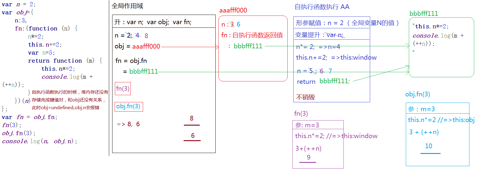
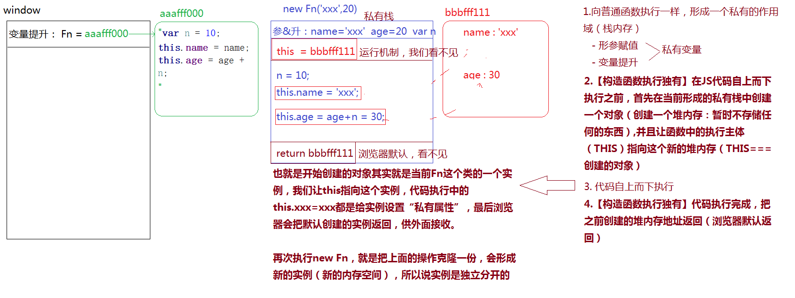
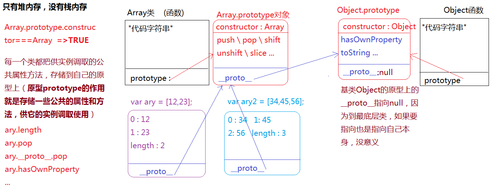
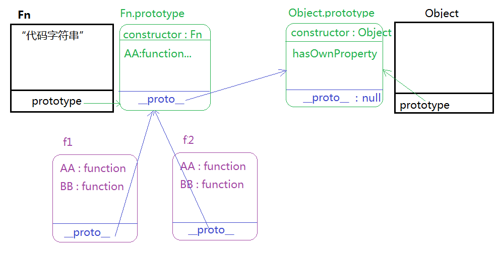

# 面向对象

面向对象编程(Object Oriented Programming)

## 单例设计模式(singleton pattern)


- 单例设计模式(singleton pattern)
> 1. 表现形式
>   var obj = {
>   ​    xxx:xxx,
>   ​    ...
>   };
>   命名空间: 就是开辟一个堆内存, 给堆内存起一个名字(开辟堆内存, 变量名指向堆内存的地址, 名字代表堆内存)
>   在单例设计模型中, obj 不仅仅是对象名, 它被称为"命名空间[NameSpace]", 把描述事物的属性存放到命名空间中, 多个命名空间是独立分开的, 互不冲突
> 2. 作用
>   把描述同一件事物的属性和特征进行"分组, 归类"(存储在同一个堆内存空间中), 因此避免了全局变量之间的冲突和污染.
>   var pattern1 = {name: 'xxx'}
>   var pattern2 = {name: 'xxx'}
> 3. 单例设计模式命名的由来
>   每一个命名空间都是js中的Object这个内置基类的实例, 而实例之间是互相独立互不干扰的, 所以我们称它为"单例: 单独的实例"

```javascript
var name = "楼兰"
var age = 18;
var sex = "girl";

var name = "云朵"
var age = 19;
var sex = "boy";
// 上面的全局变量的污染,命名冲突
var person1 = {
    name: "楼兰",
    age: 18
};
var person2 = {
    name: "云朵",
    age: 19
};
```


## 高级单例模式

- 高级单例模式
> 1. 在给命名空间赋值的时候, 不是直接赋值一个对象, 而是先执行匿名函数, 形成一个私有作用域AA(不销毁的栈内存), 在AA中创建一个堆内存, 把堆内存地址赋值给命名空间.
> 2. 这种模式的好处: 我们完全可以在AA中创造很对内容(变量或者函数), 哪些需要供外面调取使用的, 我们暴露到返回的对象中(模块化实现的一种思想)
```javascript
var nameSpace = (function () {
    var n = 12;
    function fn() {
        //...
    }
    function sum() {
        
    }
    return {
        fn: fn,
        sum: sum
    }
})();
```

- this

>1. 给当前元素的某个事件绑定方法, 当事件触发方法执行的时候, 方法中的this是当前操作的元素对象
>
>  ```javascript
>  oBox.onclick = function () {
>  	//=> this.oBox        
>  }
>  ```
>
>2. 普通函数执行, 函数中的this取决于执行的主体, 谁执行的, this就是谁(执行主体: 方法执行, 看方法名前面是否有"点", 有的话, 点前面是谁this就是谁, 没有this是window)
>
>  ```javascript
>  function fn() {//=> AAAFFF000
>  	console.log(1);
>  }
>  var obj = {
>  	fn: fn //=> fn: AAAFFF000
>  };
>  //=> 执行的是相同的方法(不同地方在于函数执行方法中的this是不一样的)
>  obj.fn();//=> this:obj
>  fn();//=> this:window
>  ```
>
>3. 自执行函数执行, 方法中的this是window
>
>   ```javascript
>   ~function () {
>   	//=> this: window
>   }();
>   ```

- 例题: 

```javascript
var n = 2;
var obj = {
    n: 3,
    fn: (function (n) {
        n*=2;
        this.n+=2;
        var n=5;
        return function (m) {
            this.n *= 2;
            console.log(m + (++n));
        }
    })(n)//=> obj.n会报错
};
var fn = obj.fn;
fn(3);
obj.fn(3);
console.log(n, obj.n);
```



## 基于单例模式实现模块化开发

- 模块化开发

>   1. 团队协作开发的时候, 会把产品按照功能板块进行划分, 每一个功能板块有专人负责开发
>   2. 把各个板块之间公用的部门进行提取封装, 后期在想实现这些功能, 直接的调取引用即可(模块封装)

```javascript
//=> 公共工具库
var utils=(function () {
    return {
        aa:function () {

        }
    }
})();

//=>皮肤模块开发者
var skipRender = (function () {
    var fn = function () {
        //...
    };
    //...
    return {
        init: function () {

        },
        fn:fn
    }
})();
skipRender.init();

//=>天气模块发开者
var weatherRender = (function () {
    var fn = function () {

    };
    return {
        init: function () {
            fn();//=>调取自己模块中的方法直接调取使用即可
            skipRender.fn();//=>调取别人模块中的方法
        }
    }
})();
weatherRender.init();
```

## 无实际意义的工厂模式

- 工厂模式(Factory Pattern)

> 1. 把实现相同功能的代码进行"封装", 以此来实现"批量生产"(后期想要实现这个功能, 我们只需要执行函数即可)
>
> 2. "低耦合高内聚": 减少页面中的冗余代码, 提高代码的重复使用率

```javascript
function createPerson(name, age) {
     var obj = {};
     obj.name = name;
     obj.age = age;
     return obj;
 }
var per1 = createPerson('张三', 18);
var per2 = createPerson('张三', 18);
```

## js是基于面向对象开发的语言

- js是一门编程语言(具备编程思想)

>    [面向对象]
> ​       JS\Java\PHP\C#\Ruby\Python\C++...
>    [面向过程]
> ​       C

- 面向对象编程, 需要我们掌握: "对象, 类, 实例"的概念

> 对象: 万物皆对象
> 类: 对象的具体细分(按照功能特点进行分类: 大类, 小类)
> 实例: 类中具体的一个事物(拿出类别中的具体一个实例进行研究, 那么当前类别下的其它实例也具备这些特点和特征)

 * 整个js就是基于面向对象设计和开发出来的语言, 我们学习和实战的时候也要按照面向对象的思想去体会和理解
```javascript
// js中的内置类
// dir(document.body) //=> body - HTMLBodyElement - HTMLElement - Element - Node - EventTarget - Object
```


## 创建值的两种方式及区别

- 基于构造函数创建自定义类 (constructor)

>1. 在普通函数执行的基础上"new xxx()", 这样就不是普通函数执行了, 而是构造函数执行, 当前的函数名 称之为"类名", 接收的返回结果是当前类的一个实例
>2. 自己创建的类名最好第一个单词首字母大写
>3. 这种构造函数设计模式执行, 主要用于组件, 类库, 插件, 框架等的封装, 平时编写业务逻辑一般不这样处理


```javascript
function Fn () {

}
// Fn();//=> 普通函数执行, 此时Fn是普通函数
```
### 两种方式

- js中创建值有两种方式
> 1. 字面量表达式(单例模式)
> 2. 构造函数模式
```javascript
// 构造函数模式
function Fn () {

}
var f = new Fn();//=> Fn是类 f是类的一个实例
var f2 = new Fn();//=> f2也是Fn的一个实例, f2和f是独立分开的, 互不影响
```
```javascript
// 字面量方式(单例模式)
var obj1 = {};//=> obj1是Object的一个实例
var obj2 = {};//=> obj2是Object的一个实例
```
### 区别

- 字面量 和 构造函数 创建出来的有区别吗?
> 1. 对于 引用类型 创建出来的没有区别, 字面量创建的是对象, 构造函数创建出来的也是实例, 都是object的对象
> 2. 对于 基本类型 创建出来的有区别, 字面量创建出来的是基本类型值, 构造函数创建出来的是引用类型值.
> 3. 但是本质没有区别, 除了类型不一样之外(只是js中的不同表达形式), 但确实都是Number类的一个实例, 在Number类中定义的属性和方法都可以用.

```javascript
// 使用两种方式创建 引用 类型值
var obj = {};//=> 字面量方式(单例模式)
var obj = new Object();//=> 构造函数模式
// 不管是哪一种方式创建出来的都是Object类的实例, 而实例之间是独立分开的, 所以 var xxx={} 这种模式就是js中的单例模式
```

```javascript
// 使用两种方式创建 基本 类型值
var num1 = 12;//=> 字面量方式(单例模式)
var num2 = new Number(12);//=> 构造函数模式

console.log(typeof num1);//=> "number"
console.log(typeof num2);//=> "object"
// toFixed() 保留小数点后几位
console.log(num2.toFixed(2));//=> "12.00"
console.log(num1.toFixed(2));//=> "12.00"
/*
基本数据类型基于两种不同的模式创建出来的值是不一样的
基于字面量方式(单例模式)创建出来的值是基本类型值
基于构造函数创建出来的值是引用类型
  num2 是数字类的实例, num1也是数字类的实例, 它只是js表达数字的方式之一, 都可以使用数字类提供的属性和方法
*/
```

## 构造函数执行的机制

```javascript
function Fn() {
    var n = 10;
    this.name = name;
    this.age = age + n;
}
```

- 普通函数执行


> 步骤:
> 1. 形成一个私有的作用域
> 2. 形参赋值
> 3. 变量提升
> 4. 代码执行
> 5. 栈内存释放问题
```javascript
Fn();
```

- 构造函数执行


> 步骤:
>
> 1. 向普通函数执行一样, 形成一个私有的作用域(栈内存)
>   形参赋值
>   变量提升
> 2. [构造函数执行独有] 在js代码自上而下执行之前, 首先在当前形成的私有栈中创建一个对象(创建一个堆内存: 暂时不存储任何的东西),并且让函数中的执行主体(this)指向这个新的堆内存(this===创建的对象)
> 3. 代码自上而下执行
> 4. [构造函数执行独有]代码执行完成, 把之前创建的堆内存地址返回(浏览器默认返回)


> 也就是开始创建的对象其实就是当前Fn这个类的一个实例, 我们让this指向这个实例, 代码执行中的this.xxx = xxx 都是
给实例设置"私有属性", 最后浏览器会把默认创建的实例返回, 供外面接收.
再次执行new Fn, 就是把上面的操作克隆一份, 会形成新的实例(新的内存空间), 所以说实例是独立分开的.

```javascript
var f1 = new Fn('xxx', 20).;
var f2 = new Fn('aaa', 30);
console.log(f1 === f2);//=> false: 两个不同的实例(两个不同的堆内存地址)
console.log(f1.age);//=> 30
console.log(f2.name);//=> 'aaa'
console.log('name' in f1);//=>ture name&age在两个不同的实例都有存储, 但是都是每个实例自己私有的属性
console.log(f1.n);//=>undefined 只有this.xxx=xxx的才和实例有关系, n是私有作用域中的一个私有变量而已(this是当前类的实例)

```




## 构造函数中细节问题


- 构造函数执行, 不写return,浏览器会默认返回创建的实例, 但是如果我们自己写了return呢?
> 1. 如果return的是一个基本值, 返回的结果依然是类的实例, 没有收到影响
```javascript
function Fn () {
    var n = 10;
    this.m = n;
    return 2;
}
var f = new Fn();
console.log(f);//=> { m: 10 }
```
> 2. 如果return的是引用值, 则会把默认返回的实例覆盖, 此时接收到的结果不再是当前类的实例了.
```javascript
function Fn () {
    var n = 10;
    this.m = n;
    return {name: '哈哈'};
}
var f = new Fn();
console.log(f);//=> { name: '哈哈' }
```
> 构造函数执行的时候, 尽量减少return的使用, 防止覆盖实例

```javascript
function Fn () {
    var n = 10;
    this.m = n;
    console.log(1);
}
var f = new Fn();
console.log(f);
//=> 1  
//   Fn { m: 10 }

function Fn () {
    var n = 10;
    this.m = n;
    return;//=> 这样return是结束代码执行的作用, 并且不会覆盖返回的实例
    console.log(1);
}
var f = new Fn();
console.log(f);//=> { m: 10 }
```
- Fn, Fn(), new Fn(), new Fn的区别
```javascript
Fn;// 函数本身
Fn();// 函数执行
new Fn();//创建一个实例
new Fn;//在构造函数执行的时候, 如果Fn不需要传递实参, 我们可以省略小括号, 意思还是创建实例(和加小括号没有区别)

```
- instanceof: 检测某一个实例是否隶属于这个类
```javascript
console.log(f instanceof Fn);//=> true
console.log(f instanceof Array);//=> false
console.log(f instanceof Object);//=> true(万物皆对象: 所有的对象, 包含创建的实例都是Object的实例)
```
- in: 检测当前对象是否存在某个属性
```javascript
console.log('m' in f);//=> true
console.log('n' in f);//=> false
console.log('toString' in f);//=> true toString 是它的公有属性
```
- hasOwnProperty: 检测当前属性是否为对象的私有属性(不仅要有这个属性, 而且必须还是私有的才行)
```javascript
console.log(f.hasOwnProperty('m'));//=>true
console.log(f.hasOwnProperty('n'));//=>false 连这个属性都没有
console.log(f.hasOwnProperty('toString'));//=>false 虽然有这个属性, 但是 不是私有的属性
```
- 思考题
> 编写一个方法hasPubProperty, 检测当前属性是否为对象的公有属性, 和hasOwnProperty对应
```javascript
function hasPubProperty (obj, attr) {
    //=>obj: 要检测的对象
    //=>attr: 要检测的属性
    //...
}
hasPubProperty(f, 'm');//=> false
hasPubProperty(f, 'n');//=> false
hasPubProperty(f, 'toString');//=> true
```

## 原型链和原型链的查找机制

- 原型(prototype), 原型链(\__proto__)
>  [函数]
>    普通对象, 类(所有的类:内置类, 自己创建的类)
>
>    // Date是一个类, 不是对象, 可以说Date的一个实例是对象
>  [对象]
>    普通对象, 数组, 正则, Math, arguments...
>    实例是对象类型的(除了基本类型的字面量创建的值)
>    prototype的值也是对象类型的
>    函数也是对象类型的
>    ...
- 理解方法
> 1. 所有的函数数据类型都天生自带一个属性: prototype(原型), 这个属性的值是一个对象, 浏览器会默认给它开辟一个堆内存
> 2. 在浏览器给prototype开辟的堆内存中有一个天生自带的属性: constructor, 这个属性存储的值是当前函数本身
> 3. 每一个对象都有一个__proto__的属性, 这个属性指向当前实例所属类的prototype(如果不能确定它是谁的实例, 都是Object的实例)

- 原型链

>它是一种基于__proto__向上查找的机制. 当我们操作实例的某个属性或者方法的时候, 首先找自己空间中私有的属性或者方法
>1. 找到了, 则结束查找, 使用自己私有的即可
>2. 没有找到, 则基于__proto__找所属类的prototype, 如果找到就用这个公有的, 如果没找到, 基于原型上的__proto__继续向上查找, 一直找到Object.prototype的原型为止, 如果再没有, 操作的属性或者方法不存在.



- 例题

```javascript
function Fn () {
    var n = 100;
    this.AA = function () {
        console.log('AA[私有]')
        
    }
    this.BB = function () {
        console.log('BB[私有]')
        
    }
}
Fn.prototype.AA = function () {
    console.log('AA[公]')
    
}
var f1 = new Fn;
var f2 = new Fn;
```


```javascript
//理解
console.log(f1.n);//=> undefined
console.log(f1.AA === f2.AA);//=> false
console.log(f1.__proto__.AA === f2.__proto__.AA);//=> true
console.log(f1.__proto__.AA === Fn.prototype.AA);//=> true
console.log(f1.hasOwnProperty === Fn.prototype.hasOwnProperty);//=> true
f1.name === 'xxx';//=> 给自己设置私有属性

f1.__proto__.name = 'xxx';//=> 给原型上设置公有属性(每个实例都可以用这个公有属性)
<=>Fn.prototype.name = 'xxx';
```

