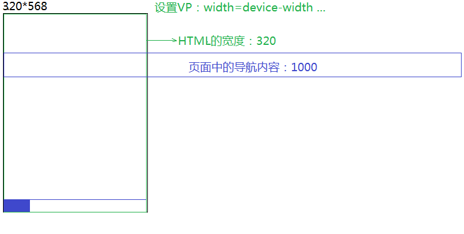
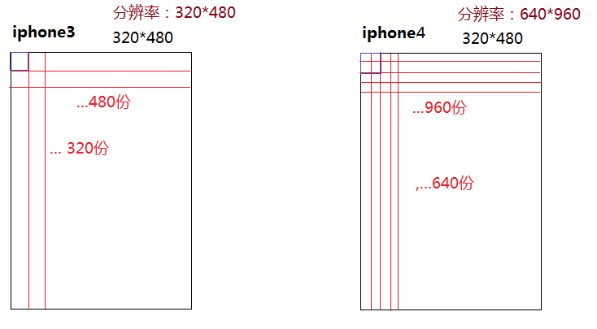
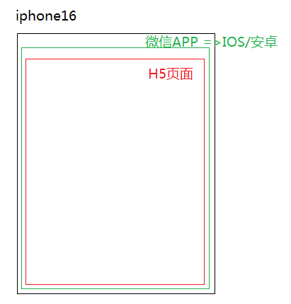

# H5的知识点梳理

T1.1~1.3  P1~P3  初级

T2.1~2.3  P4~P6  中高级

T3.1~3.3  P7~P9  架构师

## H5的知识点梳理-常用标签和表单

1. 新增加(删除/修改)的语义化标签

- 常用:
  - header 头部
  - footer 尾部
  - main 主体
  - section 区域
  - article 文章区域
  - aside 与内容无关的部分(例如: 广告)
  - nav 导航
  - figure 配图区域
  - figcaption 配图说明

- 不常用:
  - mark 标记
  - time 时间标记
  - progress 进度条
  - ...

2. 关于表单元素的新改革

- [传统表单元素]
  - input: text/password/radio/checkbox/file/hidden/button/submit/reset...
  - select
  - textarea 文本域
  - button
  - form
  - label 
  - ...

- [新增一些表单元素或者是表单类型]

input:search搜索框/email邮箱框/tel/number/range滑动杆/color/date/time/url地址框...

```html
<!-- 
数字框 非数字输入不进去 disabled不可更改
-->
<input type="number" id="ageInp" step="1" max="65" min="18" value="25" disabled>
滑动条
<input type="range" id="rangeInp" step="1" max="65" min="18" value="25">
<script>
    //change事件: 改变才会改, 滑动期间不会随时改变
    rangeInp.onchange=function(){
        let val=this.value;
        ageInp.value=val;
    }
    //input事件:移动端没有key-down/key-up用input代替, 代表正在操作当前表单元素(例如正在输入等) 滑动会随时改变
    rangeInp.oninput = function () {
        let val = this.value;
        console.log(val)
        ageInp.value = val;
    }
</script>
```

选颜色框

```html
<input type="color" name="" id="colorInp" />
<script>
    colorInp.onchange = function() {
        console.log(this.value); //=> 16进制颜色值
    }
</script>
```

- 表单元素中新增加的类型作用
  - 功能强大了(很多东西不需要自己导入JS插件完成了, 例如:日历)
  - 在移动端根据设置的类型不一样, 用户输入过程中调取出来的虚拟键盘也不一样(例如: number类型的文本框调取出来的是数字键盘. 输入邮箱的时候有email类型调取出来的键盘有特殊符号)
  - 新增加的类型提供了CSS/JS验证, 可以验证用户输入的内容是否符合格式(之前我们都是用正则自己解决, 现在H5中的新类型自带验证机制)
    虽然自带验证，但是开发还是拿正则
    用css做表单验证

```html
<style>
    #userEmail {
        border: 1px solid #ddd;
        outline: none; /* 当文本框获取焦点后去除浏览器默认的边框选中颜色 */
    }
    #userEmail:valid {
        /*通过验证：不输入或者输入正确*/
        border-color: green;
    }
    #userEmail:invalid {
        /*没通过验证*/
        border-color: red;
    }
    #userEmail:valid + span:after {
        content: '邮箱格式正确';
    }
    #userEmail:invalid + span:after {
        content: '邮箱不符合格式';
    }
</style>
<input type="email" id="userEmail" />
<span></span>
```

用js做表单验证

```html
<input type="email" id="userEmail" />
<span id="spanEmail"></span>
<script>
    userEmail.onkeyup = function() {
        //=> checkValidity: H5新提供的表单内容格式验证方法（新表单类型中有内置验证机制的，都可以基于这个方法验证）
        if (this.checkValidity()) {
            spanEmail.innerHTML = 'OK'
        } else {
            spanEmail.innerHTML = 'NO'
        }
    }
</script>
```

正常的js验证

- H5中给表单元素设置了一个新的属性：placeholder 用来做文本框的默认提示的（自己扩展：使用JS实现一套和PLACE-HOLDER一模一样的效果）

```html
<input type="email" id="userEmail" placeholder="请输入邮箱！" />
<span id="spanEmail"></span>
<script>
    // blur: 失去焦点
    // focus:获得焦点
    userEmail.onkeyup = userEmail.onblur = function() {
        let val = this.value.trim() // 去掉字符串的首位空格
        let reg = /^\w+((-\w+)|(\.\w+))*@[A-Za-z0-9]+((\.|-)[A-Za-z0-9]+)*\.[A-Za-z0-9]+$/
        if (val.length === 0) {
            spanEmail.innerHTML = '必填'
            return
        }
        if (!reg.test(val)) {
            spanEmail.innerHTML = 'NO'
            return
        }
        spanEmail.innerHTML = 'OK'
    }
</script>
```

下拉框：

```html
<!-- 下拉框（扩展：实现一个三级联动） -->
地区：
<select name="" id="selectCity">
    <option value="">==请选择==</option>
    <option value="北京">北京</option>
    <option value="上海">上海</option>
    <option value="广州">广州</option>
    <option value="深圳">深圳</option>
    <option value="杭州">杭州</option>
    <option value="成都">成都</option>
</select>
```

输入框带模糊匹配

```html
<input list="cars" id="myCar">
<datalist id="cars">
    <option value="BMW"></option>
    <option value="Ford"></option>
    <option value="Volvo"></option>
</datalist>
```

## H5和CSS3知识点梳理-CSS3常用的基本属性

### HTML5

3. 音视频标签
   - audio
   - video
     让我们告别了FLASH时代

4. canvas图形绘制
5. 提供了一些新的API
   - 本地存储：localStorage/sessionStorage
   - 获取地理位置：navigator.geolocation.getCurrentPosition 调取手机内部的GPS定位系统获取当前手机所在地的经纬度以及精确度等
   - 定位方式：基站定位、IP定位、GPS定位
   - 还提供了一些，让我们可以通过浏览器调取手机内部的软件或者硬件（但是性能都不怎么高，而且兼容性不是很好）

6. webSocket: socket.io 客户端和服务器新的传输方式（即时通讯IM系统基本上很多是基于它完成的）

### CSS3

#### 选择器

- \#ID
- .CLASS

- TAG

- *

- SELECTOR1,SELECTOR1... 群组选择器

- A B {} 后代

- AB {} 既具备A也具备B的（同级二级筛选）

- A>b {} 子代

- A+B {} 下一个弟弟

- A~B {} 兄弟

- A[NAME=''] 属性选择器

  - A[NAME!='']

  - A[NAME^='']

  - A[NAME$='']

  - A[NAME*='']

- A:link 未访问的链接
- A:hover 当有鼠标悬停在链接上
- A:active 被选择的链接
- A:visited 已访问的链接
- A:after
- A:before
- A:nth-child 
- A:nth-last-child
- A:nth-of-type
- A:nth-last-of-type
- A:not
- A:first-child
- A:last-child
- ...

#### 样式属性

1. 基本常用

   - border-radius

   - box-shadow

   - text-shadow 文本阴影

2. 背景

   - backgorund -color / -image / -attachment / -position / -repeat
   - background-size:
     - 100px 100px 宽高具体值
     - 100% 100% 宽高百分比
     - cover 以合适的比例把图片进行缩放（不会变形），覆盖整个容器
     - contain 背景图覆盖整个容器（但是会出现，如果一边碰到容器的边缘，则停止覆盖，导致部分区域是没有背景图的）
     - ...
   - background -clip: 背景图片裁切
     - border-box
     - padding-box
     - content-box
   - background-origin: 设置背景图的起始点
     - border-box
     - padding-box
     - content-box
   - filter: 滤镜
     - none | blur() | brightness() | contrast() | drop-shadow() | grayscale() | hue-rotate() | invert() | opacity() | saturate() | sepia() | url();

3. CSS3动画和变形（2D/3D）
   - 变形不是动画
   - transform: 变形
     - translate(X|Y|Z) 偏移
     - scale 缩放
     - rotate 旋转
     - skew 倾斜
     - matrix 矩阵（按照自己设定的矩阵公式实现变形）
   - transform-style:preserve-3d 实现3D变形
   - transform-origin: 变形的起点
   - 过渡动画
   - transition:
     - transition-property:all/width...哪些属性样式发生改变执行过渡动画效果，默认all，所有样式属性改变都会执行这个过渡效果
     - transition-duration:过渡动画的时间，一般都用秒 例如：.5s
     - transition-timing-function:动画运动的方式 
     - linear(默认) ease|ease-in|ease-out|ease-in-out|cubic-bezier(执行自己设定的贝塞尔曲线)
   - transition-delay:设置延迟的时间，默认是0s不延迟，立即执行动画
   - ...
   - 帧动画
   - animation:
   - animation-name 运动轨迹的名称
   - animation-duration 运动的时长
   - animation-timing-function 运动的方式(默认ease)
   - animation-delay 延迟时间
   - animation-iteration-count 运动次数(默认1 infinite无限次运动)
   - animation-fill-mode 运动完成后的状态(帧动画完成后，元素会默认回到运动的起始位置，如果想让其停留在最后一帧的位置，设置这个属性值为forward; backwards是当前帧动画如果有延迟时间，在延迟等待时间内，元素处于帧动画的第一帧位置; both是让帧动画同时具备forwards和backwards)
   - ...
   - 设置帧动画的运动轨迹
     ```
     @keyframes [运动轨迹名称] {
       from{
         //开始的样式
       }
       to{
         //结束的样式
       }
     }
     ```
     ```
     @keyframes [运动轨迹名称] {
       0%{
         //开始的样式
       }
       50%{}
       100%{
         //结束的样式
       }
     }
     ```

4. CSS3中的新盒子模型
   - box-sizing:border-box / padding-box / content-box(默认) 改变的width和height代表的是什么
   - columns:多列布局
   - flex:弹性盒子模型

5. 一些其他的CSS3属性
   - perspective:视距 实现3D动画必用的属性
   - @media:媒体查询 实现响应式布局的一种方案
   - @font-face:导入字体图标
   - ...

# 简述REM响应式布局原理

响应式布局：在不同尺寸的设备上都能良好的展示，这就是响应式布局设计(Responsive Layout)
公司中的产品形态：

1. PC端（全屏页面需要宽度自适应，但是一般都是固定宽度的）
2. PC+移动端用同一套项目（简单的页面，例如：产品介绍，公司展示类的官网等）
3. 移动端
   嵌入到APP中的H5
   微信中分享出来的H5
   微信公众号
   小程序
   靠浏览器访问的H5
   ...
4. RN(React Native) / ionic / cordova ... JS开发APP的框架，使用JS代码开发APP，最后框架会把代码转换为 安卓和IOS 需要的代码

如何实现响应式布局开发？

​      最常用的方案：REM等比缩放响应式布局

​      做移动端H5开发，首先加meta标签

```html
<meta name="viewport" content="width=device-width, initial-scale=1.0">
```

​        REM和PX一样都是样式单位，PX是固定单位，REM是相对单位（相对于当前页面根元素HTML的字体设定的单位）

​        我们开始给HTML的字体大小设置为100px(1rem=100px)，接下来我们写样式的时候，把所有的尺寸都用REM设定（测量出来的PX值/100就是应该设置REM的值），如果HTML的FONT-SIZE不变，用REM和PX一样，但是如果字体大小改变，也就是改变了REM和PX之间的换算比例，那么之前所有用REM做单位的样式都会自动按照最新的比例进行缩放（实现了改动HTML的FONT-SIZE，整个页面中的元素都跟着缩放了，牵一发而动全身）

​        真实项目中，设计师给我们一套设计稿（常用的尺寸：640 * 1136 750 * 1334 640 * 960 ...），拿到设计稿后，我们严格按照设计稿中的尺寸去编写样式

​          html{font-size:100px}

​          接下来写样式，把测量出来的px都除以100变为REM，所有的单位基于REM来搞

​        假设设计稿是750，也就相当于750的设备下，1rem=100px

​          我们页面运行在320的设备上，我们需要修改HTML的字体大小，以此实现页面跟着整体缩放：320/750*100 => 当前设备上HTML的字体大小

```html
<style>
    html {
        /* 
        1.最好不要写10：浏览器默认最小的字体是12px
        2.font-size设置为多少，相当于1rem等于多少像素
        3.之所以设置为100px,就是为了方便计算rem和px转换的比例
        */
        font-size: 100px;/* 1rem=100px */
    }
    .box1 {
        margin: .2rem;
        width: 100px;
        height: 100px;
        background: lightcoral;
    }
    .box2 {
        margin: 20px;
        width: 200px;
        height: 200px;
        background: lightgreen;
    }
    .box3 {
        margin: 20px;
        width: 300px;
        height: 300px;
        background: lightblue;
    }
</style>
<div class="box1"></div>
<div class="box2"></div>
<div class="box3"></div>
```

# 交互简历

## LOADING区域的结构样式（搭建REM结构）

index.less文件

```less
@import 'reset.min.less';

html {
  font-size: 100px; /* 640px设计稿尺寸中：1rem=100px */
}

html,
body {
  height: 100%;
  overflow: hidden;
  background: #f4f4f4;
}
.mainBox {
  margin: 0 auto;
  max-width: 640px;
  height: 100%;
  background: #fff;
}

/* 每个页面的盒子都有一样的公共样式，单独提取出来 */
.loadingBox {
  height: 100%;
  position: relative;
  overflow: hidden;
}

/* LOADING */
.loadingBox {
  background: #000;

  .title {
    width: 100%;
    position: absolute;
    left: 0;
    top: 50%;
    margin-top: -2.2rem; /* -0.7(正中间)+1.5(距离中间靠上的位移) */
    height: 1.4rem;
    color: #fff;
    h1 {
      line-height: 0.75rem;
      font-size: 0.5rem;
      text-align: center;
    }
    h2 {
      margin-top: 0.2rem;
      line-height: 0.45rem;
      font-size: 0.26rem;
      text-align: center;
      letter-spacing: 0.04rem; /* 字间距 */
    }
  }
}
```

index.html

```html
<!DOCTYPE html>
<html lang="en">
  <head>
    <meta charset="UTF-8" />
    <!-- 移动端开发meta:vp -->
    <meta name="viewport" content="width=device-width, initial-scale=1.0" />
    <title>Document</title>
    <!-- dev开发环境 -->
    <link rel="stylesheet/less" href="css/index.less" />
    <script src="js/less-2.5.3.min.js"></script>
    <!-- REM -->
    <script>
      //=> 根据当前设备的宽度，动态计算出REM的换算比例，实现页面中元素的等比缩放
      ~function anonymous() {
        let computedREM = function computedREM() {
          let winW = document.documentElement.clientWidth,
            desW = 640
          if (winW >= 640) {
            document.documentElement.style.fontSize = '100px'
            return
          }
          document.documentElement.style.fontSize = (winW / desW) * 100 + 'px'
        }
        computedREM()
        window.addEventListener('resize', computedREM)
      }()
    </script>
  </head>
  <body>
    <!-- 外面套一层main-box:控制当前页面的最大宽度，防止把做好的页面在PC端预览的时候满屏显示，这样字体和盒子大小等被肆意拉伸 -->
    <main class="mainBox">
      <!-- LOADING -->
      <section class="loadingBox">
        <div class="title">
          <h1>珠峰培训</h1>
          <h2>H5场景交互型简历</h2>
        </div>
        <div class="progress">
          <div class="current"></div>
        </div>
        <!-- progress是h5的进度条 -->
        <!-- <progress value=".25"></progress> -->
      </section>
    </main>
  </body>
</html>
```

## LOADING区域的进度条动画


## LOADING区域的业务逻辑


## PHONE区域的结构样式（HASH路由处理模型）


## PHONE区域的功能


## 移动端事件的一点知识


## MESSAGE区域的结构


## MESSAGE区域的样式


## MESSAGE区域的功能


## 完成第一阶段开发模块之间的关联


# VIEWPORT的理论基础

响应式布局：
一、viewport 视口
1.layout viewport: 布局（页面）视口 和开发css等相关
	在PC端，我们开发的HTML页面运行在浏览器中，浏览器有多宽（一般浏览器代表设备的宽度），HTML就有多宽，也就是在浏览器宽度的视口中渲染和呈现我们的页面

​	移动端和PC端有区别：不管移动端设备（代指打开的浏览器）的宽度是多少，HTML页面的宽度是980（或者1024） =>导致的问题：如果在设备窗口中想把整个页面完全呈现出来（小窗口中完全展示大页面），我们只能把大页面进行缩放，HTML页面缩放了，那么页面中所有内容都缩放了

【解决方案】
	只要让H5页面的宽度和手机设备的宽度保持一致即可，就不会出现手机渲染页面的时候把页面缩放的事情了

<meta name="viewport" content="width=device-width, initial-scale=1.0">
此meta标签就是在设置VP（视口）的规则
width=device-width: 让HTML页面的宽度等于设备的宽度
height=: 设置HTML页面的高度（一般不用）
initial-scale=1.0: 初始缩放比例是1：1（也就是既不放大也不缩小）
user-scalable=no: 禁止用户手动缩放
maximum-scale=1.0
minimum-scale=1.0: 设置最大最小的缩放比例1：1（既不放大也不缩小=>部分安卓机中只设置user-scalable是不起作用的，需要同这两个一起使用）
...
下两个视口没有应用场景，只是理论模型

2.visual viewport: 手机视口
3.ideal viewport: 理想视口 想把布局视口和手机视口一样宽


- js中动态设置viewport

```javascript
let metaV = document.createElement('meta');
metaV.name='viewport';
metaV.content='width=device-width, initial-scale=1.0';
document.head.appendChild(metaV);
```



- HTML宽度通过设置viewport和手机视口宽度一样，但是HTML中的内容呢？

**HTML的宽度>手机宽度**

解决方案：把页面整体缩放

**页面内容宽度>HTML页面的宽度**

待解决：会出现横向滚动条

​	真实移动端项目开发中，一般是不会出现横向滚动条的，想让它不出现横向滚动条就要保证内容的宽度不会超过HTML页面的宽度

​	移动端开发手机宽度不一定=>HTML页面的宽度也不一定=>所以内容的宽度一般也是不固定的（也就是所谓的百分比宽度）

如何解决？

​	移动端开发：外层盒子的宽度一般都是百分比设定的，很少有固定值的（里面具体的小元素宽度可以固定，里面的小元素出现横向滚动条没事，可以隐藏小元素的内容。但是整体页面是不能出现横向滚动条的）

解决方案：`流式响应式布局方案`


# MEDIA媒体查询

二、平时处理的移动端项目

1.PC端和移动端共用一套项目的（结构相对简单的：一般都是展示类的企业站）

【设计师一般只给一套设计稿】

A:先做PC端（设计给设计稿一般都是给PC端的）

  一般宽度都是自适应的（具体情况有所不同）

B:切换到手机端，使用@media(媒体查询)把不同设备上不合适的样式进行修改

2.PC端和移动端是分开的两套不同项目

【设计师一般会给两套设计稿（PC+移动）】

=>PC端单独做（做它的时候不需要考虑移动端响应式）

  固定布局

=>移动端单独做（只需要考虑移动端的响应式适配即可）

  响应式布局

​    A:依然可以基于@media来处理(麻烦一些)

```html
我们可以把@media理解为js中的条件判断：在不同条件中使用不同的CSS样式进行渲染
@media [媒体设备] and [媒体条件] and [媒体条件] ...
[媒体设备]:
all:所有设备
screen:所有屏幕设备（PC+电脑）
print:打印机设备
...

[媒体条件]:
max-width
max-device-width：一般都设置了viewport，max-device-width也就是max-width
max-height
min-width
min-device-width
min-height
max-device-pixel-ratio
orientation: portrait(竖屏) | landscape（横屏） （控制当前尺寸的方向）

手机常用的设备尺寸
苹果：320、375、414
安卓：320、360、480、540、640、720、（760...属于平板了）
pad: 768*1024(ipad)、1024*1366（ipad pro）...
```

```html
<html lang="en">
  <head>
    <meta charset="UTF-8" />
    <meta name="viewport" content="width=device-width, initial-scale=1.0" />
    <meta http-equiv="X-UA-Compatible" content="ie=edge" />
    <title>Document</title>
    <link rel="stylesheet" href="./reset.min.css" />
    <style>
      html,
      body {
        height: 100%;
        overflow: hidden;
      }
      .box {
        width: 300px;
        height: 300px;
        background: lightblue;
        margin: 20px auto;
      }
      

      @media all and (max-width: 780px) {
        .box {
          width: 200px;
          height: 200px;
          background: blue;
        }
      }
      @media all and (max-width: 640px) {
        .box {
          width: 150px;
          height: 150px;
          background: orange;
        }
      }
      @media all and (max-width: 480px) {
        /* 当前页面的宽度小于等于480px */
        .box {
          width: 100px;
          height: 100px;
          background: lightcoral;
        }
      }
      @media all and (max-width: 375px) {
        .box {
          width: 50px;
          height: 50px;
          background: lightpink;
        }
      }
      @media all and (orientation: portrait) {
        body {
          background: lightpink;
        }
      }
      @media all and (orientation: landscape) {
        body {
          background: lightblue;
        }
      }
    </style>
  </head>
  <body>
    <div class="box"></div>
  </body>
</html>
```

# DPR屏幕像素密度比

- 设计稿的尺寸和手机屏幕尺寸的关系

```
设计师给的移动端设计稿一般都是: iphone5类:640*1136(980或者不定高度)、iphone6类:750*1334...
  A:为什么我们的设计稿都比参照的手机大一倍
    目的是保证我们切下来的素材资源图片是大图
  B:为啥要保证是大图？
    因为很多手机都是二倍及三倍屏幕像素密度比（DPR）的
  C:即使给的是二倍设计稿，但是部分手机的设备尺寸要大于设计稿的一般，有的手机是3倍DPR，这样就导致一个问题：部分图片还是会变的模糊一些，此时我们找设计师单独的把模糊图片要一张大图即可
```



```
布局宽度：我们在CSS中写的宽度就是和屏幕尺寸大小关联的（和分辨率没什么必然联系）

iphone4中：
布局宽度：1px*1px（盒子大小=>我们看见的大小）
手机渲染的时候是按照：2px*2px的分辨率渲染
DPR：屏幕像素密度比是2.0（2倍屏幕或者高清屏幕）

如果1*1展示的是图片，手机是按照2*2大小的图片展示的（但是看到的大小还是1*1），如果真实素材图片就是1*1的大小，图片在渲染的时候就会被拉伸，从而变得模糊，所以我们准备的图片都需要比实际看到的宽高大一倍（3倍屏幕需要大两倍）
```

# 响应式布局解决方案

**A、D、E是目前最常用的响应式布局方案**

```
二、平时处理的移动端项目
1.PC端和移动端共用一套项目的（结构相对简单的：一般都是展示类的企业站）
【设计师一般只给一套设计稿】
A:先做PC端（设计给设计稿一般都是给PC端的）
  一般宽度都是自适应的（具体情况有所不同）
B:切换到手机端，使用@media(媒体查询)把不同设备上不合适的样式进行修改

2.PC端和移动端是分开的两套不同项目
【设计师一般会给两套设计稿（PC+移动）】
=>PC端单独做（做它的时候不需要考虑移动端响应式）
  固定布局
=>移动端单独做（只需要考虑移动端的响应式适配即可）
  响应式布局
    A:依然可以基于@media来处理(麻烦一些)
    B:固定布局(viewport => width=320px):按照设计稿把320尺寸的写好即可（所有的尺寸都可以固定，而且都是设计稿的一半[因为设计稿是大一倍的]），在其他的设备上，让320的页面剧中展示即可
    C:SCALE等比缩放布局【transform属性】（严格按照设计稿的尺寸来写样式[没有啥自适应宽度，都是固定值]，在其它设备上，首先获取设备的宽度，让其除以设计稿的宽度，然后让原始写好的页面按照这个比例整体缩小即可） => 会导致一些问题例如字体变模糊，有缩放卡顿...
    D:REM等比缩放，它是参考的SCALE，只是用的REM单位来实现的等比缩放（严格按照设计稿的尺寸编写[但是一般宽度让他自适应]，其余的值可以写成固定值 -> 在编写CSS样式的时候，我们把所有的PX单位都换算成REM单位 -> 当加载页面的时候，根据当前设备的尺寸除以设计稿，根据比例动态调整REM和PX的换算比例）
    E:CSS3中提供了flex-box伸缩盒子模型，基于这个属性，可以让某些效果处理起来更加方便
```

- SCALE等比缩放布局【transform属性】

```html
<html lang="en">
    <head>
        <meta name="viewport" content="width=device-width, initial-scale=1.0" />
        <meta http-equiv="X-UA-Compatible" content="ie=edge" />
        <title>Document</title>
        <link rel="stylesheet" href="./reset.min.css" />
        <style>
            .container {
                margin: 0 auto;
                width: 750px;
                transform-origin: left top;/* 控制最终缩放的时候：不是从中心点缩放，而实从左上角缩放 */
            }
            .headerBox {
                height: 200px;
                border: 2px solid lightcoral;
            }
            .headerBox h1 {
                float: left;
                width: 300px;
                height: 100%;
                line-height: 200px;
                font-size: 36px;
            }
            .headerBox ul {
                float: right;
            }
            .headerBox ul li {
                float: left;
                padding: 0 20px;
                height: 200px;
                line-height: 200px;
                font-size: 28px;
            }
        </style>
        <script>
            window.addEventListener('load', () => {
                let container = document.querySelector('.container'),
                    winW = document.documentElement.clientWidth
                container.style.transform = `scale(${winW / 750})`
            })
        </script>
    </head>
    <body>
        <div class="container">
            <header class="headerBox">
                <h1>珠峰培训</h1>
                <ul class="menu clear">
                    <li>首页</li>
                    <li>团购</li>
                    <li>海外</li>
                </ul>
            </header>
        </div>
    </body>
</html>
```

- REM等比缩放

```html
<html lang="en">
    <head>
        <meta charset="UTF-8" />
        <meta name="viewport" content="width=device-width, initial-scale=1.0" />
        <meta http-equiv="X-UA-Compatible" content="ie=edge" />
        <title>Document</title>
        <link rel="stylesheet" href="./reset.min.css" />
        <style>
            /* REM是相对单位，相对于根元素（HTML标签）的字体大小设定的单位 */
            html {
                /*font-size: 10px; 1rem=10px 浏览器都有自己默认的最小字体，例如谷歌是12px,所以准确来说，此处这样写相当于1rem=12px */
                /*font-size: 14px;  1rem=14px 这个比例计算转换的时候太麻烦 */
                font-size: 100px; /* 1rem=100px => 设计稿 */
            }
            .headerBox {
                height: 2rem;
                border: 0.02rem solid lightcoral;
            }
            .headerBox h1 {
                float: left;
                width: 3rem;
                height: 100%;
                line-height: 2rem;
                font-size: 0.36rem;
            }
            .headerBox ul {
                float: right;
            }
            .headerBox ul li {
                float: left;
                padding: 0 0.2rem;
                height: 2rem;
                line-height: 2rem;
                font-size: 0.28rem;
            }
        </style>
        <script>
            window.addEventListener('load', () => {
                let computedREM = function computedREM() {
                    let HTML = document.documentElement,
                        winW = HTML.clientWidth
                    HTML.style.fontSize = `${(winW / 750) * 100}px` //=> 重新调整HTML字体大小（重新调整REM的转换比例），这样以前所有以REM为单位的样式值都会按照最新的比例中心渲染
                }
                computedREM()
                window.addEventListener('resize', computedREM)
            })
        </script>
    </head>
    <body>
        <div class="container">
            <header class="headerBox">
                <h1>珠峰培训</h1>
                <ul class="menu clear">
                    <li>首页</li>
                    <li>团购</li>
                    <li>海外</li>
                </ul>
            </header>
        </div>
    </body>
</html>
```

# 交互简历


## 实现3D魔方


## 基于JS实现3D魔方的旋转


## SWIPER的基础用法


## 详情区域PAGE1页面的开发


## 详情区域PAGE2页面的开发


## 最后流程梳理和产品发布


# Hybrid混合APP开发

1. 前端做的都是H5页面 WebApp
   - 运行在浏览器中
   - 移动端不仅可以运行在浏览器中，还可以运行在APP中（例如：微信、自己公司的APP中）
   - 优点：
     - 及时更新（不需要用户选择，我们只需要把服务器上的源文件更新，用户访问的永远是最新的）跨平台
   - 弊端：
     - 不是直接运行在操作系统中的，是运行在浏览器或者APP中的，所以不能直接的操作手机上的软硬件（运作模式：H5通知浏览器或者APP我们想做什么 -> 浏览器调取手机的软硬件 -> 浏览器把信息返回给H5）
     - 性能没有APP好
     - ...

2. APP不是H5,它是原生的应用NativeApp
   - IOS：object-c / swift (需要C的功底)
   - 安卓：java-native （需要JAVA功底）
   - 优点：用户把安装包下载到手机上进行安装，后期程序是直接运行在手机操作系统中的
     - 性能高
     - 可以调取手机内置的软件或者硬件（例如：调取摄像头、重力感应器、通讯录等）[前提用户需要同意才可以]
   - 弊端
     - 不能跨平台，一款产品需要两个团队开发两套不同的安装包
       - 成本大
       - 版本不统一
     - 不能及时更新
     - 苹果商店上传一款APP需要7天审核周期

3. Hybrid混合开发模式
   把传统IOS和安卓开发与H5开发结合在一起来做（微信公众号开发：把我们做的H5运行在微信APP中）

4. ReactNative ionic 微信小程序...
   
   NativeApp提供一个供H5运行的环境 "web view"（webkit内核 => 浏览器的另一种叫法）
   
   H5和APP的通信：**jsBridge模式**
   微信APP把所有H5可以调取的方法和功能都注入到webView的全局对象中
   webView有一个全局对象wx={xxx:...}
   H5运行在webView中，所以在JS中可以使用wx.xxx()完成方法的调用

# WEBAPP

## 搭建基础结构（SEO的一点小知识）

### SEO

1. SEO 网络运营推广（搜索引擎优化推广）
   目标：尽可能在搜索引擎中提升产品的权重（ALEX排名）
   百度是一个搜索引擎，它养一个宠物“爬虫/蜘蛛”，他会让爬虫有规律的去你的往回走那中进行内容的收录（收录到自己的词库中），当用户在引擎中输入关键词进行查询，引擎会到自己的词库中进行匹配，把匹配的站点推荐展示
   如果我们想做SEO优化，应该尽可能的让引擎多收录一些关键词和内容

   - 给当前的页面设置meta标签/title标签

     ```html
     <title>网页标题</title>
     <meta name="keywords" content="网页关键字" />
     <meta name="description" content="网页描述" />
     ```

   - 对于一个页面中H1~H6这些标签的权重较高，尤其是H1，我们尽可能把重要的关键词放到H1中（语义化标签合理使用）

     ```html
     <h1>
       
       xxx
     </h1>
     ```
     H1中的文字不需要展示给用户，但是我们还会写一些文字，主要是给爬虫看的（样式中font-size等于零即可）；img是不会被收录的，但是alt中编写的问题可以被收录，所以img标签的alt属性一定要加，最好写一些关键词...

   前后端分离项目（数据有客户端JS获取和渲染）是不利于SEO优化的

   - 使用JS做数据绑定的，页面的源代码中是没有动态绑定的数据的（但是用户在页面中可以看见内容），而搜索引擎的爬虫就是从源代码进行抓取收录的（vue/react都是js做数据绑定）
   - 目前市场上大部分都是前后端分离项目，也就是JS做数据绑定，由客户端渲染，但是还有一部分项目依然是传统的服务端数据处理（非完全前后端分离项目）
   - ...
2. SEM 百度竞价推广（千万不能信）

### 搭建基础结构

```html
<!DOCTYPE html>
<html lang="en">
  <head>
    <meta charset="UTF-8" />
    <title>Document</title>
  </head>
  <body>
    <main class="mainBox">
      <!-- Header -->
      <header class="headerBox">
        <h1>新浪网</h1>

        <a href="javascript:;" class="weather"></a>
        <a href="javascript:;" class="person"></a>
        <a href="javascript:;" class="navMenu"></a>
      </header>
      <!-- Nav -->
      <nav class="navBox">
        <!-- a标签或者ul>li都可以 -->
        <a href="#">新闻</a>
        <a href="#">财经</a>
        <a href="#">体育</a>
        <a href="#">娱乐</a>
        <a href="#">军事</a>
        <a href="#">汽车</a>
        <a href="#">科技</a>
        <a href="#">视频</a>
        <a href="#">美图</a>
        <a href="#">NBA</a>
        <a href="#">博客</a>
      </nav>
      <!-- Banner -->
      <section class="swiper-container bannerBox">
        <div class="swiper-wrapper">
          <div class="swiper-slide">
            
            <p>
              xxxxx
            </p>
          </div>
        </div>
        <!-- 分页器 -->
        <div class="swiper-pagination"></div>
      </section>

      <!-- Message -->
      <section class="messageBox">
        <div class="liveFlag">直播</div>
        <div class="swiper-container">
          <div class="swiper-wrapper">
            <div class="swiper-slide">xxxxx</div>
          </div>
        </div>
      </section>
      <!-- News -->
      <section class="newsBox">
        <ul class="container">
          <li class="newsItem">
            
            <h3>xxx</h3>
            <span>20万</span>
          </li>
          <li class="newsItem imgBox">
            <h3>xxx</h3>
            <div>
              
              
              
            </div>
            <span>20万</span>
          </li>
        </ul>
      </section>
    </main>
  </body>
</html>
```


## REM框架搭建


## HEADER和NAV区域的处理


## 轮播图和消息区域处理