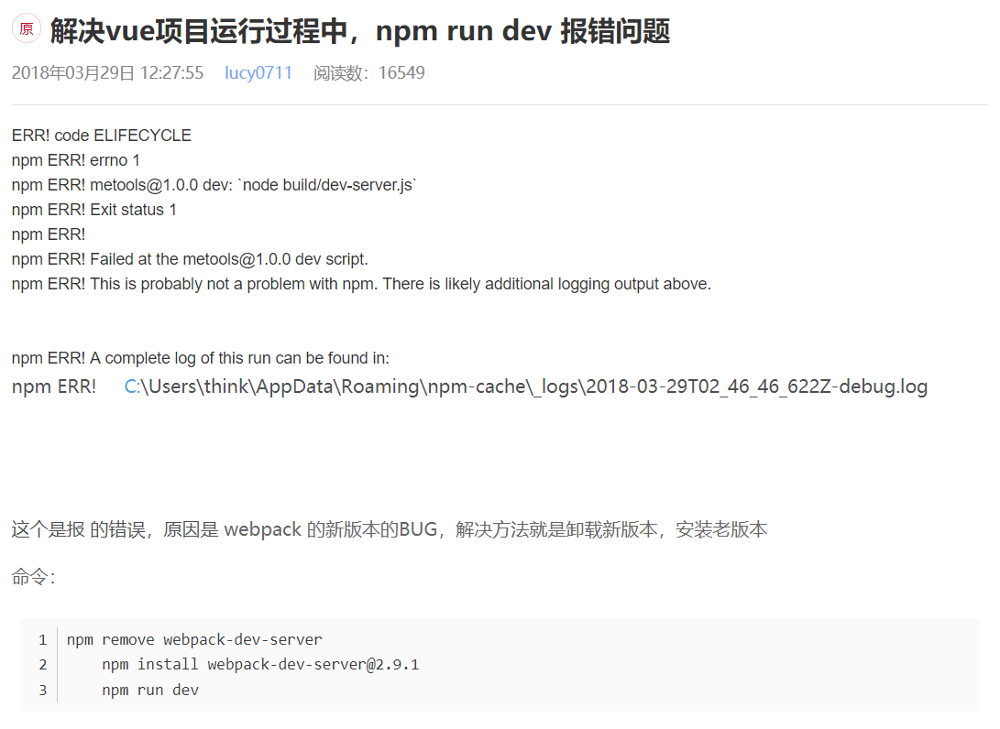
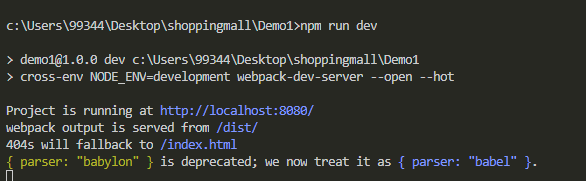
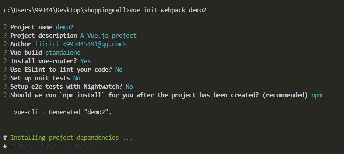
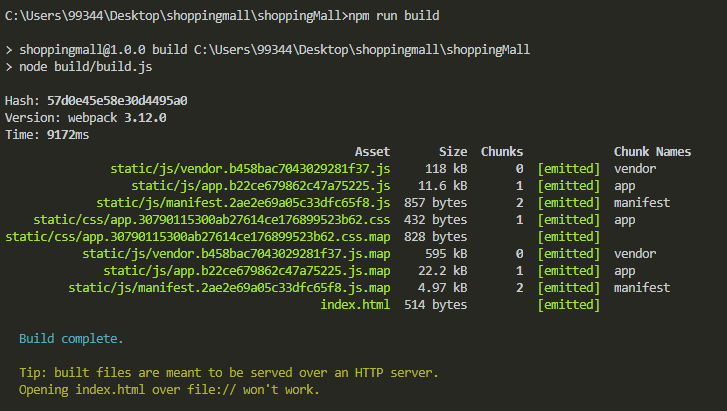
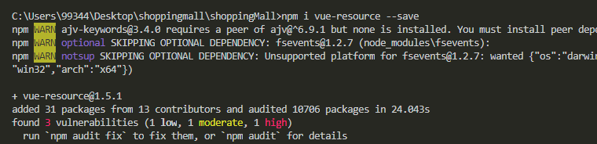
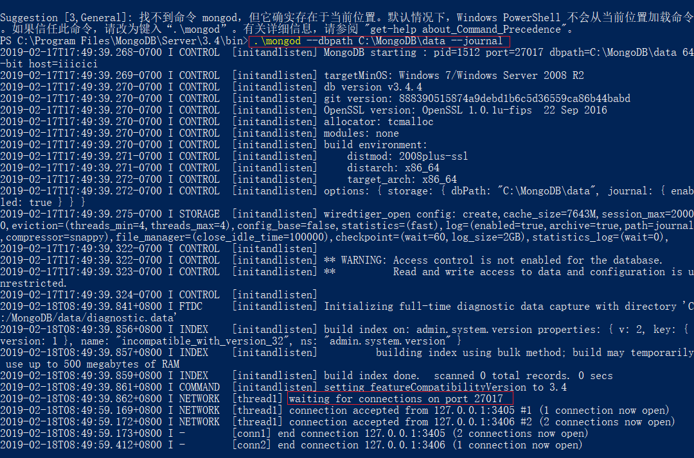
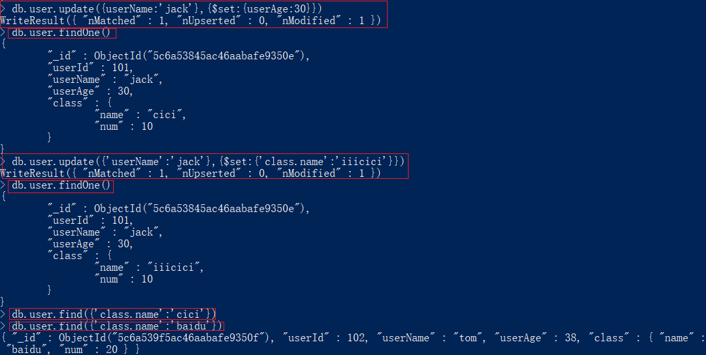
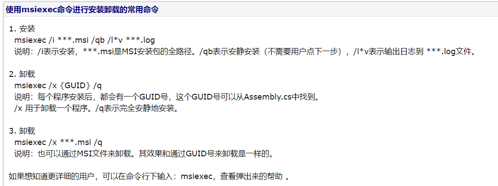

# shoppingMall项目

## Vue基础

### vue环境搭建以及vue-cli使用

`npm i vue --save`先在项目文件夹里安装本地vue第三方模块


- 安装脚手架并使用vue命令

`npm i vue-cli -g`安装脚手架

> 之后可以使用命令`vue init webpack-simple Demo5`初始化一个vue框架的项目


> npm run dev报错

https://blog.csdn.net/weixin_39495540/article/details/79740790



> 解决以后




> 也可以使用命令`vue init webpack Demo6`初始化一个vue框架的项目



> 安装完以后也会报错
>
> 也可以按上面的方法重装`webpack-dev-server`, 但是会提示报错, 不用管,继续`npm run dev`即可

### vue配置

> `npm run build`构建




### vue基础语法

- 模板语法

> Mustache语法: `{{msg}}`
>
> Html赋值: `v-html=""`
>
> 绑定属性: `v-bind:id=""` id是绑定属性的名字
>
> 使用表达式: `{{ok?'YES':'NO'}}`接口查询状态值
>
> 文本赋值: `v-text=""`
>
> 指令: `v-if=""`
>
> 过滤器: `{{message|capitalize}}和v-bind:id="raw|formatId"`

- Class和Style绑定

> 对象语法: `v-bind:class="{active:isActive,'text-danger':hasError}"`
>
> 数组语法:
>
> ```html
> <div v-bind:class="[activeClass, errorClass]">
> ```
>
> ```javascript
> data: {
>     activeClass:'active',
>     errorClass: 'text-danger'
> }
> ```
>
> style绑定-对象语法:`v-bind:style="{color:activeColor,fontSize:fontSize+'px'}"`

- 条件渲染

> `v-if`
>
> `v-else`
>
> `v-else-if` 可以连写
>
> `v-show`
>
> `v-cloak`其实不是条件渲染, 为了配合使用

- vue事件处理器

> `v-on:click="greet"`或者`@click="greet"`
>
> 事件修饰符:
>
> 阻止冒泡:`v-on:click.stop``
>
> 阻止默认事件:``v-on:click.stop.prevent`
>
> `v-on:click.self`
>
> 只给这个事件绑定一次`v-on:click.once`

> `v-on:keyup.enter`
>
> `.enter`
>
> `.tab`
>
> `.delete`捕获"删除"和"退格"键
>
> `.esc`
>
> `.space`
>
> `.up`
>
> `.down`
>
> `.left`
>
> `.right`

- vue组件

> 全局组件和局部组件
>
> 父子组件通讯-数据传递: 本身是只能单向触发, 但是可以使用Emit Event和Pass Props来双向传递
>
> 
>
> 
>
> Slot: 插槽

## Vue-router

### 路由基础介绍

- 前端路由

> 路由是根据不同的url地址展示不同的内容或页面
>
> 前端路由就是把不同路由对应不同的内容或页面的任务交给前端来做, 之前是 通过服务端根据url的不同返回不同的页面实现的

- 什么时候使用前端路由

> 在单页面应用, 大部分页面结构不变, 只改变部分内容的使用

- 前端路由有什么优点和缺点

> 优点: 用户体验好, 不需要每次都从服务器全部获取, 快速展现给用户
>
> 缺点: 
>
> 不利于SEO
>
> 使用浏览器的前进, 后退键的时候回重新发送请求, 没有合理地利用缓存
>
> 单页面无法记住之前滚动的位置, 无法在前进, 后退的时候记住滚动的位置

- vue-router用来构建SPA

> `<router-link></router-link>`或者`this.$router.push({path:''})`
>
> `<router-view></router-view>`

- 动态路由匹配
- 嵌套路由
- 编程式路由
- 命名路由和命名视图

### 动态路由配置

- 动态路由


### 嵌套路由

### 编程式路由

- 什么是编程式路由

> 通过js来实现页面的跳转
>
> `$router.push("name")`
>
> `$router.push({path:"name"})`
>
> `$router.push({path:"name?a=123"})`或者`$router.push({path:"name",query:{a:123}})`
>
> `$router.go(1)`

### 命名路由和命名视图

- 什么是命名路由和命名视图

> 给路由定义不同的名字, 根据名字进行匹配
>
> 给不同的router-view定义名字,  通过名字进行对应组件的渲染 

## Vue-resource和Axios

### vue-resource使用

- Vue-Resource基础介绍

> 通过链接引入文件
>
> `<script src="https://cdn.jsdelivr.net/vue.resource/1.3.1/vue-resource.min.js"></script>`
>
> 通过npm安装
>
> `npm install vue-ressource --save`



- vue-resource的请求API是按照REST风格设计的, 它提供了7种请求API:

> `get(url,[options])`
>
> `head(url,[options])`
>
> `delete(url,[options])`
>
> `jsonp(url,[options])`
>
> `post(url,[body],[options])`
>
> `put(url,[body],[options])`
>
> `patch(url,[body],[options])`


- 全局拦截器interceptors

```javascript
Vue.http.interceptors.push((request, next)=>{
    // ...
    // 请求发送前的处理逻辑
    // ...
    next((response)=>{
        // ...
        // 请求发送后的处理逻辑
        // ...
        // 根据请求的状态, response参数会返回给successCallback或者errorCallback
        return response
    })
})
```

- Get请求
- Post请求
- JSONP请求
- 全局拦截器使用

### axios基础介绍

- 安装方式

> `<script src="https://unpkg.com/axios/dist/axios.min.js"></script>`
>
> `npm install axios --save`

- API

> `axios.request(config)`
>
> `axios.get(url[,config])`
>
> `axios.delete(url[,config])`
>
> `axios.head(url[,config])`
>
> `axios.options(url[,config])`
>
> `axios.post(url[,data[,config]])`
>
> `axios.put(url[,data[,config]])`
>
> `axios.patch(url[,data[,config]])`

```javascript
function getUserAccount(){
    return axios.get('/user/12345');
}
function getUserPermissions(){
    return axios.get('/user/12345/permissions');
}

axios.all([getUserAccount(), getUserPermissions()]).then(axios.spread(function(acct, perms){
    // Both request are now complete
}))
```

## ES6常用语法

### ES6简介

## 商品列表模块实现

### 商品列表组件拆分

- Header组件
- Footer组件
- 面包屑组件

### 商品列表数据渲染实现

- 模拟mock数据, 加载商品列表信息

### 实现图片懒加载

- vue-lazyload

## Node.js基础

### Linux环境下配置Node环境

### 搭建基于Express框架的运行环境

> `npm i express-generator -g`全局安装express构建模块
>
> `express server`使用express构建一个server名字的构建文件夹
>
> 把server文件夹下的package中的配置赋值到项目外的package.json中, 再重新在项目下`npm install`, 把server文件夹下的package.json文件可以删除掉


> 不想使用.jade, 想使用html文件, 先下载ejs
>
> 在项目下安装`ejs`
>
> `npm i ejs --save`
>
> 再把server文件夹下的views文件夹下的.jade文件删除掉


### window平台下MongoDB的安装和环境搭建

- Mongo数据库的优点

> 高可扩展性
>
> 分布式存储
>
> 低成本
>
> 结构灵活

- 安装

> 下载安装包或者压缩包
>
> 添加db存储和日志存储文件夹
>
> 添加服务, 配置环境变量, 启动Mongo



> 或者可以把配置文件写好了之后再通过命令配置

> etc文件夹下的mongo.conf文件

```
#数据库路径
dbpath=c:\MongoDB\data\
#日志输出文件路径
logpath=c:\MongoDB\logs\mongodb.log
#错误日志采用追加模式，配置这个选项后mongodb的日志会追加到现有的日志文件，而不是从新创建一个新文件
logappend=true
#启用日志文件，默认启用
journal=true
#这个选项可以过滤掉一些无用的日志信息，若需要调试使用请设置为false
quiet=false
#端口号 默认为27017
port=27017
#http配置
httpinterface=true
```


### 给MongoDB创建用户

> 打开mongo服务
>
> `mongo --config /user/local/etc/mongod/conf`

> 创建管理员
>
> `db.createUser({user:"admin",pwd:"admin",roles:["root"]})`
>
> 给shoppingmall数据库创建用户
>
> 
>
> 授权认证
>
> `db.auth("","")`
>
> 返回1说明认证成功
>
> 
>
> 给使用的数据库添加用户

### MongoDB基本语法

> 数据库对比


> 插入文档
>
> `insert`插入
>
> `find()`查找
>
> `find().pretty()`查找并格式化数据
>
> 
>
> `findOne()`查找第一个
>
> 
>
> 更新文档
>
> `update()`更新
>
> 
>
> 删除文档
>
> 
>
> 
>
> 查询文档
>
> 运算符
>
> `$gt`大于
>
> `$lt`小于
>
> `$eq`等于
>
> `$gte`大于等于
>
> 

### 表数据设计和插入

> 导入数据之前先创建好集合


### mongoVue卸载

> 安装不上的话用msiexec命令进行安装



## 基于Node.js开发商品列表接口

### Node的启动和调试方式

> 基于node启动
>
> 基于webstorm启动
>
> 基于pm2插件启动

### 基于Express实现商品列表查询接口

- 安装Mongoose

> 对MongoDB的封装

- 创建model
- 创建路由
- 基于mongoose,实现商品列表的查询功能 