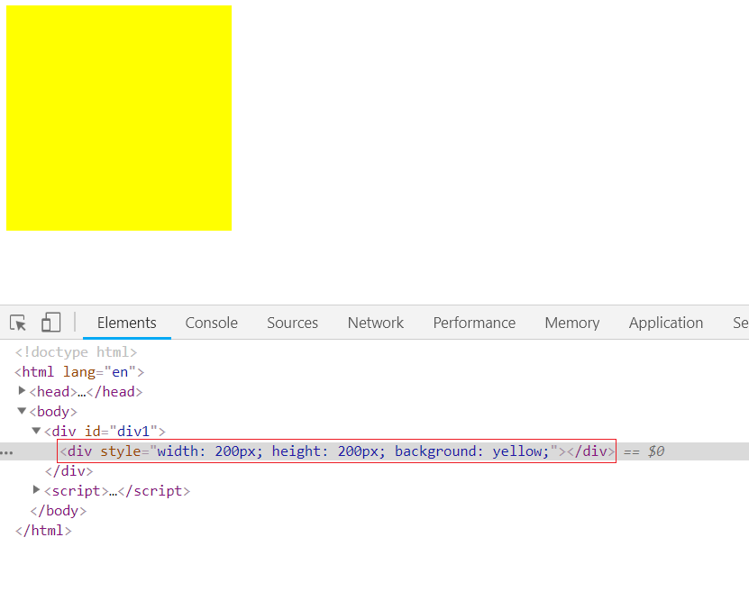

- 指令(directive)--补充了html的属性

`v-bind:`

> 可以用于任何属性
>
> 可以直接简写成`:`

```html
<script src="vue.js"></script>


<div id="div1">
    <strong v-bind:title="age+'岁'">{{name}}</strong>
</div>
<script>
    let vm = new Vue({
        el:'#div1',
        data:{
            age: 18,
            name: 'iiicici'
        }
    })
</script>
```


> 有两个属性有另外的写法
>
> class,style属性
>
> `v-bind:class=""`和`v-bind:style=""`可以接收`字符串和数组`

> class_array: ['aa', 'bb', 'v', 'cc']
>
> class_str: 'aa bb cc active'

```html
<div id="div1">
    
    <div :class="class_array"></div>
    <div :class="class_str"></div>
</div>

<script>
    let vm = new Vue({
        el: '#div1',
        data: {
            url: 'https://ss1.baidu.com/6ONXsjip0QIZ8tyhnq/it/u=3101490607,4089794115&fm=58&bpow=400&bpoh=660',
            class_array: ['aa', 'bb', 'v', 'cc'],
            class_str: 'aa bb cc active'
        }
    })
</script>
```


> style_str: 'width:200px;height:200px;background:yellow',
>
> style_json: { width: '200px', background: 'green', height: '200px' }

```html
<div id="div1">
    <div v-bind:style="style_str"></div>
</div>
<script>
    let vm = new Vue({
        el: '#div1',
        data: {
            style_str: 'width:200px;height:200px;background:yellow',
            style_json: { width: '200px', background: 'green', height: '200px' }
        }
    })
</script>
```




`v-model`数据双向绑定

> 数据(data)和input之间双向绑定
>
> 输入组件才能使用
>
> v-model进来的数据, 都是字符串


```html
<body>
    <div id="div1">
        <input type="text" name="" id="" v-model="n1">+
        <input type="text" name="" id="" v-model="n2">=
        <span>{{sum()}}</span>
    </div>
    <script>
        let vm = new Vue({
            el: '#div1',
            data: {
                n1: 0,
                n2: 10,
            },
            methods: {
                sum() {
                    return parseInt(this.n1)+parseInt(this.n2);
                }
            }
        })
    </script>
</body>
```

`v-text`直接输出html代码

```html
<body>
    <div id="div1">
        <div v-text="str"></div>
        <!-- <div>{{str}}</div> 和这样写效果一样, 这样里面还可以加别的内容-->
    </div>
    <script>
        let vm = new Vue({
            el: '#div1',
            data: {
                str: '<p>11月26日，一段题为“张家口经开区国土局局长接访时玩手机”的视频在网络平台流传。</p>',
            }
        })
    </script>
</body>
```


`v-html`innetHTML

```html
<body>
    <div id="div1">
        <div v-html="str"></div>
    </div>
    <script>
        let vm = new Vue({
            el: '#div1',
            data: {
                str: '<p>11月26日，一段题为“张家口经开区国土局局长接访时玩手机”的视频在网络平台流传。</p>',
            }
        })
    </script>
</body>
```


- vue事件

`v-on:`

> v-on:click="fn(x,x,x...)"
>
> 简写
>
> @click="fn(x,x,x...)"

```html
<body>
    <div id="div1">
        <span>{{a}}</span>
        <input type="button" value="+1" v-on:click="sum(3)">
        <!--<input type="button" value="+1" @click="sum(3)"> 简写方式-->
    </div>
    <script>
        let vm = new Vue({
            el: '#div1',
            data: {
                a: 1,
            },
            methods: {
                sum(b) {
                    this.a += b;
                }
            }
        })
    </script>
</body>
```

`v-show`display

```html
<style>
    .box {
        width: 300px;
        height: 300px;
        background-color: #ccc;
    }
</style>
<script src="vue.js"></script>


<div id="div1">
    <input type="button" value="显示隐藏" @click="commit()">
    <div class="box" v-show="a"></div>
</div>
<script>
    let vm = new Vue({
        el: '#div1',
        data: {
            a: true,
        },
        methods: {
            commit() {
                this.a = !this.a;
            }
        }

    })
</script>
```


> 显示


> 隐藏


`v-if`删除元素

```html
<style>
    .box {
        width: 300px;
        height: 300px;
        background-color: #ccc;
    }
</style>
<script src="vue.js"></script>


<div id="div1">
    <input type="button" value="显示隐藏" @click="commit()">
    <div class="box" v-if="a"></div>
</div>
<script>
    let vm = new Vue({
        el: '#div1',
        data: {
            a: true,
        },
        methods: {
            commit() {
                this.a = !this.a;
            }
        }

    })
</script>
```

> 显示


> 隐藏, 会直接删除元素


`v-for:`

> 1.数组  v-for="item,index in array"

```html
<div id="div1">
    <ul>
        <li v-for="a in users">{{a.name}},{{a.password}}</li>
    </ul>
</div>
<script>
    let vm = new Vue({
        el: '#div1',
        data: {
            users: [
                { name: 'blue', password: '123456' },
                { name: 'zhangsan', password: '11111' },
                { name: 'iiicici', password: '666666' }
            ]
        }
    });
</script>
```


> 2.json v-for="val,key in json"

```html
<div id="div1">
    <ul>
        <li v-for="user,index in users">{{index}}.用户名:{{user.name}},密码:{{user.password}}</li>
    </ul>
</div>
<script>
    let vm = new Vue({
        el: '#div1',
        data: {
            users: [
                { name: 'blue', password: '123456' },
                { name: 'zhangsan', password: '11111' },
                { name: 'iiicici', password: '666666' }
            ]
        }
    });
</script>
```


> 3.字符串 v-for="char,index in str"
>
> 4.数字 v-for="i in num"

