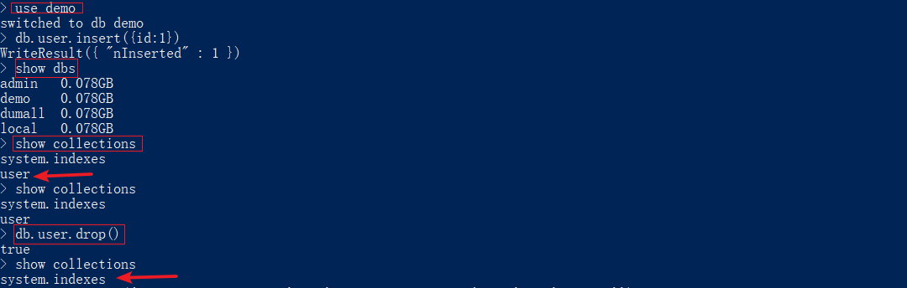
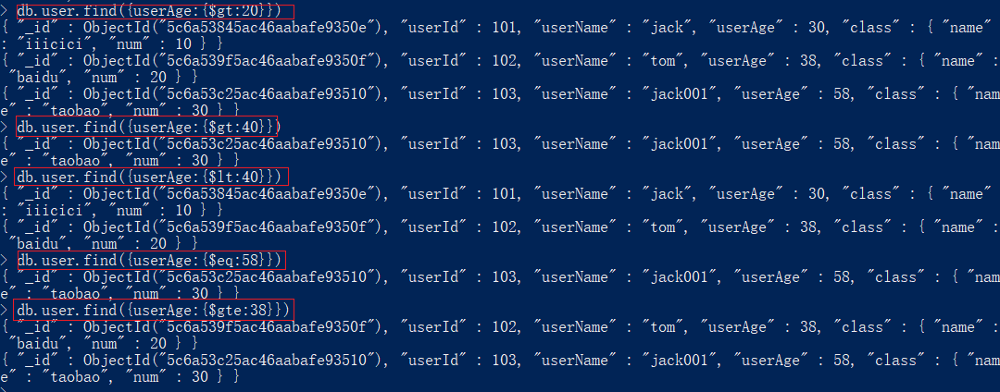

# mongoDB

## window平台下MongoDB的安装和环境搭建

Mongo数据库的优点

- 高可扩展性

- 分布式存储

- 低成本

- 结构灵活

安装

下载安装包或者压缩包

添加db存储和日志存储文件夹

添加服务, 配置环境变量, 启动Mongo


> 或者可以把配置文件写好了之后再通过命令配置

> etc文件夹下的mongo.conf文件

```
#数据库路径
dbpath=c:\MongoDB\data\
#日志输出文件路径
logpath=c:\MongoDB\logs\mongodb.log
#错误日志采用追加模式，配置这个选项后mongodb的日志会追加到现有的日志文件，而不是从新创建一个新文件
logappend=true
#启用日志文件，默认启用
journal=true
#这个选项可以过滤掉一些无用的日志信息，若需要调试使用请设置为false
quiet=false
#端口号 默认为27017
port=27017
#http配置
httpinterface=true
```


## 给MongoDB创建用户

打开mongo服务

`mongo --config /user/local/etc/mongod/conf`

创建管理员

`db.createUser({user:"admin",pwd:"admin",roles:["root"]})`

给shoppingmall数据库创建用户


授权认证

`db.auth("","")`

返回1说明认证成功


给使用的数据库添加用户

## MongoDB基本语法

数据库对比


插入文档

`insert`插入

`find()`查找

`find().pretty()`查找并格式化数据


`findOne()`查找第一个

更新文档

`update()`更新


删除文档




查询文档

运算符

`$gt`大于

`$lt`小于

`$eq`等于

`$gte`大于等于



## 表数据设计和插入

导入数据之前先创建好集合


## mongoVue卸载

安装不上的话用msiexec命令进行安装

