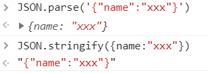

# 商城排序

## 基于AJAX获取数据

- 获取数据和实现数据绑定流程

> 真实项目中, 页面中大部分数据都不是写死的, 而是动态绑定的
> ​     A: 从服务器端获取到数据(基于AJAX/JSONP等技术, 通过服务器端提供的数据API接口地址, 把数据请求回来)
> ​     B: 把获取的数据进行解析
> ​     C: 把数据绑定在HTML页面中(数据绑定): ES6中的模板字符串

- AJAX和JSONP的区别:

> AJAX: 同源策略请求
> JSONP: 跨域策略请求(非同源策略请求)

- 从服务器端获取到数据

```javascript
// json/product.js文件
let productData = null;
let xhr = new XMLHttpRequest();//=> 创建AJAX实例
xhr.open('GET', 'json/product.json', false);//=> 打开一个请求的地址(一般地址都是服务器提供好的, 会给我们一个API接口文档), 最后一个参数是设置同步还是异步(false: 同步 true: 异步), 真实项目中最常使用的是异步
xhr.onreadystatechange = () => {
    if (xhr.readyState === 4 && xhr.status === 200){
        productData = xhr.responseText;
    }
};

xhr.send(null);
console.log(productData);
```

```json
// json/product.json文件
[
  {
    "id": 1,
    "title": "HUAWEI Mate 10 4GB+64GB 全网通版（亮黑色）",
    "price": 3899,
    "time": "2017-03-15",
    "hot": 198,
    "img": "img/1.jpg"
  }
  //...
]
```

## 把获取的JSON字符串转换为对象

- json格式

> json格式: json不是一种数据类型, 而是一种数据格式, 只要把对象的属性名用双引号括起来, 此时的对象就不再称之为普通对象, 而是叫做json格式的对象

- 获取的数据是字符串

> 获取的结果是一个字符串:"json格式的字符串", 我们此时需要把获取的字符串转换为对象
>
> 从服务器端获取的数据格式一般都是JSON格式的(大部分都是json格式字符串)

- `json格式的字符串` 与 `对象`互相转换

> window对象提供了JSON属性: window.JSON
>
>           1. parse: 把JSON格式的字符串转换为对象
>           2. stringify: 把对象转换为JSON格式的字符串
>         用法:
>          window.JSON.parse()
>          JSON.parse()   省略window



- 从服务器端获取到数据并且把字符串数据转换为对象

```javascript
let productData = null;
let xhr = new XMLHttpRequest();
xhr.open('GET', 'json/product.json', false);
xhr.onreadystatechange = () => {
    if (xhr.readyState === 4 && xhr.status === 200){
        productData = xhr.responseText;
    }
};
xhr.send(null);

//=> 把字符串数据转换为对象
productData = JSON.parse(productData);
console.log(productData);
```

## 基于ES6模板字符串完成数据绑定

- 数据绑定(DOM数据绑定): 


> 依托获取的数据, 把页面中需要展示的数据和解构都搞出来, 然后把创建好的数据和结构放到页面指定容器中

- 数据绑定的方法

> 1.字符串拼接
> ​     传统字符串拼接

```javascript
let list = document.getElementById('list');
let str = '';
for(let i = 0; i< productData.length; i++) {
    let item = productData[i];
    str += '<li><a href="javascript:;">';
    str += '';
    str += '<p>'+ item.title +'</p>';
    str += '<span>￥'+ item.price +'</span>';
    str += '</a></li>';
}
list.innerHTML = str;
```

> ​     ES6模板字符串拼接
> ​     模板引擎: 原理也是字符串拼接

```javascript
let list = document.getElementById('list');
let str = ``;// ES6模板字符串
for(let i =0; i < productData.length; i++) {
    let {
        img = 'img/1.jpg',//=> 没有返回img, 我们用默认图占位
        title,
        price
    } = productData[i];

    str += `<li><a href="javascript:;">
            
            <p>${title}</p>
            <span>${price}</span>
            </a></li>`;
}
list.innerHTML = str;
```

> 2.动态创建DOM
> ​     createElement
> ​     appendChild
> ​     弊端: 操作起来太麻烦, 而且性能消耗更大(DOM回流)

```javascript
let list = document.getElementById('list');
for (let i = 0; i<productData.length; i++) {
    let item = productData[i];
    let oLi = document.createElement('li');
    //li标签中再加a标签...
    list.appendChild(oLi);
}
```

## 按照价格升序排序

- 获取数据, 转为对象, 数据绑定

```javascript
let listBox = document.getElementById('list'),
    headerBox = document.getElementById('header'),
    linkList = headerBox.getElementsByTagName('a'),
    productList = listBox.getElementsByTagName('li');//=> 在元素绑定前, 我们获取容器中元素,得到一个空的元素集合, 元素数据绑定后, 我们不需要重新获取, DOM的映射机制会帮我们把新增加的元素映射到之前获取的空集合中, 让其变为有元素的集合.

~function () {
    //=> ajax
    let productData = null,
        xhr = new XMLHttpRequest;
    xhr.open('GET', 'json/product.json', false);
    xhr.onreadystatechange = () => {
        xhr.readyState === 4 && xhr.status === 200 ? productData = xhr.responseText : null;

        // format data (格式化数据)
        productData ? productData = JSON.parse(productData) : null;
    };
    xhr.send(null);

    let str = ``;
    for (let i = 0; i < productData.length; i++) {
        let {
            title,
            img,
            price,
            hot,
            time
        } = productData[i];
        // 自定义属性
        str += `
        <li data-price="${price}"
            data-hot= "${hot}"
            data-time = "${time}">
        <a href="javascript:;">
            
            <p>${title}</p>
            <span>￥${price}</span>
        </a></li>    
        `;
    }
    listBox.innerHTML = str;
}();

```

- 按照价格升序排序

```javascript
//=> HANDLE CLICK
~function () {
    let sortList = () => {
        // 1.2.基于getElementsBysTagName获取的元素集合是一个类数组, 不能直接使用数组中的sort方法(先把它转换为数组, 然后再排序)
        let productAry = [].slice.call(productList);

        // 3.基于sort方法给所有的li按照其价格进行排序
        productAry.sort((a, b) => {
            let aP = a.getAttribute('data-price'),
                bP = b.getAttribute('data-price');
            return aP - bP;
        })

        // 4.按照排好序的数组, 我们把li重新增加到页面中
        for (let i = 0; i < productAry.length; i++) {
            let curLi = productAry[i];
            listBox.appendChild(curLi);//=> appendChild: 向容器的末尾追加新元素, 但是页面中不是20个, 还是原有的10个, 只不过顺序改变了, 这是为什么?
        }

    }
    linkList[1].onclick = function () {
        sortList();
    };
}();
```
- 细节
> 1. getElementsByTagName()获取元素集合是类数组, 转为数组后才能用sort()方法
> 2. 类数组转数组: 
>
> let productAry = [].slice.call(productList);
>
> 用这种借用slice方式操作元素集合或者节点集合, 在IE6~8中不兼容. 但是用这种方式操作arguments, 所有浏览器都兼容.
>
> 3. 基于sort方法给所有的li按照其价格进行排序
>
> ```javascript
> productAry.sort((a, b) => {
>     //=> a: 数组中的当前项
>     //=> b: 数组中的下一项
> 
>     // return a - b;//数组当前项减去下一项, 如果返回的值大于零, 则a,b交换位置, 否则小于等于零什么都不做
> 
>     //=> A是当前li, B是下一个li, 我么应该获取出每个li的价格, 让价格相减从而实现排序(首先数据绑定的时候, 我们可以把后面需要用到的"价格/日期/销量"等细心存储到li的自定义属性上[在解构中显示, 后期只能基于getAttribute这种模式获取到], 后期需要用到这个值的时候, 我们基于自定义属性获取到即可)
>     let aP = a.getAttribute('data-price'),
>     bP = b.getAttribute('data-price');
>     return aP - bP;
> })
> ```
>
> 4. 按照排好序的数组, 我们把li重新增加到页面中
>
> appendChild在追加元素对象的时候, 如果这个元素之前容器中已经存在, 此时不是克隆一份新的追加到末尾, 而是把原有的元素移动到末尾位置.

- 自定义属性编程思想

> 凡是在后面的某项操作当中, 需要用到当前元素的某个信息值, 这个值在前面可以得到, 此时在前面把后面需要用到的值全都存储在当前元素的自定义属性中, 后面用到的时候, 就从自定义属性上获取, 这种方式叫做自定义属性编程思想.
>
> 好处: 只要在自定义属性中保存了值, 这些值不受任何作用域环境干扰,不管后面在哪操作, 做什么操作, 都可以拿到这些值.

- 对sort()方法的理解, return 只看是否大于或者小于等于零

> 不管a-b, 还是b-a,只要是大于零, 则a,b交换位置, 否则小于等于零什么都不做
>
> 所以, 才有的 升序 用a-b, 降序 用b-a

> return 1;表示一直大于0, 每次当前项和后一项都要换位置, 最终会前后对调
>
> 题:

```javascript
let ary = [12,23,14,15,26,1,7,19,28];
ary.sort((a, b)=> {
    return 1;
})
```

>使用新版chrome使用sort, 上面的代码ary没有对调. Firefox可以.


- 面试题(把当前数组随机打乱)

```javascript
let ary = [12,23,14,15,26,1,7,19,28];
ary.sort((a, b) => {
    return Math.round(Math.random()*10 - 5);//-5~5随机一个数
})
```

> 原理: 基于sort排序, 每一次随机返回一个大于零或者小于等于零的值, 从而随机决定是否交换位置
>
> 使用chrome, 有一些问题, 用firefox没问题

\

## 简述DOM映射机制

- DOM的映射机制

> 1. 页面中的HTML元素, 和js中通过相关方法获取到的元素集合或者元素对象存在映射关系(一个改另外一个会跟着自动修改)
>
> 2. xxx.style.color='red' : 把xxx元素对象对应堆内存中的style属性下的color属性值修改为'red'(本质操作的是js堆内存), 但是由于DOM映射关系, 页面中的标签和xxx元素对象是绑在一起的, 我们修改元素对象空间的值, 页面中的元素会按照最新的值进行渲染.
>
> 3. 在元素绑定前, 我们获取容器中元素,得到一个空的元素集合, 元素数据绑定后, 我们不需要重新获取, DOM的映射机制会帮我们把新增加的元素映射到之前获取的空集合中, 让其变为有元素的集合.(querySelectorAll()获取的集合是静态集合[staticNodeList], 不存在上述所谓的映射机制, 所以基于这种办法, 数据绑定完成后需要重新获取一次才可以)
>
> 4. appendChild()在追加元素对象的时候, 如果这个元素之前容器中已经存在, 此时不是克隆一份新的追加到末尾, 而是把原有的元素移动到末尾位置.

## 按照价格升降序切换

> 操作价格a标签, 设置一个自定义属性flag=-1, 每次点击由1~-1来回切换, 通过this来控制sortList方法中的sort方法中返回值是a-b还是b-a

```javascript
//=> HANDLE CLICK
~function () {

    let sortList = function () {
        //=> this:当前操作的a标签(用call修改了this指向)
        let productAry = [].slice.call(productList);

        /* let _this = this;
        productAry.sort(function () {
            //this: window
            _this.flag
        }); */
        productAry.sort((a, b) => {
            //=> this:当前操作的a标签
            let aP = a.getAttribute('data-price'),
                bP = b.getAttribute('data-price');
            return (aP - bP) * this.flag;
        });
        for (let i = 0; i < productAry.length; i++) {
            let curLi = productAry[i];
            listBox.appendChild(curLi);
        }

    }

    linkList[1].flag = -1;
    linkList[1].onclick = function () {
        //=> this: 当前操作的a标签(价格a标签)
        this.flag *= -1;//=> 每次点击可以让flag的值从1~-1来回切换(第一次点击变为1, 第二次点击变为-1...)
        sortList.call(this);//=> 执行sortList, 让方法中的this关键字改为操作的a标签(箭头函数虽然很强大, 但是不可以乱用, 尤其是在需要改变函数中的this情况下, 箭头函数中的this不受管控, 都是默认继承上下文的, 我们用call也改不了)
    };


}();
```

- 箭头函数与普通函数的巧妙结合

> 箭头函数没有arguments的映射, this也只能看上下文.
>
> 在需要函数中的this是函数执行点前面的对象, 就用普通函数的办法.
>
> 在需要函数中的this是上级作用域中this所指的对象, 就用箭头函数的办法

## 实现多列升降序切换