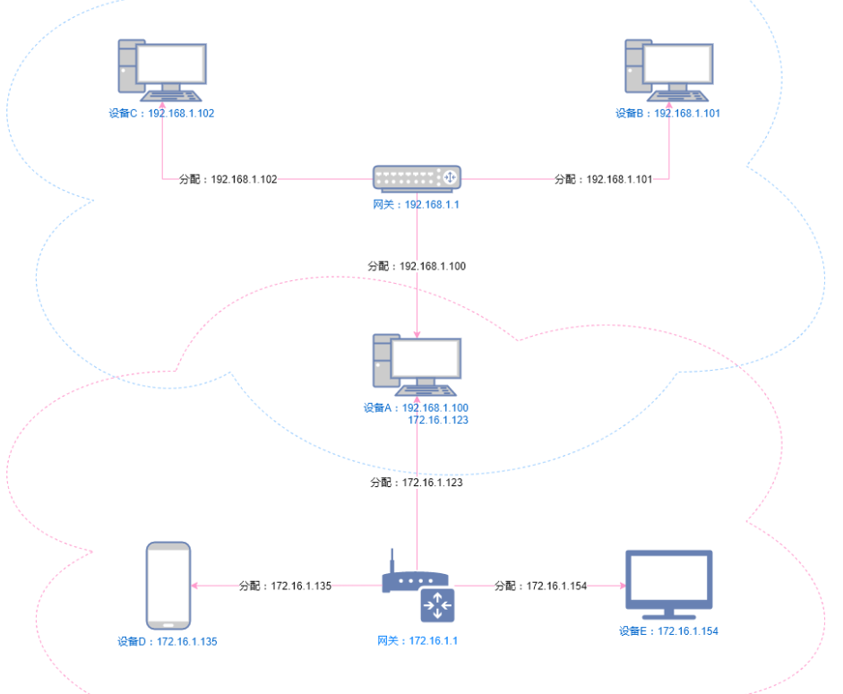
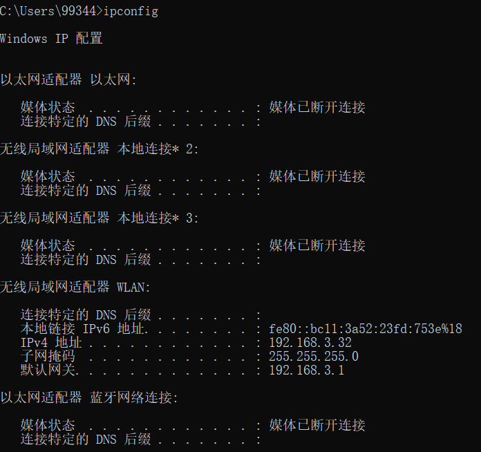
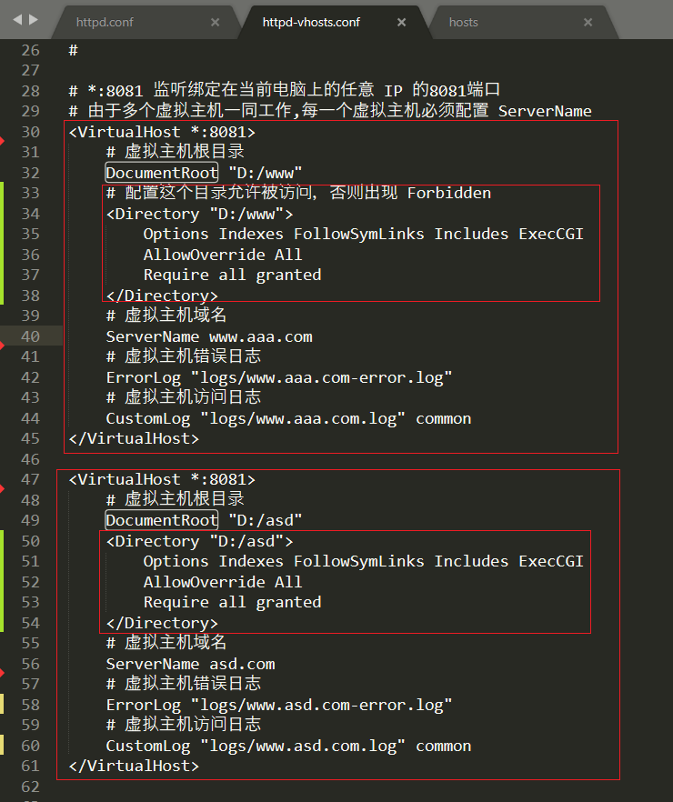
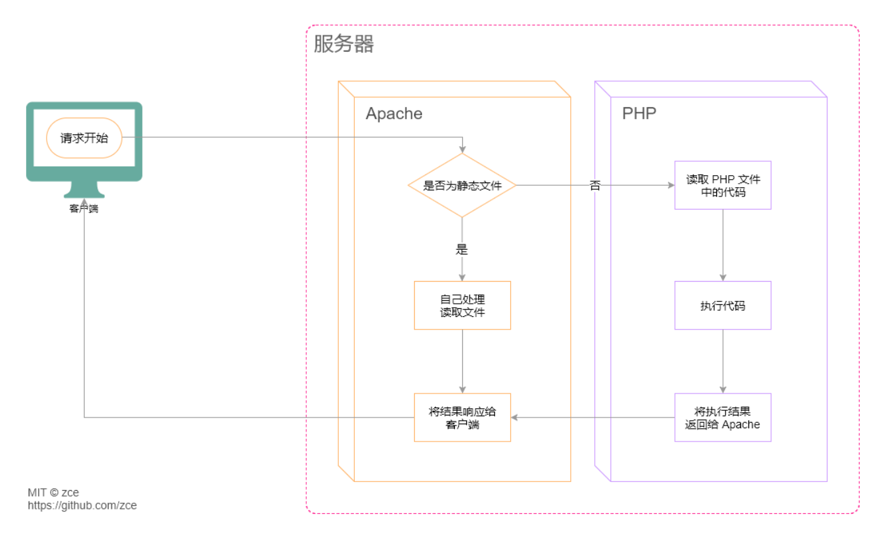

# 服务端开发基础

## 搭建Web服务器

### Web服务器软件

- Nginx -> 反向代理

- Apache -> PHP

- IIS -> ASP.NET

- Tomcat -> Java

Apache并不是只能跑PHP,也可以跑java, .net

### 安装Web服务器软件

常用的Web服务器软件: Apache HTTP Server

- 服务器

服务器就是指安装特定的软件的公共计算机, 用于专门用于提供特定的服务.


GUI

图形用户界面 Graphical User Interface

## IP地址与防火墙介绍

### IP地址的单网络与多网络情况

如果电脑没有连接任何网络的情况下, 电脑会有本地回环地址127.0.0.1

- 单个网络情况


- 多个网络情况

> 谁发出的热点谁就是网关

> 当电脑的网线和wifi同时连接网络并且分别是两个网关, 那么想要拿其他电脑或手机访问该电脑服务器的话, 就需要判断连接的是哪个网关, 每个网关对应的ip地址不一样.
>
> 比如下图,设备C想访问A服务器的内容, 访问的IP地址为192.168.1.100
>
> 设备D想访问A服务器的内容, 访问的IP地址为172.16.1.123



> 电脑同时连接一个路由器的wifi和网线


> 电脑只连接wifi的情况



> 电脑网线连接路由器,wifi连接的是手机发出的热点


### 防火墙


> 右键禁用规则别人就不可以访问本机的Apache服务器了


## 域名

给IP地址起别名，需要花钱注册

- 修改Apache本地主机的访问名字


## DNS

通过宽带运营商提供的服务器解析一个域名背后对应的 IP，这个过程叫做 DNS 寻址，帮你完成 DNS 寻址过程的服务器叫做 DNS 服务器。 

### hosts文件

操作系统在发起DNS服务器的查询请求之前, 会优先检查本机的hosts文件. 如果这个文件中包含了对当前需要解析的域名的配置, 则不再发起对DNS服务器的请求,直接使用hosts文件中的配置.


如果是浏览器发起DNS服务器请求时，会先找浏览器DNS缓存->操作系统DNS缓存->hosts文件->DNS服务器

**DNS缓存清理：**

- chrome清理DNS缓存：`<chrome://net-internals/#dns>`


- 清理windows电脑DNS缓存：命令行窗口`config \flushdns`


**hosts文件所在路径:**

- Windows: `C:\Windows\System32\drivers\etc\hosts`
- macOS: `/etc/hosts`

**注意:**

- 本机的hosts文件配置只能影响到本机的DNS寻址
- 只有以管理员权限运行得编辑器才有权利修改hosts文件

- 以管理员运行得编辑器此时是管理员权限，不能拖拽编辑普通的文件。用普通用户权限打开编辑器，才能拖拽编辑普通的文件。

**生活例子:**

> 每个宿舍都有一个路由器, 每个宿舍的路由器可能会集中到一个楼的总交换机, 每个楼和每个楼的交换机又会汇总到移动,联通等总的交换机上.总的交换机是有一个公网IP, 虽然自己的电脑是从公网IP架设出来的,但是访问公网IP是不会访问到自己的电脑上的.需要制定自己的IP.
>
> 移动,联通等总网关默认把80端口屏蔽了, 因为怕用户会通过总网关IP做服务器, 那样是找不到具体的人的.
>
> 阿里云服务器, 腾讯云服务器, 这些云服务器都是实名制的.


## 端口

每台计算机只有65536个端口(0-65535)

> `netstat -an`命令行监听本机端口的使用情况
>
> `http`默认端口80
>
> `https`默认端口443

## URL

Uniform Resource Locator 统一资源定位符


例如：https://zce.me:80/schools/students?id=18&name=zce#photo 

## 请求响应流程


1. 用户打开浏览器
2. 地址栏输入我们需要访问的网站网址(URL)
3. 浏览器通过DNS服务器获取即将访问的网站IP地址
4. 浏览器发起一个对这个IP的请求
5. 服务端接收到这个请求，进行响应的处理
6. 服务端将处理完的结果返回给客户端浏览器
7. 浏览器将服务端返回的结果呈现到界面上

## 配置Apache

> 配置文档：http://httpd.apache.org/docs/current/
> 配置文件中行首的 # 指的是注释
> 注意：以下所记录的行号仅供参考，不同版本的配置文件可能不尽相同。 

### 监听端口

监听端口可以随意修改为任意一个未被其他程序监听的端口，可以通过设置配置文件`httpd.conf`中的`Listen`指令后面的数字修改。


### 网站根目录

> 网站根目录: 就是存放我们网站文件的最顶层目录，通常 URL 中域名后面的第一个斜线对应（映射）的就是网站根目录。
> 默认文档: 指的是我们在访问某一个目录时（没有指定具体的文件），默认访问的文件叫做默认文档
> 注：动态网站情况会比较特殊，需要单独考虑，不一定是这个规则。

默认 Apache 的网站根目录是安装目录中的`htdocs`文件夹，为了方便对网站文件的管理，一般我们会将其设置在一个自定义目录中（如果你不介意其实不修改也无所谓）。

如果需要设置网站根目录，可以通过修改Apache配置文件`httpd.conf`中的网站根目录选项切换。


> 默认不允许在磁盘根目录设置网站根目录 因为会访问到所有文件


> 可以在该地方进一步设置某个根目录可以访问


### 默认文档
> 当客户端访问的是一个目录而不是具体文件时，服务端默认返回这个目录下的某个文档（文件），这个文档就称之为默认文档, 一般是index.html

配置文件`httpd.conf`的 280 行的`DirectoryIndex`，默认文档可以配置多个（有前到后依次去找，找到为止，如果没找到任何一个则启用目录浏览） 


> 如果没有默认文档, 但是也不想让看到文档目录,可以把下图的`Indexes`删除, 就不会显示目录文档


> 目录文档


> 关闭目录文档 `Indexes`删除


### 虚拟主机

#### 配置虚拟主机

​	如果一台机器上只有一个网站的话，没有任何问题，但是如果想要在一台机器上部署多个站点，就必须通过配置虚拟主机的方式解决。


​	对于Apache而言，主机有两类：不能同时使用，如果要定义虚拟主机，那么必须为现存的主机也创建一个`<VirtualHost>`

1. 中心主机（MainHost）未配置虚拟主机时
2. 虚拟主机（Vhost）如果配置了中心主机，同时也想配置虚拟主机，那么把中心主机也配置虚拟主机

- 取消中心主机
  - 如果想在现有的web服务器上增加虚拟主机，你必须也为现存的主机建造一个`<VirtualHost>`定义块。这个虚拟主机中`ServerName`和`DocumentRoot`所包含的内容应该与全局的`ServerName`和`DocumentRoot`保持一致。还要把这个虚拟主机放在配置文件的最前面，来让它扮演默认主机的角色。
  - 如果不想使用中心主机，直接在`httpd.conf`配置文件中注释掉中心主机的DocumentRoot即可。

  

- 虚拟主机的配置文件

  ​	可以直接在主配置文件`httpd.conf`中直接配置,但是这样不利于维护,建议在`apache\conf\extra\httpd-vhosts.conf`建立配置文件。前提是在`httpd.conf`中配置了`Include conf/extra/httpd-vhosts.conf`

  ​	我们通过`<VirtualHost>`指令来定义虚拟主机，`ServerName`和`DocumentRoot`是一个虚拟主机最基本的两个配置，其他可以在中心主机配置的指令，基本都可以应用于虚拟主机。

  ```bash
  <VirtualHost IP:PORT>
      ServerName
      DocumentRoot "/path/to/"
  </VirutalHost>
  ```

#### 基于域名的虚拟主机

> ​	由于后期对虚拟主机的配置操作非常常见，所以我们一般将虚拟主机的配置单独放到一个配置文件中，然后在主配置文件中引入，避免破坏主配置文件中的其他配置。
>
> `Include conf/extra/httpd-vhosts.conf` 配置的作用就将另外一个配置文件引入（使其生效）

​	具体的操作方式就是在主配置文件 httpd.conf 的 505 行取消注释：


​	然后找到 Apache 的虚拟主机配置文件，添加一个如下的虚拟主机配置节点，然后重新启动 Apache。

> 文件路径`apache\conf\extra\httpd-vhosts.conf`
>
> 这个文件中有两个默认的示例配置，可以注释掉使用


	如果真的要使用`www.aaa.com`这个域名的话，就只能通过修改 hosts 文件达到目的，原因很简单：这个域名不是我们自己的，我们没有办法修改这个域名在公网上的 DNS。
**注意：**

- 如果使用了虚拟主机，则默认必须全部使用虚拟主机，即之前的默认网站也必须通过虚拟主机方式配置，否则访问不到。参考：http://skypegnu1.blog.51cto.com/8991766/1532454

- 如果虚拟主机的端口使用的不是 80 ，则需要在主配置文件中添加一个对这个端口的监听：

  

如果出现了`Forbidden`

  

> 需要手动设置具体的目录，在路径`apache\conf\extra`的`httpd-vhosts.conf`文件设置：添加一个Directory节点解决



​	当一个请求到达的时候，服务器会先检查它是否使用了一个能和`NameVirtualHost`相匹配的IP地址。如果能够匹配，它就会查找每个与这个IP地址相对应的`<VirtualHost>`段，查看是否有与请求主机名相同的`ServerName`或者`ServerAlias`。如果找到了，就会使用这个虚拟主机。否则，将使用符合这个IP地址的第一个列出来的虚拟主机。

**注意**

`NameVirtualHost    *:80` apache2.2需要此指令启动基于域名的虚拟主机，apache2.4不需要

​	第一个列出的虚拟主机充当了`默认虚拟主机`的角色。当一个IP地址与`NnmeVirtualHost`指令中的配置相符的时候，`主服务器`中的`DocumentRoot`将**永远不会**被用到。所以，如果想创建一段特殊的配置用于处理不对应任何一个虚拟主机的话，需要自己写一个虚拟主机，放到配置文件的最前面即可。

> 把一个父文件允许被访问，下面的每个子文件都是一个虚拟主机，就不用每个虚拟主机都加文件被访问的配置了

```
# 配置这个目录允许被访问，否则出现 Forbidden
<Directory "D:/www">
    Options Indexes FollowSymLinks Includes ExecCGI
    AllowOverride All
    Require all granted
</Directory>
<VirtualHost *:8081>
    # 虚拟主机根目录
    DocumentRoot "D:/www/aaa"
    # 虚拟主机域名
    ServerName www.aaa.com
    # 虚拟主机错误日志
    ErrorLog "logs/www.aaa.com-error.log"
    # 虚拟主机访问日志
    CustomLog "logs/www.aaa.com.log" common
</VirtualHost>

<VirtualHost *:8081>
    # 虚拟主机根目录
    DocumentRoot "D:/www/asd"
    # 虚拟主机域名
    ServerName asd.com
    ServerAlias bbbb.com
    # 虚拟主机错误日志
    ErrorLog "logs/www.asd.com-error.log"
    # 虚拟主机访问日志
    CustomLog "logs/www.asd.com.log" common
</VirtualHost>
```


## 静态网站与动态网站

​	至此，我们已经可以把这些静态页面放到服务器上了，客户端也可以通过域名请求这个网站，但是对于我们来说，Apache 能够完成的事情过于简单，无外乎就是找到你请求对应的文件 → 读取文件 → 将文件内容响应给客户端浏览器（**文件原封不动的给你**）。**无法满足让网页内容动起来（随着数据动态变化）的需求。**
​	于是乎，就有人提出了**服务端动态网页的概念**，这种实现这种概念的技术有很多种：JSP、ASP.NET、PHP、Node等等。
​	这些技术的原理就是：不再将 HTML 固定写死，每次用户请求时，动态执行一段代码，临时生成一个用户想要的HTML 页面。

	**动态网站指的也就是每次请求时服务端动态生成 HTML 返回给用户的这种网站。**

### 配置 PHP 支持

> PHP 文件的扩展名就是 .php

​	我们可以尝试在刚刚配置的网站中添加一个扩展名为 php 的文件，然后到浏览器中访问它。


```php
<!‐‐ demo.php ‐‐>
<?php echo 'Hello PHP'; ?>
```

​	结果出乎意料，并没有显示我们想要的 Hello PHP ，而是将我们的代码原封不动的返回给浏览器了。

​	原因很简单：Apache 只能处理静态文件请求，对于后缀名为 `.php` 这种动态文件，它无法执行，所以就当成是一个静态文件直接返回了。

**解决方法：**

- 在服务器上安装 PHP
  - 解压 php 到纯英文路径目录中

- 在 Apache 中添加支持 PHP 的配置

  - 在 Apache 添加 PHP 处理模块

    ```bash
    # php support
    # 这个模块不是根据后缀判断是否该PHP工作，根据 MiME Type 是不是 application/x-httpd-php来决定PHP工作
    LoadModule php7_module [php7apache2_4.dll的路径]
    ```

  - 在` <IfModule mime_module> `节点中添加 .php 扩展名解析支持

    ```
    # parse .php files
    AddType application/x-httpd-php .php
    ```

  - 默认文档配置节点 `<IfModule dir_module>` 中添加`index.php`

    > 默认文档指的是在访问一个目录而不是具体文件名时，默认执行的文件名

    ```
    <IfModule dir_module>
    	DirectoryIndex index.html index.php
    </IfModule>
    ```

    

- 重启Apache

### Apache与PHP

> php与apache是apache服务器找到php的配置，可以解析php文件

> php也可以和tomcat服务器搭配

> Apache是根据文件的扩展名找到文件的类型，然后挨个查看每一个模块能够处理这个类型的文件，如果这些模块都不能处理，那么Apache就自己处理（按照静态文件的方式处理）



# PHP

## 起步

### PHP标记

- `<?php`可以让代码进入“php模式”
- `?>`可以让代码退出“php模式”

#### 省略结束标记

> 如果这个PHP文件只是写PHP，不会产生混编情况，这时删除结束标记，避免额外产生空格。

```php
<?php
$message = 'hello';
echo $message;


```


```php
<?php
$message = 'hello';
echo $message;
?>
    
    
    
```


### 输出内容方式

- echo

```php
<?php
    // echo 是 PHP 中一个特殊的“指令”
    // 不一定需要像函数那样通过`()`去使用
    // 注意：echo 后面紧跟着一个空格
	echo 'hello php';
	//=> hello php
	echo 'hello','world';
	//=> `helloworld`
```

- print

```php
<?php
    // print 与 echo 唯一区别就是只能有一个参数
    print 'hello php';
	// print 'hello', 'world';
	//=> Parse error: syntax error...
```

- var_dump

```php
<?php
    // var_dump 是一个函数，必须跟上（）调用
    // 可以将数据以及数据的类型打印为特定格式
    var_dump('hello php');
	//=> 'string(9) "hello php"'
```

### 与HTML混编

- 普通嵌入

```php
<p><?php echo 'hello'; ?></p>
```

- 语句混编

```php
<?php if ($age >= 18) { ?>
    <p>成年人</p>
<?php } esle { ?>
    <p>小朋友</p>
<?php } ?>
```

更常见的用法（指令式的语句）：

```php
<?php if ($age > 18): ?>
    <p>成年人</p>
<?php else: ?>
    <p>小朋友</p>
<?php endif ?>
```

### 注释

两种方式（与javascript相同）：

- 单行注释

```php
<?php
    // 这是一条单行注释
    # 井号也可以做注释（不要用，有点生僻）
$foo = 'hello';
```

- 多行注释

```php
<?php
/*
......
这里可以添加任意行数的注释内容
......
*/
$foo = 'hello';
```

