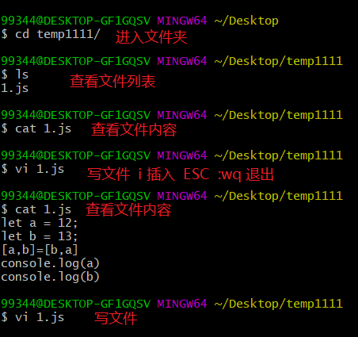
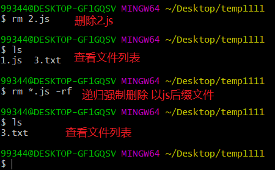
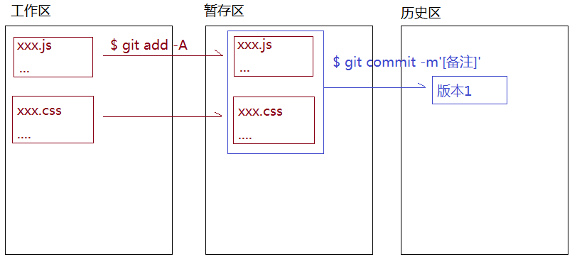
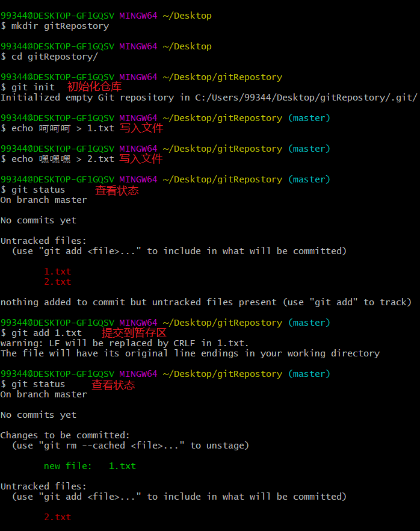
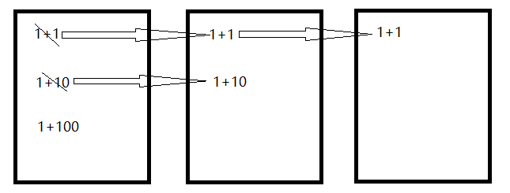
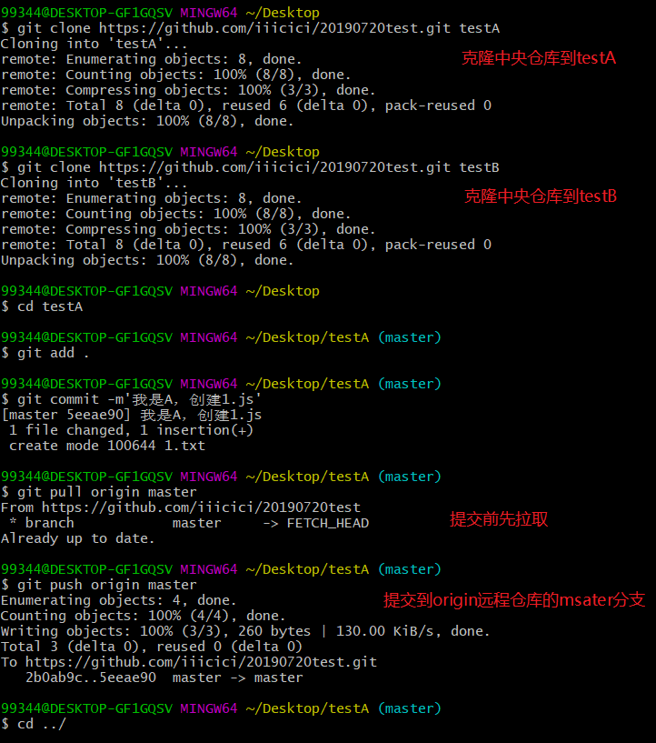
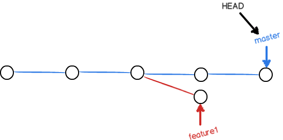

# GIT

## 集中式对比分布式

GIT：分布式版本控制系统

版本控制系统：开发中我们把每一次的修改都有效的进行记录（记录成一个版本），后期如果需要回退到原有的某个版本或者是用当前的和某一个版本进行比较等，都可以有效的进行管理。
常用的版本控制系统：SVN（集中式） / GIT（分布式）

- 分布式版本管理系统的特点
  所谓分布式，就是每一个开发者的本地客户端都是一个完整的仓库，都能记录历史版本信息，这样不需要联网，我们也能生成历史版本记录，也可以快速回退到某个版本
  单人开发：根本不需要中央服务器，不需要联网，在自己的电脑上就可以保留历史版本。
  多人开发：如果没有中央服务器，只是不能团队协作，但是可以生成历史版本
  

- 集中式版本管理系统的特点
  所有的历史版本都是再中央服务器上建立的，本地客户端只是一个开发的环境，开发完需要推到服务器上生成历史版本，需要回退到某个版本，也需要从中央服务器拉取。=>“必须连接上中央服务器才可以” **必须联网**

  不论是单人开发还是多人开发，都不能脱离中央服务器。
  限制情景：例如上传到中央服务器上，自己出差在飞机上，老板说代码有问题需要改，但是自己电脑上的代码是最新版，不是上一个版本，没有办法回退到上一个版本，必须联网（哪怕是局域网）回退到上一个版本才可以继续工作，限制了工作的继续。

  

- GIT和SVN的区别
  **本质区别**：GIT有本地仓库，是可以保留历史版本的，有中央服务器可以协作开发。而SVN只有中央服务器，中央服务器必须联网才能推送历史记录，并且进行协作开发。
  GIT是按照源数据（文件流）来实现文件传输的，而SVN是按照文件传输的，所以GIT比SVN传输速度更快。

- Linux团队开发的git，所以git中的命令大部分都是linux命令

## 常用的LINUX命令

WINDOWS操作系统：DOS窗口和DOS命令

LINUX服务器操作系统：LINUX命令（MAC）

```
ls -l/-a：查看当前目录结构（-a是可以看见所有的：包含隐藏的）
cd xxx[路径地址]：进入到执行的文件夹中（进入的路径地址，可以粘贴或者拖文件）
	cd /：根目录
	cd ./：当前目录
	cd ../：上级目录
clear：清屏
mkdir：创建文件夹
touch：创建空的文件
vi：向文件中插入或者管理一些内容
	i：进入到插入模式
	ESC + :WQ  退出内容的插入，把刚才编辑的内容进行保存
echo xxx > xxx.txt 或者 echo xxx >> xxx.txt：向指定的文件中输入内容，把前面的内容插入到后面的文件中（覆盖性），如果没有这个文件会创建文件写入内容
cat：查看文件中的内容
cp：拷贝
rm：删除文件 -r（递归删除）-f（强制删除，一旦删除无法还原）-rf（既有递归又有强制删除）
```






## 基础工作流程

GIT的常规流程：

- 每一个GIT仓库都有三个区

  - 工作区：写代码
    `$git add -A/.`把当前工作区修改的内容全部提交到暂存区（可以指定具体提交的文件`$git add xxx.js`）
  - 暂存区：临时存放每一次修改的代码，但是并没有生成历史版本
    `$git commit -m[备注]`把暂存区的内容提交到历史区，生成一个历史版本（我们需要写备注信息，声明当前版本的特点）
  - 历史区：生成最终版，有版本号

  

- 创建GIT仓库：`$git init`
- 每一次区域间信息的提交都不会删除原有区域的内容，这样保证，下一次提交，只是把区域对比出来不一样的内容提交，而不是所有。
- `$git status`：查看当前修改的文件处于哪一个区域。红色：工作区；绿色：暂存区；看不见：已经提交到历史区，三区保持一致了
- `$git rm --cached xxx.xx`：把暂存区的某一个文件删除（提交到暂存区的内容不好，我们可以删除）
- `$git rm --cached . -r`：删除暂存区中所有提交的



`.git`文件夹是关键，里面存放暂存区和历史区的文件


- `$git checkout xxx.xx`**场景**：提交到暂存区一份，把工作区内容改了，但是改的东西不好，想把暂存区上次提交的内容撤回到工作区（覆盖工作区新写的内容）
  暂存区内容没有消失，只是把工作区最新修改的信息给覆盖了，让工作区和暂存区保持一致


- `$git diff`：工作区vs暂存区代码区别
- `$git diff master`：工作区vs历史区master分支代码区别
- `$git diff --cached`：暂存区vs历史区代码区别

## 一些细节问题

- 如果是第一次使用git，生成历史版本的时候，需要提供身份认证
  - `$git config l`：查看所有配置信息
  - `$git config --global user.name 'xxx'`：添加user.name
  - `$git config --global user.email 'xxx'`：添加user.email

- 真实项目中，并不是所有的文件都和项目有关系（例如：.idea是webStorm生成的配置文件夹和项目没关系），也不是所有的文件都提交（例如：node_modules中的内容太大了，也不需要提交）
  `.gitignore`GIT提交的忽略文件

  ```
  # dependencies
  /node_modules
  
  # testing
  /coverage
  
  # production
  /build
  
  # misc
  .DS_Store
  .env.local
  .env.development.local
  .env.test.local
  .env.production.local
  
  npm-debug.log*
  yarn-debug.log*
  yarn-error.log*
  
  .idea
  ```

- `$git log`查看历史版本信息，如果信息太长，按Q结束

## 关于GIT的回滚

### 暂存区回滚到工作区

- `$git checkout -- [file]`：把暂存区上次提交的[file]文件回滚到工作区的[file]文件
  有两种情况：
  一种是[file]文件自修改后还没有放到暂存区，现在，撤销修改就回滚到暂存区上次提交的[file]文件；
  一种是[file]文件已经添加到暂存区，又做了修改，现在，撤销修改就回滚到暂存区上次提交的[file]文件。
  总之，就是让[file]文件回到最近一次`$git commit`和`$git add`时的状态。
  命令中的`--`很重要，如果没有`--`，就变成了“切换到另一个分支”的命令。
  **场景**：当你乱改了工作区某个文件的内容，想直接丢弃工作区的修改时。
- `$git checkout .`：把暂存区内容回滚到工作区（一旦回滚，工作区内容无法恢复）

### 暂存区回滚

- `$git reset HEAD [file]`：可以把暂存区的修改撤销回滚到上一个暂存区
  `$git reset`命令既可以回退版本，也可以把暂存区的修改回滚到上一个暂存区。当我们用`HEAD`时，表示最新的版本。
  **场景**：当你不但改乱了工作区中[file]文件的内容，还添加到了暂存区，想丢弃修改，分两步，第一步用命令`$git reset HEAD [file]`回滚到上一个暂存区；此时就回到了上一个场景，`$git checkout -- [file]`命令再撤销工作区的修改。

- `$git reset HEAD .`：把当前暂存区的内容回滚到上一个暂存区，目的是把上一个暂存区内容回滚到工作区。
  

**下图场景**：（**第一步可以不做**：此时工作区已经变成1+100，想要回滚到1+1，先把工作区使用`$git checkout .`命令把工作区内容撤销到最近一次`$git commit`和`$git add`时的状态，）执行`$git reset HEAD .`命令把当前暂存区的内容1+10回滚到上一个暂存区的1+1；再执行`$git checkout .`，把当前暂存区的所有内容回滚到工作区，此时工作区的内容就撤销到了1+1。



### 历史区回滚到工作区和暂存区

- `$git reset --hard HEAD^`：把上一个历史区回滚到暂存区和工作区（强制把暂存区和工作区都变成回滚后的版本）
  在GIT中，用`HEAD`表示当前版本，上一个版本就是`HEAD^`，上上一个版本就是`HEAD^^`，往上100个版本写100个`^`容易数不过来，所以写成`HEAD~100`
**场景**：已经提交了不合适的修改到版本库时，就要用到该命令。不过前提是没有推送到远程库。
  
- `$git reset --hard [版本号]`：回退版本之后，之前最新的版本已经看不到了，但是如果知道那个版本号就可以指定版本号穿梭。
  如果回退版本之前的窗口有`$git log`操作并且没关闭，可以看到版本号。
    `$git reflog`记录了自己每一次的命令，知道了版本号之后，又可以乘坐时光机回到未来了。
  
  
    [版本号]版本号没必要写全，前几位就可以了，Git会自动去找。当然也不能只写前一两位，因为Git可能会找到多个版本号，就无法确定是哪一个了。

- `$history > xxx.txt`把历史操作步骤输出

## 关于GIT的删除

在GIT中，删除也是一个修改操作，新建一个[file]文件，并且添加到暂存区和历史区。

把没用的[file]文件删除：直接在文件管理器删除或者用`rm [file]`命令删除。

此时，GIT知道删除了文件，`$git status`命令可以看到。

现在又两种情况：

- 确实要从版本库中删除该文件，就用`$git rm [file]`删除掉，并且`$git commit`。现在，[file]文件就从版本库中删除了。
- 另一种情况是删错了，想要恢复，因为版本库中存在。
  - 如果用的`rm`删除文件，可以直接使用`$git checkout -- [file]`命令把误删的文件恢复到最新版本。
  - 如果用的`$git rm [file]`删除文件，相当于把工作区删除了，删除之后还提交到了暂存区；此时需要先`$git reset HEAD [file]`把暂存区回滚到上一个暂存区，然后再`$git checkout -- [file]`把工作区的修改撤销。
    
  - 但是，只能恢复文件到最新版本，会丢失最近一次提交后你修改的内容。

**注意**：从来没有被添加到版本库就被删除的文件，是无法恢复的。

## 团队协作开发的基础流程

### 基础流程操作


1. 首先创建中央仓库：可以基于gitHub/codding来创建（**最好不要创建空仓库，因为空仓库中没有任何分支，只有提交一次历史信息才会生成master分支**）
   把开发者都列入仓库的开发群组中，这样每一个开发者用自己的gitHub账号，都有权限操作这个仓库了（当然不这样做也可以，所有开发者用统一的一个账号也可以，为了防止不知道是谁提交的，我们需要让每一个客户端在本地的GIT全局配置中，设置和gitHub相同的用户名和邮箱`git config --global user.name 'xxx'`）
   
   会收到一封邮件，接受邀请

2. 创建客户端本地仓库（一个开发者就是一个单独仓库），还需要让本地的仓库和远程仓库保持关联，这样才可以实现后续的信息同步

   - 一般的方式
     `$git init`创建本地仓库
     `$git remote add [远程地址名(默认origin)] [远程仓库GIT地址]`让本地仓库和远程仓库保持连接
     `$git remote -v`查看连接（origin是连接的名称，一般都用这个名字，当然自己可以随便设置）

     

     显示了可以抓取和推送的origin的地址。如果没有推送权限，就看不到push的地址。
     `$git remote rm origin`移出本地仓库和远程仓库的链接
     `$git remote update origin`更新链接通道
     
     增加了一个名为aaa的远程仓库
     

   - 更简单的方式：只要把远程仓库克隆到本地，就相当于创建本地仓库，并且自动建立了链接，并且把远程仓库中的内容也同步到了本地

     `$git clone [远程仓库地址] [本地仓库文件夹名字]（不写默认是仓库名字）`
     这一步操作相当于上面的三步：创建文件夹之后`$git init`；`$git remote add [远程地址名(默认origin)] [远程仓库git地址]`；`$git pull [git地址名] master`

     

3. 各自和中央服务器同步信息

   **任何一个中央仓库在刚创建时是没有分支的，第一次pull是拉取不了的，第一次push才会创建msater分支**：

   `$git push -u origin master`：由于远程库是空的，我们第一次推送master分支时，加上了`-u`参数，GIT不但会把本地的master分支内容推送到远程新的master分支，还会把本地的master分支和远程的master分支关联起来，在以后的推送或者拉取时就可以简化命令。
   `$git push origin master`：把本地仓库master中的信息同步到远程仓库master中，**需要使用gitHub的用户密码来进行权限校验**：一般都是组长在远程仓库中把 组员的账号都放到一个小组中 ，这样组员用自己的账号也有权限操作仓库了，最好在本地的GIT配置中把用户名和邮箱修改为和gitHub账号相同的信息
   （每一次PUSH之前最好都pull一下：如果有冲突在本地处理一下冲突，然后再推送。）
   `$git pull origin master`：把远程仓库master中的信息同步到本地仓库master中
   使用**空**中央仓库，A push之后，B pull不下来的原因是A提交了自己的master分支，中央仓库中的master是A的，B指定origin master时，中央仓库中的master是A的，并不是中央仓库的

   
   下面不是空中央仓库的流程：

   
   

### SSH警告

ssh比https速度快，前提是需要在GitHub的个人设置`SSH and GPG keys`或者指定一个仓库的`Deploy keys`绑定本地电脑的SSH key，才可以使用ssh方式与GitHub传输。

GitHub账户的`SSH keys`，相当于这个账号最高级 key，只要这个账号有的权限（任何项目），都可以操作 。

仓库的`Deploy keys`，是这个仓库专有的key，用这个key，只能操作这个项目，其他项目都没有权限。

https url是有效网址可以直接打开，但是用户每次通过git提交的时候都需要输入用户名和密码。ssh url配置一次之后就能永久使用。GitHub配置ssh  key的目的是为了git提交代码的时候，不需要繁琐的验证过程，简化操作步骤。

当第一次使用Git的`clone`或者`push`命令连接GitHub时，会得到一个警告：


这是因为Git使用SSH连接，而SSH连接在第一次验证GitHub服务器的Key时，需要你确认GitHub的Key的指纹信息是否真的来自GitHub的服务器，输入`yes`回车即可。

Git会输出一个警告，告诉你已经把GitHub的Key添加到本机的一个信任列表里了：

这个警告只会出现一次，后面的操作就不会有任何警告了。

```
Warning: Permanently added 'github.com' (RSA) to the list of known hosts.
```


再次克隆提示需要把`id_rsa.pub`文件中的key粘贴到新建一个Keys的Key中，title随便起。


需要新建一个keys


如果id_rsa、id_rsa.pub两个文件已存在出现该错误可删除俩个文件，重新执行

`ssh-keygen -t rsa -C "993445491@qq.com"`：.shh文件夹会重新生成id_rsa、id_rsa.pub两个文件及新的Key

重新执行上述步骤添加到GitHub中即可

如果实在担心有人冒充GitHub服务器，输入`yes`前可以对照[GitHub的RSA Key的指纹信息](https://help.github.com/articles/what-are-github-s-ssh-key-fingerprints/)是否与SSH连接给出的一致。

## 分支处理和团队协作

### 无分支管理模式

所有人使用的都是master分支，每次提交代码的时候，第一件事情就是先拉取。

`$git pull origin master`

冲突合并：

- 文件有冲突，不是同一个文件

- 同一个文件，不是同一行代码冲突：在进入到编辑框模式中
  i->ESC->:wq->按下enter键

  自己会把两份代码都保存在本地文件中 ，自己手动去选择要哪一个，改完后重新提交即可

- 同一个文件，同一行代码冲突：如图所示，尝试合并失败，我们需要手动把代码进行合并，然后重新提交
  

### 单独分支管理模式

分支指的是历史区的分支：创建分支就是创建不同的线路，来管理历史版本


1. 开发第一件事是把远程仓库master内容拉取到本地仓库master上（提交之前也是），每个人在自己本地仓库中，先进行分支创建和切换
   `$git branch`：查看当前存在的分支

   `*  master`：星代表当前在哪个分支上
   `$git branch dev`：创建一个叫做dev的分支（**新创建分支完成，会把本地的master分支中的内容同步到本地dev分支上**）
   `$git checkout dev`：切换到dev分支上
   `$git checkout -b dev`：创建并且切换到这个分支上

2. 正常的开发和提交，但是所有的操作都是在自己的分支上

3. 是否需要“储藏”文件
   `$git stash`“储藏”文件（分支有更改，不能直接切换分支，需要把修改的内容暂存）**情景**：下班了这个模块还没完成，不想提交生成一个历史版本，因为commit之后才可以切换分支，所以需要把修改的内容暂存起来，才可以切换分支

      `$git stash list`：可以查看“储藏”列表
      有两种方法恢复：

      - `$git stash apply`：恢复后，stash列表内容不删除，需要用`$git stash drop`删除
        可以多次stash，恢复的时候，`$git stash apply stash@{0}`可以恢复指定的stash。
   - `$git stash pop`：恢复的同时把stash内容也删除了
   
   `$git checkout master`先切换到master分支上
   
4. 把自己本地分支中的内容，合并到自己本地master分支上

   如果dev和master分支分别对同一个文件做了修改，master分支和dev分支各自都有了新的提交，变成了这样
   
   这种情况下，Git无法执行“快速合并”，只能把各自的修改合并起来。

   `$git merge dev`把dev分支合并到master分支上（有冲突按照之前的规则修改）
   
   冲突合并后：

   ```
   111111
   222222
   444
   333
   <<<<<<< HEAD
   555
   =======
   666
   >>>>>>> dev
   ```

   修改好之后再次`$git add` `$git commit`，此时就变成了这样：

   
   `$git log --graph`可以看到分支合并图
   

5. 是否需要还原“储藏”文件
   `$git stash pop`：还原暂时存储的内容，同时把stash list内容也删除了

6. 删除本地创建的分支（貌似不用删除dev分支提交到远程仓库，远程仓库中也不会出现dev分支）

   - 下一次重新创建分支的时候可以让分支和master统一，因为合并解决冲突之后，master分支是最新解决冲突合并之后的，而dev分支并没有解决冲突，已经没有保留dev分支的必要了。
   - 远程仓库中不记录任何的分支信息，防止冲突
     `$git branch -D dev`删除dev分支（删除的时候需要先切换到其他分支才可以删除）

7. 将本地master分支中的内容提交到远程仓库中

### 多人协作

当从远程仓库克隆时，实际上Git自动把本地的master分支和远程的master分支对应起来了，并且，远程仓库的默认名称是`origin`

## gitHub的应用

- 常规操作：注册、登录、修改信息、创建仓库等
- 查看历史提交记录
- 提交问题
- 发送pull push
- 基于gitHub发布静态资源网站
  - 基于master分支发布
  - 基于gh-pages分支发布
- GUI：配置WB的VCS

