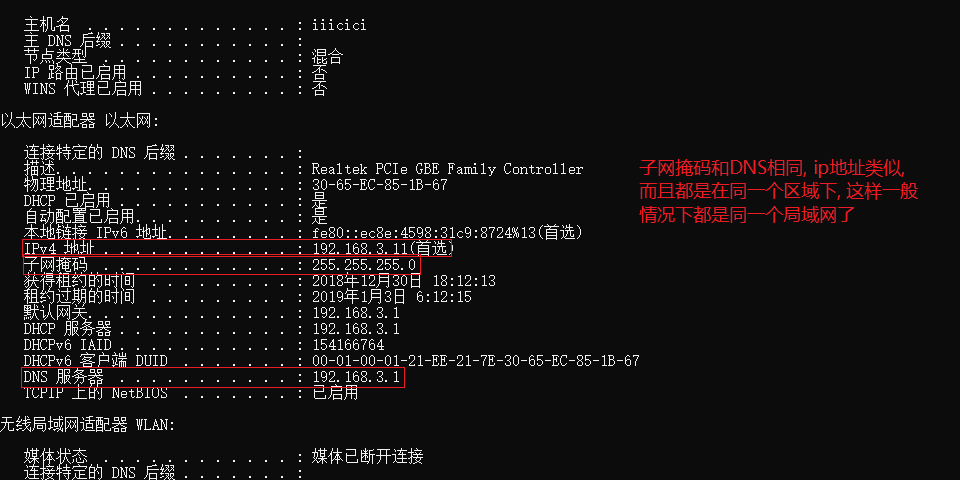
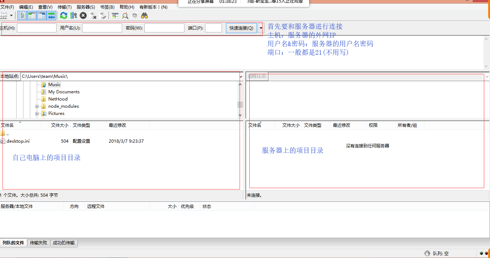
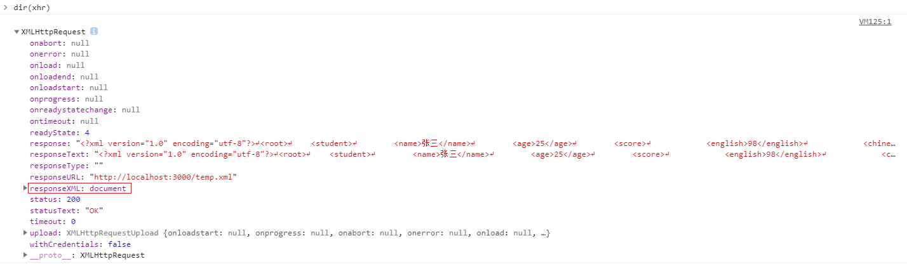
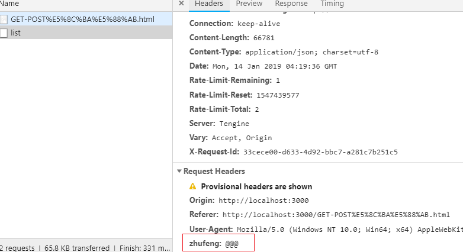

# AJAX

## 职业规划(技术分享)

- 职业规划的建议

> **开放分享**
> 1. 写一个属于自己的博客
> 	把自己的学习笔记以及到其他文章中去学习借鉴的, 然后把文章和学习感想发表出来...
> 2. 经常参加圈内的技术交流分享
> 3. 打造自己的自媒体
- 搭建自己的博客
> 1. 可以基于第三方平台搭建(新浪博客, CSDN...)
> 2. 基于gitHub发布页面(HEXO)
> 3. 创建博客项目, 并且购买域名和服务器进行发布推广
> 
- 打造自己的博客网站
> 开发项目(项目代码在自己的本地)
> 项目开发
> 1. 需要一台自己的服务器(万网上购买,被阿里云收购了)
> 	购买 虚拟云服务器 / 独立主机 (虚拟云服务器是分成好多份, 一份卖一个, 独立主机是直接拥有一个自己的大服务器)
> 	购买服务器成功后会有一个外网的IP地址(外网IP: 任何用户通过这个IP地址都可以访问到你的服务器)
> 2. 需要买一个域名
> 	在万网购买
> 	尽量买.com/.cn...
> 3. 把域名进行DNS解析: 把域名和服务器关联在一起(解析的时候需要填写服务器的外网IP), 以后访问域名就相当于访问服务器
> 	DNS(Domain Name Syatem, 域名系统), 万维网上作为域名和IP地址相互映射的一个分布式数据库(域名解析成功会在DNS系统中记录一条信息 "www.xxx.com  xxx.xxx.xx.xxx"保证以后访问域名, 可以直接找到外网IP, 通过外网IP访问到服务器)
> 	还需要进行备案(合法)
> 4. 一台服务器可以发布很多项目, 服务器买回来还不算结束, 我们还需要在服务器上进行项目发布, 此时需要一些发布WEB站的工具: IIS(C# .Net 发布在WINDOWS SERVER系统), APACHE TOMCAT(PHP/JAVA... 发布在LINUX系统), NGINX(用的最多的)...
> 	指定当前域名访问服务器后, 到底执行的是哪一个项的源代码(让域名和服务器上的项目关联到一起)


- 内网IP(局域网) 

> 在一个区域内, 大家连接的是同一个网络(准确来说: 连接同一个wifi不一定是同一个网络, 连接不同的wifi也可能是相同的网络, 一切都看路由器交换机的配置), 这就是局域网.
>
> 
>
> 在同一个局域网下, 成员可以相互访问(你的电脑连接了A网络, 手机也连接了A网络, 那么手机可以访问电脑上的一些信息了, 这样可以做移动端开发的时候手机联调)
> HBuilder也提供了联调的功能(代码上加断点, 手机访问, 程序会走断点)
- 怎么把自己本地的代码上传到远程服务器

> 服务器上不允许安装除了开发需要的项目环境项以外的任何东西(保持服务器的干净)
> 我们一般都是基于FTP上传(有很多FTP上传的工具: FileZilla)




##客户端和服务器端交互模型
- 面试必问问题: 
> 打开一个浏览器, 在地址栏输入一个网址, 按下ENTER键, 到看到整页面, 中间都经理了哪些事情?

**HTTP请求阶段: 向服务器发送请求**
> 1. 浏览器首先向DNS域名解析服务器发送请求
> 2. DNS反解析: 根据浏览器请求地址中的域名, 到DNS服务器中找到对应的服务器外网IP地址
> 3. 通过找到的外网IP, 向对应的服务器发送请求(首先访问的是服务器的WEB站点管理工具: 准确来说是我们先基于工具在服务器上创建很多服务, 当有客户端访问的时候, 服务器会匹配出具体是请求哪个服务)
> 4. 通过URL地址中携带的端口号, 找到服务器上对应的服务, 以及服务所管理的项目源文件

**HTTP响应阶段: 服务器把客户端需要的内容准备好, 并且返回给客户端**

> 5. 服务器端根据请求地址中的路径名称, 问号传参或者哈希值, 把客户端需要的内容进行准备和处理
> 6. 把准备的内容响应给客户端(如果请求的是HTML或者CSS等这样的资源文件, 服务器返回的是资源文件中的源代码[不是文件本身])

**浏览器渲染阶段**
> 7. 客户端浏览器接收到服务器返回的源代码, 基于自己内部的渲染引擎(内核)开始进行页面的绘制和渲染
>   首先计算DOM结构, 生成DOM TREE
>   自上而下运行代码, 加载CSS等资源内容
>   根据获取的CSS生成带样式的RENDER TREE
>   开始渲染和绘制


- 我们把完整的 请求+响应 称之为"HTTP事物"
> 事务就是完整的一次操作, 请求和响应缺一不可

- 一个页面完全加载完成, 需要向服务器发起很多次HTTP事务操作
> 一般来说: 首先把HTML源代码拿回来, 加载HTML的时候, 遇到link/script/img[src]/iframe/video和audio[没有设置preload='none']...都会重新和服务器端建立HTTP事务交互
> **特殊情况**: 如果我们做了资源缓存处理(304), 而且即将加载的资源在之前已经加载过了, 这样的操作和传统的HTTP事务有所不一样, 他们是从服务器和浏览器的缓存中读取数据, 比传统的读取快很多

- HTTP报文
> 客户端向服务器发送请求, 以及服务器把内容响应给客户端的时候, 中间相互传递了很多内容(客户端把一些内容传递服务器, 服务器把一些内容响应给客户端), 我们把传递的内容统称为"HTTP报文"
## 一个完整的URL各部分分析

**下面拿网址展开知识**:`http://www.zhufengpeixun.cn:80/stu/index.html?name=xxx&age=25#teacher`

- URL/URN/URI

> URI=URN+URL
> URI: 统一资源标识符
> URL: 统一资源定位符
> URN: 统一资源名称


- 传输协议

> 用来传输客户端和服务器端交互的信息的
> HTTP: 超文本传输协议(除了传递普通的文本, 还可以传递文件流或者进制编码等信息), 是目前最常用的WEB传输协议
> HTTPS: 基于SSL(Secure Sockets Layer 安全套接层)加密的HTTP传输协议, 比HTTP更加的安全(涉及支付的网站一般都是基于HTTPS完成的)
> FTP: 文件传输协议, 一般用来实现资源文件在服务器上的上传下载
> (类似于快递, HTTPS安全类似邮政, HTTP类似普通的快递顺丰)

- 域名(Domain Name)

> 一级域名(顶级域名): www.qq.com
> 二级域名: sports.qq.com
> 三级域名: kbs.sports.qq.com
> .com 供商用的国际域名
> .cn 供商用的中文域名
> .net 用于网络供应服务商(系统类的经常使用NET域名)
> .org 用于官方组织
> .edu 用于教育元宵
> .gov 用于政府机构

- 端口号

> 用来区分同一台服务器上不同服务的标识(类似WEB服务管理器常见服务的时候可以指定), 不同服务之间一般是不能使用相同的端口号的
> HTTP 默认端口号80
> HTTPS 默认端口号443
> FTP 默认端口号21
> 如果当前网站服务, 采用的是协议对应的默认端口管理, 那么当用户输入网址的时候可以不指定端口号, 浏览器会默认对用户使用默认的端口传递给服务器

> 一台服务器上的端口号范围: 0~65535之间

> webStorm预览页面: webStorm把自己的电脑当做服务器, 在服务器上创建一个服务, 端口号是63342, 自己电脑上的浏览器预览自己电脑上的服务, 属于本机服务请求, 用localhost(127.0.0.1)本地域名即可

> 服务器上安装一款应用都可能会作为一个服务, 占用一个端口号

- 请求路径名称

> path
> pathname
> 例如: /stu/index.html 一般都是请求当前服务对应的项目目录中, stu文件夹中的index.html页面. 但是也有特殊情况, 就时当前的URL是被"伪URL重写"的, 我们看到的URL请求其实不是真实的请求(例如: https://item.jd.com/4679424.html 这个URL就是被重写的，
>
> 它的真实URL地址很可能是 https://item.jd.com/detail.jsp?id=4679424, 其实就是跳转到详情页, 通过问号传递不同的产品编号, 展示不同的产品详情信息, 但是jsp这种服务器渲染的动态页面不能被搜索引擎收录, 不利于页面的SEO, 所以我们会把动态页面静态化, 这也就用到了URL重写技术)


> 例如: /stu/info 这种没有任何后缀信息, 一般都不是用来请求资源文件的, 而是用于AJAX数据请求的接口地址(如果后缀是.json类的, 也是同理), 
> 但是有一种除外 /stu/info/ 这种的很可能不是接口地址, 而是没有指定请求的资源名称, 服务器会请求默认的资源文件, 一般都是index.html/default.html...

> DHTML: 动态页面, 泛指当前页面中的内容不是写死的而是动态绑定的, 例如: jsp/.php/.aspx... 这些页面中的数据都是基于AJAX或者是后台编程语言处理, 由服务器端渲染, 最后把渲染后的结果返回给客户端呈现的
>
> .jsp是JAVA用的, .php是PHP用的, .asp/.aspx是C#或者.NET用的

- 问号传参及哈希值

> ?xxx=xxx&...#xxx
> 在HTTP事务中, 问号传参是客户端把信息传递给服务器的一种方式(也有可能是跳转到某一个页面, 把参数值传递给页面用来标识的)
> 哈希值一般都跟客户端服务器端交互没什么关系, 主要用于页面中的锚点定位和HASH路由切换
## HTTP报文

> 起始行: 请求起始行, 响应起始行
> 首部(头): 请求头, 响应头, 通用头
> 主体: 请求主体, 响应主体

- General 通用头

```
Request URL: http://www.zhufengpeixun.cn/  请求地址
Request Method: GET  请求方式:GET/POST/DELETE/PUT/HEAD/OPTION...
Status Code: 304 Not Modified   响应的HTTP状态码
Remote Address: 125.39.174.137:80  主机地址(服务器外网IP地址)
Referrer Policy: no-referrer-when-downgrade
```

- Request Headers 请求头 

> 客户端设置，服务器接收
```
GET / HTTP/1.1  起始行(描述当前请求的一些基本信息：用的是1.1版本传输协议进行内容传输的)
Host: www.zhufengpeixun.cn
Connection: keep-alive
Cache-Control: max-age=0
Upgrade-Insecure-Requests: 1
User-Agent: Mozilla/5.0 (Windows NT 6.3; Win64; x64) AppleWebKit/537.36 (KHTML, like Gecko) Chrome/66.0.3359.139 Safari/537.36
Accept: text/html,application/xhtml+xml,application/xml;q=0.9,image/webp,image/apng,*/*;q=0.8
Accept-Encoding: gzip, deflate
Accept-Language: zh-CN,zh;q=0.9
Cookie: ... cookie信息一般都是放到头文件中实现和服务器端的数据通信的
If-Modified-Since: Sun, 06 May 2018 10:02:42 GMT
```

- Response Headers 响应头
> 服务器端设置，客户端获取
```
HTTP/1.1 304 Not Modified  响应起始行（HTTP状态码）
Date: Tue, 22 May 2018 09:18:56 GMT  服务器响应内容时候的“服务器端时间”（客户端获取这个时间的时候已经和真实的时间产生误差了，因为服务器返回内容到客户端接收到，也是需要时间的），并且这个时间是格林尼治时间（比北京时间慢8小时，北京时间是GMT+0800）
Connection: keep-alive
ETag: "700a6f-17f43-56b86a77513d3"
Vary: Accept-Encoding,User-Agent
Server: yunjiasu-nginx  管理WEB服务的工具
CF-RAY: 41ee32c192db66b8-TSN
```

- 响应主体

> 服务器返回的是什么就是什么

- 请求主体

> Request Payload / Form Data
>
> 客户端传递给服务器的内容


### 会HTTP查看的重要性

> 了解HTTP报文以及如何查看对未来工作开发和BUG调试至关重要
> 以后涉及到交互功能(前端<=>后台)出现问题, 都按照如下方式查找问题原因
>   A: 打开控制台, 在network中找到当前交互的请求地址, 点击进去看详情
>   B: 如果是传递给服务器的参数或者方式错误[前端问题]
>   C: 如果服务器返回的信息有错误或者和API接口文档规定的内容不一样[后台问题]
>   D: 如果返回数据是对的, 但是展示有问题[前端问题]
> 确定是自己前端的问题后, 基于断点(或者代码中的debugger)或者控制台输出等方式, 开始逐步调试即可

### 客户端和服务器端信息交互的方式
- 客户端传递给服务器

> 1. 问号传参
>   请求的URL地址末尾通过问号传参方式, 把一些信息传递给服务器
>   /stu/info?id=12&lx=man
> 2. 设置请求头
>   客户端把需要传递给服务器的内容设置到请求头信息中(自定义请求头), 服务器可以通过接收请求头信息把内容得到
> 3. 设置请求主体
>   xhr.send([AJAX SEND中传递的内容, 就是客户端设置的请求主体内容, 服务器端可以接收到这些信息的])

- 服务器返回给客户端

> 1. 设置响应头信息
>   例如把服务时间通过响应头返回给客户端, 客户端通过获取响应头信息得到这个时间(响应头返回的速度是优先于响应主体的)
> 2. 设置响应主体
>   主要的返回信息都在响应主体中
## 前端性能优化技巧
> 1. 减少HTTP请求次数和请求大小
> 2. 代码优化
>       有利于SEO
>       有利于扩展维护
>       有利于减少性能消耗
>       [JS代码优化的108条建议][雅虎CSS优化的36条建议]
> 3. DNS及HTTP通讯方式的优化

### 主要性能优化技巧

> 
> 1. 在JS中尽量减少闭包的使用(原因: 闭包会产生不释放的栈内存)
> A: 循环给元素做事件绑定的时候, 尽可能的把后期需要的信息(例如索引)存储到元素的自定义属性上, 而不是创建闭包存储
> B: 可以在最外层形成一个闭包, 把一些后续需要的公共信息进行存储, 而不是每一个方法都创建闭包(例如单例模式)
> C: 尽可能的手动释放不被占用的内存
> ...
> 2. 尽量合并css和js文件(把需要引入的css合并为一个, js也合并为一个), 原理是在减少HTTP请求次数, 尽可能的把合并后的代码进行压缩, 减少HTTP请求资源的大小
> A: webpack这种自动化构建工具, 可以帮我们实现代码的合并和压缩(工程化开发)
> B: 在移动开发(或者追求高性能的PC端开发, 例如百度首页), 如果CSS或者JS不是需要很多, 我们可以选择把css和js编程内嵌式(也就是代码直接写在HTML中)
> 
> 3. 尽量使用字体图标或者SVG图标, 来代替传统的PNG等格式的图片(因为字体图标等是矢量图(基于代码编写出来的), 放大不会变形, 而且渲染速度快, 相对比位图要小一些)
> 4. 减少对DOM的操作(主要是减少DOM的重绘和回流(重排))
> A: 关于重排的分离读写
> B: 使用文档碎片或者字符串拼接做数据绑定(DOM的动态创建)
> 5. 在JS 中避免"嵌套循环" (这种会额外增加很多循环次数) 和 "死循环" (一旦遇到死循环浏览器就卡壳了)
> 6. 采用图片的"懒加载"(延迟加载)
> 目的是为了减少页面"第一次加载"过程中HTTP的请求次数, 让页面打开速度变快
> 步骤: 开始加载页面的时候, 所有的真实图片都不去发送HTTP请求加载, 而是给一张占位的背景图, 当页面加载完并且图片在可视区域内我们再去做图片加载
> 7. 利用浏览器和服务器端的缓存技术(304缓存), 把一些不经常更新的静态资源文件做缓存处理(例如: JS,CSS,静态图片等都可以做缓存)
> 原理是为了减少HTTP请求大小, 让获取速度更快
> 8. 尽可能使用事件委托(事件代理)来处理事件绑定的操作, 减少DOM的频繁操作, 其中包括给每一个DOM元素做事件绑定
> 9. 尽量减少CSS表达式的使用(expression)
```css
#myDiv {
    position: absolute;
    width: 100px;
    height: 100px;
    left: expression(document.body.offsetWidth - 110 + "px");
    top: expression(document.body.offsetHeight - 110 + "px");
    background: red;
}
```
> 10. CSS选择器解析规则是从右向左解析

```css
.container .link a {
    // 先找到所有的a, 再筛选是在.link样式类中的, 再次筛选是在.container样式类中的
    // 先找到的是所有的a, 操作起来是消耗性能的, 我们在使用css选择器的视乎尽可能减少对标签选择器的使用
}
```
> 11. CSS雪碧图技术(css sprite / css图片精灵)
> 把所有相对较小资源图片汇总到一张大图上, 后期我们只需要把大图加载下来, 用背景定位的方式展示对应的小图即可

```css
.bg{
    background:url('xxx.png');
}
.box1{
    background-position:xx xx;
}
.box2{
    background-position:xx xx;
}

<div class='bg box1'></div>
```

> 12. 减少对于cookie的使用(最主要的是减少本地cookie存储内容的大小), 因为客户端操作cookie的时候, 这些信息总是在客户端和服务端传来传去
> 13. 页面中的数据获取采用异步编程和延迟分批加载
> 使用异步获取数据, 是为了降低HTTP通道的堵塞, 不会因为数据没有请求回来耽误下面信息的渲染, 提高页面的打开速度(我们可以这样处理: 需要动态绑定数据的区域先隐藏, 等待数据返回并且绑定完成后再让其显示)
> 延迟分批加载类似于图片懒加载, 是为了减少第一次页面加载时候的HTTP请求次数
> 14. 页面中出现音视频标签, 我们不让页面加载的时候就去加载这些资源(要不然页面加载速度会变慢)
> 方案: 只需要设置preload='none'即可, 等待页面加载完成, 音视频播放的时候我们再去加载音视频资源
> 15. 在客户端和服务端进行信息交互的时候, 对于多项数据我们尽可能基于JSON格式来进行传送(JSON格式的数据处理方便, 资源偏小)
> 相对于XML格式的传输才会有这个优势
> 16. 尽可能实现JS的封装(低耦合高内聚), 减少页面中的冗余代码(减少HTTP请求资源的大小)
> 17. CSS中设置定位后, 最好使用z-index改变盒子的层级, 让所有的盒子不在相同的平面上, 这样后续处理的时候, 性能有那么一点点的提高
> 18. 在基于AJAX的GET请求进行数据交互的时候, 根据需求可以让其产生缓存(这个缓存不是304缓存), 这样下一次从相同地址获取的数据是上一次缓存的数据(但是很少用, 项目中一般刻意清除这个缓存的时候偏多)
> 19. 尽量减少对于filter滤镜的使用(这个属性消耗性能较大一些)
> 20. 在CSS导入的时候尽量减少使用@import导入式, 因为@import是同步操作, 只有把这个对应的CSS导入, 才会向下加载, 而link是异步操作
> 21. 配置ETag(有点类似于304缓存)
> 22. 使用window.requestAnimationFrame(JS中的帧动画)代替传统的定时器动画
> 23. 减少递归的使用, 避免死递归, 避免由于递归导致的栈内存嵌套(建议使用尾递归)
> 24. 避免使用iframe(不仅不好管控样式, 而且相当于在a页面中加载了其他页面, 消耗较大)
> 25. 利用h5中提供的loaclstorage本地存储或者是manifest离线缓存, 做一些信息的本地存储, 下一次加载页面的时候直接从本地获取, 减少HTTP请求次数
> 26. 基于script调取JS的时候, 可以使用defer或者async来异步加载

- 重量级优化: 做CDN加速(烧钱机器)


### 额外技巧
> 1. 我们一般都把css放到body上, 把js放到body下(原因: 让其先加载css再加载, 先加载css是为了保证页面渲染的过程中, 元素时带着样式渲染的, 而js一般都是用来操作DOM元素的, 需要等到元素加载完再操作)
> 2. 能用css搞定的绝对不用js, 能用原生js搞定的绝对不用插件, 绝对不使用flash(除了音视频的低版本浏览器播放)
> css处理动画等功能的性能优于js, 而且css中的transform变形还开启了硬件加速
> 3. js中尽量减少对eval的使用, 因为js合并压缩的时候, 可能出现由于符号不完善, 导致的代码进行优先级错乱问题, eval处理起来消耗的性能也是偏大一点的
> 4. 使用keep-alive实现客户端和服务端的长连接
> 5. 尽量使用设计模式来管理我们的代码(单例, 构造, Promise, 发布订阅), 方便后期的升级和维护
> 6. 开启服务器端的gzip压缩(这个压缩可以有效减少请求资源文件的大小), 其实客户端的图片等资源也是可以进行压缩的(但是对于24位的位图, 压缩后可能会变模糊)
> 7. 页面中不要出现无效的链接(利于SEO优化), 还有其他技巧: 提高关键字曝光率, img需要加alt, 设置meta标签, 标签语义化...
> 8. 避免使用with语句(非常耗性能)
## 全局刷新和局部刷新

### 全局刷新

> 页面是服务器端渲染的(前后端不分离项目)
> 不使用AJAX: 首先向服务器端发送一个请求(通过浏览器地址问号传参发送给服务器), 服务器获取请求后, 验证是否存在, 不管存在不存在, 都要给用户一个提示(原始展示的页面内容需要发生改动), 服务器端把带提示的内容重新进行拼接, 然后返回给客户端, 客户端重新渲染最新的内容(只能页面整体刷新).


- 服务器端(全局刷新)渲染的好处

> 1. 有利于SEO优化(服务器渲染好的内容到客户端呈现, 在页面源代码中可以看到绑定的内容, 有利于引擎的收录), 但是客户端做字符串拼接, 呈现出来的内容在页面源代码中是没有的, 不利于SEO.
> 2. 只要服务器并发(抗压能力)给力, 页面加载速度会比客户端渲染更快
> **很多大网站(例如: 京东, 淘宝)首屏内容都是基于服务器端渲染的, 客户端获取XML数据后直接呈现, 增加页面第一次打开速度, 而剩下屏中的内容都是基于AJAX获取数据, 在客户端进行数据拼接渲染的...**

### 局部刷新

> AJAX的诞生就是为了实现局部刷新


- 总结

> 1. 基于AJAX向服务器发送请求获取数据(不管是JSON还是服务器渲染好的XML文档)都是前后端分离的项目
> A: 不利于SEO优化(源代码中看不到动态增加的数据)
> B: 都可以实现"局部刷新"
> 例如: 京东, 首屏数据是基于AJAX从服务器端获取的XML字符串(服务器端渲染), 其它屏数据是从服务器获取JSON, 客户端拼接字符串渗入到指定的区域中(客户端渲染)
> 2. 不基于AJAX, 直接通过浏览器向服务器发送请求, 服务器把需要呈现的内容返回, 这种模式是非前后端分离的项目
> A: 有利于SEO优化
> B: 只能实现"全局刷新"
> 请求页面额后缀名一般不是.html, 而是.php/.jsp/.aspx/.asp..., 也有.html, 这个是基于node做后台实现服务器渲染的(注意原始地址可能被重新修改"URL重写")
> 3. 还有一些项目, 首屏一般是不分离的, 浏览器向服务器发送请求, 服务器端直接把首屏内容返回, 客户端直接显示, 但是其它屏信息都是基于AJAX获取的, 这种叫做半分离, 例如淘宝就是这样处理的.

## AJAX


- 1. async javascript and xml(异步的js和xml)

> 在ajax中的异步不是我们理解的同步异步编程, 而是泛指"局部刷新", 但是我们在以后的ajax请求中尽可能使用异步获取数据(因为异步数据获取不会阻塞下面代码的执行)
> xml是一种文件格式(我们可以把HTML理解为XML的一种): 可扩展的标记语言, 它的作用是用自己扩展的一些语义标签来存储一些数据和内容, 这样存储的好处是清晰的展示出数据的结构.
> 很久以前, AJAX刚刚兴起的时候, 客户端从服务器端获取数据, 服务器为了清晰的表达数据结构, 都是返回XML格式的内容, 当下, 我们获取的数据一般都是JSON格式的内容, JSON相对于XML来说, 也能清晰表达数据结构, 而且访问里面数据的时候操作起来比XML更简便(但是现在某些项目中, 服务器返回给客户端的数据不单纯是数据, 而是数据和需要展示的结构拼接好的结果(类似于我们自己做的字符串拼接), 换句话说, 是服务器端把数据和结构拼接好返回给我们, 此时返回的数据格式一般都是XML格式的字符串)

```xml
<?xml version="1.0" encoding="utf-8"?>
<root>
    <student>
        <name>张三</name>
        <age>25</age>
        <score>
            <english>98</english>
            <chinese>100</chinese>
            <math>100</math>
        </score>
    </student>
    <student>
        <name>李四</name>
        <age>24</age>
        <score>
            <english>8</english>
            <chinese>90</chinese>
            <math>80</math>
        </score>
    </student>
</root>
```

```json
[
    {
        "name": "张三",
        "age": 25,
        "score": {
        "english": 98,
        "chinese": 100,
        "math": 100
        }
    },
    {
        "name": "李四",
        "age": 24,
        "score": {
        "english": 9,
        "chinese": 90,
        "math": 80
        }
    }
]
```

- 2. AJAX操作

> 1. 创建AJAX实例: IE6中是不兼容的, 使用的是new ActiveXObject来实现额
>    `let xhr = new XMLHttpRequest();`


> 2. 打开请求: 发送请求之前的一些配置项
> a. HTTP METHOD 请求方式
> GET/DELETE/HEAD/OPTIONS/TRACE/CONNECT
> POST/PUT
> b. URL项服务器端发送请求的API(Application Programming Interface) 接口地址
> c. ASYNC: 设置AJAX请求的同步异步, 默认是异步(写true也是异步), false是同步, 项目中都是用异步编程, 防止阻塞后续代码执行
> d. USER-NAME/USER-PASS: 用户名和密码, 一般不用
> `xhr.open([HTTP METHOD], [URL], [ASYNC], [USER-NAME], [USER-PASS]);`

> 3. 事件监听: 一般监听的都是 READY-STATE-CHANGE
> 事件(AJAX状态改变事件), 基于这个事件可以获取服务器返回的响应头相应主体内容
> 
```javascript
xhr.onreadystatechange = ()=> {
    if (xhr.readyState === 4 && xhr.status === 200) {
        xhr.responseText;
    }
}
```
> 4. 发送AJAX请求: 从这步开始, 当前AJAX任务开始, 如果AJAX是同步的, 后续代码不会执行, 要等到AJAX状态成功后再执行, 反之异步不会
> `xhr.send([请求主体内容]);`


- 3. 关于HTTP请求方式的一点学习

> 所有的请求都可以给服务器端传递内容, 也都可以从服务器端获取内容
> GET: 从服务器端获取数据(给的少拿得多)
> POST: 向服务器端推送数据(给的多拿得少)
> DELETE: 删除服务器端的某些内容(一般是删除一些文件)
> PUT: 向服务器上存放一些内容(一般也是存放文件)
> HEAD: 只想获取服务器返回的响应头信息, 不要响应主体中的内容
> OPTIONS: 一般使用它向服务器发送一个探测性请求, 如果服务器端返回信息了, 说明当前客户端和服务器端建立了连接, 我们可以继续执行其他请求了(TRACE是干这件事的, 但是axios这个AJAX类库在基于cross domain进行跨域请求的时候, 就是先发送OPTIONS请求进行探测尝试, 如果能连通服务器, 才会继续发送其它的请求)

### GET和POST的区别


- 4. GET vs POST

> [传递给服务器信息的方式不一样]
> GET是基于URL地址"问号传参"的方式把信息传递给服务器, POST是基于"请求主体"把信息传递给服务器

```javascript
// GET "问号传参"
let xhr = new XMLHttpRequest();
xhr.open('GET', 'https://www.easy-mock.com/mock/5b0412beda8a195fb0978627/temp/list?id=1000&lx=2000');
xhr.onreadystatechange = () => {
    if (xhr.readyState ===4 && xhr.status === 200){
        console.log(JSON.parse(xhr.responseText));

    }
}

// POST "请求主体"
let xhr = new XMLHttpRequest();
xhr.open('GET', 'https://www.easy-mock.com/mock/5b0412beda8a195fb0978627/temp/list');
xhr.onreadystatechange = () => {
    if (xhr.readyState ===4 && xhr.status === 200){
        console.log(JSON.parse(xhr.responseText));
    }
}
xhr.send(JSON.stringify({id: 1000, lx: 2000}));//=> 请求主体中传递给服务的是JSON格式的字符串, 但是真实项目中常用的是URL-ENCODE格式的字符串"id=1000&lx=2000"
```

```javascript
// GET
xhr.open('GET', '/temp/list?xxx=xxx&xxx=xxx')
// POST
xhr.send('xxx=xxx&xxx=xxx')
```
> GET一般应用于拿(给服务器的会少一些), 而POST给服务器的很多, 如果POST是基于问号传参方式来处理会出现一些问题: URL会拼接很长, 浏览器对于URL的长度有最大限度(谷歌8KB 火狐7KB IE2KB...), 超过的部分浏览器就会把它截掉了.
> 所以GET请求可以基于URL传参, 而POST都是使用请求主体传递(请求主体理论上是没有限制的, 真实项目中我们会自己做大小限制, 防止上传过大信息导致请求迟迟完不成)


> [GET不安全, POST相对安全]
> 因为GET是基于"问号传参"把信息传递给服务器的, 容易被骇客进行URL劫持, POST是基于请求主体传递的, 相对来说不好被劫持; 所以登录, 注册等设计安全性的交互操作, 我们都应该用POST请求.

> [GET会产生不可控制的缓存, POST不会]
> 不可控: 不是想要就要, 想不要就不要的, 这是浏览器自主记忆的缓存, 我们无法基于JS控制, 真实项目中我们都会把这个缓存干掉.
> GET请求产生缓存是因为: 连续多次向相同的地址(并且传递的参数信息也是相同的)发送请求, 浏览器会把之前获取的数据从缓存中拿到返回, 导致无法获取服务器最新的数据(POST不会)

> 解决方案:
> 保证每次请求的地址不完全一致: 在每一个请求的末尾追加一个随机数即可(使用_作为属性名就是不想和其它的属性名冲突)

```javascript
xhr.open('GET', `temp/list?lx=1000&_=${Math.random()}`);
```

### AJAX状态和HTTP网络状态码
- 5. AJAX状态(READY-STATE)

> 0: UNSENT 刚开始创建XHR, 还没有发送
> 1: OPENED 已经执行了OPEN这个操作
> 2: HEADERS_RECEIVED 已经发送AJAX请求(AJAX任务开始), 响应头信息已经被客户端接收了(响应头中包含了: 服务器的时间, 返回的HTTP状态码...)
> 3: LOADING 响应主体内容正在返回
> 4: DONE 响应主体内容已经被客户端接收

- 6. HTTP网络状态码(STATUS)

> 根据状态码能够清楚的反应出当前交互的结果及原因
> 200: OK 成功(只能证明服务器成功返回信息了, 但是信息不一定是你业务需要的)
> 301: Moved Permanently 永久转移(永久重定向)
>   域名更改, 访问原始域名重定向到新的域名
>   例如: 京东域名www.360buy.com 状态是301永久指向www.jd.com
> 302: Move temporarily 临时转移(临时重定向是 307)
>   例如: 访问京东用HTTP协议访问, 但会临时重定向HTTPS协议访问.
>   网站现在是基于HTTPS协议运作的, 如果访问的是HTTP协议, 会基于307重定向到HTTPS协议上
>   302一般用作服务器负载均衡: 当一台服务器达到最大并发数的时候, 会把后续访问的用户临时转移到其它的服务器机组上处理
>   偶尔真实项目中会把所有的图片放到单独的服务器上"图片处理服务器", 这样减少主服务器的压力, 当用户向主服务器访问图片的时候, 主服务器都把它转移到图片服务器上处理
> 304 Not Modified 设置缓存
>   对于不经常更新的资源文件, 例如: css/js/html/img等, 服务器会结合客户端设置304缓存, 第一次加载过这些资源就缓存到客户端了, 下次再获取的时候, 是从缓存中获取; 如果资源更新了, 服务器端会通过最后修改时间来强制让客户端从服务器重新拉取: 基于CTRL+F5强制刷新页面, 304做的缓存就没有用了.

> 400 Bad Request 请求参数错误
> 401 Unauthorized 无权限访问
> 404 Not Found 找不到资源(地址不存在)
> 413 Request Entity Too Large 和服务器交互的内容资源超过服务器最大限制

> 500 Internal Server Error 未知的服务器错误
> 503 Service Unavailable 服务器超负荷

### AJAX中常用的属性和方法


- 7.关于XHR的属性和方法

> `xhr.response` 响应主体内容
> `xhr.responseText` 响应主体的内容是字符串(JSON或者XML格式字符串都可以)
> `xhr.responseXML` 响应主体的内容是XML文档
>
> `xhr.readyState`  存有 XMLHttpRequest 的状态。从 0 到 4 发生变化。0: 请求未初始化 1: 服务器连接已建立 2: 请求已接收 3: 请求处理中 4: 请求已完成，且响应已就绪
>
> `xhr.status` 返回的HTTP状态码
> `xhr.statusText` 状态码的描述
>
> `xhr.timeout` 设置请求超时的时间
> `xhr.withCredentials` 是否允许跨域(FALSE是不允许)
>
> `xhr.abort()` 强制中断AJAX请求
> `xhr.getAllResponseHeaders()` 获取所有响应头信息
> `xhr.getResponseHeader([key])` 获取KEY对应的响应头信息, 例如: xhr.getResponseHeader('date')就是在获取响应头中的服务器时间
>
> `xhr.open()` 打开URL请求
> `xhr.overrideMimeType()` 重写MIME类型
> `xhr.send()` 发送AJAX请求
> `xhr.setRequestHeader()` 设置请求头


> responseText: 字符串
>
> responseXML: XML文档

```javascript
let xhr = new XMLHttpRequest();
xhr.open('GET', 'temp.xml');
xhr.send();
```



> xhr.timeout: 设置请求的时间
>
> xhr.ontimeout: 设置请求超时后提示, 请求超时会执行ontimeout函数

```javascript
let xhr = new XMLHttpRequest();
xhr.open('GET', 'https://www.easy-mock.com/mock/5b0412beda8a195fb0978627/temp/list');
// 设置请求的时间
xhr.timeout = 200;
// 设置请求超时后提示
xhr.ontimeout = () => {
    console.log('请求超时, 请稍后重试');
}
xhr.onreadystatechange = () => {
    if (xhr.readyState ===4 && xhr.status === 200){
        console.log(JSON.parse(xhr.responseText));
    }
}
xhr.send(null);
```


> xhr.onabort: 强制中断AJAX请求
>
> 在请求没结束之前, 中断就可以. 
>
> 在请求已经结束了之后, 中断不会执行onabort函数.

```javascript
let xhr = new XMLHttpRequest();
xhr.open('GET', 'https://www.easy-mock.com/mock/5b0412beda8a195fb0978627/temp/list');
xhr.timeout = 200;// 设置请求的时间
// 设置请求超时后提示
xhr.ontimeout = () => {
    console.log('请求超时, 请稍后重试');
    xhr.onabort();
}
xhr.onabort = () => {
    console.log('当前请求已经被强制中断')

}
xhr.onreadystatechange = () => {
    if (xhr.readyState ===4 && xhr.status === 200){
        console.log(JSON.parse(xhr.responseText));
    }
}
xhr.send(null);
// 也可以用下面的方式来测试
// setTimeout(() => {
//     xhr.onabort();
// }, 1000);
```


> xhr.setRequestHeader: 设置的请求头信息不能出现中文而且必须在OPENED之后才可以设置成功.

```javascript
let xhr = new XMLHttpRequest();
xhr.open('GET', 'https://www.easy-mock.com/mock/5b0412beda8a195fb0978627/temp/list');
// 设置的请求头信息不能出现中文而且必须在OPENED之后才可以设置成功.
xhr.setRequestHeader('zhufeng', '@@@');
xhr.onreadystatechange = () => {
    if (xhr.readyState ===4 && xhr.status === 200){
        console.log(JSON.parse(xhr.responseText));
    }
}
xhr.send(null);
```



> new Date()获取当前客户端事件
> new Date(事件字符串) 把指定的事件字符串格式化为标准的北京时间(不在是字符串了, 而是DATE类的实例, 也是标准的事件格式数据)

```javascript
let xhr = new XMLHttpRequest();
xhr.open('GET', 'temp.json');
xhr.onreadystatechange = () => {
    // 证明服务器已经返回内容了(HTTP请求成功)
    if(!/^(2|3)\d{2}$/.test(xhr.status)) return;
    if(xhr.readyState === 2) {
        // 响应头信息已经回来了
        let time = xhr.getResponseHeader('date');// 获取的结果是格林尼治时间, 而且是字符串
        console.log(time, new Date(time));
    }
    if (xhr.readyState === 4) {
        console.log(xhr.responseText);
    }
}
xhr.send(null);
```

