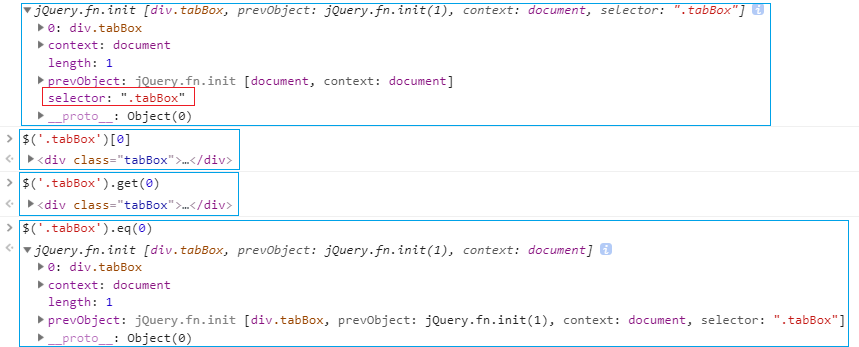
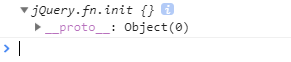
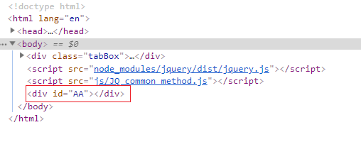

# JQ源码解析

## 基础介绍

- 类库, 插件, UI组件, 框架

> 1. 类库: JQ/ZEPTO... 提供一些真实项目中常用的方法, 任何项目都可以把类库导入进来, 调取里面的方法实现自己需要的业务逻辑(JQ是PC端考虑兼容性的, ZEPTO是手机端不考虑兼容的)
> 2. 插件: 具备一定的业务功能, 例如, 我们可以封装轮播图插件, 选项卡插件, 模态框插件等(插件规定了当前这个功能的样式解构, 把实现功能的js进行封装, 以后想实现这个功能直接导入插件即可) 
>   swiper\iscroll\jquery-dialog\jquery-drag\jquery-datepicker\Echarts...
> 3. UI组件: 把结构, css, js全部都封装好了, 我们想实现一个功能直接导入进来即可(偶尔需要我们修改一下) bootstrap...
> 4. 框架: 具备一定的编程思想, 要求我们按照框架的思想开发, 一般框架中提供了常用的类库方法, 提供了强大的功能插件, 有的也提供了强大的UI组件.  React(React native)\Vue\Angular\Backone\Sea.js\Require.js...

- jQuery(JQ)非常优秀的"类库"

>    基于原生js封装的一个类库,提供了很多的方法, 而且这些方法是兼容所有浏览器.
    JQ版本:
        v1 最常用的版本 1.8.3  1.9.3  1.11.3最常用的版本
        v2 为移动端做贡献, 不支持兼容性
        v3 vue\react崛起的时代, 用的人不多了. 和v1版本差不多

## 安装JQ

> 推荐版本v1.11.3
>
> 常用文档: http://jquery.cuishifeng.cn/

> webStorm提供了一个Terminal, 和DOS窗口类似, 在里面用npm下载

## JQ的核心结构

> JQ是一个类(也是一个普通对象): 函数的两种角色, JQ是一个类库提供了很多的方法, 其中这些方法有两部分
> ​            1. 放到JQ原型上的(jQuery.fn/jQuery.prototype), 这里面的方法是供JQ实例调取使用的
> ​            2. 把JQ当做一个普通对象, 在对象上设置一些私有的属性和方法, 这类方法以后用的时候直接jQuery.xxx()执行即可
>
> extend是把一个对象中的属性和方法扩展到指定的对象上

```javascript
(function () {
    var	version = "1.11.3",
        jQuery = function( selector, context ) {
            return new jQuery.fn.init( selector, context );//=> 创建了init这个类的实例, 也相当于创建了jQuery这个类的实例(因为在后面的时候, 让init.prototype=jQuery.prototype)
        };

    jQuery.fn = jQuery.prototype = {
        jquery: version,
        constructor: jQuery,//=> 当前类的原型重定向后, 自己开辟的堆内存中是没有constructor的, 需要手动添加保证它的完整性
        filter: function () {
            
        }
    };

    //=> 给JQ原型上增加extend方法, 同时把JQ当做一个普通对象, 给这个对象设置了一个私有的方法
    jQuery.extend = jQuery.fn.extend = function() {
        
    };
    
    jQuery.extend({
        isFunction: function( obj ) {
           
        },

        isArray: Array.isArray || function( obj ) {
           
        }
    })
    // jQuery:{extend:..., isFunction:..., isArray:...}

    jQuery.fn.extend({
        find:xxx,
    });
    //jQuery.prototype: {..., find:...}

    var init = jQuery.fn.init = function( selector, context ) {

    }
    init.prototype = jQuery.fn;//=> 把init当作一个类, 但是让这个类的原型指向了jQuery.prototype(init这个类的实例最后找到的也是jQuery这个类原型上的方法 =>init的实例其实也可以理解为jQuery的实例)

    window.jQuery = window.$ = jQuery;
})();
$().filter() //=> 创建一个jQuery类的实例, 可以调取JQ.fn中的方法
$.isFunction() //=> 把JQ当作一个普通对象, 直接的使用对象上扩展的那些私有属性和方法(这些方法和实例没关系)
```

- JQ源码为什么返回的不是jQuery的实例, 而是jQuery.prototype.init的实例?

```javascript
// 为什么不写成下面这样的格式?
let jQuery = function () {
    return new jQuery();
}
let f = jQuery();
```

> 因为会出现无限次函数递归调用.调用jQuery方法执行, 来返回创建的jQuery实例, 在创建jQuery实例的同时又会去执行jQuery, 所以才会出现了把别的类的原型指向jQuery的原型,用别的类来创建实例.

```javascript
let Fn = function () {
    return new Fn.prototype.init();
}
Fn.prototype.init = function () {

}
init.prototype = Fn.prototype;
let f = Fn();
```

- 面试题

```javascript
let Fn = function () {
    //...
}
Fn.prototype = {
    aa: function () {}
}
Fn().aa();
// 问: Fn()如何不new的情况下调用原型上的aa
// 正是jQuery源码所使用的思想
```

## JQ的选择器源码解读

- JQ选择器: 基于各种选择器创建JQ实例(JQ对象)

> 参数:
>
> 1. selector 选择器的类型(一般都是字符串, 但是支持函数或者元素对象)
> 2. context 基于选择器获取元素时指定的上下文(默认document)

- JQ对象: 一个类数组结构(JQ实例), 这个类数组集合中包含了获取到的元素

> ​    0: div.tabBox
> ​    length: 1
> ​    context: document  (默认的)
> ​    selector: '.tabBox'
> ​    \__proto\_\_: jQuery.prototype
> ​        add
> ​        ...
> ​        \_\_proto__: Object.prototype
> ​            hasOwnProperty
> ​            ...

```javascript
console.log($('.tabBox'));
```

> 可以看到输出的JQ对象\_\_proto\_\_指向的是Object, 是浏览器的问题, 只是没检测到JQ, 别的类库是可以检测到的


- 获取页面中的元素对象

> 1. 基于原生js提供的属性和方法获取的是 `原生js对象`
>     可以调取使用内置的JS属性和方法
>     ​    className
>     ​    onclick
>     ​    ...
> 2. 基于JQ选择器获取的是`JQ对象`
>     可以调取JQ原型上提供的属性和方法
>     ​    add
>     ​    find
>     ​    ...

### JQ对象和原生JS对象之间相互转换

- JQ对象转换原生JS对象

> 1. JQ对象是一个类数组集合, 集合中每个索引对应的都是原生JS对象, 我们基于索引获取即可

```javascript
// 约定俗成: 变量名前面是以$开始的, 一般代表基于JQ选择器获取的结果
let $tabBox = $('.tabBox'); 
let tabBox = $tabBox[0];
```
> 2. get是JQ原型上提供的方法, 供JQ实例基于索引获取到指定的JS对象
```javascript
let tabBox = $tabBox.get(0);
```
> **eq也是基于索引获取集合中的某一项, 只不过get获取的是js对象, eq会把获取的结果包裹成一个新的JQ对象(JQ实例返回)**
>
> 用eq(0)获得的JQ对象没有selector属性, 因为不是通过JQ选择器获取的

```javascript
$tabBox.eq(0);
```

> 在控制台输出上面 两种jq对象转js对象, 一种jq对象转新的jq对象

```javascript
console.log($('.tabBox'));
```



- 原生JS对象转换JQ对象

> 直接使用选择器把原生JS对象包裹起来, 就会把JS转换为JQ对象(因为$()就是创建JQ的一个实例)

```javascript
let tabBox=document.querySelector('.tabBox');
let $tabBox = $(tabBox);
```


### selector参数支持三种类型

- 选择器源码

```javascript
init = jQuery.fn.init = function( selector, context ) {
		var match, elem;

		// HANDLE: $(""), $(null), $(undefined), $(false)
    	// 如果没有传入参数, 就返回this, this是jQuery空实例
		if ( !selector ) {
			return this;
		}

		// Handle HTML strings
		if ( typeof selector === "string" ) {
			if ( selector.charAt(0) === "<" && selector.charAt( selector.length - 1 ) === ">" && selector.length >= 3 ) {
				// Assume that strings that start and end with <> are HTML and skip the regex check
				match = [ null, selector, null ];

			} else {
				match = rquickExpr.exec( selector );
			}

			// Match html or make sure no context is specified for #id
			if ( match && (match[1] || !context) ) {

				// HANDLE: $(html) -> $(array)
				if ( match[1] ) {
					context = context instanceof jQuery ? context[0] : context;

					// scripts is true for back-compat
					// Intentionally let the error be thrown if parseHTML is not present
					jQuery.merge( this, jQuery.parseHTML(
						match[1],
						context && context.nodeType ? context.ownerDocument || context : document,
						true
					) );

					// HANDLE: $(html, props)
					if ( rsingleTag.test( match[1] ) && jQuery.isPlainObject( context ) ) {
						for ( match in context ) {
							// Properties of context are called as methods if possible
							if ( jQuery.isFunction( this[ match ] ) ) {
								this[ match ]( context[ match ] );

							// ...and otherwise set as attributes
							} else {
								this.attr( match, context[ match ] );
							}
						}
					}

					return this;

				// HANDLE: $(#id)
				} else {
					elem = document.getElementById( match[2] );

					// Check parentNode to catch when Blackberry 4.6 returns
					// nodes that are no longer in the document #6963
					if ( elem && elem.parentNode ) {
						// Handle the case where IE and Opera return items
						// by name instead of ID
						if ( elem.id !== match[2] ) {
							return rootjQuery.find( selector );
						}

						// Otherwise, we inject the element directly into the jQuery object
						this.length = 1;
						this[0] = elem;
					}

					this.context = document;
					this.selector = selector;
					return this;
				}

			// HANDLE: $(expr, $(...))
			} else if ( !context || context.jquery ) {
				return ( context || rootjQuery ).find( selector );

			// HANDLE: $(expr, context)
			// (which is just equivalent to: $(context).find(expr)
			} else {
				return this.constructor( context ).find( selector );
			}

		// HANDLE: $(DOMElement)
		} else if ( selector.nodeType ) {
			this.context = this[0] = selector;
			this.length = 1;
			return this;

		// HANDLE: $(function)
		// Shortcut for document ready
		} else if ( jQuery.isFunction( selector ) ) {
			return typeof rootjQuery.ready !== "undefined" ?
				rootjQuery.ready( selector ) :
				// Execute immediately if ready is not present
				selector( jQuery );
		}

		if ( selector.selector !== undefined ) {
			this.selector = selector.selector;
			this.context = selector.context;
		}

		return jQuery.makeArray( selector, this );
	};
```

- 分析选择器源码, 我们发现selector传递的值支持三种类型

>     1. string: 基于选择器获取元素
>     2. 元素对象 selector.nodeType: 把JS对象转换为JQ对象
>     3. 函数: 把传递的函数执行, 把JQ当做实参传递给函数  selector(jQuery)

- 参数是字符串和元素对象上面都提到了, 所以只针对函数作为选择器的参数进行理解:

>     通过源码分析出选择器中参数还可以是函数, 
>
>     ​\$(​\$ =>{}), 函数调用选择器, 参数是函数时, 函数会执行, 而且传递的给函数的实参是jQuery. 
>
>     这样就可以把函数当做选择器的参数.

```javascript
$(function ($) {
    //=> $: 传递进来的jQuery
    console.log($);
})
```


> 有时怕\$被改成别的, \$()就不起作用了. 
>
> 正好函数的形参可以随便设置一个值, 反正都是接收的jQuery.**可以设置为\$.**

```javascript
$ = '哈哈哈';
// $();//=> Uncaught TypeError: $ is not a function
jQuery(function ($) {
    //=>$: 私有变量, 而且特定就是JQ
    $();
    console.log($());
})
```



> 正是用到了JQ选择器参数是函数, 函数会自动执行的特性, 
>
> **可以把jQuery(() => {}) 当做自执行函数, 前提是需要引入JQ库**

```javascript
jQuery(() => {
    //=> 函数肯定会执行, 但是会在当前页面中的HTML结构都加载完成后再执行(和后面要讲的事件有关系)
    //=> 函数执行会形成一个闭包
});
// 或者
$(function () {
    //=> 写自己的代码
})
```

## JQ中常用的方法1[each]

- JQ选择器的selector可以是字符串, 字符串这种格式也有两种

> 1. 选择器
> 2. HTML字符串拼接的结构: 把拼接好的HTML字符串转换为JQ对象, 然后可以基于appendTo等方法追加到页面中

```javascript
$('<div id="AA"></div>').appendTo(document.body);
```




### 三种each
- each: JQ中的each方法是用来进行遍历的(类似于数组的forEach)
> ​    可遍历的内容
> ​        1. 数组
> ​        2. 对象
> ​        3. 类数组(JQ对象)
> ​        ...

- 三种each

> 虽然有三种each, 但是从源码来看用的都是同一种each方法
> 1. 给jQuery设置的私有属性
>
>    ​	用法: \$.each()
>
> 2. 给实例设置的公有属性 
>
>    ​	用法: \$([selector]).each()
>
> 3. 内置的each

- JQ中each源码

```javascript
each: function( obj, callback, args ) {
    var value,
        i = 0,
        length = obj.length,
        isArray = isArraylike( obj );

    if ( args ) {
        if ( isArray ) {
            for ( ; i < length; i++ ) {
                value = callback.apply( obj[ i ], args );

                if ( value === false ) {
                    break;
                }
            }
        } else {
            for ( i in obj ) {
                value = callback.apply( obj[ i ], args );

                if ( value === false ) {
                    break;
                }
            }
        }

        // A special, fast, case for the most common use of each
    } else {
        if ( isArray ) {
            for ( ; i < length; i++ ) {
                value = callback.call( obj[ i ], i, obj[ i ] );

                if ( value === false ) {
                    break;
                }
            }
        } else {
            for ( i in obj ) {
                value = callback.call( obj[ i ], i, obj[ i ] );

                if ( value === false ) {
                    break;
                }
            }
        }
    }

    return obj;
}
```

- 1. 给jQuery设置的私有属性
> 遍历数组
>
> 参数的顺序和内置的forEach相反
```javascript
$.each([12, 23, 34], (index, item) => {
	console.log(index, item);
}) 
```

> 遍历对象
>
> 遍历对象的原理其实就是FOR-IN循环

```javascript
$.each({ name: 'xxxx', age: 25, 0: 100 }, (key, value) => {
	console.log(key,value);
}); 
```


- 2. 给实例设置的公有属性

```javascript
$('.tabBox li').each(function (index, item) {
    //=> 非箭头函数(因为箭头函数和上下文有关了): this===item, 当前遍历的这一项(原生js对象)
    //=> $(this)把当前遍历的这一项转换为JQ对象
    $(this).click(function () {
        //=> 给每一个遍历的li都绑定一个点击事件
        //this: 当前点击的li(原生js对象)
        $(this).css({
            color: 'red'
        })
    })
})
```

- 3. 内置的each

> 操作更简单, 因为JQ源码提供了自动使用each遍历, 不用手动遍历

```javascript
$('.tabBox li').click(function () {
    //=> 获取的JQ集合中有三个, 我们此处相当于给三个li都绑定了点击事件(JQ在调取click的时候, 会默认的把集合进行EACH遍历, 把每一项都给click了)
});
// css和addClass都是自动each遍历
$('.tabBox li').css({
    color: 'green'
});
$('.tabBox li').addClass('aaa');
```

### 转让$和jQuery名字

> 转让JQ使用$的权利

```javascript
jQuery.noConflict();
console.log($);//=> undefined
//还可以使用jQuery
jQuery();
```
> 深度转让: 把jQuery这个名字也让出去, 返回结果赋值给一个变量,  此时这个变量是新的JQ代言人
```javascript
let zzz = jQuery.noConflict(true);
console.log(jQuery);//=> undefined
console.log(zzz);
```


## JQ中常用的方法2

- 用jQuery写ajax

```javascript
$.ajax({
    url: 'json/product.json',
    methid: 'GET',
    dataType: 'json',// dataType数据类型 text是字符串类型
    async: false,// 是否异步
    success: function (result) {
        console.log(result);
    }
})
```


- 常用的筛选方法

> filter: 同级筛选
> children: 子集筛选
> find: 后代筛选

## 基于JQ完成选项卡

> HTML文件

```html
<div class="tabBox">
    <ul class="header clearfix">
        <li class="active">新闻</li>
        <li>电影</li>
        <li>音乐</li>
    </ul>
    <div class="active">时事新闻</div>
    <div>最新电影</div>
    <div>欧美音乐</div>
</div>
```

> js文件
>
> 当HTML结构都加载完成执行函数

```javascript
jQuery(function ($) {
    let $tabBox = $('.tabBox'),
        $tabList = $tabBox.find('ul>li');

    // let $tabList = $('.tabBox>.header>li'),
    //     $divList = $('.tabBox>div');

    //=> 基于JQ内置each机制, 给每个li都绑定了点击事件
    $tabList.on('click', function () {
        let index = $(this).index();
        $(this).addClass('active').siblings().removeClass('active')
            .parent().nextAll()
            .eq(index).addClass('active')
            .siblings('div').removeClass('active');
    })
})
```
> 也可以

```javascript
jQuery(function ($) {
    $('.tabBox>ul>li').on('click', function () {
        let index = $(this).index();
        $(this).addClass('active').siblings().removeClass('active')
            .parent().nextAll()
            .eq(index).addClass('active')
            .siblings('div').removeClass('active');
    })
})
```

