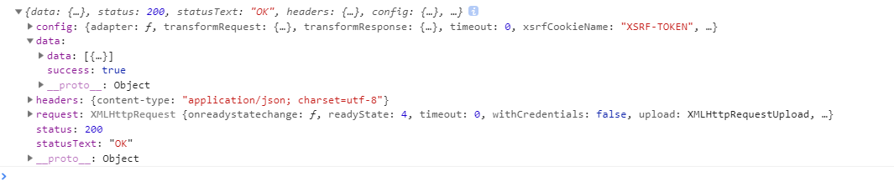
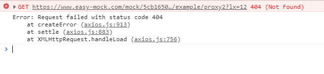
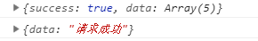
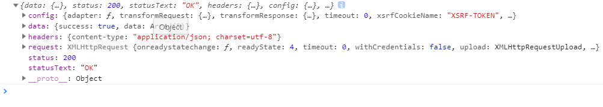
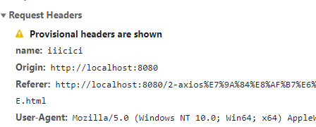
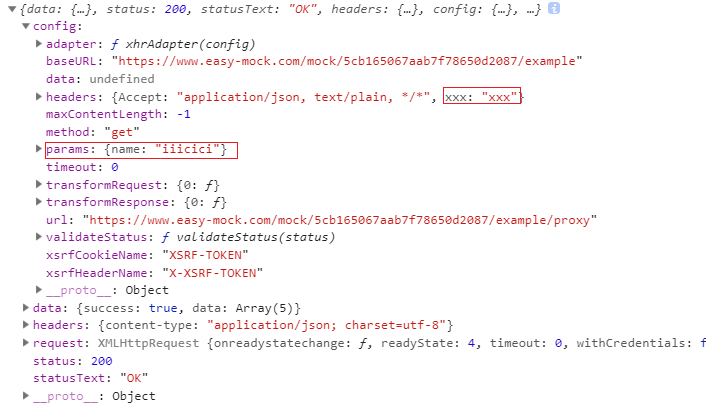
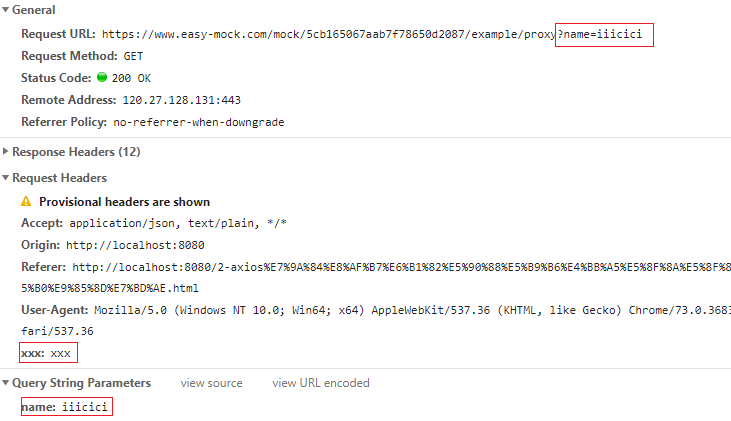
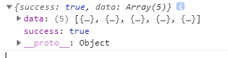
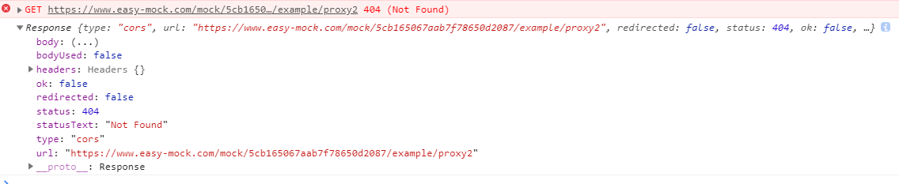

# axios

## axios的基础语法

axios: 它是一个类库, 基于PROMISE管理的AJAX库.

1.提供了对应请求方式的方法(例如: get/post/head/delete/put/option...)

​	`axios.get()`向服务器发送一个请求, 基于的是GET方式

​	...

2.支持的参数配置

`axios.get(url[,config])`

`axios.delete(url[,config])`

`axios.head(url[,config])`

`axios.post(url[,data[,config]])`

`axios.put(url[,data[,config]])`

`axios.patch(url[,data[,config]])`


axios不是一个类, 因为原型上没有方法和属性. 只是一个普通函数, 把函数当做一个对象, 对象里面有很多方法

3.基于GET或者POST方法发请求, 返回的结果都是PROMISE实例

### 向服务器发起请求

- 发送一个get请求

`axios.get(url[,config])`

问号传参的方式

```javascript
axios.get('http://localhost:3000/', {
    params: {//=> GET请求中, 会把PARAMS中的键值对拼接成URLENCODE格式的字符串, 然后以问号传递参数的方式, 传递给服务器, 类似于JQ-AJAX中的DATA(或者自己基于URL后面拼接也可以, 不用PARAMS)
        name: 'zhufeng',
        age: 9
    }
});
```


- 发送一个post请求

`axios.post(url[,data[,config]])`

这样发送一个post请求, 会发送一个RAW格式(JSON格式的字符串)

不是www-form-urlencoded格式, 是RAW格式(也就是JSON格式的字符串)

项目当中最常用的是www-form-urlencoded格式

```javascript
axios.post('http://localhost:3000/', {
    //=> 配置项中传递的内容都相当于基于请求主题传递给服务器, 但是传递给服务器的内容格式是RAW(也就是JSON格式的字符串), 不是X-WWW-FORM-URLENCODED
    name: 'zhufeng',
    age: 9
});
```


### 发送数据之后获取服务端返回的数据

- get请求 请求成功

如果直接在请求地址传递参数, 请求地址是带参数的, 同时config中的url显示问号传参的, 但是config中是没有params属性的.

如果在params中传递参数, 那么请求地址其实也是带参数的, 但是config中的url不显示问号传参的, config中的params是可以看到传参的.


```javascript
let promise = axios.get('https://www.easy-mock.com/mock/5cb165067aab7f78650d2087/example/proxy',{
    params: {
        lx: 12
    }
});
promise.then(result => {
    console.log(result);//服务器返回的不是直接传递回的数据, 而是一个对象
    /* 
            config: 基于axios发送请求的时候做的配置项(当前向服务器发送请求所使用的配置项)
            data: 从服务器获取的响应主体内容
            headers: 响应头信息
            request: 创建的AJAX实例(发送请求创建的)
            status: 状态码
            statusTest: 状态码的描述

            */
})
```


传递的params参数在config配置项中


- get请求 请求失败, 请求地址故意错误

```javascript
let promise = axios.get('https://www.easy-mock.com/mock/5cb165067aab7f78650d2087/example/proxy2',{
    params: {
        lx: 12
    }
});
promise.then(result => {
    console.log(result);//服务器返回的不是直接传递回的数据, 而是一个对象
    /* 
            config: 基于axios发送请求的时候做的配置项(当前向服务器发送请求所使用的配置项)
            data: 从服务器获取的响应主体内容
            headers: 响应头信息
            request: 创建的AJAX实例(发送请求创建的)
            status: 状态码
            statusTest: 状态码的描述

            */
}).catch(msg=>{
    console.log(msg);//=> 请求失败的原因

})
```




- post请求 请求成功

```javascript
let promise = axios.post('https://www.easy-mock.com/mock/5cb165067aab7f78650d2087/example/mock', {
    name: 'cici',
    age: 9
});
promise.then(result => {
    console.log(result);

}).catch(msg => {
    console.log(msg);

})
```


config中的data: 通过请求主体向服务器传递的内容, 是一个JSON格式的字符串

- post请求 请求失败  请求地址故意错误

```javascript
let promise = axios.post('https://www.easy-mock.com/mock/5cb165067aab7f78650d2087/example/mock2', {
    name: 'cici',
    age: 9
});
promise.then(result => {
    console.log(result);
}).catch(msg => {
    console.log(msg);
})
```


- head请求 请求成功

head请求只有响应头, 没有响应主体, 所以result对象中的data是空

```javascript
let promise = axios.head('package.json');
promise.then(result=>{
    console.log(result);
}).catch(msg=>{
    console.log(msg);
})
```


### 实际用法

1. 

```javascript
axios.get('https://www.easy-mock.com/mock/5cb165067aab7f78650d2087/example/proxy').then(result => {
    let { data } = result;
    console.log(data);
    console.log(data.data[0]);

}).catch(msg => {
    console.log(msg)
})
```

> proxy


> 结果


2. 通过promise可以发送完一个请求之后再发送一个请求, 解决了回调地狱的问题

在第一个then里面, 当异步请求发起之后, 并且请求成功执行result才会执行下一个then

return 可以有两种, 一种是返回具体值. 另一种是发起地址请求.

如果第一个then里面, return 的是一个具体值, 则下一个then中的result就是这个具体值

```javascript
axios.get('https://www.easy-mock.com/mock/5cb165067aab7f78650d2087/example/proxy').then(result => {
    let { data } = result;
    console.log(data);
    return axios.post('https://www.easy-mock.com/mock/5cb165067aab7f78650d2087/example/add');
}).then(result => {
    let { data } = result;
    console.log(data);

})
```

> add


> proxy


> 结果



## axios的请求合并以及参数配置

### 请求合并

 A和B同时成功才进行下一步(请求合并)

1. 设置全局变量接收A的结果

```javascript
let result = null;
axios.get('A').then(resultA => {
    return axios.get('B');
}).then(resultB => {
    //=> A和B都成功执行: RESULT-B是B成功后的结果
    //=> 全局RESULT是 A的结果
})
```

2. 通过axios提供的all方法

all源码

```javascript
axios.all = function all(promise){
    return Promise.all(promise);
};
```

all方法的使用:

```javascript
// sendAry存放三个AJAX请求的PROMISE实例
let sendAry = [
    axios.get('https://www.easy-mock.com/mock/5cb165067aab7f78650d2087/example/proxy'),
    axios.get('https://www.easy-mock.com/mock/5cb165067aab7f78650d2087/example/query'),
    axios.post('https://www.easy-mock.com/mock/5cb165067aab7f78650d2087/example/add')
];
//=> 三个请求都完成才做一些事情(可以基于all方法实现)
axios.all(sendAry).then(result => {
    console.log(result);//=> 是一个数组, 分别存储每一个请求的结果

});
```


### 分别操作 请求合并返回的数据

1. 已知返回的数据是一个数组, 可以利用解构进行拆分

```javascript
let sendAry = [
    axios.get('https://www.easy-mock.com/mock/5cb165067aab7f78650d2087/example/proxy'),
    axios.get('https://www.easy-mock.com/mock/5cb165067aab7f78650d2087/example/query'),
    axios.post('https://www.easy-mock.com/mock/5cb165067aab7f78650d2087/example/add')
];
axios.all(sendAry).then(result => {
    let [resA, resB, resC] = result;// 数组解构
});
```

2. axios提供了spread方法, 使用spread方法进行返回数据的操作

spread方法源码

```javascript
function spread (callback){
    return function wrap(arr){
        return callback.apply(null, arr);
    }
}
//使用
let wrap = axios.spread(() => {
    
})
```

使用:

```javascript
axios.all(sendAry).then(axios.spread((resA, resB, resC)=>{
    // RES-A/-B/-C分别代表三次请求的结果
    // 原理是JS中的柯理化函数
}));
```

### 参数配置

#### 尽量是公有的参数

- `axios.defaults.baseURL`: 服务器不变的地址

```javascript
//=> 初始化一些常用的配置项
axios.defaults.baseURL = 'https://www.easy-mock.com/mock/5cb165067aab7f78650d2087/example';
axios.get('/proxy').then((result) => {
    console.log(result);
})
```

- `axios.defaults.validateStatus`: 验证返回的状态码

```javascript
axios.defaults.baseURL = 'https://www.easy-mock.com/mock/5cb165067aab7f78650d2087/example';
axios.defaults.validateStatus = function validateStatus(status){
    //=> 自定义成功失败规则: RESOLVE / REJECT (默认规则: 状态码以2开头算作成功)
    return /^(2|3)\d{2}$/.test(status);
}
// 使用
axios.get('/proxy').then((result)=>{
    console.log(result);
})
```



如果把状态码4开头也算作成功, 错误报4开头的也算成功

```javascript
axios.defaults.baseURL = 'https://www.easy-mock.com/mock/5cb165067aab7f78650d2087/example',
axios.defaults.validateStatus = function validateStatus(status){
    return /^(2|3|4)\d{2}$/.test(status);
}
axios.get('proxy2').then((result)=>{
    console.log(result);
})
```


#### 尽量是私有的参数

- `axios.defaults.timeout`: 设置超时时间 (设置为私有因为每个请求的时间不一样,要分别设置超时时间)

```javascript
axios.defaults.timeout = 5000;
```

- `axios.defaults.headers`: 设置自定义请求头 (最好不要把每个请求的请求头传递数据都是一样的)

result中的headers是响应头信息

```javascript
axios.defaults.baseURL = 'https://www.easy-mock.com/mock/5cb165067aab7f78650d2087/example'
axios.defaults.headers = {//=> 自定义请求头
    name: 'iiicici'
}
axios.get('/proxy').then((result)=>{
    
})
```



- `axios.defaults.params`: GET传参(最好不要把每个请求的请求头传递数据都是一样的)

```javascript
axios.defaults.params={}
```

GET私有传递参数:

```javascript
axios.defaults.baseURL='https://www.easy-mock.com/mock/5cb165067aab7f78650d2087/example';
axios.get('/proxy',{
    params:{
        name:'iiicici'
    },
    headers:{
        xxx:'xxx'
    }
}).then((result)=>{
    console.log(result)
})
```





- `axios.defaults.data`: POST传参(最好不要把每个请求的请求头传递数据都是一样的)

```
axios.defaults.data={}
```

POST私有传递参数:

```javascript
// POST发起请求顺便传递参数
axios.defaults.baseURL='https://www.easy-mock.com/mock/5cb165067aab7f78650d2087/example';
axios.post('/mock',{//=> POST传参
    name:'iiicici'
},{
    headers:{//=> 设置配置信息, 设置headers信息
        xxx:'xxx'
    }
}).then((result) => {
    console.log(result);
})
```


- `axios.defaults.headers['Content-Type'] `: 设置在请求中基于请求主体向服务器发送内容的格式, 默认是RAW, 项目中常用的是URL-ENCODED格式

`axios.defaults.transformRequest`: 设置请求数据为urlencoded格式

```javascript
axios.defaults.baseURL='https://www.easy-mock.com/mock/5cb165067aab7f78650d2087/example';
//设置请求头中Content-Type
axios.defaults.headers['Content-Type']='application/x-www-form-urlencoded';
//设置请求的数据为urlencoded格式
axios.defaults.transformRequest = data => {
    //=> data: 就是请求主体中需要传递给服务器的内容
    let str = ``;
    for(let attr in data){
        if(data.hasOwnProperty(attr)){
            str += `${attr}=${data[attr]}&`;
        }
    }
    str = str.substring(0, str.length-1);
    return str;
};
axios.interceptors.response.use(result=>{
    return result;
},error=>{
    
});
axios.post('/mock',{
    lx: 12,
    sex: 1
}).then(result => {
    console.log(result);
})
```

未改变之前: 是RAW, 也就是JSON格式的字符串


改变之后: 手动设置为urlencoded格式


- `axios.interceptors.response.use(function success(result){},function error(err){})`

设置响应拦截器: 分别在响应成功和失败的时候做一些拦截处理(在执行成功后设定的方法之前, 先会执行拦截器中的方法)

1. 下面的成功执行内的参数是响应拦截器的返回值.如果没有返回值, 则参数是undefined

```javascript
axios.defaults.baseURL='https://www.easy-mock.com/mock/5cb165067aab7f78650d2087/example';
axios.interceptors.response.use(function success(result){
    console.log(result);// 没有返回值, 下面的成功执行的参数是函数的返回值.如果没有返回值, 则参数是undefined
}, function error(err){
    
});
axios.get('/proxy',{
    params:{
        name:'iiicici'
    } 
}).then((result)=>{
   console.log(result); 
});
```


2. 如果响应拦截器直接是返回的result中的data, 也就是 响应主体内容. 那么执行成功中的参数全是响应主体.

```javascript
//项目中常用的两个
axios.defaults.baseURL='https://www.easy-mock.com/mock/5cb165067aab7f78650d2087/example';
axios.interceptors.response.use(result => result.data);
axios.get('/proxy',{
    params:{
        name:'iiicici'
    }
}).then((result)=>{
    console.log(result);
}).catch((error)=>{
    console.log(error);
})

```



#### 常用的参数配置

```javascript
axios.defaults.baseURL='...';
axios.interceptors.reponse.use(result => result.data);
axios.defaults.validateStatus = status => /^(2|3)\d{2}$/.test(status);// 默认是只以2开头的算是成功
```


# FETCH中的基础语法

## 基础语法

FETCH不是AJAX, 它诞生的目的是为了代替AJAX, 它是JS中内置的API: 基于FETCH可以实现客户端和服务器端的信息通信

1. FETCH是ES2018规范中新增的API, 所以浏览器的支持度不是特别好(可以基于BABEL的最新语法解析包, 把其进行解析, 最后还是解析成AJAX), 想要兼容性好一些, 需要使用`fetch polyfill`
2. 使用FETCH发送请求

GET/HEAD等请求不能设置BODY, 只能在地址问号传参传递数据

不管服务器返回的状态是多少, FETCH都不认为是失败(哪怕是4或者5开头的状态码), 都执行的是THEN方法(需要我们自己进行异常抛出处理)

- get发送请求成功

```javascript
fetch('https://www.easy-mock.com/mock/5cb165067aab7f78650d2087/example/proxy', {
    method: 'GET',
    headers: {
        //=> 设置请求头
        'Content-Type': 'x-www-form-urlencoded'
    },
    credentials: 'include'//=> 不管同源还是跨域请求都带着COOKIE信息
}).then(result => {
    console.log(result);
    /* 
            headers:{} 包含响应头信息
            redirected: false 是否重定向
            status: 状态码
            statusText: 状态码描述
            type: 类型 跨域还是不跨域
            	arrayBuffer()
                blob()
                json()
                text()
                ...
                基于这些方法可以快速的把从服务器获取的结果找到
             */
});
```

请求easy-mock地址


请求本地的1.json


- get发送请求失败

```javascript
fetch('https://www.easy-mock.com/mock/5cb165067aab7f78650d2087/example/proxy2', {
    method: 'GET',
    headers: {
        'Content-Type': 'x-www-form-urlencoded'
    },
    credentials: 'include'//=> 不管同源还是跨域请求都带着COOKIE信息
}).then(result => {
    console.log(result);
});
```



- post请求

传递参数只能在body中设置字符串, 不能设置对象形式的参数

```javascript
fetch('https://www.easy-mock.com/mock/5cb165067aab7f78650d2087/example/mock', {
    method: 'post',
    body: "name=iiicic&age=1"//=> body中只支持字符串(GET请求还无法设置body,只能在地址中设置参数)
}).then(result => {
    let { status } = result;
    if (/^(4|5)\d{2}$/.test(status)) {
        throw new Error('query data is error!')
        return;
    }
    return result.json();

}).then(result => {
    console.log(result)
}).catch(msg => {
    console.log(msg);
})
```


## 实际用法

因为不论是请求成功还是失败都执行then, 所以要自己获取状态码进行判断.

- 请求错误

```javascript
fetch('https://www.easy-mock.com/mock/5cb165067aab7f78650d2087/example/proxy2').then(result=>{
    // 把状态码解构出来
    let {status} = result;
    if(/^(4|5)\d{2}$/.test(status)){
        throw new Error('query data is error!');
        return;
    }
    return result.json();
    // 如果成功的话走then, 如果抛出异常的话走catch
}).then(result=>{
    console.log(result);
}).catch(msg=>{
    console.log(msg);
});
```


- 请求成功

```javascript
fetch('https://www.easy-mock.com/mock/5cb165067aab7f78650d2087/example/proxy').then(result=>{
    let {status} = result;
    if(/^(4|5)\d{2}$/.test(status)){
        throw new Error('query data is error!')
        return;
    }
    return retult.json();
}).then(result=>{
    console.log(result);
}).catch(msg=>{
    console.log(msg);
})
```


# 基于PROMISE封装属于自己的AJAX库


# [京东投票]

## 项目概述

1. 打开项目

`$ yarn install / $ npm install`: 跑环境(把项目依赖的插件进行安装)
`$ node admin.js`: 启服务(把自己的计算机作为服务器,)

2. API.TXT: API接口文档

真实项目中, 后台开发人员会给前端开发人员提供一个技术文档(接口文档), 文档中描述了前端需要调取后台的某些接口实现的某些功能, 并且标注了请求的地址、请求方式、传递给服务器的内容、以及服务器返回的结果等信息

这就是前后端分离： 前端开发这不需要考虑后台是基于什么技术怎么实现的， 我们只需要按照API文档中提供的信息， 去发送请求传递内容即可，这样就可以获取我们需要的数据（API文档就是约束前端和后台的规范文档）

## 跑通数据获取的逻辑

### 面试题

> 有一万条数据, 想让其绑定到页面中, 怎么做好一些?

```
1. 文档碎片: 遍历数据, 把对应的数据和结构都添加到文档碎片中, 在把文档碎片插入到页面中(优势: 减少了DOM的回流 => 基于字符串拼接也可以)
2. 虚拟DOM: 类似于REACT框架, 基于虚拟DOM以及DIFF算法, 也可以优化数据绑定
3. 其实从本质来讲怎么做都不是最好的, 我们不应该出现1万条这种大数据量的绑定
	因为
	从服务器获取1万条消耗很多时间
	页面渲染1万条也会消耗很多时间
```

#### 异步数据加载(分页加载)

[需要服务器端做支持]

1. 客户端向服务器端发送一个GET请求, 传递给服务器: 每页展示的条数, 当前要展示的页数等信息, 例如传递的是 ?limit=20&page=1(每页展示20条, 当前展示第一页)
2. 服务器接收到请求后, 在所有的数据中把 第一页的20条数据 返回给客户端
3. 当用户下拉加载更多或者点击第二页等页码按钮等时候, 重复第一步, 把对应要展示的页码传递给服务器, 服务器返回对应页码中的数据
4. ...


## 首页数据的下拉加载和搜索


## 导航插件的构建


## 登录页面